# [大众点评订单系统分库分表实践](https://tech.meituan.com/2016/11/18/dianping-order-db-sharding.html)

2016年11月18日 作者: 华慰 [文章链接](https://tech.meituan.com/2016/11/18/dianping-order-db-sharding.html) 3307字 7分钟阅读

原大众点评的订单单表早就已经突破两百G，由于查询维度较多，即使加了两个从库，优化索引，仍然存在很多查询不理想的情况。去年大量抢购活动的开展，使数据库达到瓶颈，应用只能通过限速、异步队列等对其进行保护；业务需求层出不穷，原有的订单模型很难满足业务需求，但是基于原订单表的DDL又非常吃力，无法达到业务要求。随着这些问题越来越突出，订单数据库的切分就愈发急迫了。

这次切分，我们的目标是未来十年内不需要担心订单容量的问题。

先对订单库进行垂直切分，将原有的订单库分为基础订单库、订单流程库等，本文就不展开讲了。
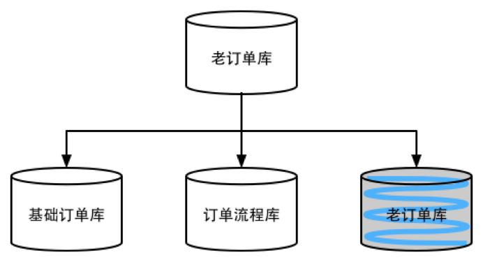

垂直切分

垂直切分缓解了原来单集群的压力，但是在抢购时依然捉襟见肘。原有的订单模型已经无法满足业务需求，于是我们设计了一套新的统一订单模型，为同时满足C端用户、B端商户、客服、运营等的需求，我们分别通过用户ID和商户ID进行切分，并通过PUMA（我们内部开发的MySQL binlog实时解析服务）同步到一个运营库。
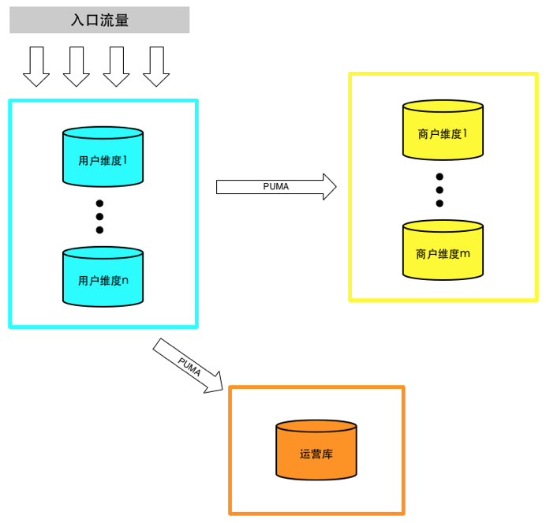

水平切分

## 切分策略

### 1. 查询切分

将ID和库的Mapping关系记录在一个单独的库中。
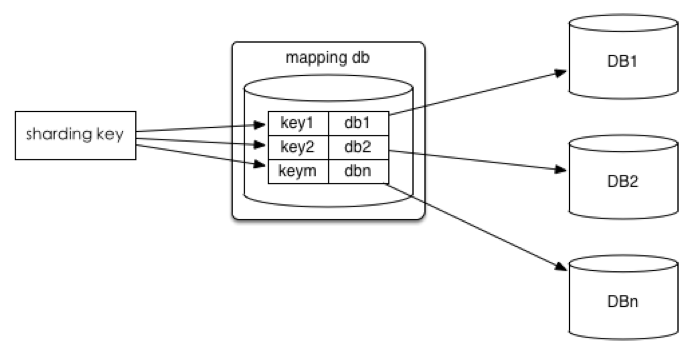

查询切分

优点：ID和库的Mapping算法可以随意更改。
缺点：引入额外的单点。

### 2. 范围切分

比如按照时间区间或ID区间来切分。
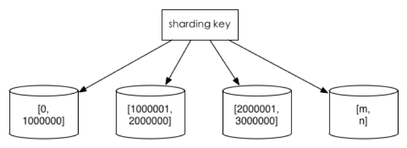

范围切分

优点：单表大小可控，天然水平扩展。
缺点：无法解决集中写入瓶颈的问题。

### 3. Hash切分

一般采用Mod来切分，下面着重讲一下Mod的策略。
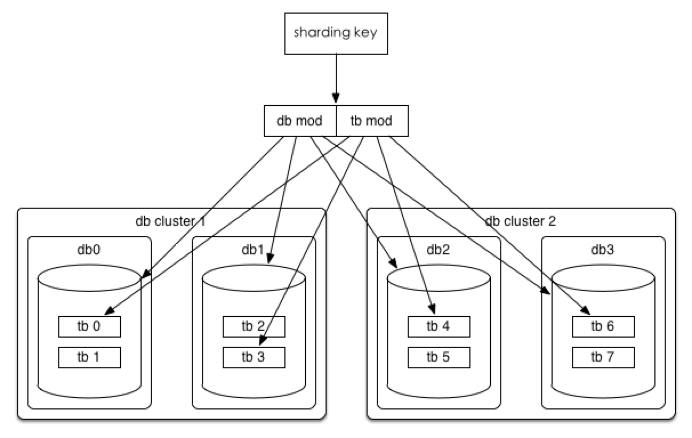

hash切分

数据水平切分后我们希望是一劳永逸或者是易于水平扩展的，所以推荐采用mod 2^n这种一致性Hash。

以统一订单库为例，我们分库分表的方案是32*32的，即通过UserId后四位mod 32分到32个库中，同时再将UserId后四位Div 32 Mod 32将每个库分为32个表，共计分为1024张表。线上部署情况为8个集群(主从)，每个集群4个库。

为什么说这种方式是易于水平扩展的呢？我们分析如下两个场景。

#### 场景一：数据库性能达到瓶颈

#### 方法一

按照现有规则不变，可以直接扩展到32个数据库集群。
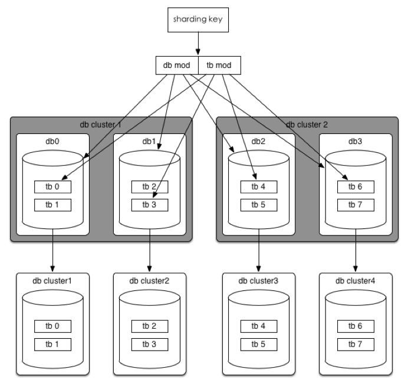

扩展方法

#### 方法二

如果32个集群也无法满足需求，那么将分库分表规则调整为(32*2^n)*(32⁄2^n)，可以达到最多1024个集群。
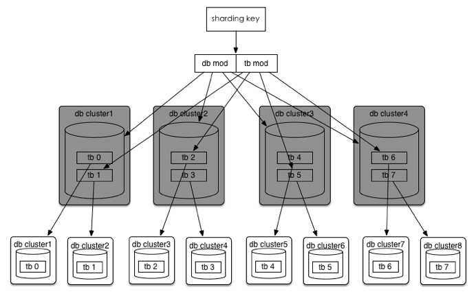

扩展方法

#### 场景二：单表容量达到瓶颈（或者1024已经无法满足你）

#### 方法：

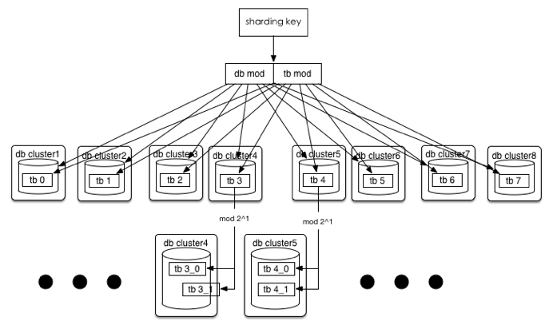

扩展方法

假如单表都已突破200G，200*1024=200T（按照现有的订单模型算了算，大概一万千亿订单，相信这一天，嗯，指日可待！），没关系，32*(32*2^n)，这时分库规则不变，单库里的表再进行裂变，当然，在目前订单这种规则下（用userId后四位 mod）还是有极限的，因为只有四位，所以最多拆8192个表，至于为什么只取后四位，后面会有篇幅讲到。

另外一个维度是通过ShopID进行切分，规则8*8和UserID比较类似，就不再赘述，需要注意的是Shop库我们仅存储了订单主表，用来满足Shop维度的查询。

## 唯一ID方案

这个方案也很多，主流的有那么几种:

### 1. 利用数据库自增ID

优点：最简单。 缺点：单点风险、单机性能瓶颈。

### 2. 利用数据库集群并设置相应的步长（Flickr方案）

优点：高可用、ID较简洁。 缺点：需要单独的数据库集群。

### 3. Twitter Snowflake

优点：高性能高可用、易拓展。 缺点：需要独立的集群以及ZK。

### 4. 一大波GUID、Random算法

优点：简单。 缺点：生成ID较长，有重复几率。

### 我们的方案

为了减少运营成本并减少额外的风险我们排除了所有需要独立集群的方案，采用了带有业务属性的方案： > 时间戳+用户标识码+随机数

有下面几个好处：

- 方便、成本低。
- 基本无重复的可能。
- 自带分库规则，这里的用户标识码即为用户ID的后四位，在查询的场景下，只需要订单号就可以匹配到相应的库表而无需用户ID，只取四位是希望订单号尽可能的短一些，并且评估下来四位已经足够。
- 可排序，因为时间戳在最前面。

当然也有一些缺点，比如长度稍长，性能要比int/bigint的稍差等。

## 其他问题

- 事务支持：我们是将整个订单领域聚合体切分，维度一致，所以对聚合体的事务是支持的。
- 复杂查询：垂直切分后，就跟join说拜拜了；水平切分后，查询的条件一定要在切分的维度内，比如查询具体某个用户下的各位订单等；禁止不带切分的维度的查询，即使中间件可以支持这种查询，可以在内存中组装，但是这种需求往往不应该在在线库查询，或者可以通过其他方法转换到切分的维度来实现。

## 数据迁移

数据库拆分一般是业务发展到一定规模后的优化和重构，为了支持业务快速上线，很难一开始就分库分表，垂直拆分还好办，改改数据源就搞定了，一旦开始水平拆分，数据清洗就是个大问题，为此，我们经历了以下几个阶段。

### 第一阶段

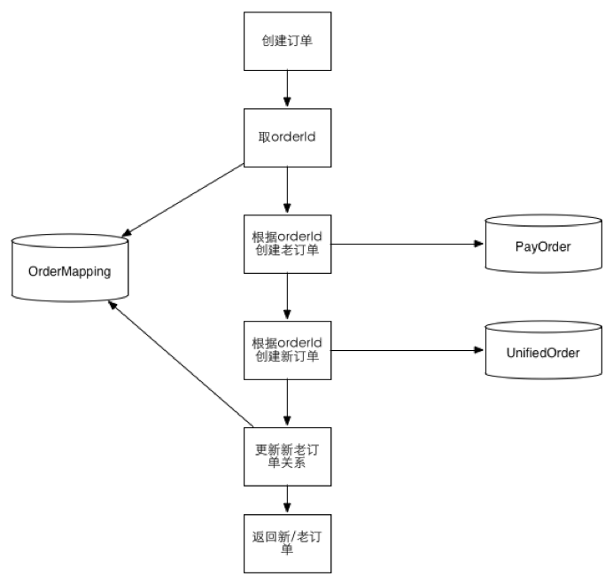

数据迁移

- 数据库双写（事务成功以老模型为准），查询走老模型。
- 每日job数据对账（通过DW），并将差异补平。
- 通过job导历史数据。

### 第二阶段

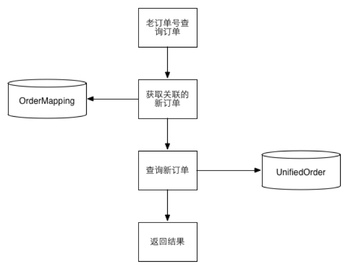

数据迁移

- 历史数据导入完毕并且数据对账无误。
- 依然是数据库双写，但是事务成功与否以新模型为准，在线查询切新模型。
- 每日job数据对账，将差异补平。

### 第三阶段

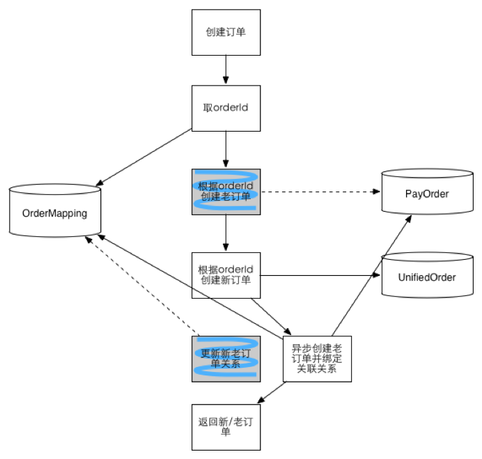

数据迁移

- 老模型不再同步写入，仅当订单有终态时才会异步补上。
- 此阶段只有离线数据依然依赖老的模型，并且下游的依赖非常多，待DW改造完就可以完全废除老模型了。

## 总结

并非所有表都需要水平拆分，要看增长的类型和速度，水平拆分是大招，拆分后会增加开发的复杂度，不到万不得已不使用。

在大规模并发的业务上，尽量做到在线查询和离线查询隔离，交易查询和运营/客服查询隔离。

拆分维度的选择很重要，要尽可能在解决拆分前问题的基础上，便于开发。

数据库没你想象的那么坚强，需要保护，尽量使用简单的、良好索引的查询，这样数据库整体可控，也易于长期容量规划以及水平扩展。

**最后感谢一下棒棒的DBA团队和数据库中间件团队对项目的大力协助！**