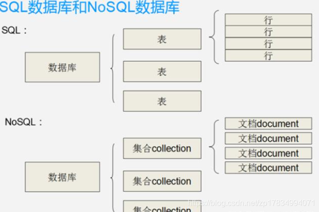

# NoSQL与关系型数据库全面对比

[天ヾ道℡酬勤](https://blog.csdn.net/zp17834994071) 2020-09-01 09:56:17  1678  收藏 1

分类专栏： [大数据](https://blog.csdn.net/zp17834994071/category_10068192.html) [大数据](https://blog.csdn.net/zp17834994071/category_10068192.html) 文章标签： [大数据](https://www.csdn.net/tags/MtTaYg5sNzg2NS1ibG9n.html)

版权

我们总在说各种数据库的使用，以及各个数据库的优缺点，每个数据库都有自己的所擅长的领域，但选择什么样的数据库才是重点，那么问题来了，数据库到底是怎么划分的，有什么讲究呢？
数据库大致分为两大类：**关系型数据库和非关系型数据库**

## 关系型数据库

顾名思义，就是表与表之间有关系，平时我们所用到的MSSQL Server、Oracle、Mysql等都是关系型数据库，它们是建立在关系模型基础上的数据库，依靠表、字段等关系模型，结合集合代数等数学方法来处理数据。

关系型数据库中的表都是存储一些格式化的数据结构，每个元组字段的组成都一样，即使不是每个元组都需要所有的字段，但数据库会为每个元组分配所有的字段，这样的结构可以便于表与表之间进行连接等操作，但从另一个角度来说它也是关系型数据库性能瓶颈的一个因素。
并且数据库的数据主要存储在磁盘。
数据库的 SQL 语句强大，支持更为复杂的计算。

## NoSQL

就是表与表之间没有直接关系，创建的话也不用遵循三大范式，并且是以键值对存储，它的结构不固定，每一个元组可以有不一样的字段，每个元组可以根据需要增加一些自己的键值对，这样就不会局限于固定的结构，可以减少一些时间和空间的开销。可以处理超大量的数据，运行在便宜的PC服务器集群上，能很大程度上的节省开销。

NoSQL 的数据主要存储在内存中（部分可以持久化到磁盘），而且数据结构比较简单，虽然能处理很多的问题，但是其功能毕竟是有限的，不如数据库的 SQL 语句强大，支持更为复杂的计算。

再次，NoSQL 并不完全安全稳定，由于它基于内存，一旦停电或者机器故障数据就很容易丢失数据，其持久化能力也是有限的，而基于磁盘的数据库则不会出现这样的问题。最后，其数据完整性、事务能力、安全性、可靠性及可扩展性都远不及数据库。

Nosql没有行、列的概念，用Key-Value的形式来存储数据，集合就相当于“表”，文档就相当于“行”。一般而言，Nosql型数据库数据模型比较简单，需要灵活性更强的IT 系统且对数据库性能要求较高，不需要高度的数据一致性，对于给定key，比较容易映射复杂值的环境，因此被广泛应用于大数据分析等方面。

## NoSQL与关系型数据库对比

### 1、存储格式

- **关系型数据库**：表格式，行和列
- **NoSQL**：文档、键值对、图结构

### 2、存储规范

- **关系型数据库**：规范性，避免重复
- **NoSQL**：鼓励冗余

### 3、存储扩展

- **关系型数据库**：纵向扩展(横向扩展有限)
- **NoSQL**：横向扩展，分布式

### 4、查询方式

- **关系型数据库**：结构化查询
- **NoSQL**：非结构化查询语言SQL

### 5、事务

- **关系型数据库**：支持事务
- **NoSQL**：不支持事务一致性

### 6、性能

- **关系型数据库**：读写性能差
- **NoSQL**：读写性能高

### 7、成本

- **关系型数据库**：成本高
- **NoSQL**：简单易部署，开源，成本低

### 8、存储方式

- **关系型数据库**：数据主要存储在磁盘中
- **NoSQL**：数据主要存储在内存中（部分可以持久化到磁盘）

### 9、建表原则

- **关系型数据库**：建立在关系模型基础上的数据库，依靠表、字段等关系模型，以列或字段构建关联
- **NoSQL**：数据模型比较简单，用Key-Value的形式来存储数据，集合就相当于“表”，文档就相当于“行”，不需要高度的数据一致性

建表方式如下图：

## 从事务上具体分析区别

**关系型数据库的最大特点就是事务的一致性**
传统的关系型数据库读写操作都是事务的，具有ACID的特点，这个特性使得关系型数据库可以用于几乎所有对一致性有要求的系统中，如典型的银行系统。

但是，在网页应用中，尤其是SNS应用中，一致性却不是显得那么重要，用户A看到的内容和用户B看到同一用户C内容更新不一致是可以容忍的，或者说，两个人看到同一好友的数据更新的时间差那么几秒是可以容忍的，因此，关系型数据库的最大特点在这里已经无用武之地，起码不是那么重要了。

相反地，关系型数据库为了维护一致性所付出的巨大代价就是其读写性能比较差，而像微博、facebook这类SNS的应用，对并发读写能力要求极高，关系型数据库已经无法应付(在读方面，传统上为了克服关系型数据库缺陷，提高性能，都是增加一级memcache来静态化网页，而在SNS中，变化太快，memchache已经无能为力了)。

因此，这个时候就必须用新的一种数据结构存储来代替关系数据库。NOSQL应运而生，正是因为NOSQL不需要高度的数据一致性，对于给定key，比较容易映射复杂值的环境， 读写性能高，就可以解决上述的种种问题。

**关系数据库的另一个特点就是其具有固定的表结构**
正因为这样，因此，其扩展性极差，而在SNS中，系统的升级，功能的增加，往往意味着数据结构巨大变动，这一点关系型数据库也难以应付，需要新的结构化数据存储。

于是，非关系型数据库就又有用武之地了，由于不可能用一种数据结构化存储应付所有的新的需求，因此，非关系型数据库严格上不是一种数据库，应该是一种数据结构化存储方法的集合。 必须强调的是，数据的持久存储，尤其是海量数据的持久存储，还是需要一种关系数据库。

## 关系型数据库遇到的瓶颈

#### 高并发读写需求

网站的用户并发性非常高，往往达到每秒上万次读写请求，对于传统关系型数据库来说，硬盘I / O是一个很大的瓶颈 。
海量数据的高效率读写 网站每天产生的数据量是巨大的，对于关系型数据库来说，在一张包含海量数据的表中查询，效率是非常低的 。

#### 扩展性和可用性

在基于web的结构当中，数据库是最难进行横向扩展的，当一个应用系统的用户量和访问量与日俱增的时候，数据库却没有办法像web server和app server那样简单的通过添加更多的硬件和服务节点来扩展性能和负载能力。
对于很多需要提供24小时不间断服务的网站来说，对数据库系统进行升级和扩展是非常痛苦的事情，往往需要停机维护和数据迁移。
对网站来说，关系型数据库的很多特性就不再需要了。

#### 事务一致性

关系型数据库在对事物一致性的维护中有很大的开销，而现在很多web2.0系统对事物的读写一致性都不高.

#### 读写实时性

对关系数据库来说，插入一条数据之后立刻查询，是肯定可以读出这条数据的，但是对于很多web应用来说，并不要求这么高的实时性，比如发一条消息之后，过几秒乃至十几秒之后才看到这条动态是完全可以接受的 .

#### 复杂SQL，特别是多表关联查询

任何大数据量的web系统，都非常忌讳多个大表的关联查询，以及复杂的数据分析类型的复杂SQL报表查询，特别是SNS类型的网站，从需求以及产品阶级角度，就避免了这种情况的产生。往往更多的只是单表的主键查询，以及单表的简单条件分页查询，SQL的功能极大的弱化了 .

在关系型数据库中，导致性能欠佳的最主要原因是多表的关联查询，以及复杂的数据分析类型的复杂SQL报表查询。

为了保证数据库的ACID特性，我们必须尽量按照其要求的范式进行设计，关系型数据库中的表都是存储一个格式化的数据结构。每个元组字段的组成都是一样，即使不是每个元组都需要所有的字段，但数据库会为每个元组分配所有的字段，这样的结构可以便于标语表之间进行链接等操作，但从另一个角度来说它也是关系型数据库性能瓶颈的一个因素。

## NoSQL优劣

NoSQL一词，用于指代那些非关系型的，分布式的，且一般不保证遵循ACID原则的数据存储系统。
非关系型数据库提出另一种理念，例如，以键值对存储，且结构不固定，每一个元组可以有不一样的字段，每个元组可以根据需要增加一些自己的键值对，这样就不会局限于固定的结构，可以减少一些时间和空间的开销。

使用这种方式，用户可以根据需要去添加自己需要的字段，这样，为了获取用户的不同信息，不需要像关系型数据库中，要对多表进行关联查询。仅需要根据id取出相应的value就可以完成查询。但非关系型数据库由于很少的约束，他也不能够提供像SQL所提供的where这种对于字段属性值情况的查询。

并且难以体现设计的完整性，它只适合存储一些较为简单的数据，对于需要进行较复杂查询的数据，SQL数据库显的更为合适。

## 总结：

**1. 实质**
非关系型数据库的实质：非关系型数据库产品是传统关系型数据库的功能阉割版本，通过减少用不到或很少用的功能，来大幅度提高产品性能。

**2. 价格**
目前基本上大部分主流的非关系型数据库都是免费的。而比较有名气的关系型数据库，比如Oracle、DB2、MSSQL是收费的。虽然Mysql免费，但它需要做很多工作才能正式用于生产。

**3. 功能**
实际开发中，有很多业务需求，其实并不需要完整的关系型数据库功能，非关系型数据库的功能就足够使用了。这种情况下，使用性能更高、成本更低的非关系型数据库当然是更明智的选择。

非关系型数据库在某些特定的领域很好用，比如redis作为数据的缓存，数据是存储在内存中，所以性能非常好。

非关系数据库只实现了关系数据库一部分的、功能，但因此很大程度上扩充了某些功能的性能。一般用关系数据库就够了。

严格说mysql在关系数据库兄是实现得也不是很完整的一类，从而在某些查询上，mysql有超出严格关系数据库很多的性能。具体应用需要权衡，特别是关联条件很多的数据，非关系数据库一般不合适，有时候甚至mysql也不合适。

综上所述，所以什么时候用NoSQL与关系型数据库，取决于业务需求，以及你对数据库的理解程度，和对他们的优劣是否有足够的认知和理解。好了NoSQL与关系型数据库全面对比就说到这里，希望通过这篇文章能让你们更清晰的理解NoSQL与关系型数据库