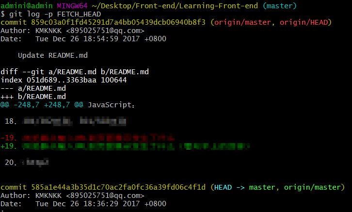

# [git fetch & pull详解](https://www.cnblogs.com/runnerjack/p/9342362.html)

## 1、简单概括

先用一张图来理一下`git fetch`和`git pull`的概念：


可以简单的概括为：

`git fetch`是将远程主机的最新内容拉到本地，用户在检查了以后决定是否合并到工作本机分支中。

而`git pull` 则是将远程主机的最新内容拉下来后直接合并，即：`git pull = git fetch + git merge`，这样可能会产生冲突，需要手动解决。

下面我们来详细了解一下`git fetch` 和`git pull` 的用法。 


## 2、分支的概念

在介绍两种方法之前，我们需要先了解一下分支的概念： 
分支是用来标记特定代码的提交，每一个分支通过SHA1sum值来标识，所以对分支的操作是轻量级的，你改变的仅仅是SHA1sum值。

如下图所示，当前有2个分支，A,C,E属于master分支，而A,B，D,F属于dev分支。

```
A----C----E（master）
 \
  B---D---F(dev)
```

- 1
- 2
- 3

它们的head指针分别指向E和F，对上述做如下操作：

```
git checkout master  //选择or切换到master分支
git merge dev        //将dev分支合并到当前分支(master)中
```

- 1
- 2

合并完成后：

```
A---C---E---G(master)
 \         /
  B---D---F（dev）
```

- 1
- 2
- 3

现在ABCDEFG属于master，G是一次合并后的结果，是将E和Ｆ的代码合并后的结果，可能会出现冲突。而ABDF依然属于dev分支。可以继续在dev的分支上进行开发:

```
A---C---E---G---H(master)
 \         /
  B---D---F---I（dev）
```

- 1
- 2
- 3
- 4

分支（branch）的基本操作：

```
git branch //查看本地所有分支 

git branch -r //查看远程所有分支

git branch -a //查看本地和远程的所有分支

git branch <branchname> //新建分支

git branch -d <branchname> //删除本地分支

git branch -d -r <branchname> //删除远程分支，删除后还需推送到服务器
git push origin:<branchname>  //删除后推送至服务器

git branch -m <oldbranch> <newbranch> //重命名本地分支
/**
*重命名远程分支：
*1、删除远程待修改分支
*2、push本地新分支到远程服务器
*/

//git中一些选项解释:

-d
--delete：删除

-D
--delete --force的快捷键

-f
--force：强制

-m
--move：移动或重命名

-M
--move --force的快捷键

-r
--remote：远程

-a
--all：所有
```

 

## 3、git fetch 用法

git fetch 命令：

```
$ git fetch <远程主机名> //这个命令将某个远程主机的更新全部取回本地
```

- 1

如果只想取回特定分支的更新，可以指定分支名：

```
$ git fetch <远程主机名> <分支名> //注意之间有空格
```

- 1

最常见的命令如取回`origin` 主机的`master` 分支：

```
$ git fetch origin master
```

- 1

取回更新后，会返回一个`FETCH_HEAD` ，指的是某个branch在服务器上的最新状态，我们可以在本地通过它查看刚取回的更新信息：

```
$ git log -p FETCH_HEAD
```

- 1

如图： 


可以看到返回的信息包括更新的文件名，更新的作者和时间，以及更新的代码（19行红色[删除]和绿色[新增]部分）。

我们可以通过这些信息来判断是否产生冲突，以确定是否将更新merge到当前分支。 


## 4、git pull 用法

前面提到，`git pull` 的过程可以理解为：

```
git fetch origin master //从远程主机的master分支拉取最新内容 
git merge FETCH_HEAD    //将拉取下来的最新内容合并到当前所在的分支中
```

- 1
- 2

即将远程主机的某个分支的更新取回，并与本地指定的分支合并，完整格式可表示为：

```
$ git pull <远程主机名> <远程分支名>:<本地分支名>
```

- 1

如果远程分支是与当前分支合并，则冒号后面的部分可以省略：

```
$ git pull origin next
```


# [真正理解 git fetch, git pull 以及 FETCH_HEAD（转）](https://www.cnblogs.com/zdfjf/p/7323694.html)

转自http://www.cnblogs.com/ToDoToTry/p/4095626.html

 

真正理解 git fetch, git pull 

要讲清楚git fetch，git pull,必须要附加讲清楚git remote，git merge 、远程repo， branch 、 commit-id 以及 FETCH_HEAD。

\1. 【git remote】首先， git是一个分布式的结构，这意味着本地和远程是一个相对的名称。

本地的repo仓库要与远程的repo配合完成版本对应必须要有 git remote子命令，通过git remote add来添加当前本地长度的远程repo， 有了这个动作本地的repo就知道了当遇到git push 的时候应该往哪里提交代码。

\2. 【git branch】其次，git天生就是为了多版本分支管理而创造的，因此分支一说，不得不提， 分支就相当于是为了单独记录软件的某一个发布版本而存在的，既然git是分布式的，便有了本地分支和远程分支一说，git branch 可以查看本地分支， git branch -r  可以用来查看远程分支。 本地分支和远程分支在git push 的时候可以随意指定，交错对应，只要不出现版本从图即可。

\3. 【git merge】再者，git的分布式结构也非常适合多人合作开发不同的功能模块，此时如果每个人都在其各自的分支上开发一个相对独立的模块的话，在每次release制作时都需先将各成员的模块做一个合并操作，用于合并各成员的工作成果，完成集成。 此时需要的就是git merge.

4.【git push 和 commit-id】在每次本地工作完成后，都会做一个git commit 操作来保存当前工作到本地的repo， 此时会产生一个commit-id，这是一个能唯一标识一个版本的序列号。 在使用git push后，这个序列号还会同步到远程repo。

在理解了以上git要素之后，分析git fetch 和 git pull 就不再困难了。 

 

**首先，git fetch 有四种基本用法**

\1. git fetch       →→ 这将更新git remote 中所有的远程repo 所包含分支的最新commit-id, 将其记录到.git/FETCH_HEAD文件中

\2. git fetch remote_repo     →→ 这将更新名称为remote_repo 的远程repo上的所有branch的最新commit-id，将其记录。 

\3. git fetch remote_repo remote_branch_name     →→ 这将这将更新名称为remote_repo 的远程repo上的分支： remote_branch_name

\4. git fetch remote_repo remote_branch_name:local_branch_name    →→ 这将这将更新名称为remote_repo 的远程repo上的分支： remote_branch_name ，并在本地创建local_branch_name 本地分支保存远端分支的所有数据。

 

**FETCH_HEAD：** 是一个版本链接，记录在本地的一个文件中，指向着目前已经从远程仓库取下来的分支的末端版本。

 

**git pull 的运行过程：**

git pull : 首先，基于本地的FETCH_HEAD记录，比对本地的FETCH_HEAD记录与远程仓库的版本号，然后git fetch 获得当前指向的远程分支的后续版本的数据，然后再利用git merge将其与本地的当前分支合并。

 

参考链接 :  

1.https://ruby-china.org/topics/4768

2.http://stackoverflow.com/questions/9237348/what-does-fetch-head-in-git-mean