[](https://juejin.cn/)

- 首页
- 
- 登录

[](https://juejin.cn/user/2348212569517645)

[TianTianUp ](https://juejin.cn/user/2348212569517645)[](https://juejin.cn/book/5c90640c5188252d7941f5bb/section/5c9065385188252da6320022)

2020年07月04日 阅读 20894

关注


# 「浏览器工作原理」写给女友的秘籍-浏览器组成&网络请求篇（1.2W字)

## 前言

想要成为一名合格的前端工程师，掌握相关浏览器的工作原理是必备的，这样子才会有一个完整知识体系，要是**「能参透浏览器的工作原理，你就能解决80%的前端难题」**。

**「其他文章:」**

> ❝
>
> - [「算法与数据结构」链表的9个基本操作](https://juejin.im/post/6850418120755494925)
> - [[诚意满满👍\]Chrome DevTools调试小技巧，效率➡️🚀🚀🚀](https://juejin.im/post/6850037261518684167)
> - [（干货👍）从详细操作js数组到浅析v8中array.js](https://juejin.im/post/6846687601806557192)
> - [[1.1W字\]写给女友的秘籍-浏览器工作原理（渲染流程）篇](https://juejin.im/post/6847902222349500430)
> - [[建议👍\]再来100道JS输出题酸爽继续（共1.8W字+巩固JS基础）](https://juejin.im/post/6844904203110842376)
> - [(建议精读)送你 54 道 JavaScript 面试题](https://juejin.im/post/6854573211443544078)
>
> ❞

重点是**「女朋友面试的时候，这部分知识把她给挂了」**😹 所以准备写点….嗯~ o(*￣▽￣*)o

> ❝
>
> 还是那句话，**「了解浏览器是如何工作的，能让你站在更高维度去理解前端」**
>
> ❞

> ❝
>
> 希望通过这篇文章，能够让你重新认识浏览器，并把JavaScript，网络，页面渲染，浏览器安全等知识串联起来，从而让你对整个前端体系有全新的认识。
>
> ❞

**「从宏观的角度下看浏览器工作，大佬勿喷，你们的点赞与收藏是对我最大的支持」**😿

**「读完这一期内容，你将收获」**

- 前端性能优化的底层逻辑；
- 浏览器页面渲染的核心流程
- JavaScript 运行机制解析
- 浏览器网络及安全机制解析

快点开始吧，怎么这么墨迹呢？🔊

小声说：欢迎在留言区与我分享你的想法，也欢迎你在留言区记录你的思考过程👊

## 浏览器的架构了解多少

女朋友：❓❓❓ 我要你给我补浏览器原理相关知识，你跟我聊架构❓

我(弱弱的说)：你看呀，设计高性能Web应用，还是优化现有的Web应用，你都需要了解浏览器的网络流程，页面渲染过程，JavaScript执行流程，以及Web安全理论，而这些**功能是分散在浏览器的各个组件中**的，通过浏览器的多进程架构学习，你可以把分散的知识点串起来，组成一张网，因此，**学习浏览器的多进程架构是很有必要的**

女朋友：那现在浏览器种类太多了，那多多少少都存在差异，那这个估计的讲半个小时？

我：不，我想**Chrome最具有代表性**，这是因为Chrome、微软的 Edge 以及国内的大部分主流浏览器，都是基于 Chromium 二次开发而来；而 Chrome 是 Google 的官方发行版，特性和 Chromium 基本一样，只存在一些产品层面差异；嗯~ o(*￣▽￣*)o🔊 **那么以Chrome浏览器为例吧**

我：**进程与线程**了解吗？

女朋友：啥？我听说过，但不是很清楚😰

------

### 进程与线程

要介绍进程与线程的话，需要先讲解下并行处理，了解了并行处理的概念，再理解进程和线程之间的关系就会变得轻松许多。

#### 什么是并行处理

计算机中的并行处理就是同一时刻处理多个任务，比如我们要计算下面这三个表达式的值，并显示出结果。

```
A = 1+2
B = 20/5
C = 7*8
复制代码
```

在编写代码的时候，我们可以把这个过程拆分为四个任务：

- **任务 1** 是计算 A=1+2；
- **任务 2** 是计算 B=20/5；
- **任务 3** 是计算 C=7*8；
- **任务 4** 是显示最后计算的结果。

正常情况下程序可以使用**单线程**来处理，也就是分四步按照顺序分别执行这四个任务

如果采用**多线程**，会怎么样呢？我们只需分“两步走”：第一步，使用三个线程同时执行前三个任务；第二步，再执行第四个显示任务。

通过对比分析，你会发现用单线程执行需要四步，而使用多线程只需要两步。因此，**使用并行处理能大大提升性能**。

#### 线程 VS 进程

多线程可以并行处理任务，但是**线程是不能单独存在的，它是由进程来启动和管理的**。那什么又是进程呢？

**一个进程就是一个程序的运行实例**。详细解释就是，启动一个程序的时候，操作系统会为该程序创建一块内存，用来存放代码、运行中的数据和一个执行任务的主线程，我们把这样的一个运行环境叫**进程**。

看图👇


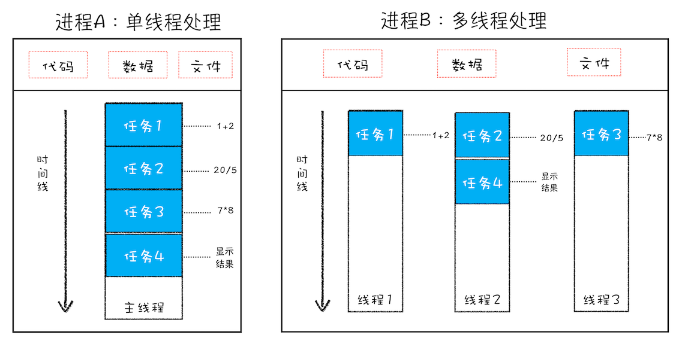


从图中可以看到，**线程是依附于进程的，而进程中使用多线程并行处理能提升运算效率**。

进程和线程之间的关系有以下 4 个特点：

1. **进程中的任意一线程执行出错，都会导致整个进程的崩溃。**
2. **线程之间共享进程中的数据。**


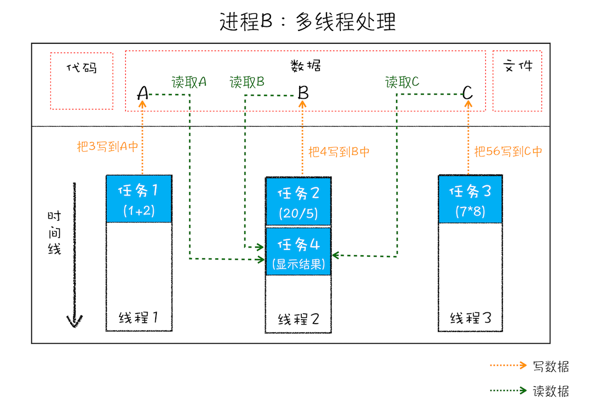


1. 从上图可以看出，线程 1、线程 2、线程 3 分别把执行的结果写入 A、B、C 中，然后线程 2 继续从 A、B、C 中读取数据，用来显示执行结果。
2. **当一个进程关闭之后，操作系统会回收进程所占用的内存**
3. **进程之间的内容相互隔离**

补充完基础，该开始讲正题了👇

------

### 单进程浏览器时代

顾名思义，**单进程浏览器是指浏览器所以模块都运行再同一个进程里**，这些模块包含了网络、插件、JavaScript 运行环境、渲染引擎和页面等。

单进程浏览器的架构如下图所示👇


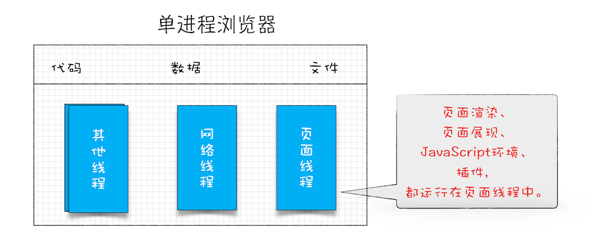


如此多的功能模块运行在一个进程里，肯定有着不足的：

- 不稳定性
- 不流畅
- 不安全

**思考题：要是面试官要你详细说的话，你该怎么去表达清楚？**

------

### 多进程浏览器时代

基于以上的问题，现代浏览器已经解决了这些问题了，是如何解决的呢？那我们聊一聊**多进程时代**

#### 早期多进程架构


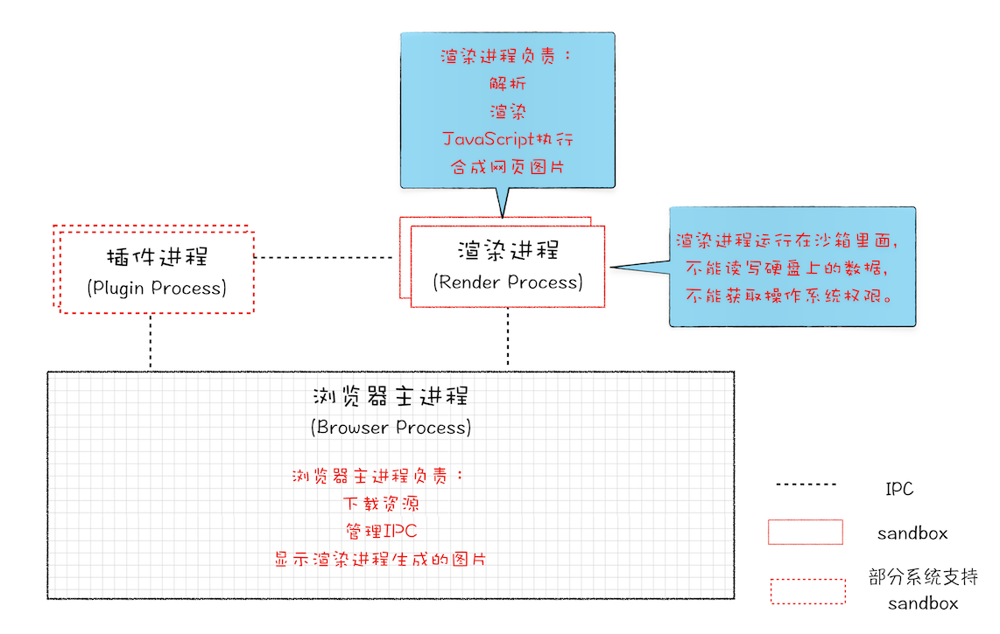


从图中可以看出，Chrome 的页面是运行在单独的渲染进程中的，同时页面里的插件也是运行在单独的插件进程之中，而进程之间是通过 IPC 机制进行通信（如图中虚线部分）

**我们先看看如何解决不稳定的问题:**由于进程是相互隔离的，所以当一个页面或者插件崩溃时，影响到的仅仅是当前的页面进程或者插件进程，并不会影响到浏览器和其他页面，这就完美地解决了页面或者插件的崩溃会导致整个浏览器崩溃，也就是不稳定的问题。

**接下来再来看看不流畅的问题是如何解决的:**同样，JavaScript 也是运行在渲染进程中的，所以即使 JavaScript 阻塞了渲染进程，影响到的也只是当前的渲染页面，而并不会影响浏览器和其他页面，因为其他页面的脚本是运行在它们自己的渲染进程中的。所以当我们再在 Chrome 中运行上面那个死循环的脚本时，没有响应的仅仅是当前的页面。

对于内存泄漏的解决方法那就更简单了，因为当关闭一个页面时，整个渲染进程也会被关闭，之后该进程所占用的内存都会被系统回收，这样就轻松解决了浏览器页面的内存泄漏问题。

**最后我们再来看看上面的两个安全问题是怎么解决的:** 用多进程架构的额外好处是可以使用**安全沙箱**，你可以把沙箱看成是操作系统给进程上了一把锁，沙箱里面的程序可以运行，但是不能在你的硬盘上写入任何数据，也不能在敏感位置读取任何数据，例如你的文档和桌面。Chrome 把插件进程和渲染进程锁在沙箱里面，这样即使在渲染进程或者插件进程里面执行了恶意程序，恶意程序也无法突破沙箱去获取系统权限。

以上都是我搬运过来的🖕 解释的比我清楚，也怕女朋友不懂😹

------

下面的才是我们的重点：目前的Chrome架构就是采用下面的方案，对于后面常见的面试题：**从浏览器输入URL按回车到页面显示都发生了什么** 这个经典面试题而言，有一个系统的知识体系，比背诵条例而言，更为重要！

------

#### 目前多进程架构

Chrome发展肯定是有新的变化的，我们先看看最新的Chrome进程架构，可以参考这个图👇


从图中可以看出，最新的 Chrome 浏览器包括：1 个浏览器（Browser）主进程、1 个 GPU 进程、1 个网络（NetWork）进程、多个渲染进程和多个插件进程。

下面我们来逐个分析下这几个进程的功能👇

- **浏览器进程**。主要负责界面显示、用户交互、子进程管理，同时提供存储等功能。
- **渲染进程**。核心任务是将 HTML、CSS 和 JavaScript 转换为用户可以与之交互的网页，排版引擎 Blink 和 JavaScript 引擎 V8 都是运行在该进程中，默认情况下，Chrome 会为每个 Tab 标签创建一个渲染进程。出于安全考虑，渲染进程都是运行在沙箱模式下。
- **GPU 进程**。其实，Chrome 刚开始发布的时候是没有 GPU 进程的。而 GPU 的使用初衷是为了实现 3D CSS 的效果，只是随后网页、Chrome 的 UI 界面都选择采用 GPU 来绘制，这使得 GPU 成为浏览器普遍的需求。最后，Chrome 在其多进程架构上也引入了 GPU 进程。
- **网络进程**。主要负责页面的网络资源加载，之前是作为一个模块运行在浏览器进程里面的，直至最近才独立出来，成为一个单独的进程。
- **插件进程**。主要是负责插件的运行，因插件易崩溃，所以需要通过插件进程来隔离，以保证插件进程崩溃不会对浏览器和页面造成影响。

不过凡事都有两面性，虽然多进程模型提升了浏览器的稳定性、流畅性和安全性，但同样不可避免地带来了一些问题：

- **更高的资源占用**因为每个进程都会包含公共基础结构的副本（如 JavaScript 运行环境），这就意味着浏览器会消耗更多的内存资源。
- **更复杂的体系架构**浏览器各模块之间耦合性高、扩展性差等问题，会导致现在的架构已经很难适应新的需求了

------

### 未来面向服务的架构

为了解决这些问题，在 2016 年，Chrome 官方团队使用“**面向服务的架构**”（Services Oriented Architecture，简称 **SOA**）的思想设计了新的 Chrome 架构

Chrome 最终要把 UI、数据库、文件、设备、网络等模块重构为基础服务，类似操作系统底层服务，下面是 Chrome“面向服务的架构”的进程模型图：


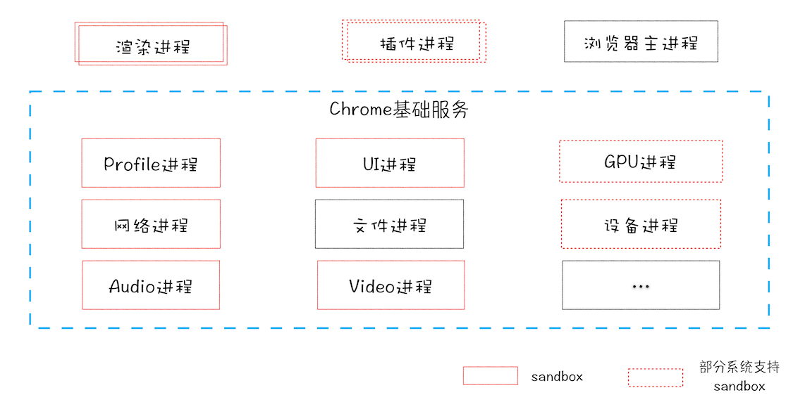


------

### 涉及面试题

#### 为什么单进程浏览器当时不可以采用安全沙箱？

<details open="" style="display: block;"><summary style="display: block;"><b style="font-weight: 700;">个人理解</b></summary><p style="line-height: inherit; margin-top: 22px; margin-bottom: 22px;">如果一个进程使用了安全沙箱之后，该进程对于操作系统的权限就会受到限制，比如不能对一些位置的文件进行读写操作，而这些权限浏览器主进程所需要的，所以安全沙箱是不能应用到浏览器主进程之上的。</p></details>

------

#### 打开Chrome浏览器一个Tab页面，至少会出现几个进程？

<details open="" style="display: block;"><summary style="display: block;"><b style="font-weight: 700;">个人理解</b></summary><p style="line-height: inherit; margin-top: 22px; margin-bottom: 22px;">最新的Chrome浏览器包括至少四个:1 个浏览器（Browser）主进程、1 个 GPU 进程、1 个网络（NetWork）进程、多个渲染进程和多个插件进程,当然还有复杂的情况；</p><p style="line-height: inherit; margin-top: 22px; margin-bottom: 22px;"></p>1. 页面中有iframe的话,iframe会单独在进程中<p style="line-height: inherit; margin-top: 22px; margin-bottom: 22px;"></p><p style="line-height: inherit; margin-top: 22px; margin-bottom: 22px;"></p>2. 有插件的话，插件也会开启进程<p style="line-height: inherit; margin-top: 22px; margin-bottom: 22px;"></p><p style="line-height: inherit; margin-top: 22px; margin-bottom: 22px;"></p>3. 多个页面属于同一站点，并且从a打开b页面，会共用一个渲染进程<p style="line-height: inherit; margin-top: 22px; margin-bottom: 22px;"></p><p style="line-height: inherit; margin-top: 22px; margin-bottom: 22px;"></p>4. 装了扩展的话，扩展也会占用进程<p style="line-height: inherit; margin-top: 22px; margin-bottom: 22px;"></p><p style="line-height: inherit; margin-top: 22px; margin-bottom: 22px;"></p>这些进程都可以通过Chrome任务管理器来查看<p style="line-height: inherit; margin-top: 22px; margin-bottom: 22px;"></p></details>

------

#### 即使如今多进程架构，还是会碰到单页面卡死的最终崩溃导致所有页面崩溃的情况，讲一讲你的理解？

<details open="" style="display: block;"><summary style="display: block;"><b style="font-weight: 700;">个人理解</b></summary><p style="line-height: inherit; margin-top: 22px; margin-bottom: 22px;">提供一种情况，就是同一站点,围绕这个展开也行。</p><p style="line-height: inherit; margin-top: 22px; margin-bottom: 22px;">Chrome的默认策略是，每个标签对应一个渲染进程。但是如果从一个页面打开了新页面，而新页面和当前页面属于同一站点时，那么新页面会复用父页面的渲染进程。官方把这个默认策略叫process-per-site-instance。</p><p style="line-height: inherit; margin-top: 22px; margin-bottom: 22px;">更加简单的来说，就是如果多个页面符合同一站点，这几个页面会分配到一个渲染进程中去,所以有这样子的一种情况,一个页面崩溃了，会导致同一个站点的其他页面也奔溃，这是因为它们使用的是同一个渲染进程。</p><p style="line-height: inherit; margin-top: 22px; margin-bottom: 22px;">有人会问为什么会跑到一个进程里面呢?</p><p style="line-height: inherit; margin-top: 22px; margin-bottom: 22px;">你想一想呀,属于同一家的站点，比如下面三个:</p><pre style="font-family: Menlo, Monaco, Consolas, &quot;Courier New&quot;, monospace; font-size: 1em; position: relative; overflow: auto; line-height: 1.75; color: rgb(51, 51, 51); background-color: rgb(248, 248, 248); background-position: initial initial; background-repeat: initial initial;">https://time.geekbang.org</pre><pre style="font-family: Menlo, Monaco, Consolas, &quot;Courier New&quot;, monospace; font-size: 1em; position: relative; overflow: auto; line-height: 1.75; color: rgb(51, 51, 51); background-color: rgb(248, 248, 248); background-position: initial initial; background-repeat: initial initial;">https://www.geekbang.org</pre><pre style="font-family: Menlo, Monaco, Consolas, &quot;Courier New&quot;, monospace; font-size: 1em; position: relative; overflow: auto; line-height: 1.75; color: rgb(51, 51, 51); background-color: rgb(248, 248, 248); background-position: initial initial; background-repeat: initial initial;">https://www.geekbang.org:8080</pre>它们在一个渲染进程中的话，它们就会共享JS执行环境，也就是A页面可以直接在B页面中执行脚本了,有些时候就是有这样子的需求嘛。<p style="line-height: inherit; margin-top: 22px; margin-bottom: 22px;"></p></details>

------

### 总结

女朋友：说的好多呀，就是记不住呐，能不能画个思维导图，或者总结一下👧

我：（这不是已经很简洁明了吗）看见女朋友这么期待的眼神😎 感觉安排

- 早期浏览器：不稳定（单独进程） 不流畅（单独进程） 不安全（沙箱）
- 早期多进程浏览器： 主进程 渲染进程 插件进程
- 现代多进程架构： 主进程 渲染进程 插件进程 GPU进程 网络进程
- 未来面向服务架构

------

## HTTP请求流程

女朋友：怎么跟我说起HTTP请求流程呐，面试经常问输入URL，中间发生的过程，我想要听这个，你别跟我说有的没的💢

我（小声说）：小可爱你要是完成熟悉一个 HTTP 完整的工作流程，相信这些知识点对于你以后的学习或工作会很有帮助，而且这样子的话，你说的那个题目自然就会明白了，要不听我先聊一聊？

女朋友：(￢︿̫̿￢☆)哼，看你能说出什么让我感兴趣的💢

### 整体流程

**为了便于你理解**，先看一张HTTP 请求示意图，用来展现浏览器中的 HTTP 请求所经历的各个阶段。


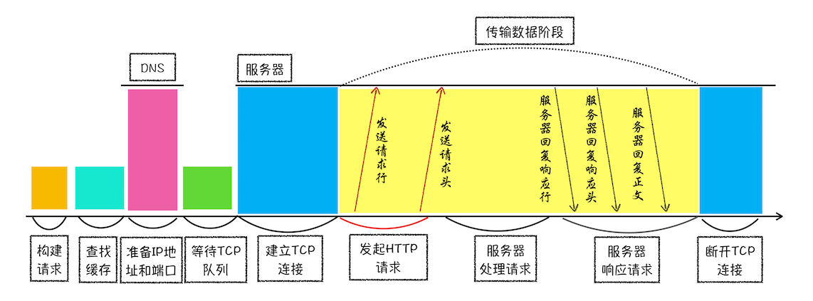


从图中可以看到，浏览器中的 HTTP 请求从发起到结束一共经历了如下八个阶段：

- 构建请求
- 查找缓存
- 准备 IP 和端口
- 等待 TCP 队列
- 建立 TCP 连接
- 发起 HTTP 请求
- 服务器处理请求
- 服务器返回请求和断开连接

为了更好的把以上八个阶段讲清楚，我们举个具体的例子来说吧💪

### 浏览器端发起 HTTP 请求流程

如果你在浏览器地址栏里键入百度网站的地址：[www.baidu.com](https://www.baidu.com/)， 那么接下来，浏览器会完成哪些动作呢？下面我们就一步一步详细“追踪”下。

#### 1. 构建请求

首先，浏览器构建**请求行**信息（如下所示），构建好后，浏览器准备发起网络请求。

```
GET /index.html HTTP1.1
复制代码
```

#### 2. 查找缓存

在真正发起网络请求之前，浏览器会先在浏览器缓存中查询是否有要请求的文件。其中，**浏览器缓存是一种在本地保存资源副本，以供下次请求时直接使用的技术**。

当浏览器发现请求的资源已经在浏览器缓存中存有副本，它会拦截请求，返回该资源的副本，并直接结束请求，而不会再去源服务器重新下载。这样做的好处有：

- 缓解服务器端压力，提升性能（获取资源的耗时更短了）；
- 对于网站来说，缓存是实现快速资源加载的重要组成部分。

当然，如果缓存查找失败，就会进入网络请求过程了。

#### 3. 准备 IP 地址和端口

不过，先不急，在了解网络请求之前，我们需要先看看 HTTP 和 TCP 的关系。因为浏览器使用 **HTTP 协议作为应用层协议**，用来封装请求的文本信息；并使用 **TCP/IP 作传输层协议**将它发到网络上，所以在 HTTP 工作开始之前，浏览器需要通过 TCP 与服务器建立连接。也就是说 **HTTP 的内容是通过 TCP 的传输数据阶段来实现的**，你可以结合下图更好地理解这二者的关系。


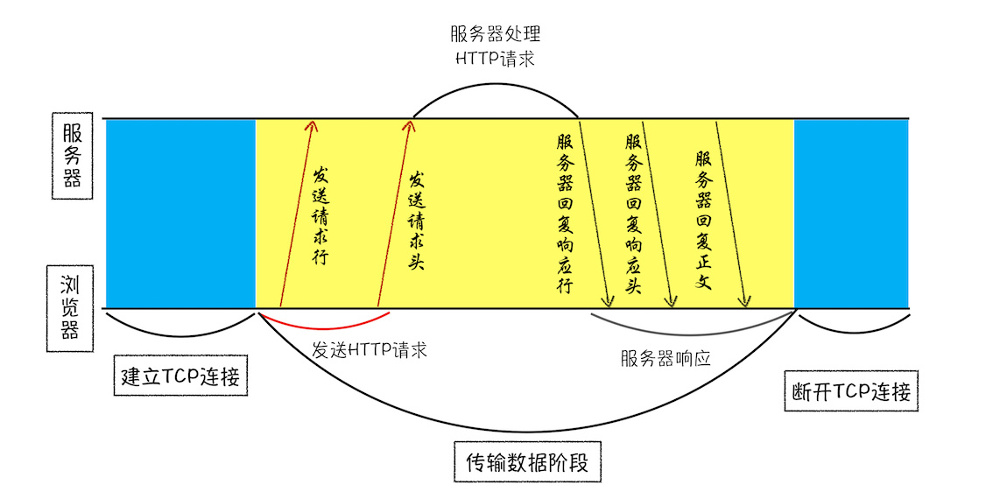


那接下来你可以思考这么“一连串”问题：

- HTTP 网络请求的第一步是做什么呢？结合上图看，是和服务器建立 TCP 连接。
- 那建立连接的信息都有了吗？建立 TCP 连接的第一步就是需要准备 IP 地址和端口号。
- 那怎么获取 IP 地址和端口号呢？这得看看我们现在有什么，我们有一个 URL 地址，那么是否可以利用 URL 地址来获取 IP 和端口信息呢？

> 你会发现记住域名比IP更加的方便，所以基于这个需求又出现了一个服务，负责把域名和 IP 地址做一一映射关系。这套域名映射为 IP 的系统就叫做“**域名系统**”，简称 **DNS**（Domain Name System）。

> 所以，这样一路推导下来，你会发现在**第一步浏览器会请求 DNS 返回域名对应的 IP**。当然浏览器还提供了 **DNS 数据缓存服务**，如果某个域名已经解析过了，那么浏览器会缓存解析的结果，以供下次查询时直接使用，这样也会减少一次网络请求。

> 拿到 IP 之后，接下来就需要获取端口号了。通常情况下，如果 URL 没有特别指明端口号，那么 HTTP 协议默认是 80 端口。

DNS解析想深入了解的话，有兴趣的可以看看这篇文章[DNS 原理入门](http://www.ruanyifeng.com/blog/2016/06/dns.html)

#### 4. 等待 TCP 队列

现在已经把端口和 IP 地址都准备好了，那么下一步是不是可以建立 TCP 连接了呢？

> 答案不一定的，这个得根据不同的浏览器来规定的，我们以Chrome浏览器为例，Chrome 有个机制，同一个域名同时最多只能建立 6 个 TCP 连接，如果在同一个域名下同时有 10 个请求发生，那么其中 4 个请求会进入排队等待状态，直至进行中的请求完成。

> 当然，如果当前请求数量少于 6，会直接进入下一步，建立 TCP 连接。

**这里其实也就可以出个小面试题，那有很多图片资源或者其他支援请求怎么办？**

### 5. 建立 TCP 连接

排队等待结束之后，终于可以快乐地和服务器握手了，在 HTTP 工作开始之前，浏览器通过 TCP 与服务器建立连接。而 TCP 的工作方式，要张开细讲的话，有很多细节需要把握，可以看看这篇文章：

[TCP/UDP协议详解](https://juejin.cn/post/TCP/UDP协议详解)

- UDP在传输的过程中数据包容易丢失
- 大文件被拆分为很多小的数据包时，小数据包会经不同的路由，不能同时到达接受端，UDP不知道如何组装这些数据包，UDP也不会有重发机制

> TCP的出现，就是为了解决以上的问题，它是**面向连接的，可靠的，基于字节流的传输层通行协议**。

一个完整的TCP连接生命周期包括了“**建立连接**”“**传输数据**”和“**断开连接**”三个阶段。


- 这里面要细讲的话，内容就多了，比如三次握手建立连接，四次挥手断开连接，很多文章也详细的介绍了整个的过程，这里就不介绍了，可以看看我推荐的文章，关于讲这些内容的。

### 6. 发送 HTTP 请求

上面大概讲完了建立TCP连接，你可以理解TCP的连接，是为了保证浏览器跟服务器更好的通信。当然了有了上面的这个过程中， HTTP 中的数据也正是在这个通信过程中传输的。

那么我们从一张图片中来看，浏览器是如何发送信息给服务器的👇


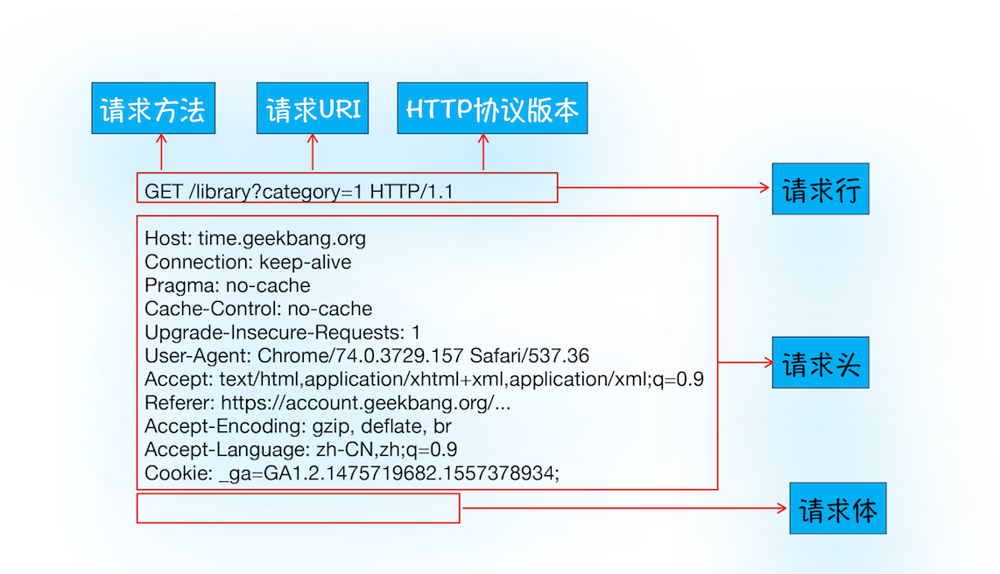


- 浏览器向服务器发起**请求行**：请求方法，请求URL HTTP协议版本
- 请求行大概意思就是告诉服务器，我需要做上面，比如GET方法，我需要向你拿资源，POST方法通常也就是我需要向服务器提高什么数据，需要注意的就是如果是POST方法，浏览器还需要准备好数据，通过请求体发送给服务器。
- **请求头**：把浏览器的基础信息告诉服务器，比如包含了浏览器所使用的操作系统，浏览器的内核信息等，还有请求的域名信息，浏览器的Cookie信息等等。

🤖怎么样，是不是听完这些，懂了一些皮毛了，那接下来看看服务器端是如何处理HTTP的请求吧✍

### 7. 服务器端处理HTTP请求流程

此时你可以理解成HTTP请求信息终于送到到服务器，接下来服务器会根据请求信息来准备相应的内容啦

#### 7.1 返回请求

服务器处理好后，便把结果数据返回给浏览器，我们来看看放回的数据是怎么样的👇


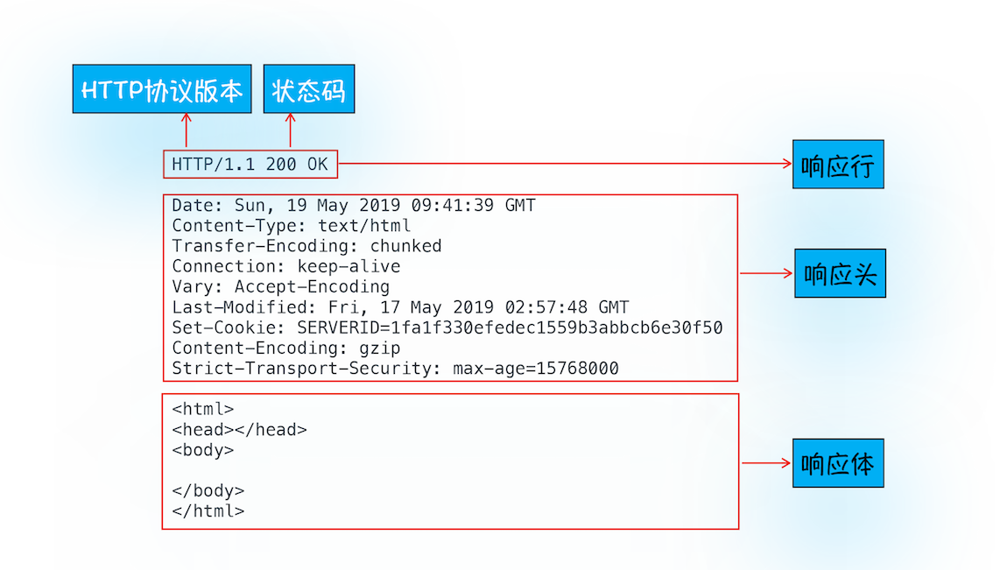


- 响应行：HTTP协议版本 状态码，通过常见的状态码，就可以知道处理的结果
- 常见状态码：200 表示处理成功。 如果没有找到页面，状态码为404

状态码类型很多，网上很多资料，可以自行查阅，还是推荐两篇比较好的文章：

[具有代表性的 HTTP 状态码](https://juejin.im/post/6844903519447678990)

[面试必考之http状态码有哪些](http://hpoenixf.com/面试必考之http状态码有哪些.html)

- 响应头：你可以理解成包含服务器自身的一些信息，比如服务器生成数据的时间，返回数据的类型（HTML，流媒体，JSON，XHTML等等）以及服务器在客户端保存的Cookie等信息
- 响应头中 **Cache-Control** 字段也很重要，这个涉及到了HTTP缓存，这个字段涵义就是设置缓存资源的时间的
- 发送完响应头后，服务器就可以继续发送**响应体**的数据，通常，响应体就包含了 HTML 的实际内容。

#### 8.1 断开连接

一般情况下，服务器发送完数据后，就要关闭TCP连接。不过有一种情况比较特殊，我们来看看

```
Connection:Keep-Alive 
复制代码
```

如果浏览器或者在服务器中加入其头信息如上面的字段的话，TCP连接会仍然保持，这样子浏览器就可以通过同一个TCP连接发送请求，**保存TCP连接可以省下去下次请求需要建立连接的时间，提升资源加载速度。**

> 比如，一个 Web 页面中内嵌的图片就都来自同一个 Web 站点，如果初始化了一个持久连接，你就可以复用该连接，以请求其他资源，而不需要重新再建立新的 TCP 连接。

### 重定向

我们还得聊一聊一种特殊的情况，不过这个情况跟之前提过的**状态码**有关，我们大概知道了，服务器返回的状态码不同，会有不同的返回的结果，你肯定遇到过这样子的情况吧：**当你在浏览器中打开 baidu.com 后，你会发现最终打开的页面地址是 www.baidu.com \** 这两个URL不一样的原因就是涉及到了**重定向**，让我们从一张图片上面看看这种情况吧👇


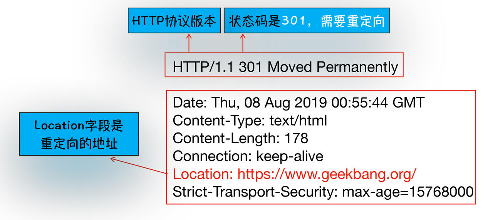


> 我们看看响应行返回的状态码301，状态301告诉浏览器，你需要重新转到另外一个网址，需要重定向的地址正式包含在响应头的Location字段中。接下啦，浏览器获取Location字段中的地址，重新导航，这也就是完整的重定向的执行流程。

这解释了为什么输入baidu.com后，最终打开的是www.baidu.com

### 涉及面试题

- 为什么很多站点第二次打开速度会很快？🚀
- 当登录过一个网站之后，下次再访问该站点，就已经处于登录状态了，这是怎么做到的呢？
- 如何使用 Cookie 来进行状态管理，说一说流程
- TCP建立连接过程讲一讲，为什么握手需要三次？
- UDP了解吗，与TCP相比，优点是啥，缺点呢？
- 你刚刚说了TCP连接会存在TCP队列，那加载大量图片或者其他资源的时候，该怎么解决卡顿呢

> 当然了我只能说考察点太多了，光是http协议就可以问很多的问题，我只是提出一个例子，只有你一步步的去分析并提出一些问题，让疑问带领你去学习，抓住问题的本质学透相关知识点，让你站在一个更高的维度去查看整体框架。

就拿第一个相关点聊一聊吧，**为什么会加快打开速度**？

既然第二次能加快网页的打开速度，肯定第一次加载页面的时候，**缓存了耗时的数据**

从上面介绍的核心流程来看，比如**DNS和页面资源缓存**这两块的数据会被浏览器缓存下来。

DNS缓存相对就简单些了，这可以很好看看上面的文章，这里就不展开篇幅介绍了。

#### 浏览器缓存

这个不就是面试常考的吗，聊一聊浏览器的缓存，这里面自然就涉及到常见header中字段

- Cache-Control（重要策略）
- Expires
- Last-modified
- ETag

缓存流程如图：


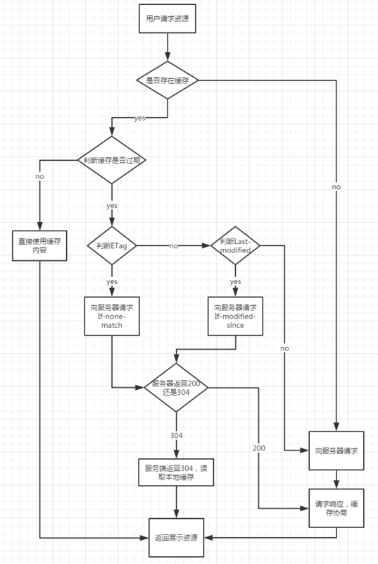


浏览器缓存的展开的话，又是很大的内容，看看这篇[浏览器缓存](https://segmentfault.com/a/1190000008377508)

通过上面了解到，浏览器把资源缓存到本地，浏览器缓存直接使用本地副本来回应请求，不会产生真实的网络请求，从而节省了时间，加快了访问的速度🚀

### 总结

- HTTP 请求从发起到结束一共经历了如下八个阶段：
- 构建请求、查找缓存、准备 IP 和端口、等待 TCP 队列、建立 TCP 连接、发起 HTTP 请求、服务器处理请求、服务器返回请求和断开连接
- 了解 HTTP 完整的工作流程，这个整体的框架，有着很多分析问题的思路就在里面，＜（＾－＾）＞然后在深入了解每个阶段具体怎么运作的，对你日后学习或者工作会有所帮助。

从宏观视角去看HTTP请求流程，有了一个整体框架，接下来就是一步步的分析提出问题，带着疑惑去学习，抓住问题的本质，比如深入的了解TCP如何连接的，这样子何尝不是一种学习方法呢👊

------

## 导航流程：从输入URL到页面展示，这中间发生了什么

> 女朋友(出现)：面试必考题，给我先讲一讲整体流程吧，我拿笔记下来✍

> 我：嗯~ o(*￣▽￣*)o，我想着只能给你讲整体流程，太细的内容，自然需要你自己一步步去分析，带着问题去了解👊

### 整体流程

先看一张流程图


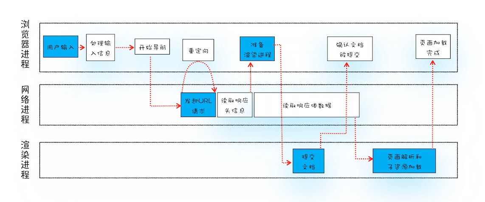


从图中可以看出，存在进程间的通信（IPC）,先回顾一下上面章节讲的进程的职责吧。

- 浏览器进程主要负责用户交互、子进程管理和文件储存等功能
- 网络进程是面向渲染进程和浏览器进程等提供网络下载功能
- 渲染进程是把HTML，CSS，JavaScript，图片等资源解析为可以显示和交互的页面。

> 通常渲染进程是在安全沙箱中的，Chrome这样子的安全措施还是有必要的，你可以理解成渲染进程中所以的内容都是通过网络获取的，可能这过程中存在一些恶意代码，这类代码利用浏览器漏洞对系统进行攻击，所以就很有必要…..

通过上面的图片，这个过程大致如下：

1. 浏览器进程发出URL请求给网络进程
2. 网络进程接收到URL请求后，发起网络请求，然后服务器返回HTTP数据到网络进程，网络进程解析HTTP响应头数据，并将其转发给浏览器进程
3. 浏览器进程接收到网络进程的响应头数据后，发送CommitNavigation消息到渲染进程，发送CommitNavigation时会携带响应头、等基本信息。
4. 渲染进程接收到CommitNavigation消息之后，便开始准备接收HTML数据，接收数据的方式是直接和网络进程建立数据管道
5. 最后渲染进程会像浏览器进程“确认提交”，这是告诉浏览器进程，说我已经准备好接受和解析页面数据了
6. 最后浏览器进程更新页面状态

上述就是经历的主要阶段，下面就详细的分析这些阶段吧👇

### 尝试分析整体流程

1. 用户输入URL

> 浏览器会根据用户输入的信息判断是搜索还是网址，如果是搜索内容，就将搜索内容+默认搜索引擎合成新的URL；如果用户输入的内容符合URL规则，浏览器就会根据URL协议，在这段内容上加上协议合成合法的URL

> 比如输入www.baidu.com 地址栏会根据规则，把这段内容加上协议，合成完整的URL，如https://www.baidu.com

用户输入完内容，按下回车键，浏览器导航栏显示loading状态，但是页面还是呈现前一个页面，这是因为新页面的响应数据还没有获得。

当然了这里面的话，有个beforeunload事件，该事件允许页面退出之前执行一些数据的清理操作，还可以询问用户是否要离开当前页面，比如当前页面有未提交的表单，用户可以通过beforeunload事件来取消导航，让浏览器不在进行后续工作。

1. URL 请求过程

浏览器进程将构建请求行数据，进行进程间通信（IPC）将URL请求发送给网络进程，类似于下面这个：

```
GET /index.html HTTP1.1
复制代码
```

1. 网络进程获取到URL，先去本地缓存中查找是否有缓存文件，如果有，拦截请求，直接200返回；否则，进入网络请求过程

2. 网络进程请求DNS返回域名对应的IP和端口号，如果之前DNS数据缓存服务缓存过当前域名信息，就会直接返回缓存信息；否则，发起请求获取根据域名解析出来的IP和端口号，如果没有端口号，http默认80，https默认443。如果是https请求，还需要建立TLS连接。

3. 在进程TCP连接的过程中，Chrome有个机制，同一个域名下最多只能建立6个TCP连接，如果在同一个域名下有10个请求发生，那么其中4个请求会进入等待转台，直至进行中的请求完成。如果请求个数小于6，会直接建立TCP连接。

4. TCP三次握手建立连接，http请求加上TCP头部——包括源端口号、目的程序端口号和用于校验数据完整性的序号，向下传输。

5. 网络层在数据包上加上IP头部——包括源IP地址和目的IP地址，继续向下传输到底层

6. 底层通过物理网络传输给目的服务器主机，紧接着目的服务器主机网络层接收到数据包，解析出IP头部，识别出数据部分，将解开的数据包向上传输到传输层。

7. 目的服务器主机传输层获取到数据包，解析出TCP头部，识别端口，将解开的数据包向上传输到应用层

8. 应用层HTTP解析请求头和请求体，如果需要重定向，HTTP直接返回HTTP响应数据的状态code301或者302，同时在请求头的Location字段中附上重定向地址，浏览器会根据code和Location进行重定向操作；如果不是重定向，首先服务器会根据 请求头中的If-None-Match 的值来判断请求的资源是否被更新，如果没有更新，就返回304状态码，相当于告诉浏览器之前的缓存还可以使用，就不返回新数据了；否则，返回新数据，200的状态码，并且如果想要浏览器缓存数据的话，就在相应头中加入字段：

   ```
   Cache-Control:Max-age=2000
   复制代码
   ```

   响应数据又顺着应用层——传输层——网络层——网络层——传输层——应用层的顺序返回到网络进程

9. 数据传输完成，TCP四次挥手断开连接。如果，浏览器或者服务器在HTTP头部加上如下信息，TCP就一直保持连接。保持TCP连接可以省下下次需要建立连接的时间，提示资源加载速度

   ```
   Connection:Keep-Alive
   复制代码
   ```

10. 网络进程将获取到的数据包进行解析，根据响应头中的Content-type来判断响应数据的类型，如果是字节流类型，就将该请求交给下载管理器；如果是text/html类型，就通知浏览器进程获取到文档准备渲染

    

    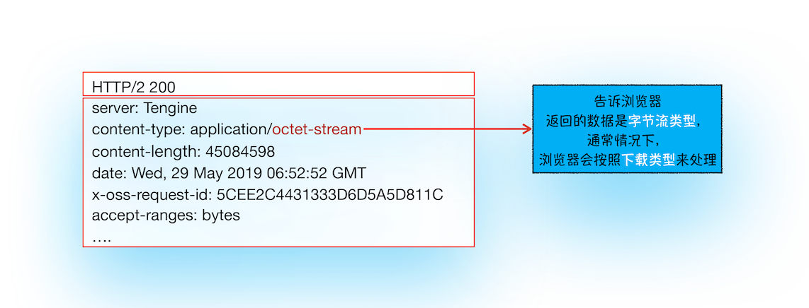

    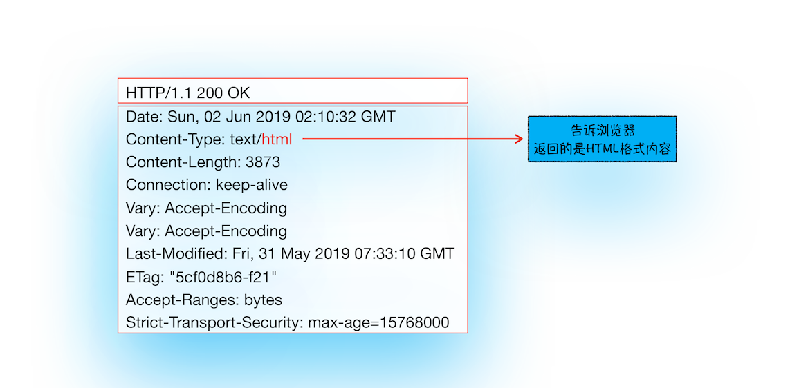

    

    从返回的响应头信息来看，其 Content-Type 的值是 application/octet-stream，显示数据是**字节流类型**的，通常情况下，浏览器会按照**下载类型**来处理该请求。

    **需要注意的是**，如果服务器配置 Content-Type 不正确，比如将 text/html 类型配置成 application/octet-stream 类型，那么浏览器可能会曲解文件内容，比如会将一个本来是用来展示的页面，变成了一个下载文件。

11. 浏览器进程获取到通知，根据当前页面B是否是从页面A打开的并且和页面A是否是同一个站点（根域名和协议一样就被认为是同一个站点），如果满足上述条件，就复用之前网页的进程，否则，新创建一个单独的渲染进程。

12. 浏览器会发出“提交文档”的消息给渲染进程，渲染进程收到消息后，会和网络进程建立传输数据的“管道”，文档数据传输完成后，渲染进程会返回“确认提交”的消息给浏览器进程。

13. 浏览器收到“确认提交”的消息后，会更新浏览器的页面状态，包括了安全状态、地址栏的 URL、前进后退的历史状态，并更新web页面，此时的web页面是空白页。


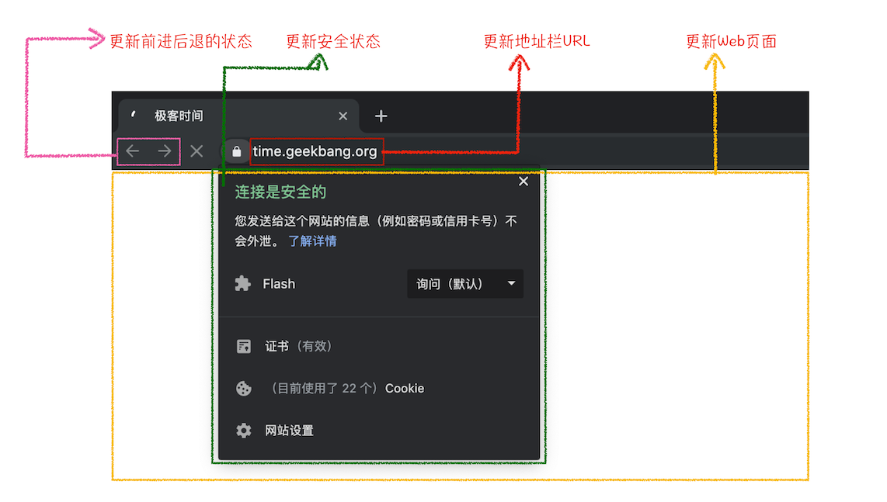


```
这也就解释了为什么在浏览器的地址栏里面输入了一个地址后，之前的页面没有立马消失，而是要加载一会儿才会更新页面。
复制代码
```

1. 渲染进程对文档进行页面解析和子资源加载，HTML 通过HTM 解析器转成DOM Tree（二叉树类似结构的东西），CSS按照CSS 规则和CSS解释器转成CSSOM TREE，两个tree结合，形成render tree（不包含HTML的具体元素和元素要画的具体位置），通过Layout可以计算出每个元素具体的宽高颜色位置，结合起来，开始绘制，最后显示在屏幕中新页面显示出来。

------

**导航流程很重要，它是网络加载流程和渲染流程之间的一座桥梁，如果你理解了导航流程，那么你就能完整串起来整个页面显示流程，这对于你理解浏览器的工作原理起到了点睛的作用。**

当然了渲染阶段是每个前端工程师需要熟悉并且掌握的，下一篇文章将会仔细把渲染流程过一遍的✍

------

**下一期：**

渲染阶段很重要，了解了相关流程可以让你“看透”页面是如何工作的，有了这些知识点的话，相信你可以解决一部分的问题，比如熟悉使用开发者工具，能优化页面卡顿问题，使用 JavaScript 优化动画流程，通过优化样式表来防止强制同步布局，等等。

------

女朋友：哇，我好像确实对浏览器流程有了整体的认识，确实一定程度上帮助我理解了浏览器运行原理👏，什么时候跟我讲一讲渲染流程的细节呀，我还想继续去学习呐🏃

我开（nan）心（guo）的说：就这两天整理一下吧，到时候给你写出来✍

------

## 参考

[从浏览器多进程到JS单线程，JS运行机制最全面的一次梳理](https://segmentfault.com/a/1190000012925872)

[DNS 原理解析](http://www.ruanyifeng.com/blog/2016/06/dns.html)

[写给前端工程师的DNS基础知识](http://www.sunhao.win/articles/netwrok-dns.html)

[TCP/UDP协议详解](https://juejin.im/post/6844903889146216456)

[具有代表性的 HTTP 状态码](https://juejin.im/post/6844903519447678990)

[面试必考之http状态码有哪些](http://hpoenixf.com/面试必考之http状态码有哪些.html)

[浏览器缓存](https://segmentfault.com/a/1190000008377508)

推荐👍👍👍[极客时间-浏览器工作原理与实践](https://time.geekbang.org/column/intro/100033601)

关注下面的标签，发现更多相似文章

[浏览器](https://juejin.cn/tag/浏览器)


[](https://juejin.cn/user/2348212569517645)

[TianTianUp ](https://juejin.cn/user/2348212569517645)[](https://juejin.cn/book/5c90640c5188252d7941f5bb/section/5c9065385188252da6320022)公众号 | 前端UpUp @ 网易

