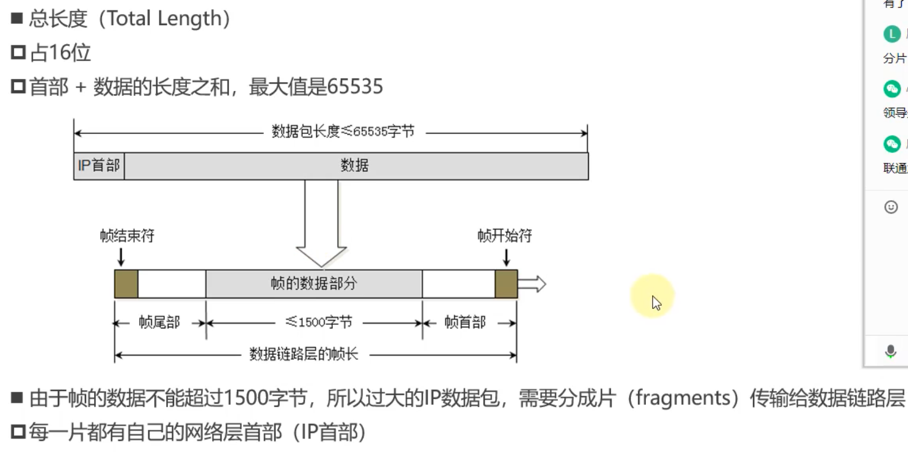

> 网络层最大长度(首部+数据部分)不能超过1500个字节，否则需要将IP数据包进行分片，保证每个数据包总长度<=1500字节，但是一般轮不到网络层分片的，数据在传入传输层后，传输层将其封装成一个个数据包时已经对每个数据包的大小进行控制，保证每个数据包在传入数据链路层时不会超过1500个字节。


> 网络层接收数据大部分时候都会从传输层获得，但是也有例外，例如使用`ping`命令向服务器发送数据时，网络层数据并不是由传输层提供的，而是ICMP协议提供的，ICMP协议是网络层协议。

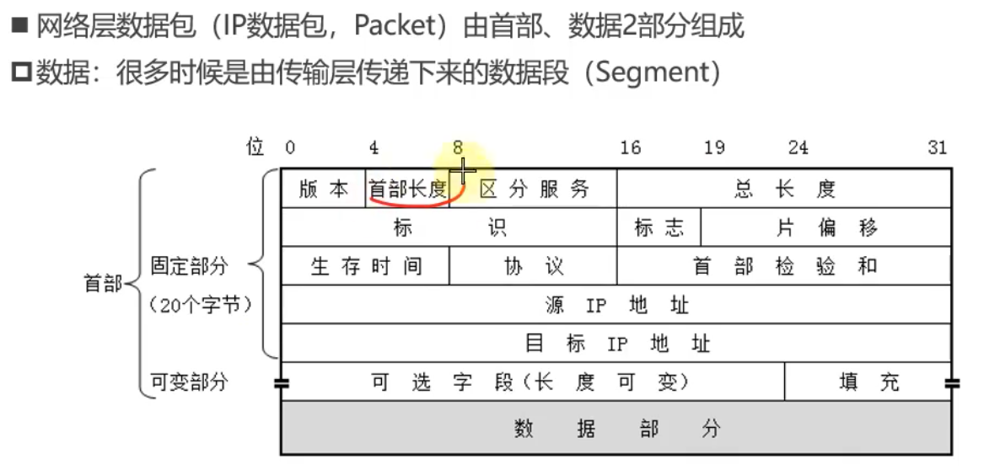

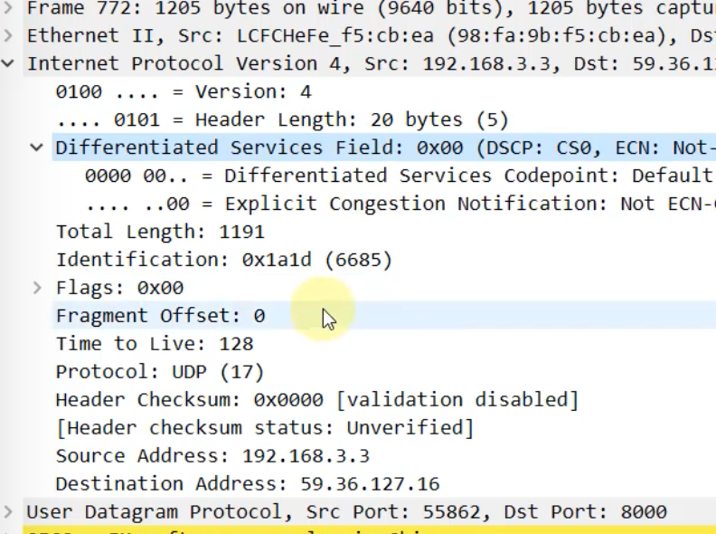


> 标识：标识数据包
>
> 片偏移：用来数据包分片时，这片数据包在整个数据包位置，用来将数据进行重组。
>
> flags：是否分片，是否是数据包的最后一片。
>
> flags的第二位可以控制是否分片，因为网络层将数据包传给数据链路层时，必须<=1500B，否则必须分片。如果数据包>1500但是不允许分片时，数据发不出去会提示。
>
> 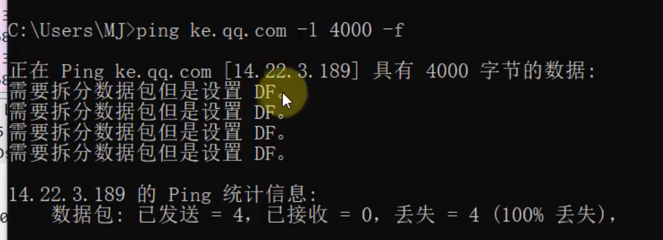
>
> 向腾讯课堂服务器发包，自动将数据包拆分成3片，DF：是否不要分片(0表示分片)，MF是否为数据包的最后一片(0表示最后一片)。
>
> 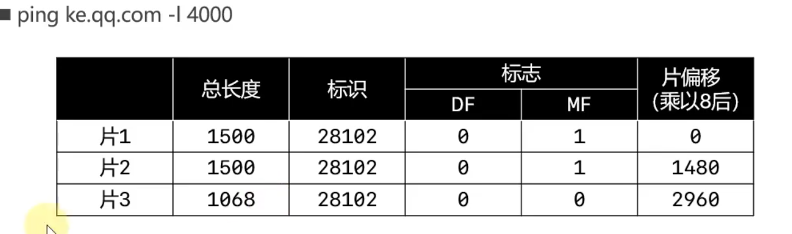

> 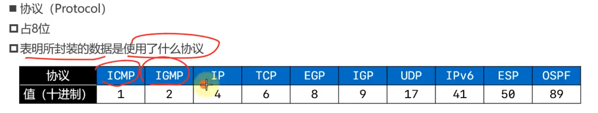

```
// 向百度发包，设置数据包为4000字节，-f表示不允许分片。
ping www.baidu.com -l 4000 -f 
```

> 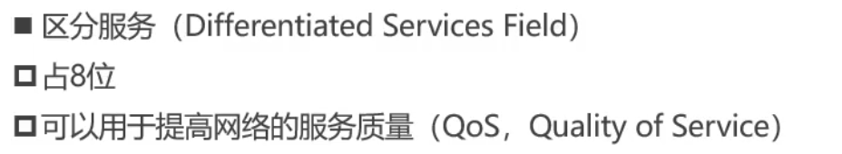
>
> 也就是设置数据包的优先级，路由器通过查看IP首部中的区分服务字段，如果为紧急数据包，则优先传输。

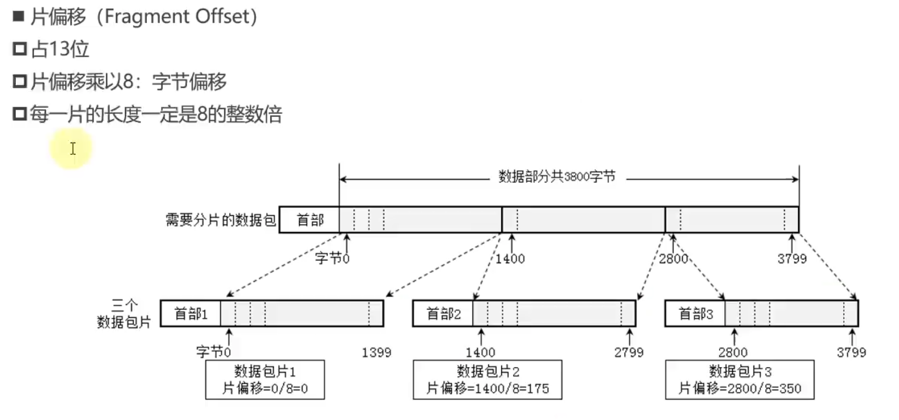


udp

> UDP首部长度8
>
> 伪首部：伪首部是UDP程序添加上去的，用来计算校验和，伪首部+首部+UDP数据计算出校验和，但是伪首部不会传递给网络层，计算完后就直接扔掉。
>
> 长度：2个字节，记录UDP报文长度，首部+数据部分的长度。

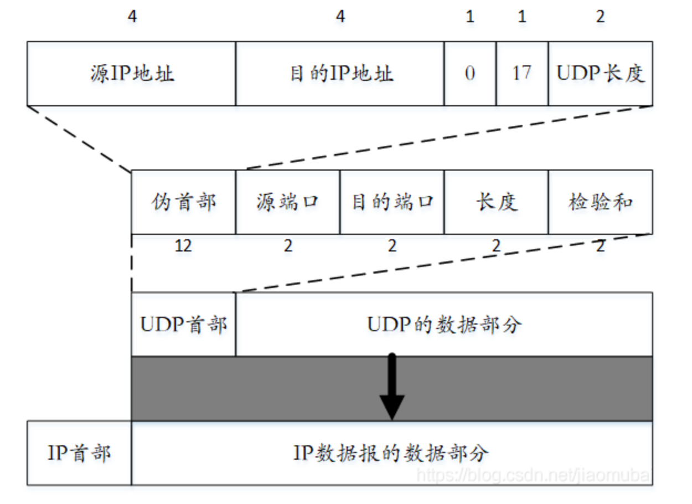

tcp

> tcp数据偏移和IP地址首部的首部长度一样，也是占4位，取值范围20～60B

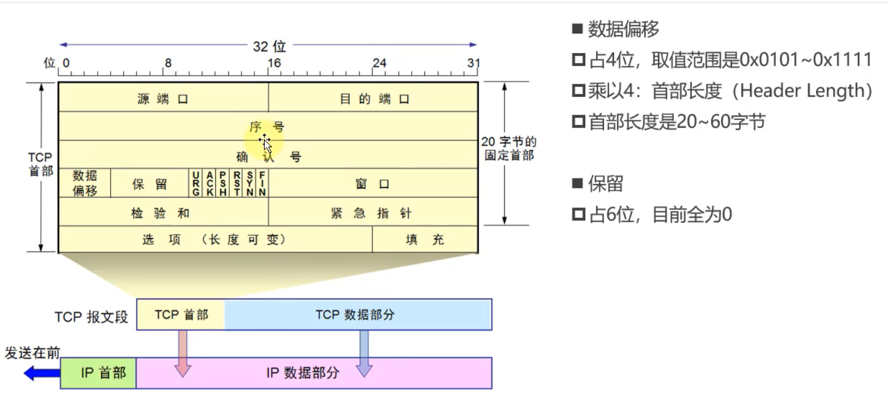

> tcp第一个问题：IP首部有一个总长度和一个首部长度，记录IP数据包的首部长度和数据包大小，UDP也有一个长度字段记录着UDP报文总长度，但是TCP首部只有一个首部长度，没有数据部分长度。
>
> TCP的数据包长度是由IP首部推算出来的，IP数据包 = IP首部 + IP数据包 = IP首部 + TCP数据包 = IP首部 + TCP首部 + TCP数据部分；因此TCP数据部分 = IP总长度 - IP首部长度 - TCP首部长度。
>
> UDP中的长度字段纯粹是冗余字段，它的存在只是为了保证32位对齐，从IP首部到TCP首部，每一行都是32位。

> 上图中保留字段占6位，其实是占3位，因为Flag字段占9位，但是Flag字段前3位都是0，相当于保留位，因此合并到保留字段中。

>  伪首部 = 源IP(4B) + 目标IP(4B) + 保留位(1B) + 协议类型(1B) + TCP长度(2B) = 12B
>
> 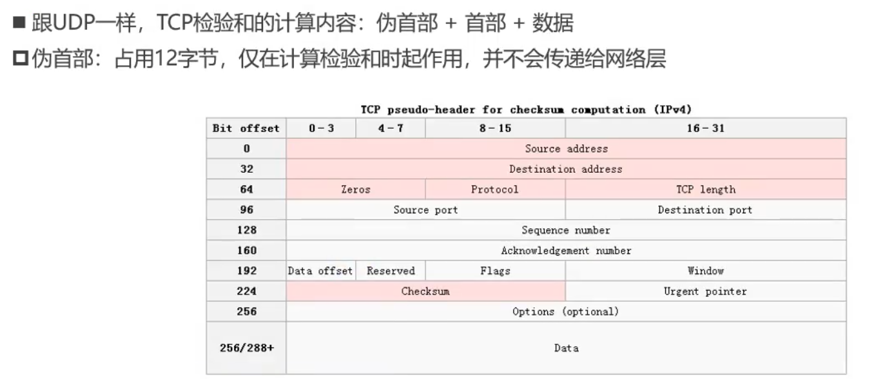


## 三次握手

> TCP三次握手，为了建立双向连接，在握手时Flags标志位用来告诉对方接收TCP包时，序号和确认号是否有效，例如，
>
> 1. SYN = 1，表示TCP首部中的序号字段数据有效，确认号字段数据是无效数据。
> 2. SYN = 1，ACK=1，表示TCP首部中的序号和确认号字段数据有效。
> 3. ACK = 1，表示TCP首部中的确认号字段有效。
>
> 三次握手目的：
>
> 1. 第一次握手，客户端请求建立从客户端到服务端的单向连接。
> 2. 第二次握手，服务器同意建立从客户端到服务器的单向连接，并且服务器请求从服务端到客户端的单向连接。
> 3. 第三次握手，客户端同意建立从服务端到客户端的单向连接。
>
> 此时TCP握手结束，并传里

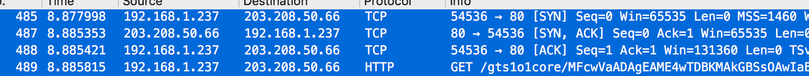

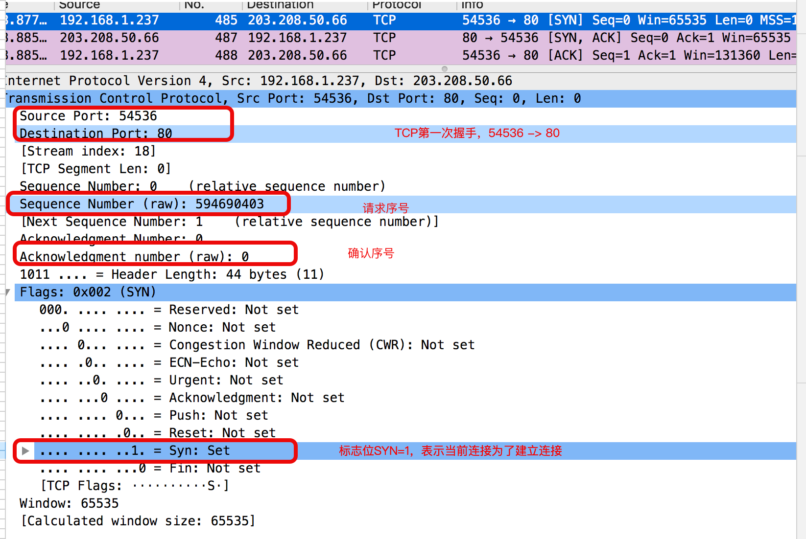

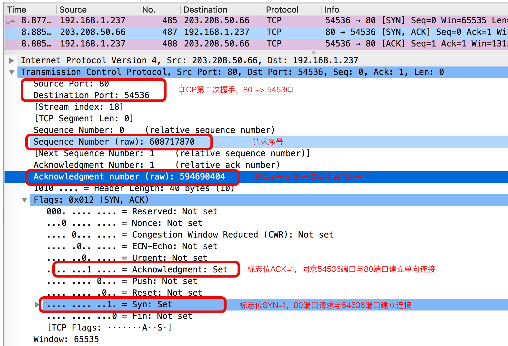

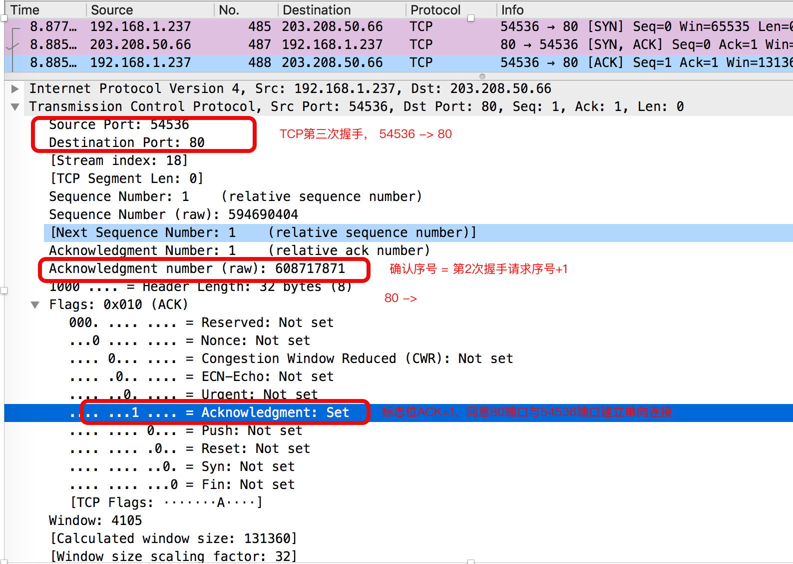


## ARQ协议(automatic repeat request) 自动重传请求协议

> 这个协议保证TCP的可靠传输，数据包丢失后会自动发送重传请求。

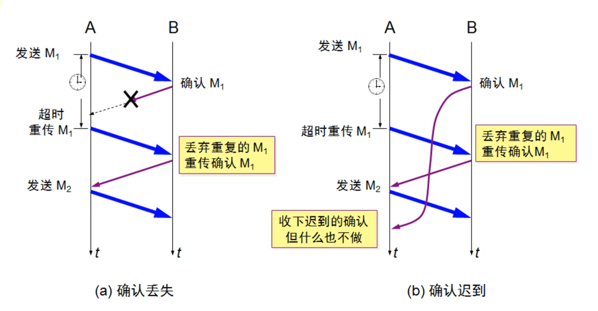

> 上面图片为停止等待ARQ协议，即如果前一个数据包没有收到确认，发送方不会发送下一个数据包，效率非常慢。

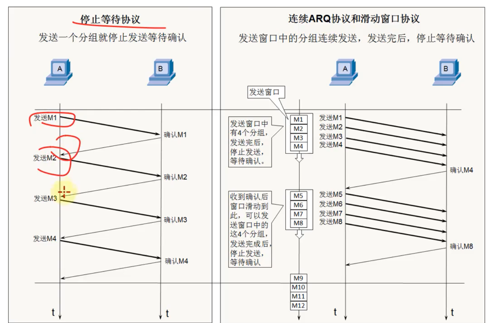

> 连续ARQ协议+滑动窗口协议，改进停止等待协议。
>
> 发送方可以连续发送多个包给接收方，接收方接收到包会将这几个包拼装起来，例如上图连续发送4个包，如果接收方接收到了4个包，则给发送方发送拼接完成后最后一个序号，即将第4个包序号发送给发送方，告诉发送方发送的这四个包都接受到了，如果其中一个包丢失，比如说M3丢失，则接收方会发送M2，表示从M3开始重发。
>
> 滑动窗口：由接收方告诉发送方接收方当前接收方缓存可以接收多少数据包，控制发送方发送速度。别一股脑的全发过来。


### 选择性确认SACK

> 当使用滑动窗口时，一次性发送多个数据包，如果其中一个数据包丢失，则有可能重复发送已经接收的数据包，例如上图发送M1、M2、M3、M4这4个数据包，如果其中M3丢失，其他包都接收到了，那么接收方发送确认时，只会会发送M2，表示直接收到M1和M2，其他包丢失，即使M4已经接收了，也需要发送方重新传输，因此M4这个数据包被发送了两次。非常浪费。
>
> SACK就是避免这种重复发送已经接收到的数据包，让接收方详细告诉发送方我到底接收到了那些数据包。
>
> SACK就是利用TCP首部的选项部分(TCP首部长度20B固定字段+40B可选字段，TCP首部长度20B～60B之间)。

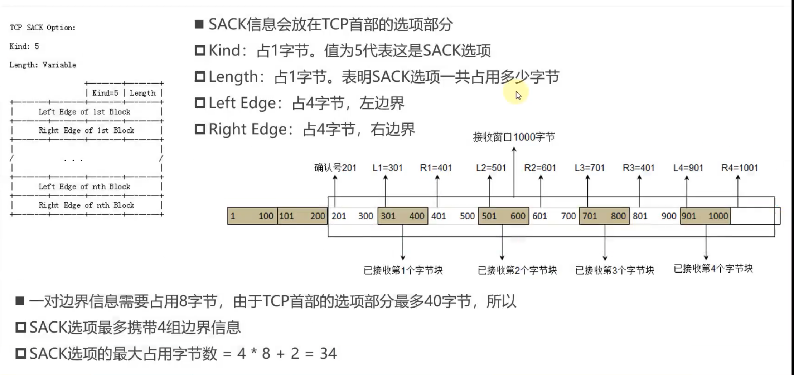

> 上图中，发送方一共发送了10个数据包，其中确认号201表示201字节之间的数据全部已经接收到了，选项部分记录了其中有哪些字段接收到了。
>
> 1. L1=301，R1=401，第301～400这100个字节，接收方已经接收到了。
> 2. L1=501，R1=601，第501～600这100个字节，接收方已经接收到了。
> 3. L1=701，R1=801，第701～800这100个字节，接收方已经接收到了。
> 4. L1=901，R1=1001，第901～1000这100个字节，接收方已经接收到了。
>
> 其他字节没有接收到。

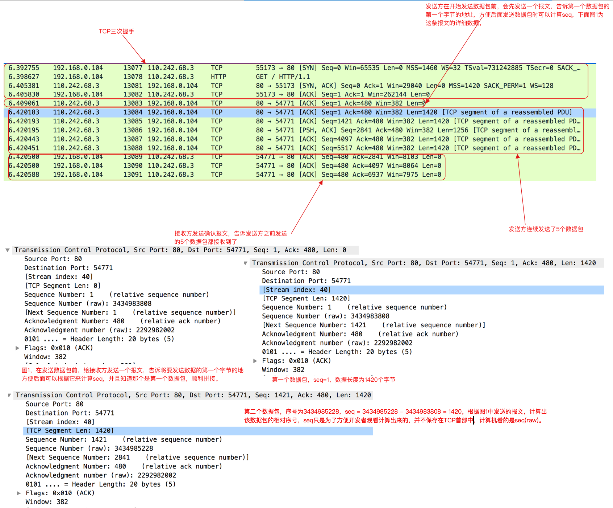


> TCP首部字段中seq与seq(raw)：
>
> TCP在发送数据时将大数据切分成一个个数据包，然后对数据包按顺序从1开始编号，保证接收方根据编号能将这些包组装起来，`seq表示这个数据包的编号，seq(raw)表示这个数据包的前两个字节的地址,seq是wireshark工具计算出来的值，seq(raw)才是保存在TCP首部序号中的值`
>
> 上面的两张图为紧挨着的两个数据包，分别为`编号1`和`编号1421`，
>
> 编号1421 的seq(raw) =  3434985228  
>
> 编号1的seq(raw) = 3434983808
>
>  3434985228 - 3434983808 = 1421 - 1 = 1420，第一个数据包长度为1420个字节
>
> `seq`如何计算出来的，在发送数据包时，发送方会先发送一个数据包
>
> 