

[新小梦 ](https://juejin.cn/user/888061125471917)

2019年07月14日 阅读 7218

关注

# TCP/UDP协议详解...

本文主要讲的是传输层的两大重要协议TCP和UDP，虽然在Android开发中，并不需要了解到这么底层，但有理论的支撑，写代码总是很自信的啦。理论指导着实践，实践是理论检验的唯一标准。站在巨人的肩膀窥伺网络世界。

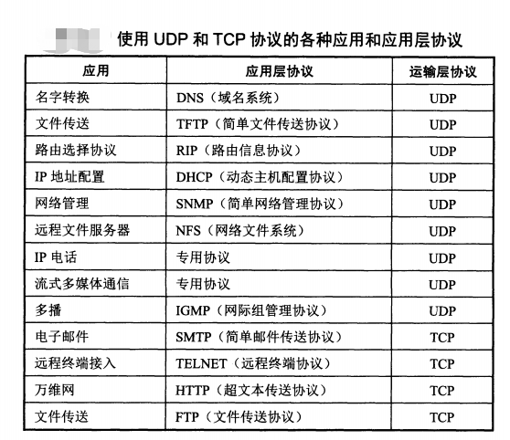

## 用户数据报协议UDP

用户数据报协议UDP只在IP的数据报服务至上增加了复用和分用的功能以及差错检测的功能。只有面向无连接的报文，不可靠传输的特点。UDP对应用层交下来的数据只添加首部，并进行特别的处理，就交给网络层；对网络层传递上来的用户数据报拆封首部后，原封不动的交给应用层。

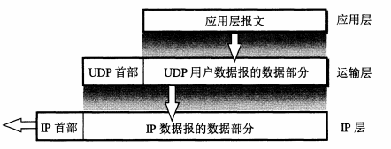

### 1、UDP的首部格式

用户数据报UDP分为两个字段：数据字段和首部字段，从图来分析用户数据报UDP的首部格式。

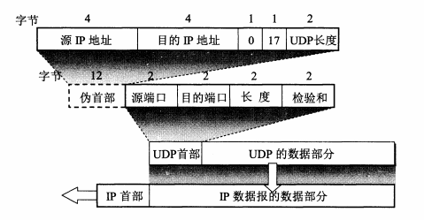

UDP首部字段很简单，由4个字段组成，每个字段的长度都是两个字节，共8字节。

- **源端口** 原端口号，在需要对方回信时选用，不需要时可全0
- **目的端口** 目的端口号，这在终点交付报文时必须使用，不然数据交给谁呢？
- **长度** UDP的长度，最小值为8字节，仅有首部
- **检验和** 检测用户数据报在传输过程是否有错，有错就丢弃。

在传输的过程中，如果接收方UDP发现收到的报文中的目的端口不存在，会直接丢弃，然后由网际控制报文协议ICMP给发送方发送“端口不可达”差错报文。

### 2、伪首部

计算校验和时，需要在UDP之前增加12个字节的伪首部。这种首部并不是用户数据报的真正首部。伪首部并不在网络中传输，只是在计算检验和，临时添加在UDP用户数据报前，得到一个临时的用户数据报。

UDP的校验和是把首部和数据部分一起校验，发送方计算校验和的一般步骤：

1. 将首部的校验和字段填充为0（零）
2. 把伪首部和用户数据报UDP看出16位的字符串连接起来
3. 如果数据部分不是偶数字节，则填充一个全零字节（该字节不发送到网络层）
4. 按二进制反马计算出这些16位字的和
5. 然后将和写入校验和字段，就可以发送到网络层了。

接收方收到用户数据报后，连同伪首部一起，按二进制反码求这些16位字的和，无差错结果是应全为1.否则出错，直接丢弃该报文。

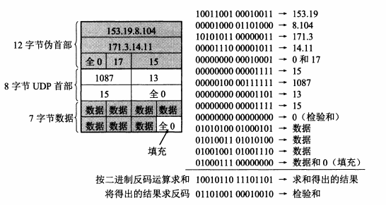

## TCP协议

TCP协议作为传输层主要协议之一，具有面向连接，端到端，可靠的全双工通信，面向字节流的数据传输协议。

### 1、TCP报文段

虽然TCP面向字节流，但TCP传输的数据单元却是报文段。TCP报文段分为TCP首部和数据部分，TCP报文段首部的前20个字节是固定的，后面有4*n字节根据需要动态添加的选项，最大长度为40字节。

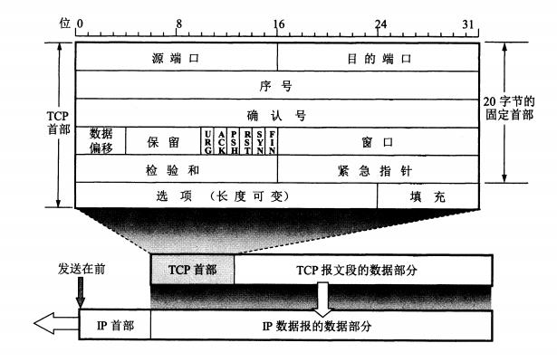

- **源端口和目的端口** 各占两个字节，TCP的分用功能也是通过端口实现的。
- **序号** 占4个字节，范围是[0,232],TCP是面向字节流的，每个字节都是按顺序编号。例如一个报文段，序号字段是201，携带数据长度是100，那么第一个数据的序号就是201，最后一个就是300。当达到最大范围，又从0开始。
- **确认号** 占4个字节，是期望收到对方下一个报文段的第一个字节的序号。若确认号=N,则表示序号N前所有的数据已经正确收到了。
- **数据偏移** 占4位，表示报文段的数据部分的起始位置，距离整个报文段的起始位置的距离。间接的指出首部的长度。
- **保留** 占6位，保留使用，目前为0.
- **URG（紧急）** 当URG=1,表明紧急指针字段有效，该报文段有紧急数据，应尽快发送。
- **ACK(确认)** 仅当ACK=1时，确认号才有效，连接建立后，所有的报文段ACK都为1。
- **PSH(推送)** 接收方接收到PSH=1的报文段，会尽快交付接收应用经常，不再等待整个缓存填满再交付。实际较少使用。
- **RST(复位)** RST=1时，表明TCP连接中出现严重差错，必须是否连接，再重连。
- **SYN(同步)** 在建立连接时用来同步序号。当SYN=1,ACK=0，则表明是一个连接请求报文段。SYN=1,ACK=1则表示对方同意连接。TCP建立连接用到。
- **FIN(终止)** 用来释放一个连接窗口。当FIN=1时，表明此报文段的发送方不再发送数据，请求释放单向连接。TCP断开连接用到。
- **窗口** 占2个字节，表示发送方自己的接收窗口，窗口值用来告诉对方允许发送的数据量。
- **校验和** 占2字节，检验和字段查验范围包括首部和数据部分。
- **紧急指针** 占2字节，URG=1时，紧急指针指出本报文段中的紧急数据的字节数（紧急字节数结束后为普通字节）。
- **选项** 长度可变，最长可达40字节。例如最大报文段长度MSS。MSS指的是数据部分的长度而不是整个TCP报文段长度，MSS默认为536字节长。窗口扩大，时间戳选项等。

### 2、TCP建立连接-三次握手

三次握手图例如下,与文字解释配合使用效果更佳。

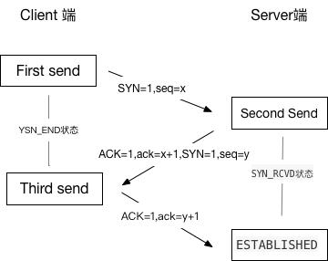

**第一次**：客户端发送连接请求报文给服务端，其中SYN=1,seq=x。发送完毕后进入SYN_END状态。

**第二次**：服务端接收到报文后，发回确认报文，其中ACK=1,ack=x+1，因为需要客户端确认，所以报文中也有SYN=1,seq=y的信息。发送完后进入SYN_RCVD状态。

**第三次**:客户端接收到报文后,发送确认报文，其中ACK=1,ack=y+1。发送完客户端进入`ESTABLISHED`状态，服务端接收到报文后，进入`ESTABLISHED`状态。到此，连接建立完成。

**三次握手原因**

避免资源被浪费掉。如果在第二步握手时，由于网络延迟导致确认包不能及时到达客户端，那么客户端会认为第一次握手失败，再次发送连接请求，服务端收到后再次发送确认包。在这种情况下，服务端已经创建了两次连接，等待两个客户端发送数据，而实际却只有一个客户端发送数据。

### 3、TCP断开连接-四次挥手

四次挥手指客户端和服务端各发送一次请求终止连接的报文，同时双方响应彼此的请求。 四次挥手图例如下，请配置文字解释使用哦。

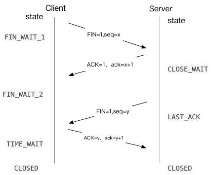

**第一次挥手**：客户端发送FIN=1，seq=x的包给服务端，表示自己没有数据要进行传输，单面连接传输要关闭。发送完后，客户端进入`FIN_WAIT_1`状态。

**第二次挥手**：服务端收到请求包后，发回ACK=1,ack=x+1的确认包，表示确认断开连接。服务端进`入CLOSE_WAIT`状态。客户端收到该包后，进入`FIN_WAIT_2`状态。此时客户端到服务端的数据连接已断开。

**第三次挥手**：服务端发送FIN=1,seq=y的包给客户端，表示自己没有数据要给客户端了。发送完后进入`LAST_ACK`状态，等待客户端的确认包。

**第四次挥手**：客户端收到请求包后，发送ACK=1,ack=y+1的确认包给服务端，并进入`TIME_WAIT`状态，有可能要重传确认包。服务端收到确认包后，进入`CLOSED`状态，服务端到客户端的连接已断开。客户端等到一段时间后也会进入`CLOSED`状态。

**四次挥手原因** 由于TCP的连接是全双工，双方都可以主动传输数据，一方的断开需要告知对方，让对方可以相关操作，负责任的表现。

使用TCP协议有：FTP（文件传输协议）、Telnet（远程登录协议）、SMTP（简单邮件传输协议）、POP3（和SMTP相对，用于接收邮件）、HTTP协议等

### 4、TCP流量控制

#### 滑动窗口协议

TCP滑动窗口协议主要为了解决在网络传输数据的过程中，发送方和接收方传输数据速率不一致的问题，从而保证数据传输的可靠性，达到流量控制的效果。 发送方中的数据分为三种：

- 发送已确认
- 发送未确认
- 未发送

接收方数据分为三种：

- 已接收和确认但未被上层读取
- 接收未确认

在发送方的滑动窗口中，可分为发送窗口和可用窗口。发送窗口中的数据已发送接收方，但未接到接收方的确认；可用窗口则表示发送方还可以发送多少数据。发送方的窗口大小会受到接收方窗口的改变而改变。

利用滑动窗口机制能有效的控制发送方的发送数据速率。下面是个栗子：

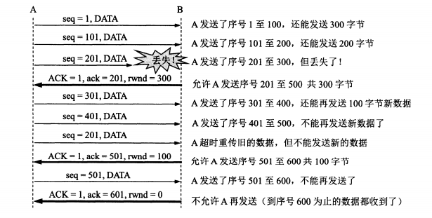

TCP的窗口单位是字节，不是报文端，所以上文假设一个报文包含100个字节。ACK是确认位，ack是确认号，seq是序列号，对应报文的数据格式的。A和B在TCP三次握手时候，B会告诉A自己的接收窗口rwnd大小。上图中，A向B先发送了三次数据，但第三次丢失了，同时受到B的流量控制，当前ack=201,还需允许继续发送序号为201到500共300个字节。当A发送到序号为500时，就不能发新的数据了，但能接收第三次丢失的数据。

接收方数据被上层读取后，又可以接收序号为501-600共100个字节，所以通知A,接收窗口大小为100，序号为501开头....在上图的整个过程中，A共收到B三次流量控制。

#### TCP报文段发送的机制

应用层把数据传递给传输层的TCP的发送缓存后，TCP通过不同的机制来控制报文段的发送时机。 主要有下面三种机制：

- TCP维护一个变量，等于最大报文段长度MSS,缓存中存放的数据达到MSS字节时，则以一个报文段发送出去。
- 发送应用层指明要求的报文段，即TCP支持的推送操作。
- 发送法计时器期限到了，就要把前面缓存的数据以报文段发送出去，前提是长度不能超过MSS。

#### TCP传输效率问题

不同的发送机制都会带来一定的效率问题，例如用户发送一个字符，加上20字节首部，得到21字节长的TCP报文段，再加上21字节的IP首部，就变成41字节长的IP数据报。发送一个字节，线路上就需要发送41字节长的IP数据报，若等待接收方确认，线程就又多了40字节长的数据报。所以在线程带宽不富裕时，这种传输效率非常不高。因此应当推迟发回确认报文，并尽量使用捎带确认的方法。

#### Negle算法

Negle算法主要为了解决TCP的传输效率问题。Negle算法规定：若要把发送的数据逐个字节缓存起来，则发送方需要把第一个字节发送出去，然后缓存后面的字节，在收到接收方第一个字节的确认，再将现有缓存中所有字节组成一个报文段发送出去，继续缓存后续数据。只有在收到前一个报文的确认之后发送后面的数据。这是为了减少所用带宽。当发送数据到达TCP发送窗口的一半或已达到报文段的最大长度也会立即发送报文段，而不是等待接收方确认。这是为了提高网络吞吐量。

#### 糊涂窗口综合征

TCP接收方的缓存已满，若上层一次从缓存中读取一个字节，这样接收方就可以继续接纳一个字节的窗口，然后向发送方发送确认，把窗口设为1个字节（上文所讲，IP数据报为41字节长）。如果这样持续下去，那么网络效率非常低。

所以有效的解决方法，就是让接收方等待一定时间，让缓存空间能够接纳一个最长的报文段，或者等待接收缓存已有一半的空闲空间，再发出确认报文和通知当前窗口大小。

### 5、TCP的拥塞控制

#### 拥塞

什么是拥塞呢，在某段时间，若对网络中某一资源的需求超过了该资源所能提供的可用部分，网络性能就会变坏了，这种情况就叫拥塞。网络资源常指网络链路容量（带宽）、交换结点中的缓存和交换处理机。

当出现拥塞，条件允许一般都是通过添加网络资源，例如带宽换成更大的，但这治标不治本，而且不一定总是有用。网络拥塞往往是有许多因素引起的，因此就需要拥塞控制了。

#### 拥塞控制

**拥塞控制指防止过多的的数据注入到网络中，这样可以使网络中的路由器或链路不过载**。拥塞机制是一个全局性的过程，涉及到所有主机、所有路由器，以及与降低网络传输性能有光的所有因素。

而滑动窗口协议的**流量控制**，是指点到点的通信量控制，是端到端的问题。

#### TCP的拥塞控制方法

TCP进行拥塞控制的算法有四种：**慢开始、拥塞避免、快重传、快恢复**。

拥塞控制是基于拥塞窗口的，发送方维持一个拥塞窗口 cwnd的状态变量。窗口大小取决网络的拥塞程度，并且动态变化，发送方会让自己的发送窗口等于拥塞窗口。判断网络拥塞的依据就是发送方接收接收方的确认报文**是否超时**。

##### 1、慢开始算法

慢开始指主机由小到大逐渐增大发送窗口，即增大拥塞窗口的数值。初始拥塞窗口cwnd设置为不超过2到4个最大报文段SMSS的数值，具体规定：

- 若SMSS≤1095字节，cwnd=4 x SMSS字节，不得超过4个报文段。
- 若SMSS＞1095且≤2190字节，cwnd=3 X SMSS字节，不得超过3个报文段。
- 若SMSS＞2190字节，则 cwnd=2 x SMSS字节，不得超过2个报文段。

从上面的规定限制了初始拥塞窗口的大小。

慢开始在每收到一个对新的报文段的确认后，cwnd就可以增加最多一个SMSS的数值。

N是刚收到确认的报文段所确认的字节数，当N<SMSS时，拥塞窗口每次的增加量要小于SMSS。下文举例说明慢开始的原理（实际上，TCP的窗口是以字节大小为单位，下文为了方便以报文端形容）：

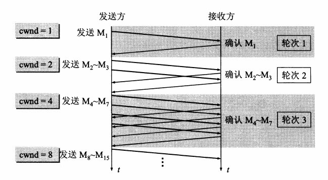

从图可知，初始化窗口未1，所有发送M1报文段，收到确认号之后，发送M2-M3两个报文段，因为拥塞窗口增大了，后面的轮次也是这样翻倍增加的。随着轮次的增多，那么发送到网络的数据就会急剧增加，容易出现拥塞，因此需要慢开始门限（ssthresh）状态变量。

- 当cwnd<ssthresh时，使用慢开始算法
- 当cwnd>ssthresh时，使用拥塞避免算法
- 当cwnd=ssthresh时，慢开始或者拥塞避免算法

##### 2、拥塞避免算法

拥塞避免算法就是让cwnd缓慢增大，每一个轮次把拥cwnd增加1，而不是像慢开始算法那样翻倍增加。需要注意的是，拥塞避免算法只是让网络不那么快出现拥塞，而不是避免拥塞出现。

上文已经说到，判断网络是否拥塞以报文是否超时为准，当网络出现拥塞时，会把ssthresh设为原有的一半，然后开始慢开始算法。如下图所示：

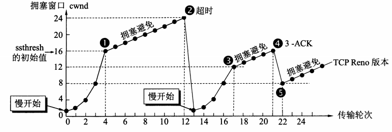

在上黑色园圈4点的时候，发送方收到对同一个报文端重复确认（3-ACK）。这种情况，个别报文端会在网络中丢失，但实际上未发生网络拥塞，发送方未及时收到确认，就会产生超时，误认为出现拥塞，发送方会重新开始慢开始算法。减低了传输效率。因此，就需要快重传算法了。

##### 3、 快重传算法

快重传算法是让发送方今早知道发生了个别报文段的丢失。快重传算法要求接收方不要等待自己发送数据时才进行捎带确认，而是立即发送确认。也就是说，但出现丢包情况，接收方在接收新数据时会重复发送对丢失包的前一个报文段的确认号。发送方接收到三次确认号后，就判断该丢失报文段确实丢失，会立即进行重传（快重传）。

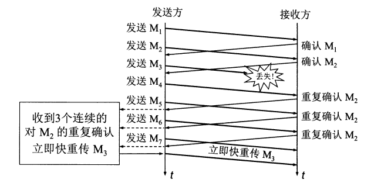

##### 4、快恢复算法

在上文，知道只是报文段丢失，而不是网络出现拥塞后，发送方会调整ssthresh为原来的一半，然后继续进行拥塞避免算法，这个过程就叫快开恢复算法。

##### 5、小结

可见，TCP拥塞控制四个算法是相辅相成，少了谁都不行，共同维护这拥塞控制机制。下面是总体的流程图。

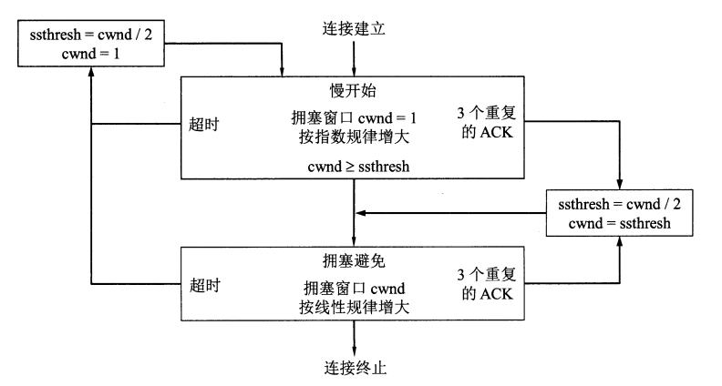

从流量控制和拥塞控制整体看，涉及到三个窗口，接收窗口、发送窗口、拥塞窗口。发送窗口的数值是不能大于接收窗口的，但是拥塞窗口由网络的拥塞程度决定的（所以上文的发送窗口等于拥塞窗口，是假设在接收窗口数值足够大，能够容纳拥塞窗口的数据）。因此，**发送窗口的上限值应该是拥塞窗口cwnd和接收窗口rwnd之间的最小值**。也就是说，通过流量控制和拥塞控制，发送的发送速率取决于cwnd和rwnd中数值较小的一个。

[GitHub](https://github.com/GitCode8/GitCode)