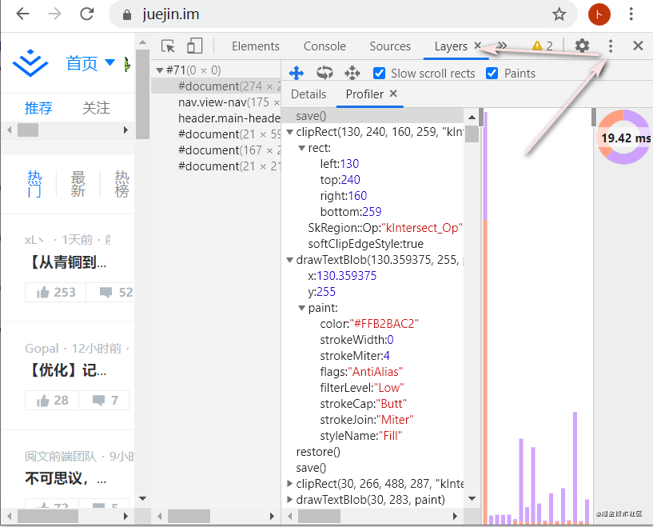

# event loop和页面渲染简单了解

浏览器中的event loop和页面渲染。文章整理了相关资料，记录部分思考。

阅读文章能了解三个问题：event loop处理模型，浏览器渲染流程，event loop和渲染。能了解宏任务，微任务，UI渲染时机，requestAnimationFram执行。

概要：

1. 渲染流程
2. event loop简单了解
3. event loop和渲染
4. 总结

# 1. 渲染流程

## 1.1 资源下载

忽略掉了从导航栏输入URL到资源从网络下载到本地的整个过程下图步骤([详细了解点击](https://github.com/alex/what-happens-when))


进入浏览器展示页面部分，先了解下进程线程

## 1.2 进程和线程

浏览器展示页面信息，浏览器内进程线程之间的分工合作（如下图有个大概印象）。


[（图片来源）](https://developers.google.com/web/updates/2018/09/inside-browser-part2)

浏览器进程(Browser Process)通过IPC通道向渲染进程(Renderer Process)提交渲染页面的请求

**进程（process）：**

> 狭义定义：进程是正在运行的程序的实例（an instance of a computer program that is being executed）。
>
> 广义定义：进程是一个具有一定独立功能的程序关于某个数据集合的一次运行活动。它是操作系统动态执行的基本单元，在传统的操作系统中，进程既是基本的分配单元，也是基本的执行单元。

CPU的主要功能是解释计算机指令以及处理计算机软件中的数据，**进程是CPU资源分配的最小单位。**

**线程（thread）:**

> 是操作系统能够进行运算调度的最小单位。大部分情况下，它被包含在进程之中，是进程中的实际运作单位。一条线程指的是进程中一个单一顺序的控制流，一个进程中可以并发多个线程，每条线程并行执行不同的任务。

**线程是 CPU调度的最小单位**，**一个进程可以包括多个线程**，这些线程共享这个进程的资源。


[（图片来源）](https://developers.google.com/web/updates/2018/09/inside-browser-part2)

## 1.3 chrome浏览器进程

浏览器主进程：

- 控制浏览器界面显示，包括用户交互、前进、后退等操作
- 处理网络堆栈以从Internet接收数据
- 将渲染的内容绘制到用户界面上
- 控制其它子进程创建和销毁

渲染进程： 负责页面的渲染、脚本执行、事件处理。不同浏览器有不同的渲染引擎， Trident(IE渲染引擎) 、Gecko(Firefox渲染引擎)、Webkit(Safari渲染引擎)、Blink（Google 从 WebKit fork 出的引擎，Edge 也使用了)

GPU进程：用于3D绘制，与其他进程隔离地处理GPU任务。由于GPU处理来自多个应用程序的请求并将它们绘制在同一表面上，因此将其分为不同的过程。

Plugin：控制网站使用的所有插件。

......

浏览器展示页面部分，最需要了解的是渲染进程

## 1.4 渲染进程（主要点）

> [The renderer process's core job is to turn HTML, CSS, and JavaScript into a web page that the user can interact with.](https://developers.google.com/web/updates/2018/09/inside-browser-part3)

**渲染器进程的核心工作是将HTML，CSS和JavaScript转换为用户可以与之交互的网页。**


[（图片来源）](https://www.html5rocks.com/en/tutorials/internals/howbrowserswork/#Painting)

尽管WebKit和Gecko使用的术语略有不同，但是流程基本上是相同的。***\*以WebKit流程为例主要理解的步骤有：Parsing→Style calculation→Layout→Paint 后续的\****Compositing**等**

以此段代码为例：

```
<!DOCTYPE html>
<html>
  <head>
    <meta name="viewport" content="width=device-width,initial-scale=1">
<style>
body { font-size: 16px }
p { font-weight: bold }
span { color: red }
p span { display: none }
img { float: right }
</style>
  </head>
  <body>
    <p>Hello <span>web performance</span> students!</p>
    <div></div>
  </body>
</html>
复制代码
```

### 1.4.1 Parsing→Style calculation

如下图：**Parsing→Style calculation 主要是创建对象模型，样式计算**

- HTML **→** Document Object Model (DOM)
- CSS **→** CSS Object Model (CSSOM)(附带样式计算，涉及层叠规则和层叠样式表)


Bytes→ characters→ tokens→ nodes→ object model

**(1)输入HTML文档输出Document Object Model (DOM**，**可以在控制台输入document查看)**


**(2)输入CSS样式表输出CSS Object Model**

> [**The \**CSS Object Model\** is a set of APIs allowing to manipulate CSS from JavaScript. It is the pendant of DOM and HTML APIs, but for CSS. It allows to read and modify CSS style dynamically.**](https://developer.mozilla.org/zh-TW/docs/Web/API/CSS_Object_Model)

CSS Object Model是一组API，允许通过JavaScript操作CSS。 它是DOM和HTML API的挂件，但仅适用于CSS。 它允许动态读取和修改CSS样式。

***\*(3)浏览器递归 CSSOM\**** （通过link引用的外部CSS文件，标记内的 CSS，元素的style属性内嵌的CSS，继承来的样式，用户代理样式都需要整合计算）计算出节点最终样式（如图） 


**计算页面上任何对象的最终样式集时**，浏览器将从适用于该节点的最通用规则开始（例如，如果它是body元素的子代，则所有body样式都适用），然后递归地进行优化通过应用更具体的规则来计算样式。

**(4) 一个思考题：p{ } 和 .box p {} 哪个性能更好？**

提示：**CSS 选择符从右往左匹配查找，从右到左匹配CSS选择器应该避免节点层级过多**

```
//p{ } 和 .box p {} 哪个性能更好？
<div class="box">
    <p> 哈哈哈 </p>
</div>
<style>
    p {
        color: red;
    }
    
    .box p {
        color: red;
    }
</style>
//p{ }，浏览器只需要找到页面中所有的p 标签然后设置颜色
//.box p {}，浏览器首先需要找到所有的 p 标签，然后找到 p 标签上.box ，给符合这种条件的 p 标签设置颜色，这样的递归过程很复杂。
//所以 p{ } 的性本更好
// 我们应该避免写过于具体的 CSS 选择器，降低选择器的复杂性，尽可能少的添加无意义标签，保证层级扁平。
// CSS 中 BEM 的命名方式了解一下
复制代码
```

补充一下：对于现代浏览器来说，通常类匹配是最快的匹配选择器

### 1.4.2 Layout tree（Render tree）

Document Object Model (DOM) 和 CSS Object Model (CSSOM) 是相互独立的数据结构。将DOM和CSSOM组合成了Render tree（Chrome 新的叫法 Layout tree）。

**输入DOM和CSSOM 输出Layout tree（Render tree）**

[图片来源](https://developers.google.com/web/fundamentals/performance/critical-rendering-path/render-tree-construction)

从上图可以看出Render tree（Layout tree）仅包含了屏幕中可见的节点

**Render tree（Layout tree）的构建（[引用](https://developers.google.com/web/fundamentals/performance/critical-rendering-path/render-tree-construction)）**

> To construct the render tree, the browser roughly does the following:
>
> 1. Starting at the root of the DOM tree, traverse each visible node.
>    - Some nodes are not visible (for example, script tags, meta tags, and so on), and are omitted since they are not reflected in the rendered output.
>    - Some nodes are hidden via CSS and are also omitted from the render tree; for example, the span node---in the example above---is missing from the render tree because we have an explicit rule that sets the "display: none" property on it.
> 2. For each visible node, find the appropriate matching CSSOM rules and apply them.
> 3. Emit visible nodes with content and their computed styles.

要构建Render tree（Layout tree），浏览器大致执行以下操作：

1. 从DOM树的根开始，遍历每个可见节点。
   - 一些节点不可见（例如，脚本标记，元标记等），由于它们未反映在渲染的输出中，因此将其省略。
   - 一些节点通过CSS隐藏，并且在渲染树中也被省略； 例如，在上例中，span节点（在上面的示例中）丢失了，因为我们在其上设置了“ display：none”属性（p span { display: none }）
2. 对于每个可见节点，找到合适的匹配CSSOM规则并应用它们。
3. 发出具有内容及其计算样式的可见节点。

[（图片来源）](https://developers.google.com/web/updates/2018/09/inside-browser-part3)

DOM和CSSOM树合并在一起形成Render tree（ Layout tree）。Render tree（ Layout tree）包含屏幕上可见内容有关的信息。但它没有位置和形状大小。计算这些位置和形状大小被称为布局。

### 1.4.3 Layout

Render tree（ Layout tree）仅包含渲染页面所需的节点，父子容器层级关系，不包括位置坐标节点形状大小。

**Layout 主要是计算节点的位置形状和大小。输入Layout tree（Render tree）输出盒子模型**

HTML使用基于流的布局模型，大多数时候都可以单次计算几何形状。“在流程中”之后的元素通常不会影响在“流程中”之前的元素的几何形状，因此布局可以在文档中从左到右，从上到下进行。

坐标系相对于根框架，使用左上角为 (0,0)为基础坐标（[layout流程具体参考](https://www.html5rocks.com/en/tutorials/internals/howbrowserswork/#Layout)）

> The layout usually has the following pattern:
>
> 1. Parent renderer determines its own width.
> 2. Parent goes over children and:
>    1. Place the child renderer (sets its x and y).
>    2. Calls child layout if needed–they are dirty or we are in a global layout, or for some other reason–which calculates the child's height.
> 3. Parent uses children's accumulative heights and the heights of margins and padding to set its own height–this will be used by the parent renderer's parent.
> 4. Sets its dirty bit to false.

布局通常有以下模式：

1. 父渲染器确定其自身的宽度。
2. 父渲染器检查子节点，并：
   - 放置子渲染器（设置子渲染器x和y位置坐标）。
   - 如果需要，调用子布局（子布局需要重新布局或着我们处于全局布局中，或出于其他原因-要计算子级的高度）
3. 父级使用子级的累计高度以及边距和填充的高度来设置自己的高度（这高度值将由父级渲染器的父级使用）。
4. 将dirty 值设置为false。（作为需要重绘的标志）

**布局阶段得到的是元素的具体位置以及box盒模型的具体数值（width，height，margin，padding，border，left，top…），精确每个元素的确切位置和大小，所有相对测量值都将转换为屏幕上的绝对像素**

**补充一下：为了不对每个小的更改进行完整布局，浏览器使用“脏位”（dirty）系统。 更改或添加的渲染器将自身及其子级标记为dirty=true表示需要布局。**

### 1.4.4 Paint

拥有DOM，样式和布局仍然不足以呈现页面。知道元素的大小，形状和位置，但仍需要判断以什么顺序绘制它们。

**Paint 主要是遍历Layout tree以创建绘制记录。**
[（图片来源）](https://developers.google.com/web/updates/2018/09/inside-browser-part3)

也可以打开Chrome的“开发者工具”，选择“Layers”标签查看绘顺记录。



### 1.4.5 合成（Compositing）

知道了文档的结构，每个元素的样式几何形状和绘制顺序，如何将这些信息转换为屏幕上的像素页面展示的？

**将这些信息转换为屏幕上的像素的过程称为栅格化。**

> **栅格化**是将[向量图形](https://zh.wikipedia.org/wiki/向量圖形)格式表示的图像转换成[位图](https://zh.wikipedia.org/wiki/點陣圖)以用于[显示器](https://zh.wikipedia.org/wiki/显示器)或者[打印机](https://zh.wikipedia.org/wiki/印表機)输出的过程。

但现在的页面并不是直接栅格化，因为页面交互和动画的复杂性，现代的浏览器运行着一种更复杂的过程，**为了找出哪些元素需要位于哪个图层中**，主线程遍历了布局树以创建Layer Tree图层树（在DevTools性能面板中，此部分称为“更新图层树(Update Layer Tree)”,更新层树是确保z-index注意诸如此类的过程的一部分）。


[（图片来源）](https://developers.google.com/web/updates/2018/09/inside-browser-part3)

**合成（Compositing）是在单独线程将页面的各个部分为多个层，分别对其进行栅格化的技术。**

打开Chrome的“开发者工具”，选择“Layers”标签查看分层信息。以页面为例 [链接](https://juejin.im/)

可以看到页面的各个部分被分为了若干层，以ul.nav-list.left 部分为例，箭头所指此部分被分层的原因，ul.nav-list.left 部分被分层的原因是容纳可以滚动的内容。

当ul.nav-list.left 部分向左右滑动时变换只有本层不会影响到其他元素的绘制合成，本层已经被光栅化，新的帧渲染就非常快了(存储本层信息需要消耗一定内存)。合成（Compositing）是靠消耗额外的内存和管理资源换取性能优化的。

主线程一旦创建了layer tree 并确定了绘制顺序，主线程便将该信息提交给合成线程。合成器线程将每个图层栅格化。
当某些层长度太大，合成器线程会将层划分为图块，并发送给栅格线程。栅格线程栅格化每个图块并将它们存储在GPU内存中。
光栅化后合成器线程会收集信息创建合成框架，通过IPC提交给浏览器进程，渲染完成后将渲染结果放入帧缓冲区，显示器以固定频率进行刷新读取缓冲区中的图像，并将读取的图像显示到显示器上。

了解更多参考

[Inside look at modern web browser (part 3)](https://developers.google.com/web/updates/2018/09/inside-browser-part3#inner_workings_of_a_renderer_process) 文章最后部分描述了主线程将该信息提交给合成线程及以后的操作。
[无线性能优化：Composite](https://fed.taobao.org/blog/taofed/do71ct/performance-composite/?spm=taofed.blogs.header.7.63e65ac801qdAI) 文章描述了Composite 如何利用布局分层进行性能优化
[GPU Accelerated Compositing in Chrome](https://www.chromium.org/developers/design-documents/gpu-accelerated-compositing-in-chrome?spm=a2c65.11461447.0.0.5c88790bTtJh2F) 有关Chrome中实施硬件加速合成的背景和详细信息
看完上面链接文章，你会发现合理管理提升合成层会达到更好的性能。
补充思考：常将动画提升为合成层的好处？

### 1.4.6 小结

***\*以WebKit流程为例主理解的步骤有：Parsing→Style calculation→Layout→Paint 后续的\****Compositing**等**

- Parsing→Style calculation 主要是创建对象模型，样式计算
  - 输入HTML文档输出Document Object Model
  - 输入CSS样式表输出CSS Object Model
  - 输入DOM和CSSOM 输出Layout tree（Render tree）。Render tree（ Layout tree）包含屏幕上可见内容有关的信息
- Layout
  - 输入Layout tree（Render tree）输出盒子模型。布局阶段得到的是元素的具体位置以及box盒模型的具体数值（width,height,margin,padding,border,left,top,…）
- Paint
  - 输入Layout tree（Render tree），输出Layout tree绘制记录。主要是遍历Layout tree以创建绘制记录。
- Compositing
  - 主线程遍历了布局树以创建图层树，主线程一旦创建了layer tree 并确定了绘制顺序，主线程便将该信息提交给合成线程
  - 合成器线程将每个图层栅格化。光栅化后完成后，合成器线程创建合成框架，将框架发送到浏览器进程，浏览器进程将内容显示在屏幕上

# 2. event loop简单了解

渲染器进程要处理 DOM、计算样式、处理布局渲染，同时协调事件，用户交互，脚本，联网个过程使用到了event loop（事件循环）。我们需要简单了解event loop。

了解event loop 需要了解几个问题：

- FPS
- 堆，调用栈等概念
- 执行顺序

## 2.1 FPS

### 2.1.1 帧，FPS（每秒传输帧数）

> **帧**：就是影像动画中最小单位的单幅影像画面，相当于电影胶片上的每一格镜头

> **FPS**是图像领域中的定义，是指画面每秒传输[帧数](https://baike.baidu.com/item/帧数/8019296)，通俗来讲就是指动画或视频的画面数。

当页面的帧率下降，即每秒刷新屏幕的次数降低时（眼睛可察觉范围），就会感觉屏幕上显示内容抖动或卡顿。

### 2.1.2 页面如何看起来顺畅了？

显示器以固定频率进行刷新通常是 60HZ，即每秒更新60次图像，设备每秒刷新屏幕60(FPS)次（这个帧率适合人眼交互）。

当前正在运行动画或过渡，或者用户正在滚动页面，则浏览器需要匹配设备的刷新率，并为每个屏幕刷新放置1张新图片或一帧，以实现平滑动画。这些帧中的每个帧的预算都刚刚超过16毫秒（1秒/ 60 = 16.66毫秒），页面看起来就是顺畅的。

### 2.1.3 怎么查看FPS？

在控制台分析页面性能查看FPS，[performance 工具的使用](https://developers.google.com/web/tools/chrome-devtools/evaluate-performance)

可以看到当前的FPS，以及当前帧的信息。

### 2.1.4 页面渲染中我们可控的关键流程

像素管道一般由 5 个部分组成，JavaScript、样式、布局、绘制、合成，如下图所示:

**[图片源](https://developers.google.com/web/fundamentals/performance/rendering)**

前面介绍了**Style calculation，Layout，Paint ，compositie
**关于JavaScript 对页面渲染的关联：我们可以使用 JavaScript 来实现一些视觉变化的效果，但需合理使用。

## 2.2 堆(Heap)，调用栈(call stack)等概念


**堆（Heap）:** 对象是在堆中分配的，堆只是一个名称，表示一个大的（主要是非结构化的）内存区域。

**调用栈（Callback Stack）：**调用栈是一个栈结构，在执行上下文创建好后，JavaScript引擎会将执行上下文压入栈中，函数调用会形成一个栈帧，帧中包含了当前执行函数的参数和局部变量等上下文信息，函数执行完后，它的执行上下文会从栈中弹出。这种用来管理执行上下文的栈称为调用栈。

**Tasks queue (Macrotask queue)：**任务队列是集合，而不是队列，因为事件循环处理模型的第一步从选定的队列中获取第一个可运行任务，而不是使第一个任务出队。

Task(Macrotask)：包含执行整体的js代码script，事件回调，XHR回调，定时器（setTimeout/setInterval），I/O操作

**Microtask：**包括promise回调，MutationObserver

## 2.3 event loop 执行顺序

### 2.3.1 简述规范

**[事件循环模型规范](https://html.spec.whatwg.org/multipage/webappapis.html#event-loop-processing-model)**

简述：

- 从 task 队列（ 一个或多个） 中选出最旧的一个 task， 执行它。
- 执行 microtask 队列中的所有 microtask， 直到队列为空。如果 microtask 中又添加了新的 microtask， 直接放进本队列末尾。
- 执行 UI render 操作，当前是否有渲染机会且需要渲染，如需要渲染执行各种渲染所需工作，包括执行 animation frame callbacks，最后渲染 UI，如不需要直接跳过。

补充：

⑴一个 eventloop 有一或多个 task 队列，是为了方便优先处理一些任务。

⑵是否有渲染机会

> 浏览上下文呈现机会是根据硬件限制（例如显示刷新率）和其他因素（例如页面性能或页面是否在后台）确定的。 渲染机会通常会定期出现。

如果浏览器尝试达到60Hz的刷新率，则渲染机每秒最多出现60次，约16.7毫秒出现一次。如果界面没有改变，浏览器也不会渲染。

⑶渲染需要的主要步骤***\*Style calculation，Layout，Paint ，composite 上文中有介绍\****

### 2.3.2 结合图片

规范还有简述理解起来略微抽象，结合下图事件循坏的机制理解可能会清晰点


⑴检查macrotask队列是否为空

- 若不为空，执行macrotask中的一个任务，检查microtask队列是否为空
- 若为空，检查microtask队列是否为空

⑵检查microtask队列是否为空

- 若不为空，执行 microtask 队列中的所有 microtask， 直到队列为空。如果 microtask 中又添加了新的 microtask， 直接放进本队列末尾。等队列为空，检查是否需要渲染。
- 若为空，检查是否需要渲染

⑶检查是否需要渲染

- 需要渲染更新视图，检查macrotask队列是否为空
- 不需要渲染，检查macrotask队列是否为空

### 2.3.3 伪代码简单实现

```
while (eventLoop.waitForTask()) {
    const taskQueue = eventLoop.selectTaskQueue()
    if (taskQueue && taskQueue.hasTask()) {
        let currentTask = taskQueue.oldTask()
        execute(currentTask)
    }
    // 一个eventloop 只有一个 microtaskQueue
    const microtaskQueue = eventLoop.microTaskQueue
    while (microtaskQueue.hasMicrotask()) {
        microtaskQueue.processMicrotask()
    }

    if (shouldRender()) {
        // requestAnimationFrame() 回调执行时机
        runAnimationFrames()
        render()
    }
}
复制代码
```

### 2.3.4 小结

⑴ 一轮eventloop 由三个大步骤构成：执行一个 task，执行 microtask 队列， 可能会执行的ui render 阶段。

⑵ microtask 中注册的 microtask 事件会直接加入到当前 microtask 队列（只有一个微任务队列）。

⑶ requestAnimationFrame callback 在 render 阶段执行（浏览器在下次重绘之前调用指定的回调函数更新动画）。

# 3 event loop和渲染

这个小段讨论了我觉得可以加深理解和有意思的问题

## 3.1 强制同步布局（forced synchronous layout）

一般一帧到屏幕显示首先运行JavaScript，然后进行样式计算，然后进行布局，会按照上图顺序进行。

但是，强制浏览器更早地使用JavaScript进行布局，这称为强制同步布局。

以此段代码为例：

```
<!DOCTYPE html>
<html>
<head>
    <meta name="viewport" content="width=device-width,initial-scale=1">
    <style>
        body {
            font-size: 16px
        }
        p {
            font-weight: bold
        }
        div {
            width: 100px;
            height: 100px;
            border: 1px solid #ccc;
        }
    </style>
</head>
<body>
    <p>Hello </p>
    <div id="box"></div>
    <button id="button">do it</button>
    <script>
        var button = document.getElementById('button');
        var box = document.getElementById('box');
        button.addEventListener('click', () => {
            for (var i = 0; i < 10; i++) {
                box.style.width = box.offsetWidth + 'px';
            }
        })
    </script>
</body>
</html>
复制代码
```

代码反复读取修改了box的宽度。因为修改了box的宽度，又读取了box的宽度，浏览器需要应用这个宽度，然后运行布局，方便读取此时box精确的宽度。

chrome-devtools performance工具 记录 点击按钮的分析截图 如下

可以看见反复进行了Style calculation，和Layout ，此时的流程如图。当前task 执行完后，等到渲染是界面才会进行像素管道整个流程。


## 3.2 渲染时机

渲染完成后将渲染结果放入帧缓冲区，显示器以固定频率进行刷新通常是 60HZ，即每秒更新 60 张图片，也就是每秒固定读取 60 次缓冲区中的图像，并将读取的图像显示到显示器上。并不是每一轮事件循环都会有渲染机会，以下文代码为例：

```
<!DOCTYPE html>
<html>
<head>
    <meta name="viewport" content="width=device-width,initial-scale=1">
    <style>
        body {
            font-size: 50px
        }
        p {
            font-weight: bold
        }
        div {
            width: 400px;
            height: 400px;
            border: 10px solid #ccc;
        }
    </style>
</head>
<body>
    <div id='con'>this is con</div>
    <script>
        var con = document.getElementById('con');
        con.onclick = function() {
            setTimeout(function() {
                con.textContent = 0;
            }, 0)
            setTimeout(function() {
                con.textContent = 1;
            }, 0)
            setTimeout(function() {
                con.textContent = 2;
            }, 0)
            setTimeout(function() {
                con.textContent = 3;
            }, 0)
            setTimeout(function() {
                con.textContent = 4;
            }, 0)
            setTimeout(function() {
                con.textContent = 5;
            }, 0)
            setTimeout(function() {
                con.textContent = 6;
            }, 0)
        };
    </script>
</body>
</html
复制代码
```

chrome-devtools performance工具点击记录，点击方框，得到分析截图如下（运行得到结果不一，可以多运行几次观察思考，）

以图中显示结果0，4，6 的结果图进行分析，并不是每一轮事件循环都会有渲染机会，图中第二个UI render 前执行了 4个task（setTimeout 的 Function Call）。当前UI render 渲染的变化会在下一帧显示。所以0过后一帧显示的图像是4。观察图像出现时间大概间隔16.6ms，当JavaScript 的task及它相关的所有microtask，执行时间较短时，浏览器会匹配设备的刷新率，并为每个屏幕刷新放置1张新图片或一帧，以实现平滑动画。

event loop 中当JavaScript 的task及它相关的所有microtask，执行时间较长时就会影响下一帧造成卡顿。

# 4. 总结

文章整理三个问题：event loop处理模型，浏览器渲染流程，event loop和渲染。简述了宏任务，微任务，UI渲染时机，requestAnimationFram执行，记录了部分实践和自己的理解，理解不准确之处，还请教正。欢迎一起讨论学习。

视频：

[Further Adventures of the Event Loop - Erin Zimmer - JSConf EU 2018](https://www.youtube.com/watch?v=u1kqx6AenYw)
[Jake Archibald: In The Loop - JSConf.Asia](https://www.youtube.com/watch?v=cCOL7MC4Pl0)

参考文章：

[developer.mozilla.org/en-US/docs/…](https://developer.mozilla.org/en-US/docs/Web/JavaScript/EventLoop)
[github.com/alex/what-h…](https://github.com/alex/what-happens-when) (导航栏输入URL到资源下载过程)
[How Browsers Work](https://www.html5rocks.com/en/tutorials/internals/howbrowserswork/#Painting)
[Critical Rendering Path 整个系列文章](https://developers.google.com/web/fundamentals/performance/critical-rendering-path)
[Rendering Performance 整个系列文章](https://developers.google.com/web/fundamentals/performance/rendering)
[Inside look at modern web browser (part 1-4)](https://developers.google.com/web/updates/2018/09/inside-browser-part3#inner_workings_of_a_renderer_process)
[无线性能优化：Composite](https://fed.taobao.org/blog/taofed/do71ct/performance-composite/?spm=taofed.blogs.header.7.63e65ac801qdAI)
[GPU Accelerated Compositing in Chrome](https://www.chromium.org/developers/design-documents/gpu-accelerated-compositing-in-chrome?spm=a2c65.11461447.0.0.5c88790bTtJh2F)
[事件循环模型规范](https://html.spec.whatwg.org/multipage/webappapis.html#event-loop-processing-model)
[计算机那些事(8)——图形图像渲染原](http://chuquan.me/2018/08/26/graphics-rending-principle-gpu/#屏幕图像显示原理)
[developers.google.com/web/tools/c…](https://developers.google.com/web/tools/chrome-devtools/evaluate-performance)