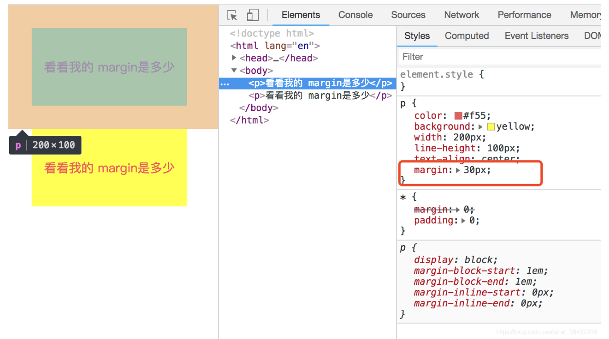
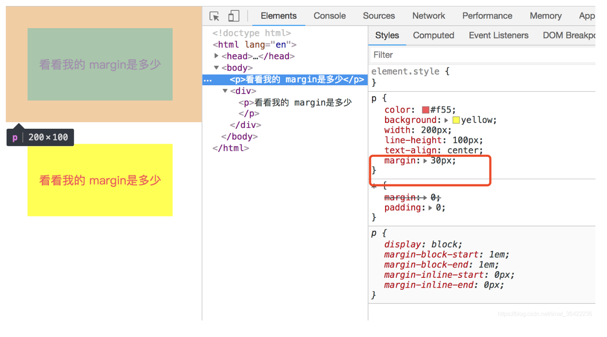
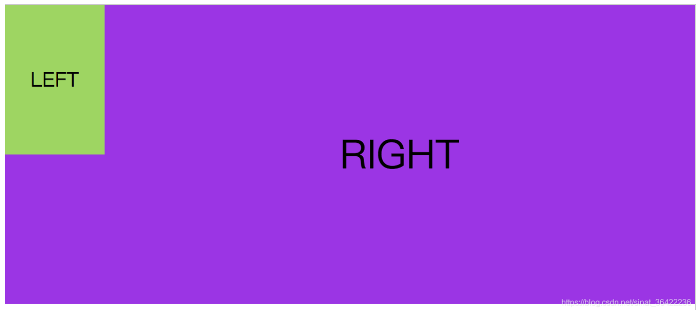
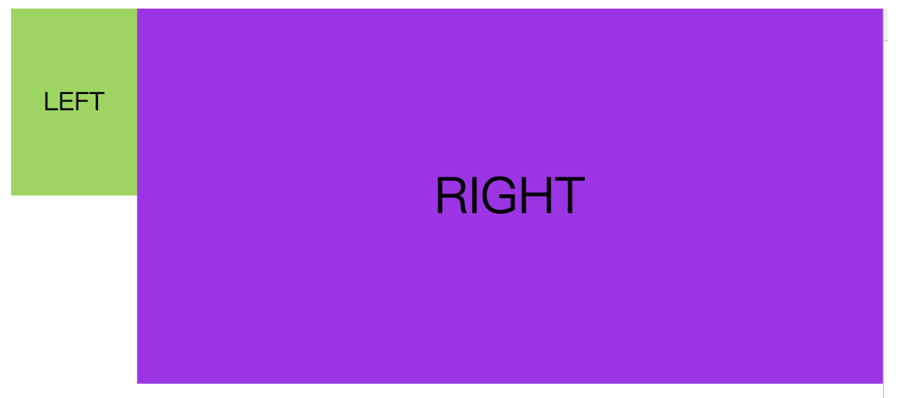
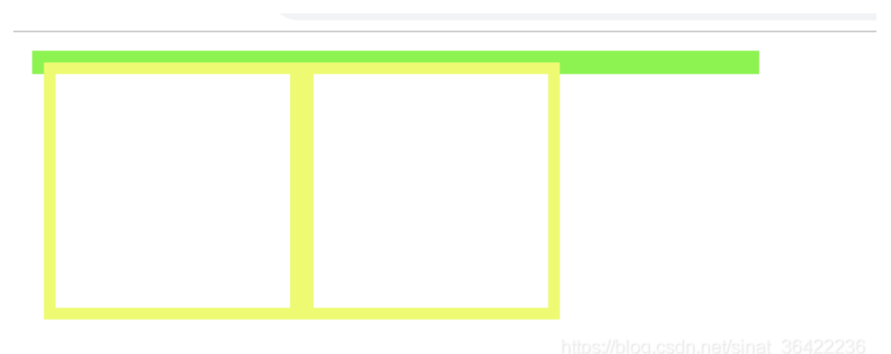

BFC 定义

> BFC(Block formatting context)直译为"块级格式化上下文"。它是一个独立的渲染区域，只有Block-level box参与， 它规定了内部的Block-level Box如何布局，并且与这个区域外部毫不相干。
> 在解释什么是BFC之前，我们需要先知道Box、Formatting Context的概念。

## Box：css布局的基本单位

Box 是 CSS 布局的对象和基本单位， 直观点来说，就是一个页面是由很多个 Box 组成的。元素的类型和 display 属性，决定了这个 Box 的类型。 不同类型的 Box， 会参与不同的 Formatting Context（一个决定如何渲染文档的容器），因此Box内的元素会以不同的方式渲染。让我们看看有哪些盒子：

* block-level box:display 属性为 block, list-item, table 的元素，会生成 block-level box。并且参与 block fomatting context；

* inline-level box:display 属性为 inline, inline-block, inline-table 的元素，会生成 inline-level box。并且参与 inline formatting context；

* run-in box: css3 中才有， 这儿先不讲了。

##  Formatting Context

Formatting context 是 W3C CSS2.1 规范中的一个概念。它是页面中的一块渲染区域，并且有一套渲染规则，它决定了其子元素将如何定位，以及和其他元素的关系和相互作用。最常见的 Formatting context 有 Block fomatting context (简称BFC)和 Inline formatting context (简称IFC)。

> BFC是一个独立的布局环境，其中的元素布局是不受外界的影响，并且在一个BFC中，块盒与行盒（行盒由一行中所有的内联元素所组成）都会垂直的沿着其父元素的边框排列。

### BFC的布局规则

内部的Box会在垂直方向，一个接一个地放置。

Box垂直方向的距离由margin决定。属于同一个BFC的两个相邻Box的margin会发生重叠。

每个盒子（块盒与行盒）的margin box的左边，与包含块border box的左边相接触(对于从左往右的格式化，否则相反)。即使存在浮动也是如此。

BFC的区域不会与float box重叠。

BFC就是页面上的一个隔离的独立容器，容器里面的子元素不会影响到外面的元素。反之也如此。

计算BFC的高度时，浮动元素也参与计算。

### 如何创建BFC

> 1. float的值不是none。
> 2. position的值不是static或者relative。
> 3. display的值是inline-block、table-cell、flex、table-caption或者inline-flex
> 4. overflow的值不是visible

## BFC的作用

### 1.利用BFC避免margin重叠。

一起来看一个例子：
```
<!DOCTYPE html>
<html lang="en">
<head>
    <meta charset="UTF-8">
    <meta name="viewport" content="width=device-width, initial-scale=1.0">
    <meta http-equiv="X-UA-Compatible" content="ie=edge">
    <title>防止margin重叠</title>
</head>
<style>
    *{
        margin: 0;
        padding: 0;
    }
    p {
        color: #f55;
        background: yellow;
        width: 200px;
        line-height: 100px;
        text-align:center;
        margin: 30px;
    }
</style>
<body>
    <p>看看我的 margin是多少</p>
    <p>看看我的 margin是多少</p>
</body>
</html>
```

页面生成的效果就是这样的：



根据第二条，属于同一个BFC的两个相邻的Box会发生margin重叠，所以我们可以设置，两个不同的BFC，也就是我们可以让把第二个p用div包起来，然后激活它使其成为一个BFC
```
<!DOCTYPE html>
<html lang="en">
<head>
    <meta charset="UTF-8">
    <meta name="viewport" content="width=device-width, initial-scale=1.0">
    <meta http-equiv="X-UA-Compatible" content="ie=edge">
    <title>防止margin重叠</title>
</head>
<style>
    *{
        margin: 0;
        padding: 0;
    }
    p {
        color: #f55;
        background: yellow;
        width: 200px;
        line-height: 100px;
        text-align:center;
        margin: 30px;
    }
    div{
        overflow: hidden;
    }
</style>
<body>
    <p>看看我的 margin是多少</p>
    <div>
        <p>看看我的 margin是多少</p>
    </div>
</body>
</html>
```



### 2.自适应两栏布局

根据：

每个盒子的margin box的左边，与包含块border box的左边相接触(对于从左往右的格式化，否则相反)。即使存在浮动也是如此。
```
<!DOCTYPE html>
<html lang="en">
<head>
    <meta charset="UTF-8">
    <meta name="viewport" content="width=device-width, initial-scale=1.0">
    <meta http-equiv="X-UA-Compatible" content="ie=edge">
    <title>Document</title>
</head>
<style>
    *{
        margin: 0;
        padding: 0;
    }
    body {
        width: 100%;
        position: relative;
    }

    .left {
        width: 100px;
        height: 150px;
        float: left;
        background: rgb(139, 214, 78);
        text-align: center;
        line-height: 150px;
        font-size: 20px;
    }
     
    .right {
        height: 300px;
        background: rgb(170, 54, 236);
        text-align: center;
        line-height: 300px;
        font-size: 40px;
    }
</style>
<body>
    <div class="left">LEFT</div>
    <div class="right">RIGHT</div>
</body>
</html>
```

页面：



又因为：

BFC的区域不会与float box重叠。
所以我们让right单独成为一个BFC
```
<!DOCTYPE html>
<html lang="en">
<head>
    <meta charset="UTF-8">
    <meta name="viewport" content="width=device-width, initial-scale=1.0">
    <meta http-equiv="X-UA-Compatible" content="ie=edge">
    <title>Document</title>
</head>
<style>
    *{
        margin: 0;
        padding: 0;
    }
    body {
        width: 100%;
        position: relative;
    }

    .left {
        width: 100px;
        height: 150px;
        float: left;
        background: rgb(139, 214, 78);
        text-align: center;
        line-height: 150px;
        font-size: 20px;
    }
     
    .right {
        overflow: hidden;
        height: 300px;
        background: rgb(170, 54, 236);
        text-align: center;
        line-height: 300px;
        font-size: 40px;
    }
</style>
<body>
    <div class="left">LEFT</div>
    <div class="right">RIGHT</div>
</body>
</html>
```

页面：




right会自动的适应宽度，这时候就形成了一个两栏自适应的布局。

### 3.清楚浮动。

当我们不给父节点设置高度，子节点设置浮动的时候，会发生高度塌陷，这个时候我们就要清楚浮动。

比如这样：
```
<!DOCTYPE html>
<html lang="en">
<head>
    <meta charset="UTF-8">
    <meta name="viewport" content="width=device-width, initial-scale=1.0">
    <meta http-equiv="X-UA-Compatible" content="ie=edge">
    <title>清除浮动</title>
</head>
<style>
    .par {
        border: 5px solid rgb(91, 243, 30);
        width: 300px;
    }

    .child {
        border: 5px solid rgb(233, 250, 84);
        width:100px;
        height: 100px;
        float: left;
    }
</style>
<body>
    <div class="par">
        <div class="child"></div>
        <div class="child"></div>
    </div>
</body>
</html>
```



这个时候我们根据最后一条：

- 计算BFC的高度时，浮动元素也参与计算。

给父节点激活BFC

```
<!DOCTYPE html>
<html lang="en">
<head>
    <meta charset="UTF-8">
    <meta name="viewport" content="width=device-width, initial-scale=1.0">
    <meta http-equiv="X-UA-Compatible" content="ie=edge">
    <title>清除浮动</title>
</head>
<style>
    .par {
        border: 5px solid rgb(91, 243, 30);
        width: 300px;
        overflow: hidden;
    }

    .child {
        border: 5px solid rgb(233, 250, 84);
        width:100px;
        height: 100px;
        float: left;
    }
</style>
<body>
    <div class="par">
        <div class="child"></div>
        <div class="child"></div>
    </div>
</body>
</html>
```

页面：


总结

以上例子都体现了：

BFC就是页面上的一个隔离的独立容器，容器里面的子元素不会影响到外面的元素。反之也如此。
因为BFC内部的元素和外部的元素绝对不会互相影响，因此， 当BFC外部存在浮动时，它不应该影响BFC内部Box的布局，BFC会通过变窄，而不与浮动有重叠。同样的，当BFC内部有浮动时，为了不影响外部元素的布局，BFC计算高度时会包括浮动的高度。避免margin重叠也是这样的一个道理。


————————————————