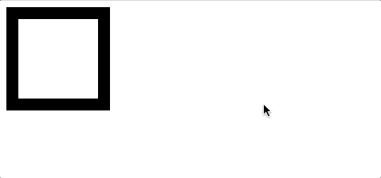

# CSS动画：animation、transition、transform、translate傻傻分不清

本文首发于我的博客网站:[Vince's Blog](http://vince.xin/article/5acc34c06b78214ab8ac58bf)

### 前言

在平时开发过程中，由于都是自己捣鼓玩的项目，并没有UI设计给我的设计图，更没有什么特效要求，导致对css动画一直都不是很熟悉，但是作为即将进入实习单位的萌新程序员，要时刻准备着设计师要求的各种动画，于是有了这一篇文章。

### 容易混淆的几个css属性

css属性很多，并且有些无论是字母的拼写还是字面上的意思，都容易混淆，比如我列出来的几个属性，是不是也混淆过你～

| 属性               | 含义                                                         |
| ------------------ | ------------------------------------------------------------ |
| animation（动画）  | 用于设置动画属性，他是一个简写的属性，包含6个属性            |
| transition（过渡） | 用于设置元素的样式过度，和animation有着类似的效果，但细节上有很大的不同 |
| transform（变形）  | 用于元素进行旋转、缩放、移动或倾斜，和设置样式的动画并没有什么关系，就相当于color一样用来设置元素的“外表” |
| translate（移动）  | translate只是transform的一个属性值，即移动。                 |

弄清楚这几个问题，我们就可以头脑清醒的状态下去学习css的动画

### transition

什么叫过渡？字面意思上来讲，就是元素从这个属性(color)的某个值(red)过渡到这个属性(color)的另外一个值(green)，这是一个状态的转变，需要一种条件来触发这种转变，比如我们平时用到的:hoever、:focus、:checked、媒体查询或者JavaScript。

先从一个简单的demo来看看transition的效果

```
<!DOCTYPE html>
<html lang="en">
<head>
  <title>transition</title>
  <style>
    #box {
      height: 100px;
      width: 100px;
      background: green;
      transition: transform 1s ease-in 1s;
    }

    #box:hover {
      transform: rotate(180deg) scale(.5, .5);
    }
  </style>
</head>
<body>
  <div id="box"></div>
</body>
</html>

复制代码
```

效果：


我们来分析这一整个过程，首先transition给元素设置的过渡属性是transform，当鼠标移入元素时，元素的transform发生变化，那么这个时候就触发了transition，产生了动画，当鼠标移出时，transform又发生变化，这个时候还是会触发transition，产生动画，所以transition产生动画的条件是transition设置的property发生变化，这种动画的特点是需要“一个驱动力去触发”，有着以下几个不足：

1. 需要事件触发，所以没法在网页加载时自动发生
2. 是一次性的，不能重复发生，除非一再触发
3. 只能定义开始状态和结束状态，不能定义中间状态，也就是说只有两个状态
4. 一条transition规则，只能定义一个属性的变化，不能涉及多个属性。

语法：**transition: property duration timing-function delay;**

| 值                         | 描述                              |
| -------------------------- | --------------------------------- |
| transition-property        | 规定设置过渡效果的 CSS 属性的名称 |
| transition-duration        | 规定完成过渡效果需要多少秒或毫秒  |
| transition-timing-function | 规定速度效果的速度曲线            |
| transition-delay           | 定义过渡效果何时开始              |

### animation

在官方的介绍上介绍这个属性是transition属性的扩展，弥补了transition的很多不足，我理解为animation是由多个transition的效果叠加，并且可操作性更强，能够做出复杂酷炫的效果(前提是你爱折腾)，我们以一个例子来介绍animation的威力：

```
<!DOCTYPE html>
<html lang="en">

<head>
  <title>animation</title>
  <style>
    .box {
      height: 100px;
      width: 100px;
      border: 15px solid black;
      animation: changebox 1s ease-in-out 1s infinite alternate running forwards;
    }

    .box:hover {
      animation-play-state: paused;
    }

    @keyframes changebox {
      10% {
        background: red;
      }
      50% {
        width: 80px;
      }
      70% {
        border: 15px solid yellow;
      }
      100% {
        width: 180px;
        height: 180px;
      }
    }
  </style>
</head>

<body>
  <div class="box"></div>
</body>

</html>
复制代码
```





分析：

我们先来看看keyframes这个关键点，它定义了一个动画组合叫changebox，里面的10%，50%，70%，100%代表在变化中不同时间点的属性值，比如这个动画的总时间是1s，那么10%就是在0-0.1s中的动画，通过这个我们可以较精确的控制动画变化中任何一个时间点的属性效果，这大大提高了我们对动画的把控，是做复杂动画的基础，我们再回来看animation中整整八个值，是不是有点夸张，还没见过这么长的值，通过控制animation的每个值，控制动画变得非常灵活，我们来具体了解它的语法以及各个值代表着什么：

语法：**animation: name duration timing-function delay iteration-count direction play-state fill-mode;**

| 值              | 描述                                                         |
| --------------- | ------------------------------------------------------------ |
| name            | 用来调用@keyframes定义好的动画，与@keyframes定义的动画名称一致 |
| duration        | 指定元素播放动画所持续的时间                                 |
| timing-function | 规定速度效果的速度曲线，是针对每一个小动画所在时间范围的变换速率 |
| delay           | 定义在浏览器开始执行动画之前等待的时间，值整个animation执行之前等待的时间 |
| iteration-count | 定义动画的播放次数，可选具体次数或者无限(infinite)           |
| direction       | 设置动画播放方向：normal(按时间轴顺序),reverse(时间轴反方向运行),alternate(轮流，即来回往复进行),alternate-reverse(动画先反运行再正方向运行，并持续交替运行) |
| play-state      | 控制元素动画的播放状态，通过此来控制动画的暂停和继续，两个值：running(继续)，paused(暂停) |
| fill-mode       | 控制动画结束后，元素的样式，有四个值：none(回到动画没开始时的状态)，forwards(动画结束后动画停留在结束状态)，backwords(动画回到第一帧的状态)，both(根据animation-direction轮流应用forwards和backwards规则)，注意与iteration-count不要冲突(动画执行无限次) |

animation与transition 不同的是，keyframes提供更多的控制，尤其是时间轴的控制，这点让css animation更加强大，使得flash的部分动画效果可以由css直接控制完成，而这一切，仅仅只需要几行代码，也因此诞生了大量基于css的动画库，用来取代flash的动画部分。在我的项目中一般用 [Animate.css](https://daneden.github.io/animate.css/) 来设置一些动画，期待在工作中能够用animation完美实现UI设计师给的设计图～

### 总结

写这篇文章的目的是提醒自己不要将这四个属性混淆，顺便详细讲解CSS制作动画的方法，简单一次性的动画中推荐使用transition，比较逻辑清晰，可维护性较好。如果遇到比较复杂的动画，这个时候便可以拿出animation开始你的表演，其实不仅仅用css能实现动画，用js同样可以操控元素的样式实现动画，这个时候你脑海里是不是浮现出setTimeout,setInterval来控制样式实现动画，当然可以，但是相比新出的requestAnimationFrame，它能够更高性能地执行动画，这里抛砖引玉，小伙伴们可以尝试去谷歌以下，后面我也会就这个新出的函数写一篇详细的指南。

文章中有错误欢迎指点～

The Next Day is Always a New Day