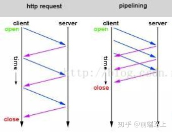
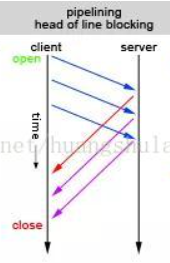
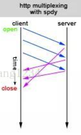
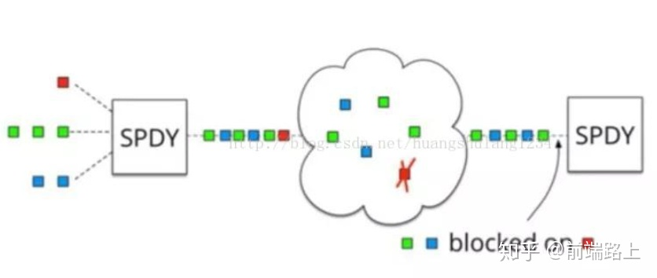

## **简单聊下前端日常接触的HTTP协议[https://zhuanlan.zhihu.com/p/148381179]**

### **前言**

2020年已过半，近期为了准备面试，重新学习了HTTP的部分知识点，以下是我个人对HTTP协议发展的理解，通过近期学习整理的笔记。

### **HTTP是一个属于应用层的面向对象的协议，主要特点概括主要有5点：**

1、无状态：协议对于事务处理无记忆能力，每次客户端发起请求，都会新开一个TCP连接。

2、支持客户/服务器模式。

3、简单快速：客户端请求只需发送请求方法和路径。

4、灵活：允许任意类型的数据对象，使用Content-Type加以标记。

5、无连接：TCP不可复用，即服务器处理完客户请求并收到应答后，断开连接，节省传输时间。

我将着重对**无状态、无连接**涉及到的点进行一些讲解。

**1、无状态**

对于无状态，就需要扯到**Cookie和Session**了，**他们是对HTTP协议无状态的补充和改良。**为什么这么说呢？

在理解无状态的定义之后，我们可以举个例子：

在我们访问需要权限的内容时，如果没有**Cookie和Session**来存储客户端首次输入的用户名和密码，那么在接下来每一次访问时，都需要重新输入，这一项就已经非常繁琐了。

**2、无连接**

对于无连接，我们分HTTP不同版本进行讲述，以下几点内容也是面试中经常会问到的：

首先在**HTTP 0.9**版本中，每次请求都需要新开一个TCP连接，是不可复用的，这非常的消耗性能。

因此在**HTTP 1.0**版本，引入了**Keep-Alive 持久连接**的概念，使用**Connection: Keep-Alive**的首部来操作TCP的持久连接，有效的解决了TCP连接不可复用的问题，减少性能损耗。

但是，他也存在一定的问题，在**HTTP 1.0**中其实**默认**的是**短链接**，没有正式规定**Connection: Keep-Alive**操作，这时**HTTP 1.1版本出现了**。

**pipelining 管道技术**

对于**HTTP 1.1**版本，不仅继承了HTTP 1.0的特点，且克服了诸多在HTTP 1.0上的性能问题，不仅正式规定了**Connection: Keep-Alive**的操作，而且通过**pipelining**管道技术实现一次性发送多个请求，以提高吞吐和性能，如下图（ps：在网上找的图），左图为普通长连接的的请求TCP请求过程，右图为通过**pipelining**管道技术实现的一次性发送多个请求。

**队头阻塞**

然而，**pipelining**管道技术有**队头阻塞**问题，即服务器在接收响应时，要求必须按照发送请求的顺序返回。若第一个请求被堵塞了，则后面的请求即使处理完毕了，也需要等待，如下图。

**数据分帧**

就在这时，光芒照在了**HTTP 2.0**上，**HTTP 2.0 over TCP**出现了，它通过**数据分帧** — 多个请求复用一个TCP连接（最多6个），然后每个request-response都被拆分成若干个frame帧发送，这样即使一个请求被阻塞了，也不会影响其他请求，如下图，**其实它只解决了一部分问题~**

ps：如果队头阻塞的粒度是http request级别，那么HTTP/2 over TCP的确解决了HTTP 1.1中的问题。但是在**HTTP 2.0 over TCP**版本都是基于**TCP**实现。因此，**HTTP 2.0 over TCP**并没有解决数据传输层的队头阻塞问题。

如上图所示，当第一个数据包发生丢包的时候，TCP协议会发生阻塞会进行**数据重传**。虽然TCP有**快速重传等机制**来缓解这个问题，但是**只能缓解，无法完全避免**。

**那么如何解决传输层的队头阻塞问题呢？**

因为应用层无法解决传输层的问题，因此需要重新设计和实现传输层，接下来我们看看Google横空出世的**HTTP 2.0 over QUIC**怎么解决这个问题。

**UDP**

**HTTP 2.0 over QUIC**也可以称为**HTTP 3.0**，它使用UDP实现了一个可靠的多路复用传输层。我们所知的UDP是面向数据报文的，数据包之间没有约束（这也带来了一定的安全性问题，详见[UDP协议及其安全隐患](https://link.zhihu.com/?target=https%3A//blog.csdn.net/fu_yunjian/article/details/104934240)），QUIC就是充分利用这个特性解决传输层的队头阻塞问题的。当然，QUIC的协议实现有非常多的细节，而这方面Google确实做得非常好，如果你想进一步了解，可以关注他们的[开源实现](https://link.zhihu.com/?target=https%3A//chromium.googlesource.com/chromium/src/%2B/master/net/quic/)。

### **小结**

1、HTTP 0.9版本，**TCP不可复用**，耗性能。

2、HTTP 1.0版本，引入**Keepei-Alive**概念，实为短连接，未正名。

3、HTTP 1.1版本，为长连接，正名**Keep-Alive**，引入**pipelining 管道技术**，但有**队头阻塞**问题。

4、HTTP 2.0 over TCP版本，启用数据分帧，只解决粒度级别为http request的队头阻塞。

5、HTTP 2.0 over QUIC即HTTP 3.0版本，启用UDP协议**真正的**解决传输层的队头阻塞问题。