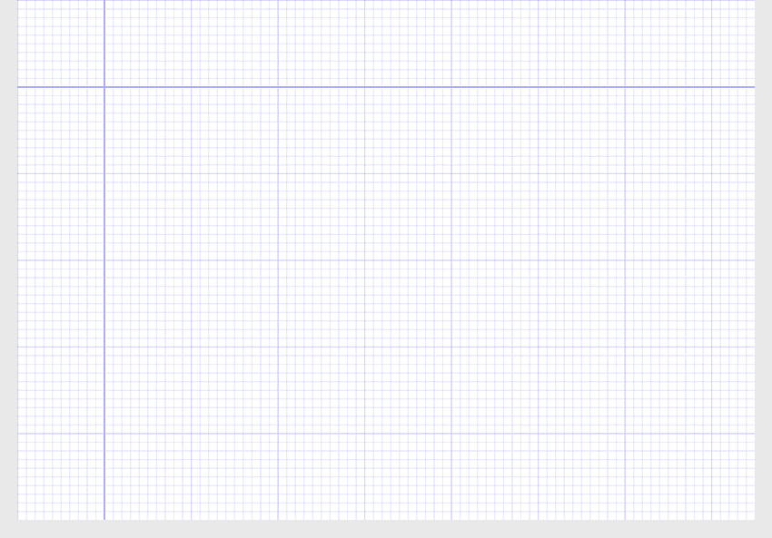
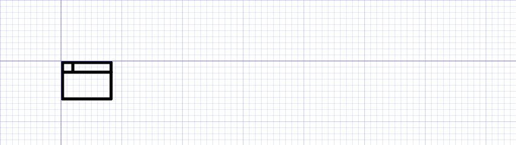
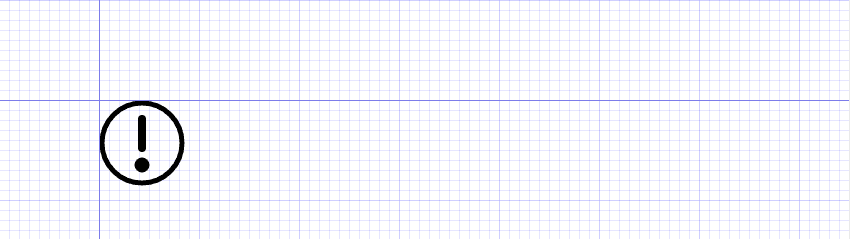
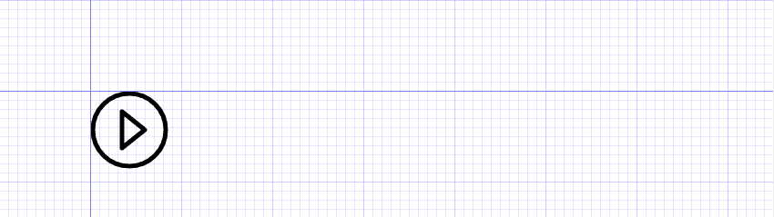
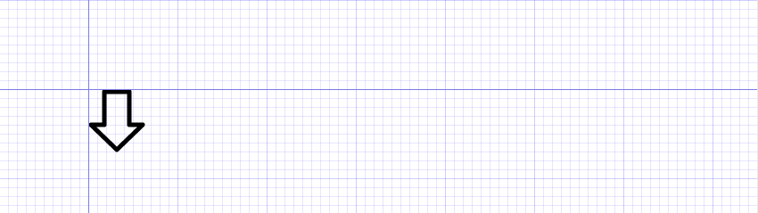
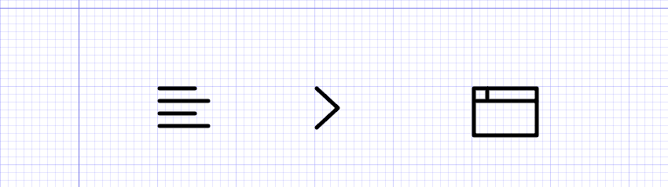

# SVG入门—如何手写SVG

https://juejin.cn/post/6844903589807128590#heading-10

> 欢迎关注富途web开发团队 ，[缺人从众](https://futu.im/article/invite/)

小编刚来公司的时候，有个需求需要做一个图形动画，当时本来想使用图片做的。Toobug看了需求后，就说可以使用SVG做呀。小编当时对与SVG一点都不会呀。Toobug看我那无辜的表情，说没事。我这有一本书 [《SVG精髓》](https://book.douban.com/subject/26640057/)（作者：就是Toobug），你拿去看看，边学边做呗。

好吧，小编后面就看了一个星期的SVG精髓，现在也算入门了吧。

那么今天小编也不是让大家来买书的，只希望我们团队 WillWang 翻译的这篇SVG入门文章会对大家入门SVG有帮助。

# 正文

可缩放矢量图形的一大优势（除了它们可以被无限缩放而没有质量损失之外）是一旦你知道了基本的原理，无需打开绘图程序你就能很容易地手写出一些简单的形状。

只要很少的几行代码你就可以拥有你的自定义图标，而且你还很清楚每个图标是怎么组合出来的。当你创建自己的 `SVG` 时，你可以确保以最有效的方式来编写它们，并且当你在站点中使用它们时，你拥有最大的控制权。

在本教程中，我们将涵盖手写 `SVG` 的所有基本原理，但我不会用一个仅仅是丢出一系列相关形状和属性的文章来烦你们。相反，你们会通过实践来学习如何手写 `SVG`，创建出本教程开头那张图片上所列的6个图标（[在线示例](https://tutsplus.github.io/how-to-hand-code-svg/Completed/handcodedsvg.html)）。在此过程中，你将会用到手写 `SVG` 所需的所有基本元素。

说到那些基本元素，让我们快速地介绍一下他们每一个的情况。


这些是你即将创建的图标


# 基本的 `SVG` 元素

你可以深入 `SVG` 复杂的细节，但这对我们即将创建的图标不是必须的。以下列表涵盖了我们将用到的构建块。

- `<svg>` 包裹并定义整个矢量图。`<svg>` 标签之于矢量图就如同 `<html>` 标签之于一个 web 页面。
- `<line>` 创建一条直线。
- `<polyline>` 创建折线。
- `<rect>` 创建矩形。
- `<ellipse>` 创建圆和椭圆。
- `<polygon>` 创建多边形。
- `<path>` 通过指定点以及点和点之间的线来创建任意形状。
- `<defs>` 定义一个可复用的图形。初始情况下 `<defs>` 里面的内容是不可见的。`<defs>` 标签之于矢量图就如同 `<head>` 标签之于一个 web 页面。
- `<g>` 将多种形状组合起来。将组合后的形状置于 `<defs>` 中可以让它能够被复用。
- `<symbol>` 类似于一个组合，但是拥有一些额外的特性。通常被置于 `<defs>` 标签中便于复用。
- `<use>` 获取在 `<defs>` 中定义的复用对象并在 `SVG` 中显示出来。

当我们继续阅读并创建我们的图标时，我们将以上面所看到的元素列表的顺序进行。

# 起始文件

在我们开始之前，从这个 [GitHub 仓库](https://github.com/tutsplus/how-to-hand-code-svg)取一份起始文件。你可以下载一个 .zip 格式的文件或者直接将这个仓库 clone 到本地。

我们将从一个已经包含了一些基本的 `HTML` 和 `CSS` 的文件开始。这会给我们即将创建的 `SVG` 以一些样式，也会在页面上准备一些小网格。我们将会在这些网格上创建我们的图标，希望它能在你放置你的 `SVG` 时帮助你确定坐标。

当你打开 `Starter Files` 目录下的文件 `handcodedsvg.html` 时，你应当会看到如下图所示的样子：





## `x` 和 `y` 值概述

在网站的二维平面上，用 `x` 代表横轴，`y` 代表纵轴。每个坐标轴上的位置都用数字表示。使用递增的 `x` 值来让物体右移，使用递减的 `x` 值来让物体左移。同样地，使用递增的 `y` 值来让物体下移，使用递减的 `y` 值来让物体上移。

一个常用的表示某一点的 `x` 值和 `y` 值的简写是 `(x, y)`。例如，一个在 `x` 轴上的值为 `10`，在 `y` 轴上的值为 `50` 的点可以写成 `(10, 50)`。在本教程中，我将不时地使用这个简写形式。

注意到我们网格中的那两条最粗的线了吗？我们将 `SVG` 的左上角与那两条直线相交的地方对齐放置。因此，这个交点将在我们的 `SVG` 中代表 `x=0` 和 `y=0`，即`(0, 0)` 的位置。

## 网格背景

每条最细的网格线之间相距 `10px`，中等粗细的线之间相距 `100px`。因此若我们想将一个物体从一个中等粗细的线向下移动到另一个中等粗细的线，我们只需把 `y` 轴上的值增加 `100px`。

如果这听起来仍然有点不清楚，不用担心，在我们进行创建 `SVG` 图标的实际操作时你就会明白了。

## 默认的 `SVG` 样式

注意在初始的 `HTML` 文件中有一些内嵌的 `CSS` 设置了我们即将创建的图标的默认样式。

```
svg {
  stroke: #000;
  stroke-width: 5;
  stroke-linecap: round;
  stroke-linejoin: round;
  fill: none;
}
复制代码
```

上述 CSS 设置了我们的图标是无填充的，粗细 `5px` 的黑色线条绘制，边角平滑。

# 1. 设置 `SVG`

创建任何 `SVG` 的第一步是写下一个 `<svg></svg>` 元素。你所期望你的 `SVG` 显示的所有内容都必须放在这个标签内部。在这个元素上可以使用一些属性，但为了保持简单，我们只使用宽度和高度。

将下面的代码添加到你的 HTML 文档的 `<body>` 标签里去：

```
<svg width="750" height="500">

</svg>
复制代码
```

注意：在我们的起始文件中的 `CSS` 会将这个 `SVG` 向下和向右各偏移 `100px`，以此保证 `SVG` 的左上角被置于背景网格中两条最粗的直线的交点处。在本教程的 `CodePen` 演示中的值也可能会稍有不同——但可以随意地对它们进行操作。

# 2. 创建 `左对齐` 图标

让我们从使用 `<line>` 元素创建这个`左对齐`图标开始：


你会用到 `line` 元素的4个属性：

- `x1`：起点的水平轴坐标
- `y1`：起点的竖直轴坐标
- `x2`：终点的水平轴坐标
- `y2`：终点的竖直轴坐标

综上，你会使用属性 `x1` 和 `y1` 来设置直线的起点，使用属性 `x2` 和 `y2` 来设置直线的终点。

让我们创建我们的图标的第一条线，即顶部的那条。我们打算让线长 `45px`，然而我们使用的 `5px` 粗细的笔画会在我们的线条外增加一些额外的像素。因此我们需要将线条向右下角偏移 `3px` 以确保所有因 `stroke` 产生的额外像素都不会被剪掉。

基于上述原因，我们从 `x` 轴的坐标 `3` 和 `y` 轴的坐标 `3` 处开始我们的直线。我们可以用属性 `x1="3" y1="3"` 来设置线的起点为 `(3, 3)`。

我们打算让线长 `45px`，所以在起点的 `x` 轴坐标值 `3` 上加上 `45` 得到 `x2` 的值为 `48`。我们想让直线在水平轴上的相同位置结束，因此设置 `y2` 等于 `3`，也就是与 `y1` 相等的值。通过属性 `x2="48" y2="3"` 设置了线的终点 `(48, 3)`。

这第一根线的完整代码看起来应该是这样的：

```
<line x1="3" y1="3" x2="48" y2="3"></line>
复制代码
```

查看你浏览器中的预览，你会看到一条长 `45px` 的圆润黑线。

现在我们可以继续给我们的图标添加接下来的三条线。我们打算最终画出四条线。第一和第三根线长 `45px`，第二和第四根线长 `62px`。我们还想要在每条线之间有 `16px` 的垂直间距。

我们可以通过如下的代码得到这个图标：

```
<line x1="3" y1="3" x2="48" y2="3"></line>
<line x1="3" y1="19" x2="65" y2="19"></line>
<line x1="3" y1="35" x2="48" y2="35"></line>
<line x1="3" y1="51" x2="65" y2="51"></line>
复制代码
```

注意：每条线的 `y` 值以 `16px` 递增来创建所需的垂直间距。

再看一看你的浏览器预览，你应该看到所有的四条线。你也可以直接在下面的 `codepen` 中编辑 `SVG`:

代码详情：[codepen.io/new4/](https://codepen.io/new4/)

## 在我们继续之前先注释掉你的图标

有了这些代码，你的第一个图标就已经完成了。我们已经准备好继续去创建下一个图标了，我们想在网格的相同位置上创建这个图标，但现在 `左对齐` 图标占着这个位置。因此，现在需要注释掉它的代码来清理空间。稍后当我们将图标转换为可重用部件时，我们会回过头来恢复被注释掉的代码。

你需要对我们之后创建的每一个图标做同样的事情，即在完成创建之后将其注释掉。出于这个原因，在每个图标的代码之上添加一个小提示或许是个不错的注意，这样在之后回顾的时候你就知道哪个是哪个了。

# 3. 创建一个 `插入` 图标

对于这个图标，让我们使用直线 `<line>` 元素衍生而来的折线元素：即 `<polyline>`。我们将会使用它来创建一个指向右方的插入符。


`<polyline>` 元素只有一个属性：`points`。在这里你会使用一对对的数字来设置一系列的点。点和点之间的线段会自动绘制出来。数值对就简单地一个接一个的被写在点属性里。可以使用逗号分隔，但这不是必须的。为了便于阅读，你可能还想在代码中将每一对值写成一行。

我们会在上一个图标的起始点处开始我们的 `插入` 图标，那就是 `(3, 3)`，这确保了我们的笔画和线的端头不会被剪掉。我们想让第二个点向右移动，并向下移 `25px`，那么我们把它设为 `(30,28)`。我们的第三个点应该与第一个点垂直对齐，同时再向下移动 `25px`，所以它应被设为 `(3,53)`。

你可以把这些点添加到 `<polyline>` 的 `points` 属性中去，如下：

```
<polyline points="
  3 3
  30 28
  3 53
"></polyline>
复制代码
```

如果你想要更简洁的代码，你也可以把上面的代码写成：

```
<polyline points="3 3, 30 28, 3 53"></polyline>
复制代码
```

或者

```
<polyline points="3 3 30 28 3 53"></polyline>
复制代码
```

看一看你的浏览器预览，你会看到你的 `插入` 图标的显示：另一个图标就这样完成了！

代码详情：[codepen.io/new4/](https://codepen.io/new4/)

同样地，在进入下一个图标之前先注释掉当前这个图标，并给它加上一个能让你知道它是什么图标的小提示。

# 4. 创建一个 `浏览器` 图标

现在我们有了线条，让我们从矩形（`<rect>`）开始创建一些形状。我们将把它与一些 `<line>` 结合起来创建一个 `浏览器` 图标。





长方形和正方形可以通过 `<rect>` 元素来创建。`<rect>` 有4个需要提供值的属性：

- `x`：左上角的 `x` 轴坐标值
- `y`：左上角的 `y` 轴坐标值
- `width`：矩形的宽度
- `height`：矩形的高度

注意：你也可以使用属性 `rx` 和 `ry` 来指定矩形的圆角半径。

我们要创建一个矩形，它的左上角有 `3px` 的偏移量，同样是为了避免描边的截断，所以我们会用到 `x="3" y="3"` 的属性值。我们希望它是宽 `80px`，高 `60px` 的，所以我们用到 `width="80" height="60"` 的属性值。

因此我们完整的矩形代码就应该是：

```
<rect x="3" y="3" width="80" height="60"></rect>
复制代码
```

保存代码，到浏览器里面进行预览。你应该看到一个整洁的小矩形。

现在我们所要做的就是在顶部添加一条水平线，还有在靠近左上角的地方加上一条竖线，就像你在本节开始时所看到图像中的那样。我们将使用与之前绘制线段相同的过程，完整的 `浏览器` 图标代码看起来应该是这样的：

```
<rect x="3" y="3" width="80" height="60"></rect>
<line x1="3" y1="19" x2="83" y2="19"></line>
<line x1="20" y1="3" x2="20" y2="17"></line>
复制代码
```

花点时间查看一下这两条线段的属性所提供的坐标，你可以稍微改变一下它们的值来看看它们在这个图标中是如何工作的。

代码详情：[codepen.io/new4/](https://codepen.io/new4/)

# 5. 创建一个 `警示` 图标

现在我们可以控制矩形的创建，我们再试试使用 `<ellipse>`。我们将使用两个 `<ellipse>` 以及一个 `<line>` 来创建这个 `警示` 的图标。





类似于矩形，`<ellipse>` 元素也需要4个属性，然而这些属性和矩形的不同。我们使用的是水平和竖直半径而不是宽度和高度，同样地，我们通过中心而不是通过指定左上角来进行定位。

- `cx`：中心位置在 x 轴上的坐标
- `cy`：中心位置在 y 轴上的坐标
- `rx`：沿 x 轴向的半径，也就是它会把图形分割成上下两部分
- `ry`：沿 y 轴向的半径，也就是它会把图形分割成左右两部分

我们想要一个宽 `80px` 高 `80px` 的正圆，这意味着在两个轴上它的半径均为 `40px`。我们用 `rx="40" ry="40"` 来设置这个值。

我们还想要这个圆处于与图上那两条最粗的线平齐的位置。假定我们的圆宽高均是 `80px`，那么放置圆心的位置就是 `40px`。同时为了避免图标被截断，需要 `3px` 的偏移量，那么圆的中心点就在两轴的 `43px` 处。我们用属性 `cx="43" cy="43"` 来设定这个值。

将这些设定的属性值放在一起，就得到如下代码:

```
<ellipse cx="43" cy="43" rx="40" ry="40"></ellipse>
复制代码
```

查看你的浏览器预览，现在在你的页面上应该能看到一个圆。

现在我们要添加第二个圆，创建感叹号底部的那个点。我们将以同样的方式创建它，唯一的区别是我们将使用内联样式来设置黑色的填充：

```
<ellipse style="fill:black;" cx="43" cy="65" rx="5" ry="5"></ellipse>
复制代码
```

最后，我们只需要添加感叹号另外的线段部分。同样地，我们使用的技术与我们之前创建线段的一样，唯一的区别是我们将使用内联风格来将笔画的宽度从 `5px` 增加到 `8px`。

`警示` 图标的完整代码如下：

代码详情：[codepen.io/new4/](https://codepen.io/new4/)

# 6. 创建一个 `播放` 图标

现在我们已经有一些如矩形和椭圆形这样外形相对固定的形状，我们准备使用 `<polygon>` 元素来生成我们自己的形状。从八边形到五角星，我们可以用这个元素创建出我们想要的多边形。不过，我们现在就把事情弄清楚并创建一个三角形。我们将把它与一个 `<ellipse>` 元素组合在一起来创建一个 `播放` 图标：





`<polygon>` 元素和 `<polyline>` 元素几乎一样。他们都只有一个 `points` 属性，采用一对对的值的形式来设置每一个点从而组成一个形状。不同之处在于，折线 `<polyline>` 不是闭合的而多边形 `<polygon>` 是自动闭合的。

让我们从下面这个圆开始，我们的多边形会放在它里面。我们使用的圆与我们在警告图标里面使用的相同：

```
<ellipse cx="43" cy="43" rx="40" ry="40"></ellipse>
复制代码
```

现在我们来创建多边形。我们将会放置三个点，这些点之间会自动生成线段来创建一个三角形。点将是 `(35,23)`，`(60,43)` 和 `(35,63)`。如此，我们的多边形代码将会是：

```
<polygon points="35 23, 60 43, 35 63" />
复制代码
```

`播放` 图标的完整代码如下：

代码详情：[codepen.io/new4/](https://codepen.io/new4/)

# 7. 创建一个 `下载` 图标

现在，我们将学习最复杂的，但同时也是最灵活的生成 `SVG` 图形的方法，即 `<path>` 元素。创建一个路径有点像创建一个多边形，每次仅需将你的形状的一部分展示出来。然而，在路径中你直接创建每一个点，自定义每一条线，你还可以选择在点之间创建曲线而不是直线。

路径可以用来创建任何东西，但如果超出一定程度的复杂性之后，你最好还是使用矢量设计应用程序，而不是手写代码。出于这个原因，我们将重点关注一小部分路径功能，并使用它来创建这个 `下载` 图标：





从技术上讲，你可以使用多边形来创建上面这个形状，但是这个箭头可以很好地帮助我们弄清楚路径元素是怎么工作的。

我们将会只用到 `<path>` 的属性 `d`。`d` 代表 `data`，在这里，你将定义路径的所有点和线。在这个属性里，设置路径点和在点之间创建连线的命令是由诸如 `M` 或 `L` 这样的单个字母来提供的，然后是一组 `x` 和/或 `y` 坐标。

这样的命令有很多，但本文只是介绍 `<path>` 的使用，我们将只介绍一些在手动编码时可以实际使用的命令。

- `M` 表示移动到（`moveto`）。它用 `x` 值和 `y` 值来给定一条新的路径的起始点。可以想象成把你的鼠标放在画布上的某一点以准备开始绘画。大写的 `M` 表示移动到一个绝对坐标集合（小写的 `m` 表示移动到一个相对坐标集合）。
- `L` 表示划线到（`lineto`）。从当前位置到新的位置画一条线。大写的 `L` 表示移动到一个绝对坐标集合（小写的 `l` 表示移动到一个相对坐标集合）。
- `Z` 表示闭合路径。通过在当前点和路径的起始点之间画一条直线来闭合形状。

你一定要看下这三个命令（以及我们将用它们创建的图标）作为入门 `<path>` 元素的读物。要真正掌握它，你可以自行去熟悉路径的所有[命令](https://www.w3.org/TR/SVG/paths.html#DAttribute)。

## 编写你的 `下载` 图标

要对 `下载` 图标路径进行编码，建议先添加一个空路径元素：

```
<path d="
 
"></path>
复制代码
```

从这里开始，一次添加一个命令，保存并查看图标形状的进展，这样你就可以看到它是如何被创建出来的。我还建议将每个命令写成一行以提高可读性。

- 首先，我们移动到点 `(18, 3)` 处，这是我们的箭头开始的位置。为了完成这个动作，需要在路径的属性 `d` 中增加命令 `M 18 3`。
- 接着我们想使用 `L` 命令来从起始点开始沿着 `x` 轴画出一条 `28px` 的线段。为了完成这个动作，我们给属性 `d` 添加第二个命令：`L 46 3`。查看你浏览器预览，你会看到一条水平的短横线。
- 现在用 `L 46 40` 直接向下画一条 `37px` 的线。
- 然后用 `L 61 40` 直接向右进 `15px`。
- 接下来，我们要开始创建箭头点。我们需要向左下方画一条斜线。我们用 `L 32 68` 完成它。
- 然后用 `L 3 40` 画一条向左上方的斜线。
- 现在我们用 `L 18 40` 来向右边画一条线以完成我们的箭头。
- 为了使我们的形状闭合，我们无需通过指定一个点来画一条直线。我们所要做的就是添加 `Z` 命令，它会自动闭合我们的形状。

最终的箭头图标代码如下：

```
<path d="
  M 18 3
  L 46 3
  L 46 40
  L 61 40
  L 32 68
  L 3 40
  L 18 40
  Z
"></path>
复制代码
```

关于使用 `<path>` 的更多信息可以查看本文末尾附上的引用文章。

代码详情：[codepen.io/new4/](https://codepen.io/new4/)

# 8. 添加 `<defs>` 元素

我们已经完成了6个图标的编码工作，现在我们可以在我们的 `SVG` 中准备好放置和重用它们。

为了做到这个，我们要将我们的6个图标代码（目前已经被注释掉了）用 `<defs></defs>` 包裹起来：

```
<defs>
<!-- 到目前为止，你创建的所有图标都在这里 -->
</defs>
复制代码
```

这样做会告诉系统，目前我们完成的所有图标在我们明确地去使用它们之前默认都是隐藏的。

现在，你可以去掉对每个图标的注释，它们不会出现在页面上。

# 9. 用 `<g>` 创建组合对象

有两种方法可以使我们的图标随时可用：将它们转换为组合，或转换为模板。我们将把前面的一半图标转换成组合，然后把剩下的一半变成模板，这样我们就可以说明他们之间的区别。

要把我们的一个图标转换成一个组合，我们要做的就是用标签 `<g></g>` 来包裹它。为了使这个组合可用，我们还需要给它一个唯一的`ID`。

例如:

```
<g id="leftalign">
    <!-- 左对齐图标 -->
    <line x1="3" y1="3" x2="48" y2="3"></line>
    <line x1="3" y1="19" x2="65" y2="19"></line>
    <line x1="3" y1="35" x2="48" y2="35"></line>
    <line x1="3" y1="51" x2="65" y2="51"></line>
</g>
复制代码
```

用 `<g></g>` 将你最开始创建的3个图标分别包裹起来，并添加上唯一`ID`，如下：

```
<g id="leftalign">
    <!-- 左对齐图标 -->
    <line x1="3" y1="3" x2="48" y2="3"></line>
    <line x1="3" y1="19" x2="65" y2="19"></line>
    <line x1="3" y1="35" x2="48" y2="35"></line>
    <line x1="3" y1="51" x2="65" y2="51"></line>
</g>

<g id="rightcaret">
    <!-- 插入图标 -->
    <polyline points="
    3 3
    30 28
    3 53
    "></polyline>
</g>

<g id="browser">
    <!-- 浏览器图标 -->
    <rect x="3" y="3" width="80" height="60"></rect>
    <line x1="3" y1="19" x2="83" y2="19"></line>
    <line x1="20" y1="3" x2="20" y2="17"></line>
</g>
复制代码
```

# 10. 使用 `<use>` 来放置组合

在 `<defs>` 元素内部我们现在有三个图标被定义成组合，我们准备在 `SVG` 中使用它们。为了使用它们，我们需要做的就是添加一个 `<use>` 元素（确保在 `<defs>` 元素以外且之后的地方添加它），并设置一个 `href`属性指向想要的那个图标的 `ID`。

例如，添加下面的代码来使用 `左对齐` 图标：

```
<use href="#leftalign"></use>
复制代码
```

通过指定 `x` 和 `y` 的值来将图标放置到特定的位置：

```
<use href="#leftalign" x="100" y="100"></use>
复制代码
```

添加所有三个图标并把它们分开排放的代码看起来是这样的：

```
<use href="#leftalign" x="100" y="100"></use>
<use href="#rightcaret" x="300" y="100"></use>
<use href="#browser" x="500" y="100"></use>
复制代码
```

查看浏览器，你应该会看到这样的三个图标：





# 11. 使用 `symbols` 创建模板对象

除了组合之外，你也可以使用模板来定义你的图标。模板几乎和组合一样，但是你可以获得额外的设置来控制视口（`viewbox`）和长宽比。

如果你想要把我们目前创建的图标设置为居中，这将非常有用。我们将把剩下的三个图标转换成模板，然后使它们垂直填充100像素高的空间，并在这个空间中水平居中。

我们以与创建组合相同的方式来创建我们的模板，只是将我们最后三个图标的代码包裹进 `<symbol></symbol>` 模板中。我们也需要给每个模板加一个唯一的 `ID`。

但是我们也需要添加一个叫做 [`viewBox` 的属性](https://developer.mozilla.org/en-US/docs/Web/SVG/Attribute/viewBox)。该属性让我们可以定义每个模板的可见部分应该是什么。当浏览器能够访问这些信息时，它就可以正确地缩放和排列模板。

我们需要给 `viewBox` 属性4个值。前两个定义图标的左上角，第三和第四分别定义它的宽度和高度。

从我们的 `警示` 图标开始，它的宽高都是 `86px`，所以我们设置它的 `viewBox` 属性值为 `0 0 86 86`，如下：

```
<symbol id="alert" viewBox="0 0 86 86">
    <!-- 警示图标 -->
    <ellipse cx="43" cy="43" rx="40" ry="40"></ellipse>
    <ellipse style="fill:black;" cx="43" cy="65" rx="5" ry="5"></ellipse>
    <line style="stroke-width: 8;" x1="43" y1="19" x2="43" y2="48"></line>
</symbol>
复制代码
```

`播放` 图标的宽高也是 `86px`，`下载` 图标宽 `64px` 高 `71px`。因此我们图标模板相应的代码应该是：

```
<symbol id="alert" viewBox="0 0 86 86">
    <!-- 警示图标 -->
    <ellipse cx="43" cy="43" rx="40" ry="40"></ellipse>
    <ellipse style="fill:black;" cx="43" cy="65" rx="5" ry="5"></ellipse>
    <line style="stroke-width: 8;" x1="43" y1="19" x2="43" y2="48"></line>
</symbol>

<symbol id="play" viewBox="0 0 86 86">
    <!-- 播放图标 -->
    <ellipse cx="43" cy="43" rx="40" ry="40"></ellipse>
    <polygon points="35 23, 60 43, 35 63" />
</g>

<symbol id="download" viewBox="0 0 64 71">
    <!-- 下载图标 -->
    <path d="
    M 18 3
    L 46 3
    L 46 40
    L 61 40
    L 32 68
    L 3 40
    L 18 40
    Z
    "></path>
</symbol>
复制代码
```

# 12. 使用 `<use>` 来放置模板

现在，我们可以像使用我们的组合一样使用我们的模板图标。不过我们也会提供已经设好了宽高属性为 `100px` 的图标：

```
<use href="#alert" x="100" y="200" width="100" height="100"></use>
<use href="#play" x="300" y="200" width="100" height="100"></use>
<use href="#download" x="500" y="200" width="100" height="100"></use>
复制代码
```

你会看到每个基于模板的图标都整齐地填充并居中在长宽 `100px` 的空间内：


试着给使用基于组合图标的 `<use>` 元素上添加宽高的属性。你会发现没什么变化。这是因为浏览器依靠的是 `viewBox` 的值（组合没有这个值）来确定如何缩放图标。

# 总结

以下是完整的代码：

```
<!DOCTYPE html>
<html lang="en">

<head>
  <meta charset="UTF-8">
  <meta name="viewport" content="width=device-width, initial-scale=1.0">
  <meta http-equiv="X-UA-Compatible" content="ie=edge">
  <title>Hand Coded SVG</title>
  <style>
    html,
    body {
      height: 100%;
      width: 100%;
      background: #e9e9e9;
    }

    body {
      margin: 0;
      text-align: center;
    }

    .grid {
      width: 750px;
      height: 500px;
      margin: 0 auto;
      padding-top: 100px;
      padding-left: 100px;
      background-image: url('grid.png');
      position: relative;
    }

    .grid::before {
      content: "";
      border-left: 1px solid #7c7cea;
      position: absolute;
      top: 0;
      left: 100px;
      width: 750px;
      height: 600px;
    }

    .grid::after {
      content: "";
      border-top: 1px solid #7c7cea;
      position: absolute;
      top: 100px;
      left: 0;
      width: 850px;
      height: 500px;
    }

    svg {
      stroke: rgb(0, 0, 0);
      stroke-width: 5;
      stroke-linecap: round;
      stroke-linejoin: round;
      fill: none;
    }
  </style>
</head>

<body>
  <div class="grid">
    <svg width="750" height="500">
      <defs>
        <g id="leftalign">
          <!-- Left align icon made with lines -->
          <line x1="3" y1="3" x2="48" y2="3"></line>
          <line x1="3" y1="19" x2="65" y2="19"></line>
          <line x1="3" y1="35" x2="48" y2="35"></line>
          <line x1="3" y1="51" x2="65" y2="51"></line>
        </g>

        <g id="rightcaret">
          <!-- Right caret icon made with a polyline -->
          <polyline points="
            3 3
            30 28
            3 53
          "></polyline>
        </g>

        <g id="browser">
          <!-- Browser icon made with rectangle and lines -->
          <rect x="3" y="3" width="80" height="60"></rect>
          <line x1="3" y1="19" x2="83" y2="19"></line>
          <line x1="20" y1="3" x2="20" y2="17"></line>
        </g>

        <symbol id="alert" viewBox="0 0 86 86">
          <!-- Alert icon made with ellipses and a line -->
          <ellipse cx="43" cy="43" rx="40" ry="40"></ellipse>
          <ellipse style="fill:black;" cx="43" cy="65" rx="5" ry="5"></ellipse>
          <line style="stroke-width: 8;" x1="43" y1="19" x2="43" y2="48"></line>
        </symbol>

        <symbol id="play" viewBox="0 0 86 86">
          <!-- Play icon made with ellipse and polygon -->
          <ellipse cx="43" cy="43" rx="40" ry="40"></ellipse>
          <polygon points="35 23, 60 43, 35 63" />
          </g>

          <symbol id="download" viewBox="0 0 64 71">
            <!-- Download icon made with path -->
            <path d="
                M 18 3
                L 46 3
                L 46 40
                L 61 40
                L 32 68
                L 3 40
                L 18 40
                Z
            "></path>
          </symbol>
      </defs>
      <use href="#leftalign" x="100" y="100"></use>
      <use href="#rightcaret" x="300" y="100"></use>
      <use href="#browser" x="500" y="100"></use>
      <use href="#alert" x="100" y="200" width="100" height="100"></use>
      <use href="#play" x="300" y="200" width="100" height="100"></use>
      <use href="#download" x="500" y="200" width="100" height="100"></use>
    </svg>
  </div>
</body>

</html>
复制代码
```

这就涵盖了手写 `SVG` 的要点了！让我们总结一下我们所学到的:

- 设置你的 `<svg>` 元素来包裹你的整个图形。
- 使用 `<line>` 和 `<polyline>` 来创造线。
- 使用 `<rect>`, `<ellipse>` 和 `<polygon>` 来创造闭合的图形。
- 使用 `<path>` 来创造你想要的任何形状。
- 使用 `<g>` 来组合形状。
- 对于需要有额外特性的组合使用 `<symbol>`
- 使用 `<defs>` 元素定义组合和模板。
- 使用 `<use>` 元素来放置你定义的组合和模板。

通过本教程我们打下了坚实的基础，但是你还可以使用 `SVG` 做更多的事情，所以不要止步于此，继续挖掘并发现更多可以实现的令人赞叹的东西！

与此同时，希望你不再完全依赖于矢量设计应用程序来创建 `SVG`，并且你有信心可以手写一些自己的图形。对于更复杂的图形来说，设计类应用仍然是一种可行的方法，但是你可以利用你所掌握的构建模块做很多事，获得手写代码带来的速度和控制方面的优势。

## 相关链接

- [Complete SVG element reference](https://developer.mozilla.org/en-US/docs/Web/SVG/Element)
- [`` element reference](https://developer.mozilla.org/en-US/docs/Web/SVG/Element/svg)
- [`` element reference](https://developer.mozilla.org/en-US/docs/Web/SVG/Element/line)
- [`` element reference](https://developer.mozilla.org/en-US/docs/Web/SVG/Element/polyline)
- [`` element reference](https://developer.mozilla.org/en-US/docs/Web/SVG/Element/rect)
- [`` element reference](https://developer.mozilla.org/en-US/docs/Web/SVG/Element/ellipse)
- [`` element reference](https://developer.mozilla.org/en-US/docs/Web/SVG/Element/polygon)
- [`` element reference](https://developer.mozilla.org/en-US/docs/Web/SVG/Element/path)
- [`d` attribute reference](https://developer.mozilla.org/en-US/docs/Web/SVG/Attribute/d)
- [`` element reference](https://developer.mozilla.org/en-US/docs/Web/SVG/Element/defs)
- [`` element reference](https://developer.mozilla.org/en-US/docs/Web/SVG/Element/g)
- [`` element reference](https://developer.mozilla.org/en-US/docs/Web/SVG/Element/use)
- [`` element reference](https://developer.mozilla.org/en-US/docs/Web/SVG/Element/symbol)

------

原文：[How to Hand Code SVG](https://webdesign.tutsplus.com/tutorials/how-to-hand-code-svg--cms-30368)

作者：[Kezz Bracey](https://tutsplus.com/authors/kezz-bracey)

译者：WillWang