#[你不知道的 Web Workers (上)](https://juejin.cn/post/6844904198639714311#heading-9)

阅读完本文你将学到以下知识：

- 进程与线程的区别：进程与线程的概念及单线程与多线程；
- 浏览器内核的相关知识：GUI 渲染线程、JavaScript 引擎线程、事件触发线程等；
- Web Workers 是什么：Web Workers 的限制与能力及主线程与 Web Workers 之间如何通信；
- Web Workers 的分类：Dedicated Worker、Shared Worker 和 Service Workers；
- Web Workers API：Worker 构造函数及如何观察 Dedicated Worker 等。

阅读阿宝哥近期热门文章（感谢掘友的鼓励与支持🌹🌹🌹）：

- [1.2W字 | 了不起的 TypeScript 入门教程](https://juejin.im/post/6844904182843965453)（1160+ 个👍）
- [让人眼前一亮的 10 大 TS 项目](https://juejin.im/post/6844904185838698503)（670+ 个👍）
- [一文读懂 TypeScript 泛型及应用（ 7.8K字）](https://juejin.im/post/6844904184894980104)（530+ 个👍）
- [前端存储除了 localStorage 还有啥](https://juejin.im/post/6844904192549584903)（396+ 个👍）
- [图片处理不用愁，给你十个小帮手](https://juejin.im/post/6844904197675024391)（405+ 个👍）

下面我们开始步入正题，为了让大家能够更好地理解和掌握 Web Workers，在正式介绍 Web Workers 之前，我们先来介绍一些与 Web Workers 相关的基础知识。

### 一、进程与线程的区别

在介绍进程与线程的概念前，我们先来看个进程与线程之间关系形象的比喻：

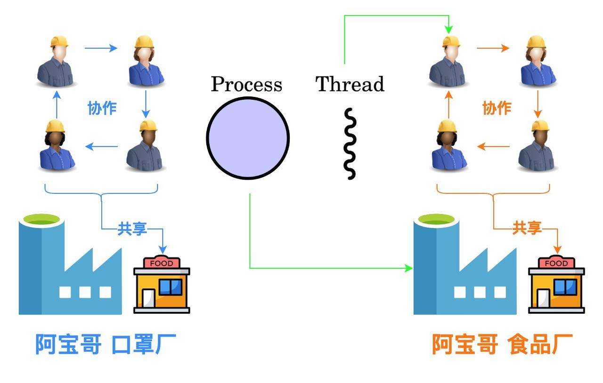

如上图所示，进程是一个工厂，它有独立的资源，线程是工厂中的工人，多个工人协作完成任务，工人之间共享工厂内的资源，比如工厂内的食堂或餐厅。此外，工厂（进程）与工厂（进程）之间是相互独立的。为了让大家能够更直观地理解进程与线程的区别，我们继续来看张图：

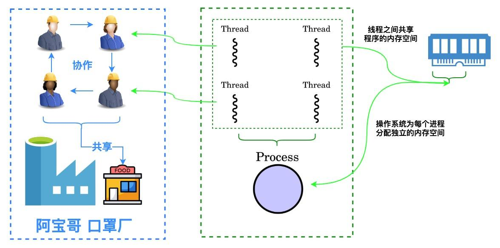

由上图可知，操作系统会为每个进程分配独立的内存空间，一个进程由一个或多个线程组成，同个进程下的各个线程之间共享程序的内存空间。相信通过前面两张图，小伙伴们对进程和线程之间的区别已经有了一定的了解，那么实际情况是不是这样呢？这里我们打开 macOS 操作系统下的活动监视器，来看一下写作本文时所有进程的状态：

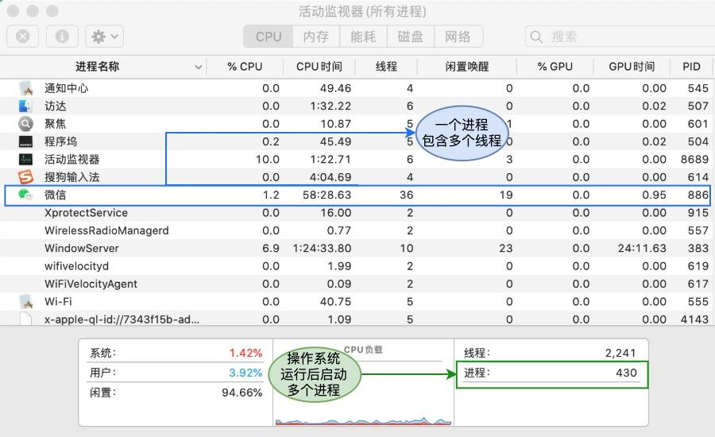

通过上图可知，我们常用的软件，比如微信和搜狗输入法都是一个独立的进程，拥有不同的 PID（进程 ID），而且图中的每个进程都含有多个线程，以微信进程为例，它就含有 **「36」** 个线程。那么什么是进程和线程呢？下面我们来介绍进程和线程的概念。

#### 1.1 进程的概念

进程（英语：process），是指计算机中已运行的程序。进程曾经是分时系统的基本运作单位。在面向进程设计的系统（如早期的 UNIX，Linux 2.4 及更早的版本）中，进程是程序的基本执行实体；**「在面向线程设计的系统（如当代多数操作系统、Linux 2.6 及更新的版本）中，进程本身不是基本运行单位，而是线程的容器。」**

程序本身只是指令、数据及其组织形式的描述，进程才是程序的真正运行实例。若干进程有可能与同一个程序相关系，且每个进程皆可以同步或异步的方式独立运行。现代计算机系统可在同一段时间内以进程的形式将多个程序加载到存储器中，并借由时间共享（或称时分复用），以在一个处理器上表现出同时运行的感觉。

#### 1.2 线程的概念

线程（英语：thread）是操作系统能够进行运算调度的最小单位。大部分情况下，它被包含在进程之中，是进程中的实际运作单位。**「一条线程指的是进程中一个单一顺序的控制流，一个进程中可以并发多个线程，每条线程并行执行不同的任务。」**

线程是独立调度和分派的基本单位。线程可以为操作系统内核调度的内核线程，如 Win32 线程；由用户进程自行调度的用户线程，如 Linux 平台的 POSIX Thread；或者由内核与用户进程，如 Windows 7 的线程，进行混合调度。

**「同一进程中的多条线程将共享该进程中的全部系统资源，如虚拟地址空间，文件描述符和信号处理等等。」**但同一进程中的多个线程有各自的调用栈（call stack），自己的寄存器环境（register context），自己的线程本地存储（thread-local storage）。一个进程可以有很多线程，每条线程并行执行不同的任务。

#### 1.3 单线程与多线程

如果一个进程只有一个线程，我们称之为单线程。单线程在程序执行时，所走的程序路径按照连续顺序排下来，前面的必须处理好，后面的才会执行。单线程处理的优点：同步应用程序的开发比较容易，但由于需要在上一个任务完成后才能开始新的任务，所以其效率通常比多线程应用程序低。

如果完成同步任务所用的时间比预计时间长，应用程序可能会不响应。针对这个问题，我们可以考虑使用多线程，即在进程中使用多个线程，这样就可以处理多个任务。

对于 Web 开发者熟悉的 JavaScript 来说，它运行在浏览器中，是单线程的，每个窗口一个 JavaScript 线程，既然是单线程的，在某个特定的时刻，只有特定的代码能够被执行，其它的代码会被阻塞。

> ❝
>
> JS 中其实是没有线程概念的，所谓的单线程也只是相对于多线程而言。JS 的设计初衷就没有考虑这些，针对 JS 这种不具备并行任务处理的特性，我们称之为 “单线程”。 —— 来自知乎 “如何证明 JavaScript 是单线程的？” @云澹的回答
>
> ❞

其实在浏览器内核（渲染进程）中除了 JavaScript 引擎线程之外，还含有 GUI 渲染线程、事件触发线程、定时触发器线程等。因此对于浏览器的渲染进程来说，它是多线程的。接下来我们来简单介绍浏览器内核。

### 二、浏览器内核

**「浏览器最核心的部分是 “Rendering Engine”，即 “渲染引擎”，不过我们一般习惯将之称为 “浏览器内核”。」** 它主要包括以下线程：

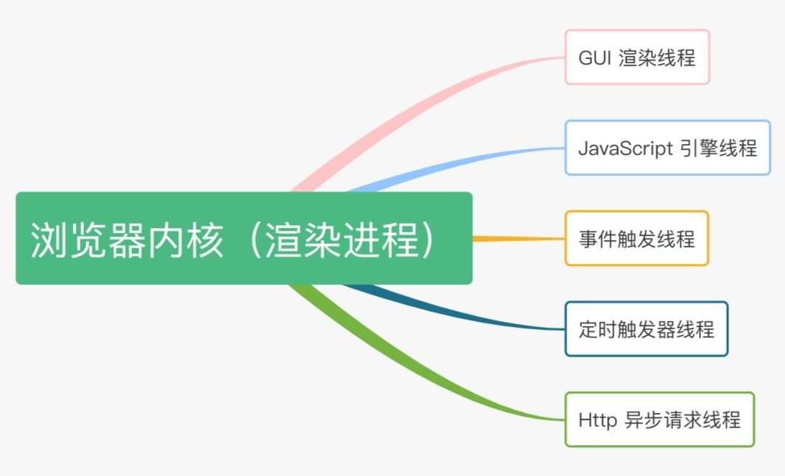

下面我们来分别介绍渲染进程中的每个线程。

#### 2.1 GUI 渲染线程

GUI 渲染线程负责渲染浏览器界面，解析 HTML，CSS，构建 DOM 树和 RenderObject 树，布局和绘制等。当界面需要重绘（Repaint）或由于某种操作引发回流（Reflow）时，该线程就会执行。

#### 2.2 JavaScript 引擎线程

JavaScript 引擎线程负责解析 JavaScript 脚本并运行相关代码。 JavaScript 引擎一直等待着任务队列中任务的到来，然后进行处理，一个Tab页（Renderer 进程）中无论什么时候都只有一个 JavaScript 线程在运行 JavaScript 程序。

需要注意的是，GUI 渲染线程与 JavaScript 引擎线程是互斥的，所以如果 JavaScript 执行的时间过长，这样就会造成页面的渲染不连贯，导致页面渲染被阻塞。

#### 2.3 事件触发线程

当一个事件被触发时该线程会把事件添加到待处理队列的队尾，等待 JavaScript 引擎的处理。这些事件可以是当前执行的代码块如定时任务、也可来自浏览器内核的其他线程如鼠标点击、AJAX 异步请求等，但由于 JavaScript 引擎是单线程的，所有这些事件都得排队等待 JavaScript 引擎处理。

#### 2.4 定时触发器线程

浏览器定时计数器并不是由 JavaScript 引擎计数的，这是因为 JavaScript 引擎是单线程的，如果处于阻塞线程状态就会影响记计时的准确，所以通过单独线程来计时并触发定时是更为合理的方案。我们日常开发中常用的 setInterval 和 setTimeout 就在该线程中。

#### 2.5 Http 异步请求线程

在 XMLHttpRequest 在连接后是通过浏览器新开一个线程请求， 将检测到状态变更时，如果设置有回调函数，异步线程就产生状态变更事件放到 JavaScript 引擎的处理队列中等待处理。

前面我们已经知道了，由于 JavaScript 引擎与 GUI 渲染线程是互斥的，如果 JavaScript 引擎执行了一些计算密集型或高延迟的任务，那么会导致 GUI 渲染线程被阻塞或拖慢。那么如何解决这个问题呢？嘿嘿，当然是使用本文的主角 —— Web Workers。

### 三、Web Workers 是什么

Web Worker 是 HTML5 标准的一部分，这一规范定义了一套 API，它允许一段 JavaScript 程序运行在主线程之外的另外一个线程中。Web Worker 的作用，就是为 JavaScript 创造多线程环境，允许主线程创建 Worker 线程，将一些任务分配给后者运行。

在主线程运行的同时，Worker 线程在后台运行，两者互不干扰。等到 Worker 线程完成计算任务，再把结果返回给主线程。这样的好处是，可以在独立线程中处理一些计算密集型或高延迟的任务，从而允许主线程（通常是 UI 线程）不会因此被阻塞或拖慢。

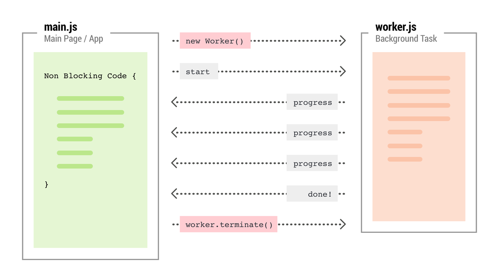

（图片来源：https://thecodersblog.com/web-worker-and-implementation/）

#### 3.1 Web Workers 的限制与能力

通常情况下，你可以在 Worker 线程中运行任意的代码，但注意存在一些例外情况，比如：**「直接在 worker 线程中操纵 DOM 元素，或使用 window 对象中的某些方法和属性。」** 大部分 window 对象的方法和属性是可以使用的，包括 WebSockets，以及诸如 IndexedDB 和 FireFox OS 中独有的 Data Store API 这一类数据存储机制。

下面我们以 Chrome 和 Opera 所使用的 Blink 渲染引擎为例，介绍该渲染引擎下 Web Worker 中所支持的常用 APIs：

- [Cache](https://developer.mozilla.org/zh-CN/docs/Web/API/Cache)：Cache 接口为缓存的 Request / Response 对象对提供存储机制，例如，作为ServiceWorker 生命周期的一部分。
- [CustomEvent](https://developer.mozilla.org/zh-CN/docs/Web/API/CustomEvent)：用于创建自定义事件。
- [Fetch](https://developer.mozilla.org/zh-CN/docs/Web/API/Fetch_API)：Fetch API 提供了一个获取资源的接口（包括跨域请求）。任何使用过 XMLHttpRequest 的人都能轻松上手，而且新的 API 提供了更强大和灵活的功能集。
- [Promise](https://developer.mozilla.org/zh-CN/docs/Web/JavaScript/Reference/Global_Objects/Promise)：Promise 对象代表了未来将要发生的事件，用来传递异步操作的消息。
- [FileReader](https://developer.mozilla.org/zh-CN/docs/Web/API/FileReader)：FileReader 对象允许 Web 应用程序异步读取存储在用户计算机上的文件（或原始数据缓冲区）的内容，使用 File 或 Blob 对象指定要读取的文件或数据。
- [IndexedDB](https://developer.mozilla.org/zh-CN/docs/Web/API/IndexedDB_API)：IndexedDB 是一种底层 API，用于客户端存储大量结构化数据，包括文件/二进制大型对象（blobs）。
- [WebSocket](https://developer.mozilla.org/zh-CN/docs/Web/API/WebSocket)：WebSocket 对象提供了用于创建和管理 WebSocket 连接，以及可以通过该连接发送和接收数据的 API。
- [XMLHttpRequest](https://developer.mozilla.org/zh-CN/docs/Web/API/XMLHttpRequest)：XMLHttpRequest（XHR）对象用于与服务器交互。通过 XMLHttpRequest 可以在不刷新页面的情况下请求特定 URL，获取数据。这允许网页在不影响用户操作的情况下，更新页面的局部内容。

更多信息请参见： [Functions and classes available to workers](https://developer.mozilla.org/en-US/docs/Web/API/Worker/Functions_and_classes_available_to_workers) 。

#### 3.2 主线程与 Web Workers 之间的通信

主线程和 Worker 线程相互之间使用 postMessage() 方法来发送信息，并且通过 onmessage 这个事件处理器来接收信息。数据的交互方式为传递副本，而不是直接共享数据。主线程与 Worker 线程的交互方式如下图所示：

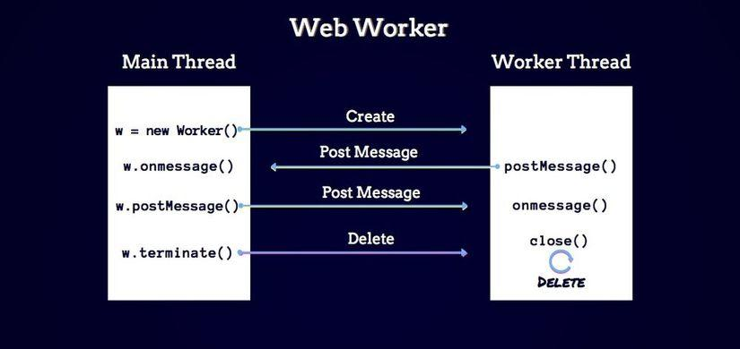

（图片来源：https://viblo.asia/p/simple-web-workers-workflow-with-webpack-3P0lPkobZox）

除此之外，Worker 还可以通过 XMLHttpRequest 来访问网络，只不过 XMLHttpRequest 对象的 `responseXML`和 `channel` 这两个属性的值将总是 `null`。

### 四、Web Workers 的分类

[Web Worker](https://www.w3.org/TR/workers/) 规范中定义了两类工作线程，分别是专用线程 Dedicated Worker 和共享线程 Shared Worker，其中，Dedicated Worker 只能为一个页面所使用，而 Shared Worker 则可以被多个页面所共享。

#### 4.1 Dedicated Worker

一个专用 Worker 仅仅能被生成它的脚本所使用，其浏览器支持情况如下：

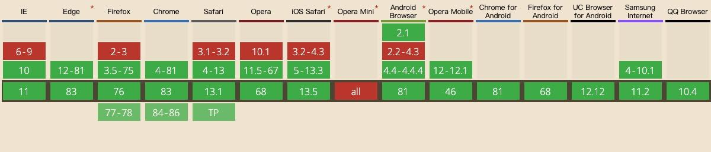

（图片来源：[https://caniuse.com/#search=Web%20Workers](https://caniuse.com/#search=Web Workers)）

需要注意的是，由于 Web Worker 有同源限制，所以在进行本地调试或运行以下示例的时候，需要先启动本地服务器，直接使用 `file://` 协议打开页面的时候，会抛出以下异常：

```
Uncaught DOMException: Failed to construct 'Worker': 
Script at 'file:///**/*.js' cannot be accessed from origin 'null'.
复制代码
```

##### 4.1.1 专用线程 Dedicated Worker：Ping/Pong

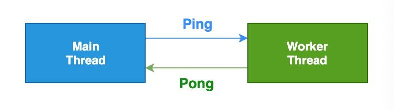

**「index.html」**

```
<!DOCTYPE html>
<html lang="zh-CN">
  <head>
    <meta charset="UTF-8" />
    <meta name="viewport" content="width=device-width, initial-scale=1.0" />
    <title>专用线程 Dedicated Worker —— Ping/Pong</title>
  </head>
  <body>
    <h3>阿宝哥：专用线程 Dedicated Worker —— Ping/Pong</h3>
    <script>
      if (window.Worker) {
        let worker = new Worker("dw-ping-pong.js");
        worker.onmessage = (e) =>
          console.log(`Main: Received message - ${e.data}`);
        worker.postMessage("PING");
      } else {
        console.log("呜呜呜，不支持 Web Worker");
      }
    </script>
  </body>
</html>
复制代码
```

**「dw-ping-pong.js」**

```
onmessage = (e) => {
  console.log(`Worker: Received message - ${e.data}`);
  postMessage("PONG");
}
复制代码
```

以上代码成功运行后，浏览器控制台会输出以下结果：

```
Worker: Received message - PING
Main: Received message - PONG
复制代码
```

每个 Web Worker 都可以创建自己的子 Worker，这允许我们将任务分散到多个线程。创建子 Worker 也很简单，具体我们来看个例子。

##### 4.1.2 专用线程 Dedicated Sub Worker：Ping/Pong


**「index.html」**

```
<!DOCTYPE html>
<html lang="zh-CN">
  <head>
    <meta charset="UTF-8" />
    <meta name="viewport" content="width=device-width, initial-scale=1.0" />
    <title>专用线程 Dedicated Sub Worker —— Ping/Pong</title>
  </head>
  <body>
    <h3>阿宝哥：专用线程 Dedicated Sub Worker —— Ping/Pong</h3>
    <script>
      if (window.Worker) {
        let worker = new Worker("dw-ping-pong.js");
        worker.onmessage = (e) =>
          console.log(`Main: Received message - ${e.data}`);
        worker.postMessage("PING");
      } else {
        console.log("呜呜呜，不支持 Web Worker");
      }
    </script>
  </body>
</html>
复制代码
```

**「dw-ping-pong.js」**

```
onmessage = (e) => {
  console.log(`Worker: Received message - ${e.data}`);
  setTimeout(() => {
    let worker = new Worker("dw-sub-ping-pong.js");
    worker.onmessage = (e) => console.log(`Worker: Received from sub worker - ${e.data}`);
    worker.postMessage("PING");
  }, 1000);
  postMessage("PONG");
};
复制代码
```

**「dw-sub-ping-pong.js」**

```
onmessage = (e) => {
  console.log(`Sub Worker: Received message - ${e.data}`);
  postMessage("PONG");
};
复制代码
```

以上代码成功运行后，浏览器控制台会输出以下结果：

```
Worker: Received message - PING
Main: Received message - PONG
Sub Worker: Received message - PING
Received from sub worker - PONG
复制代码
```

##### 4.1.3 专用线程 Dedicated Worker：importScripts

其实在 Web Worker 中，我们也可以使用 `importScripts` 方法将一个或多个脚本同步导入到 Web Worker 的作用域中。同样我们来举个例子。

**「index.html」**

```
<!DOCTYPE html>
<html lang="en">
  <head>
    <meta charset="UTF-8" />
    <meta name="viewport" content="width=device-width, initial-scale=1.0" />
    <title>专用线程 Dedicated Worker —— importScripts</title>
  </head>
  <body>
    <h3>阿宝哥：专用线程 Dedicated Worker —— importScripts</h3>
    <script>
      let worker = new Worker("worker.js");
      worker.onmessage = (e) => console.log(`Main: Received kebab case message - ${e.data}`);
      worker.postMessage(
        "Hello, My name is semlinker."
      );
    </script>
  </body>
</html>
复制代码
```

**「worker.js」**

```
importScripts("https://cdn.bootcdn.net/ajax/libs/lodash.js/4.17.15/lodash.min.js");

onmessage = ({ data }) => {
  postMessage(_.kebabCase(data));
};
复制代码
```

以上代码成功运行后，浏览器控制台会输出以下结果：

```
Main: Received kebab case message - hello-my-name-is-semlinker
复制代码
```

##### 4.1.4 专用线程 Dedicated Worker：inline-worker

在前面的例子中，我们都是使用外部的 Worker 脚本来创建 Web Worker 对象。其实你也可以通过 Blob URL 或 Data URL 的形式来创建 Web Worker，这类 Worker 也被称为 Inline Worker。

**「1. 使用 Blob URL 创建 Inline Worker」**

Blob URL/Object URL 是一种伪协议，允许 Blob 和 File 对象用作图像，下载二进制数据链接等的 URL 源。在浏览器中，我们使用 `URL.createObjectURL` 方法来创建 Blob URL，该方法接收一个 `Blob` 对象，并为其创建一个唯一的 URL，其形式为 `blob:<origin>/<uuid>`，对应的示例如下：

```
blob:https://example.org/40a5fb5a-d56d-4a33-b4e2-0acf6a8e5f641
复制代码
```

浏览器内部为每个通过 `URL.createObjectURL` 生成的 URL 存储了一个 URL → Blob 映射。因此，此类 URL 较短，但可以访问 `Blob`。生成的 URL 仅在当前文档打开的状态下才有效。它允许引用 ``、`<a>` 中的 `Blob`，但如果你访问的 Blob URL 不再存在，则会从浏览器中收到 404 错误。

```
const url = URL.createObjectURL(
  new Blob([`postMessage("Dedicated Worker created by Blob")`])
);

let worker = new Worker(url);
worker.onmessage = (e) =>
  console.log(`Main: Received message - ${e.data}`);
复制代码
```

除了在代码中使用字符串动态创建 Worker 脚本，也可以把 Worker 脚本使用类型为 `javascript/worker` 的 `script` 标签内嵌在页面中，具体如下所示：

```
<script id="myWorker" type="javascript/worker">
   self['onmessage'] = function(event) {
     postMessage('Hello, ' + event.data.name + '!');
   };
</script>
复制代码
```

接着就是通过 script 对象的 `textContent` 属性来获取对应的内容，然后使用 Blob API 和 createObjectURL API 来最终创建 Web Worker：

```
<script>
  let workerScript = document.querySelector('#myWorker').textContent;
  let blob = new Blob(workerScript, {type: "text/javascript"});
  let worker = new Worker(URL.createObjectURL(blob));
</script>
复制代码
```

**「2. 使用 Data URL 创建 Inline Worker」**

Data URLs 由四个部分组成：前缀（`data:`）、指示数据类型的 MIME 类型、如果非文本则为可选的 `base64`标记、数据本身：

```
data:[<mediatype>][;base64],<data>
复制代码
```

`mediatype` 是个 MIME 类型的字符串，例如 "`image/jpeg`" 表示 JPEG 图像文件。如果被省略，则默认值为 `text/plain;charset=US-ASCII`。如果数据是文本类型，你可以直接将文本嵌入（根据文档类型，使用合适的实体字符或转义字符）。如果是二进制数据，你可以将数据进行 base64 编码之后再进行嵌入。

```
const url = `data:application/javascript,${encodeURIComponent(
  `postMessage("Dedicated Worker created by Data URL")`
)}`;

let worker = new Worker(url);
worker.onmessage = (e) =>
  console.log(`Main: Received message - ${e.data}`);
复制代码
```

#### 4.2 Shared Worker

一个共享 Worker 是一种特殊类型的 Worker，可以被多个浏览上下文访问，比如多个 windows，iframes 和 workers，但这些浏览上下文必须同源。相比 dedicated workers，它们拥有不同的作用域。其浏览器支持情况如下：


（图片来源：[https://caniuse.com/#search=Web%20Workers](https://caniuse.com/#search=Web Workers)）

与常规的 Worker 不同，首先我们需要使用 `onconnect` 方法等待连接，然后我们获得一个端口，该端口是我们与窗口之间的连接。

##### 4.2.1 共享线程 Shared Worker：点赞计数器

**「index.html」**

```
<!DOCTYPE html>
<html lang="zh-CN">
  <head>
    <meta charset="UTF-8" />
    <meta name="viewport" content="width=device-width, initial-scale=1.0" />
    <title>共享线程 Shared Worker</title>
  </head>
  <body>
    <h3>阿宝哥：共享线程 Shared Worker</h3>
    <button id="likeBtn">点赞</button>
    <p>阿宝哥一共收获了<span id="likedCount">0</span>个👍</p>
    <script>
      let likes = 0;
      let likeBtn = document.querySelector("#likeBtn");
      let likedCountEl = document.querySelector("#likedCount");

      let worker = new SharedWorker("shared-worker.js");
      worker.port.start();

      likeBtn.addEventListener("click", function () {
        worker.port.postMessage("like");
      });

      worker.port.onmessage = function (val) {
        likedCountEl.innerHTML = val.data;
      };
    </script>
  </body>
</html>
复制代码
```

**「shared-worker.js」**

```
let a = 666;

console.log("shared-worker");
onconnect = function (e) {
  var port = e.ports[0];

  port.onmessage = function () {
    port.postMessage(a++);
  };
};
复制代码
```

在 Shared Worker 的示例页面上有一个 **「点赞」** 按钮，每次点击时点赞数会加 1。首先你新开一个窗口，然后点击几次。然后新开另一个窗口继续点击，这时你会发现当前页面显示的点赞数是基于前一个页面的点赞数继续累加。

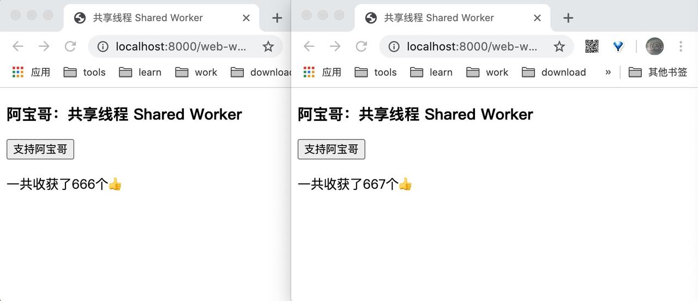

##### 4.2.2 调试 Shared Workers

在实际项目开发过程中，若需要调试 Shared Workers 中的脚本，可以通过 `chrome://inspect` 来进行调试，具体步骤如下图所示：

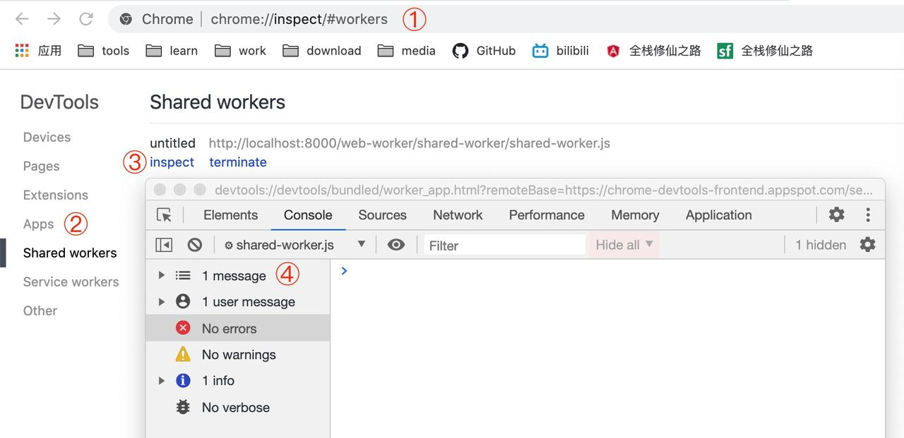

#### 4.3 Service Workers

Service workers 本质上充当 Web 应用程序与浏览器之间的代理服务器，也可以在网络可用时作为浏览器和网络间的代理。它们旨在（除其他之外）使得能够创建有效的离线体验，拦截网络请求并基于网络是否可用以及更新的资源是否驻留在服务器上来采取适当的动作。

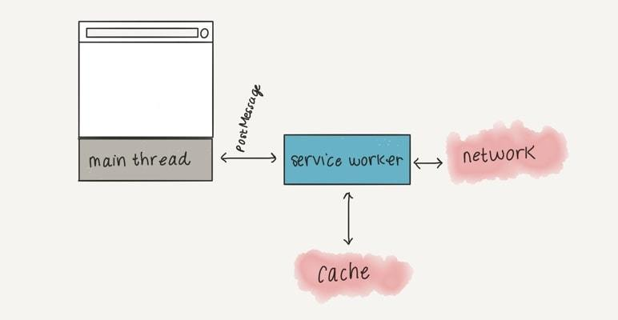

（图片来源：https://www.pavlompas.com/blog/web-workers-vs-service-workers-vs-worklets）

Service workers 的浏览器支持情况如下：

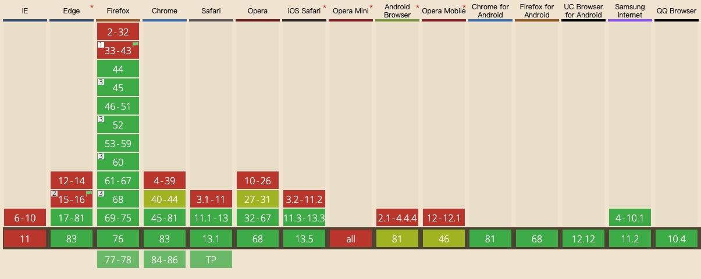

由于 Service workers 不是本文的重点，这里阿宝哥就不展开介绍了，感兴趣的小伙伴请自行了解一下。下面我们开始介绍 Web Workers API。

### 五、Web Workers API

Worker() 构造函数创建一个 Worker 对象，该对象执行指定的URL脚本。这个脚本必须遵守同源策略 。如果违反同源策略，则会抛出一个 SECURITY_ERR 类型的 DOMException。

#### 5.1 Worker 构造函数

Worker 构造函数的语法为：

```
const myWorker = new Worker(aURL, options);
复制代码
```

相关的参数说明如下：

- aURL：是一个 DOMString 表示 worker 将执行的脚本的 URL。它必须遵守同源策略。
- options（可选）：包含可在创建对象实例时设置的选项属性的对象。可用属性如下：
  - type：用以指定 Worker 类型的 DOMString 值. 该值可以是 classic 或 module。如果未指定，将使用默认值 classic。
  - credentials：用以指定 worker 凭证的 DOMString 值。该值可以是 omit，same-origin 或 include。如果未指定，或者 type 是 classic，将使用默认值 omit (不要求凭证)。
  - name：在 DedicatedWorkerGlobalScope 的情况下，用来表示 Worker 的 scope 的一个 DOMString 值，主要用于调试目的。

需要注意的是，在创建 Web Worker 的时候，可能会出现以下异常：

- 当 document 不被允许启动 worker 的时候，将抛出一个 SecurityError 异常。比如：如果提供的 aURL 有语法错误，或者与同源策略相冲突（跨域访问）。
- 如果 worker 的 MIME 类型不正确，将抛出一个 NetworkError 异常。worker 的 MIME 类型必须是 `text/javascript`。
- 如果 aURL 无法被解析（格式错误），将抛出一个 SyntaxError 异常。

**「示例」**

```
const worker = new Worker("task.js");
复制代码
```

当我们调用 Worker 构造函数后会返回一个 Worker 线程对象，用来供主线程操作 Worker。Worker 线程对象的属性和方法如下：

- Worker.onerror：指定 error 事件的监听函数。
- Worker.onmessage：指定 message 事件的监听函数，发送过来的数据在 `Event.data` 属性中。
- Worker.onmessageerror：指定 messageerror 事件的监听函数。发送的数据无法序列化成字符串时，会触发这个事件。
- Worker.postMessage()：向 Worker 线程发送消息。
- Worker.terminate()：立即终止 Worker 线程。

#### 5.2 Dedicated Worker 示例

下面我们再来举一个 Dedicated Worker 的例子：

**「index.html」**

```
<!DOCTYPE html>
<html lang="zh-CN">
  <head>
    <meta charset="UTF-8" />
    <meta name="viewport" content="width=device-width, initial-scale=1.0" />
    <title>Dedicated Worker Demo</title>
  </head>
  <body>
    <h3>Dedicated Worker Demo</h3>
    <script>
      const worker = new Worker("task.js");

      worker.postMessage({
        id: 666,
        msg: "Hello Semlinker",
      });

      worker.onmessage = function (message) {
        let data = message.data;
        console.log(`Main: Message from worker ${JSON.stringify(data)}`);
        worker.terminate();
      };

      worker.onerror = function (error) {
        console.log(error.filename, error.lineno, error.message);
      };
    </script>
  </body>
</html>

复制代码
```

**「task.js」**

而 Dedicated Worker 所执行的代码如下所示：

```
onmessage = function (message) {
  let data = message.data;
  console.log(`Worker: Message from main thread ${JSON.stringify(data)}`);
  data.msg = "Hi from task.js";
  postMessage(data);
};
复制代码
```

以上代码成功运行后，控制台会输出以下结果：

```
Worker: Message from main thread {"id": 666,"msg": "Hello Semlinker"}
worker-demo.html:20 Main: Message from worker {"id":666, "msg":"Hi from task.js"}
复制代码
```

为了让大家更好的理解 Web Worker 的工作流程，我们来了解一下 WebKit 加载并执行 Worker 线程的流程：

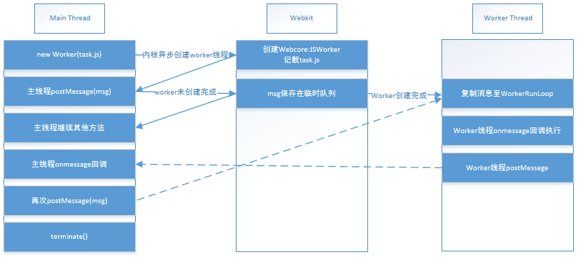

（图片来源：http://www.alloyteam.com/2015/11/deep-in-web-worker/）

#### 5.3 观察 Dedicated Worker

看到这里相信有些小伙伴会好奇，介绍了那么多 Web Worker 的相关知识，在哪里可以直观地感受到 Web Worker，接下来我们将从以下两个角度来观察它。

##### 5.3.1 开发者工具

这里阿宝哥以 Chrome 浏览器为例，首先打开 Chrome 开发者工具，然后选择 **「Sources -> Page」**：

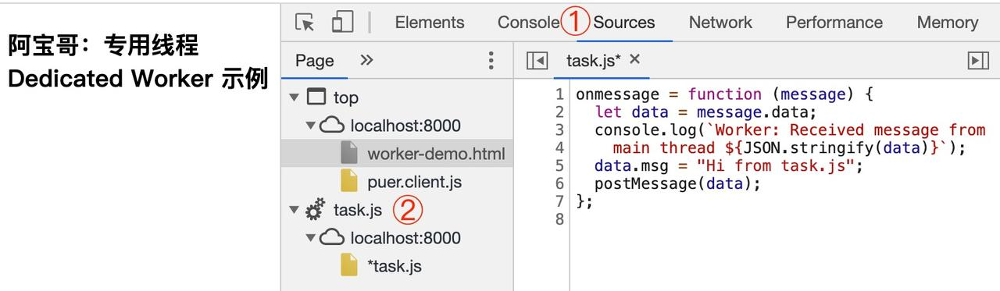

##### 5.3.2 Chrome 任务管理器 & 活动监视器


打开 Chrome 任务管理器之后，我们可以找到当前 Tab 页对应的进程 ID，即为 **「5194」**，接着我们打开 macOS 下的活动监视器，然后选中 **「5194」** 进程，然后对该进程进行取样操作：

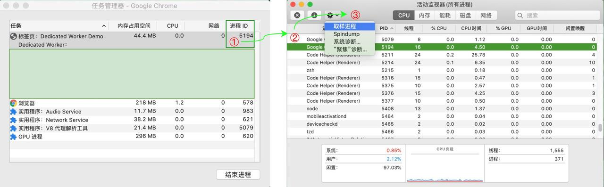

取样完成后，可以看到当前渲染进程中完整的线程信息，红框中标出的就是我们想要找的 **「Dedicated Worker」**。

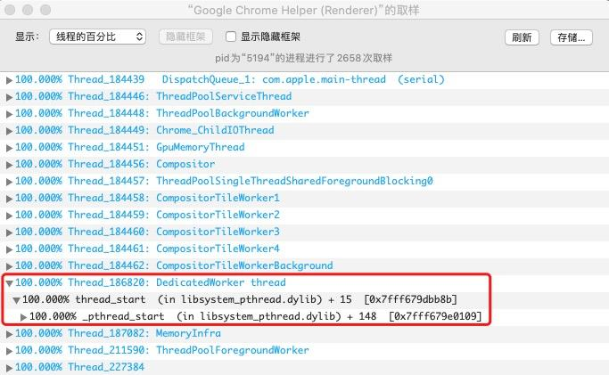

本来是想一口气写完 **「“你不知道的 Web Workers”」**，但考虑到部分小伙伴们的感受，避免出现以下群友提到的情况，阿宝哥决定拆成上下两篇。


下篇阿宝哥将着重介绍 **「Web Worker 一些常见的使用场景和 Deno Web Workers 的相关实现」**，感兴趣的小伙们记得持续关注阿宝哥哟。

阅读其他 **「“你不知道的 XXX 系列教程”」**

- [你不知道的 Blob](https://juejin.im/post/6844904178725158926)
- [你不知道的 WeakMap](https://juejin.im/post/6844904169417998349)

### 六、参考资源

- [w3.org - workers](https://www.w3.org/TR/workers/)
- [MDN - Web_Workers_API](https://developer.mozilla.org/zh-CN/docs/Web/API/Web_Workers_API)
- [web-workers-vs-service-workers-vs-worklets](https://www.pavlompas.com/blog/web-workers-vs-service-workers-vs-worklets)
- [introduction-to-web-worker](https://yrq110.me/post/front-end/introduction-to-web-worker/)
- [web-workers-demystified](https://medium.com/clockwork-nl/web-workers-demystified-fb4c84bd566c)
- [深入理解 Web Worker](http://www.alloyteam.com/2015/11/deep-in-web-worker/)
- [从浏览器多进程到JS单线程，JS运行机制最全面的一次梳理](https://segmentfault.com/a/1190000012925872)


## 问题

> 我之前用webworker做一些阻塞型的计算，发现webworker的计算速度总比主线程的计算速度慢一半，请问一下这是怎么回事- -

> Web Worker的创建过程是异步的，在未创建完成之前如果postMessage了数据，那么这些数据将会暂时存放在一个临时队列，当 WebWorker创建成功后，这些数据才会迁移到WebWorker的执行队列，假设这里耗费了一些时间。另外postMessage数据的过程中，这些数据需要使用结构化克隆算法拷贝一份再传送，拷贝与传送也许需要时间，特别是对于一些文件对象来说需要的时间更久。当然，可以直接传送二进制数据，此时TypeArray就派上用场了。WebWorker是由webkit内核实现的，真正的计算速度我觉得应该和主线程相差无几，耗时操作应该包括以上几个方面。个人看法。