# CSS 奇思妙想边框动画

掘金--chokcoco

今天逛[博客网站 -- shoptalkshow](https://shoptalkshow.com/)，看到这样一个界面，非常有意思：

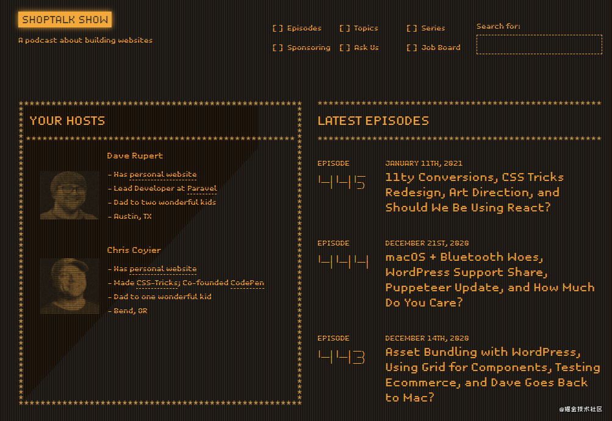

觉得它的风格很独特，尤其是其中一些边框。

嘿嘿，所以来一篇边框特辑，看看运用 CSS，可以在边框上整些什么花样。

## border 属性

谈到边框，首先会想到 `border`，我们最常用的莫过于 `solid`，`dashed`，上图中便出现了 `dashed`。

除了最常见的 `solid`，`dashed`，CSS border 还支持 `none`，`hidden`， `dotted`， `double`， `groove`， `ridge`， `inset`， `outset` 等样式。除去 `none`，`hidden`，看看所有原生支持的 border 的样式：

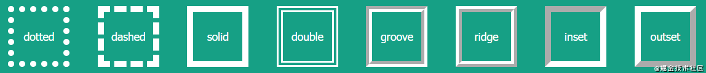

基础的就这些，如果希望实现一个其他样式的边框，或者给边框加上动画，那就需要配合一些其他属性，或是脑洞大开。OK，一起来看看一些额外的有意思的边框。

## 边框长度变化

先来个比较简单的，实现一个类似这样的边框效果：

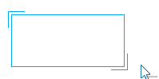

这里其实是借用了元素的两个伪元素。两个伪元素分别只设置上、左边框，下、右边框，通过 `hover` 时改变两个伪元素的高宽即可。非常好理解。

```CSS
div {
    position: relative;
    border: 1px solid #03A9F3;
    
    &::before,
    &::after {
        content: "";
        position: absolute;
        width: 20px;
        height: 20px;
    }
    
    &::before {
        top: -5px;
        left: -5px;
        border-top: 1px solid var(--borderColor);
        border-left: 1px solid var(--borderColor);
    }
    
    &::after {
        right: -5px;
        bottom: -5px;
        border-bottom: 1px solid var(--borderColor);
        border-right: 1px solid var(--borderColor);
    }
    
    &:hover::before,
    &:hover::after {
        width: calc(100% + 9px);
        height: calc(100% + 9px);
    }
}
复制代码
```

[CodePen Demo -- width border animation](https://codepen.io/Chokcoco/pen/BaLvJOb)

接下来，会开始加深一些难度。

## 虚线边框动画

使用 `dashed` 关键字，可以方便的创建虚线边框。

```CSS
div {
    border: 1px dashed #333;
}
复制代码
```

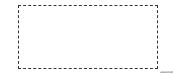

当然，我们的目的是让边框能够动起来。使用 `dashed` 关键字是没有办法的。但是实现虚线的方式在 CSS 中有很多种，譬如渐变就是一种很好的方式：

```CSS
div {
    background: linear-gradient(90deg, #333 50%, transparent 0) repeat-x;
    background-size: 4px 1px;
    background-position: 0 0;
}
复制代码
```

看看，使用渐变模拟的虚线如下：


好，渐变支持多重渐变，我们把容器的 4 个边都用渐变表示即可：

```CSS
div {
    background: 
        linear-gradient(90deg, #333 50%, transparent 0) repeat-x,
        linear-gradient(90deg, #333 50%, transparent 0) repeat-x,
        linear-gradient(0deg, #333 50%, transparent 0) repeat-y,
        linear-gradient(0deg, #333 50%, transparent 0) repeat-y;
    background-size: 4px 1px, 4px 1px, 1px 4px, 1px 4px;
    background-position: 0 0, 0 100%, 0 0, 100% 0;
}
复制代码
```

效果如下：

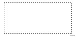

OK，至此，我们的虚线边框动画其实算是完成了一大半了。虽然 `border-style: dashed` 不支持动画，但是渐变支持呀。我们给上述 div 再加上一个 `hover` 效果，`hover` 的时候新增一个 `animation` 动画，改变元素的 `background-position` 即可。

```CSS
div:hover {
    animation: linearGradientMove .3s infinite linear;
}

@keyframes linearGradientMove {
    100% {
        background-position: 4px 0, -4px 100%, 0 -4px, 100% 4px;
    }
}
复制代码
```

OK，看看效果，hover 上去的时候，边框就能**动起来**，因为整个动画是首尾相连的，无限循环的动画看起来就像是虚线边框在一直运动，这算是一个小小的障眼法或者小技巧：

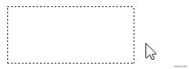

这里还有另外一个小技巧，如果我们希望虚线边框动画是从其他边框，过渡到虚线边框，再行进动画。完全由渐变来模拟也是可以的，如果想节省一些代码，使用 `border` 会更快一些，譬如这样：

```CSS
div {
    border: 1px solid #333;
    
    &:hover {
        border: none;
        background: 
            linear-gradient(90deg, #333 50%, transparent 0) repeat-x,
            linear-gradient(90deg, #333 50%, transparent 0) repeat-x,
            linear-gradient(0deg, #333 50%, transparent 0) repeat-y,
            linear-gradient(0deg, #333 50%, transparent 0) repeat-y;
        background-size: 4px 1px, 4px 1px, 1px 4px, 1px 4px;
        background-position: 0 0, 0 100%, 0 0, 100% 0;
    }
}
复制代码
```

由于 border 和 background 在盒子模型上位置的差异，视觉上会有一个很明显的错位的感觉：

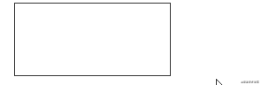

要想解决这个问题，我们可以把 `border` 替换成 `outline`，因为 `outline` 可以设置 `outline-offset`。便能完美解决这个问题：

```CSS
div {
    outline: 1px solid #333;
    outline-offset: -1px;
    
    &:hover {
        outline: none;
    }
}

复制代码
```

最后看看运用到实际按钮上的效果：

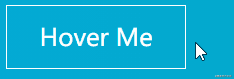

上述 Demo 完整代码如下：

[CodePen Demo -- dashed border animation](https://codepen.io/Chokcoco/pen/NWRevaJ)

> 其实由于背景和边框的特殊关系，使用 border 的时候，通过修改 `background-position` 也是可以解决的，就是比较绕。关于背景和边框的填充关系，可以看这篇文章：[条纹边框的多种实现方式](https://github.com/chokcoco/iCSS/issues/1)

## 渐变的其他妙用

利用渐变，不仅仅只是能完成上述的效果。

我们继续深挖渐变，利用渐变实现这样一个背景：

```CSS
div {
    position: relative;

    &::after {
        content: '';
        position: absolute;
        left: -50%;
        top: -50%;
        width: 200%;
        height: 200%;
        background-repeat: no-repeat;
        background-size: 50% 50%, 50% 50%;
        background-position: 0 0, 100% 0, 100% 100%, 0 100%;
        background-image: linear-gradient(#399953, #399953), linear-gradient(#fbb300, #fbb300), linear-gradient(#d53e33, #d53e33), linear-gradient(#377af5, #377af5);
    }
}
复制代码
```

注意，这里运用了元素的伪元素生成的这个图形，并且，宽高都是父元素的 `200%`，超出则 `overflow: hidden`。

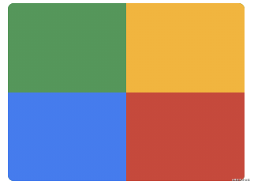

接下来，给它加上旋转：

```CSS
div {
    animation: rotate 4s linear infinite;
}

@keyframes rotate {
	100% {
		transform: rotate(1turn);
	}
}
复制代码
```

看看效果：

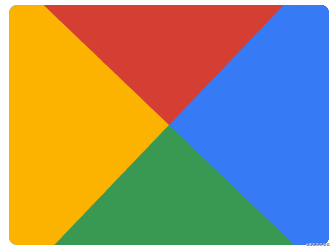

最后，再利用一个伪元素，将中间遮罩起来，一个 Nice 的边框动画就出来了 (动画会出现半透明元素，方便示意看懂原理)：

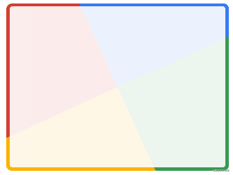

上述 Demo 完整代码如下，这个效果我最早见于这位作者 -- [Jesse B](https://codepen.io/Chester)

[CodePen Demo -- gradient border animation](https://codepen.io/Chokcoco/pen/YzGdEMZ)

### 改变渐变的颜色

掌握了上述的基本技巧之后，我们可以再对渐变的颜色做一些调整，我们将 4 种颜色变成 1 种颜色：

```CSS
div::after {
    content: '';
    position: absolute;
    left: -50%;
    top: -50%;
    width: 200%;
    height: 200%;
    background-color: #fff;
    background-repeat: no-repeat;
    background-size: 50% 50%;
    background-position: 0 0;
    background-image: linear-gradient(#399953, #399953);
}
复制代码
```

得到这样一个图形：

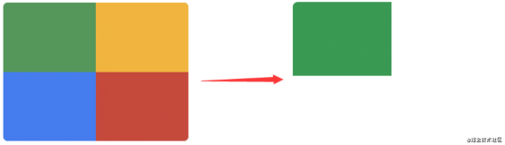

同样的，让它旋转一起，一个单色追逐的边框动画就出来了：

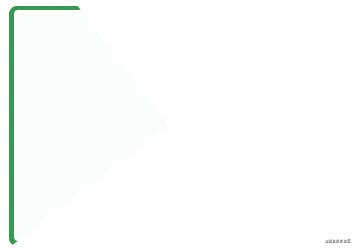

[CodePen Demo -- gradient border animation 2](https://codepen.io/Chokcoco/pen/zYKybmV)

Wow，很不错的样子。不过如果是单线条，有个很明显的缺陷，就是边框的末尾是一个小三角而不是垂直的，可能有些场景不适用或者 PM 接受不了。

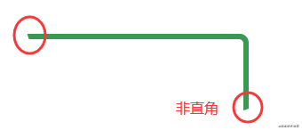

那有没有什么办法能够消除掉这些小三角呢？有的，在下文中我们再介绍一种方法，利用 `clip-path` ，消除掉这些小三角。

### `conic-gradient` 的妙用

再介绍 `clip-path` 之前，先讲讲角向渐变。

上述主要用到了的是线性渐变 `linear-gradient` 。我们使用角向渐变 `conic-gradient` 其实完全也可以实现一模一样的效果。

我们试着使用 `conic-gradient` 也实现一次，这次换一种暗黑风格。核心代码如下：

```CSS
.conic {
	position: relative;
	
	&::before {
		content: '';
		position: absolute;
		left: -50%;
		top: -50%;
		width: 200%;
		height: 200%;
		background: conic-gradient(transparent, rgba(168, 239, 255, 1), transparent 30%);
		animation: rotate 4s linear infinite;
	}
}
@keyframes rotate {
	100% {
		transform: rotate(1turn);
	}
}
复制代码
```

效果图和示意图如下，旋转一个部分角向渐变的图形，中间的部分使用另外一个伪元素进行遮罩，只漏出线条部分即可：

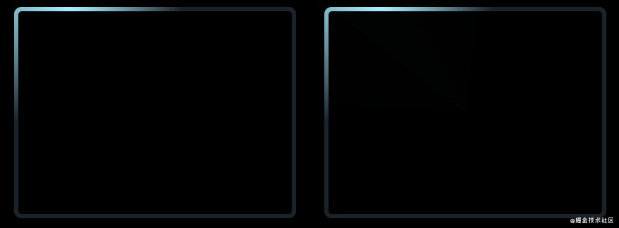

[CodePen Demo -- Rotating border 3](https://codepen.io/Chokcoco/pen/dypaobm)

## `clip-path` 的妙用

又是老朋友 `clip-path`，有意思的事情它总不会缺席。

`clip-path` 本身是可以进行坐标点的动画的，从一个裁剪形状变换到另外一个裁剪形状。

利用这个特点，我们可以巧妙的实现这样一种 border 跟随效果。伪代码如下：

```CSS
div {
    position: relative;

    &::before {
        content: "";
        position: absolute;
        top: 0;
        left: 0;
        right: 0;
        bottom: 0;
        border: 2px solid gold;
        animation: clippath 3s infinite linear;
    }
}

@keyframes clippath {
    0%,
    100% {
        clip-path: inset(0 0 95% 0);
    }
    25% {
        clip-path: inset(0 95% 0 0);
    }
    50% {
        clip-path: inset(95% 0 0 0);
    }
    75% {
        clip-path: inset(0 0 0 95%);
    }
}
复制代码
```

效果图与示意图一起：

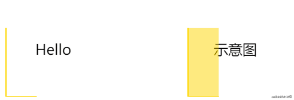

[CodePen - clip-path border animation](https://codepen.io/Chokcoco/pen/bGNJGWX)

这里，因为会裁剪元素，借用伪元素作为背景进行裁剪并动画即可，使用 `clip-path` 的优点了，切割出来的边框不会产生小三角。同时，这种方法，也是支持圆角 `border-radius` 的。

如果我们把另外一个伪元素也用上，实际实现一个按钮样式，可以得到这样的效果：


[CodePen - clip-path border animation 2](https://codepen.io/Chokcoco/pen/dypayrM)

## `overflow` 的妙用

下面这个技巧利用 overflow 实现。实现这样一个边框动画：


为何说是利用 `overflow` 实现？

贴个示意图：

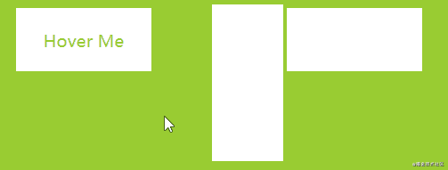

[CodePen Demo -- 巧用overflow及transform实现线条hover效果](https://codepen.io/Chokcoco/pen/PooBpQe)

两个核心点：

1. 我们利用 `overflow: hidden`，把原本在容器外的一整个元素隐藏了起来
2. 利用了 `transform-origin`，控制了元素的旋转中心

发现没，其实几乎大部分的有意思的 CSS 效果，都是运用了类似技巧：

**简单的说就是，我们看到的动画只是原本现象的一小部分，通过特定的裁剪、透明度的变化、遮罩等，让我们最后只看到了原本现象的一部分。**

## `border-image` 的妙用

利用 `border-image`，我们也可以实现一些有意思的边框动画。关于 `border-image`，有一篇非常好的讲解文章 -- [border-image 的正确用法](https://aotu.io/notes/2016/11/02/border-image/index.html)，本文不对基本定义做过多的讲解。

如果我们有这样一张图：

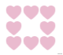

便可以利用 `border-image-slice` 及 `border-image-repeat` 的特性，得到类似的边框图案：

```CSS
div {
  width: 200px;
  height: 120px;
  border: 24px solid;
  border-image: url(image-url);
  border-image-slice: 32;
  border-image-repeat: round;
}
复制代码
```

在这个基础上，可以随便改变元素的高宽，如此便能扩展到任意大小的容器边框中：

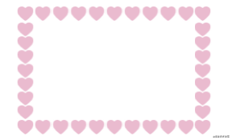

[CodePen Demo -- border-image Demo](https://codepen.io/Chokcoco/pen/oNzJeKd)

接着，在这篇文章 -- [How to Animate a SVG with border-image](https://css-tricks.com/how-to-animate-a-svg-with-border-image/) 中，还讲解了一种利用 `border-image` 的边框动画，非常的酷炫。

与上面例子不一样的是，我们只需要让我们的图案，动起来，就是我们需要这样一个背景图（掘金不支持 SVG 动图，[原图地址](https://skullctf.com/images/skull-border.svg)）：

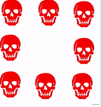

那么，我们也就能得到运动的边框图，代码完全一样，但是，边框是运动的：

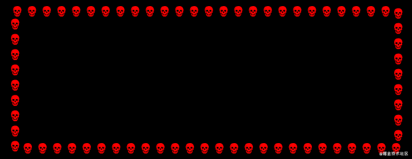

[CodePen Demo -- Dancing Skull Border](https://codepen.io/Chokcoco/pen/XWjEgRq)

### `border-image` 使用渐变

`border-image` 除了贴图引用 `url` 之外，也是可以直接填充颜色或者是渐变的。

之前也有一篇关于 `border-image` 的文章 -- [巧妙实现带圆角的渐变边框](https://github.com/chokcoco/iCSS/issues/77)

我们可以利用 `border-image` + `filter` + `clip-path` 实现渐变变换的圆角边框：

```CSS
.border-image-clip-path {
    width: 200px;
    height: 100px;
    border: 10px solid;
    border-image: linear-gradient(45deg, gold, deeppink) 1;
    clip-path: inset(0px round 10px);
    animation: huerotate 6s infinite linear;
    filter: hue-rotate(360deg);
}

@keyframes huerotate {
    0% {
        filter: hue-rotate(0deg);
    }
    100% {
        filter: hue-rotate(360deg);
    }
}
复制代码
```

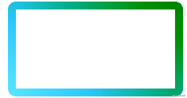

[CodePen Demo -- clip-path、border-image 加 filter 实现圆角渐变边框](https://codepen.io/Chokcoco/pen/povBORP)

## 最后

本文介绍了一些我认为比较有意思的边框动画小技巧，当然 CSS 产生还有非常多有意思的效果，限于篇幅，不一一展开。

本文到此结束，希望对你有帮助 :)，想 Get 到最有意思的 CSS 资讯，千万不要错过我的 iCSS 公众号 😄

更多精彩 CSS 技术文章汇总在我的 [Github -- iCSS](https://github.com/chokcoco/iCSS) ，持续更新，欢迎点个 star 订阅收藏。

如果还有什么疑问或者建议，可以多多交流，原创文章，文笔有限，才疏学浅，文中若有不正之处，万望告知。