作者：victor yu
链接：https://www.zhihu.com/question/34074946/answer/108588042
来源：知乎
著作权归作者所有。商业转载请联系作者获得授权，非商业转载请注明出处。

这周正在研究http2.0，网络上各种资料也看了不少，对Leozhang的答案稍作补充。
首先推荐下屈光宇博客里的[HTTP/2 资料汇总](https://link.zhihu.com/?target=https%3A//imququ.com/post/http2-resource.html)，从协议本身，到部署、优化，再到调试工具和参考书籍都包含了。
然后Leozhang的答案里提到的O'Reilly *HTTP2-high-perf-browser-networking*这本书里专门有一章详细讨论了HTTP/2 [HTTP: HTTP/2](https://link.zhihu.com/?target=https%3A//hpbn.co/http2/)，个人认为是目前看到的资料里介绍的最全面和详细的，HTTP/2的二进制帧，多路复用，请求优先级，流量控制，服务器端推送以及首部压缩等新改进都涉及到了。如果英文版看着比较吃力的话，可以看下国内已经出版的翻译版“[《Web性能权威指南》([加\]Ilya Grigorik)【摘要 书评 试读】](https://link.zhihu.com/?target=http%3A//item.jd.com/11444582.html)” 。[Tester](https://www.zhihu.com/people/tester-50)答案里的"[Introduction · http2 explained](https://link.zhihu.com/?target=https%3A//bagder.gitbooks.io/http2-explained/content/zh/)"也还不错，就是翻译的偏生硬。
最后推荐下一篇作者未知的“[HTTP 2.0的那些事](https://link.zhihu.com/?target=http%3A//mrpeak.cn/blog/http2/)”，一篇文章介绍了HTTP2.0的前世今生，具体的技术细节上不如“high-perf-browser-networking”和“http2 explained”，有知道原作者的知友麻烦告知。
================================传说中的分割线==========================
在我们所处的互联网世界中，HTTP协议算得上是使用最广泛的网络协议。最近http2.0的诞生使得它再次互联网技术圈关注的焦点。任何事物的消退和新生都有其背后推动的力量。对于HTTP来说，这力量复杂来说是各种技术细节的演进，简单来说是用户体验和感知的进化。用户总是希望网络上的信息能尽可能快的抵达眼球，越快越好，正是这种对“快”对追逐催生了今天的http2.0。
**1. HTTP2.0的前世**

http2.0的前世是http1.0和http1.1这两兄弟。虽然之前仅仅只有两个版本，但这两个版本所包含的协议规范之庞大，足以让任何一个有经验的工程师为之头疼。http1.0诞生于1996年，协议文档足足60页。之后第三年，http1.1也随之出生，协议文档膨胀到了176页。不过和我们手机端app升级不同的是，网络协议新版本并不会马上取代旧版本。实际上，1.0和1.1在之后很长的一段时间内一直并存，这是由于网络基础设施更新缓慢所决定的。今天的http2.0也是一样，新版协议再好也需要业界的产品锤炼，需要基础设施逐年累月的升级换代才能普及。

**1.1 HTTP站在TCP之上**

理解http协议之前一定要对TCP有一定基础的了解。HTTP是建立在TCP协议之上，TCP协议作为传输层协议其实离应用层并不远。HTTP协议的瓶颈及其优化技巧都是基于TCP协议本身的特性。比如TCP建立连接时三次握手有1.5个RTT（round-trip time）的延迟，为了避免每次请求的都经历握手带来的延迟，应用层会选择不同策略的http长链接方案。又比如TCP在建立连接的初期有慢启动（slow start）的特性，所以连接的重用总是比新建连接性能要好。

**1.1 HTTP应用场景**

http诞生之初主要是应用于web端内容获取，那时候内容还不像现在这样丰富，排版也没那么精美，用户交互的场景几乎没有。对于这种简单的获取网页内容的场景，http表现得还算不错。但随着互联网的发展和web2.0的诞生，更多的内容开始被展示（更多的图片文件），排版变得更精美（更多的css），更复杂的交互也被引入（更多的js）。用户打开一个网站首页所加载的数据总量和请求的个数也在不断增加。今天绝大部分的门户网站首页大小都会超过2M，请求数量可以多达100个。另一个广泛的应用是在移动互联网的客户端app，不同性质的app对http的使用差异很大。对于电商类app，加载首页的请求也可能多达10多个。对于微信这类IM，http请求可能仅限于语音和图片文件的下载，请求出现的频率并不算高。

**1.2 因为延迟，所以慢**

影响一个网络请求的因素主要有两个，带宽和延迟。今天的网络基础建设已经使得带宽得到极大的提升，大部分时候都是延迟在影响响应速度。http1.0被抱怨最多的就是**连接无法复用**，和**head of line blocking**这两个问题。理解这两个问题有一个十分重要的前提：客户端是依据域名来向服务器建立连接，一般PC端浏览器会针对单个域名的server同时建立6～8个连接，手机端的连接数则一般控制在4～6个。显然连接数并不是越多越好，资源开销和整体延迟都会随之增大。

**连接无法复用**会导致每次请求都经历三次握手和慢启动。三次握手在高延迟的场景下影响较明显，慢启动则对文件类大请求影响较大。

**head of line blocking**会导致带宽无法被充分利用，以及后续健康请求被阻塞。假设有5个请求同时发出，如下图：

​	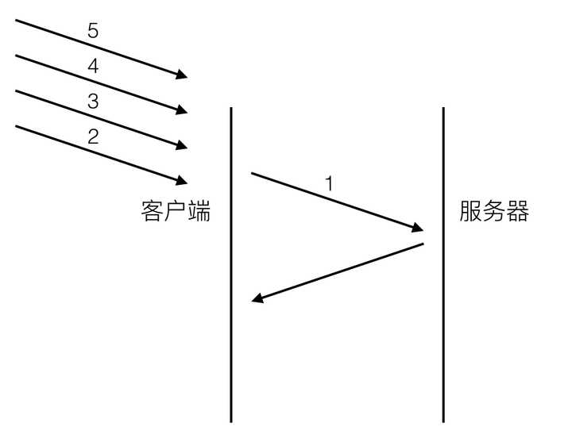

[图1] 

对于http1.0的实现，在第一个请求没有收到回复之前，后续从应用层发出的请求只能排队，请求2，3，4，5只能等请求1的response回来之后才能逐个发出。网络通畅的时候性能影响不大，一旦请求1的request因为什么原因没有抵达服务器，或者response因为网络阻塞没有及时返回，影响的就是所有后续请求，问题就变得比较严重了。

**1.3 解决连接无法复用**

http1.0协议头里可以设置Connection:Keep-Alive。在header里设置Keep-Alive可以在一定时间内复用连接，具体复用时间的长短可以由服务器控制，一般在15s左右。到http1.1之后Connection的默认值就是Keep-Alive，如果要关闭连接复用需要显式的设置Connection:Close。一段时间内的连接复用对PC端浏览器的体验帮助很大，因为大部分的请求在集中在一小段时间以内。但对移动app来说，成效不大，app端的请求比较分散且时间跨度相对较大。所以移动端app一般会从应用层寻求其它解决方案，长连接方案或者伪长连接方案：

**方案一：基于tcp的长链接**

现在越来越多的移动端app都会建立一条自己的长链接通道，通道的实现是基于tcp协议。基于tcp的socket编程技术难度相对复杂很多，而且需要自己制定协议，但带来的回报也很大。信息的上报和推送变得更及时，在请求量爆发的时间点还能减轻服务器压力（http短连接模式会频繁的创建和销毁连接）。不止是IM app有这样的通道，像淘宝这类电商类app都有自己的专属长连接通道了。现在业界也有不少成熟的方案可供选择了，google的protobuf就是其中之一。

**方案二：http long-polling**

long-polling可以用下图表示：

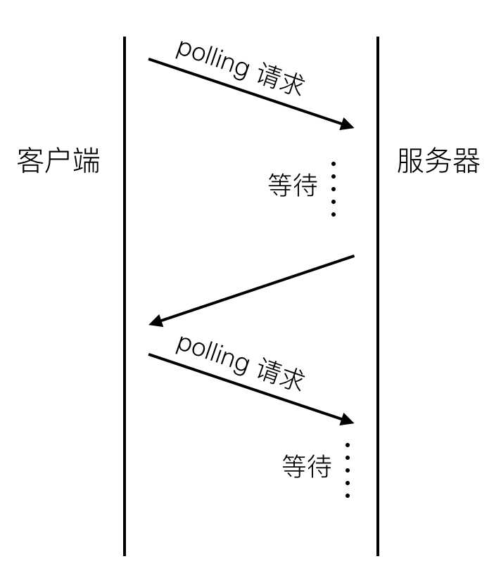

[图2]

客户端在初始状态就会发送一个polling请求到服务器，服务器并不会马上返回业务数据，而是等待有新的业务数据产生的时候再返回。所以连接会一直被保持，一旦结束马上又会发起一个新的polling请求，如此反复，所以一直会有一个连接被保持。服务器有新的内容产生的时候，并不需要等待客户端建立一个新的连接。做法虽然简单，但有些难题需要攻克才能实现稳定可靠的业务框架：

- 和传统的http短链接相比，长连接会在用户增长的时候极大的增加服务器压力
- 移动端网络环境复杂，像wifi和4g的网络切换，进电梯导致网络临时断掉等，这些场景都需要考虑怎么重建健康的连接通道。
- 这种polling的方式稳定性并不好，需要做好数据可靠性的保证，比如重发和ack机制。
- polling的response有可能会被中间代理cache住，要处理好业务数据的过期机制。

long-polling方式还有一些缺点是无法克服的，比如每次新的请求都会带上重复的header信息，还有数据通道是单向的，主动权掌握在server这边，客户端有新的业务请求的时候无法及时传送。

**方案三：http streaming**

http streaming流程大致如下：

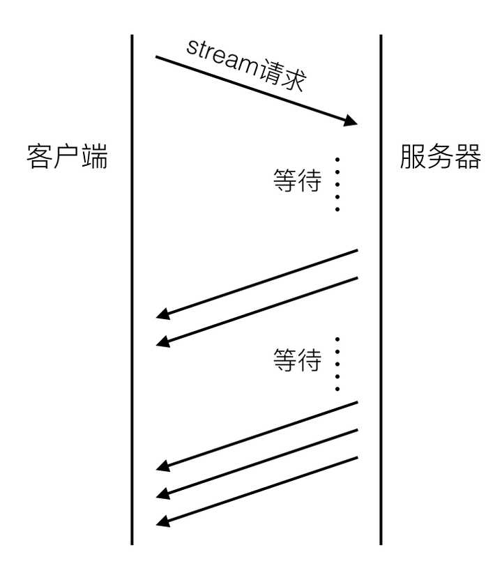

[图3]

同long-polling不同的是，server并不会结束初始的streaming请求，而是持续的通过这个通道返回最新的业务数据。显然这个数据通道也是单向的。streaming是通过在server response的头部里增加”Transfer Encoding: chunked”来告诉客户端后续还会有新的数据到来。除了和long－polling相同的难点之外，streaming还有几个缺陷：

- 有些代理服务器会等待服务器的response结束之后才会将结果推送到请求客户端。对于streaming这种永远不会结束的方式来说，客户端就会一直处于等待response的过程中。
- 业务数据无法按照请求来做分割，所以客户端没收到一块数据都需要自己做协议解析，也就是说要做自己的协议定制。

streaming不会产生重复的header数据。

**方案四：web socket**

WebSocket和传统的tcp socket连接相似，也是基于tcp协议，提供双向的数据通道。WebSocket优势在于提供了message的概念，比基于字节流的tcp socket使用更简单，同时又提供了传统的http所缺少的长连接功能。不过WebSocket相对较新，2010年才起草，并不是所有的浏览器都提供了支持。各大浏览器厂商最新的版本都提供了支持。

**1.4 解决head of line blocking**

Head of line blocking(以下简称为holb)是http2.0之前网络体验的最大祸源。正如图1中所示，健康的请求会被不健康的请求影响，而且这种体验的损耗受网络环境影响，出现随机且难以监控。为了解决holb带来的延迟，协议设计者设计了一种新的pipelining机制。

**http pipelining**

pipelining的流程图可以用下图表示：

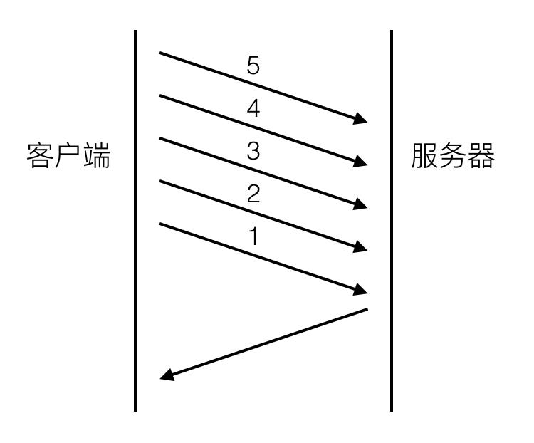

[图4]

和图一相比最大的差别是，请求2，3，4，5不用等请求1的response返回之后才发出，而是几乎在同一时间把request发向了服务器。2，3，4，5及所有后续共用该连接的请求节约了等待的时间，极大的降低了整体延迟。下图可以清晰的看出这种新机制对延迟的改变：

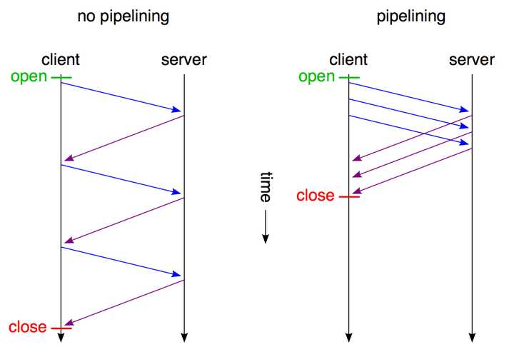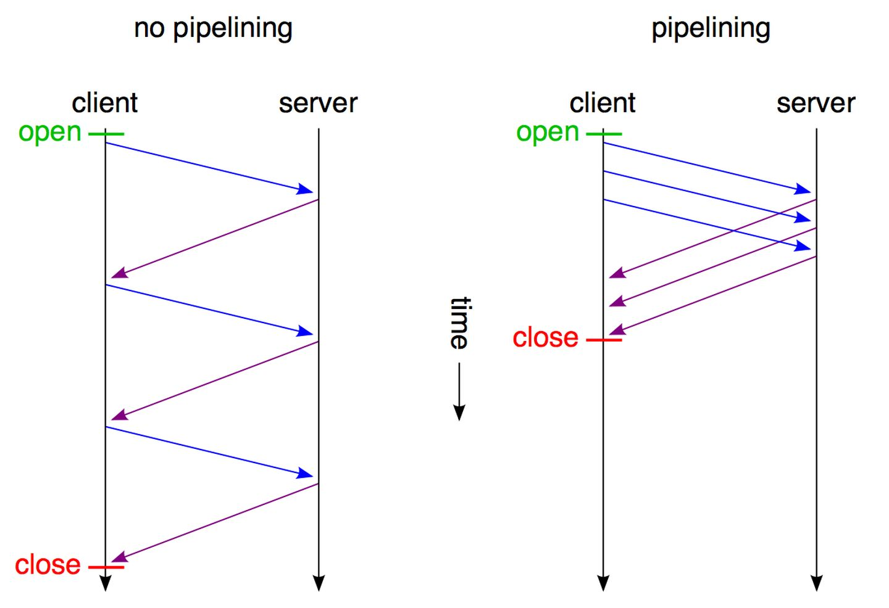

[图5]

不过pipelining并不是救世主，它也存在不少缺陷：

- pipelining只能适用于http1.1，一般来说，支持http1.1的server都要求支持pipelining。
- 只有幂等的请求（GET，HEAD）能使用pipelining，非幂等请求比如POST不能使用，因为请求之间可能会存在先后依赖关系。
- head of line blocking并没有完全得到解决，server的response还是要求依次返回，遵循FIFO(first in first out)原则。也就是说如果请求1的response没有回来，2，3，4，5的response也不会被送回来。
- 绝大部分的http代理服务器不支持pipelining。
- 和不支持pipelining的老服务器协商有问题。
- 可能会导致新的Front of queue blocking问题。

正是因为有这么多的问题，各大浏览器厂商要么是根本就不支持pipelining，要么就是默认关掉了pipelining机制，而且启用的条件十分苛刻。可以参考chrome对于pipeling的[问题描述](https://link.zhihu.com/?target=https%3A//www.chromium.org/developers/design-documents/network-stack/http-pipelining)。

**1.5 其它奇技淫巧**

为了解决延迟带来的苦恼，永远都会有聪明的探索者找出新的捷径来。互联网的蓬勃兴盛催生出了各种新奇技巧，我们来依次看下这些“捷径”及各自的优缺点。

**Spriting（图片合并）**

Spriting指的是将多个小图片合并到一张大的图片里，这样多个小的请求就被合并成了一个大的图片请求，然后再利用js或者css文件来取出其中的小张图片使用。好处显而易见，请求数减少，延迟自然低。坏处是文件的粒度变大了，有时候我们可能只需要其中一张小图，却不得不下载整张大图，cache处理也变得麻烦，在只有一张小图过期的情况下，为了获得最新的版本，不得不从服务器下载完整的大图，即使其它的小图都没有过期，显然浪费了流量。

**Inlining（内容内嵌）**

Inlining的思考角度和spriting类似，是将额外的数据请求通过base64编码之后内嵌到一个总的文件当中。比如一个网页有一张背景图，我们可以通过如下代码嵌入：

background: url(data:image/png;base64,)

data部分是base64编码之后的字节码，这样也避免了一次多余的http请求。但这种做法也有着和spriting相同的问题，资源文件被绑定到了其它文件，粒度变得难以控制。

**Concatenation（文件合并）**

Concatenation主要是针对js这类文件，现在前端开发交互越来越多，零散的js文件也在变多。将多个js文件合并到一个大的文件里在做一些压缩处理也可以减小延迟和传输的数据量。但同样也面临着粒度变大的问题，一个小的js代码改动会导致整个js文件被下载。

**Domain Sharding（域名分片）**

前面我提到过很重要的一点，浏览器或者客户端是根据domain（域名）来建立连接的。比如针对[Example Domain](https://link.zhihu.com/?target=http%3A//www.example.com)只允许同时建立2个连接，但mobile.example.com被认为是另一个域名，可以再建立两个新的连接。依次类推，如果我再多建立几个sub domain（子域名），那么同时可以建立的http请求就会更多，这就是Domain Sharding了。连接数变多之后，受限制的请求就不需要等待前面的请求完成才能发出了。这个技巧被大量的使用，一个颇具规模的网页请求数可以超过100，使用domain sharding之后同时建立的连接数可以多到50个甚至更多。

这么做当然增加了系统资源的消耗，但现在硬件资源升级非常之快，和用户宝贵的等待时机相比起来实在微不足道。

domain sharding还有一大好处，对于资源文件来说一般是不需要cookie的，将这些不同的静态资源文件分散在不同的域名服务器上，可以减小请求的size。

不过domain sharding只有在请求数非常之多的场景下才有明显的效果。而且请求数也不是越多越好，资源消耗是一方面，另一点是由于tcp的slow start会导致每个请求在初期都会经历slow start，还有tcp 三次握手，DNS查询的延迟。这一部分带来的时间损耗和请求排队同样重要，到底怎么去平衡这二者就需要取一个可靠的连接数中间值，这个值的最终确定要通过反复的测试。移动端浏览器场景建议不要使用domain sharding，具体细节参考[这篇文章](https://link.zhihu.com/?target=http%3A//www.mobify.com/blog/domain-sharding-bad-news-mobile-performance/)。

**2. 开拓者SPDY**

http1.0和1.1虽然存在这么多问题，业界也想出了各种优化的手段，但这些方法手段都是在尝试绕开协议本身的缺陷，都有种隔靴搔痒，治标不治本的感觉。直到2012年google如一声惊雷提出了SPDY的方案，大家才开始从正面看待和解决老版本http协议本身的问题，这也直接加速了http2.0的诞生。实际上，http2.0是以SPDY为原型进行讨论和标准化的。为了给http2.0让路，google已决定在2016年不再继续支持SPDY开发，但在http2.0出生之前，SPDY已经有了相当规模的应用，作为一个过渡方案恐怕在还将一段时间内继续存在。现在不少app客户端和server都已经使用了SPDY来提升体验，http2.0在老的设备和系统上还无法使用（iOS系统只有在iOS9+上才支持），所以可以预见未来几年spdy将和http2.0共同服务的情况。

**2.1 SPDY的目标**

SPDY的目标在一开始就是瞄准http1.x的痛点，即延迟和安全性。我们上面通篇都在讨论延迟，至于安全性，由于http是明文协议，其安全性也一直被业界诟病，不过这是另一个大的话题。如果以降低延迟为目标，应用层的http和传输层的tcp都是都有调整的空间，不过tcp作为更底层协议存在已达数十年之久，其实现已深植全球的网络基础设施当中，如果要动必然伤经动骨，业界响应度必然不高，所以SPDY的手术刀对准的是http。

- 降低延迟，客户端的单连接单请求，server的FIFO响应队列都是延迟的大头。
- http最初设计都是客户端发起请求，然后server响应，server无法主动push内容到客户端。
- 压缩http header，http1.x的header越来越膨胀，cookie和user agent很容易让header的size增至1kb大小，甚至更多。而且由于http的无状态特性，header必须每次request都重复携带，很浪费流量。

为了增加业界响应的可能性，聪明的google一开始就避开了从传输层动手，而且打算利用开源社区的力量以提高扩散的力度，对于协议使用者来说，也只需要在请求的header里设置user agent，然后在server端做好支持即可，极大的降低了部署的难度。SPDY的设计如下：

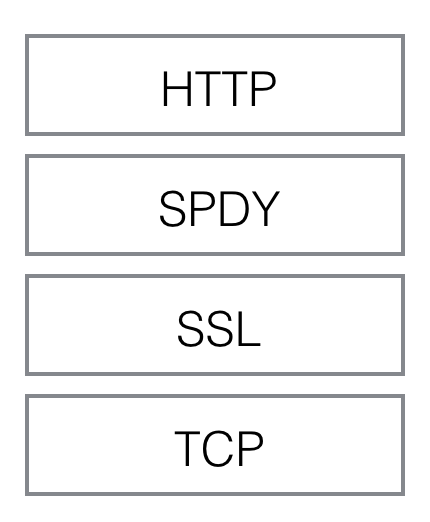

[图6]

SPDY位于HTTP之下，TCP和SSL之上，这样可以轻松兼容老版本的HTTP协议(将http1.x的内容封装成一种新的frame格式)，同时可以使用已有的SSL功能。SPDY的功能可以分为基础功能和高级功能两部分，基础功能默认启用，高级功能需要手动启用。

**SPDY基础功能**

- 多路复用（multiplexing）。多路复用通过多个请求stream共享一个tcp连接的方式，解决了http1.x holb（head of line blocking）的问题，降低了延迟同时提高了带宽的利用率。
- 请求优先级（request prioritization）。多路复用带来一个新的问题是，在连接共享的基础之上有可能会导致关键请求被阻塞。SPDY允许给每个request设置优先级，这样重要的请求就会优先得到响应。比如浏览器加载首页，首页的html内容应该优先展示，之后才是各种静态资源文件，脚本文件等加载，这样可以保证用户能第一时间看到网页内容。
- header压缩。前面提到过几次http1.x的header很多时候都是重复多余的。选择合适的压缩算法可以减小包的大小和数量。SPDY对header的压缩率可以达到80%以上，低带宽环境下效果很大。

**SPDY高级功能**

- server推送（server push）。http1.x只能由客户端发起请求，然后服务器被动的发送response。开启server push之后，server通过X-Associated-Content header（X-开头的header都属于非标准的，自定义header）告知客户端会有新的内容推送过来。在用户第一次打开网站首页的时候，server将资源主动推送过来可以极大的提升用户体验。
- server暗示（server hint）。和server push不同的是，server hint并不会主动推送内容，只是告诉有新的内容产生，内容的下载还是需要客户端主动发起请求。server hint通过X-Subresources header来通知，一般应用场景是客户端需要先查询server状态，然后再下载资源，可以节约一次查询请求。

**2.2 SPDY的成绩**

SPDY的成绩可以用google官方的一个数字来说明：页面加载时间相比于http1.x减少了64%。而且各大浏览器厂商在SPDY诞生之后的1年多里都陆续支持了SPDY，不少大厂app和server端框架也都将SPDY应用到了线上的产品当中。

google的官网也给出了他们自己做的一份测试数据。测试对象是25个访问量排名靠前的网站首页，家用网络%1的丢包率，每个网站测试10次取平均值。结果如下：

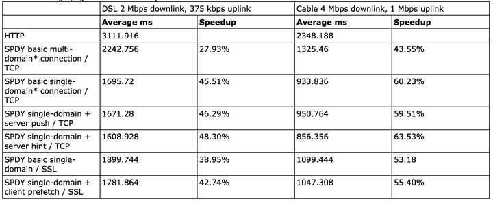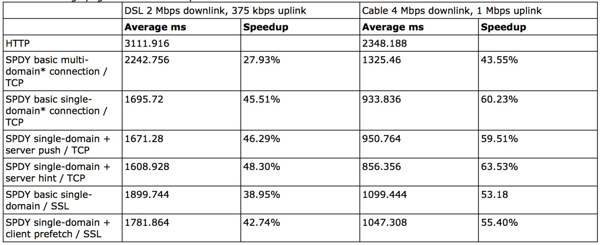

[图7]

不开启ssl的时候提升在 27% - 60%，开启之后为39% - 55%。 这份测试结果有两点值得特别注意：

**连接数的选择**

连接到底是基于域名来建立，还是不做区分所有子域名都共享一个连接，这个策略选择上值得商榷。google的测试结果测试了两种方案，看结果似乎是单一连接性能高于多域名连接方式。之所以出现这种情况是由于网页所有的资源请求并不是同一时间发出，后续发出的子域名请求如果能复用之前的tcp连接当然性能更好。实际应用场景下应该也是单连接共享模式表现好。

**带宽的影响**

测试基于两种带宽环境，一慢一快。网速快的环境下对减小延迟的提升更大，单连接模式下可以提升至60%。原因也比较简单，带宽越大，复用连接的请求完成越快，由于三次握手和慢启动导致的延迟损耗就变得更明显。

出了连接模式和带宽之外，丢包率和RTT也是需要测试的参数。SPDY对header的压缩有80%以上，整体包大小能减少大概40%，发送的包越少，自然受丢包率影响也就越小，所以丢包率大的恶劣环境下SPDY反而更能提升体验。下图是受丢包率影响的测试结果，丢包率超过2.5％之后就没有提升了：

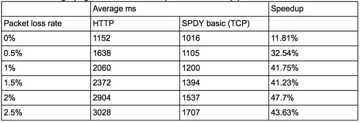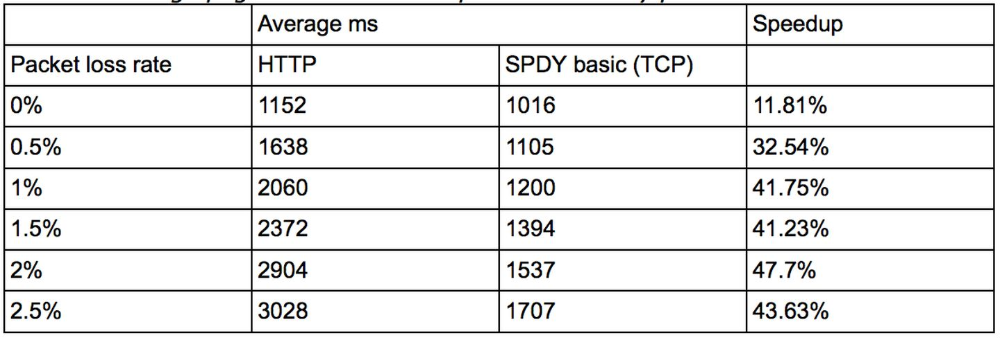

[图8]

RTT越大，延迟会越大，在高RTT的场景下，由于SPDY的request是并发进行的，所有对包的利用率更高，反而能更明显的减小总体延迟。测试结果如下：

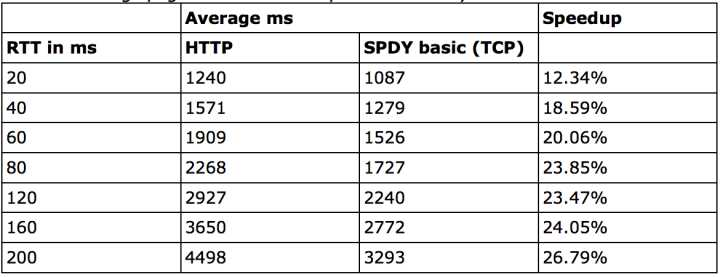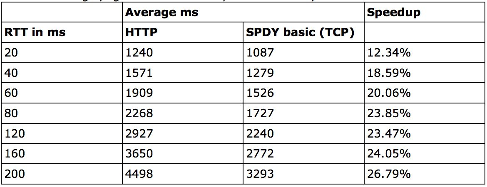

[图9]

SPDY从2012年诞生到2016停止维护，时间跨度对于网络协议来说其实非常之短。如果HTTP2.0没有出来，google或许能收集到更多业界产品的真实反馈和数据，毕竟google自己的测试环境相对简单。但SPDY也完成了自己的使命，作为一贯扮演拓荒者角色的google应该也早就预见了这样的结局。SPDY对产品网络体验的提升到底如何，恐怕只有各大厂产品经理才清楚了。

**3. 救世主HTTP2.0**

SPDY的诞生和表现说明了两件事情：一是在现有互联网设施基础和http协议广泛使用的前提下，是可以通过修改协议层来优化http1.x的。二是针对http1.x的修改确实效果明显而且业界反馈很好。正是这两点让IETF（Internet Enginerring Task Force）开始正式考虑制定HTTP2.0的计划，最后决定以SPDY／3为蓝图起草HTTP2.0，SPDY的部分设计人员也被邀请参与了HTTP2.0的设计。

**3.1 HTTP2.0需要考虑的问题**

HTTP2.0与SPDY的起点不同，SPDY可以说是google的“玩具”，最早出现在自家的chrome浏览器和server上，好不好玩以及别人会不会跟着一起玩对google来说无关痛痒。但HTTP2.0作为业界标准还没出生就是众人瞩目的焦点，一开始如果有什么瑕疵或者不兼容的问题影响可能又是数十年之久，所以考虑的问题和角度要非常之广。我们来看下HTTP2.0一些重要的设计前提：

- 客户端向server发送request这种基本模型不会变。
- 老的scheme不会变，使用http://和https://的服务和应用不会要做任何更改，不会有http2://。
- 使用http1.x的客户端和服务器可以无缝的通过代理方式转接到http2.0上。
- 不识别http2.0的代理服务器可以将请求降级到http1.x。

因为客户端和server之间在确立使用http1.x还是http2.0之前，必须要要确认对方是否支持http2.0，所以这里必须要有个协商的过程。最简单的协商也要有一问一答，客户端问server答，即使这种最简单的方式也多了一个RTT的延迟，我们之所以要修改http1.x就是为了降低延迟，显然这个RTT我们是无法接受的。google制定SPDY的时候也遇到了这个问题，他们的办法是强制SPDY走https，在SSL层完成这个协商过程。ssl层的协商在http协议通信之前，所以是最适合的载体。google为此做了一个tls的拓展，叫NPN（Next Protocol Negotiation），从名字上也可以看出，这个拓展主要目的就是为了协商下一个要使用的协议。HTTP2.0虽然也采用了相同的方式，不过HTTP2.0经过激烈的讨论，最终还是没有强制HTTP2.0要走ssl层，大部分浏览器厂商（除了IE）却只实现了基于https的2.0协议。HTTP2.0没有使用NPN，而是另一个tls的拓展叫ALPN（Application Layer Protocol Negotiation）。SPDY也打算从NPN迁移到ALPN了。

各浏览器（除了IE）之所以只实现了基于SSL的HTTP2.0，另一个原因是走SSL请求的成功率会更高，被SSL封装的request不会被监听和修改，这样网络中间的网络设备就无法基于http1.x的认知去干涉修改request，http2.0的request如果被意外的修改，请求的成功率自然会下降。

HTTP2.0协议没有强制使用SSL是因为听到了很多的反对声音，毕竟https和http相比，在不优化的前提下性能差了不少，要把https优化到几乎不增加延迟的程度又需要花费不少力气。IETF面对这种两难的处境做了妥协，但大部分浏览器厂商（除了IE）并不买帐，他们只认https2.0。对于app开发者来说，他们可以坚持使用没有ssl的http2.0，不过要承担一个多余的RTT延迟和请求可能被破坏的代价。

**3.1 HTTP2.0主要改动**

HTTP2.0作为新版协议，改动细节必然很多，不过对应用开发者和服务提供商来说，影响较大的就几点。

**新的二进制格式（Binary Format）**

http1.x诞生的时候是明文协议，其格式由三部分组成：start line（request line或者status line），header，body。要识别这3部分就要做协议解析，http1.x的解析是基于文本。基于文本协议的格式解析存在天然缺陷，文本的表现形式有多样性，要做到健壮性考虑的场景必然很多，二进制则不同，只认0和1的组合。基于这种考虑http2.0的协议解析决定采用二进制格式，实现方便且健壮。

有人可能会觉得基于文本的http调试方便很多，像firebug，chrome，charles等不少工具都可以即时调试修改请求。实际上现在很多请求都是走https了，要调试https请求必须有私钥才行。http2.0的绝大部分request应该都是走https，所以调试方便无法作为一个有力的考虑因素了。curl，tcpdump，wireshark这些工具会更适合http2.0的调试。

http2.0用binary格式定义了一个一个的frame，和http1.x的格式对比如下图：

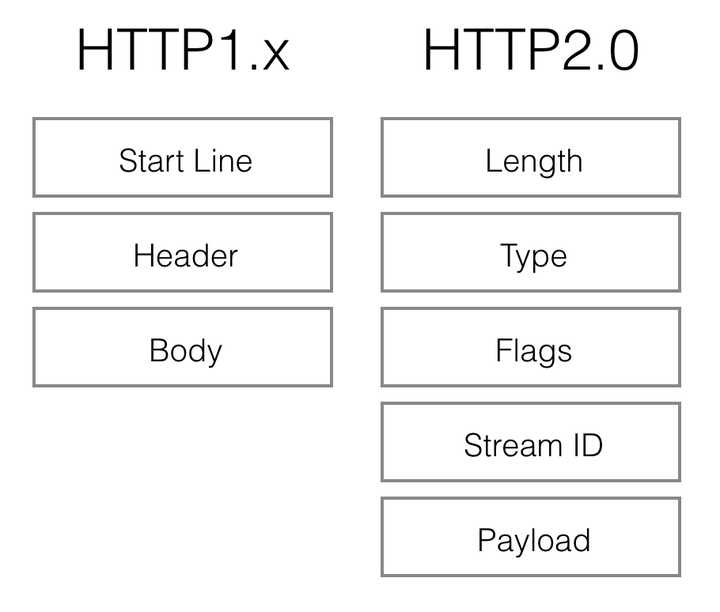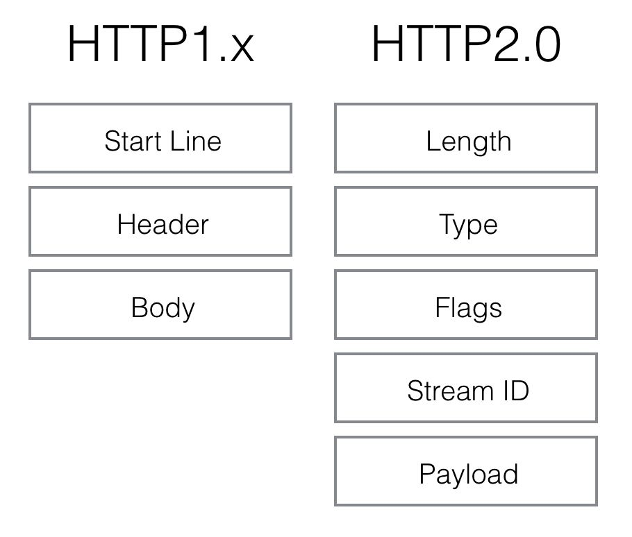

[图10]

http2.0的格式定义更接近tcp层的方式，这张二机制的方式十分高效且精简。length定义了整个frame的开始到结束，type定义frame的类型（一共10种），flags用bit位定义一些重要的参数，stream id用作流控制，剩下的payload就是request的正文了。

虽然看上去协议的格式和http1.x完全不同了，实际上http2.0并没有改变http1.x的语义，只是把原来http1.x的header和body部分用frame重新封装了一层而已。调试的时候浏览器甚至会把http2.0的frame自动还原成http1.x的格式。具体的协议关系可以用下图表示：

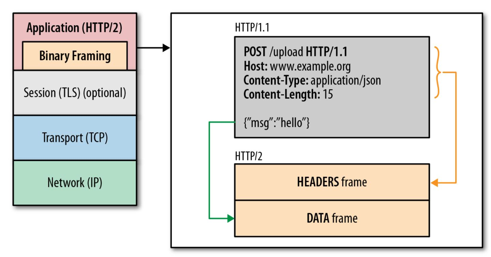

[图11]

**连接共享**

http2.0要解决的一大难题就是多路复用（MultiPlexing），即连接共享。上面协议解析中提到的stream id就是用作连接共享机制的。一个request对应一个stream并分配一个id，这样一个连接上可以有多个stream，每个stream的frame可以随机的混杂在一起，接收方可以根据stream id将frame再归属到各自不同的request里面。

前面还提到过连接共享之后，需要优先级和请求依赖的机制配合才能解决关键请求被阻塞的问题。http2.0里的每个stream都可以设置又优先级（Priority）和依赖（Dependency）。优先级高的stream会被server优先处理和返回给客户端，stream还可以依赖其它的sub streams。优先级和依赖都是可以动态调整的。动态调整在有些场景下很有用，假想用户在用你的app浏览商品的时候，快速的滑动到了商品列表的底部，但前面的请求先发出，如果不把后面的请求优先级设高，用户当前浏览的图片要到最后才能下载完成，显然体验没有设置优先级好。同理依赖在有些场景下也有妙用。

**header压缩**

前面提到过http1.x的header由于cookie和user agent很容易膨胀，而且每次都要重复发送。http2.0使用encoder来减少需要传输的header大小，通讯双方各自cache一份header fields表，既避免了重复header的传输，又减小了需要传输的大小。高效的压缩算法可以很大的压缩header，减少发送包的数量从而降低延迟。

这里普及一个小知识点。现在大家都知道tcp有slow start的特性，三次握手之后开始发送tcp segment，第一次能发送的没有被ack的segment数量是由initial tcp window大小决定的。这个initial tcp window根据平台的实现会有差异，但一般是2个segment或者是4k的大小（一个segment大概是1500个字节），也就是说当你发送的包大小超过这个值的时候，要等前面的包被ack之后才能发送后续的包，显然这种情况下延迟更高。intial window也并不是越大越好，太大会导致网络节点的阻塞，丢包率就会增加，具体细节可以参考IETF[这篇文章](https://link.zhihu.com/?target=https%3A//tools.ietf.org/html/rfc3390)。http的header现在膨胀到有可能会超过这个intial window的值了，所以更显得压缩header的重要性。

**压缩算法的选择**

SPDY/2使用的是gzip压缩算法，但后来出现的两种攻击方式[BREACH](https://link.zhihu.com/?target=https%3A//en.wikipedia.org/wiki/BREACH_%28security_exploit%29)和[CRIME](https://link.zhihu.com/?target=https%3A//en.wikipedia.org/wiki/CRIME)使得即使走ssl的SPDY也可以被破解内容，最后综合考虑采用的是一种叫[HPACK](https://link.zhihu.com/?target=https%3A//http2.github.io/http2-spec/compression.html)的压缩算法。这两个漏洞和相关算法可以点击链接查看更多的细节，不过这种漏洞主要存在于浏览器端，因为需要通过javascript来注入内容并观察payload的变化。

**重置连接表现更好**

很多app客户端都有取消图片下载的功能场景，对于http1.x来说，是通过设置tcp segment里的reset flag来通知对端关闭连接的。这种方式会直接断开连接，下次再发请求就必须重新建立连接。http2.0引入RST_STREAM类型的frame，可以在不断开连接的前提下取消某个request的stream，表现更好。

**Server Push**

Server Push的功能前面已经提到过，http2.0能通过push的方式将客户端需要的内容预先推送过去，所以也叫“cache push”。另外有一点值得注意的是，客户端如果退出某个业务场景，出于流量或者其它因素需要取消server push，也可以通过发送RST_STREAM类型的frame来做到。

**流量控制（Flow Control）**

TCP协议通过sliding window的算法来做流量控制。发送方有个sending window，接收方有receive window。http2.0的flow control是类似receive window的做法，数据的接收方通过告知对方自己的flow window大小表明自己还能接收多少数据。只有Data类型的frame才有flow control的功能。对于flow control，如果接收方在flow window为零的情况下依然更多的frame，则会返回block类型的frame，这张场景一般表明http2.0的部署出了问题。

**Nagle Algorithm vs TCP Delayed Ack**

tcp协议优化的一个经典场景是：[Nagle算法](https://link.zhihu.com/?target=https%3A//en.wikipedia.org/wiki/Nagle's_algorithm)和[Berkeley的delayed ack算法](https://link.zhihu.com/?target=https%3A//en.wikipedia.org/wiki/TCP_delayed_acknowledgment)的对立。http2.0并没有对tcp层做任何修改，所以这种对立导致的高延迟问题依然存在。要么通过TCP_NODELAY禁用Nagle算法，要么通过TCP_QUICKACK禁用delayed ack算法。貌似http2.0官方建议是设置TCP_NODELAY。

**更安全的SSL**

HTTP2.0使用了tls的拓展ALPN来做协议升级，除此之外加密这块还有一个改动，HTTP2.0对tls的安全性做了近一步加强，通过黑名单机制禁用了几百种不再安全的加密算法，一些加密算法可能还在被继续使用。如果在ssl协商过程当中，客户端和server的cipher suite没有交集，直接就会导致协商失败，从而请求失败。在server端部署http2.0的时候要特别注意这一点。

**3.2 HTTP2.0里的负能量**

SPDY和HTTP2.0之间的暧昧关系，以及google作为SPDY的创造者，这两点很容易让阴谋论者怀疑google是否会成为协议的最终收益方。这其实是废话，google当然会受益，任何新协议使用者都会从中受益，至于谁吃肉，谁喝汤看的是自己的本事。从整个协议的变迁史也可以粗略看出，新协议的诞生完全是针对业界现存问题对症下药，并没有google业务相关的痕迹存在，google至始至终只扮演了一个角色：you can you up。

HTTP2.0不会是万金油，但抹了也不会有副作用。HTTP2.0最大的亮点在于多路复用，而多路复用的好处只有在http请求量大的场景下才明显，所以有人会觉得只适用于浏览器浏览大型站点的时候。这么说其实没错，但http2.0的好处不仅仅是multiplexing，请求压缩，优先级控制，server push等等都是亮点。对于内容型移动端app来说，比如淘宝app，http请求量大，多路复用还是能产生明显的体验提升。多路复用对延迟的改变可以参考下这个[测试网址](https://link.zhihu.com/?target=https%3A//http2.akamai.com/demo)。

HTTP2.0对于ssl的依赖使得有些开发者望而生畏。不少开发者对ssl还停留在高延迟，CPU性能损耗，配置麻烦的印象中。其实ssl于http结合对性能的影响已经可以优化到忽略的程度了，网上也有不少文章可以参考。HTTP2.0也可以不走ssl，有些场景确实可能不适合https，比如对代理服务器的cache依赖，对于内容安全性不敏感的get请求可以通过代理服务器缓存来优化体验。

**3.3 HTTP2.0的现状**

HTTP2.0作为新版本的网络协议肯定需要一段时间去普及，但HTTP本身属于应用层协议，和当年的网络层协议IPV6不同，离底层协议越远，对网络基础硬件设施的影响就越小。HTTP2.0甚至还特意的考虑了与HTTP1.x的兼容问题，只是在HTTP1.x的下面做了一层framing layer，更使得其普及的阻力变小。所以不出意外，HTTP2.0的普及速度可能会远超大部分人的预期。

Firefox 2015年在其浏览器流量中检测到，有13%的http流量已经使用了http2.0，27%的https也是http2.0，而且还处于持续的增长当中。一般用户察觉不到是否使用了http2.0，不过可以装这样[一个插件](https://link.zhihu.com/?target=https%3A//addons.mozilla.org/en-US/firefox/addon/spdy-indicator/)，安装之后如果网站是http2.0的，在地址栏的最右边会有个闪电图标。还可以使用[这个网站](https://link.zhihu.com/?target=https%3A//tools.keycdn.com/http2-test)来测试。对于开发者来说，可以通过Web Developer的Network来查看协议细节，如下图：

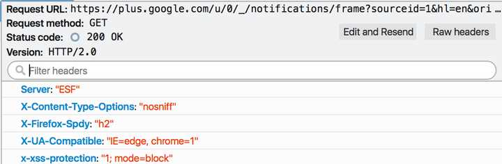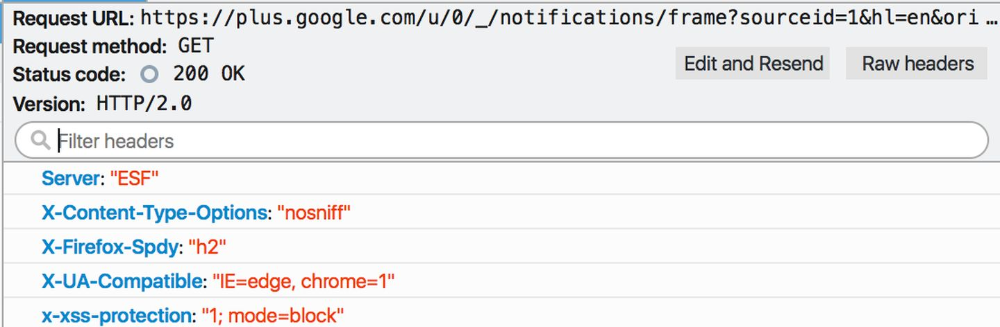

[图12]

其中Version：HTTP／2.0已经很明确表明协议类型，Firefox还在header里面插入了X-Firefox-Spdy:“h2”，也可以看出是否使用http2.0。

Chrome在2015年检测到的http2.0流量大概有18%。不过这个数字本来会更高，因为Chrome现在很大一部分流量都在试验QUIC（google正在开辟的另一块疆土）。Chrome上也可以使用[类似的插件](https://link.zhihu.com/?target=https%3A//chrome.google.com/webstore/detail/http2-and-spdy-indicator/mpbpobfflnpcgagjijhmgnchggcjblin)来判断网站是否是使用http2.0。

**4. 移动端HTTP现状****4.1 iOS下http现状**

iOS系统是从iOS8开始才通过NSURLSession来支持SPDY的，iOS9+开始自动支持http2.0。实际上apple对http2.0非常有信心，推广力度也很大。新版本ATS机制默认使用https来进行网络传输。APN（Apple Push Notifiction）在iOS9上也已经是通过http2.0来实现的了。iOS9 sdk里的NSURLSession默认使用http2.0，而且对开发者来说是完全透明的，甚至没有api来知道到底是用的哪个版本的http协议。

对于开发者来说到底怎么去配置最佳的http使用方案呢？在我看来，因app而异，主要从两方面来考虑：一是app本身http流量是否大而且密集，二是开发团队本身的技术条件。http2.0的部署相对容易很多，客户端开发者甚至不用做什么改动，只需要使用iOS9的SDK编译即可，但缺点是http2.0只能适用于iOS9的设备。SPDY的部署相对麻烦一些，但优点是可以兼顾iOS6+的设备。iOS端的SPDY可以使用twitter开发的CocoaSPDY方案，但有一点需要特别处理：

由于苹果的TLS实现不支持NPN，所以通过NPN协商使用SPDY就无法通过默认443端口来实现。有两种做法，一是客户端和server同时约定好使用另一个端口号来做NPN协商，二是server这边通过request header智能判断客户端是否支持SPDY而越过NPN协商过程。第一种方法会简单一点，不过需要从框架层将所有的http请求都map到另一个port，url mapping可以参考我之前的[一篇文章](https://link.zhihu.com/?target=http%3A//music4kid.github.io/ios/2016/01/22/dnsmapping/)。twitter自己的网站twitter.com使用的是第二种方法。

浏览器端（比如Chrome），server端（比如nginx）都陆续打算放弃支持spdy了，毕竟google官方都宣布要停止维护了。spdy会是一个过渡方案，会随着iOS9的普及会逐步消失，所以这部分的技术投入需要开发团队自己去衡量。

**4.2 Android下http现状**

android和iOS情况类似，http2.0只能在新系统下支持，spdy作为过渡方案仍然有存在的必要。

对于使用webview的app来说，需要基于chrome内核的webview才能支持spdy和http2.0，而android系统的webview是从android4.4（KitKat）才改成基于chrome内核的。

对于使用native api调用的http请求来说，okhttp是同时支持spdy和http2.0的可行方案。如果使用ALPN，okhttp要求android系统5.0+(实际上，android4.4上就有了ALPN的实现，不过有bug，知道5.0才正式修复)，如果使用NPN，可以从android4.0+开始支持，不过NPN也是属于将要被淘汰的协议。

**结束语**

以上是HTTP从1.x到SPDY，再到HTTP2.0的一些主要变迁技术点。HTTP2.0正处于逐步应用到线上产品和服务的阶段，可以预见未来会有不少新的坑产生和与之对应的优化技巧，HTTP1.x和SPDY也将在一段时间内继续发挥余热。作为工程师，需要了解这些协议背后的技术细节，才能打造高性能的网络框架，从而提升我们的产品体验。

**参考链接：**

[http2 concepts · http2 explained](https://link.zhihu.com/?target=http%3A//http2-explained.haxx.se/content/en/part5.html)