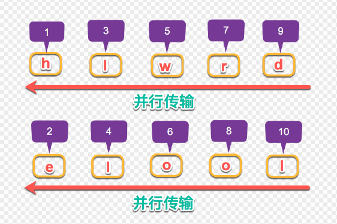

# [浅析HTTP/2的多路复用](https://segmentfault.com/a/1190000011172823)

[**会说话的鱼**](https://segmentfault.com/u/sunhk)发布于 2017-09-14 https://segmentfault.com/a/1190000011172823

HTTP/2有三大特性：头部压缩、Server Push、多路复用。前两个特性意思比较明确，也好理解，唯有多路复用不太好理解，尤其是和HTTP1.1进行对比的时候，这个问题我想了很长时间，也对比了很长时间，现在把思考的结果分享出来，希望对大家有帮忙。

### 先来说说Keep-Alive

在没有`Keep-Alive`前，我们与服务器请求数据的流程是这样：

- 浏览器请求`//static.mtime.cn/a.js`-->解析域名-->HTTP连接-->服务器处理文件-->返回数据-->浏览器解析、渲染文件
- 浏览器请求`//static.mtime.cn/b.js`-->解析域名-->HTTP连接-->服务器处理文件-->返回数据-->浏览器解析、渲染文件
- ...
- ...
- ...
- 这样循环下去，直至全部文件下载完成。

这个流程最大的问题就是：**每次请求都会建立一次HTTP连接**，也就是我们常说的3次握手4次挥手，这个过程在一次请求过程中占用了相当长的时间，而且逻辑上是非必需的，因为不间断的请求数据，第一次建立连接是正常的，以后就占用这个通道，下载其他文件，这样效率多高啊！你猜对了，这就是`Keep-Alive`。

### `Keep-Alive`解决的问题

`Keep-Alive`解决的核心问题：一定时间内，同一域名多次请求数据，只建立一次HTTP请求，其他请求可复用每一次建立的连接通道，以达到提高请求效率的问题。这里面所说的**一定时间**是可以配置的，不管你用的是`Apache`还是`nginx`。

### `HTTP1.1`还是存在效率问题

如上面所说，在`HTTP1.1`中是默认开启了`Keep-Alive`，他解决了多次连接的问题，但是依然有两个效率上的问题：

- 第一个：串行的文件传输。当请求a文件时，b文件只能等待，等待a连接到服务器、服务器处理文件、服务器返回文件，这三个步骤。我们假设这三步用时都是1秒，那么a文件用时为3秒，b文件传输完成用时为6秒，依此类推。（注：此项计算有一个前提条件，就是浏览器和服务器是单通道传输）
- 第二个：连接数过多。我们假设`Apache`设置了最大并发数为300，因为浏览器限制，浏览器发起的最大请求数为6，也就是服务器能承载的最高并发为50，当第51个人访问时，就需要等待前面某个请求处理完成。

### HTTP/2的多路复用

HTTP/2的多路复用就是为了解决上述的两个性能问题，我们来看一下，他是如何解决的。

- 解决第一个：在`HTTP1.1`的协议中，我们传输的`request`和`response`都是基本于文本的，这样就会引发一个问题：所有的数据必须按顺序传输，比如需要传输：`hello world`，只能从`h`到`d`一个一个的传输，不能并行传输，因为接收端并不知道这些字符的顺序，所以并行传输在`HTTP1.1`是不能实现的。

`HTTP/2`引入`二进制数据帧`和`流`的概念，其中帧对数据进行顺序标识，如下图所示，这样浏览器收到数据之后，就可以按照序列对数据进行合并，而不会出现合并后数据错乱的情况。同样是因为有了序列，服务器就可以并行的传输数据，这就是`流`所做的事情。

- 解决第二个问题：`HTTP/2`对同一域名下所有请求都是基于`流`，也就是说同一域名不管访问多少文件，也只**建立一路连接**。同样`Apache`的最大连接数为300，因为有了这个新特性，最大的并发就可以提升到300，比原来提升了6倍！

### 以前我们做的性能优化不适用于`HTTP/2`了

- **JS文件的合并**。我们现在优化的一个主要方向就是尽量的减少HTTP的请求数， 对我们工程中的代码，研发时分模块开发，上线时我们会把所有的代码进行压缩合并，合并成一个文件，这样不管多少模块，都请求一个文件，减少了HTTP的请求数。但是这样做有一个非常严重的问题：文件的缓存。当我们有100个模块时，有一个模块改了东西，按照之前的方式，整个文件浏览器都需要重新下载，不能被缓存。现在我们有了`HTTP/2`了，模块就可以单独的压缩上线，而不影响其他没有修改的模块。
- **多域名提高浏览器的下载速度**。之前我们有一个优化就是把css文件和js文件放到2个域名下面，这样浏览器就可以对这两个类型的文件进行同时下载，避免了浏览器6个通道的限制，这样做的缺点也是明显的，1.DNS的解析时间会变长。2.增加了服务器的压力。有了`HTTP/2`之后，根据上面讲的原理，我们就不用这么搞了，成本会更低。