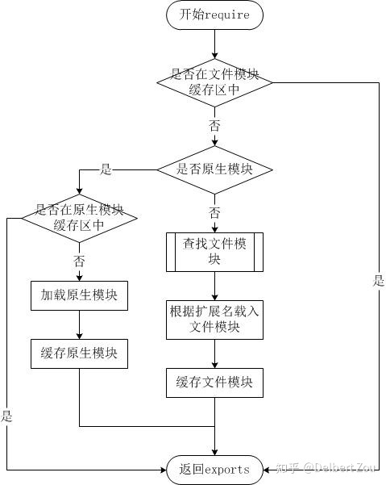
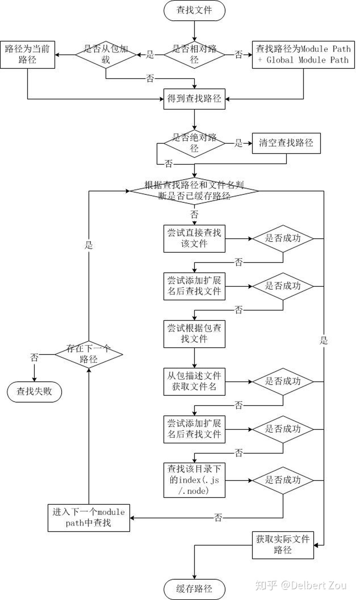

# 试试看 - Node 中 Module 机制

[](https://www.zhihu.com/people/delbert-zou)

[Delbert Zou](https://www.zhihu.com/people/delbert-zou)

中二的前C#现前端初心者

21 人赞同了该文章

博客链接：

[试试看 - Node 中 Module 机制delbertbeta.cc](https://link.zhihu.com/?target=https%3A//delbertbeta.cc/try-it-how-node-module-works/)

## 前言

Node 的 Module 机制在我脑海里一直是一个模模糊糊的地方，因为简单的会 export 和 require 一个包实在是过于的基础和简单，但是日常开发也足够用了。虽然看过朴灵的那本 《深入浅出 Node.js》，但是有些遗忘，一直处于舒适区还是不行的。

## JS 模块的封装器

在 Node 中我们可以使用 `require`, `__dirname` 这些属性和方法，从哪里来的呢，其实是 Node 会在加载 JS 文件后给文件内容做一个包裹的，叫做模块封装器。

```js
(function (exports, require, module, __filename, __dirname) {
    // file goes here...
});
```

尝试翻看 Node v10.15.3 的源代码查找 `module` 的内部实现。

```js
Module.wrap = function(script) {
  return Module.wrapper[0] + script + Module.wrapper[1];
};

Module.wrapper = [
  '(function (exports, require, module, __filename, __dirname) { ',
  '\n});'
];
```

简单粗暴我喜欢。

## module.exports 与 exports

```js
function require(/* ... */) {
  const module = { exports: {} };
  ((module, exports) => {
    // 模块代码在这。在这个例子中，定义了一个函数。
    function someFunc() {}
    exports = someFunc;
    // 此时，exports 不再是一个 module.exports 的快捷方式，
    // 且这个模块依然导出一个空的默认对象。
    module.exports = someFunc;
    // 此时，该模块导出 someFunc，而不是默认对象。
  })(module, module.exports);
  return module.exports;
}
```

这是 Node 官方文档中给 `exports` 行为的假想实现。其实已经非常明显了，如果你没有对 `exports` 的指向进行修改，那么 `exports` 就是对 `modules.exports` 的一个引用。

```js
// module.js
console.log(exports === module.exports)       // true
console.log(module.exports)                   // {}，默认是一个空对象
module.exports.a = 1
exports.b = 2

// main.js
console.log(require('./module').a)            // 1
console.log(require('./module').b)            // 2
```

如果你改变了 `exports` 的引用，例如

```js
// module.js
exports = {a: 2333}

// main.js
console.log(require('./module').a)        // undefined
```

这时候其实会发生的事情就是，`exports` 不再是 `module.exports` 的引用，对 `exports` 造成的任何修改都不会被导出。

但是修改 `module.exports` 的引用是 Okay 的，这也符合我们平时的认知。

```js
// module.js
module.exports = {a: 1}
console.log(module.exports === exports)     // false

// main.js
console.log(require('./module').a)        // 1
```

原因也就很简单了 `module` 在模块里作为一个引用被传入，修改其属性的引用在外界是可以被感知的。模块导出时只关注 `module.exports` 对象是什么东西。

## Require 查找包的顺序





引用两张经典的图。

其中查找需要依次遍历的 `Module Path` 列表可以通过 `module.paths` 这个 API 获取到。一般是从当前目录下的 `node_modules` 一直到文件系统根目录下的 `node_modules` 文件夹。（如果环境变量定义了，还包括 `HOME` 目录下的 `node_modules` 和 `NODE_PATH` 环境变量定义的文件夹）

```js
console.log(module.paths);

/* 
[ 'C:\\Users\\delbertbeta\\Desktop\\Projects\\offer\\node\\node_modules',
  'C:\\Users\\delbertbeta\\Desktop\\Projects\\offer\\node_modules',
  'C:\\Users\\delbertbeta\\Desktop\\Projects\\node_modules',
  'C:\\Users\\delbertbeta\\Desktop\\node_modules',
  'C:\\Users\\delbertbeta\\node_modules',
  'C:\\Users\\node_modules',
  'C:\\node_modules' ]
*/
```

而 `Global Module Path` 就是 `npm install -g` 时包会安装到的地方，具体位置和操作系统与 Node 的安装配置有关。

Node.js 对路径查找实现了缓存机制，但是每次判断路径都是同步阻塞式进行。

这部分阅读过 Node 源代码后流程的确基本和上面的流程图一致。

## Node 的模块缓存机制

Node 中模块是基于其解析的文件名进行缓存的（看源代码这里的文件名应该是指文件的绝对路径）。由于调用模块的位置的不同，模块可能被解析成不同的文件名（比如从 `node_modules` 目录加载），这样就不能保证 `require('foo')` 总能返回完全相同的对象。

此外，在不区分大小写的文件系统或操作系统中，被解析成不同的文件名可以指向同一文件，但缓存仍然会将它们视为不同的模块，并多次重新加载。 例如， `require('./foo')` 和 `require('./FOO')` 返回两个不同的对象，而不会管 `./foo` 和 `./FOO` 是否是相同的文件。

```js
/* Module._findPath */
    var cacheKey = request + '\x00' +
                (paths.length === 1 ? paths[0] : paths.join('\x00'));
    var entry = Module._pathCache[cacheKey];
    if (entry)
        return entry;
    // ...find module 
    filename = path.resolve(basePath);
    // or
    filename = toRealPath(basePath);
    // or 
    filename = tryExtensions(basePath, exts, isMain);
    // file path found.
    Module._pathCache[cacheKey] = filename;
    return fileName;

/* Module._resolveFilename */
    var filename = Module._findPath(request, paths, isMain);
    return filename;

/* Module._load */
    var filename = Module._resolveFilename(request, parent, isMain);

    var cachedModule = Module._cache[filename];
    if (cachedModule) {
        updateChildren(parent, cachedModule, true);
        return cachedModule.exports;
    }

    var module = new Module(filename, parent);
    Module._cache[filename] = module;
    return module.exports;
```

## Node 如何处理循环依赖

当 `main.js` 加载 `a.js` 时， `a.js` 又加载 `b.js`。 此时， `b.js` 会尝试去加载 `a.js`。 为了防止无限的循环，会返回一个 `a.js` 的 `exports` 对象的 **未完成的副本** 给 `b.js` 模块。 然后 `b.js` 完成加载，并将 `exports` 对象提供给 `a.js` 模块。

其实上面的代码已经可以体现这一点，`b.js` 加载 `a.js` 时，由于 `a.js` 的 `Module` 实例已经被生成，只是将实例中当前的 `module.exports` 的引用返回而已，那么得到的就是一个未完成的 `module.exports`。写一段代码测试一下想法。

```js
// module.js
module.exports.a = 1
require('./subModule')
module.exports.b = 2

// subModule.js
const parent = require('./module')
console.log(parent.a)
console.log(parent.b)

module.exports = {
  getB() { console.log(parent.b) }
}

// main.js
const a = require('./module')
const b = require('./subModule')

b.getB()

// output
// 1
// undefined
// 2
```

## 执行

第一个加载的模块，肯定就是 `node xxx.js` 的那个 `xxx.js` 啦。

```js
Module.runMain = function () {
    Module._load(process.argv[1], null, true);
}
```

函数调用流程如下：`_load()` -> `tryModuleLoad()` -> `Module.prototype.load` -> `Module._extensions[extension](this, filename)`

Node 可以支持 `.js|.json|.node` 格式文件，相关的文件解析函数都被定义在 `Module._extensions` 对象下，主要看 `Module._extensions['.js']`

```js
Module._extensions['.js'] = function(module, filename) {
  var content = fs.readFileSync(filename, 'utf8');
  module._compile(stripBOM(content), filename);
};
```

先读取文件，去除 BOM 头部，`_compile()` 中调用了 `vm` 相关的函数，`vm` 模块是 Node 中提供的一系列 API 用于在 V8 虚拟机环境中编译和运行代码。其流程主要如下：

1. 如果有的话，去除 `#!` 这个 Shell 脚本的 Shebang。
2. 调用 `Module.wrap()` 加上封装器。
3. 调用 `vm.runInThisContext()` 传入封装好的 JS 代码和参数。
4. 注入调试器。

关于 `vm` 部分就不在这篇文章中深入探讨了。

## 小结

看源代码真的是一种学习的好方法，方便，信息量大，能学到看别人的二手知识得不到的东西，而且眼见为实~

### 参考

[module | Node.js API 文档nodejs.cn](https://link.zhihu.com/?target=http%3A//nodejs.cn/api/modules.html)[深入浅出Node.js（三）：深入Node.js的模块机制 - InfoQinfoq.cn](https://link.zhihu.com/?target=https%3A//infoq.cn/article/nodejs-module-mechanism)


编辑于 2019-03-23