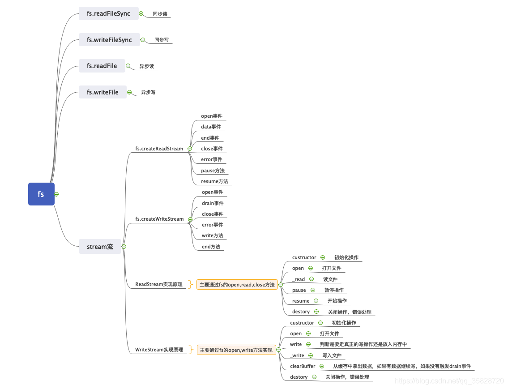

## fs



- 读取文件默认编码是null, 二进制数据，文件不存在会报错
- 写入文件默认以二进制写入，如果文件不存在会创建文件，如果文件存在会覆盖

### readFileSync

同步读

```js
const read = fs.readFileSync(path.resolve(__dirname, 'name.txt'), 'utf8');
console.log(read); //=>章三
12
```

### writeFileSync

同步写

```js
fs.writeFileSync(path.resolve(__dirname, 'age.txt'), '18', 'utf8');
1
```

### readFile

异步读

```js
fs.readFile(path.resolve(__dirname, 'name.txt'), (err, data) => {
    if (err) throw err;
    console.log(data.toString()); //=>章三
})
1234
```

### writeFile

异步写

```js
fs.writeFile(path.resolve(__dirname, 'age.txt'), '20', err => {
    if (err) throw err;
})
123
```

### createReadStream

使用

```js
const fs = require('fs');
const path = require('path');

const rs = fs.createReadStream(path.resolve(__dirname, './number.txt'), {
    flags: 'r',
    encoding: null,
    // mode: 0o66,//权限,2爷1直4读书
    autoClose: true,
    start: 0,
    end: 6, //从索引0的位置开始读到索引3的位置，闭区间[0,6],读取了7个字节
    highWaterMark: 3, //每次读取的字节数,
})

rs.on('open', (fd) => {
    console.log(fd);
})

const arr = []
//当监听data事件时，内部会不停的将数据发送过来
rs.on('data', (thunk) => {
    console.log(thunk);
    arr.push(thunk);
})

rs.on('end', () => {
    console.log(Buffer.concat(arr).toString()); //=>0123456
})

rs.on('close', () => {
    console.log('close');
})

//rs.pause()可以暂停读取
//rs.resume()可以恢复读
12345678910111213141516171819202122232425262728293031323334
```

简单实现

主要使用的是fs的 `open` , `read`

```js
const EventEmitter = require('events');
const fs = require('fs');

class ReadStream extends EventEmitter {
    constructor(path, options) {
        super()
        //读取的文件路径
        this.path = path;
        //
        this.flags = options.flags || 'r';
        //读取索引的开始位置
        this.start = options.start || 0;
        //读取索引的结束位置
        this.end = options.end || undefined;
        //读取的编码格式
        this.encoding = options.encoding || null;
        //是否自动关闭
        this.autoClose = options.autoClose || true;
        //每次读取的字符数
        this.hightWaterMark = options.hightWaterMark || 64 * 1024;
        //偏移量
        this.offset = 0;
        //是不是流动模式
        this.flowing = false;

        //打开文件
        this.open()

        //监听用户注册data方法
        this.on('newListener', (type) => {
            if (type === 'data') { //用户注册了data
                this.flowing = true; //设置为流动
                //开始读文件
                this._read()
            }
        })
    }

    //打开文件
    open() {
        fs.open(this.path, this.flags, (err, fd) => {
            if (err) throw err;
            this.fd = fd;
            this.emit('open', fd);
        })
    }

    //读文件
    _read() {
        //因为打开文件是异步操作，所以此时获取不到fd
        if (typeof this.fd !== 'number') return this.once('open', this._read);
        //计算读取的数量,如果end有值，就有通过end和hightWaterMark计算
        //因为start end是一个闭区间，所以要+1 
        const howMouchToRead = this.end ? Math.min(this.hightWaterMark, this.end - this.offset + 1) : this.hightWaterMark;

        const buffer = Buffer.alloc(howMouchToRead);
        //开始读取文件
        fs.read(this.fd, buffer, 0, howMouchToRead, this.offset, (err, bytesRead, buf) => {
            if (err) return this.destroy(err);
            //bytesRead真是读取到的字节个数
            if (bytesRead > 0) {
                //发送数据给客户注册的data
                this.emit('data', buf);
                this.offset += bytesRead;
                if (this.flowing) {
                    this._read();
                }
            } else {
                //读取完成
                this.emit('end');
                this.destroy();
            }
        })
    }

    //开始操作
    resume() {
        //确定已经暂停了
        if (!this.flowing) {
            this.flowing = true;
            this._read();
        }
    }

    //暂停操作
    pause() {
        this.flowing = false;
    }

    //结束
    destroy(err) {
        if (err) return this.emit('error', err);
        if (typeof this.fd === 'number' && this.autoClose) {
            fs.close(this.fd, () => {
                this.emit('close');
            })
        }
    }
}

module.exports = ReadStream;
123456789101112131415161718192021222324252627282930313233343536373839404142434445464748495051525354555657585960616263646566676869707172737475767778798081828384858687888990919293949596979899100101
```

### createWriteStream

- 写的过程会排序，开始写的时候，会讲第一个真正的写入，其他的放入到链表中，等待第一个写入完成，在从链表中拿出第一个再写入
- highWaterMark: 我期望使用多少个字节完成写入操作，如果超出后write的返回值会变成false， 返回false 可以用于判断，告知用户不要在写入了，再写入只能放到内存中，占用内存

简单使用

```js
const path = require('path');
const fs = require('fs');

const ws = fs.createWriteStream(path.resolve(__dirname, './copy.txt'), {
    flags: 'w',
    encoding: 'utf8',
    mode: 0o666,
    autoClose: true,
    emitClose: true,
    start: 0,
    highWaterMark: 3
});

//需要注意的是write的返回值，当写入的字符个数>=highWaterMark的值时，返回的是false
//在下面写入的过程是会将012中的0第一次真正的写入，而将12会放入链表中等待0写入完成
//在从链表中取出第一个1来继续写入，依次下去，直到写完。这里第二个r返回的是false，因为012是
//3个字符>=highWaterMark的3
let r = ws.write('01', (err) => {
    if (err) throw err;
})
console.log(r); //=>true

r = ws.write('2', (err) => {
    if (err) throw err;
})
console.log(r); //=>false
1234567891011121314151617181920212223242526
```

希望写入10个数（0-9），只用一个字节的内存

```js
const fs = require('fs');
const path = require('path');

const ws = fs.createWriteStream(path.resolve(__dirname, './copy.txt'), {
    flags: 'w',
    encoding: 'utf8',
    mode: 0o666,
    autoClose: true,
    emitClose: true,
    start: 0,
    highWaterMark: 1
})

let index = 0;

function write() {
    let writting = true;
    while (index < 10) {
        //这里写入时，不能为number类型，不然回报错
        writting = ws.write(`${index++}`);
        if (!writting) {
            break;
        }
    }
    if (index === 10) {
        ws.end(); //当执行end后会触发close事件，并且end就不会再触发drain事件了，可以看下log,注释掉end会打印10个drain，不注释掉会打印9个drain和一个close
        // ws.end('yy');//end可以在写一条数据,相当于end=write+close
    }
}

//当写入的个数到达期望值或超过（highWaterMark）后被消费，会触发drain事件
ws.on('drain', () => {
    console.log('drain');
    write();
})

ws.on('close', () => {
    console.log('close');
})

//执行
write();
123456789101112131415161718192021222324252627282930313233343536373839404142
```

实现writeStream

主要是用的是 `fs` 的 `open` , `write`

```js
const fs = require('fs');
const EventEmitter = require('events');

class WriteStream extends EventEmitter {
    constructor(path, options = {}) {
        super();
        this.path = path;
        this.flags = options.flags || 'w';
        this.encoding = options.encoding || 'utf8';
        this.mode = options.mode || 0o666;
        this.autoClose = options.autoClose || true;
        this.emitClose = options.emitClose || true;
        this.start = options.start || 0;
        this.highWaterMark = options.highWaterMark || 16 * 1024;

        this.offset = 0;
        //默认不是正在写入，第一次调用write的时候需要执行fs.write方法
        this.writting = false;
        //表示需要写入的长度
        this.len = 0;
        //是否触发drain事件
        this.needDrain = false;
        //缓存
        this.cache = [];

        //打开文件
        this.open();

    }

    open() {
        fs.open(this.path, this.flags, this.mode, (err, fd) => {
            if (err) this.destory(err);
            this.fd = fd;
            this.emit('open', fd);
        })
    }

    write(chunk, encoding = this.encoding, cb = () => {}) {
        //用户写的东西可能是汉字
        chunk = Buffer.isBuffer(chunk) ? chunk : Buffer.from(chunk);
        //需要写入的长度
        this.len += chunk.length;
        //返回结果，如果写入的<highWaterMark
        const result = this.len < this.highWaterMark;
        //跟返回的result刚好相反
        this.needDrain = !result

        const clearBuffer = () => {
            this.clearBuffer();
            cb();
        }
        if (this.writting) {
            //剩下的放到缓存中
            this.cache.push({
                chunk,
                encoding,
                clearBuffer
            })
        } else {
            //第一次的时候是真的写到文件中
            this.writting = true;
            //真正的去写
            this._write(chunk, encoding, clearBuffer);
        }

        return result;
    }

    _write(chunk, encoding, cb) {
        //open是异步过程，这里fd还拿不到
        if (typeof this.fd !== 'number') return this.once('open', () => this._write(chunk, encoding, cb));
        //写入过程 
        fs.write(this.fd, chunk, 0, chunk.length, this.offset, (err, written) => {
            if (err) return this.destory(err);
            //修改offset
            this.offset += written;
            //修改len
            this.len -= written;
            //写入完成需要清空缓存
            cb();
        })
    }

    clearBuffer() {
        //从缓存中拿出一个数据
        const data = this.cache.shift();
        if (data) { //缓存中有内容
            //将数据继续写入文件中
            this._write(data.chunk, data.encoding, data.clearBuffer);
        } else {
            //缓存中已经没有数据了
            this.writting = false;
            if (this.needDrain) {
                this.needDrain = false;
                this.emit('drain');
            }
        }
    }

    destory(err) {
        if (err) this.emit('error', err);
    }
}

module.exports = WriteStream;
```