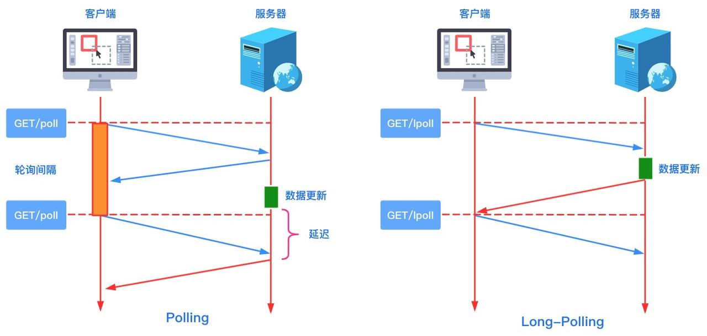
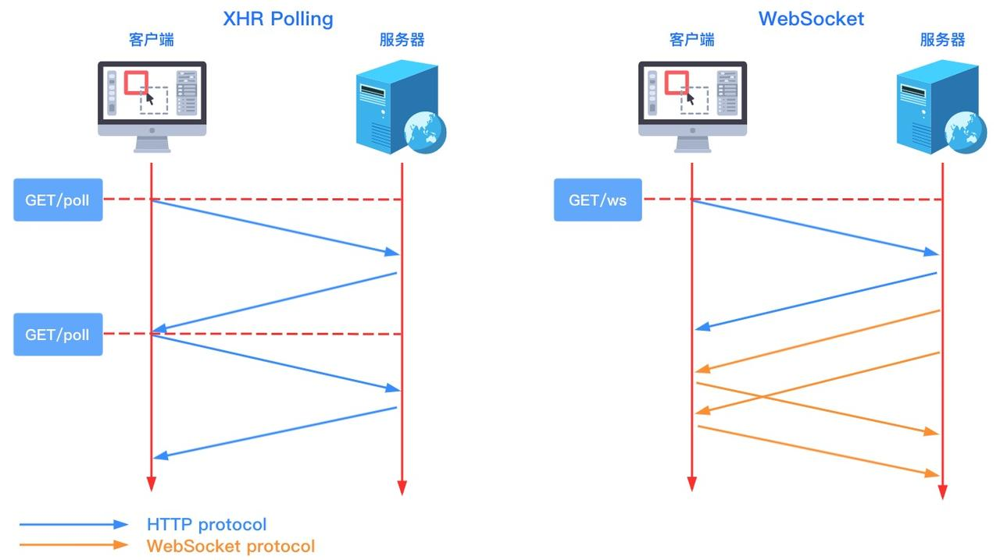
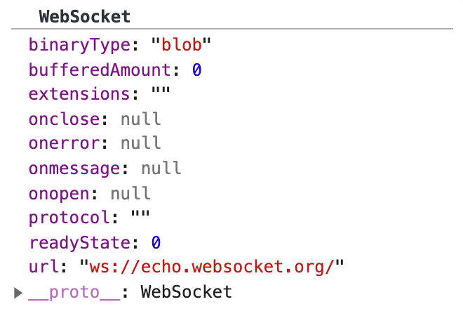
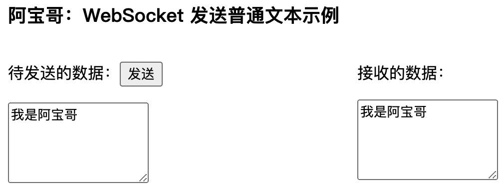
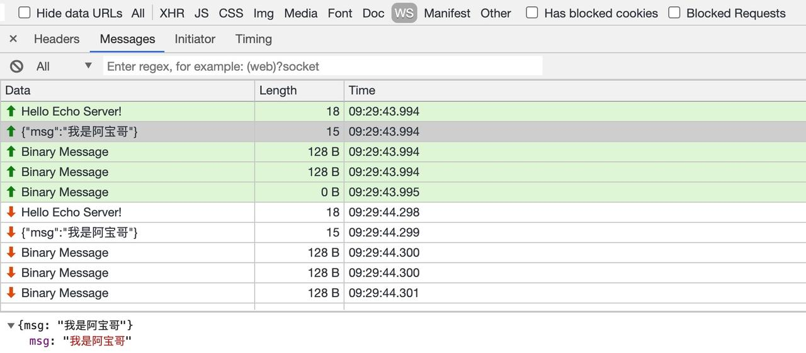
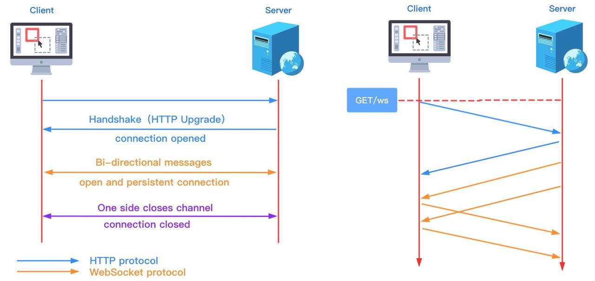
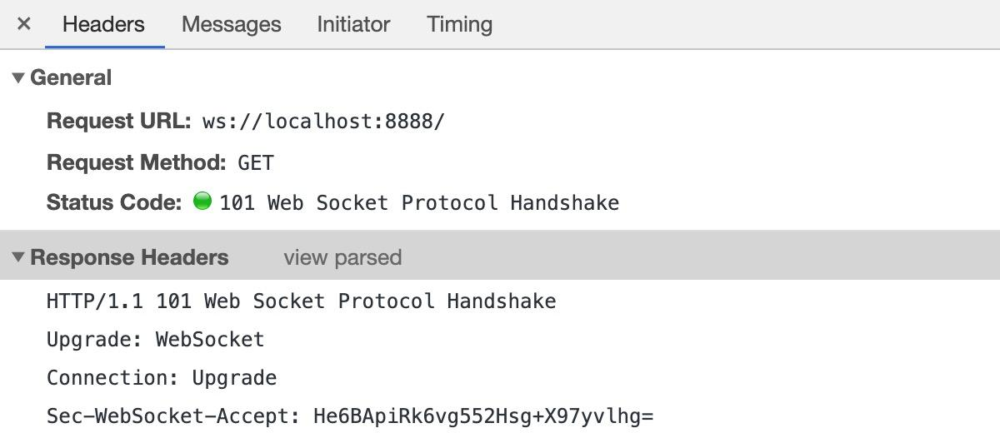
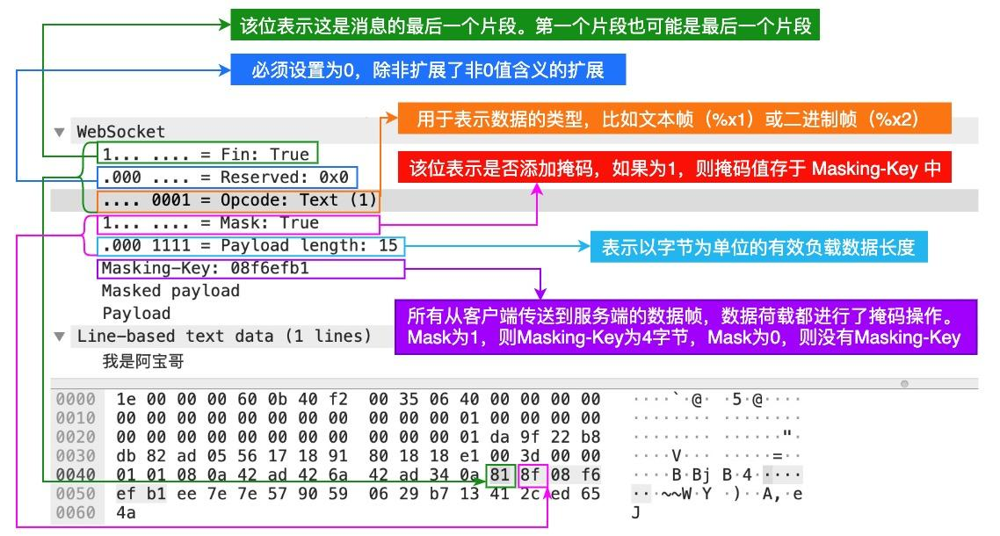
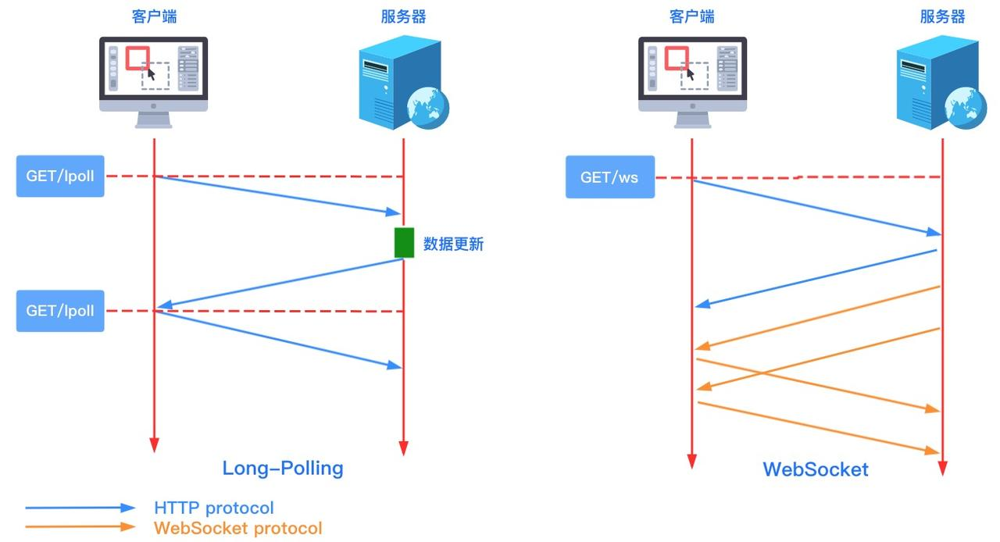
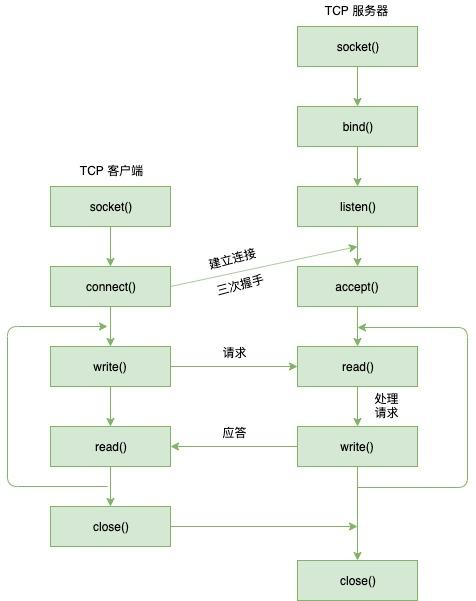

# [你不知道的 WebSocket](https://juejin.cn/post/6854573221241421838#heading-24)

本文阿宝哥将从多个方面入手，全方位带你一起探索 WebSocket 技术。阅读完本文，你将了解以下内容：

- 了解 WebSocket 的诞生背景、WebSocket 是什么及它的优点；
- 了解 WebSocket 含有哪些 API 及如何使用 WebSocket API 发送普通文本和二进制数据；
- 了解 WebSocket 的握手协议和数据帧格式、掩码算法等相关知识；
- 了解如何实现一个支持发送普通文本的 WebSocket 服务器。

在最后的 **阿宝哥有话说** 环节，阿宝哥将介绍 WebSocket 与 HTTP 之间的关系、WebSocket 与长轮询有什么区别、什么是 WebSocket 心跳及 Socket 是什么等内容。

推荐阅读（感谢掘友的鼓励与支持🌹🌹🌹）：

- [你不知道的 Web Workers （上）[7.8K 字 | 多图预警\]](https://juejin.im/post/6844904198639714311)（424+ 个👍）
- [你不知道的 Blob](https://juejin.im/post/6844904198639714311)（215+ 个👍）
- [你不知道的 WeakMap](https://juejin.im/post/6844904198639714311)（55+ 个👍）
- [玩转前端 Video 播放器 | 多图预警](https://juejin.im/post/6850037275579121671)（708+ 个👍）
- [玩转前端二进制](https://juejin.im/post/6846687590783909902)（359+ 个👍）

下面我们进入正题，为了让大家能够更好地理解和掌握 WebSocket 技术，我们先来介绍一下什么是 WebSocket。

### 一、什么是 WebSocket

#### 1.1 WebSocket 诞生背景

早期，很多网站为了实现推送技术，所用的技术都是轮询。轮询是指由浏览器每隔一段时间向服务器发出 HTTP 请求，然后服务器返回最新的数据给客户端。常见的轮询方式分为轮询与长轮询，它们的区别如下图所示：



为了更加直观感受轮询与长轮询之间的区别，我们来看一下具体的代码：


这种传统的模式带来很明显的缺点，即浏览器需要不断的向服务器发出请求，然而 HTTP 请求与响应可能会包含较长的头部，其中真正有效的数据可能只是很小的一部分，所以这样会消耗很多带宽资源。

比较新的轮询技术是 [Comet](https://zh.wikipedia.org/wiki/Comet_(web技术))。这种技术虽然可以实现双向通信，但仍然需要反复发出请求。而且在 Comet 中普遍采用的 HTTP 长连接也会消耗服务器资源。

在这种情况下，HTML5 定义了 WebSocket 协议，能更好的节省服务器资源和带宽，并且能够更实时地进行通讯。Websocket 使用 ws 或 wss 的统一资源标志符（URI），其中 wss 表示使用了 TLS 的 Websocket。如：

```
ws://echo.websocket.org
wss://echo.websocket.org
复制代码
```

WebSocket 与 HTTP 和 HTTPS 使用相同的 TCP 端口，可以绕过大多数防火墙的限制。默认情况下，WebSocket 协议使用 80 端口；若运行在 TLS 之上时，默认使用 443 端口。

#### 1.2 WebSocket 简介

WebSocket 是一种网络传输协议，可在单个 TCP 连接上进行全双工通信，位于 OSI 模型的应用层。WebSocket 协议在 2011 年由 IETF 标准化为 [RFC 6455](https://tools.ietf.org/html/rfc6455)，后由 [RFC 7936](https://tools.ietf.org/html/rfc7936) 补充规范。

WebSocket 使得客户端和服务器之间的数据交换变得更加简单，允许服务端主动向客户端推送数据。在 WebSocket API 中，浏览器和服务器只需要完成一次握手，两者之间就可以创建持久性的连接，并进行双向数据传输。

介绍完轮询和 WebSocket 的相关内容之后，接下来我们来看一下 XHR Polling 与 WebSocket 之间的区别：



#### 1.3 WebSocket 优点

- 较少的控制开销。在连接创建后，服务器和客户端之间交换数据时，用于协议控制的数据包头部相对较小。
- 更强的实时性。由于协议是全双工的，所以服务器可以随时主动给客户端下发数据。相对于 HTTP 请求需要等待客户端发起请求服务端才能响应，延迟明显更少。
- 保持连接状态。与 HTTP 不同的是，WebSocket 需要先创建连接，这就使得其成为一种有状态的协议，之后通信时可以省略部分状态信息。
- 更好的二进制支持。WebSocket 定义了二进制帧，相对 HTTP，可以更轻松地处理二进制内容。
- 可以支持扩展。WebSocket 定义了扩展，用户可以扩展协议、实现部分自定义的子协议。

由于 WebSocket 拥有上述的优点，所以它被广泛地应用在即时通信、实时音视频、在线教育和游戏等领域。对于前端开发者来说，要想使用 WebSocket 提供的强大能力，就必须先掌握 WebSocket API，下面阿宝哥带大家一起来认识一下 WebSocket API。

### 二、WebSocket API

在介绍 WebSocket API 之前，我们先来了解一下它的兼容性：


（图片来源：https://caniuse.com/#search=WebSocket）

从上图可知，目前主流的 Web 浏览器都支持 WebSocket，所以我们可以在大多数项目中放心地使用它。

在浏览器中要使用 WebSocket 提供的能力，我们就必须先创建 WebSocket 对象，该对象提供了用于创建和管理 WebSocket 连接，以及可以通过该连接发送和接收数据的 API。

使用 WebSocket 构造函数，我们就能轻易地构造一个 WebSocket 对象。接下来我们将从 WebSocket 构造函数、WebSocket 对象的属性、方法及 WebSocket 相关的事件四个方面来介绍 WebSocket API，首先我们从 WebSocket 的构造函数入手：

#### 2.1 构造函数

WebSocket 构造函数的语法为：

```
const myWebSocket = new WebSocket(url [, protocols]);
复制代码
```

相关参数说明如下：

- url：表示连接的 URL，这是 WebSocket 服务器将响应的 URL。
- protocols（可选）：一个协议字符串或者一个包含协议字符串的数组。这些字符串用于指定子协议，这样单个服务器可以实现多个 WebSocket 子协议。比如，你可能希望一台服务器能够根据指定的协议（protocol）处理不同类型的交互。如果不指定协议字符串，则假定为空字符串。

当尝试连接的端口被阻止时，会抛出 `SECURITY_ERR` 异常。

#### 2.2 属性

WebSocket 对象包含以下属性：



每个属性的具体含义如下：

- binaryType：使用二进制的数据类型连接。
- bufferedAmount（只读）：未发送至服务器的字节数。
- extensions（只读）：服务器选择的扩展。
- onclose：用于指定连接关闭后的回调函数。
- onerror：用于指定连接失败后的回调函数。
- onmessage：用于指定当从服务器接受到信息时的回调函数。
- onopen：用于指定连接成功后的回调函数。
- protocol（只读）：用于返回服务器端选中的子协议的名字。
- readyState（只读）：返回当前 WebSocket 的连接状态，共有 4 种状态：
  - CONNECTING — 正在连接中，对应的值为 0；
  - OPEN — 已经连接并且可以通讯，对应的值为 1；
  - CLOSING — 连接正在关闭，对应的值为 2；
  - CLOSED — 连接已关闭或者没有连接成功，对应的值为 3。
- url（只读）：返回值为当构造函数创建 WebSocket 实例对象时 URL 的绝对路径。

#### 2.3 方法

- close([code[, reason]])：该方法用于关闭 WebSocket  连接，如果连接已经关闭，则此方法不执行任何操作。
- send(data)：该方法将需要通过 WebSocket 链接传输至服务器的数据排入队列，并根据所需要传输的数据的大小来增加 bufferedAmount 的值 。若数据无法传输（比如数据需要缓存而缓冲区已满）时，套接字会自行关闭。

#### 2.4 事件

使用 addEventListener() 或将一个事件监听器赋值给 WebSocket 对象的 oneventname 属性，来监听下面的事件。

- close：当一个 WebSocket 连接被关闭时触发，也可以通过 onclose 属性来设置。
- error：当一个 WebSocket 连接因错误而关闭时触发，也可以通过 onerror 属性来设置。
- message：当通过 WebSocket 收到数据时触发，也可以通过 onmessage 属性来设置。
- open：当一个 WebSocket 连接成功时触发，也可以通过 onopen 属性来设置。

介绍完 WebSocket API，我们来举一个使用 WebSocket 发送普通文本的示例。

#### 2.5 发送普通文本



在以上示例中，我们在页面上创建了两个 textarea，分别用于存放 **待发送的数据** 和 **服务器返回的数据**。当用户输入完待发送的文本之后，点击 **发送** 按钮时会把输入的文本发送到服务端，而服务端成功接收到消息之后，会把收到的消息原封不动地回传到客户端。

```
// const socket = new WebSocket("ws://echo.websocket.org");
// const sendMsgContainer = document.querySelector("#sendMessage");
function send() {
  const message = sendMsgContainer.value;
  if (socket.readyState !== WebSocket.OPEN) {
    console.log("连接未建立，还不能发送消息");
    return;
  }
  if (message) socket.send(message);
}
复制代码
```

当然客户端接收到服务端返回的消息之后，会把对应的文本内容保存到 **接收的数据** 对应的 textarea 文本框中。

```
// const socket = new WebSocket("ws://echo.websocket.org");
// const receivedMsgContainer = document.querySelector("#receivedMessage");    
socket.addEventListener("message", function (event) {
  console.log("Message from server ", event.data);
  receivedMsgContainer.value = event.data;
});
复制代码
```

为了更加直观地理解上述的数据交互过程，我们使用 Chrome 浏览器的开发者工具来看一下相应的过程：


以上示例对应的完整代码如下所示：

```
<!DOCTYPE html>
<html>
  <head>
    <meta charset="UTF-8" />
    <meta name="viewport" content="width=device-width, initial-scale=1.0" />
    <title>WebSocket 发送普通文本示例</title>
    <style>
      .block {
        flex: 1;
      }
    </style>
  </head>
  <body>
    <h3>阿宝哥：WebSocket 发送普通文本示例</h3>
    <div style="display: flex;">
      <div class="block">
        <p>即将发送的数据：<button onclick="send()">发送</button></p>
        <textarea id="sendMessage" rows="5" cols="15"></textarea>
      </div>
      <div class="block">
        <p>接收的数据：</p>
        <textarea id="receivedMessage" rows="5" cols="15"></textarea>
      </div>
    </div>

    <script>
      const sendMsgContainer = document.querySelector("#sendMessage");
      const receivedMsgContainer = document.querySelector("#receivedMessage");
      const socket = new WebSocket("ws://echo.websocket.org");

      // 监听连接成功事件
      socket.addEventListener("open", function (event) {
        console.log("连接成功，可以开始通讯");
      });

      // 监听消息
      socket.addEventListener("message", function (event) {
        console.log("Message from server ", event.data);
        receivedMsgContainer.value = event.data;
      });

      function send() {
        const message = sendMsgContainer.value;
        if (socket.readyState !== WebSocket.OPEN) {
          console.log("连接未建立，还不能发送消息");
          return;
        }
        if (message) socket.send(message);
      }
    </script>
  </body>
</html>
复制代码
```

其实 WebSocket 除了支持发送普通的文本之外，它还支持发送二进制数据，比如 ArrayBuffer 对象、Blob 对象或者 ArrayBufferView 对象：

```
const socket = new WebSocket("ws://echo.websocket.org");
socket.onopen = function () {
  // 发送UTF-8编码的文本信息
  socket.send("Hello Echo Server!");
  // 发送UTF-8编码的JSON数据
  socket.send(JSON.stringify({ msg: "我是阿宝哥" }));
  
  // 发送二进制ArrayBuffer
  const buffer = new ArrayBuffer(128);
  socket.send(buffer);
  
  // 发送二进制ArrayBufferView
  const intview = new Uint32Array(buffer);
  socket.send(intview);

  // 发送二进制Blob
  const blob = new Blob([buffer]);
  socket.send(blob);
};
复制代码
```

以上代码成功运行后，通过 Chrome 开发者工具，我们可以看到对应的数据交互过程：



下面阿宝哥以发送 Blob 对象为例，来介绍一下如何发送二进制数据。

> Blob（Binary Large Object）表示二进制类型的大对象。在数据库管理系统中，将二进制数据存储为一个单一个体的集合。Blob 通常是影像、声音或多媒体文件。**在 JavaScript 中 Blob 类型的对象表示不可变的类似文件对象的原始数据。**
>
> 对 Blob 感兴趣的小伙伴，可以阅读 [“你不知道的 Blob”](https://juejin.im/post/6844904178725158926) 这篇文章。

#### 2.6 发送二进制数据


在以上示例中，我们在页面上创建了两个 textarea，分别用于存放 **待发送的数据** 和 **服务器返回的数据**。当用户输入完待发送的文本之后，点击 **发送** 按钮时，我们会先获取输入的文本并把文本包装成 Blob 对象然后发送到服务端，而服务端成功接收到消息之后，会把收到的消息原封不动地回传到客户端。

当浏览器接收到新消息后，如果是文本数据，会自动将其转换成 DOMString 对象，如果是二进制数据或 Blob 对象，会直接将其转交给应用，由应用自身来根据返回的数据类型进行相应的处理。

**数据发送代码**

```
// const socket = new WebSocket("ws://echo.websocket.org");
// const sendMsgContainer = document.querySelector("#sendMessage");
function send() {
  const message = sendMsgContainer.value;
  if (socket.readyState !== WebSocket.OPEN) {
    console.log("连接未建立，还不能发送消息");
    return;
  }
  const blob = new Blob([message], { type: "text/plain" });
  if (message) socket.send(blob);
  console.log(`未发送至服务器的字节数：${socket.bufferedAmount}`);
}
复制代码
```

当然客户端接收到服务端返回的消息之后，会判断返回的数据类型，如果是 Blob 类型的话，会调用 Blob 对象的 text() 方法，获取 Blob 对象中保存的 UTF-8 格式的内容，然后把对应的文本内容保存到 **接收的数据** 对应的 textarea 文本框中。

**数据接收代码**

```
// const socket = new WebSocket("ws://echo.websocket.org");
// const receivedMsgContainer = document.querySelector("#receivedMessage");
socket.addEventListener("message", async function (event) {
  console.log("Message from server ", event.data);
  const receivedData = event.data;
  if (receivedData instanceof Blob) {
    receivedMsgContainer.value = await receivedData.text();
  } else {
    receivedMsgContainer.value = receivedData;
  }
 });
复制代码
```

同样，我们使用 Chrome 浏览器的开发者工具来看一下相应的过程：


通过上图我们可以很明显地看到，当使用发送 Blob 对象时，Data 栏位的信息显示的是 **Binary Message**，而对于发送普通文本来说，Data 栏位的信息是直接显示发送的文本消息。

以上示例对应的完整代码如下所示：

```
<!DOCTYPE html>
<html>
  <head>
    <meta charset="UTF-8" />
    <meta name="viewport" content="width=device-width, initial-scale=1.0" />
    <title>WebSocket 发送二进制数据示例</title>
    <style>
      .block {
        flex: 1;
      }
    </style>
  </head>
  <body>
    <h3>阿宝哥：WebSocket 发送二进制数据示例</h3>
    <div style="display: flex;">
      <div class="block">
        <p>待发送的数据：<button onclick="send()">发送</button></p>
        <textarea id="sendMessage" rows="5" cols="15"></textarea>
      </div>
      <div class="block">
        <p>接收的数据：</p>
        <textarea id="receivedMessage" rows="5" cols="15"></textarea>
      </div>
    </div>

    <script>
      const sendMsgContainer = document.querySelector("#sendMessage");
      const receivedMsgContainer = document.querySelector("#receivedMessage");
      const socket = new WebSocket("ws://echo.websocket.org");

      // 监听连接成功事件
      socket.addEventListener("open", function (event) {
        console.log("连接成功，可以开始通讯");
      });

      // 监听消息
      socket.addEventListener("message", async function (event) {
        console.log("Message from server ", event.data);
        const receivedData = event.data;
        if (receivedData instanceof Blob) {
          receivedMsgContainer.value = await receivedData.text();
        } else {
          receivedMsgContainer.value = receivedData;
        }
      });

      function send() {
        const message = sendMsgContainer.value;
        if (socket.readyState !== WebSocket.OPEN) {
          console.log("连接未建立，还不能发送消息");
          return;
        }
        const blob = new Blob([message], { type: "text/plain" });
        if (message) socket.send(blob);
        console.log(`未发送至服务器的字节数：${socket.bufferedAmount}`);
      }
    </script>
  </body>
</html>
复制代码
```

可能有一些小伙伴了解完 WebSocket API 之后，觉得还不够过瘾。下面阿宝哥将带大家来实现一个支持发送普通文本的 WebSocket 服务器。

### 三、手写 WebSocket 服务器

在介绍如何手写 WebSocket 服务器前，我们需要了解一下 WebSocket 连接的生命周期。



从上图可知，在使用 WebSocket 实现全双工通信之前，客户端与服务器之间需要先进行握手（Handshake），在完成握手之后才能开始进行数据的双向通信。

握手是在通信电路创建之后，信息传输开始之前。**握手用于达成参数，如信息传输率，字母表，奇偶校验，中断过程，和其他协议特性。**  握手有助于不同结构的系统或设备在通信信道中连接，而不需要人为设置参数。

既然握手是 WebSocket 连接生命周期的第一个环节，接下来我们就先来分析 WebSocket 的握手协议。

#### 3.1 握手协议

WebSocket 协议属于应用层协议，它依赖于传输层的 TCP 协议。WebSocket 通过 HTTP/1.1 协议的 **101** 状态码进行握手。为了创建 WebSocket 连接，需要通过浏览器发出请求，之后服务器进行回应，这个过程通常称为 “握手”（Handshaking）。

利用 HTTP 完成握手有几个好处。首先，让 WebSocket 与现有 HTTP 基础设施兼容：使得 WebSocket 服务器可以运行在 80 和 443 端口上，这通常是对客户端唯一开放的端口。其次，让我们可以重用并扩展 HTTP 的 Upgrade 流，为其添加自定义的 WebSocket 首部，以完成协商。

下面我们以前面已经演示过的发送普通文本的例子为例，来具体分析一下握手过程。

##### 3.1.1 客户端请求

```
GET ws://echo.websocket.org/ HTTP/1.1
Host: echo.websocket.org
Origin: file://
Connection: Upgrade
Upgrade: websocket
Sec-WebSocket-Version: 13
Sec-WebSocket-Key: Zx8rNEkBE4xnwifpuh8DHQ==
Sec-WebSocket-Extensions: permessage-deflate; client_max_window_bits
复制代码
```

> 备注：已忽略部分 HTTP 请求头

**字段说明**

- Connection 必须设置 Upgrade，表示客户端希望连接升级。
- Upgrade 字段必须设置 websocket，表示希望升级到 WebSocket 协议。
- Sec-WebSocket-Version 表示支持的 WebSocket 版本。RFC6455 要求使用的版本是 13，之前草案的版本均应当弃用。
- Sec-WebSocket-Key 是随机的字符串，服务器端会用这些数据来构造出一个 SHA-1 的信息摘要。把 “Sec-WebSocket-Key” 加上一个特殊字符串 **“258EAFA5-E914-47DA-95CA-C5AB0DC85B11”**，然后计算 SHA-1 摘要，之后进行 Base64 编码，将结果做为 “Sec-WebSocket-Accept” 头的值，返回给客户端。如此操作，可以尽量避免普通 HTTP 请求被误认为 WebSocket 协议。
- Sec-WebSocket-Extensions 用于协商本次连接要使用的 WebSocket 扩展：客户端发送支持的扩展，服务器通过返回相同的首部确认自己支持一个或多个扩展。
- Origin 字段是可选的，通常用来表示在浏览器中发起此 WebSocket 连接所在的页面，类似于 Referer。但是，与 Referer 不同的是，Origin 只包含了协议和主机名称。

##### 3.1.2 服务端响应

```
HTTP/1.1 101 Web Socket Protocol Handshake ①
Connection: Upgrade ②
Upgrade: websocket ③
Sec-WebSocket-Accept: 52Rg3vW4JQ1yWpkvFlsTsiezlqw= ④
复制代码
```

> 备注：已忽略部分 HTTP 响应头

- ① 101 响应码确认升级到 WebSocket 协议。
- ② 设置 Connection 头的值为 "Upgrade" 来指示这是一个升级请求。HTTP 协议提供了一种特殊的机制，这一机制允许将一个已建立的连接升级成新的、不相容的协议。
- ③ Upgrade 头指定一项或多项协议名，按优先级排序，以逗号分隔。这里表示升级为 WebSocket 协议。
- ④  签名的键值验证协议支持。

介绍完 WebSocket 的握手协议，接下来阿宝哥将使用 Node.js 来开发我们的 WebSocket 服务器。

#### 3.2 实现握手功能

要开发一个 WebSocket 服务器，首先我们需要先实现握手功能，这里阿宝哥使用 Node.js 内置的 **http** 模块来创建一个 HTTP 服务器，具体代码如下所示：

```
const http = require("http");

const port = 8888;
const { generateAcceptValue } = require("./util");

const server = http.createServer((req, res) => {
  res.writeHead(200, { "Content-Type": "text/plain; charset=utf-8" });
  res.end("大家好，我是阿宝哥。感谢你阅读“你不知道的WebSocket”");
});

server.on("upgrade", function (req, socket) {
  if (req.headers["upgrade"] !== "websocket") {
    socket.end("HTTP/1.1 400 Bad Request");
    return;
  }
  // 读取客户端提供的Sec-WebSocket-Key
  const secWsKey = req.headers["sec-websocket-key"];
  // 使用SHA-1算法生成Sec-WebSocket-Accept
  const hash = generateAcceptValue(secWsKey);
  // 设置HTTP响应头
  const responseHeaders = [
    "HTTP/1.1 101 Web Socket Protocol Handshake",
    "Upgrade: WebSocket",
    "Connection: Upgrade",
    `Sec-WebSocket-Accept: ${hash}`,
  ];
  // 返回握手请求的响应信息
  socket.write(responseHeaders.join("\r\n") + "\r\n\r\n");
});

server.listen(port, () =>
  console.log(`Server running at http://localhost:${port}`)
);
复制代码
```

在以上代码中，我们首先引入了 **http** 模块，然后通过调用该模块的 `createServer()` 方法创建一个 HTTP 服务器，接着我们监听 `upgrade` 事件，每次服务器响应升级请求时就会触发该事件。由于我们的服务器只支持升级到 WebSocket 协议，所以如果客户端请求升级的协议非 WebSocket 协议，我们将会返回 “400 Bad Request”。

当服务器接收到升级为 WebSocket 的握手请求时，会先从请求头中获取 **“Sec-WebSocket-Key”** 的值，然后把该值加上一个特殊字符串 **“258EAFA5-E914-47DA-95CA-C5AB0DC85B11”**，然后计算 SHA-1 摘要，之后进行 Base64 编码，将结果做为 **“Sec-WebSocket-Accept”** 头的值，返回给客户端。

上述的过程看起来好像有点繁琐，其实利用 Node.js 内置的 **crypto** 模块，几行代码就可以搞定了：

```
// util.js
const crypto = require("crypto");
const MAGIC_KEY = "258EAFA5-E914-47DA-95CA-C5AB0DC85B11";

function generateAcceptValue(secWsKey) {
  return crypto
    .createHash("sha1")
    .update(secWsKey + MAGIC_KEY, "utf8")
    .digest("base64");
}
复制代码
```

开发完握手功能之后，我们可以使用前面的示例来测试一下该功能。待服务器启动之后，我们只要对 “发送普通文本” 示例，做简单地调整，即把先前的 URL 地址替换成 `ws://localhost:8888`，就可以进行功能验证。

感兴趣的小伙们可以试试看，以下是阿宝哥本地运行后的结果：



从上图可知，我们实现的握手功能已经可以正常工作了。那么握手有没有可能失败呢？答案是肯定的。比如网络问题、服务器异常或 **Sec-WebSocket-Accept** 的值不正确。

下面阿宝哥修改一下 **“Sec-WebSocket-Accept”** 生成规则，比如修改 **MAGIC_KEY** 的值，然后重新验证一下握手功能。此时，浏览器的控制台会输出以下异常信息：

```
WebSocket connection to 'ws://localhost:8888/' failed: Error during WebSocket handshake: Incorrect 'Sec-WebSocket-Accept' header value
复制代码
```

如果你的 WebSocket 服务器要支持子协议的话，你可以参考以下代码进行子协议的处理，阿宝哥就不继续展开介绍了。

```
// 从请求头中读取子协议
const protocol = req.headers["sec-websocket-protocol"];
// 如果包含子协议，则解析子协议
const protocols = !protocol ? [] : protocol.split(",").map((s) => s.trim());

// 简单起见，我们仅判断是否含有JSON子协议
if (protocols.includes("json")) {
  responseHeaders.push(`Sec-WebSocket-Protocol: json`);
}
复制代码
```

好的，WebSocket 握手协议相关的内容基本已经介绍完了。下一步我们来介绍开发消息通信功能需要了解的一些基础知识。

#### 3.3 消息通信基础

在 WebSocket 协议中，数据是通过一系列数据帧来进行传输的。为了避免由于网络中介（例如一些拦截代理）或者一些安全问题，客户端必须在它发送到服务器的所有帧中添加掩码。服务端收到没有添加掩码的数据帧以后，必须立即关闭连接。

##### 3.3.1 数据帧格式

要实现消息通信，我们就必须了解 WebSocket 数据帧的格式：

```
 0                   1                   2                   3
 0 1 2 3 4 5 6 7 8 9 0 1 2 3 4 5 6 7 8 9 0 1 2 3 4 5 6 7 8 9 0 1
+-+-+-+-+-------+-+-------------+-------------------------------+
|F|R|R|R| opcode|M| Payload len |    Extended payload length    |
|I|S|S|S|  (4)  |A|     (7)     |             (16/64)           |
|N|V|V|V|       |S|             |   (if payload len==126/127)   |
| |1|2|3|       |K|             |                               |
+-+-+-+-+-------+-+-------------+ - - - - - - - - - - - - - - - +
|     Extended payload length continued, if payload len == 127  |
+ - - - - - - - - - - - - - - - +-------------------------------+
|                               |Masking-key, if MASK set to 1  |
+-------------------------------+-------------------------------+
| Masking-key (continued)       |          Payload Data         |
+-------------------------------- - - - - - - - - - - - - - - - +
:                     Payload Data continued ...                :
+ - - - - - - - - - - - - - - - - - - - - - - - - - - - - - - - +
|                     Payload Data continued ...                |
+---------------------------------------------------------------+
复制代码
```

可能有一些小伙伴看到上面的内容之后，就开始有点 “懵逼” 了。下面我们来结合实际的数据帧来进一步分析一下：



在上图中，阿宝哥简单分析了 “发送普通文本” 示例对应的数据帧格式。这里我们来进一步介绍一下 Payload length，因为在后面开发数据解析功能的时候，需要用到该知识点。

Payload length 表示以字节为单位的 “有效负载数据” 长度。它有以下几种情形：

- 如果值为 0-125，那么就表示负载数据的长度。
- 如果是 126，那么接下来的 2 个字节解释为 16 位的无符号整形作为负载数据的长度。
- 如果是 127，那么接下来的 8 个字节解释为一个 64 位的无符号整形（最高位的 bit 必须为 0）作为负载数据的长度。

多字节长度量以网络字节顺序表示，有效负载长度是指 “扩展数据” + “应用数据” 的长度。“扩展数据” 的长度可能为 0，那么有效负载长度就是 “应用数据” 的长度。

另外，除非协商过扩展，否则 “扩展数据” 长度为 0 字节。在握手协议中，任何扩展都必须指定 “扩展数据” 的长度，这个长度如何进行计算，以及这个扩展如何使用。如果存在扩展，那么这个 “扩展数据” 包含在总的有效负载长度中。

##### 3.3.2 掩码算法

掩码字段是一个由客户端随机选择的 32 位的值。掩码值必须是不可被预测的。因此，掩码必须来自强大的熵源（entropy），并且给定的掩码不能让服务器或者代理能够很容易的预测到后续帧。掩码的不可预测性对于预防恶意应用的作者在网上暴露相关的字节数据至关重要。

掩码不影响数据荷载的长度，对数据进行掩码操作和对数据进行反掩码操作所涉及的步骤是相同的。掩码、反掩码操作都采用如下算法：

```
j = i MOD 4
transformed-octet-i = original-octet-i XOR masking-key-octet-j
复制代码
```

- original-octet-i：为原始数据的第 i 字节。
- transformed-octet-i：为转换后的数据的第 i 字节。
- masking-key-octet-j：为 mask key 第 j 字节。

为了让小伙伴们能够更好的理解上面掩码的计算过程，我们来对示例中 **“我是阿宝哥”** 数据进行掩码操作。这里 **“我是阿宝哥”** 对应的 UTF-8 编码如下所示：

```
E6 88 91 E6 98 AF E9 98 BF E5 AE 9D E5 93 A5
复制代码
```

而对应的 Masking-Key 为 `0x08f6efb1`，根据上面的算法，我们可以这样进行掩码运算：

```
let uint8 = new Uint8Array([0xE6, 0x88, 0x91, 0xE6, 0x98, 0xAF, 0xE9, 0x98, 
  0xBF, 0xE5, 0xAE, 0x9D, 0xE5, 0x93, 0xA5]);
let maskingKey = new Uint8Array([0x08, 0xf6, 0xef, 0xb1]);
let maskedUint8 = new Uint8Array(uint8.length);

for (let i = 0, j = 0; i < uint8.length; i++, j = i % 4) {
  maskedUint8[i] = uint8[i] ^ maskingKey[j];
}

console.log(Array.from(maskedUint8).map(num=>Number(num).toString(16)).join(' '));
复制代码
```

以上代码成功运行后，控制台会输出以下结果：

```
ee 7e 7e 57 90 59 6 29 b7 13 41 2c ed 65 4a
复制代码
```

上述结果与 WireShark 中的 Masked payload 对应的值是一致的，具体如下图所示：


在 WebSocket 协议中，数据掩码的作用是增强协议的安全性。但数据掩码并不是为了保护数据本身，因为算法本身是公开的，运算也不复杂。那么为什么还要引入数据掩码呢？引入数据掩码是为了防止早期版本的协议中存在的代理缓存污染攻击等问题。

了解完 WebSocket 掩码算法和数据掩码的作用之后，我们再来介绍一下数据分片的概念。

##### 3.3.3 数据分片

WebSocket 的每条消息可能被切分成多个数据帧。当 WebSocket 的接收方收到一个数据帧时，会根据 FIN 的值来判断，是否已经收到消息的最后一个数据帧。

利用 FIN 和 Opcode，我们就可以跨帧发送消息。操作码告诉了帧应该做什么。如果是 0x1，有效载荷就是文本。如果是 0x2，有效载荷就是二进制数据。但是，如果是 0x0，则该帧是一个延续帧。这意味着服务器应该将帧的有效负载连接到从该客户机接收到的最后一个帧。

为了让大家能够更好地理解上述的内容，我们来看一个来自 [MDN](https://developer.mozilla.org/zh-CN/docs/Web/API/WebSockets_API/Writing_WebSocket_servers) 上的示例：

```
Client: FIN=1, opcode=0x1, msg="hello"
Server: (process complete message immediately) Hi.
Client: FIN=0, opcode=0x1, msg="and a"
Server: (listening, new message containing text started)
Client: FIN=0, opcode=0x0, msg="happy new"
Server: (listening, payload concatenated to previous message)
Client: FIN=1, opcode=0x0, msg="year!"
Server: (process complete message) Happy new year to you too!
复制代码
```

在以上示例中，客户端向服务器发送了两条消息。第一个消息在单个帧中发送，而第二个消息跨三个帧发送。

其中第一个消息是一个完整的消息（FIN=1 且 opcode != 0x0)，因此服务器可以根据需要进行处理或响应。而第二个消息是文本消息（opcode=0x1）且 FIN=0，表示消息还没发送完成，还有后续的数据帧。该消息的所有剩余部分都用延续帧（opcode=0x0）发送，消息的最终帧用 FIN=1 标记。

好的，简单介绍了数据分片的相关内容。接下来，我们来开始实现消息通信功能。

#### 3.4 实现消息通信功能

阿宝哥把实现消息通信功能，分解为消息解析与消息响应两个子功能，下面我们分别来介绍如何实现这两个子功能。

##### 3.4.1 消息解析

利用消息通信基础环节中介绍的相关知识，阿宝哥实现了一个 parseMessage 函数，用来解析客户端传过来的 WebSocket 数据帧。出于简单考虑，这里只处理文本帧，具体代码如下所示：

```
function parseMessage(buffer) {
  // 第一个字节，包含了FIN位，opcode, 掩码位
  const firstByte = buffer.readUInt8(0);
  // [FIN, RSV, RSV, RSV, OPCODE, OPCODE, OPCODE, OPCODE];
  // 右移7位取首位，1位，表示是否是最后一帧数据
  const isFinalFrame = Boolean((firstByte >>> 7) & 0x01);
  console.log("isFIN: ", isFinalFrame);
  // 取出操作码，低四位
  /**
   * %x0：表示一个延续帧。当 Opcode 为 0 时，表示本次数据传输采用了数据分片，当前收到的数据帧为其中一个数据分片；
   * %x1：表示这是一个文本帧（text frame）；
   * %x2：表示这是一个二进制帧（binary frame）；
   * %x3-7：保留的操作代码，用于后续定义的非控制帧；
   * %x8：表示连接断开；
   * %x9：表示这是一个心跳请求（ping）；
   * %xA：表示这是一个心跳响应（pong）；
   * %xB-F：保留的操作代码，用于后续定义的控制帧。
   */
  const opcode = firstByte & 0x0f;
  if (opcode === 0x08) {
    // 连接关闭
    return;
  }
  if (opcode === 0x02) {
    // 二进制帧
    return;
  }
  if (opcode === 0x01) {
    // 目前只处理文本帧
    let offset = 1;
    const secondByte = buffer.readUInt8(offset);
    // MASK: 1位，表示是否使用了掩码，在发送给服务端的数据帧里必须使用掩码，而服务端返回时不需要掩码
    const useMask = Boolean((secondByte >>> 7) & 0x01);
    console.log("use MASK: ", useMask);
    const payloadLen = secondByte & 0x7f; // 低7位表示载荷字节长度
    offset += 1;
    // 四个字节的掩码
    let MASK = [];
    // 如果这个值在0-125之间，则后面的4个字节（32位）就应该被直接识别成掩码；
    if (payloadLen <= 0x7d) {
      // 载荷长度小于125
      MASK = buffer.slice(offset, 4 + offset);
      offset += 4;
      console.log("payload length: ", payloadLen);
    } else if (payloadLen === 0x7e) {
      // 如果这个值是126，则后面两个字节（16位）内容应该，被识别成一个16位的二进制数表示数据内容大小；
      console.log("payload length: ", buffer.readInt16BE(offset));
      // 长度是126， 则后面两个字节作为payload length，32位的掩码
      MASK = buffer.slice(offset + 2, offset + 2 + 4);
      offset += 6;
    } else {
      // 如果这个值是127，则后面的8个字节（64位）内容应该被识别成一个64位的二进制数表示数据内容大小
      MASK = buffer.slice(offset + 8, offset + 8 + 4);
      offset += 12;
    }
    // 开始读取后面的payload，与掩码计算，得到原来的字节内容
    const newBuffer = [];
    const dataBuffer = buffer.slice(offset);
    for (let i = 0, j = 0; i < dataBuffer.length; i++, j = i % 4) {
      const nextBuf = dataBuffer[i];
      newBuffer.push(nextBuf ^ MASK[j]);
    }
    return Buffer.from(newBuffer).toString();
  }
  return "";
}
复制代码
```

创建完 parseMessage 函数，我们来更新一下之前创建的 WebSocket 服务器：

```
server.on("upgrade", function (req, socket) {
  socket.on("data", (buffer) => {
    const message = parseMessage(buffer);
    if (message) {
      console.log("Message from client:" + message);
    } else if (message === null) {
      console.log("WebSocket connection closed by the client.");
    }
  });
  if (req.headers["upgrade"] !== "websocket") {
    socket.end("HTTP/1.1 400 Bad Request");
    return;
  }
  // 省略已有代码
});
复制代码
```

更新完成之后，我们重新启动服务器，然后继续使用 “发送普通文本” 的示例来测试消息解析功能。以下发送 “我是阿宝哥” 文本消息后，WebSocket 服务器输出的信息。

```
Server running at http://localhost:8888
isFIN:  true
use MASK:  true
payload length:  15
Message from client:我是阿宝哥
复制代码
```

通过观察以上的输出信息，我们的 WebSocket 服务器已经可以成功解析客户端发送包含普通文本的数据帧，下一步我们来实现消息响应的功能。

##### 3.4.2 消息响应

要把数据返回给客户端，我们的 WebSocket 服务器也得按照 WebSocket 数据帧的格式来封装数据。与前面介绍的 parseMessage 函数一样，阿宝哥也封装了一个 constructReply 函数用来封装返回的数据，该函数的具体代码如下：

```
function constructReply(data) {
  const json = JSON.stringify(data);
  const jsonByteLength = Buffer.byteLength(json);
  // 目前只支持小于65535字节的负载
  const lengthByteCount = jsonByteLength < 126 ? 0 : 2;
  const payloadLength = lengthByteCount === 0 ? jsonByteLength : 126;
  const buffer = Buffer.alloc(2 + lengthByteCount + jsonByteLength);
  // 设置数据帧首字节，设置opcode为1，表示文本帧
  buffer.writeUInt8(0b10000001, 0);
  buffer.writeUInt8(payloadLength, 1);
  // 如果payloadLength为126，则后面两个字节（16位）内容应该，被识别成一个16位的二进制数表示数据内容大小
  let payloadOffset = 2;
  if (lengthByteCount > 0) {
    buffer.writeUInt16BE(jsonByteLength, 2);
    payloadOffset += lengthByteCount;
  }
  // 把JSON数据写入到Buffer缓冲区中
  buffer.write(json, payloadOffset);
  return buffer;
}
复制代码
```

创建完 constructReply 函数，我们再来更新一下之前创建的 WebSocket 服务器：

```
server.on("upgrade", function (req, socket) {
  socket.on("data", (buffer) => {
    const message = parseMessage(buffer);
    if (message) {
      console.log("Message from client:" + message);
      // 新增以下👇代码
      socket.write(constructReply({ message }));
    } else if (message === null) {
      console.log("WebSocket connection closed by the client.");
    }
  });
});
复制代码
```

到这里，我们的 WebSocket 服务器已经开发完成了，接下来我们来完整验证一下它的功能。


从图中可知，我们的开发的简易版 WebSocket 服务器已经可以正常处理普通文本消息了。最后我们来看一下完整的代码：

**custom-websocket-server.js**

```
const http = require("http");

const port = 8888;
const { generateAcceptValue, parseMessage, constructReply } = require("./util");

const server = http.createServer((req, res) => {
  res.writeHead(200, { "Content-Type": "text/plain; charset=utf-8" });
  res.end("大家好，我是阿宝哥。感谢你阅读“你不知道的WebSocket”");
});

server.on("upgrade", function (req, socket) {
  socket.on("data", (buffer) => {
    const message = parseMessage(buffer);
    if (message) {
      console.log("Message from client:" + message);
      socket.write(constructReply({ message }));
    } else if (message === null) {
      console.log("WebSocket connection closed by the client.");
    }
  });
  if (req.headers["upgrade"] !== "websocket") {
    socket.end("HTTP/1.1 400 Bad Request");
    return;
  }
  // 读取客户端提供的Sec-WebSocket-Key
  const secWsKey = req.headers["sec-websocket-key"];
  // 使用SHA-1算法生成Sec-WebSocket-Accept
  const hash = generateAcceptValue(secWsKey);
  // 设置HTTP响应头
  const responseHeaders = [
    "HTTP/1.1 101 Web Socket Protocol Handshake",
    "Upgrade: WebSocket",
    "Connection: Upgrade",
    `Sec-WebSocket-Accept: ${hash}`,
  ];
  // 返回握手请求的响应信息
  socket.write(responseHeaders.join("\r\n") + "\r\n\r\n");
});

server.listen(port, () =>
  console.log(`Server running at http://localhost:${port}`)
);
复制代码
```

**util.js**

```
const crypto = require("crypto");

const MAGIC_KEY = "258EAFA5-E914-47DA-95CA-C5AB0DC85B11";

function generateAcceptValue(secWsKey) {
  return crypto
    .createHash("sha1")
    .update(secWsKey + MAGIC_KEY, "utf8")
    .digest("base64");
}

function parseMessage(buffer) {
  // 第一个字节，包含了FIN位，opcode, 掩码位
  const firstByte = buffer.readUInt8(0);
  // [FIN, RSV, RSV, RSV, OPCODE, OPCODE, OPCODE, OPCODE];
  // 右移7位取首位，1位，表示是否是最后一帧数据
  const isFinalFrame = Boolean((firstByte >>> 7) & 0x01);
  console.log("isFIN: ", isFinalFrame);
  // 取出操作码，低四位
  /**
   * %x0：表示一个延续帧。当 Opcode 为 0 时，表示本次数据传输采用了数据分片，当前收到的数据帧为其中一个数据分片；
   * %x1：表示这是一个文本帧（text frame）；
   * %x2：表示这是一个二进制帧（binary frame）；
   * %x3-7：保留的操作代码，用于后续定义的非控制帧；
   * %x8：表示连接断开；
   * %x9：表示这是一个心跳请求（ping）；
   * %xA：表示这是一个心跳响应（pong）；
   * %xB-F：保留的操作代码，用于后续定义的控制帧。
   */
  const opcode = firstByte & 0x0f;
  if (opcode === 0x08) {
    // 连接关闭
    return;
  }
  if (opcode === 0x02) {
    // 二进制帧
    return;
  }
  if (opcode === 0x01) {
    // 目前只处理文本帧
    let offset = 1;
    const secondByte = buffer.readUInt8(offset);
    // MASK: 1位，表示是否使用了掩码，在发送给服务端的数据帧里必须使用掩码，而服务端返回时不需要掩码
    const useMask = Boolean((secondByte >>> 7) & 0x01);
    console.log("use MASK: ", useMask);
    const payloadLen = secondByte & 0x7f; // 低7位表示载荷字节长度
    offset += 1;
    // 四个字节的掩码
    let MASK = [];
    // 如果这个值在0-125之间，则后面的4个字节（32位）就应该被直接识别成掩码；
    if (payloadLen <= 0x7d) {
      // 载荷长度小于125
      MASK = buffer.slice(offset, 4 + offset);
      offset += 4;
      console.log("payload length: ", payloadLen);
    } else if (payloadLen === 0x7e) {
      // 如果这个值是126，则后面两个字节（16位）内容应该，被识别成一个16位的二进制数表示数据内容大小；
      console.log("payload length: ", buffer.readInt16BE(offset));
      // 长度是126， 则后面两个字节作为payload length，32位的掩码
      MASK = buffer.slice(offset + 2, offset + 2 + 4);
      offset += 6;
    } else {
      // 如果这个值是127，则后面的8个字节（64位）内容应该被识别成一个64位的二进制数表示数据内容大小
      MASK = buffer.slice(offset + 8, offset + 8 + 4);
      offset += 12;
    }
    // 开始读取后面的payload，与掩码计算，得到原来的字节内容
    const newBuffer = [];
    const dataBuffer = buffer.slice(offset);
    for (let i = 0, j = 0; i < dataBuffer.length; i++, j = i % 4) {
      const nextBuf = dataBuffer[i];
      newBuffer.push(nextBuf ^ MASK[j]);
    }
    return Buffer.from(newBuffer).toString();
  }
  return "";
}

function constructReply(data) {
  const json = JSON.stringify(data);
  const jsonByteLength = Buffer.byteLength(json);
  // 目前只支持小于65535字节的负载
  const lengthByteCount = jsonByteLength < 126 ? 0 : 2;
  const payloadLength = lengthByteCount === 0 ? jsonByteLength : 126;
  const buffer = Buffer.alloc(2 + lengthByteCount + jsonByteLength);
  // 设置数据帧首字节，设置opcode为1，表示文本帧
  buffer.writeUInt8(0b10000001, 0);
  buffer.writeUInt8(payloadLength, 1);
  // 如果payloadLength为126，则后面两个字节（16位）内容应该，被识别成一个16位的二进制数表示数据内容大小
  let payloadOffset = 2;
  if (lengthByteCount > 0) {
    buffer.writeUInt16BE(jsonByteLength, 2);
    payloadOffset += lengthByteCount;
  }
  // 把JSON数据写入到Buffer缓冲区中
  buffer.write(json, payloadOffset);
  return buffer;
}

module.exports = {
  generateAcceptValue,
  parseMessage,
  constructReply,
};
复制代码
```

其实服务器向浏览器推送信息，除了使用 WebSocket 技术之外，还可以使用 SSE（Server-Sent Events）。它让服务器可以向客户端流式发送文本消息，比如服务器上生成的实时消息。为实现这个目标，SSE 设计了两个组件：**浏览器中的 [EventSource API](https://developer.mozilla.org/zh-CN/docs/Server-sent_events/EventSource) 和新的 “事件流” 数据格式（text/event-stream）**。其中，EventSource 可以让客户端以 DOM 事件的形式接收到服务器推送的通知，而新数据格式则用于交付每一次数据更新。

实际上，SSE 提供的是一个高效、跨浏览器的 XHR 流实现，消息交付只使用一个长 HTTP 连接。然而，与我们自己实现 XHR 流不同，浏览器会帮我们管理连接、 解析消息，从而让我们只关注业务逻辑。篇幅有限，关于 SSE 的更多细节，阿宝哥就不展开介绍了，对 SSE 感兴趣的小伙伴可以自行查阅相关资料。

### 四、阿宝哥有话说

#### 4.1 WebSocket 与 HTTP 有什么关系

WebSocket 是一种与 HTTP 不同的协议。两者都位于 OSI 模型的应用层，并且都依赖于传输层的 TCP 协议。 虽然它们不同，但是 RFC 6455 中规定：WebSocket 被设计为在 HTTP 80 和 443 端口上工作，并支持 HTTP 代理和中介，从而使其与 HTTP 协议兼容。 为了实现兼容性，WebSocket 握手使用 HTTP Upgrade 头，从 HTTP 协议更改为 WebSocket 协议。

既然已经提到了 [OSI（Open System Interconnection Model）模型](https://zh.wikipedia.org/wiki/OSI模型)，这里阿宝哥来分享一张很生动、很形象描述 OSI 模型的示意图：


（图片来源：https://www.networkingsphere.com/2019/07/what-is-osi-model.html）

#### 4.2 WebSocket 与长轮询有什么区别

长轮询就是客户端发起一个请求，服务器收到客户端发来的请求后，服务器端不会直接进行响应，而是先将这个请求挂起，然后判断请求的数据是否有更新。如果有更新，则进行响应，如果一直没有数据，则等待一定的时间后才返回。

长轮询的本质还是基于 HTTP 协议，它仍然是一个一问一答（请求 — 响应）的模式。而 WebSocket 在握手成功后，就是全双工的 TCP 通道，数据可以主动从服务端发送到客户端。



#### 4.3 什么是 WebSocket 心跳

网络中的接收和发送数据都是使用 SOCKET 进行实现。但是如果此套接字已经断开，那发送数据和接收数据的时候就一定会有问题。可是如何判断这个套接字是否还可以使用呢？这个就需要在系统中创建心跳机制。所谓 “心跳” 就是定时发送一个自定义的结构体（心跳包或心跳帧），让对方知道自己 “在线”。 以确保链接的有效性。

而所谓的心跳包就是客户端定时发送简单的信息给服务器端告诉它我还在而已。代码就是每隔几分钟发送一个固定信息给服务端，服务端收到后回复一个固定信息，如果服务端几分钟内没有收到客户端信息则视客户端断开。

在 WebSocket 协议中定义了 **心跳 Ping** 和 **心跳 Pong** 的控制帧：

- 心跳 Ping 帧包含的操作码是 0x9。如果收到了一个心跳 Ping 帧，那么终端必须发送一个心跳 Pong 帧作为回应，除非已经收到了一个关闭帧。否则终端应该尽快回复 Pong 帧。
- 心跳 Pong 帧包含的操作码是 0xA。作为回应发送的 Pong 帧必须完整携带 Ping 帧中传递过来的 “应用数据” 字段。如果终端收到一个 Ping 帧但是没有发送 Pong 帧来回应之前的 Ping 帧，那么终端可以选择仅为最近处理的 Ping 帧发送 Pong 帧。此外，可以自动发送一个 Pong 帧，这用作单向心跳。

#### 4.4 Socket 是什么

网络上的两个程序通过一个双向的通信连接实现数据的交换，这个连接的一端称为一个 socket（套接字），因此建立网络通信连接至少要一对端口号。**socket 本质是对 TCP/IP 协议栈的封装，它提供了一个针对 TCP 或者 UDP 编程的接口，并不是另一种协议**。通过 socket，你可以使用 TCP/IP 协议。

> Socket 的英文原义是“孔”或“插座”。作为 BSD UNIX 的[进程通信](https://baike.baidu.com/item/进程通信)机制，取后一种意思。通常也称作"[套接字](https://baike.baidu.com/item/套接字)"，用于描述IP地址和端口，是一个通信链的句柄，可以用来实现不同虚拟机或不同计算机之间的通信。
>
> 在Internet 上的[主机](https://baike.baidu.com/item/主机)一般运行了多个服务软件，同时提供几种服务。每种服务都打开一个Socket，并绑定到一个端口上，不同的端口对应于不同的服务。Socket 正如其英文原义那样，像一个多孔插座。一台主机犹如布满各种插座的房间，每个插座有一个编号，有的插座提供 220 伏交流电， 有的提供 110 伏交流电，有的则提供有线电视节目。 客户软件将插头插到不同编号的插座，就可以得到不同的服务。—— [百度百科](https://baike.baidu.com/item/socket/281150)

关于 Socket，可以总结以下几点：

- 它可以实现底层通信，几乎所有的应用层都是通过 socket 进行通信的。
- 对 TCP/IP 协议进行封装，便于应用层协议调用，属于二者之间的中间抽象层。
- TCP/IP 协议族中，传输层存在两种通用协议: TCP、UDP，两种协议不同，因为不同参数的 socket 实现过程也不一样。

下图说明了面向连接的协议的套接字 API 的客户端/服务器关系。



### 五、参考资源

- [维基百科 - WebSocket](https://zh.wikipedia.org/wiki/WebSocket)
- [MDN - WebSocket](https://developer.mozilla.org/zh-CN/docs/Web/API/WebSocket)
- [MDN - Protocol_upgrade_mechanism](https://developer.mozilla.org/zh-CN/docs/Web/HTTP/Protocol_upgrade_mechanism)
- [MDN - 编写 WebSocket 服务器](https://developer.mozilla.org/zh-CN/docs/Web/API/WebSockets_API/Writing_WebSocket_servers)
- [rfc6455](https://tools.ietf.org/html/rfc6455)
- Web 性能权威指南


作者：阿宝哥
链接：https://juejin.cn/post/6854573221241421838
来源：掘金
著作权归作者所有。商业转载请联系作者获得授权，非商业转载请注明出处。