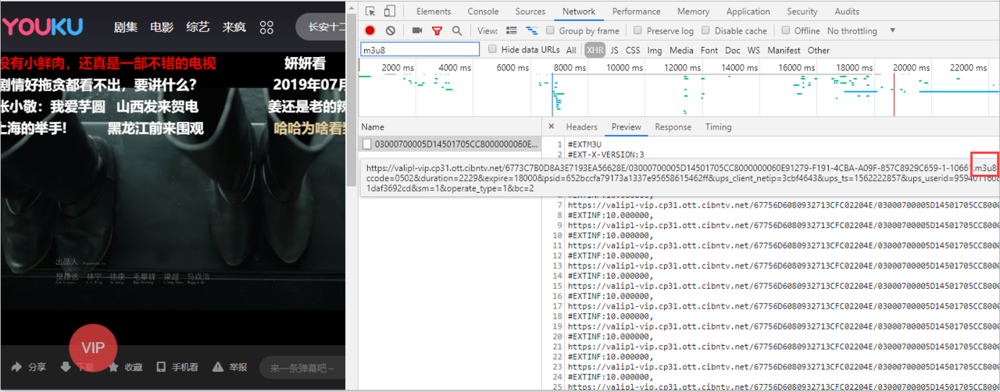
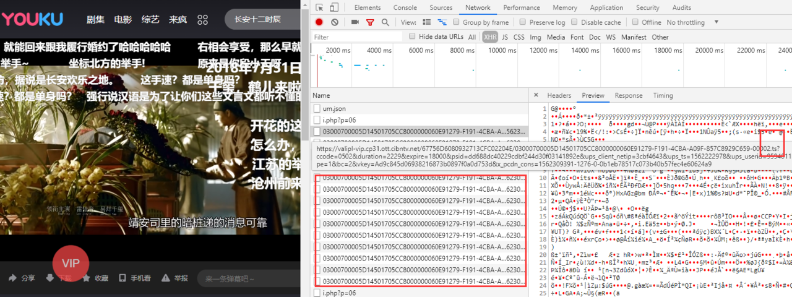
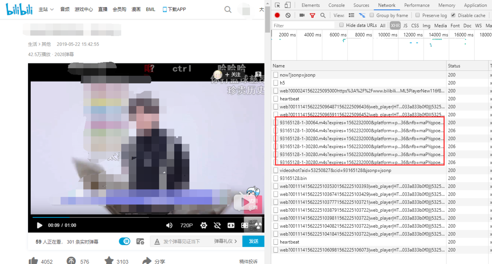

https://juejin.cn/post/6844903880774385671#comment


# 为什么视频网站的视频链接地址是blob？

自从HTML5提供了video标签，在网页中播放视频已经变成一个非常简单的事，只要一个video标签，src属性设置为视频的地址就完事了。由于src指向真实的视频网络地址，在早期一般网站资源文件不怎么通过referer设置防盗链，当我们拿到视频的地址后可以随意的下载或使用（每次放假回家，就会有亲戚找我帮忙从一些视频网站上下东西）。

> 目前的云存储服务商大部分都支持referer防盗链。其原理就是在访问资源时，请求头会带上发起请求的页面地址，判断其不存在（表示直接访问资源地址）或不在白名单内，即为盗链。

可是从某个时间开始我们打开调试工具去看各大视频网站的视频src会发现，它们统统变成了这样的形式。


拿b站的一个视频来看，红框中的视频地址，这个blob是个什么东西？。

其实这个Blob URL也不是什么新技术，国内外出来都有一阵子了，但是网上的相关的文章不多也不是很详细，今天就和大家一起分享学习一下。

## Blob和ArrayBuffer

最早是数据库直接用Blob来存储二进制数据对象，这样就不用关注存储数据的格式了。在web领域，Blob对象表示一个只读原始数据的类文件对象，虽然是二进制原始数据但是类似文件的对象，因此可以像操作文件对象一样操作Blob对象。

ArrayBuffer对象用来表示通用的、固定长度的原始二进制数据缓冲区。我们可以通过new ArrayBuffer(length)来获得一片连续的内存空间，它不能直接读写，但可根据需要将其传递到TypedArray视图或 DataView 对象来解释原始缓冲区。实际上视图只是给你提供了一个某种类型的读写接口，让你可以操作ArrayBuffer里的数据。TypedArray需指定一个数组类型来保证数组成员都是同一个数据类型，而DataView数组成员可以是不同的数据类型。

TypedArray视图的类型数组对象有以下几个:

- Int8Array：8位有符号整数，长度1个字节。
- Uint8Array：8位无符号整数，长度1个字节。
- Uint8ClampedArray：8位无符号整数，长度1个字节，溢出处理不同。
- Int16Array：16位有符号整数，长度2个字节。
- Uint16Array：16位无符号整数，长度2个字节。
- Int32Array：32位有符号整数，长度4个字节。
- Uint32Array：32位无符号整数，长度4个字节。
- Float32Array：32位浮点数，长度4个字节。
- Float64Array：64位浮点数，长度8个字节。

Blob与ArrayBuffer的区别是，除了原始字节以外它还提供了mime type作为元数据，Blob和ArrayBuffer之间可以进行转换。

> File对象其实继承自Blob对象，并提供了提供了name ， lastModifiedDate， size ，type 等基础元数据。

创建Blob对象并转换成ArrayBuffer：

```
//创建一个以二进制数据存储的html文件
const text = "<div>hello world</div>";
const blob = new Blob([text], { type: "text/html" }); // Blob {size: 22, type: "text/html"}
//以文本读取
const textReader = new FileReader();
textReader.readAsText(blob);
textReader.onload = function() {
  console.log(textReader.result); // <div>hello world</div>
};
//以ArrayBuffer形式读取
const bufReader = new FileReader();
bufReader.readAsArrayBuffer(blob);
bufReader.onload = function() {
  console.log(new Uint8Array(bufReader.result)); // Uint8Array(22) [60, 100, 105, 118, 62, 104, 101, 108, 108, 111, 32, 119, 111, 114, 108, 100, 60, 47, 100, 105, 118, 62]
};
复制代码
```

创建一个相同数据的ArrayBuffer，并转换成Blob：

```
//我们直接创建一个Uint8Array并填入上面的数据
const u8Buf = new Uint8Array([60, 100, 105, 118, 62, 104, 101, 108, 108, 111, 32, 119, 111, 114, 108, 100, 60, 47, 100, 105, 118, 62]);
const u8Blob = new Blob([u8Buf], { type: "text/html" }); // Blob {size: 22, type: "text/html"}
const textReader = new FileReader();

textReader.readAsText(u8Blob);
textReader.onload = function() {
  console.log(textReader.result); // 同样得到div>hello world</div>
};
复制代码
```

更多Blob和ArrayBuffer的相关内容可以参看下面的资料：

- [MDN Blob](https://developer.mozilla.org/zh-CN/docs/Web/API/Blob)
- [MDN ArrayBuffer](https://developer.mozilla.org/zh-CN/docs/Web/JavaScript/Reference/Global_Objects/ArrayBuffer)
- [阮一峰js标准参考教程二进制数组](http://javascript.ruanyifeng.com/stdlib/arraybuffer.html)

## URL.createObjectURL

video标签，audio标签还是img标签的src属性，不管是相对路径，绝对路径，或者一个网络地址，归根结底都是指向一个文件资源的地址。既然我们知道了Blob其实是一个可以当作文件用的二进制数据，那么只要我们可以生成一个指向Blob的地址，是不是就可以用在这些标签的src属性上，答案肯定是可以的，这里我们要用到的就是URL.createObjectURL()。

```
const objectURL = URL.createObjectURL(object); //blob:http://localhost:1234/abcedfgh-1234-1234-1234-abcdefghijkl
复制代码
```

这里的object参数是用于创建URL的File对象、Blob 对象或者 MediaSource 对象，生成的链接就是以blob:开头的一段地址，表示指向的是一个二进制数据。

其中localhost:1234是当前网页的主机名称和端口号，也就是location.host，而且这个Blob URL是可以直接访问的。需要注意的是，即使是同样的二进制数据，每调用一次URL.createObjectURL方法，就会得到一个不一样的Blob URL。这个URL的存在时间，等同于网页的存在时间，一旦网页刷新或卸载，这个Blob URL就失效。

通过URL.revokeObjectURL(objectURL) 可以释放 URL 对象。当你结束使用某个 URL 对象之后，应该通过调用这个方法来让浏览器知道不用在内存中继续保留对这个文件的引用了,允许平台在合适的时机进行垃圾收集。

> 如果是以文件协议打开的html文件（即url为file://开头），则地址中http://localhost:1234会变成null，而且此时这个Blob URL是无法直接访问的。

## 实战一：上传图片预览

有时我们通过input上传图片文件之前，会希望可以预览一下图片，这个时候就可以通过前面所学到的东西实现，而且非常简单。

html

```
<input id="upload" type="file" />

复制代码
```

javascript

```
const upload = document.querySelector("#upload");
const preview = document.querySelector("#preview");

upload.onchange = function() {
  const file = upload.files[0]; //File对象
  const src = URL.createObjectURL(file); 
  preview.src = src;
};
复制代码
```

这样一个图片上传预览就实现了，同样这个方法也适用于上传视频的预览。

## 实战二：以Blob URL加载网络视频

现在我们有一个网络视频的地址，怎么能将这个视频地址变成Blob URL是形式呢，思路肯定是先要拿到存储这个视频原始数据的Blob对象，但是不同于input上传可以直接拿到File对象，我们只有一个网络地址。

我们知道平时请求接口我们可以使用xhr（jquery里的ajax和axios就是封装的这个）或fetch，请求一个服务端地址可以返回我们相应的数据，那如果我们用xhr或者fetch去请求一个图片或视频地址会返回什么呢？当然是返回图片和视频的数据，只不过要设置正确responseType才能拿到我们想要的格式数据。

```
function ajax(url, cb) {
  const xhr = new XMLHttpRequest();
  xhr.open("get", url);
  xhr.responseType = "blob"; // "text"-字符串 "blob"-Blob对象 "arraybuffer"-ArrayBuffer对象
  xhr.onload = function() {
    cb(xhr.response);
  };
  xhr.send();
}
复制代码
```

> 注意XMLHttpRequest和Fetch API请求会有跨域问题，可以通过跨域资源共享(CORS)解决。

看到responseType可以设置blob和arraybuffer我们应该就有谱了，请求返回一个Blob对象，或者返回ArrayBuffer对象转换成Blob对象，然后通过createObjectURL生成地址赋值给视频的src属性就可以了,这里我们直接请求一个Blob对象。

```
ajax('video.mp4', function(res){
    const src = URL.createObjectURL(res); 
    video.src = src;
})
复制代码
```

用调试工具查看视频标签的src属性已经变成一个Blob URL，表面上看起来是不是和各大视频网站形式一致了，但是考虑一个问题，这种形式要等到请求完全部视频数据才能播放，小视频还好说，要是视频资源大一点岂不爆炸，显然各大视频网站不可能这么干。

解决这个问题的方法就是流媒体，其带给我们最直观体验就是使媒体文件可以边下边播（像我这样的90后男性最早体会到流媒体好处的应该是源于那款快子头的播放器），web端如果要使用流媒体，有多个流媒体协议可以供我们选择。

## HLS和MPEG DASH

HLS （HTTP Live Streaming）, 是由 Apple 公司实现的基于 HTTP 的媒体流传输协议。HLS以ts为传输格式，m3u8为索引文件（文件中包含了所要用到的ts文件名称，时长等信息，可以用播放器播放，也可以用vscode之类的编辑器打开查看），在移动端大部分浏览器都支持，也就是说你可以用video标签直接加载一个m3u8文件播放视频或者直播，但是在pc端，除了苹果的Safari，需要引入库来支持。

用到此方案的视频网站比如优酷，可以在视频播放时通过调试查看Network里的xhr请求，会发现一个m3u8文件，和每隔一段时间请求几个ts文件。








但是除了HLS，还有Adobe的HDS，微软的MSS，方案一多就要有个标准点的东西，于是就有了MPEG DASH。

DASH（Dynamic Adaptive Streaming over HTTP） ，是一种在互联网上传送动态码率的Video Streaming技术，类似于苹果的HLS，DASH会通过media presentation description (MPD)将视频内容切片成一个很短的文件片段，每个切片都有多个不同的码率，DASH Client可以根据网络的情况选择一个码率进行播放，支持在不同码率之间无缝切换。

Youtube，B站都是用的这个方案。这个方案索引文件通常是mpd文件（类似HLS的m3u8文件功能），传输格式推荐的是fmp4（Fragmented MP4）,文件扩展名通常为.m4s或直接用.mp4。所以用调试查看b站视频播放时的网络请求，会发现每隔一段时间有几个m4s文件请求。





不管是HLS还是DASH们，都有对应的库甚至是高级的播放器方便我们使用，但我们其实是想要学习一点实现。其实抛开掉索引文件的解析拿到实际媒体文件的传输地址，摆在我们面前的只有一个如何将多个视频数据合并让video标签可以无缝播放。

> 与之相关的一篇B站文章推荐给感兴趣的朋友：[我们为什么使用DASH](https://www.bilibili.com/read/cv855111/)

## MediaSource

video标签src指向一个视频地址，视频播完了再将src修改为下一段的视频地址然后播放，这显然不符合我们无缝播放的要求。其实有了我们前面Blob URL的学习，我们可能就会想到一个思路，用Blob URL指向一个视频二进制数据，然后不断将下一段视频的二进制数据添加拼接进去。这样就可以在不影响播放的情况下，不断的更新视频内容并播放下去，想想是不是有点流的意思出来了。

要实现这个功能我们要通过MediaSource来实现，MediaSource接口功能也很纯粹，作为一个媒体数据容器可以和HTMLMediaElement进行绑定。基本流程就是通过URL.createObjectURL创建容器的BLob URL，设置到video标签的src上，在播放过程中，我们仍然可以通过MediaSource.appendBuffer方法往容器里添加数据，达到更新视频内容的目的。

实现代码如下：

```
const video = document.querySelector('video');
//视频资源存放路径，假设下面有5个分段视频 video1.mp4 ~ video5.mp4，第一个段为初始化视频init.mp4
const assetURL = "http://www.demo.com";
//视频格式和编码信息，主要为判断浏览器是否支持视频格式，但如果信息和视频不符可能会报错
const mimeCodec = 'video/mp4; codecs="avc1.42E01E, mp4a.40.2"'; 
if ('MediaSource' in window && MediaSource.isTypeSupported(mimeCodec)) {
  const mediaSource = new MediaSource();
  video.src = URL.createObjectURL(mediaSource); //将video与MediaSource绑定，此处生成一个Blob URL
  mediaSource.addEventListener('sourceopen', sourceOpen); //可以理解为容器打开
} else {
  //浏览器不支持该视频格式
  console.error('Unsupported MIME type or codec: ', mimeCodec);
}

function sourceOpen () {
  const mediaSource = this;
  const sourceBuffer = mediaSource.addSourceBuffer(mimeCodec);
  let i = 1;
  function getNextVideo(url) {
    //ajax代码实现翻看上文，数据请求类型为arraybuffer
    ajax(url, function(buf) {
      //往容器中添加请求到的数据，不会影响当下的视频播放。
      sourceBuffer.appendBuffer(buf);
    });
  }
  //每次appendBuffer数据更新完之后就会触发
  sourceBuffer.addEventListener("updateend", function() {
    if (i === 1) {
      //第一个初始化视频加载完就开始播放
      video.play();
    }
    if (i < 6) {
      //一段视频加载完成后，请求下一段视频
      getNextVideo(`${assetURL}/video${i}.mp4`);
    }
    if (i === 6) {
      //全部视频片段加载完关闭容器
      mediaSource.endOfStream();
      URL.revokeObjectURL(video.src); //Blob URL已经使用并加载，不需要再次使用的话可以释放掉。
    }
    i++;
  });
  //加载初始视频
  getNextVideo(`${assetURL}/init.mp4`);
};

复制代码
```

这段代码修改自MDN的[MediaSource](https://developer.mozilla.org/zh-CN/docs/Web/API/MediaSource#Browser_compatibility)词条中的示例代码，原例子中只有加载一段视频，我修改为了多段视频，代码里面很多地方还可以优化精简，这里没做就当是为了方便我们看逻辑。

此时我们已经基本实现了一个简易的流媒体播放功能，如果愿意可以再加入m3u8或mpd文件的解析，设计一下UI界面，就可以实现一个流媒体播放器了。

最后提一下一个坑，很多人跑了MDN的MediaSource示例代码，可能会发现使用官方提供的视频是没问题的，但是用了自己的mp4视频就会报错，这是因为fmp4文件扩展名通常为.m4s或直接用.mp4，但却是特殊的mp4文件。

## Fragmented MP4

通常我们使用的mp4文件是嵌套结构的，客户端必须要从头加载一个 MP4 文件，才能够完整播放，不能从中间一段开始播放。而Fragmented MP4（简称fmp4），就如它的名字碎片mp4，是由一系列的片段组成，如果服务器支持 byte-range 请求，那么，这些片段可以独立的进行请求到客户端进行播放，而不需要加载整个文件。

我们可以通过这个网站判断一个mp4文件是否为Fragmented MP4，[网站地址](http://nickdesaulniers.github.io/mp4info/)。

我们通过[FFmpeg](https://ffmpeg.org/)或[Bento4](https://www.bento4.com/)的mp4fragment来将普通mp4转换为Fragmented MP4，两个工具都是命令行工具，按照各自系统下载下来对应的压缩包，解压后设置环境变量指向文件夹中的bin目录，就可以使用相关命令了。

Bento4的mp4fragment，没有太多参数，命令如下:

```
mp4fragment video.mp4 video-fragmented.mp4
复制代码
```

FFmpeg会需要设置一些参数，命令如下：

```
ffmpeg -i video.mp4 -movflags empty_moov+default_base_moof+frag_keyframe video-fragmented.mp4
复制代码
```

> Tips：网上大部分的资料中转换时是不带default_base_moof这个参数的，虽然可以转换成功，但是经测试如果不添加此参数网页中MediaSource处理视频时会报错。

视频的切割分段可以使用Bento4的mp4slipt，命令如下：

```
mp4split video.mp4 --media-segment video-%llu.mp4 --pattern-parameters N
复制代码
```

## 最后

之所以写这篇文章其实是之前公司有个需求要了解一下Blob URL，稍微看了一下，后来不了了之。这次忙里偷闲重拾起来把它搞清楚，一边学习一边记录，这篇文章中的很多点展开了其实有很多内容，希望大家看了这篇文章能够有所启发或引起兴趣，我的目的也就达到了，另外视频这方面的东西真的是有点深的，文章中如果有错误和疏漏也欢迎大家指出，我将及时修正。

文章备份仓库：[GITHUB地址](https://github.com/hoc2019/blog)

## 文章列表

- [从模块化到NPM私有仓库搭建](https://juejin.im/post/6844903798465363981)
- [十分钟实现灭霸打响指灰飞烟灭的效果](https://juejin.im/post/6844903840249020429)
- [是时候开发你自己的vscode扩展插件了](https://juejin.im/post/6844903845332516872)
- [Babel快速上手使用指南](https://juejin.im/post/6844903858632654856)
- [前端工作学习相关网站收集整理](https://juejin.im/post/6844903863795843085)
- [前端性能优化gzip初探（补充gzip压缩使用算法brotli压缩的相关介绍)](https://juejin.im/post/6844903887871148046)
- [[译\]成为一个优秀程序员的101个小建议](https://juejin.im/post/6844903890744246280)
- [【工作笔记】动态切换项目资源公共路径的实践](https://juejin.im/post/6844903904719667208)