# [玩转前端 Video 播放器](https://juejin.cn/post/6850037275579121671#heading-16)

Web 开发者们一直以来想在 Web 中使用音频和视频，但早些时候，传统的 Web 技术不能够在 Web 中嵌入音频和视频，所以一些像 Flash、Silverlight 的专利技术在处理这些内容上变得很受欢迎。

这些技术能够正常的工作，但是却有着一系列的问题，包括无法很好的支持 HTML/CSS 特性、安全问题，以及可行性问题。

幸运的是，当 HTML5 标准公布后，其中包含许多的新特性，包括 `<video>` 和 `<audio>` 标签，以及一些 JavaScript APIs 用于对其进行控制。随着通信技术和网络技术的不断发展，目前音视频已经成为大家生活中不可或缺的一部分。此外，伴随着 5G 技术的慢慢普及，实时音视频领域还会有更大的想象空间。

接下来本文将从八个方面入手，全方位带你一起探索前端 Video 播放器和主流的流媒体技术。阅读完本文，你将了解以下内容：

- 为什么一些网页中的 Video 元素，其视频源地址是采用 Blob URL 的形式；
- 什么是 HTTP Range 请求及流媒体技术相关概念；
- 了解 HLS、DASH 的概念、自适应比特率流技术及流媒体加密技术；
- 了解 FLV 文件结构、flv.js 的功能特性与使用限制及内部的工作原理；
- 了解 MSE（Media Source Extensions）API 及相关的使用；
- 了解视频播放器的原理、多媒体封装格式及 MP4 与 Fragmented MP4 封装格式的区别；

在最后的 **「阿宝哥有话说」** 环节，阿宝哥将介绍如何实现播放器截图、如何基于截图生成 GIF、如何使用 Canvas 播放视频及如何实现色度键控等功能。

阅读阿宝哥近期热门文章（感谢掘友的鼓励与支持🌹🌹🌹）：

- [[1.3万字\] 玩转前端二进制](https://juejin.im/post/6846687590783909902)（328+ 个👍）
- [在前端如何玩转 Word 文档](https://juejin.im/post/6850037262445445134)（225+ 个👍）
- [1.2W字 | 了不起的 TypeScript 入门教程](https://juejin.im/post/6844904182843965453)（1348+ 个👍）
- [让人眼前一亮的 10 大 TS 项目](https://juejin.im/post/6844904185838698503)（699+ 个👍）
- [一文读懂 TypeScript 泛型及应用（ 7.8K字）](https://juejin.im/post/6844904184894980104)（581+ 个👍）
- [图片处理不用愁，给你十个小帮手](https://juejin.im/post/6844904197675024391)（485+ 个👍）

### 一、传统的播放模式

大多数 Web 开发者对 `<video>` 都不会陌生，在以下 HTML 片段中，我们声明了一个 `<video>` 元素并设置相关的属性，然后通过 `<source>` 标签设置视频源和视频格式：

```
<video id="mse" autoplay=true playsinline controls="controls">
   <source src="https://h5player.bytedance.com/video/mp4/xgplayer-demo-720p.mp4" type="video/mp4">
   你的浏览器不支持Video标签
</video>
复制代码
```

上述代码在浏览器渲染之后，在页面中会显示一个 Video 视频播放器，具体如下图所示：

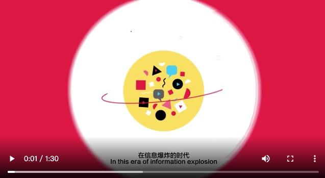

（图片来源：https://h5player.bytedance.com/examples/）

通过 Chrome 开发者工具，我们可以知道当播放 **「xgplayer-demo-720p.mp4」** 视频文件时，发了 3 个 HTTP 请求：

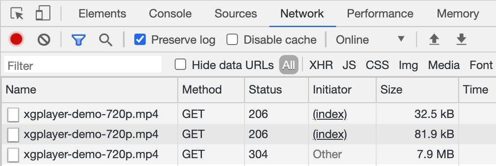

此外，从图中可以清楚地看到，头两个 HTTP 请求响应的状态码是 **「206」**。这里我们来分析第一个 HTTP 请求的请求头和响应头：

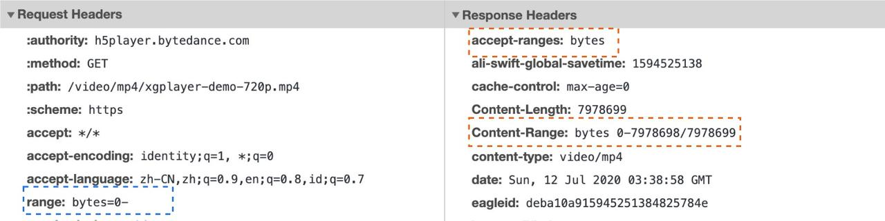

在上面的请求头中，有一个 `range: bytes=0-` 首部信息，该信息用于检测服务端是否支持 Range 请求。如果在响应中存在 `Accept-Ranges` 首部（并且它的值不为 “none”），那么表示该服务器支持范围请求。

在上面的响应头中， `Accept-Ranges: bytes` 表示界定范围的单位是 `bytes` 。这里 `Content-Length` 也是有效信息，因为它提供了要下载的视频的完整大小。

#### 1.1 从服务器端请求特定的范围

假如服务器支持范围请求的话，你可以使用 Range 首部来生成该类请求。该首部指示服务器应该返回文件的哪一或哪几部分。

##### 1.1.1 单一范围

我们可以请求资源的某一部分。这里我们使用 [Visual Studio Code](https://marketplace.visualstudio.com/vscode) 中的 [REST Client](https://marketplace.visualstudio.com/items?itemName=humao.rest-client) 扩展来进行测试，在这个例子中，我们使用 Range 首部来请求 [www.example.com](http://www.example.com)  首页的前 1024 个字节。

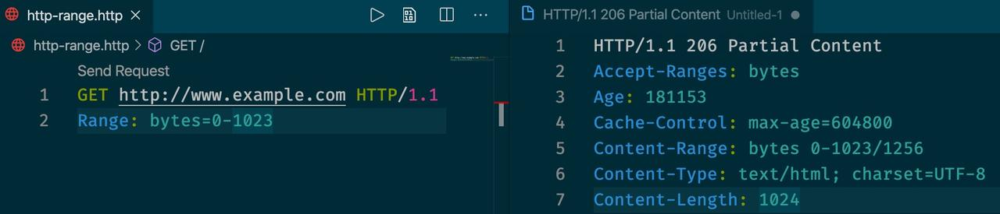

对于使用 [REST Client](https://marketplace.visualstudio.com/items?itemName=humao.rest-client) 发起的 **「单一范围请求」**，服务器端会返回状态码为 **「206 Partial Content」** 的响应。而响应头中的 **「Content-Length」** 首部现在用来表示先前请求范围的大小（而不是整个文件的大小）。**「Content-Range」** 响应首部则表示这一部分内容在整个资源中所处的位置。

##### 1.1.2 多重范围

Range 头部也支持一次请求文档的多个部分。请求范围用一个逗号分隔开。比如：

```
$ curl http://www.example.com -i -H "Range: bytes=0-50, 100-150"
复制代码
```

对于该请求会返回以下响应信息：

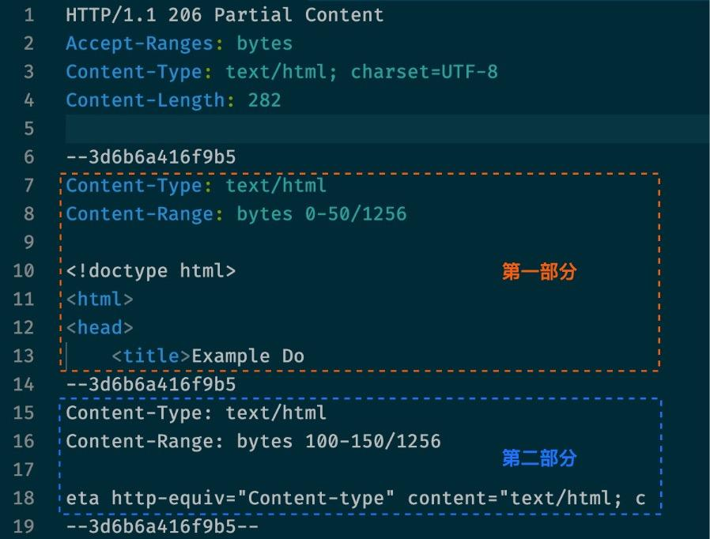

因为我们是请求文档的多个部分，所以每个部分都会拥有独立的 **「Content-Type」** 和 **「Content-Range」** 信息，并且使用 boundary 参数对响应体进行划分。

##### 1.1.3 条件式范围请求

当重新开始请求更多资源片段的时候，必须确保自从上一个片段被接收之后该资源没有进行过修改。

**「If-Range」** 请求首部可以用来生成条件式范围请求：假如条件满足的话，条件请求就会生效，服务器会返回状态码为 206 Partial 的响应，以及相应的消息主体。假如条件未能得到满足，那么就会返回状态码为 **「200 OK」** 的响应，同时返回整个资源。该首部可以与 **「Last-Modified」** 验证器或者 **「ETag」** 一起使用，但是二者不能同时使用。

##### 1.1.4 范围请求的响应

与范围请求相关的有三种状态：

- 在请求成功的情况下，服务器会返回 **「206 Partial Content」** 状态码。
- 在请求的范围越界的情况下（范围值超过了资源的大小），服务器会返回 **「416 Requested Range Not Satisfiable」** （请求的范围无法满足） 状态码。
- 在不支持范围请求的情况下，服务器会返回 **「200 OK」** 状态码。

剩余的两个请求，阿宝哥就不再详细分析了。感兴趣的小伙伴，可以使用 Chrome 开发者工具查看一下具体的请求报文。

通过第 3 个请求，我们可以知道整个视频的大小大约为 7.9 MB。若播放的视频文件太大或出现网络不稳定，则会导致播放时，需要等待较长的时间，这严重降低了用户体验。

那么如何解决这个问题呢？要解决该问题我们可以使用流媒体技术，接下来我们来介绍流媒体。

### 二、流媒体

流媒体是指将一连串的媒体数据压缩后，经过网上分段发送数据，在网上即时传输影音以供观赏的一种技术与过程，此技术使得数据包得以像流水一样发送；如果不使用此技术，就必须在使用前下载整个媒体文件。

流媒体实际指的是一种新的媒体传送方式，有声音流、视频流、文本流、图像流、动画流等，而非一种新的媒体。流媒体最主要的技术特征就是流式传输，它使得数据可以像流水一样传输。流式传输是指通过网络传送媒体技术的总称。实现流式传输主要有两种方式：顺序流式传输（Progressive Streaming）和实时流式传输（Real Time Streaming）。

目前网络上常见的流媒体协议：

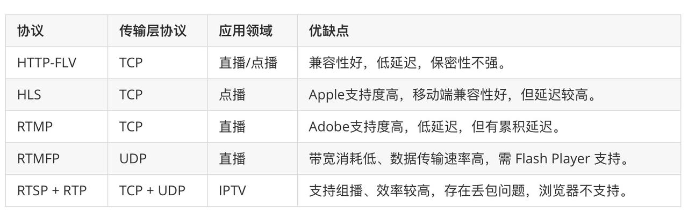

通过上表可知，不同的协议有着不同的优缺点。在实际使用过程中，我们通常会在平台兼容的条件下选用最优的流媒体传输协议。比如，在浏览器里做直播，选用 HTTP-FLV 协议是不错的，性能优于 RTMP+Flash，延迟可以做到和 RTMP+Flash 一样甚至更好。

而由于 HLS 延迟较大，一般只适合视频点播的场景，但由于它在移动端拥有较好的兼容性，所以在接受高延迟的条件下，也是可以应用在直播场景。

讲到这里相信有些小伙伴会好奇，对于  Video 元素来说使用流媒体技术之后与传统的播放模式有什么直观的区别。下面阿宝哥以常见的 HLS 流媒体协议为例，来简单对比一下它们之间的区别。

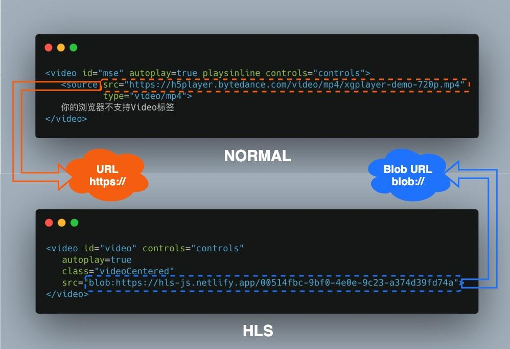

通过观察上图，我们可以很明显地看到，当使用 HLS 流媒体网络传输协议时，`<video>` 元素 `src` 属性使用的是 `blob://` 协议。讲到该协议，我们就不得不聊一下 Blob 与 Blob URL。

#### 2.1 Blob

Blob（Binary Large Object）表示二进制类型的大对象。在数据库管理系统中，将二进制数据存储为一个单一个体的集合。Blob 通常是影像、声音或多媒体文件。**「在 JavaScript 中 Blob 类型的对象表示不可变的类似文件对象的原始数据。」**

`Blob` 由一个可选的字符串 `type`（通常是 MIME 类型）和 `blobParts` 组成：

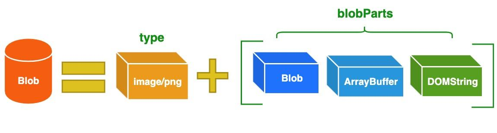

> ❝
>
> MIME（Multipurpose Internet Mail Extensions）多用途互联网邮件扩展类型，是设定某种扩展名的文件用一种应用程序来打开的方式类型，当该扩展名文件被访问的时候，浏览器会自动使用指定应用程序来打开。多用于指定一些客户端自定义的文件名，以及一些媒体文件打开方式。
>
> 常见的 MIME 类型有：超文本标记语言文本 .html text/html、PNG图像 .png image/png、普通文本 .txt text/plain 等。
>
> ❞

为了更直观的感受 Blob 对象，我们先来使用 Blob 构造函数，创建一个 myBlob 对象，具体如下图所示：

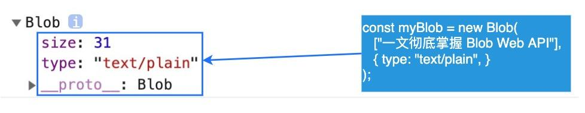

如你所见，myBlob 对象含有两个属性：size 和 type。其中 `size` 属性用于表示数据的大小（以字节为单位），`type` 是 MIME 类型的字符串。Blob 表示的不一定是 JavaScript 原生格式的数据。比如 `File` 接口基于 `Blob`，继承了 blob 的功能并将其扩展使其支持用户系统上的文件。

#### 2.2 Blob URL/Object URL

Blob URL/Object URL 是一种伪协议，允许 Blob 和 File 对象用作图像，下载二进制数据链接等的 URL 源。在浏览器中，我们使用 `URL.createObjectURL` 方法来创建 Blob URL，该方法接收一个 `Blob` 对象，并为其创建一个唯一的 URL，其形式为 `blob:<origin>/<uuid>`，对应的示例如下：

```
blob:https://example.org/40a5fb5a-d56d-4a33-b4e2-0acf6a8e5f641
复制代码
```

浏览器内部为每个通过 `URL.createObjectURL` 生成的 URL 存储了一个 URL → Blob 映射。因此，此类 URL 较短，但可以访问 `Blob`。生成的 URL 仅在当前文档打开的状态下才有效。但如果你访问的 Blob URL 不再存在，则会从浏览器中收到 404 错误。

上述的 Blob URL 看似很不错，但实际上它也有副作用。虽然存储了 URL → Blob 的映射，但 Blob 本身仍驻留在内存中，浏览器无法释放它。映射在文档卸载时自动清除，因此 Blob 对象随后被释放。但是，如果应用程序寿命很长，那不会很快发生。因此，如果我们创建一个 Blob URL，即使不再需要该 Blob，它也会存在内存中。

针对这个问题，我们可以调用 `URL.revokeObjectURL(url)` 方法，从内部映射中删除引用，从而允许删除 Blob（如果没有其他引用），并释放内存。

#### 2.3 Blob vs ArrayBuffer

其实在前端除了 **「Blob 对象」** 之外，你还可能会遇到 **「ArrayBuffer 对象」**。它用于表示通用的，固定长度的原始二进制数据缓冲区。你不能直接操纵 ArrayBuffer 的内容，而是需要创建一个 TypedArray 对象或 DataView 对象，该对象以特定格式表示缓冲区，并使用该对象读取和写入缓冲区的内容。

Blob 对象与 ArrayBuffer 对象拥有各自的特点，它们之间的区别如下：

- 除非你需要使用 ArrayBuffer 提供的写入/编辑的能力，否则 Blob 格式可能是最好的。
- Blob 对象是不可变的，而 ArrayBuffer 是可以通过 TypedArrays 或 DataView 来操作。
- ArrayBuffer 是存在内存中的，可以直接操作。而 Blob 可以位于磁盘、高速缓存内存和其他不可用的位置。
- 虽然 Blob 可以直接作为参数传递给其他函数，比如 `window.URL.createObjectURL()`。但是，你可能仍需要 FileReader 之类的 File API 才能与 Blob 一起使用。
- Blob 与 ArrayBuffer 对象之间是可以相互转化的：
  - 使用 FileReader 的 `readAsArrayBuffer()` 方法，可以把 Blob 对象转换为 ArrayBuffer 对象；
  - 使用 Blob 构造函数，如 `new Blob([new Uint8Array(data]);`，可以把 ArrayBuffer 对象转换为 Blob 对象。

在前端 AJAX 场景下，除了常见的 JSON 格式之外，我们也可能会用到 Blob 或 ArrayBuffer 对象：

```
function GET(url, callback) {
  let xhr = new XMLHttpRequest();
  xhr.open('GET', url, true);
  xhr.responseType = 'arraybuffer'; // or xhr.responseType = "blob";
  xhr.send();

  xhr.onload = function(e) {
    if (xhr.status != 200) {
      alert("Unexpected status code " + xhr.status + " for " + url);
      return false;
    }
    callback(new Uint8Array(xhr.response)); // or new Blob([xhr.response]);
  };
}
复制代码
```

在以上示例中，通过为 xhr.responseType 设置不同的数据类型，我们就可以根据实际需要获取对应类型的数据了。介绍完上述内容，下面我们先来介绍目前应用比较广泛的 HLS 流媒体传输协议。

### 三、HLS

#### 3.1 HLS 简介

HTTP Live Streaming（缩写是 HLS）是由苹果公司提出基于 HTTP 的流媒体网络传输协议，它是苹果公司 QuickTime X 和 iPhone 软件系统的一部分。它的工作原理是把整个流分成一个个小的基于 HTTP 的文件来下载，每次只下载一些。当媒体流正在播放时，客户端可以选择从许多不同的备用源中以不同的速率下载同样的资源，允许流媒体会话适应不同的数据速率。

此外，当用户的信号强度发生抖动时，视频流会动态调整以提供出色的再现效果。

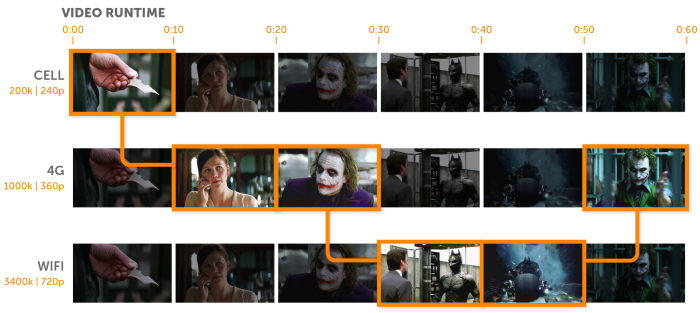

（图片来源：https://www.wowza.com/blog/hls-streaming-protocol）

最初， 仅 iOS 支持 HLS。但现在 HLS 已成为专有格式，几乎所有设备都支持它。顾名思义，HLS（HTTP Live Streaming）协议通过标准的 HTTP Web 服务器传送视频内容。这意味着你无需集成任何特殊的基础架构即可分发 HLS 内容。

HLS 拥有以下特性：

- HLS 将播放使用 H.264 或 HEVC / H.265 编解码器编码的视频。
- HLS 将播放使用 AAC 或 MP3 编解码器编码的音频。
- HLS 视频流一般被切成 10 秒的片段。
- HLS 的传输/封装格式是 MPEG-2 TS。
- HLS 支持 DRM（数字版权管理）。
- HLS 支持各种广告标准，例如 VAST 和 VPAID。

为什么苹果要提出 HLS 这个协议，其实它的主要是为了解决 RTMP 协议存在的一些问题。比如 RTMP 协议不使用标准的 HTTP 接口传输数据，所以在一些特殊的网络环境下可能被防火墙屏蔽掉。但是 HLS 由于使用的 HTTP 协议传输数据，通常情况下不会遇到被防火墙屏蔽的情况。除此之外，它也很容易通过 CDN（内容分发网络）来传输媒体流。

#### 3.2 HLS 自适应比特流

HLS 是一种自适应比特率流协议。因此，HLS 流可以动态地使视频分辨率自适应每个人的网络状况。如果你正在使用高速 WiFi，则可以在手机上流式传输高清视频。但是，如果你在有限数据连接的公共汽车或地铁上，则可以以较低的分辨率观看相同的视频。

在开始一个流媒体会话时，客户端会下载一个包含元数据的 Extended M3U（m3u8）Playlist 文件，用于寻找可用的媒体流。

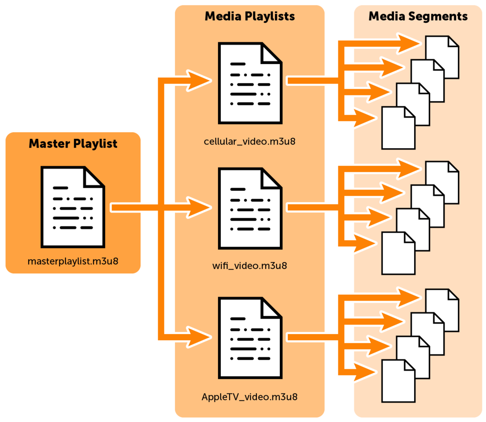

（图片来源：https://www.wowza.com/blog/hls-streaming-protocol）

为了便于大家的理解，我们使用 [hls.js](https://github.com/video-dev/hls.js) 这个 JavaScript 实现的 HLS 客户端，所提供的 [在线示例](https://hls-js.netlify.app/demo/)，来看一下具体的 m3u8 文件。

**「[x36xhzz.m3u8](https://test-streams.mux.dev/x36xhzz/)」**

```
#EXTM3U
#EXT-X-STREAM-INF:PROGRAM-ID=1,BANDWIDTH=2149280,CODECS="mp4a.40.2,avc1.64001f",RESOLUTION=1280x720,NAME="720"
url_0/193039199_mp4_h264_aac_hd_7.m3u8
#EXT-X-STREAM-INF:PROGRAM-ID=1,BANDWIDTH=246440,CODECS="mp4a.40.5,avc1.42000d",RESOLUTION=320x184,NAME="240"
url_2/193039199_mp4_h264_aac_ld_7.m3u8
#EXT-X-STREAM-INF:PROGRAM-ID=1,BANDWIDTH=460560,CODECS="mp4a.40.5,avc1.420016",RESOLUTION=512x288,NAME="380"
url_4/193039199_mp4_h264_aac_7.m3u8
#EXT-X-STREAM-INF:PROGRAM-ID=1,BANDWIDTH=836280,CODECS="mp4a.40.2,avc1.64001f",RESOLUTION=848x480,NAME="480"
url_6/193039199_mp4_h264_aac_hq_7.m3u8
#EXT-X-STREAM-INF:PROGRAM-ID=1,BANDWIDTH=6221600,CODECS="mp4a.40.2,avc1.640028",RESOLUTION=1920x1080,NAME="1080"
url_8/193039199_mp4_h264_aac_fhd_7.m3u8
复制代码
```

通过观察 Master Playlist 对应的 m3u8 文件，我们可以知道该视频支持以下 5 种不同清晰度的视频：

- 1920x1080（1080P）
- 1280x720（720P）
- 848x480（480P）
- 512x288
- 320x184

而不同清晰度视频对应的媒体播放列表，会定义在各自的 m3u8 文件中。这里我们以 720P 的视频为例，来查看其对应的 m3u8 文件：

```
#EXTM3U
#EXT-X-VERSION:3
#EXT-X-PLAYLIST-TYPE:VOD
#EXT-X-TARGETDURATION:11
#EXTINF:10.000,
url_462/193039199_mp4_h264_aac_hd_7.ts
#EXTINF:10.000,
url_463/193039199_mp4_h264_aac_hd_7.ts
#EXTINF:10.000,
url_464/193039199_mp4_h264_aac_hd_7.ts
#EXTINF:10.000,
...
url_525/193039199_mp4_h264_aac_hd_7.ts
#EXT-X-ENDLIST
复制代码
```

当用户选定某种清晰度的视频之后，将会下载该清晰度对应的媒体播放列表（m3u8 文件），该列表中就会列出每个片段的信息。HLS 的传输/封装格式是 MPEG-2 TS（MPEG-2 Transport Stream），是一种传输和存储包含视频、音频与通信协议各种数据的标准格式，用于数字电视广播系统，如 DVB、ATSC、IPTV 等等。

**「需要注意的是利用一些现成的工具，我们是可以把多个 TS 文件合并为 mp4 格式的视频文件。」** 如果要做视频版权保护，那我们可以考虑使用对称加密算法，比如 AES-128 对切片进行对称加密。当客户端进行播放时，先根据 m3u8 文件中配置的密钥服务器地址，获取对称加密的密钥，然后再下载分片，当分片下载完成后再使用匹配的对称加密算法进行解密播放。

对上述过程感兴趣的小伙伴可以参考 Github 上 [video-hls-encrypt](https://github.com/hauk0101/video-hls-encrypt) 这个项目，该项目深入浅出介绍了基于 HLS 流媒体协议视频加密的解决方案并提供了完整的示例代码。

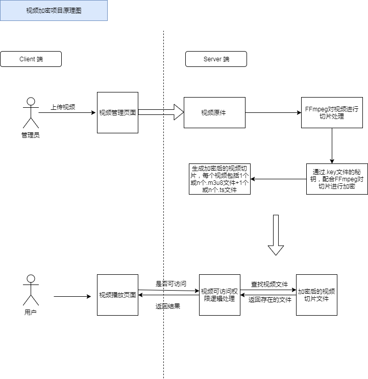

（图片来源：https://github.com/hauk0101/video-hls-encrypt）

介绍完苹果公司推出的 HLS （HTTP Live Streaming）技术，接下来我们来介绍另一种基于 HTTP 的动态自适应流 —— DASH。

### 四、DASH

#### 4.1 DASH 简介

**「基于 HTTP 的动态自适应流（英语：Dynamic Adaptive Streaming over HTTP，缩写 DASH，也称 MPEG-DASH）是一种自适应比特率流技术，使高质量流媒体可以通过传统的 HTTP 网络服务器以互联网传递。」** 类似苹果公司的 HTTP Live Streaming（HLS）方案，MPEG-DASH 会将内容分解成一系列小型的基于 HTTP 的文件片段，每个片段包含很短长度的可播放内容，而内容总长度可能长达数小时。

内容将被制成多种比特率的备选片段，以提供多种比特率的版本供选用。当内容被 MPEG-DASH 客户端回放时，客户端将根据当前网络条件自动选择下载和播放哪一个备选方案。客户端将选择可及时下载的最高比特率片段进行播放，从而避免播放卡顿或重新缓冲事件。也因如此，MPEG-DASH 客户端可以无缝适应不断变化的网络条件并提供高质量的播放体验，拥有更少的卡顿与重新缓冲发生率。

MPEG-DASH 是首个基于 HTTP 的自适应比特率流解决方案，它也是一项国际标准。MPEG-DASH 不应该与传输协议混淆 —— MPEG-DASH 使用 TCP 传输协议。**「不同于 HLS、HDS 和 Smooth Streaming，DASH 不关心编解码器，因此它可以接受任何编码格式编码的内容，如 H.265、H.264、VP9 等。」**

虽然 HTML5 不直接支持 MPEG-DASH，但是已有一些 MPEG-DASH 的 JavaScript 实现允许在网页浏览器中通过 HTML5 Media Source Extensions（MSE）使用 MPEG-DASH。另有其他 JavaScript 实现，如 bitdash 播放器支持使用 HTML5 加密媒体扩展播放有 DRM 的MPEG-DASH。当与 WebGL 结合使用，MPEG-DASH 基于 HTML5 的自适应比特率流还可实现 360° 视频的实时和按需的高效流式传输。

#### 4.2 DASH 重要概念

- MPD：媒体文件的描述文件（manifest），作用类似 HLS 的 m3u8 文件。
- Representation：对应一个可选择的输出（alternative）。如 480p 视频，720p 视频，44100 采样音频等都使用 Representation 描述。
- Segment（分片）：每个 Representation 会划分为多个 Segment。Segment 分为 4 类，其中，最重要的是：Initialization Segment（每个 Representation 都包含 1 个 Init Segment），Media Segment（每个 Representation 的媒体内容包含若干 Media Segment）。

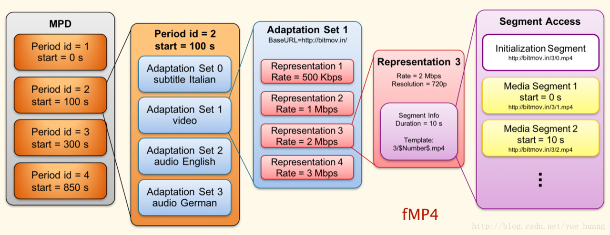

（图片来源：https://blog.csdn.net/yue_huang/article/details/78466537）

在国内 [Bilibili](https://www.bilibili.com/) 于 2018 年开始使用 DASH 技术，至于为什么选择 DASH 技术。感兴趣的小伙伴可以阅读 [我们为什么使用DASH](https://www.bilibili.com/read/cv855111) 这篇文章。

讲了那么多，相信有些小伙伴会好奇 MPD 文件长什么样？这里我们来看一下西瓜视频播放器 DASH 示例中的 [MPD](https://h5player.bytedance.com/video/dash/xgplayer-demo_dash.mpd) 文件：

```
<?xml version="1.0"?>
<!-- MPD file Generated with GPAC version 0.7.2-DEV-rev559-g61a50f45-master  at 2018-06-11T11:40:23.972Z-->
<MPD xmlns="urn:mpeg:dash:schema:mpd:2011" minBufferTime="PT1.500S" type="static" mediaPresentationDuration="PT0H1M30.080S" maxSegmentDuration="PT0H0M1.000S" profiles="urn:mpeg:dash:profile:full:2011">
 <ProgramInformation moreInformationURL="http://gpac.io">
  <Title>xgplayer-demo_dash.mpd generated by GPAC</Title>
 </ProgramInformation>

 <Period duration="PT0H1M30.080S">
  <AdaptationSet segmentAlignment="true" maxWidth="1280" maxHeight="720" maxFrameRate="25" par="16:9" lang="eng">
   <ContentComponent id="1" contentType="audio" />
   <ContentComponent id="2" contentType="video" />
   <Representation id="1" mimeType="video/mp4" codecs="mp4a.40.2,avc3.4D4020" width="1280" height="720" frameRate="25" sar="1:1" startWithSAP="0" bandwidth="6046495">
    <AudioChannelConfiguration schemeIdUri="urn:mpeg:dash:23003:3:audio_channel_configuration:2011" value="2"/>
    <BaseURL>xgplayer-demo_dashinit.mp4</BaseURL>
    <SegmentList timescale="1000" duration="1000">
     <Initialization range="0-1256"/>
      <SegmentURL mediaRange="1257-1006330" indexRange="1257-1300"/>
      <SegmentURL mediaRange="1006331-1909476" indexRange="1006331-1006374"/>
      ...
      <SegmentURL mediaRange="68082016-68083543" indexRange="68082016-68082059"/>
    </SegmentList>
   </Representation>
  </AdaptationSet>
 </Period>
</MPD>
复制代码
```

（文件来源：https://h5player.bytedance.com/examples/）

在播放视频时，西瓜视频播放器会根据 MPD 文件，自动请求对应的分片进行播放。

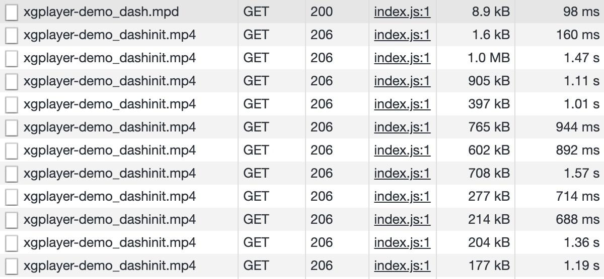

前面我们已经提到了 [Bilibili](https://www.bilibili.com/)，接下来不得不提其开源的一个著名的开源项目 —— [flv.js](https://github.com/Bilibili/flv.js/)，不过在介绍它之前我们需要来了解一下 FLV 流媒体格式。

### 五、FLV

#### 5.1 FLV 文件结构

FLV 是 FLASH Video 的简称，FLV 流媒体格式是随着 Flash MX 的推出发展而来的视频格式。由于它形成的文件极小、加载速度极快，使得网络观看视频文件成为可能，它的出现有效地解决了视频文件导入 Flash 后，使导出的 SWF 文件体积庞大，不能在网络上很好的使用等问题。

FLV 文件由 FLV Header 和 FLV Body 两部分构成，而 FLV Body 由一系列的 Tag 构成：

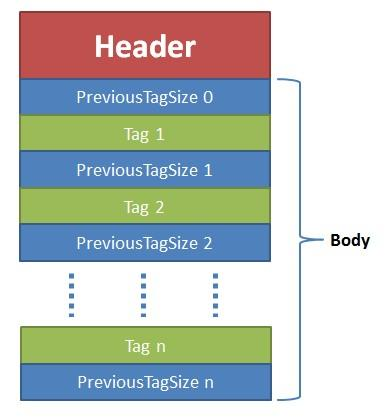

##### 5.1.1 FLV 头文件

FLV 头文件：（9 字节）

- 1-3：前 3 个字节是文件格式标识（FLV 0x46 0x4C 0x56）。
- 4-4：第 4 个字节是版本（0x01）。
- 5-5：第 5 个字节的前 5 个 bit 是保留的必须是 0。
  - 第 5 个字节的第 6 个 bit 音频类型标志（TypeFlagsAudio）。
  - 第 5 个字节的第 7 个 bit 也是保留的必须是 0。
  - 第5个字节的第8个bit视频类型标志（TypeFlagsVideo）。
- 6-9: 第 6-9 的四个字节还是保留的，其数据为 00000009。
- 整个文件头的长度，一般是 9（3+1+1+4）。

##### 5.1.2 tag 基本格式

tag 类型信息，固定长度为 15 字节：

- 1-4：前一个 tag 长度（4字节），第一个 tag 就是 0。
- 5-5：tag 类型（1 字节）；0x8 音频；0x9 视频；0x12 脚本数据。
- 6-8：tag 内容大小（3 字节）。
- 9-11：时间戳（3 字节，毫秒）（第 1 个 tag 的时候总是为 0，如果是脚本 tag 就是 0）。
- 12-12：时间戳扩展（1 字节）让时间戳变成 4 字节（以存储更长时间的 flv 时间信息），本字节作为时间戳的最高位。

在 flv 回放过程中，播放顺序是按照 tag 的时间戳顺序播放。任何加入到文件中时间设置数据格式都将被忽略。

- 13-15：streamID（3 字节）总是 0。

FLV 格式详细的结构图如下图所示：

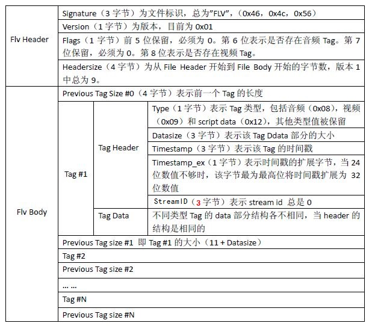

在浏览器中 HTML5 的 `<video>` 是不支持直接播放 FLV 视频格式，需要借助 [flv.js](https://github.com/Bilibili/flv.js/) 这个开源库来实现播放 FLV 视频格式的功能。

#### 5.2 flv.js 简介

[flv.js](https://github.com/Bilibili/flv.js/) 是用纯 JavaScript 编写的 HTML5 Flash Video（FLV）播放器，它底层依赖于 [Media Source Extensions](https://w3c.github.io/media-source/)。在实际运行过程中，它会自动解析 FLV 格式文件并喂给原生 HTML5 Video 标签播放音视频数据，使浏览器在不借助 Flash 的情况下播放 FLV 成为可能。

##### 5.2.1 flv.js 的特性

- 支持播放 H.264 + AAC / MP3 编码的 FLV 文件；
- 支持播放多段分段视频；
- 支持播放 HTTP FLV 低延迟实时流；
- 支持播放基于 WebSocket 传输的 FLV 实时流；
- 兼容 Chrome，FireFox，Safari 10，IE11 和 Edge；
- 极低的开销，支持浏览器的硬件加速。

##### 5.2.2 flv.js 的限制

- MP3 音频编解码器无法在 IE11/Edge 上运行；
- HTTP FLV 直播流不支持所有的浏览器。

##### 5.2.3 flv.js 的使用

```
<script src="flv.min.js"></script>
<video id="videoElement"></video>
<script>
    if (flvjs.isSupported()) {
        var videoElement = document.getElementById('videoElement');
        var flvPlayer = flvjs.createPlayer({
            type: 'flv',
            url: 'http://example.com/flv/video.flv'
        });
        flvPlayer.attachMediaElement(videoElement);
        flvPlayer.load();
        flvPlayer.play();
    }
</script>
复制代码
```

#### 5.3 flv.js 工作原理

flv.js 的工作原理是将 FLV 文件流转换为 ISO BMFF（Fragmented MP4）片段，然后通过 Media Source Extensions API 将 mp4 段喂给 HTML5 `<video>` 元素。flv.js 的设计架构图如下图所示：

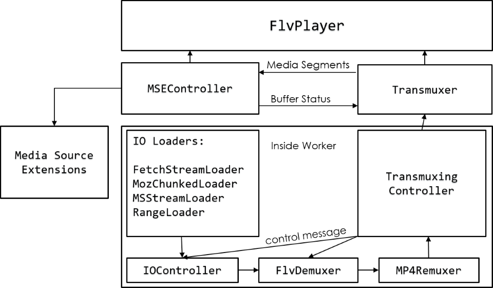

（图片来源：https://github.com/bilibili/flv.js/blob/master/docs/design.md）

有关 [flv.js](https://github.com/Bilibili/flv.js/) 工作原理更详细的介绍，感兴趣的小伙们可以阅读 [花椒开源项目实时互动流媒体播放器](https://juejin.im/post/6844904019379372040) 这篇文章。现在我们已经介绍了 [hls.js](https://github.com/video-dev/hls.js) 和 [flv.js](https://github.com/bilibili/flv.js) 这两个主流的流媒体解决方案，其实它们的成功离不开 Media Source Extensions 这个幕后英雄默默地支持。因此，接下来阿宝哥将带大家一起认识一下 MSE（Media Source Extensions）。

### 六、MSE

#### 6.1 MSE API

媒体源扩展 API（Media Source Extensions） 提供了实现无插件且基于 Web 的流媒体的功能。使用 MSE，媒体串流能够通过 JavaScript 创建，并且能通过使用 `audio` 和 `video` 元素进行播放。

近几年来，我们已经可以在 Web 应用程序上无插件地播放视频和音频了。但是，现有架构过于简单，只能满足一次播放整个曲目的需要，无法实现拆分/合并数个缓冲文件。早期的流媒体主要使用 Flash 进行服务，以及通过 RTMP 协议进行视频串流的 Flash 媒体服务器。

媒体源扩展（MSE）实现后，情况就不一样了。MSE 使我们可以把通常的单个媒体文件的 `src` 值替换成引用 `MediaSource` 对象（一个包含即将播放的媒体文件的准备状态等信息的容器），以及引用多个 `SourceBuffer` 对象（代表多个组成整个串流的不同媒体块）的元素。

为了便于大家理解，我们来看一下基础的 MSE 数据流：

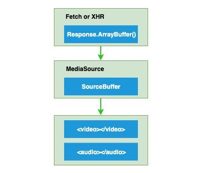

MSE 让我们能够根据内容获取的大小和频率，或是内存占用详情（例如什么时候缓存被回收），进行更加精准地控制。 它是基于它可扩展的 API 建立自适应比特率流客户端（例如 DASH 或 HLS 的客户端）的基础。

在现代浏览器中创造能兼容 MSE 的媒体非常费时费力，还要消耗大量计算机资源和能源。此外，还须使用外部实用程序将内容转换成合适的格式。虽然浏览器支持兼容 MSE 的各种媒体容器，但采用 H.264 视频编码、AAC 音频编码和 MP4 容器的格式是非常常见的，所以 MSE 需要兼容这些主流的格式。此外 MSE 还为开发者提供了一个 API，用于运行时检测容器和编解码是否受支持。

#### 6.2 MediaSource 接口

MediaSource 是 Media Source Extensions API 表示媒体资源 HTMLMediaElement 对象的接口。MediaSource 对象可以附着在 HTMLMediaElement 在客户端进行播放。在介绍 MediaSource 接口前，我们先来看一下它的结构图：

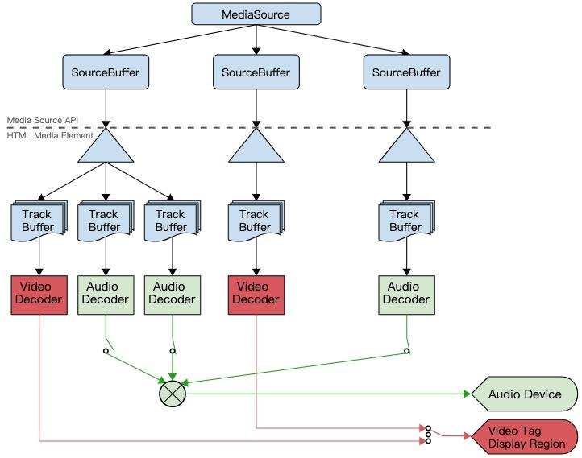

（图片来源 —— https://www.w3.org/TR/media-source/）

要理解 MediaSource 的结构图，我们得先来介绍一下客户端音视频播放器播放一个视频流的主要流程：

获取流媒体 -> 解协议 -> 解封装 -> 音、视频解码 -> 音频播放及视频渲染（需处理音视频同步）。

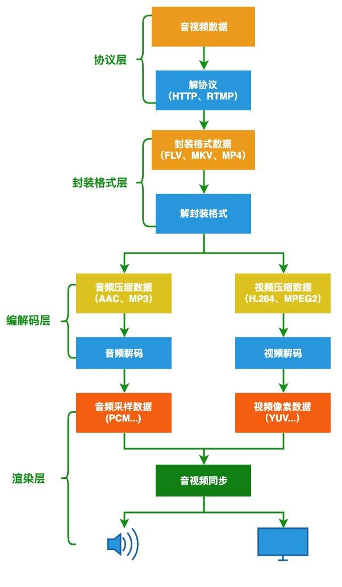

由于采集的原始音视频数据比较大，为了方便网络传输，我们通常会使用编码器，如常见的 H.264 或 AAC 来压缩原始媒体信号。最常见的媒体信号是视频，音频和字幕。比如，日常生活中的电影，就是由不同的媒体信号组成，除运动图片外，大多数电影还含有音频和字幕。

常见的视频编解码器有：H.264，HEVC，VP9 和 AV1。而音频编解码器有：AAC，MP3 或 Opus。每个媒体信号都有许多不同的编解码器。下面我们以西瓜视频播放器的 Demo 为例，来直观感受一下音频轨、视频轨和字幕轨：

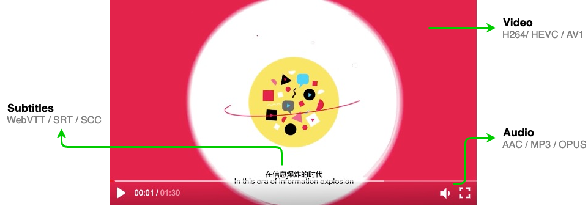

现在我们来开始介绍 MediaSource 接口的相关内容。

##### 6.2.1 状态

```
enum ReadyState {
    "closed", // 指示当前源未附加到媒体元素。
    "open", // 源已经被媒体元素打开，数据即将被添加到SourceBuffer对象中
    "ended" // 源仍附加到媒体元素，但endOfStream()已被调用。
};
复制代码
```

##### 6.2.2 流终止异常

```
enum EndOfStreamError {
    "network", // 终止播放并发出网络错误信号。
    "decode" // 终止播放并发出解码错误信号。
};
复制代码
```

##### 6.2.3 构造器

```
[Constructor]
interface MediaSource : EventTarget {
    readonly attribute SourceBufferList    sourceBuffers;
    readonly attribute SourceBufferList    activeSourceBuffers;
    readonly attribute ReadyState          readyState;
             attribute unrestricted double duration;
             attribute EventHandler        onsourceopen;
             attribute EventHandler        onsourceended;
             attribute EventHandler        onsourceclose;
  
    SourceBuffer addSourceBuffer(DOMString type);
    void         removeSourceBuffer(SourceBuffer sourceBuffer);
    void         endOfStream(optional EndOfStreamError error);
    void         setLiveSeekableRange(double start, double end);
    void         clearLiveSeekableRange();
    static boolean isTypeSupported(DOMString type);
};
复制代码
```

##### 6.2.4 属性

- `MediaSource.sourceBuffers` —— 只读：返回一个 SourceBufferList 对象，包含了这个 MediaSource 的SourceBuffer 的对象列表。
- `MediaSource.activeSourceBuffers` —— 只读：返回一个 SourceBufferList 对象，包含了这个MediaSource.sourceBuffers 中的 SourceBuffer 子集的对象—即提供当前被选中的视频轨（video track），启用的音频轨（audio tracks）以及显示/隐藏的字幕轨（text tracks）的对象列表
- `MediaSource.readyState` —— 只读：返回一个包含当前 MediaSource 状态的集合，即使它当前没有附着到一个 media 元素（closed），或者已附着并准备接收 SourceBuffer 对象（open），亦或者已附着但这个流已被 MediaSource.endOfStream() 关闭。
- `MediaSource.duration`：获取和设置当前正在推流媒体的持续时间。
- `onsourceopen`：设置 sourceopen 事件对应的事件处理程序。
- `onsourceended`：设置 sourceended 事件对应的事件处理程序。
- `onsourceclose`：设置 sourceclose 事件对应的事件处理程序。

##### 6.2.5 方法

- `MediaSource.addSourceBuffer()`：创建一个带有给定 MIME 类型的新的 SourceBuffer 并添加到 MediaSource 的 SourceBuffers 列表。
- `MediaSource.removeSourceBuffer()`：删除指定的 SourceBuffer 从这个 MediaSource 对象中的 SourceBuffers 列表。
- `MediaSource.endOfStream()`：表示流的结束。

##### 6.2.6 静态方法

- `MediaSource.isTypeSupported()`：返回一个 Boolean 值表明给定的 MIME 类型是否被当前的浏览器支持—— 这意味着是否可以成功的创建这个 MIME 类型的 SourceBuffer 对象。

##### 6.2.7 使用示例

```
var vidElement = document.querySelector('video');

if (window.MediaSource) { // (1)
  var mediaSource = new MediaSource();
  vidElement.src = URL.createObjectURL(mediaSource);
  mediaSource.addEventListener('sourceopen', sourceOpen); 
} else {
  console.log("The Media Source Extensions API is not supported.")
}

function sourceOpen(e) {
  URL.revokeObjectURL(vidElement.src);
  var mime = 'video/mp4; codecs="avc1.42E01E, mp4a.40.2"';
  var mediaSource = e.target;
  var sourceBuffer = mediaSource.addSourceBuffer(mime); // (2)
  var videoUrl = 'hello-mse.mp4';
  fetch(videoUrl) // (3)
    .then(function(response) {
      return response.arrayBuffer();
    })
    .then(function(arrayBuffer) {
      sourceBuffer.addEventListener('updateend', function(e) { (4)
        if (!sourceBuffer.updating && mediaSource.readyState === 'open') {
          mediaSource.endOfStream(); 
        }
      });
      sourceBuffer.appendBuffer(arrayBuffer); // (5)
    });
}
复制代码
```

以上示例介绍了如何使用 MSE API，接下来我们来分析一下主要的工作流程：

- (1) 判断当前平台是否支持 Media Source Extensions API，若支持的话，则创建 MediaSource 对象，且绑定 sourceopen 事件处理函数。
- (2) 创建一个带有给定 MIME 类型的新的 SourceBuffer 并添加到 MediaSource 的 SourceBuffers 列表。
- (3) 从远程流服务器下载视频流，并转换成 ArrayBuffer 对象。
- (4) 为 sourceBuffer 对象添加 updateend 事件处理函数，在视频流传输完成后关闭流。
- (5) 往 sourceBuffer 对象中添加已转换的 ArrayBuffer 格式的视频流数据。

上面阿宝哥只是简单介绍了一下 MSE API，想深入了解它实际应用的小伙伴，可以进一步了解一下 **「hls.js」** 或 **「flv.js」** 项目。接下来阿宝哥将介绍音视频基础之多媒体容器格式。

### 七、多媒体封装格式

一般情况下，一个完整的视频文件是由音频和视频两部分组成的。常见的 AVI、RMVB、MKV、ASF、WMV、MP4、3GP、FLV 等文件只能算是一种封装格式。H.264，HEVC，VP9 和 AV1 等就是视频编码格式，MP3、AAC 和 Opus 等就是音频编码格式。 **「比如：将一个 H.264 视频编码文件和一个 AAC 音频编码文件按 MP4 封装标准封装以后，就得到一个 MP4 后缀的视频文件，也就是我们常见的 MP4 视频文件了。」**

音视频编码的主要目的是压缩原始数据的体积，而封装格式（也称为多媒体容器），比如 MP4，MKV，是用来存储/传输编码数据，并按一定规则把音视频、字幕等数据组织起来，同时还会包含一些元信息，比如当前流中包含哪些编码类型、时间戳等，播放器可以按照这些信息来匹配解码器、同步音视频。

为了能更好地理解多媒体封装格式，我们再来回顾一下视频播放器的原理。

#### 7.1 视频播放器原理

视频播放器是指能播放以数字信号形式存储的视频的软件，也指具有播放视频功能的电子器件产品。大多数视频播放器（除了少数波形文件外）携带解码器以还原经过压缩的媒体文件，视频播放器还要内置一整套转换频率以及缓冲的算法。大多数的视频播放器还能支持播放音频文件。

视频播放基本处理流程大致包括以下几个阶段：

（1）解协议

从原始的流媒体协议数据中删除信令数据，只保留音视频数据，如采用 RTMP 协议传输的数据，经过解协议后输出 flv 格式的数据。

（2）解封装

分离音频和视频压缩编码数据，常见的封装格式 MP4，MKV，RMVB，FLV，AVI 这些格式。从而将已经压缩编码的视频、音频数据放到一起。例如 FLV 格式的数据经过解封装后输出 H.264 编码的视频码流和 AAC 编码的音频码流。

（3）解码

视频，音频压缩编码数据，还原成非压缩的视频，音频原始数据，音频的压缩编码标准包括 AAC，MP3，AC-3 等，视频压缩编码标准包含 H.264，MPEG2，VC-1 等经过解码得到非压缩的视频颜色数据如 YUV420P，RGB 和非压缩的音频数据如 PCM 等。

（4）音视频同步

将同步解码出来的音频和视频数据分别送至系统声卡和显卡播放。


了解完视频播放器的原理，下一步我们来介绍多媒体封装格式。

#### 7.2 多媒体封装格式

对于数字媒体数据来说，容器就是一个可以将多媒体数据混在一起存放的东西，就像是一个包装箱，它可以对音、视频数据进行打包装箱，将原来的两块独立的媒体数据整合到一起，当然也可以单单只存放一种类型的媒体数据。

**「有时候，多媒体容器也称封装格式，它只是为编码后的多媒体数据提供了一个 “外壳”，也就是将所有的处理好的音频、视频或字幕都包装到一个文件容器内呈现给观众，这个包装的过程就叫封装。」** 常用的封装格式有： MP4，MOV，TS，FLV，MKV 等。这里我们来介绍大家比较熟悉的 MP4 封装格式。

##### 7.2.1 MP4 封装格式

MPEG-4 Part 14（MP4）是最常用的容器格式之一，通常以 .mp4 文件结尾。它用于 HTTP（DASH）上的动态自适应流，也可以用于 Apple 的 HLS 流。MP4 基于 ISO 基本媒体文件格式（MPEG-4 Part 12），该格式基于 QuickTime 文件格式。MPEG 代表动态图像专家组，是国际标准化组织（ISO）和国际电工委员会（IEC）的合作。MPEG 的成立是为了设置音频和视频压缩与传输的标准。

MP4 支持多种编解码器，常用的视频编解码器是 H.264 和 HEVC，而常用的音频编解码器是 AAC，AAC 是著名的 MP3 音频编解码器的后继产品。

MP4 是由一些列的 box 组成，它的最小组成单元是 box。MP4 文件中的所有数据都装在 box 中，即 MP4 文件由若干个 box 组成，每个 box 有类型和长度，可以将 box 理解为一个数据对象块。box 中可以包含另一个 box，这种 box 称为 container box。

一个 MP4 文件首先会有且仅有 一个 `ftype` 类型的 box，作为 MP4 格式的标志并包含关于文件的一些信息，之后会有且只有一个 `moov` 类型的 box（movie box），它是一种 container box，可以有多个，也可以没有，媒体数据的结构由 metadata 进行描述。

相信有些读者会有疑问 —— 实际的 MP4 文件结构是怎么样的？通过使用 [mp4box.js](https://gpac.github.io/mp4box.js/test/filereader.html) 提供的在线服务，我们可以方便的查看本地或在线 MP4 文件内部的结构：

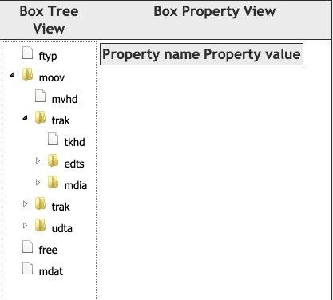

> ❝
>
> mp4box.js 在线地址：https://gpac.github.io/mp4box.js/test/filereader.html
>
> ❞

由于 MP4 文件结构比较复杂（不信请看下图），这里我们就不继续展开，有兴趣的读者，可以自行阅读相关文章。

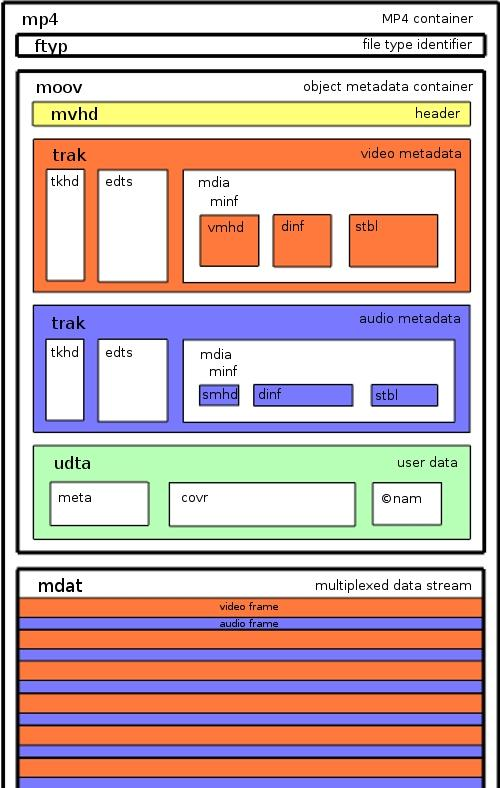

接下来，我们来介绍 Fragmented MP4 容器格式。

##### 7.2.2 Fragmented MP4 封装格式

MP4 ISO Base Media 文件格式标准允许以 fragmented 方式组织 box，这也就意味着 MP4 文件可以组织成这样的结构，由一系列的短的 metadata/data box 对组成，而不是一个长的 metadata/data 对。Fragmented MP4 文件结构如下图所示，图中只包含了两个 fragments：

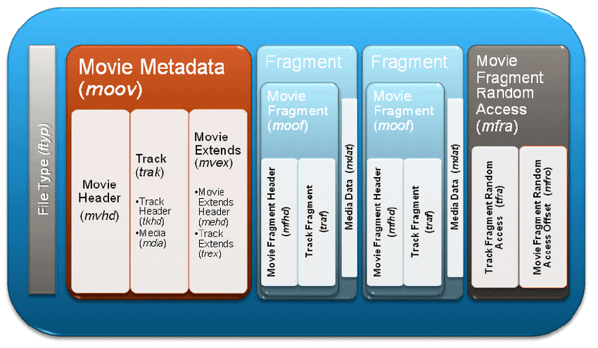

（图片来源 —— https://alexzambelli.com/blog/2009/02/10/smooth-streaming-architecture/）

在 Fragmented MP4 文件中含有三个非常关键的 boxes：`moov`、`moof` 和 `mdat`。

- moov（movie metadata box）：用于存放多媒体 file-level 的元信息。
- mdat（media data box）：和普通 MP4 文件的 `mdat` 一样，用于存放媒体数据，不同的是普通 MP4 文件只有一个 `mdat` box，而 Fragmented MP4 文件中，每个 fragment 都会有一个 `mdat` 类型的 box。
- moof（movie fragment box）：用于存放 fragment-level 的元信息。该类型的 box 在普通的 MP4 文件中是不存在的，而在 Fragmented MP4 文件中，每个 fragment 都会有一个 `moof` 类型的 box。

Fragmented MP4 文件中的 fragment 由 `moof` 和 `mdat` 两部分组成，每个 fragment 可以包含一个音频轨或视频轨，并且也会包含足够的元信息，以保证这部分数据可以单独解码。Fragment 的结构如下图所示：

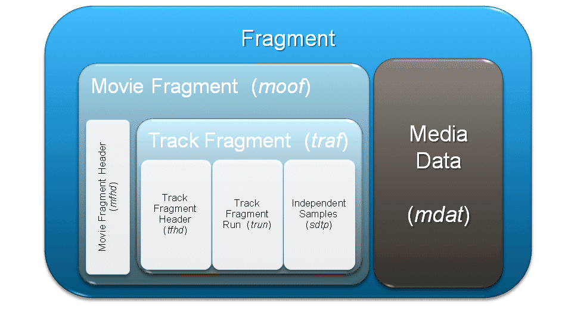

（图片来源 —— https://alexzambelli.com/blog/2009/02/10/smooth-streaming-architecture/）

同样，利用 mp4box.js 提供的在线服务，我们也可以清晰的查看 Fragmented MP4 文件的内部结构：

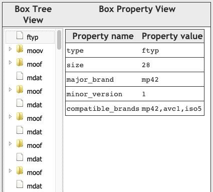

我们已经介绍了 MP4 和 Fragmented MP4 这两种容器格式，我们用一张图来总结一下它们之间的主要区别：

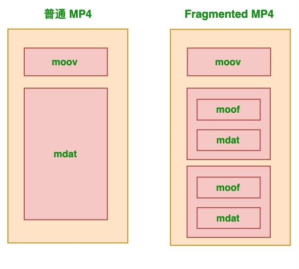

### 八、阿宝哥有话说

#### 8.1 如何实现视频本地预览

视频本地预览的功能主要利用 `URL.createObjectURL()` 方法来实现。URL.createObjectURL() 静态方法会创建一个 DOMString，其中包含一个表示参数中给出的对象的 URL。这个 URL 的生命周期和创建它的窗口中的 document 绑定。 这个新的 URL 对象表示指定的 File 对象或 Blob 对象。

```
<!DOCTYPE html>
<html>
  <head>
    <meta charset="UTF-8" />
    <meta name="viewport" content="width=device-width, initial-scale=1.0" />
    <title>视频本地预览示例</title>
  </head>
  <body>
    <h3>阿宝哥：视频本地预览示例</h3>
    <input type="file" accept="video/*" onchange="loadFile(event)" />
    <video
      id="previewContainer"
      controls
      width="480"
      height="270"
      style="display: none;"
    ></video>

    <script>
      const loadFile = function (event) {
        const reader = new FileReader();
        reader.onload = function () {
          const output = document.querySelector("#previewContainer");
          output.style.display = "block";
          output.src = URL.createObjectURL(new Blob([reader.result]));
        };
        reader.readAsArrayBuffer(event.target.files[0]);
      };
    </script>
  </body>
</html>
复制代码
```

#### 8.2 如何实现播放器截图

播放器截图功能主要利用 `CanvasRenderingContext2D.drawImage()` API 来实现。Canvas 2D API 中的 CanvasRenderingContext2D.drawImage()  方法提供了多种方式在 Canvas 上绘制图像。

drawImage API 的语法如下：

> ❝
>
> void ctx.drawImage(image, dx, dy); void ctx.drawImage(image, dx, dy, dWidth, dHeight); void ctx.drawImage(image, sx, sy, sWidth, sHeight, dx, dy, dWidth, dHeight);
>
> ❞

其中 image 参数表示绘制到上下文的元素。允许任何的 canvas 图像源（CanvasImageSource），例如：CSSImageValue，HTMLImageElement，SVGImageElement，HTMLVideoElement，HTMLCanvasElement，ImageBitmap 或者 OffscreenCanvas。

```
<!DOCTYPE html>
<html lang="en">
  <head>
    <meta charset="UTF-8" />
    <meta name="viewport" content="width=device-width, initial-scale=1.0" />
    <title>播放器截图示例</title>
  </head>
  <body>
    <h3>阿宝哥：播放器截图示例</h3>
    <video id="video" controls="controls" width="460" height="270" crossorigin="anonymous">
      <!-- 请替换为实际视频地址 -->
      <source src="https://xxx.com/vid_159411468092581" />
    </video>
    <button onclick="captureVideo()">截图</button>
    <script>
      let video = document.querySelector("#video");
      let canvas = document.createElement("canvas");
      let img = document.createElement("img");
      img.crossOrigin = "";
      let ctx = canvas.getContext("2d");

      function captureVideo() {
        canvas.width = video.videoWidth;
        canvas.height = video.videoHeight;
        ctx.drawImage(video, 0, 0, canvas.width, canvas.height);
        img.src = canvas.toDataURL();
        document.body.append(img);
      }
    </script>
  </body>
</html>
复制代码
```

现在我们已经知道如何获取视频的每一帧，其实在结合 [gif.js](https://github.com/jnordberg/gif.js) 这个库提供的 GIF 编码功能，我们就可以快速地实现截取视频帧生成 GIF 动画的功能。这里阿宝哥不继续展开介绍，有兴趣的小伙伴可以阅读 [使用 JS 直接截取 视频片段 生成 gif 动画](https://juejin.im/entry/6844903607171547143) 这篇文章。

#### 8.3 如何实现 Canvas 播放视频

使用 Canvas 播放视频主要是利用 `ctx.drawImage(video, x, y, width, height)` 来对视频当前帧的图像进行绘制，其中 video 参数就是页面中的 video 对象。所以如果我们按照特定的频率不断获取 video 当前画面，并渲染到 Canvas 画布上，就可以实现使用 Canvas 播放视频的功能。

```
<!DOCTYPE html>
<html>
  <head>
    <meta charset="UTF-8" />
    <meta name="viewport" content="width=device-width, initial-scale=1.0" />
    <title>使用 Canvas 播放视频</title>
  </head>
  <body>
    <h3>阿宝哥：使用 Canvas 播放视频</h3>
    <video id="video" controls="controls" style="display: none;">
      <!-- 请替换为实际视频地址 -->
      <source src="https://xxx.com/vid_159411468092581" />
    </video>
    <canvas
      id="myCanvas"
      width="460"
      height="270"
      style="border: 1px solid blue;"
    ></canvas>
    <div>
      <button id="playBtn">播放</button>
      <button id="pauseBtn">暂停</button>
    </div>
    <script>
      const video = document.querySelector("#video");
      const canvas = document.querySelector("#myCanvas");
      const playBtn = document.querySelector("#playBtn");
      const pauseBtn = document.querySelector("#pauseBtn");
      const context = canvas.getContext("2d");
      let timerId = null;

      function draw() {
        if (video.paused || video.ended) return;
        context.clearRect(0, 0, canvas.width, canvas.height);
        context.drawImage(video, 0, 0, canvas.width, canvas.height);
        timerId = setTimeout(draw, 0);
      }

      playBtn.addEventListener("click", () => {
        if (!video.paused) return;
        video.play();
        draw();
      });

      pauseBtn.addEventListener("click", () => {
        if (video.paused) return;
        video.pause();
        clearTimeout(timerId);
      });
    </script>
  </body>
</html>
复制代码
```

#### 8.4 如何实现色度键控（绿屏效果）

上一个示例我们介绍了使用 Canvas 播放视频，那么可能有一些小伙伴会有疑问，为什么要通过 Canvas 绘制视频，Video 标签不 “香” 么？这是因为 Canvas 提供了 `getImageData` 和 `putImageData` 方法使得开发者可以动态地更改每一帧图像的显示内容。这样的话，我们就可以实时地操纵视频数据来合成各种视觉特效到正在呈现的视频画面中。

比如 MDN 上的 ”[使用 canvas 处理视频](https://developer.mozilla.org/zh-CN/docs/Web/API/Canvas_API/Manipulating_video_using_canvas)“ 的教程中就演示了如何使用 JavaScript 代码执行色度键控（绿屏或蓝屏效果）。所谓的[色度键控](https://zh.wikipedia.org/zh/色键)，又称色彩嵌空，是一种去背合成技术。Chroma 为纯色之意，Key 则是抽离颜色之意。把被拍摄的人物或物体放置于绿幕的前面，并进行去背后，将其替换成其他的背景。此技术在电影、电视剧及游戏制作中被大量使用，色键也是虚拟摄影棚（Virtual studio）与视觉效果（Visual effects）当中的一个重要环节。

下面我们来看一下关键代码：

```
processor.computeFrame = function computeFrame() {
    this.ctx1.drawImage(this.video, 0, 0, this.width, this.height);
    let frame = this.ctx1.getImageData(0, 0, this.width, this.height);
    let l = frame.data.length / 4;

    for (let i = 0; i < l; i++) {
      let r = frame.data[i * 4 + 0];
      let g = frame.data[i * 4 + 1];
      let b = frame.data[i * 4 + 2];
      if (g > 100 && r > 100 && b < 43)
        frame.data[i * 4 + 3] = 0;
    }
    this.ctx2.putImageData(frame, 0, 0);
    return;
}
复制代码
```

以上的 `computeFrame()` 方法负责获取一帧数据并执行色度键控效果。利用色度键控技术，我们还可以实现纯客户端实时蒙版弹幕。这里阿宝哥就不详细介绍了，感兴趣的小伙伴可以阅读一下创宇前端 [弹幕不挡人！基于色键技术的纯客户端实时蒙版弹幕](https://juejin.im/post/6844903766148284423) 这篇文章。

### 九、参考资源

- [Baike - 流媒体](https://baike.baidu.com/item/流媒体)
- [MDN - Video_and_audio_content](https://developer.mozilla.org/zh-CN/docs/Learn/HTML/Multimedia_and_embedding/Video_and_audio_content)
- [MDN - Range_requests](https://developer.mozilla.org/zh-CN/docs/Web/HTTP/Range_requests)
- [MDN - Media_Source_Extensions_API](https://developer.mozilla.org/zh-CN/docs/Web/API/Media_Source_Extensions_API)
- [Wiki - MPEG-DASH](https://zh.wikipedia.org/wiki/基于HTTP的动态自适应流)
- [w3.org - Media Source Extensions](https://www.w3.org/TR/media-source/)


作者：阿宝哥
链接：https://juejin.cn/post/6850037275579121671
来源：掘金
著作权归作者所有。商业转载请联系作者获得授权，非商业转载请注明出处。