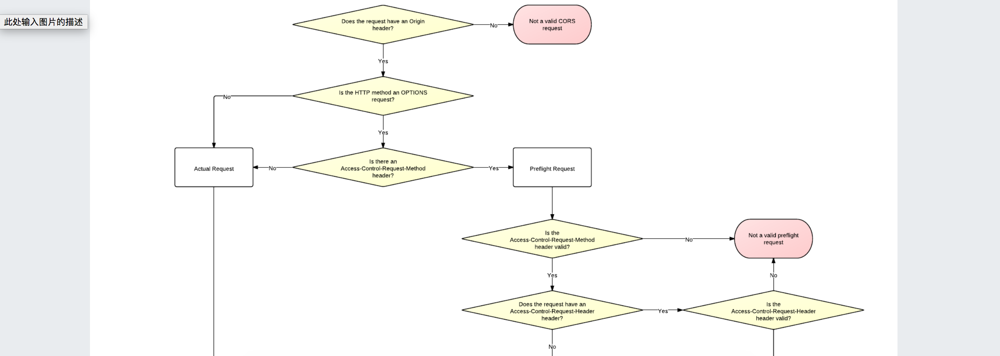
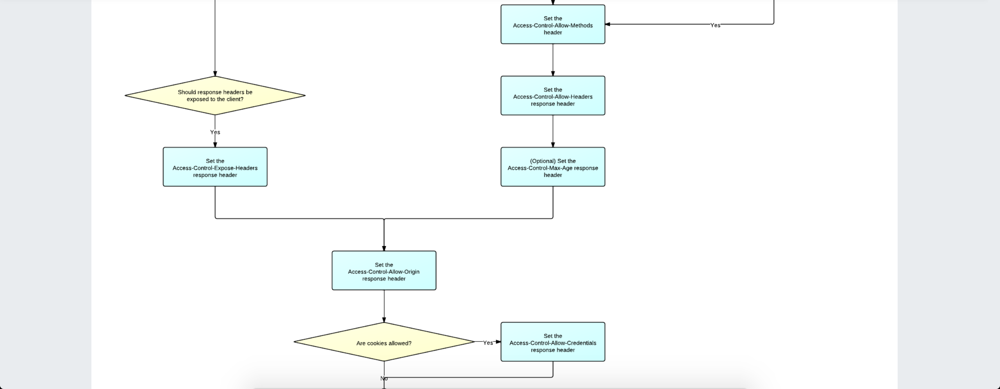
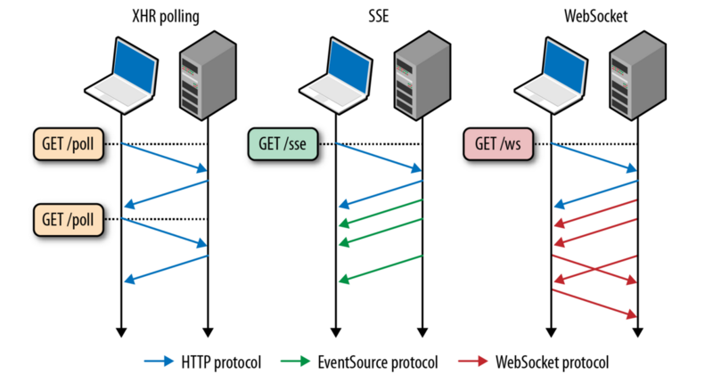

# [前端通信进阶](https://segmentfault.com/a/1190000004682473)

https://segmentfault.com/a/1190000004682473


在几年前，天空一声巨响,ajax 闪亮登场. 前端宝宝们如获至宝~ 已经表单提交神马的, 真的太 心累了. 有了ajax之后, 网页的性能可大幅提升，告别刷新，告别如水的流量. 不过，长江后浪推前浪，一代更比一代强. 由于ajax被同域限制着, 导致, 多服务器配置，云服务资源的存储 没办法充分利用. 所以,业界想到另外一种方法--JSONP. JSONP实际上和ajax没有半点关系，唯一相同的就是都是异步执行，而且JSONP完美解决了CD(cross domain)问题.
科技就是第一生产力, web发展so fast. 以前追求就是静态网页,显示信息而已。 现在，正朝着web2.0,webapp前进。 以前的单向交流 已经不能满足 需求了。 怎么办呢？
改呗~
所以，紧接着SSE,websocket 诞生了. 至今为止, 前端通信方式算是告一段落。 这里我们将围绕上述的几种通信方式进行,简单的介绍.
以下是几个技术的顺序.

- ajax
- JSOP
- SSE
- websocket

ok~ 进入主题吧~

## AJAX

相信这个应该不用过多的讲解了吧.
差不多就4步:

- 创建xhr对象
- 监听请求
- 设置回调
- 设置参数
- 发送xhr
- 获得数据执行回调

这里，我就直接上代码了.

```
var sendAjax = (function() {
    var getXHR = (function() {
        var xhr;
        if(window.XHRHttpRequest){
            xhr = new XMLHttpRequest();
        }else{
            xhr = new ActiveObject("Microsoft.XMLHTTP");
        }
        return xhr;
    })();
    return function(url,opts){ //url为目标地址
        var xhr = getXHR(),
        data;
        xhr.onreadystatechange = function(){
            if(xhr.readyState===4||xhr.status===200){
                data = JSON.parse(xhr.responseText);  //将data解析为json对象
                opts.callback(data);
            }
        }
        xhr.setRequestHeader('Content-Type','application/json');
        xhr.open(opts.method,url);  //写入参数
        xhr.send(JSON.stringify(opts.data));  //将参数json字符化
    }
})();
//调用执行
sendAjax('www.example.com',{
    callback:function(data){
        //...
    },
    data:{
        name:'JIMMY',
        age:18
    }
})
```

这样差不多就完成了一个ajax的简单模型。当然，我们也可以使用jquery提供的$.ajax函数, 只是他里面做了更多的兼容性和功能性.

## JSONP

JSONP 就是 JSON with Padding... 我真的不知道这个名字的含义到时有什么卵用...
一开始在使用JSONP时, 就是使用jquery的$.ajax函数就可以了. 但，这造成了一个很不好的impression. 总是让我们以为,JSONP 和 ajax有什么关联似的. 而，事实上，他们两个是完全不同的机制. xhr原理大家已经很清楚了，就是完完全全的异步操作. 但JSONP的原理是什么呢？

### JSONP原理

JSONP 其实是和< script> 标签 有很大的关系. JSONP最大的优势就是实现异步跨域的作用, 他到底是怎么做到的呢？
其实, JSONP就是利用script 的 `src`属性，实现跨域的功能.

> talk is cheap, show the code

```
<script>
function processJSON (json) {
  // Do something with the JSON response
};
</script>

<script src='http://www.girls.hustonline.net?
callback=processJSON&name=jimmy&age=18'></script>
```

上面的写法有点不符合前端风味. 说明一下, 其实processJSON,其实就相当于一个回调函数而已. 在script--src里面的内容我们来瞧一瞧. 使用jsoncallback 来指定回调函数名字, 并且传入一些参数

- name = jimmy
- age = 18

这就是前端发送JSONP的全部. 那应该怎么执行呢？或者说，返回的内容是什么呢？
很简单, 根据jsoncallback里面指定的函数名--processJSON. 在返回的js里面使用processJSON(data); 来执行.
服务器端返回的js内容.

```
processJSON({
    message:"I've already received"
});
```

然后,浏览器收到后,直接执行即可. 这里，我们来模拟一下服务器端盖怎样执行一个JSONP的函数.

```
const util = require('util'),
    http = require('http'),
    url = require('url');
let data = JSON.stringify({
    message:"I've already received"
});
http.createServer(function(req, res) {
    req = url.parse(req.url, true);
    if (!req.query.callback) res.end();
    console.log(`name is  ${req.query.name} and his age is ${req.query.age}`);
    res.writeHead(200, { 'Content-Type': 'application/javascript' })
    res.end(req.query.callback + "('" + data + "')")
}).listen(80)
```

ok~ 上面基本上就可以完成一个简单的JSONP函数执行。 当然,express 4.x 里面也有相关的JSONP 操作。 有兴趣的同学可以看一看.
then, 我们可以模拟一下实在的JSONP请求.上面是直接将script 写死在html内部, 这样造成的结果可能会阻塞页面的加载. 所以，我们需要以另外一种方式进行，使用异步添加script方法.

```
var sendJSONP = function(url,callbackName){
    var script = docuemnt.createELement('script');
    script.src = `${url}&callback=${callbackName}`;
    document.head.appendChild(script);
}
var sayName = function(name){
    console.log(`your name is ${name}`);
}
sendJSONP('http://girls.hustonline.net?name=jimmy','sayName');
```

上面就是一个精简版的JSONP了。 另外，也推荐使用jquery的getJSON和$.ajax进行请求.
先看一下getJSON

```
$.getJSON("http://girls.hustonline.net?callback=?", function(result){
  console.log(result);
});
```

这里，我们需要关注一下url里面中`callback=?`里的`?`的内涵. jquery使用自动生成数的方式, 省去了我们给回调命名的困扰。 其实，最后`?`会被一串字符代替，比如: `json23153123`. 这个就代表你的回到函数名.
不过，还是推荐使用$.ajax,因为你一不小心就有可能忘掉最后的`?`.
使用`$.ajax`发送jsonp

```
 $.ajax({
    url: 'http://girls.hustonline.net?name=jimmy',
    dataType: 'jsonp',
    success: function(name){
            console.log(name);
        }
    });
```

这样，我们就可以利用jquery很简单的发送jsonp了.

## SSE

ajax和JSONP 都是 client-fetch的操作. 但是有时候, 我们更需要服务器主动给我们发信息. 比如，现在的APP应用，完全可以实现服务器发送, 然后Client再处理. 而，SSE就是帮助我们向webapp靠近.
SSE 全称就是 Server-Sent Events. 中译 为 `服务器推送`.
他的技术并不是很难，和websocket不同，他依赖原生的HTTP，所以对于开发者来说更好理解。 比如,在nodeJS, 只要我不执行res.end(),并且一定时间持续发送信息的话,那么该连接就会持续打开(keep-alive). 其实通俗来说，就是一个长连接. 所以,以前我们通常使用ajax,iframe长轮询来代替他.但是这样有个缺点就是, 可操控性弱, 错误率高。 所以，正对于这点W3C, 觉得需要在客户端另外指定一个机制--能够保证服务器推送, 实现连接的keep-alive,操作简单... 在这样背景下SSE诞生了.
但SSE和AJAX具体的区别在什么地方呢?

- 数据类型不同: SSE 只能接受 type/event-stream 类型. AJAX 可以接受任意类型
- 结束机制不同: 虽然使用AJAX长轮询也可以实现这样的效果, 但是, 服务器端(nodeJS)必须在一定时间内执行res.end()才行. 而SSE, 只需要执行res.write() 即可.

### 简单demo

先看一个client端, 一个比较简单的demo

```
var source = new EventSource('/dates');  //指定路由发送
source.onmessage = function(e) {  //监听信息的传输
    var data = JSON.parse(e.data),
        origin = e.origin;
};
source.onerror = function(e) { //当连接发生error时触发
    console.log(e);
};
source.onopen = function(e) { //当连接正式建立时触发
    console.log(e);
};
```

SSE主要就是创建一个EventSource对象. 里面的参数就是发送的路由, 不过目前还不支持CORS,所以也被限制在同源策略下.
在返回的source里面包含了，需要处理的一切信息.SSE也是通过事件驱动的，如上面demo所述. 这里,SSE通常有一下几类重要的事件.

| eventName | effect                                          |
| --------- | ----------------------------------------------- |
| open      | 当连接打开时触发                                |
| message   | 当有数据发送时触发, 在event对象内包含了相关数据 |
| error     | 当发生错误时触发                                |

上面几个方法比较重要的还是message方法. message主要用来进行信息的接受, 回调中的event 包含了返回的相关数据.
event包含的内容

| property    | effect                                                |
| ----------- | ----------------------------------------------------- |
| data        | 服务器端传回的数据                                    |
| origin      | 服务器端URL的域名部分,有protocol,hostname,port        |
| lastEventId | 用来指定当前数据的序号.主要用来断线重连时数据的有效性 |

### 服务器返回数据格式

上文说过,SSE 是以event-stream格式进行传输的. 但具体内容是怎样的呢?

```
data: hi

data: second event
id: 100

event: myevent
data: third event
id: 101

: this is a comment
data: fourth event
data: fourth event continue
```

上面就是一个简单的demo. 每一段数据我们称之为事件, 每一个事件经过空行分隔. `:`前面是数据类型,后面是数据. 通常的类型有:

- 空类型: 表示注释,在处理是会默认被删除.比如`: this is a comment`.
- event: 声明该事件类型,比如message.
- data: 最重要的一个类型, 表示传输的数据。可以为string格式或者JSON格式. 比如: `data: {"username": "bobby"}`
- id: 其实就是lastEventId. 用来表明该次事件在整个流中的序号
- retry: 用来表明浏览器断开再次连接之前等待的事件(不常用)

其实上面最重要的两个字段就是data,id. 所以，我们一般获取的话就可以使用 `event.data`和`event.lastEventId`.
上文说道, 每一段内容是通过换行实现的, 那服务器端应该怎么实现, 写入的操作呢？
同样, 这里以nodeJS 为例:

```
res.write("id: " + i + "\n");
res.write("data: " + i + "\n\n");
```

通过使用'nn'进行两次换行操作--即,产生空行即可.

### 使用自定义事件

服务器端不仅可以返回指定数据,还可以返回指定事件.不过默认情况下都是`message`事件, 但我们也可以指定事件. 比如

```
event: myevent
data: third event
id: 101
```

这里出发的就是 myevent事件。 即, 这就是触发自定义事件的方式.
在front-end 我们可以使用addEventListener 来进行监听.

```
var source = new EventSource('/someEvents');
source.addEventListener('myevent', function(event){
    //doSth
}, false);
```

### 服务端使用SSE

由于使用的是HTTP协议，所以对于服务端基本上没什么太大的改变. 唯一注意的就是, 发送数据使用res.write()即可，断开的时候使用res.end();

```
res.writeHead(200, {
      "Content-Type": "text/event-stream",
      "Cache-Control": "no-cache",
      "Access-Control-Allow-Origin": "*" //允许跨域
    });
var num =0;
var f = function(){
   if(num===10){
      res.end();
   }else{
    res.write("id: " + num + "\n");
    res.write("data: " + num + "\n\n");
    num++;
   }
   setTimeout(f,1000);
}
f();
```

Ok~ 这里有一个[demo](http://demo.howopensource.com/sse/), 大家可以打开控制台看一下. 会发现，有一个连接一直处于Content-Download状态. 该连接就是一个SSE。
**兼容性**
目前SSE，在市面上大受欢迎, 不过总有一个SB， 离经叛道... 居然连edge都不支持. 偶尔去翻了一下，还在[underConsideration](https://dev.windows.com/en-us/microsoft-edge/platform/status/serversenteventseventsource). 结果底下的评论基本都是xxxx. 有空可以去看看, 逼逼MS程序员.

## websocket

websocket 不同于其他的HTTP协议，他是独立于HTTP存在的另外一种通信协议。比如,像这样的一个路径`ws://websocket.example.com/`,就是一个websocket 通信. 通常的实时通信并不会传输大量的内容, 所以,对于HTTP协议那种，进行连接时需要传递，cookie和request Headers来说, 这种方式的通信协议，会造成一定的时延(latency). websocket通信协议就是在这样的背景下诞生了, 他与SSE,ajax polling不同的是--双向通信.

> talk is cheap, show the code

我们来看一个简单的websocket demo

```
  var socket = new WebSocket('ws://localhost:8080/');
  socket.onopen = function () {
      console.log('Connected!');
  };
  socket.onmessage = function (event) {
      console.log('Received data: ' + event.data);
      socket.close();
  };
  socket.onclose = function () {
      console.log('Lost connection!');
  };
  socket.onerror = function () {
      console.log('Error!');
  };
  socket.send('hello, world!');
```

可以说上面就是一个健全的websocket 通信了. 和SSE一样，我们需要创建一个WebSocket对象, 里面的参数指定连接的路由. 而且，他也是事件驱动的.
常见的事件监听有.

| event   | effect               |
| ------- | -------------------- |
| open    | 当ws连接建立时触发   |
| message | 当有信息到来时触发   |
| error   | 当连接发生错误时触发 |
| close   | 当连接断开时触发     |

### websocket 发送数据

另外，websocket 最大的特点就是可以双向通信。这里可以使用.
`ws.send()`方法发送数据, 不过只能发送String和二进制. 这里，我们通常call 数据叫做 `Frames`. 他是数据发送的最小单元.包含数据的长度和数据内容.
下面就是几种常用的发送方式

```
 socket.send("Hello server!"); 
 socket.send(JSON.stringify({'msg': 'payload'})); 

  var buffer = new ArrayBuffer(128);
  socket.send(buffer); 

  var intview = new Uint32Array(buffer);
  socket.send(intview); 

  var blob = new Blob([buffer]);
  socket.send(blob); 
```

另外还可以使用[binaryType](http://docs.webplatform.org/wiki/apis/websocket/WebSocket)指定传输的数据格式,不过一般都用不上，就不说了.
不过需要提醒的是, send方法，一般在open和message的回调函数中调用.

### websocket 接受数据

同理，和SSE差不多, 通过监听message事件，来接受server发送回来的数据. 接受其实就是通过`event.data`来获取. 不过, 需要和server端商量好data的类型.

```
ws.onmessage = function(msg) { 
  if(msg.data instanceof Blob) { 
    processBlob(msg.data);
  } else {
    processText(JSON.parse(msg.data)); //接受JSON数据
  }
}
```

那server端应该怎样处理websocket通信呢？
websocket虽然是另外一种协议，不过底层还是封装了TCP通信, 所以使用nodeJS的net模块，基本就可以满足，不过里面需要设置很多的头. 这里推荐使用[ws](https://github.com/websockets/ws)模块.

### NodeJS 发送websocket数据

简单的websocket demo

```
var WebSocketServer = require('ws').Server
  , wss = new WebSocketServer({ port: 8080 });

//通过ws+ssl的方式通信. 和HTTPS类似
wss.on('connection', function connection(ws) {
  ws.on('message', function incoming(message) {
    console.log('received: %s', message);
  });

  ws.send('something');
});
```

可以参考treeHouse 编写的[WSdemo](http://codepen.io/matt-west/full/tHlBb)

### 为什么websocket会有子协议

由于websocket 本身的协议对于数据格式来说，不是特别的清晰明了，ws可以传输text,blob,binary等等其他格式. 这样对于安全性和开发性能来说，友好度很低。所以，为了解决这个问题, subprotocols 出现了. 在使用时,client和server都需要配置一样的subprotocols. 例如:

```
var ws = new WebSocket('wss://example.com/socket',
                       ['appProtocol', 'appProtocol-v2']);
```

服务端需要将subprotocols发送过去, 在handshakes的过程中,server 会识别subprotocols. 如果,server端也有相同的子协议存在, 那么连接成功. 如果不存在则会触发error, 连接就被断开了.

### websocket 协议内容

websocket 是有HyBi Working Group 提议并创建的。 主要的内容就是 一张表.

相比TCP来说, 真的是简单~
其实一句话就可以说完.

> Figure 17-1. WebSocket frame: 2–14 bytes + payload

具体内容是:

- 第一个比特(FIN) 表明, 该frame 是否信息的最后一个. 因为信息可以分多个frame包传送. 但最终客户端接收的是整个数据
- opcode(4bit)--操作码, 表示传送frame的类型 比如text(1)|| binary(2)
- Mask 比特位表示该数据是否是从 client => server.
- Extended length 用来表示payload 的长度
- Masking key 用来加密有效值
- Payload 就是传输的数据

### websocket 能否跨域?

首先，答案是。 但，网上有两部分内容:

> WebSocket is subject to the same-origin policy
> WebSocket is not subject to the same-origin policy

看到这里我也是醉了. 事实上websocket 是可以跨域的。 但是为了安全起见, 我们通常利用CORS 进行 域名保护.
即，设置如下的相应头:
`Access-Control-Allow-Origin: http://example.com`
这时, 只有[http://example.com](http://example.com/) 能够进行跨域请求. 其他的都会deny.
那什么是CORS呢?

## how does CORS work

CORS 是Cross-Origin Resource Sharing--跨域资源分享. CORS 是W3C 规范中 一项很重要的spec. 一开始,ajax 收到 the same origin policy 的限制 奈何不得。 结果出来了JSONP 等 阿猫阿狗. 这让ajax很不安呀~ 但是,W3C 大手一挥, 亲, 我给你开个buff. 结果CORS 就出来了。
CORS 就是用来帮助AJAX 进行跨域的。 而且支持性也超级好. [IE8+](http://caniuse.com/#search=cors)啊，亲~ 但是IE 是使用XDomainRequest 发送的.(真丑的一逼)
所以，这里安利一下[Nicholas Zakas](http://www.nczonline.net/blog/2010/05/25/cross-domain-ajax-with-cross-origin-resource-sharing/)大神写的一个函数.(我把英文改为中文了)

```
function createCORSRequest(method, url) {
  var xhr = new XMLHttpRequest();
  if ("withCredentials" in xhr) {

    // 检查xhr是否含有withCredentials属性
    //withCredentials 只存在于XHR2对象中.
    xhr.open(method, url, true);

  } else if (typeof XDomainRequest != "undefined") {

    // 检查是否是IE，并且使用IE的XDomainRequest
    xhr = new XDomainRequest();
    xhr.open(method, url);

  } else {

    // 否则..基本上就不能跨域了
    xhr = null;

  }
  return xhr;
}
```

然后, 就可以直接，xhr.send(body). 那CORS其实就完成了.
但,`withCredentials`是什么意思呢?

### CORS中的withCredentials

该属性就是用来表明，你的request的时候，是否带上你的cookie. 默认情况下是不带的. 如果你要发送cookie给server的话, 就需要将withCredentials设置为true了.
`xhr.withCredentials = true;`
但是,server并不是随便就能接受并返回新的cookie给你的。 在server端,还需要设置.
`Access-Control-Allow-Credentials: true`
这样server才能返回新的cookie给你. 不过，这还有一个问题,就是cookie还是遵循same-origin policy的。 所以, 你无法使用document.cookie去访问他. 他的CRUD(增删查改)只能由 server控制.

### CORS 的preflight 验证

CORS的preflight request, 应该算是CORS中里面 巨坑的一个。 因为在使用CORS 的时候， 有时候我命名只发送一次请求，但是,结果出来了两个。 有时候又只有一个, 这时候, 我就想问，还有谁能不懵逼.
这里，我们就需要区分一下. preflight request的作用到底是什么。
preflight request 是为了, 更好节省宽带而设计的. 因为CORS 要求的网络质量更高, 而且 花费的时间也更多. 万一, 你发送一个PUT 请求(这个不常见吧). 但是服务端又不支持, 那么你这次的 请求是失败了， 浪费资源还不说，关键用户不能忍呀~
所以, 这里我们就需要区分，什么是简单请求, 什么是比较复杂的请求
**简单请求**
简单请求的内容其实就两块, 一块是method 一块是Header

- Method
  - GET
  - POST
- Header
  - Accept
  - Accept-Language
  - Content-Language
  - Last-Event-ID //这是SSE的请求头
  - Content-Type ,但只有一下头才能算简单
    - application/x-www-form-urlencoded
    - multipart/form-data
    - text/plain

比如, 我使用上面定义好的函数createCORSRequest. 来发送一个简单请求

```
var url = 'http://example.com/cors';
var xhr = createCORSRequest('GET', url);
xhr.send();
```

我们来看一下，只发送一次简单请求时，请求头和相应头各是什么.（剔除无关的Headers）

```
//Request Headers
POST  HTTP/1.1
Origin: http://example.com
Host: api.bob.com
//Response Headers
Access-Control-Allow-Origin: http://example.com
Access-Control-Allow-Credentials: true
Access-Control-Expose-Headers: Vary
Content-Type: text/html; charset=utf-8
```

上面就是一个简单的CORS 头的交互。 另外，说明一个`Access-Control-Allow-Origin`,该头是必不可少的.
本来在XHR中, 一般可以通过xhr.getResponseHeader()来获取相关的相应头。 但是 在CORS中一般可以获得如下几个简单的Header:

- Cache-Control
- Content-Language
- Content-Type
- Expires
- ETag
- Last-Modified
- Pragma

如果你想暴露更多的头给用户的话就可以使用,`Access-Control-Expose-Headers` 来进行设置. 多个值用','分隔.
那发送两次请求是什么情况呢?
我们如果请求的数据是application/json的话，就会发送两次请求.

```
var url = 'http://example.com/cors';
var xhr = createCORSRequest('POST', url);
xhr.setRequestHeader('Content-Type','application/json');
xhr.send();
```

第一次,我们通常叫做preflight req. 他其实并没有发送任何 data过去. 只是将本次需要发送的请求头发送过去, 用来验证该次CORS请求是否有效.
上面的请求头就有:

```
OPTIONS HTTP/1.1
Origin: http://example.com
Content-Type: application/json
Access-Control-Request-Method: POST
Access-Control-Request-Headers: Custom-Header
Host: api.alice.com
Accept-Language: en-US
Connection: keep-alive
```

`Access-Control-Request-Method`就是用来表明,该次请求的方法.
请求内没有任何附加的数据.
如果该次preflight req 服务器可以处理，那么服务器就会正常返回, 如下的几个头.

```
//Response Header
<= HTTP/1.1 204 No Content
Access-Control-Allow-Methods: GET, POST, PUT, DELETE
Access-Control-Max-Age: 86400
Access-Control-Allow-Headers: Custom-Header
Access-Control-Allow-Origin: http://foo.com
Content-Length: 0
```

说明一下里面的头

- Access-Control-Allow-Methods: 指明服务器支持的方法
- Access-Control-Max-Age: 表明该次preflight req 最长的生存周期
- Access-Control-Allow-Headers: 是否支持你自定义的头. 比如: Custom-Header

这里，主要要看一下`Access-Control-Max-Age`. 这和preflight另外一个机制有很大的关系. 因为preflight 已经多发了一次请求， 如果每次发送json格式的ajax的话， 那我不是每次都需要验证一次吗？
当然不是. preflight req 有自己的一套机制. 通过设置Max-Age 来表示该次prefilght req 的有效时间。 在该有效时间之内， 后面如果有其他复杂ajax 的跨域请求的话，就不需要进行两次发送验证了.
而且，第二次的请求头和相应头 还可以减少不少重复的Header.
第二次继续验证

```
=> POST 
- HEADERS -
Origin: http://example.com
Access-Control-Request-Method: POST
Content-Type: application/json; charset=UTF-8

<= HTTP/1.1 200 OK
- RESPONSE HEADERS -
Access-Control-Allow-Origin: http://example.com
Content-Type: application/json
Content-Length: 58
```

ok~
最后上一张 Monsur Hossain大神话的CORS server 的运作流程图=>




看不清的话,请新建一个标签页看，放大就能看见了.

## 发展图谱

不多说了, 上图~


## fetch 补充

fetch 相关补充,可以查阅览 [前端 fetch 通信](https://segmentfault.com/a/1190000007001633)

转载请注明作者和原文地址：[https://segmentfault.com/a/11...](https://segmentfault.com/a/1190000004682473)