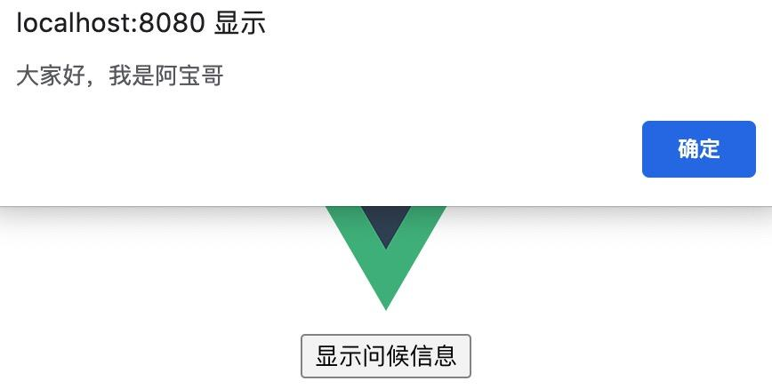

# [如何优雅的实现消息通信？](https://juejin.cn/post/6865444445479927821#heading-10)

### 一、背景

作为一名 Web 开发者，在日常工作中，经常都会遇到消息通信的场景。比如实现组件间通信、实现插件间通信、实现不同的系统间通信。那么针对这些场景，我们应该怎么实现消息通信呢？本文阿宝哥将带大家一起来学习如何优雅的实现消息通信。

好的，接下来我们马上步入正题，这里阿宝哥以一个文章订阅的例子来拉开本文的序幕。小秦与小王是阿宝哥的两个好朋友，他们在阿宝哥的 “[全栈修仙之路](http://www.semlinker.com/)” 博客中发现了 TS 专题文章，刚好他们近期也打算系统地学习 TS，所以他们就开启了 TS 的学习之旅。

时间就这样过了半个月，小秦和小王都陆续找到了阿宝哥，说 “全栈修仙之路” 博客上的 TS 文章都差不多学完了，他们有空的时候都会到 “[全栈修仙之路](http://www.semlinker.com/)” 博客上查看是否有新发的 TS 文章。他们觉得这样挺麻烦的，看能不能在阿宝哥发完新的 TS 文章之后，主动通知他们。


好友提的建议，阿宝哥怎能拒绝呢？所以阿宝哥分别跟他们说：“我会给博客加个订阅的功能，功能发布后，你填写一下邮箱地址。以后发布新的 TS 文章，系统会及时给你发邮件”。此时新的流程如下图所示：


在阿宝哥的一顿 “操作” 之后，博客的订阅功能上线了，阿宝哥第一时间通知了小秦与小王，让他们填写各自的邮箱。之后，每当阿宝哥发布新的 TS 文章，他们就会收到新的邮件通知了。

阿宝哥是个技术宅，对新的技术也很感兴趣。在遇到 [Deno](https://deno.land/) 之后，阿宝哥燃起了学习 Deno 的热情，同时也开启了新的 Deno 专题。在写了几篇 Deno 专题文章之后，两个读者小池和小郭分别联系到我，说他们看到了阿宝哥的 Deno 文章，想跟阿宝哥一起学习 Deno。

在了解他们的情况之后，阿宝哥突然想到了之前小秦与小王提的建议。因此，又是一顿 “操作” 之后，阿宝哥为了博客增加了专题订阅功能。该功能上线之后，阿宝哥及时联系了小池和小郭，邀请他们订阅 Deno 专题。之后小池和小郭也成为了阿宝哥博客的订阅者。现在的流程变成这样：


这个例子看起来很简单，但它背后却与一些设计思想和设计模式相关联。因此，接下来阿宝哥将分析以上三个场景与软件开发中一些设计思想和设计模式的关联性。

### 二、场景与模式

#### 2.1 消息轮询模式

在第一个场景中，小秦和小王为了能查看阿宝哥新发的 TS 文章，他们需要不断地访问 “全栈修仙之路” 博客：


这个场景跟软件开发过程中的轮询模式类似。早期，很多网站为了实现推送技术，所用的技术都是轮询。轮询是指由浏览器每隔一段时间向服务器发出 HTTP 请求，然后服务器返回最新的数据给客户端。常见的轮询方式分为轮询与长轮询，它们的区别如下图所示：


这种传统的模式带来很明显的缺点，**即浏览器需要不断的向服务器发出请求，然而 HTTP 请求与响应可能会包含较长的头部，其中真正有效的数据可能只是很小的一部分，所以这样会消耗很多带宽资源**。为了解决上述问题 HTML5 定义了 WebSocket 协议，能更好的节省服务器资源和带宽，并且能够更实时地进行通讯。

WebSocket 是一种网络传输协议，可在单个 TCP 连接上进行全双工通信，位于 OSI 模型的应用层。WebSocket 协议在 2011 年由 IETF 标准化为 [RFC 6455](https://tools.ietf.org/html/rfc6455)，后由 [RFC 7936](https://tools.ietf.org/html/rfc7936) 补充规范。

既然已经提到了 [OSI（Open System Interconnection Model）模型](https://zh.wikipedia.org/wiki/OSI模型)，这里阿宝哥来分享一张很生动、很形象描述 OSI 模型的示意图：


（图片来源：[www.networkingsphere.com/2019/07/wha…](https://www.networkingsphere.com/2019/07/what-is-osi-model.html）)

WebSocket 使得客户端和服务器之间的数据交换变得更加简单，允许服务端主动向客户端推送数据。**在 WebSocket API 中，浏览器和服务器只需要完成一次握手，两者之间就可以创建持久性的连接，并进行双向数据传输。**

介绍完轮询和 WebSocket 的相关内容之后，接下来我们来看一下 XHR Polling 与 WebSocket 之间的区别：


对于 XHR Polling 与 WebSocket 来说，它们分别对应了消息通信的两种模式，即 Pull（拉）模式与 Push（推）模式：


场景一我们就介绍到这里，对轮询和 WebSocket 感兴趣的小伙伴可以阅读阿宝哥写的 **“[你不知道的 WebSocket](http://www.semlinker.com/you-dont-know-websocket/)”** 这一篇文章。下面我们来继续分析第二个场景。

#### 2.2 观察者模式

在第二个场景中，为了让小秦和小王能及时收到阿宝哥新发布的 TS 文章，阿宝哥给博客增加了订阅功能。这里假设阿宝哥博客一开始只发布 TS 专题的文章。


针对这个场景，我们可以考虑使用设计模式中观察者模式来实现上述功能。 **观察者模式，它定义了一种一对多的关系，让多个观察者对象同时监听某一个主题对象，这个主题对象的状态发生变化时就会通知所有的观察者对象，使得它们能够自动更新自己。**

在观察者模式中有两个主要角色：Subject（主题）和 Observer（观察者）。


在第二个场景中，Subject（主题）就是阿宝哥的 TS 专题文章，而观察者就是小秦和小王。由于观察者模式支持简单的广播通信，当消息更新时，会自动通知所有的观察者。因此对于第二个场景，我们可以考虑使用观察者设计模式来实现上述的功能。接下来，我们来继续分析第三个场景。

#### 2.3 发布订阅模式

在第三个场景中，为了让小池和小郭能及时收到阿宝哥新发布的 Deno 文章，阿宝哥给博客增加了专题订阅功能。即支持为阿宝哥博客的订阅者分别推送新发布的 TS 或 Deno 文章。


针对这个场景，我们可以考虑使用发布订阅模式来实现上述功能。在软件架构中，发布 — 订阅是一种消息范式，消息的发送者（称为发布者）不会将消息直接发送给特定的接收者（称为订阅者）。而是将发布的消息分为不同的类别，然后分别发送给不同的订阅者。同样的，订阅者可以表达对一个或多个类别的兴趣，只接收感兴趣的消息，无需了解哪些发布者存在。

在发布订阅模式中有三个主要角色：Publisher（发布者）、 Channels（通道）和 Subscriber（订阅者）。


在第三个场景中，Publisher（发布者）是阿宝哥，Channels（通道）中 Topic A 和 Topic B 分别对应于 TS 专题和 Deno 专题，而 Subscriber（订阅者）就是小秦、小王、小池和小郭。好的，了解完发布订阅模式，下面我们来介绍一下它的一些应用场景。

### 三、发布订阅模式的应用

#### 3.1 前端框架中模块/页面间消息通信

在一些主流的前端框架中，内部也会提供用于模块间或页面间通信的组件。比如在 Vue 框架中，我们可以通过 `new Vue()` 来创建 EventBus 组件。而在 Ionic 3 中我们可以使用 `ionic-angular` 模块中的 Events 组件来实现模块间或页面间的消息通信。下面我们来分别介绍在 Vue 和 Ionic 中如何实现模块/页面间的消息通信。

##### 3.1.1 Vue 使用 EventBus 进行消息通信

在 Vue 中我们可以通过创建 EventBus 来实现组件间或模块间的消息通信，使用方式很简单。在下图中包含两个 Vue 组件：Greet 和 Alert 组件。Alert 组件用于显示消息，而 Greet 组件中包含一个按钮，即下图中 ”显示问候消息“ 的按钮。当用户点击按钮时，Greet 组件会通过 EventBus 把消息传递给 Alert 组件，该组件接收到消息后，会调用 `alert` 方法把收到的消息显示出来。



以上示例对应的代码如下：

**main.js**

```javascript
Vue.prototype.$bus = new Vue();
复制代码
```

**Alert.vue**

```html
<script>
export default {
  name: "alert",
  created() {
    // 监听alert:message事件
    this.$bus.$on("alert:message", msg => {
      this.showMessage(msg);
    });
  },
  methods: {
    showMessage(msg) {
      alert(msg);
    },
  },
  beforeDestroy: function() {
    // 组件销毁时，移除alert:message事件监听
    this.$bus.$off("alert:message");
  }
}
</script>
复制代码
```

**Greet.vue**

```html
<template>
  <div>
    <button @click="greet(message)">显示问候信息</button>
  </div>
</template>

<script>
export default {
  name: "Greet",
  data() {
    return {
      message: "大家好，我是阿宝哥",
    };
  },
  methods: {
    greet(msg) {
      this.$bus.$emit("alert:message", msg);
    }
  }
};
</script>
复制代码
```

##### 3.1.2 Ionic 使用 Events 组件进行消息通信

在 Ionic 3 项目中，要实现页面间消息通信很简单。我们只要通过构造注入的方式注入 `ionic-angular` 模块中提供的 Events 组件即可。具体的使用示例如下所示：

```typescript
import { Events } from 'ionic-angular';

// first page (publish an event when a user is created)
constructor(public events: Events) {}
createUser(user) {
  console.log('User created!')
  this.events.publish('user:created', user, Date.now());
}


// second page (listen for the user created event after function is called)
constructor(public events: Events) {
  events.subscribe('user:created', (user, time) => {
    // user and time are the same arguments passed in `events.publish(user, time)`
    console.log('Welcome', user, 'at', time);
  });
}
复制代码
```

介绍完发布订阅模式在 Vue 和 Ionic 框架中的应用之后，接下来阿宝哥将介绍该模式在微内核架构中是如何实现插件通信的。

#### 3.2 微内核架构中插件通信

微内核架构（Microkernel Architecture），有时也被称为插件化架构（Plug-in Architecture），是一种面向功能进行拆分的可扩展性架构，通常用于实现基于产品的应用。微内核架构模式允许你将其他应用程序功能作为插件添加到核心应用程序，从而提供可扩展性以及功能分离和隔离。

微内核架构模式包括两种类型的架构组件：核心系统（Core System）和插件模块（Plug-in modules）。**应用逻辑被分割为独立的插件模块和核心系统，提供了可扩展性、灵活性、功能隔离和自定义处理逻辑的特性。**


对于微内核的核心系统设计来说，它涉及三个关键技术：**插件管理、插件连接和插件通信**，这里我们重点来分析一下插件通信。

插件通信是指插件间的通信。虽然设计的时候插件间是完全解耦的，但实际业务运行过程中，必然会出现某个业务流程需要多个插件协作，这就要求两个插件间进行通信；**由于插件之间没有直接联系，通信必须通过核心系统，因此核心系统需要提供插件通信机制**。

这种情况和计算机类似，计算机的 CPU、硬盘、内存、网卡是独立设计的配置，但计算机运行过程中，CPU 和内存、内存和硬盘肯定是有通信的，计算机通过主板上的总线提供了这些组件之间的通信功能。


下面阿宝哥将以基于微内核架构设计的西瓜播放器为例，介绍它的内部是如何提供插件通信机制。在西瓜播放器内部，定义了一个 `Player` 类来创建播放器实例：

```javascript
let player = new Player({
  id: 'mse',
  url: '//abc.com/**/*.mp4'
});
复制代码
```

`Player` 类继承于 `Proxy` 类，而在 `Proxy` 类内部会通过构造继承的方式继承 `EventEmitter` 事件派发器：

```javascript
import EventEmitter from 'event-emitter'

class Proxy {
  constructor (options) {
    this._hasStart = false;
    // 省略大部分代码
    EventEmitter(this);
  }
}
复制代码
```

所以我们创建的西瓜播放器也是一个事件派发器，利用它就可以实现插件的通信。为了让大家能够更好地理解具体的通信流程，我们以内置的 poster 插件为例，来看一下它内部如何使用事件派发器。

poster 插件用于在播放器播放音视频前显示海报图，该插件的使用方式如下：

```javascript
new Player({
  el:document.querySelector('#mse'),
  url: 'video_url',
  poster: '//abc.com/**/*.png' // 默认值""
});
复制代码
```

poster 插件的对应源码如下：

```javascript
import Player from '../player'

let poster = function () {
  let player = this; 
  let util = Player.util
  let poster = util.createDom('xg-poster', '', {}, 'xgplayer-poster');
  let root = player.root
  if (player.config.poster) {
    poster.style.backgroundImage = `url(${player.config.poster})`
    root.appendChild(poster)
  }

  // 监听播放事件，播放时隐藏封面图
  function playFunc () {
    poster.style.display = 'none'
  }
  player.on('play', playFunc)

  // 监听销毁事件，执行清理操作
  function destroyFunc () {
    player.off('play', playFunc)
    player.off('destroy', destroyFunc)
  }
  player.once('destroy', destroyFunc)
}

Player.install('poster', poster)
复制代码
```

([github.com/bytedance/x…](https://github.com/bytedance/xgplayer/blob/master/packages/xgplayer/src/control/poster.js))

通过观察源码可知，在注册 poster 插件时，会把播放器实例注入到插件中。之后，在插件内部会使用 player 这个事件派发器来监听播放器的 `play` 和 `destroy` 事件。当 poster 插件监听到播放器的 `play` 事件之后，就会隐藏海报图。而当 poster 插件监听到播放器的 `destroy` 事件时，就会执行清理操作，比如移除已绑定的事件。

看到这里我们就已经很清楚了，西瓜播放器内部使用 `EventEmitter` 来提供插件通信机制，每个插件都会注入 player 这个全局的事件派发器，通过它就可以轻松地实现插件间通信了。


提到 `EventEmitter`，相信很多小伙伴对它并不会陌生。在 Node.js 中有一个名为 `events` 的内置模块，通过它我们可以方便地实现一个自定义的事件派发器，比如：

```javascript
const EventEmitter = require('events');

class MyEmitter extends EventEmitter {}

const myEmitter = new MyEmitter();

myEmitter.on('event', () => {
  console.log('大家好，我是阿宝哥!');
});

myEmitter.emit('event');
复制代码
```

#### 3.3 基于 Redis 实现不同系统间通信

在前面我们介绍了发布订阅模式在单个系统中的应用。其实，在日常开发过程中，我们也会遇到不同系统间通信的问题。接下来阿宝哥将介绍如何利用 Redis 提供的发布与订阅功能实现系统间的通信，不过在介绍具体应用前，我们得先熟悉一下 Redis 提供的发布与订阅功能。

##### 3.3.1 Redis 发布与订阅功能

**Redis 订阅功能**

通过 Redis 的 subscribe 命令，我们可以订阅感兴趣的通道，其语法为：`SUBSCRIBE channel [channel …]`。

```shell
➜  ~ redis-cli
127.0.0.1:6379> subscribe deno ts
Reading messages... (press Ctrl-C to quit)
1) "subscribe"
2) "deno"
3) (integer) 1
1) "subscribe"
2) "ts"
3) (integer) 2
复制代码
```

在上述命令中，我们通过 `subscribe` 命令订阅了 deno 和 ts 两个通道。接下来我们新开一个命令行窗口，来测试 Redis 的发布功能。

**Redis 发布功能**

通过 Redis 的 publish 命令，我们可以为指定的通道发布消息，其语法为： `PUBLISH channel message`。

```shell
➜  ~ redis-cli
127.0.0.1:6379> publish ts "pub/sub design mode"
(integer) 1
复制代码
```

当成功发布消息之后，订阅该通道的客户端就会收到消息，对应的控制台就会输出如下信息：

```
1) "message"
2) "ts"
3) "pub/sub design mode"
复制代码
```

了解完 Redis 的发布与订阅功能，接下来阿宝哥将介绍如何利用 Redis 提供的发布与订阅功能实现不同系统间的通信。

##### 3.3.2 实现不同系统间的通信

这里我们使用 Node.js 的 [Express](https://expressjs.com/zh-cn/) 框架和 [redis](https://www.npmjs.com/package/redis) 模块来快速搭建不同的 Web 应用，首先创建一个新的 Web 项目并安装一下相关的依赖：

```shell
$ npm init --yes
$ npm install express redis
复制代码
```

接着创建一个发布者应用：

**publisher.js**

```javascript
const redis = require("redis");
const express = require("express");

const publisher = redis.createClient();

const app = express();

app.get("/", (req, res) => {
  const article = {
    id: "666",
    name: "TypeScript实战之发布订阅模式",
  };

  publisher.publish("ts", JSON.stringify(article));
  res.send("阿宝哥写了一篇TS文章");
});

app.listen(3005, () => {
  console.log(`server is listening on PORT 3005`);
});
复制代码
```

然后分别创建两个订阅者应用：

**subscriber-1.js**

```javascript
const redis = require("redis");
const express = require("express");

const subscriber = redis.createClient();

const app = express();

subscriber.on("message", (channel, message) => {
  console.log("小王收到了阿宝哥的TS文章: " + message);
});

subscriber.subscribe("ts");

app.get("/", (req, res) => {
  res.send("我是阿宝哥的粉丝，小王");
});

app.listen(3006, () => {
  console.log("server is listening to port 3006");
});
复制代码
```

**subscriber-2.js**

```javascript
const redis = require("redis");
const express = require("express");

const subscriber = redis.createClient();

// https://dev.to/ganeshmani/implementing-redis-pub-sub-in-node-js-application-12he
const app = express();

subscriber.on("message", (channel, message) => {
  console.log("小秦收到了阿宝哥的TS文章: " + message);
});

subscriber.subscribe("ts");

app.get("/", (req, res) => {
  res.send("我是阿宝哥的粉丝，小秦");
});

app.listen(3007, () => {
  console.log("server is listening to port 3007");
});
复制代码
```

接着分别启动上面的三个应用，当所有应用都成功启动之后，在浏览器中访问 `http://localhost:3005/` 地址，此时上面的两个订阅者应用对应的终端会分别输出以下信息：

**subscriber-1.js**

```
server is listening to port 3006
小王收到了阿宝哥的TS文章: {"id":"666","name":"TypeScript实战之发布订阅模式"}
复制代码
```

**subscriber-2.js**

```
server is listening to port 3007
小秦收到了阿宝哥的TS文章: {"id":"666","name":"TypeScript实战之发布订阅模式"}
复制代码
```

以上示例对应的通信流程如下图所示：


到这里发布订阅模式的应用场景，已经介绍完了。最后，阿宝哥来介绍一下如何使用 TS 实现一个支持发布与订阅功能的 EventEmitter 组件。

### 四、发布订阅模式实战

#### 4.1 定义 EventEmitter 类

```typescript
type EventHandler = (...args: any[]) => any;

class EventEmitter {
  private c = new Map<string, EventHandler[]>();

  // 订阅指定的主题
  subscribe(topic: string, ...handlers: EventHandler[]) {
    let topics = this.c.get(topic);
    if (!topics) {
      this.c.set(topic, topics = []);
    }
    topics.push(...handlers);
  }

  // 取消订阅指定的主题
  unsubscribe(topic: string, handler?: EventHandler): boolean {
    if (!handler) {
      return this.c.delete(topic);
    }

    const topics = this.c.get(topic);
    if (!topics) {
      return false;
    }
    
    const index = topics.indexOf(handler);

    if (index < 0) {
      return false;
    }
    topics.splice(index, 1);
    if (topics.length === 0) {
      this.c.delete(topic);
    }
    return true;
  }

  // 为指定的主题发布消息
  publish(topic: string, ...args: any[]): any[] | null {
    const topics = this.c.get(topic);
    if (!topics) {
      return null;
    }
    return topics.map(handler => {
      try {
        return handler(...args);
      } catch (e) {
        console.error(e);
        return null;
      }
    });
  }
}
复制代码
```

#### 4.2 使用示例

```typescript
const eventEmitter = new EventEmitter();
eventEmitter.subscribe("ts", (msg) => console.log(`收到订阅的消息：${msg}`) );

eventEmitter.publish("ts", "TypeScript发布订阅模式");
eventEmitter.unsubscribe("ts");
eventEmitter.publish("ts", "TypeScript发布订阅模式");
复制代码
```

以上代码成功运行之后，控制台会输出以下信息：

```
收到订阅的消息：TypeScript发布订阅模式
复制代码
```

### 五、参考资源

- [维基百科 - 发布/订阅](https://zh.wikipedia.org/wiki/发布/订阅)
- [Ionic 3 - Events](https://ionicframework.com/docs/v3/api/util/Events/)
- [implementing-redis-pub-sub-in-node-js-application](https://dev.to/ganeshmani/implementing-redis-pub-sub-in-node-js-application-12he)