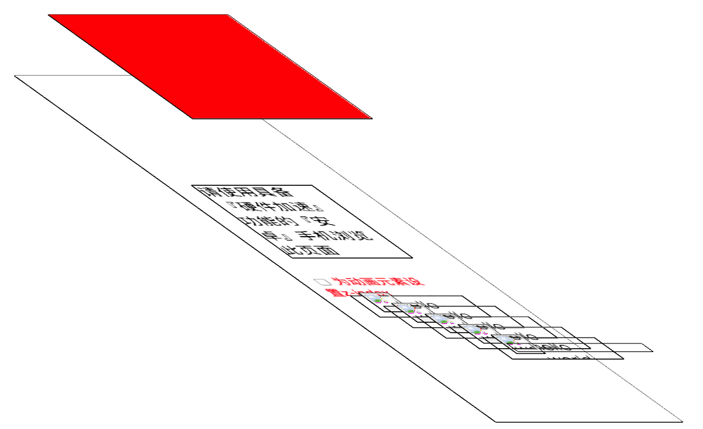

# 层爆炸

> 当一个DOM对象是合成层(浏览器单独给DOM对象创建一个新的图层显示)，当后面页面上出现了比自己层叠等级大的DOM对象时，浏览器会将比自己大的所有DOM对象都单独创建一个图层，浏览器给页面创建过多的图层，造成内存吃紧。

```html
<!DOCTYPE html>
<html>

<head>
  <meta charset="utf-8">
  <title>Composited layer</title>
  <meta name="viewport" content="width=device-width, initial-scale=1, user-scalable=no" />
  <style type="text/css">
    body {
      font-family: 'Helvetica Neue', 'Microsoft Yahei', sans-serif;
    }

    @-webkit-keyframes move {
      0% {
        -webkit-transform: translateX(0px)
      }

      50% {
        -webkit-transform: translateX(10px)
      }

      100% {
        -webkit-transform: translateX(0px)
      }
    }

    @-moz-keyframes move {
      0% {
        -moz-transform: translateX(0px)
      }

      50% {
        -moz-transform: translateX(10px)
      }

      100% {
        -moz-transform: translateX(0px)
      }
    }

    @-o-keyframes move {
      0% {
        -o-transform: translateX(0px)
      }

      50% {
        -o-transform: translateX(10px)
      }

      100% {
        -o-transform: translateX(0px)
      }
    }

    @keyframes move {
      0% {
        transform: translateX(0px)
      }

      50% {
        transform: translateX(10px)
      }

      100% {
        transform: translateX(0px)
      }
    }

    #title {
      /* -webkit-animation: move 1s linear infinite;
      -moz-animation: move 1s linear infinite;
      -o-animation: move 1s linear infinite; */
      animation: move 1s linear infinite;
      /*
      	z-index:1;
      	position:relative;
      */
    }

    h1 {
      font-size: 20px;
    }

    a {
      color: #888;
      text-decoration: none;
    }

    div {
      overflow: hidden;
    }

    ul {
      margin: 5px;
      padding: 0;
    }

    li {
      position: relative;
      height: 30px;
      overflow: hidden;
      border-top: 1px dotted #ccc;
      padding: 5px 20px 5px 40px;
      font-size: 20px;
    }

    img {
      width: 30px;
      height: 30px;
      position: absolute;
      left: 3px;
      top: 4px;
      border: 1px solid #ccc;
    }

    time {
      position: absolute;
      right: 5px;
      top: 4px;
      font-size: 12px;
      color: #999;
    }

    label {
      display: block;
      margin: 10px 5px;
      color: red;
    }

    input {
      vertical-align: middle;
    }
  </style>
</head>

<body>
  <h1 id="title">请使用具备『硬件加速』功能的『安卓』手机浏览此页面</h1>
  <ul id="list">
    <li class="album-item">
      
      hello world
      <time>2015-09</time>
    </li>
    <li class="album-item">
      
      hello world
      <time>2015-09</time>
    </li>
    <li class="album-item">
      
      hello world
      <time>2015-09</time>
    </li>
    <li class="album-item">
      
      hello world
      <time>2015-09</time>
    </li>
    <li class="album-item">
      
      hello world
      <time>2015-09</time>
    </li>
  </ul>
</body>

</html>
```



> 给整个页面的DOM对象创建图层，页面上`li标签`、`class=test的div`、`img`都比`h1`标签的层叠等级高，并且h1是合成层，为了渲染顺序的正确，比它层叠等级高的DOM对象都会创建一个新图层。
>
> 渲染顺序：在进入渲染阶段时会生成图层树，因为最终这些图像都有合成一个2D图片，因此它们上下顺序影响着谁覆盖谁。根据层叠规则生成渲染顺序。