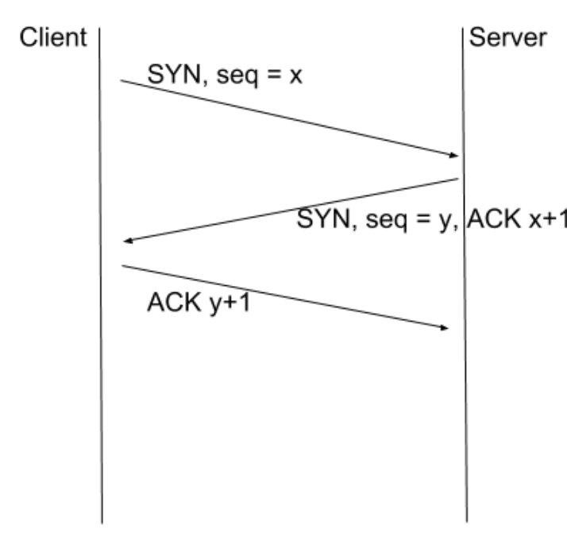

# 手把手教你写 Socket 长连接

> 本文由[`玉刚说写作平台`](http://renyugang.io/post/75)[1]提供写作赞助
>
> 原作者：[`水晶虾饺`](https://jekton.github.io/)[2]
>
> 版权声明：本文版权归微信公众号 `玉刚说` 所有，未经许可，不得以任何形式转载

本篇我们先简单了解一下 TCP/IP，然后通过实现一个 echo 服务器来学习 Java 的 Socket API。最后我们聊聊偏高级一点点的 socket 长连接和协议设计。

## TCP/IP 协议简介

#### IP

首先我们看 IP（Internet Protocol）协议。IP 协议提供了**主机和主机**间的通信。

为了完成不同主机的通信，我们需要某种方式来唯一标识一台主机，这个标识，就是著名的**IP地址**。通过IP地址，IP 协议就能够帮我们把一个数据包发送给对方。

#### TCP

前面我们说过，IP 协议提供了主机和主机间的通信。TCP 协议在 IP 协议提供的主机间通信功能的基础上，完成这两个主机上**进程对进程**的通信。

有了 IP，不同主机就能够交换数据。但是，计算机收到数据后，并不知道这个数据属于哪个进程（简单讲，进程就是一个正在运行的应用程序）。TCP 的作用就在于，让我们能够知道这个数据属于哪个进程，从而完成进程间的通信。

为了标识数据属于哪个进程，我们给需要进行 TCP 通信的进程分配一个唯一的数字来标识它。这个数字，就是我们常说的**端口号**。

TCP 的全称是 Transmission Control Protocol，大家对它说得最多的，大概就是**面向连接**的特性了。之所以说它是有连接的，是说在进行通信前，通信双方需要先经过一个*三次握手*的过程。三次握手完成后，连接便建立了。这时候我们才可以开始发送/接收数据。（与之相对的是 UDP，不需要经过握手，就可以直接发送数据）。

下面我们简单了解一下三次握手的过程。



1. 首先，客户向服务端发送一个 `SYN`，假设此时 sequence number 为 `x`。这个 `x` 是由操作系统根据一定的规则生成的，不妨认为它是一个随机数。
2. 服务端收到 `SYN` 后，会向客户端再发送一个 `SYN`，此时服务器的 `seq number = y`。与此同时，会 `ACK x+1`，告诉客户端“已经收到了 `SYN`，可以发送数据了”。
3. 客户端收到服务器的 `SYN` 后，回复一个 `ACK y+1`，这个 `ACK` 则是告诉服务器，`SYN` 已经收到，服务器可以发送数据了。

经过这 3 步，TCP 连接就建立了。这里需要注意的有三点：

1. 连接是由客户端主动发起的
2. 在第 3 步客户端向服务器回复 `ACK` 的时候，TCP 协议是允许我们携带数据的。之所以做不到，是 API 的限制导致的。
3. TCP 协议还允许 “四次握手” 的发生，同样的，由于 API 的限制，这个极端的情况并不会发生。

TCP/IP 相关的理论知识我们就先了解到这里。关于 TCP，还有诸如可靠性、流量控制、拥塞控制等非常有趣的特性，**强烈推荐**读者看一看 Richard 的名著《TCP/IP 详解 - 卷1》（注意，是**第1版**，不是第2版）。

下面我们看一些偏实战的东西。

## Socket 基本用法

Socket 是 TCP 层的封装，通过 socket，我们就能进行 TCP 通信。

在 Java 的 SDK 中，socket 的共有两个接口：用于监听客户连接的 `ServerSocket` 和用于通信的 `Socket`。使用 socket 的步骤如下：

1. 创建 `ServerSocket` 并监听客户连接
2. 使用 `Socket` 连接服务端
3. 通过 `Socket` 获取输入输出流进行通信

下面，我们通过实现一个简单的 echo 服务来学习 socket 的使用。所谓的 echo 服务，就是客户端向服务端写入任意数据，服务器都将数据原封不动地写回给客户端。

**1. 创建 ServerSocket 并监听客户连接**

```
public class EchoServer {

    private final ServerSocket mServerSocket;

    public EchoServer(int port) throws IOException {
        // 1. 创建一个 ServerSocket 并监听端口 port
        mServerSocket = new ServerSocket(port);
    }

    public void run() throws IOException {
        // 2. 开始接受客户连接
        Socket client = mServerSocket.accept();
        handleClient(client);
    }

    private void handleClient(Socket socket) {
        // 3. 使用 socket 进行通信 ...
    }


    public static void main(String[] argv) {
        try {
            EchoServer server = new EchoServer(9877);
            server.run();
        } catch (IOException e) {
            e.printStackTrace();
        }
    }
}
复制代码
```

**2. 使用 Socket 连接服务端**

```
public class EchoClient {

    private final Socket mSocket;

    public EchoClient(String host, int port) throws IOException {
        // 创建 socket 并连接服务器
        mSocket = new Socket(host, port);
    }

    public void run() {
        // 和服务端进行通信
    }


    public static void main(String[] argv) {
        try {
            // 由于服务端运行在同一主机，这里我们使用 localhost
            EchoClient client = new EchoClient("localhost", 9877);
            client.run();
        } catch (IOException e) {
            e.printStackTrace();
        }
    }
}
复制代码
```

**3. 通过 socket.getInputStream()/getOutputStream() 获取输入/输出流进行通信**

首先，我们来实现服务端：

```
public class EchoServer {
    // ...

    private void handleClient(Socket socket) throws IOException {
        InputStream in = socket.getInputStream();
        OutputStream out = socket.getOutputStream();
        byte[] buffer = new byte[1024];
        int n;
        while ((n = in.read(buffer)) > 0) {
            out.write(buffer, 0, n);
        }
    }
}
复制代码
```

可以看到，服务端的实现其实很简单，我们不停地读取输入数据，然后写回给客户端。

下面我们看看客户端。

```
public class EchoClient {
    // ...

    public void run() throws IOException {
        Thread readerThread = new Thread(this::readResponse);
        readerThread.start();

        OutputStream out = mSocket.getOutputStream();
        byte[] buffer = new byte[1024];
        int n;
        while ((n = System.in.read(buffer)) > 0) {
            out.write(buffer, 0, n);
        }
    }

    private void readResponse() {
        try {
            InputStream in = mSocket.getInputStream();
            byte[] buffer = new byte[1024];
            int n;
            while ((n = in.read(buffer)) > 0) {
                System.out.write(buffer, 0, n);
            }
        } catch (IOException e) {
            e.printStackTrace();
        }
    }
}
复制代码
```

客户端会稍微复杂一点点，在读取用户输入的同时，我们又想读取服务器的响应。所以，这里创建了一个线程来读服务器的响应。

不熟悉 lambda 的读者，可以把 `Thread readerThread = new Thread(this::readResponse)` 换成下面这个代码：

```
Thread readerThread = new Thread(new Runnable() {
    @Override
    public void run() {
        readResponse();
    }
});
复制代码
```

打开两个 terminal 分别执行如下命令：

```
$ javac EchoServer.java
$ java EchoServer
复制代码
$ javac EchoClient.java
$ java EchoClient
hello Server
hello Server
foo
foo
复制代码
```

在客户端，我们会看到，输入的所有字符都打印了出来。

最后需要注意的有几点：

1. 在上面的代码中，我们所有的异常都没有处理。实际应用中，在发生异常时，需要关闭 socket，并根据实际业务做一些错误处理工作
2. 在客户端，我们没有停止 `readThread`。实际应用中，我们可以通过关闭 socket 来让线程从阻塞读中返回。推荐读者阅读《Java并发编程实战》
3. 我们的服务端只处理了一个客户连接。如果需要同时处理多个客户端，可以创建线程来处理请求。这个作为练习留给读者来完全。

## Socket、ServerSocket 傻傻分不清楚

在进入这一节的主题前，读者不妨先考虑一个问题：在上一节的实例中，我们运行 echo 服务后，在客户端连接成功时，一个有多少个 socket 存在？

答案是 3 个 socket。客户端一个，服务端有两个。跟这个问题的答案直接关联的是本节的主题——`Socket` 和 `ServerSocket` 的区别是什么。

眼尖的读者，可能会注意到在上一节我是这样描述他们的：

> 在 Java 的 SDK 中，socket 的共有两个接口：用于监听客户连接的 `ServerSocket` 和用于通信的 `Socket`。

注意，我只说 `ServerSocket` 是用于监听客户连接，而没有说它也可以用来通信。下面我们来详细了解一下他们的区别。

> 注：以下描述使用的是 UNIX/Linux 系统的 API

首先，我们创建 `ServerSocket` 后，内核会创建一个 socket。这个 socket 既可以拿来监听客户连接，也可以连接远端的服务。由于 `ServerSocket` 是用来监听客户连接的，紧接着它就会对内核创建的这个 socket 调用 `listen` 函数。这样一来，这个 socket 就成了所谓的 listening socket，它开始监听客户的连接。

接下来，我们的客户端创建一个 `Socket`，同样的，内核也创建一个 socket 实例。内核创建的这个 socket 跟 `ServerSocket` 一开始创建的那个没有什么区别。不同的是，接下来 `Socket` 会对它执行 `connect`，发起对服务端的连接。前面我们说过，socket API 其实是 TCP 层的封装，所以 `connect` 后，内核会发送一个 `SYN` 给服务端。

现在，我们切换角色到服务端。**服务端的主机在收到这个 `SYN` 后，会创建一个新的 socket**，这个新创建的 socket 跟客户端继续执行三次握手过程。

三次握手完成后，我们执行的 `serverSocket.accept()` 会返回一个 `Socket` 实例，这个 socket 就是上一步内核自动帮我们创建的。

所以说，在一个客户端连接的情况下，其实有 3 个 socket。

关于内核自动创建的这个 socket，还有一个很有意思的地方。它的端口号跟 `ServerSocket` 是一毛一样的。咦！！不是说，一个端口只能绑定一个 socket 吗？其实这个说法并不够准确。

前面我说的TCP 通过端口号来区分数据属于哪个进程的说法，在 socket 的实现里需要改一改。Socket 并不仅仅使用端口号来区别不同的 socket 实例，而是使用 `<peer addr:peer port, local addr:local port>` 这个四元组。

在上面的例子中，我们的 `ServerSocket` 长这样：`<*:*, *:9877>`。意思是，可以接受任何的客户端，和本地任何 IP。

`accept` 返回的 `Socket` 则是这样： `<127.0.0.1:xxxx, 127.0.0.1:9877>`，其中`xxxx` 是客户端的端口号。

如果数据是发送给一个已连接的 socket，内核会找到一个完全匹配的实例，所以数据准确发送给了对端。

如果是客户端要发起连接，这时候只有 `<*:*, *:9877>` 会匹配成功，所以 `SYN` 也准确发送给了监听套接字。

`Socket/ServerSocket` 的区别我们就讲到这里。如果读者觉得不过瘾，可以参考《TCP/IP 详解》卷1、卷2。

## Socket 长连接的实现

**背景知识**

Socket 长连接，指的是在客户和服务端之间保持一个 socket 连接长时间不断开。

比较熟悉 `Socket` 的读者，可能知道有这样一个 API：

```
socket.setKeepAlive(true);
复制代码
```

嗯……keep alive，“保持活着”，这个应该就是让 TCP 不断开的意思。那么，我们要实现一个 socket 的长连接，只需要这一个调用即可。

遗憾的是，生活并不总是那么美好。对于 4.4BSD 的实现来说，Socket 的这个 keep alive 选项如果打开并且**两个小时**内没有通信，那么底层会发一个心跳，看看对方是不是还活着。

注意，两个小时才会发一次。也就是说，在没有实际数据通信的时候，我把网线拔了，你的应用程序要经过两个小时才会知道。

在说明如果实现长连接前，我们先来理一理我们面临的问题。假定现在有一对已经连接的 socket，在以下情况发生时候，socket 将不再可用：

1. 某一端关闭是 socket（这不是废话吗）。主动关闭的一方会发送 `FIN`，通知对方要关闭 TCP 连接。在这种情况下，另一端如果去读 socket，将会读到 `EoF`（End of File）。于是我们知道对方关闭了 socket。
2. 应用程序奔溃。此时 socket 会由内核关闭，结果跟情况1一样。
3. 系统奔溃。这时候系统是来不及发送 `FIN` 的，因为它已经跪了。此时对方无法得知这一情况。对方在尝试读取数据时，最后会返回 read time out。如果写数据，则是 host unreachable 之类的错误。
4. 电缆被挖断、网线被拔。跟情况3差不多，如果没有对 socket 进行读写，两边都不知道发生了事故。跟情况3不同的是，如果我们把网线接回去，socket 依旧可以正常使用。

在上面的几种情形中，有一个共同点就是，只要去读、写 socket，只要 socket 连接不正常，我们就能够知道。基于这一点，要实现一个 socket 长连接，我们需要做的就是不断地给对方写数据，然后读取对方的数据，也就是所谓的**心跳**。只要心还在跳，socket 就是活的。写数据的间隔，需要根据实际的应用需求来决定。

心跳包不是实际的业务数据，根据通信协议的不同，需要做不同的处理。

比方说，我们使用 JSON 进行通信，那么，我们可以加一个 `type` 字段，表面这个 JSON 是心跳还是业务数据。

```
{
    "type": 0,  // 0 表示心跳

    // ...
}
复制代码
```

使用二进制协议的情况类似。要求就是，我们能够区别一个数据包是心跳还是真实数据。这样，我们便实现了一个 socket 长连接。

**实现示例**

这一小节我们一起来实现一个带长连接的 Android echo 客户端。

首先了接口部分：

```
public final class LongLiveSocket {

    /**
     * 错误回调
     */
    public interface ErrorCallback {
        /**
         * 如果需要重连，返回 true
         */
        boolean onError();
    }

    /**
     * 读数据回调
     */
    public interface DataCallback {
        void onData(byte[] data, int offset, int len);
    }

    /**
     * 写数据回调
     */
    public interface WritingCallback {
        void onSuccess();
        void onFail(byte[] data, int offset, int len);
    }


    public LongLiveSocket(String host, int port,
                          DataCallback dataCallback, ErrorCallback errorCallback) {
    }

    public void write(byte[] data, WritingCallback callback) {
    }

    public void write(byte[] data, int offset, int len, WritingCallback callback) {
    }

    public void close() {
    }
}
复制代码
```

我们这个支持长连接的类就叫 `LongLiveSocket` 好了。如果在 socket 断开后需要重连，只需要在对应的接口里面返回 true 即可（在真实场景里，我们还需要让客户设置重连的等待时间，还有读写、连接的 timeout等。为了简单，这里就直接不支持了。

另外需要注意的一点是，如果要做一个完整的库，需要同时提供阻塞式和回调式API。同样由于篇幅原因，这里直接省掉了。

首先我们看看 `write()` 方法：

```
public void write(byte[] data, int offset, int len, WritingCallback callback) {
    mWriterHandler.post(() -> {
        Socket socket = getSocket();
        if (socket == null) {
            // initSocket 失败而客户说不需要重连，但客户又叫我们给他发送数据
            throw new IllegalStateException("Socket not initialized");
        }
        try {
            OutputStream outputStream = socket.getOutputStream();
            DataOutputStream out = new DataOutputStream(outputStream);
            out.writeInt(len);
            out.write(data, offset, len);
            callback.onSuccess();
        } catch (IOException e) {
            Log.e(TAG, "write: ", e);
            // 关闭 socket，避免资源泄露
            closeSocket();
            // 这里我们把发生失败的数据返回给客户端，这样客户可以更方便地重新发送数据
            callback.onFail(data, offset, len);
            if (!closed() && mErrorCallback.onError()) {
                // 重连
                initSocket();
            }
        }
    });
}
复制代码
```

由于我们需要定时写心跳，这里使用一个 `HandlerThread` 来处理写请求。通信使用的协议，只是简单地在用户数据前加一个 len 字段，用于确定消息的长度。

下面我们看心跳的发送：

```
private final Runnable mHeartBeatTask = new Runnable() {
    private byte[] mHeartBeat = new byte[0];

    @Override
    public void run() {
        // 我们使用长度为 0 的数据作为 heart beat
        write(mHeartBeat, new WritingCallback() {
            @Override
            public void onSuccess() {
                // 每隔 HEART_BEAT_INTERVAL_MILLIS 发送一次
                mWriterHandler.postDelayed(mHeartBeatTask, HEART_BEAT_INTERVAL_MILLIS);
                mUIHandler.postDelayed(mHeartBeatTimeoutTask, HEART_BEAT_TIMEOUT_MILLIS);
            }

            @Override
            public void onFail(byte[] data, int offset, int len) {
                // nop
                // write() 方法会处理失败
            }
        });
    }
};

private final Runnable mHeartBeatTimeoutTask = () -> {
    Log.e(TAG, "mHeartBeatTimeoutTask#run: heart beat timeout");
    closeSocket();
};
复制代码
```

发送心跳使用我们上面实现的 `write()` 方法。在发送成功后，post delay 一个 timeout task，如果到期后还没收到服务器的响应，我们将认为 socket 出现异常，这里直接关闭 socket。最后是对心跳的处理：

```
int nbyte = in.readInt();
if (nbyte == 0) {
    Log.i(TAG, "readResponse: heart beat received");
    mUIHandler.removeCallbacks(mHeartBeatTimeoutTask);
}
复制代码
```

由于用户数据的长度总是会大于 1，这里我们就使用 `len == 0` 的数据作为心跳。收到心跳后，移除 `mHeartBeatTimeoutTask`。

剩余代码跟我们的主题没有太大关系，读者在[这里](https://github.com/Jekton/Echo)[3]可以找到完整的代码或者自己完成这个例子。

最后需要说明的是，如果想节省资源，在有客户发送数据的时候可以省略 heart beat。

我们对读出错时候的处理，可能也存在一些争议。读出错后，我们只是关闭了 socket。socket 需要等到下一次写动作发生时，才会重新连接。实际应用中，如果这是一个问题，在读出错后可以直接开始重连。这种情况下，还需要一些额外的同步，避免重复创建 socket。heart beat timeout 的情况类似。

## 跟 TCP/IP 学协议设计

如果仅仅是为了使用是 socket，我们大可以不去理会协议的细节。之所以推荐大家去看一看《TCP/IP 详解》，是因为它们有太多值得学习的地方。很多我们工作中遇到的问题，都可以在这里找到答案。

以下每一个小节的标题都是一个小问题，建议读者独立思考一下，再继续往下看。如果你发现你的答案比我的更好，请一定发送邮件到 ljtong64 AT gmail DOT com 告诉我。

#### 协议版本如何升级？

有这么一句流行的话：这个世界唯一不变的，就是变化。当我们对协议版本进行升级的时候，正确识别不同版本的协议对软件的兼容非常重要。那么，我们如何设计协议，才能够为将来的版本升级做准备呢？

答案可以在 IP 协议找到。

IP 协议的第一个字段叫 version，目前使用的是 4 或 6，分别表示 IPv4 和 IPv6。由于这个字段在协议的开头，接收端收到数据后，只要根据第一个字段的值就能够判断这个数据包是 IPv4 还是 IPv6。

再强调一下，这个字段在两个版本的IP协议都位于第一个字段，为了做兼容处理，对应的这个字段必须位于同一位置。文本协议（如，JSON、HTML）的情况类似。

#### 如何发送不定长数据的数据包

举个例子，我们用微信发送一条消息。这条消息的长度是不确定的，并且每条消息都有它的边界。我们如何来处理这个边界呢？

还是一样，看看 IP。IP 的头部有个 header length 和 data length 两个字段。通过添加一个 len 域，我们就能够把数据根据应用逻辑分开。

跟这个相对的，还有另一个方案，那就是在数据的末尾放置终止符。比方说，想 C 语言的字符串那样，我们在每个数据的末尾放一个 `\0` 作为终止符，用以标识一条消息的尾部。这个方法带来的问题是，用户的数据也可能存在 `\0`。此时，我们就需要对用户的数据进行**转义**。比方说，把用户数据的所有 `\0` 都变成 `\0\0`。读消息的过程总，如果遇到 `\0\0`，那它就代表 `\0`，如果只有一个 `\0`，那就是消息尾部。

使用 len 字段的好处是，我们不需要对数据进行转义。读取数据的时候，只要根据 len 字段，一次性把数据都读进来就好，效率会更高一些。

终止符的方案虽然要求我们对数据进行扫描，但是如果我们可能从任意地方开始读取数据，就需要这个终止符来确定哪里才是消息的开头了。

当然，这两个方法不是互斥的，可以一起使用。

#### 上传多个文件，只有所有文件都上传成功时才算成功

现在我们有一个需求，需要一次上传多个文件到服务器，只有在所有文件都上传成功的情况下，才算成功。我们该如何来实现呢？

IP 在数据报过大的时候，会把一个数据报拆分成多个，并设置一个 MF （more fragments）位，表示这个包只是被拆分后的数据的一部分。

好，我们也学一学 IP。这里，我们可以给每个文件从 0 开始编号。上传文件的同时，也携带这个编号，并额外附带一个 MF 标志。除了编号最大的文件，所有文件的 MF 标志都置位。因为 MF 没有置位的是最后一个文件，服务器就可以根据这个得出总共有多少个文件。

另一种不使用 MF 标志的方法是，我们在上传文件前，就告诉服务器总共有多少个文件。

如果读者对数据库比较熟悉，学数据库用事务来处理，也是可以的。这里就不展开讨论了。

#### 如何保证数据的有序性

这里讲一个我曾经遇到过的面试题。现在有一个任务队列，多个工作线程从中取出任务并执行，执行结果放到一个结果队列中。先要求，放入结果队列的时候，顺序顺序需要跟从工作队列取出时的一样（也就是说，先取出的任务，执行结果需要先放入结果队列）。

我们看看 TCP/IP 是怎么处理的。IP 在发送数据的时候，不同数据报到达对端的时间是不确定的，后面发送的数据有可能较先到达。TCP 为了解决这个问题，给所发送数据的每个字节都赋了一个序列号，通过这个序列号，TCP 就能够把数据按原顺序重新组装。

一样，我们也给每个任务赋一个值，根据进入工作队列的顺序依次递增。工作线程完成任务后，在将结果放入结果队列前，先检查要放入对象的写一个序列号是不是跟自己的任务相同，如果不同，这个结果就不能放进去。此时，最简单的做法是等待，知道下一个可以放入队列的结果是自己所执行的那一个。但是，这个线程就没办法继续处理任务了。

更好的方法是，我们维护多一个结果队列的缓冲，这个缓冲里面的数据按序列号从小到大排序。工作线程要将结果放入，有两种可能：

1. 刚刚完成的任务刚好是下一个，将这个结果放入队列。然后从缓冲的头部开始，将所有可以放入结果队列的数据都放进去。
2. 所完成的任务不能放入结果队列，这个时候就插入结果队列。然后，跟上一种情况一样，需要检查缓冲。

如果测试表明，这个结果缓冲的数据不多，那么使用普通的链表就可以。如果数据比较多，可以使用一个最小堆。

#### 如何保证对方收到了消息

我们说，TCP 提供了可靠的传输。这样不就能够保证对方收到消息了吗？

很遗憾，其实不能。在我们往 socket 写入的数据，只要对端的内核收到后，就会返回 `ACK`，此时，socket 就认为数据已经写入成功。然而要注意的是，这里只是对方所运行的系统的内核成功收到了数据，并不表示应用程序已经成功处理了数据。

解决办法还是一样，我们学 `TCP`，添加一个应用层的 `APP ACK`。应用接收到消息并处理成功后，发送一个 `APP ACK` 给对方。

有了 `APP ACK`，我们需要处理的另一个问题是，如果对方真的没有收到，需要怎么做？

TCP 发送数据的时候，消息一样可能丢失。TCP 发送数据后，如果长时间没有收到对方的 `ACK`，就假设数据已经丢失，并重新发送。

我们也一样，如果长时间没有收到 `APP ACK`，就假设数据丢失，重新发送一个。

附：

[1] [renyugang.io/post/75](http://renyugang.io/post/75)

[2] [jekton.github.io](https://jekton.github.io/)

[3] [github.com/Jekton/Echo](https://github.com/Jekton/Echo)