https://juejin.cn/post/6844904061947346957#heading-132

#### 刻意练习

《**异类:不一样的成功启示录**》这本书里面谈到一万小时**刻意练习**成为高手的理论，后面也很多人谈到这个理论，我几年前就听说过，但真正体会到它的实际意义却是最近在训练算法的过程中，而且是走了很多弯路之后。可见理论到实际的过程是多么艰难。

我所理解的刻意练习，运用到算法的训练上面来，就是两点:

1. 经常性地做你不会做的题
2. 多种解法方式轮流试，最大化地挖掘一道题的价值

**刻意练习**有一个重要的观点是`走出舒适圈`。对于算法练习也是一样，为什么很多人觉得刷算法没用，那是因为他们总是在做自己熟悉的题型，用自己熟悉的方法，蹲在自己的舒适圈，这样做的再多也意义不大，但是如果总是在做自己不熟练的题型，用不一样的方法，对于自己思维的成长是相当有帮助的，所以我觉得把握经常性地做不会的题，这样做的越多越好，当然了，时间有限，我们需要根据自己的需要来取舍。

之所以我会把这个系列叫做**练习**，而不是刷题，就是因为练习的本质是`练`,而不是简单的`AC`就可以。比如下面这一题:


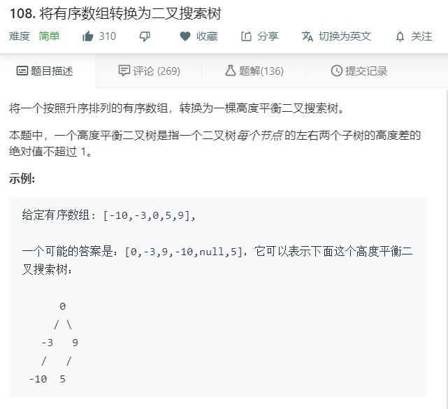


可能有经验的同学，用递归的方式很容易就解出来了。但是，你有想过如何用非递归的方式吗？如果能用非递归来是实现一遍，相信给自己带来的帮助和提升会比递归解大得多。

另外说一句，本系列中所有的代码都是原创的，而且不仅仅给出递归代码，在绝大多数情况下会给出对应的非递归解法，深入地挖掘一道题的最大价值，达到**练习**而不是刷题的效果。

最后的最后，我要强调的是: 对于这种修炼内功的练习，任何视频或者专栏都仅仅只是辅助作用，最重要的是还是自己的坚持和独立思考，如果你通过我这个系列能够让自己的算法能力更上一层楼，或者说能够有所收获，你应该感谢的是你自己。如果觉得这个系列还不错，希望能进[GitHub 地址](https://github.com/sanyuan0704/leetcode-js)，给这个项目点一个 star，非常感谢！

# 链表篇

## 反转链表

反转链表这里一共有三个题目供大家训练。分别是`原地单链表的反转`、`两个一组反转链表`和`K个一组反转链表`，难度由阶梯式上升。

而在面试当中凡是遇到链表，反转类的题目出现的频率也是数一数二的，因此把它当做链表开篇的训练类型，希望大家能引起足够的重视💪。

### No.1 简单的反转链表

反转一个单链表。

示例:

```
输入: 1->2->3->4->5->NULL
输出: 5->4->3->2->1->NULL
复制代码
```

来源: [LeetCode 第 206 题](https://leetcode-cn.com/problems/reverse-linked-list/)

#### 循环解决方案

这道题是链表中的经典题目，充分体现链表这种数据结构`操作思路简单`, 但是`实现上`并没有那么简单的特点。

那在实现上应该注意一些什么问题呢？

保存后续节点。作为新手来说，很容易将当前节点的 `next`指针直接指向前一个节点，但其实当前节点`下一个节点`的指针也就丢失了。因此，需要在遍历的过程当中，先将下一个节点保存，然后再操作`next`指向。

链表结构声定义如下:

```
function ListNode(val) {
  this.val = val;
  this.next = null;
}
复制代码
```

实现如下:

```
/**
 * @param {ListNode} head
 * @return {ListNode}
 */
let reverseList =  (head) => {
    if (!head)
        return null;
    let pre = null, cur = head;
    while (cur) {
        // 关键: 保存下一个节点的值
        let next = cur.next;
        cur.next = pre;
        pre = cur;
        cur = next;
    }
    return pre;
};
复制代码
```

由于逻辑比较简单，代码直接一气呵成。不过仅仅写完还不够，对于链表问题，`边界检查`的习惯能帮助我们进一步保证代码的质量。具体来说:

- 当 head 节点为空时，我们已经处理，通过✅
- 当链表只包含`一个节点`时, 此时我们希望直接返回这个节点，对上述代码而言，进入循环后 `pre` 被赋值为`cur`，也就是`head`，没毛病，通过✅

运行在 LeetCode, 成功 AC ✌

但作为系统性的训练而言，单单让程序通过未免太草率了，我们后续会尽可能地用不同的方式去解决相同的问题，达到`融会贯通`的效果，也是对自己思路的开拓，有时候或许能达到`更优解`。

#### 递归解决方案

由于之前的思路已经介绍得非常清楚了，因此在这我们贴上代码，大家好好体会：

```
let reverseList = (head) =>{
  let reverse = (pre, cur) => {
    if(!cur) return pre;
    // 保存 next 节点
    let next = cur.next;
    cur.next = pre;
    return reverse(cur, next);
  }
  return reverse(null, head);
}
复制代码
```

### No.2 区间反转

反转从位置 m 到 n 的链表。请使用一趟扫描完成反转。

**说明:** 1 ≤ m ≤ n ≤ 链表长度。

**示例:**

```
输入: 1->2->3->4->5->NULL, m = 2, n = 4
输出: 1->4->3->2->5->NULL
复制代码
```

来源: [LeetCode 第 92 题](https://leetcode-cn.com/problems/reverse-linked-list-ii/)

#### 思路

这一题相比上一个整个链表反转的题，其实是`换汤不换药`。我们依然有两种类型的解法：**循环解法**和**递归解法**。

需要注意的问题就是`前后节点`的保存(或者记录)，什么意思呢？看这张图你就明白了。


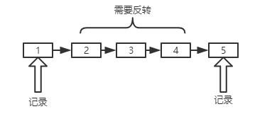


关于前节点和后节点的定义，大家在图上应该能看的比较清楚了，后面会经常用到。

反转操作上一题已经拆解过，这里不再赘述。值得注意的是反转后的工作，那么对于整个区间反转后的工作，其实就是一个`移花接木`的过程，首先将**前节点**的 next 指向区间终点，然后将区间起点的 next 指向**后节点**。因此这一题中有四个需要重视的节点: `前节点`、`后节点`、`区间起点`和`区间终点`。接下来我们开始实际的编码操作。

#### 循环解法

```
/**
 * @param {ListNode} head
 * @param {number} m
 * @param {number} n
 * @return {ListNode}
 */
var reverseBetween = function(head, m, n) {
    let count = n - m;
    let p = dummyHead = new ListNode();
    let pre, cur, start, tail;
    p.next = head;
    for(let i = 0; i < m - 1; i ++) {
        p = p.next;
    }
    // 保存前节点
    front = p;
    // 同时保存区间首节点
    pre = tail = p.next;
    cur = pre.next;
    // 区间反转
    for(let i = 0; i < count; i++) {
        let next = cur.next;
        cur.next = pre;
        pre = cur;
        cur = next;
    }
    // 前节点的 next 指向区间末尾
    front.next = pre;
    // 区间首节点的 next 指向后节点(循环完后的cur就是区间后面第一个节点，即后节点)
    tail.next = cur;
    return dummyHead.next;
};
复制代码
```

#### 递归解法

对于递归解法，唯一的不同就在于对于区间的处理，采用递归程序进行处理，大家也可以趁着复习一下递归反转的实现。

```
var reverseBetween = function(head, m, n) {
  // 递归反转函数
  let reverse = (pre, cur) => {
    if(!cur) return pre;
    // 保存 next 节点
    let next = cur.next;
    cur.next = pre;
    return reverse(cur, next);
  }
  let p = dummyHead = new ListNode();
  dummyHead.next = head;
  let start, end; //区间首尾节点
  let front, tail; //前节点和后节点
  for(let i = 0; i < m - 1; i++) {
    p = p.next;
  }
  front = p; //保存前节点
  start = front.next;
  for(let i = m - 1; i < n; i++) {
    p = p.next;
  }
  end = p;
  tail = end.next; //保存后节点
  end.next = null;
  // 开始穿针引线啦，前节点指向区间首，区间首指向后节点
  front.next = reverse(null, start);
  start.next = tail;
  return dummyHead.next;
}
复制代码
```

### No.3 两个一组翻转链表

给定一个链表，两两交换其中相邻的节点，并返回交换后的链表。

你不能只是单纯的改变节点内部的值，而是需要实际的进行节点交换。

来源: [LeetCode 第 24 题](https://leetcode-cn.com/problems/swap-nodes-in-pairs/)

**示例:**

```
给定 1->2->3->4, 你应该返回 2->1->4->3.
复制代码
```

#### 思路

如图所示，我们首先建立一个虚拟头节点(dummyHead)，辅助我们分析。


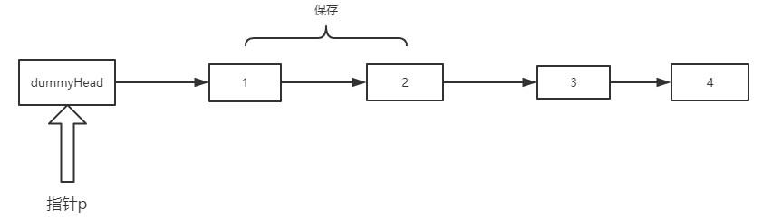


首先让 p 处在 dummyHead 的位置，记录下 p.next 和 p.next.next 的节点，也就是 node1 和 node2。

随后让 **node1.next = node2.next**, 效果:


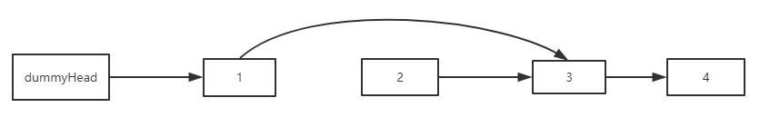


然后让 **node2.next = node1**, 效果:


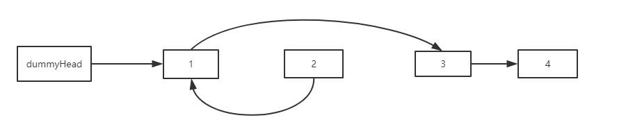


最后，**dummyHead.next = node2**，本次翻转完成。同时 p 指针指向node1, 效果如下：


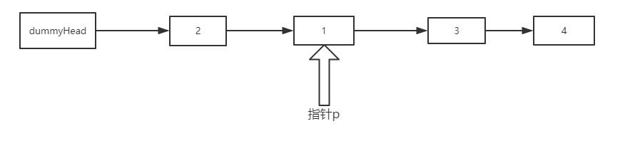


依此循环，如果 `p.next` 或者 `p.next.next` 为空，也就是`找不到新的一组节点`了，循环结束。

#### 循环解决

思路清楚了，其实实现还是比较容易的，代码如下:

```
var swapPairs = function(head) {
    if(head == null || head.next == null) 
        return head;
    let dummyHead = p = new ListNode();
    let node1, node2;
    dummyHead.next = head;
    while((node1 = p.next) && (node2 = p.next.next)) {
        node1.next = node2.next;
        node2.next = node1;
        p.next = node2;
        p = node1;
    }
    return dummyHead.next;
};
复制代码
```

#### 递归方式

```
var swapPairs = function(head) {
    if(head == null || head.next == null)
        return head;
    let node1 = head, node2 = head.next;
    node1.next = swapPairs(node2.next);
    node2.next = node1;
    return node2;
};
复制代码
```

利用递归方式之后，是不是感觉代码特别简洁？😃😃😃

希望你能好好体会一下递归调用的过程，相信理解之后对自己是一个很大的提升。

### No.4 K个一组翻转链表

给你一个链表，每 k 个节点一组进行翻转，请你返回翻转后的链表。

k 是一个正整数，它的值小于或等于链表的长度。

如果节点总数不是 k 的整数倍，那么请将最后剩余的节点保持原有顺序。

示例 :

```
给定这个链表：1->2->3->4->5
当 k = 2 时，应当返回: 2->1->4->3->5
当 k = 3 时，应当返回: 3->2->1->4->5
复制代码
```

说明 :

- 你的算法只能使用常数的额外空间。
- 你不能只是单纯的改变节点内部的值，而是需要实际的进行节点交换。

来源: [LeetCode 第 25 题](https://leetcode-cn.com/problems/reverse-nodes-in-k-group/)

#### 思路

思路类似**No.3**中的两个一组翻转。唯一的不同在于两个一组的情况下每一组只需要反转两个节点，而在 K 个一组的情况下对应的操作是将 `K 个元素`的链表进行反转。

#### 递归解法

这一题我觉得递归的解法更容易理解，因此，先贴上递归方法的代码。

> 以下代码的注释中`首节点`、`尾结点`等概念都是针对反转前的链表而言的。

```
/**
 * @param {ListNode} head
 * @param {number} k
 * @return {ListNode}
 */
var reverseKGroup = function(head, k) {
    let pre = null, cur = head;
    let p = head;
    // 下面的循环用来检查后面的元素是否能组成一组
    for(let i = 0; i < k; i++) {
        if(p == null) return head;
        p = p.next;
    }
    for(let i = 0; i < k; i++){
        let next = cur.next;
        cur.next = pre;
        pre = cur;
        cur = next;
    }
    // pre为本组最后一个节点，cur为下一组的起点
    head.next = reverseKGroup(cur, k);
    return pre;
};
复制代码
```

#### 循环解法

重点都放在注释里面了。

```
var reverseKGroup = function(head, k) {
    let count = 0;
    // 看是否能构成一组，同时统计链表元素个数
    for(let p = head; p != null; p = p.next) {
        if(p == null && i < k) return head;
        count++;
    }
    let loopCount = Math.floor(count / k);
    let p = dummyHead = new ListNode();
    dummyHead.next = head;
    // 分成了 loopCount 组，对每一个组进行反转
    for(let i = 0; i < loopCount; i++) {
        let pre = null, cur = p.next;
        for(let j = 0; j < k; j++) {
            let next = cur.next;
            cur.next = pre;
            pre = cur;
            cur = next;
        }
        // 当前 pre 为该组的尾结点，cur 为下一组首节点
        let start = p.next;// start 是该组首节点
        // 开始穿针引线！思路和2个一组的情况一模一样
        p.next = pre;
        start.next = cur;
        p = start;
    }
    return dummyHead.next;
};
复制代码
```

## 环形链表

### No.1 如何检测链表形成环？

给定一个链表，判断链表中是否形成环。

#### 思路

思路一: 循环一遍，用 Set 数据结构保存节点，利用节点的内存地址来进行判重，如果同样的节点走过两次，则表明已经形成了环。

思路二: 利用快慢指针，快指针一次走两步，慢指针一次走一步，如果`两者相遇`，则表明已经形成了环。

可能你会纳闷，为什么思路二用两个指针在环中一定会相遇呢？

其实很简单，如果有环，两者一定同时走到环中，那么在环中，**选慢指针为参考系**，快指针每次`相对参考系`向前走一步，终究会绕回原点，也就是回到慢指针的位置，从而让两者相遇。如果没有环，则两者的相对距离越来越远，永远不会相遇。

接下来我们来编程实现。

#### 方法一: Set 判重

```
/**
 * @param {ListNode} head
 * @return {boolean}
 */
var hasCycle = (head) => {
    let set = new Set();
    let p = head;
    while(p) {
        // 同一个节点再次碰到，表示有环
        if(set.has(p)) return true;
        set.add(p);
        p = p.next;
    }
    return false;
}
复制代码
```

#### 方法二: 快慢指针

```
var hasCycle = function(head) {
    let dummyHead = new ListNode();
    dummyHead.next = head;
    let fast = slow = dummyHead;
    // 零个结点或者一个结点，肯定无环
    if(fast.next == null || fast.next.next == null) 
        return false;
    while(fast && fast.next) {
        fast = fast.next.next;
        slow = slow.next;
        // 两者相遇了
        if(fast == slow) {
            return true;
        }
    } 
    return false;
};
复制代码
```

### No.2 如何找到环的起点

给定一个链表，返回链表开始入环的第一个节点。 如果链表无环，则返回 null。

**说明：**不允许修改给定的链表。

#### 思路分析

刚刚已经判断了如何判断出现环，那如何找到环的节点呢？我们来分析一波。


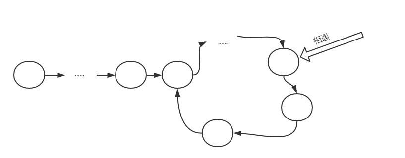


看上去比较繁琐，我们把它做进一步的抽象:


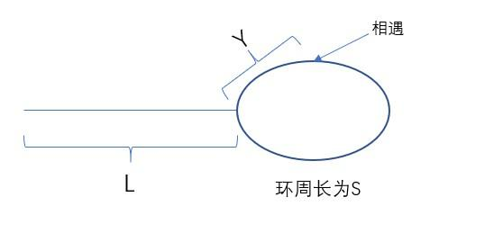


设快慢指针走了`x`秒，慢指针一秒走一次。

对快指针，有: **2x - L = m \* S + Y** -----①

对慢指针，有: **x -  L = n \* S + Y** -----②

其中，m、n 均为自然数。

① - ② * 2 得:

**L = (m - n) \* S - Y**-----③

好，这是一个非常重要的等式。我们现在假设有一个新的指针在 L 段的最左端，慢指针现在还在相遇处。

让`新指针`和`慢指针`都每次走一步，那么，当`新指针`走了 L 步之后**到达环起点**，而与此同时，我们看看`慢指针情况如何`。

由③式，慢指针走了`(m - n) * S - Y`个单位，以环起点为参照物，相遇时的位置为 Y，而现在由`Y + (m - n) * S - Y`即`(m - n) * S`，得知慢指针实际上参照环起点，走了整整(m - n)圈。也就是说，**慢指针此时也到达了环起点**。 :::tip 结论 现在的解法就很清晰了，当快慢指针相遇之后，让新指针从头出发，和慢指针同时前进，且每次前进一步，两者相遇的地方，就是**环起点**。 :::

#### 编程实现

懂得原理之后，实现起来就容易很多了。

```
/**
 * @param {ListNode} head
 * @return {ListNode}
 */
var detectCycle = function(head) {
    let dummyHead = new ListNode();
    dummyHead.next = head;
    let fast = slow = dummyHead;
    // 零个结点或者一个结点，肯定无环
    if(fast.next == null || fast.next.next == null) 
        return null;
    while(fast && fast.next) {
        fast = fast.next.next;
        slow = slow.next;
        // 两者相遇了
        if(fast == slow) {
           let p = dummyHead;
           while(p != slow) {
               p = p.next;
               slow = slow.next;
           }
           return p;
        }
    } 
    return null;
};
复制代码
```

## 链表合并

### No.1 合并两个有序链表

将两个有序链表合并为一个新的有序链表并返回。新链表是通过拼接给定的两个链表的所有节点组成的。

**示例:**

```
输入：1->2->4, 1->3->4
输出：1->1->2->3->4->4
复制代码
```

来源: [LeetCode第21题](https://leetcode-cn.com/problems/merge-two-sorted-lists/)

#### 递归解法

递归解法更容易理解，我们先用递归来做一下:

```
/**
 * @param {ListNode} l1
 * @param {ListNode} l2
 * @return {ListNode}
 */
var mergeTwoLists = function(l1, l2) {
    const merge = (l1, l2) => {
        if(l1 == null) return l2;
        if(l2 == null) return l1;
        if(l1.val > l2.val) {
            l2.next = merge(l1, l2.next);
            return l2;
        }else {
            l1.next = merge(l1.next, l2);
            return l1;
        }
    }
    return merge(l1, l2);
};
复制代码
```

#### 循环解法

```
var mergeTwoLists = function(l1, l2) {
    if(l1 == null) return l2;
    if(l2 == null) return l1;
    let p = dummyHead = new ListNode();
    let p1 = l1, p2 = l2;
    while(p1 && p2) {
        if(p1.val > p2.val) {
            p.next = p2;
            p = p.next;
            p2 = p2.next;
        }else {
            p.next = p1;
            p = p.next;
            p1 = p1.next;
        }
    }
    // 循环完成后务必检查剩下的部分
    if(p1) p.next = p1;
    else p.next = p2;
    return dummyHead.next;
};
复制代码
```

### No.2 合并 K 个有序链表

合并 k 个排序链表，返回合并后的排序链表。请分析和描述算法的复杂度。

**示例:**

```
输入:
[
  1->4->5,
  1->3->4,
  2->6
]
输出: 1->1->2->3->4->4->5->6
复制代码
```

来源: [LeetCode第23题](https://leetcode-cn.com/problems/merge-k-sorted-lists/)

#### 自上而下(递归)实现

```
/**
 * @param {ListNode[]} lists
 * @return {ListNode}
 */
var mergeKLists = function(lists) {
    // 上面已经实现
    var mergeTwoLists = function(l1, l2) {/*上面已经实现*/};
    const _mergeLists = (lists, start, end) => {
        if(end - start < 0) return null;
        if(end - start == 0)return lists[end];
        let mid = Math.floor(start + (end - start) / 2);
        return mergeTwoList(_mergeLists(lists, start, mid), _mergeLists(lists, mid + 1, end));
    }
    return _mergeLists(lists, 0, lists.length - 1);
};
复制代码
```

#### 自下而上实现

在这里需要提醒大家的是，在自下而上的实现方式中，我为每一个链表绑定了一个虚拟头指针(dummyHead)，为什么这么做？

这是为了方便链表的合并，比如 l1 和 l2 合并之后，合并后链表的头指针就直接是 l1 的 dummyHead.next 值，等于说两个链表都合并到了 l1 当中，方便了后续的合并操作。

```
var mergeKLists = function(lists) {
    var mergeTwoLists = function(l1, l2) {/*上面已经实现*/};
    // 边界情况
    if(!lists || !lists.length) return null;
    // 虚拟头指针集合
    let dummyHeads = [];
    // 初始化虚拟头指针
    for(let i = 0; i < lists.length; i++) {
        let node = new ListNode();
        node.next = lists[i];
        dummyHeads[i] = node;
    }
    // 自底向上进行merge
    for(let size = 1; size < lists.length; size += size){
        for(let i = 0; i + size < lists.length;i += 2 * size) {
            dummyHeads[i].next = mergeTwoLists(dummyHeads[i].next, dummyHeads[i + size].next);
        }
    }
    return dummyHeads[0].next;
};
复制代码
```

多个链表的合并到这里就实现完成了，在这里顺便告诉你这种归并的方式同时也是**对链表进行归并排序的核心代码**。希望你能好好体会**自上而下**和**自下而上**两种不同的实现细节，相信对你的编程内功是一个不错的提升。

## 求链表中间节点

### 判断回文链表

请判断一个单链表是否为回文链表。

**示例1:**

```
输入: 1->2
输出: false
复制代码
```

**示例2:**

```
输入: 1->2->2->1
输出: true
复制代码
```

你能否用 O(n) 时间复杂度和 O(1) 空间复杂度解决此题？

来源: [LeetCode第234题](https://leetcode-cn.com/problems/palindrome-linked-list/)

#### 思路分析

这一题如果不考虑性能的限制，其实是非常简单的。但考虑到 O(n) 时间复杂度和 O(1) 空间复杂度，恐怕就值得停下来好好想想了。

题目的要求是单链表，没有办法访问前面的节点，那我们只得另辟蹊径:

找到链表中点，然后将后半部分反转，就可以依次比较得出结论了。下面我们来实现一波。

#### 代码实现

其实关键部分的代码就是找中点了。先亮剑:

```
  let dummyHead = slow = fast = new ListNode();
  dummyHead.next = head;
  // 注意注意，来找中点了
  while(fast && fast.next) {
      slow = slow.next;
      fast = fast.next.next;
  }
复制代码
```

你可能会纳闷了，为什么边界要设成这样？

我们不妨来分析一下，分链表节点个数为`奇数`和`偶数`的时候分别讨论。

- 当链表节点个数为奇数


试着模拟一下， fast 为空的时候，停止循环, 状态如下:


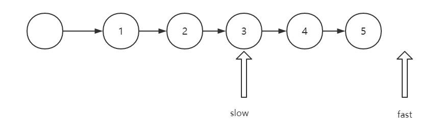


- 当链表节点个数为偶数


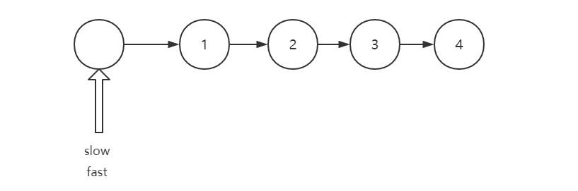

模拟走一遍，当 fast.next 为空的时候，停止循环，状态如下:


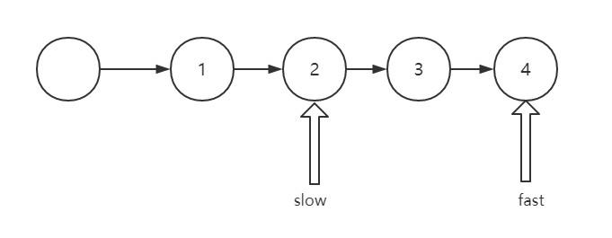


对于 `fast 为空`和`fast.next为空`两个条件，在奇数的情况下，总是 `fast为空`先出现，偶数的情况下，总是`fast.next`先出现.

也就是说: 一旦`fast为空`, 链表节点个数一定为奇数，否则为偶数。因此两种情况可以合并来讨论，当 fast 为空或者 fast.next 为空，循环就可以终止了。

完整实现如下:

```
/**
 * @param {ListNode} head
 * @return {boolean}
 */
var isPalindrome = function(head) {
    let reverse = (pre, cur) => {
        if(!cur) return pre;
        let next = cur.next;
        cur.next = pre;
        return reverse(cur, next);
    }
    let dummyHead = slow = fast = new ListNode();
    dummyHead.next = head;
    // 注意注意，来找中点了, 黄金模板
    while(fast && fast.next) {
        slow = slow.next;
        fast = fast.next.next;
    }
    let next = slow.next;
    slow.next = null;
    let newStart = reverse(null, next);
    for(let p = head, newP = newStart; newP != null; p = p.next, newP = newP.next) {
        if(p.val != newP.val) return false;
    }
    return true;
};
复制代码
```

# 栈和队列篇

## 栈&递归

### 有效括号

给定一个只包括 '('，')'，'{'，'}'，'['，']' 的字符串，判断字符串是否有效。

有效字符串需满足：

左括号必须用相同类型的右括号闭合。 左括号必须以正确的顺序闭合。 注意空字符串可被认为是有效字符串。

**示例**:

```
输入: "()"
输出: true
复制代码
```

来源: [LeetCode第20题](https://leetcode-cn.com/problems/valid-parentheses/)

#### 代码实现

```
/**
 * @param {string} s
 * @return {boolean}
 */
var isValid = function(s) {
    let stack = [];
    for(let i = 0; i < s.length; i++) {
        let ch = s.charAt(i);
        if(ch == '(' || ch == '[' || ch == '{') 
            stack.push(ch);
        if(!stack.length) return false;
        if(ch == ')' && stack.pop() !== '(') return false;
        if(ch == ']' && stack.pop() !== '[' ) return false;
        if(ch == '}' && stack.pop() !== '{') return false;
    }
    return stack.length === 0;
};
复制代码
```

### 多维数组 flatten

将多维数组转化为一维数组。

**示例:**

```
[1, [2, [3, [4, 5]]], 6] -> [1, 2, 3, 4, 5, 6]
复制代码
```

#### 代码实现

```
/**
 * @constructor
 * @param {NestedInteger[]} nestedList
 * @return {Integer[]}
 */
let flatten = (nestedList) => {
    let result = [];
    let fn = function (target, ary) {
        for (let i = 0; i < ary.length; i++) {
            let item = ary[i];
            if (Array.isArray(ary[i])) {
                fn(target, item);
            } else {
                target.push(item);
            }
        }
    }
    fn(result, nestedList)
    return result;

复制代码
```

同时可采用 reduce 的方式, 一行就可以解决，非常简洁。

```
let flatten = (nestedList) =>  nestedList.reduce((pre, cur) => pre.concat(Array.isArray(cur) ? flatten(cur): cur), [])
复制代码
```

## 二叉树层序遍历

`二叉树的层序遍历`本是下一章的内容，但是其中队列的性质又体现得太明显，因此就以这样一类问题来让大家练习队列的相关操作。这里会不仅仅涉及到`普通的层序遍历`, 而且涉及到变形问题，让大家彻底掌握。

### 普通的层次遍历

给定一个二叉树，返回其按层次遍历的节点值。 （即逐层地，从左到右访问所有节点）。

示例:

```
  3
  / \
9  20
  /  \
  15   7
复制代码
```

结果应输出:

```
[
  [3],
  [9,20],
  [15,7]
]
复制代码
```

来源: [LeetCode第102题](https://leetcode-cn.com/problems/binary-tree-level-order-traversal/)

#### 实现

```
/**
 * @param {TreeNode} root
 * @return {number[][]}
 */
var levelOrder = function(root) {
    if(!root) return [];
    let queue = [];
    let res = [];
    let level = 0;
    queue.push(root);
    let temp;
    while(queue.length) {
        res.push([]);
        let size = queue.length;
        // 注意一下: size -- 在层次遍历中是一个非常重要的技巧
        while(size --) {
            // 出队
            let front = queue.shift();
            res[level].push(front.val);
            // 入队
            if(front.left) queue.push(front.left);
            if(front.right) queue.push(front.right);
        }        
        level++;
    }
    return res;
};
复制代码
```

### 二叉树的锯齿形层次遍历

给定一个二叉树，返回其节点值的锯齿形层次遍历。（即先从左往右，再从右往左进行下一层遍历，以此类推，层与层之间交替进行）。

例如：

给定二叉树 [3,9,20,null,null,15,7], 输出应如下:

```
    3
   / \
  9  20
    /  \
   15   7
复制代码
```

返回锯齿形层次遍历如下：

```
[
  [3],
  [20,9],
  [15,7]
]
复制代码
```

来源: [LeetCode第103题](https://leetcode-cn.com/problems/binary-tree-zigzag-level-order-traversal/)

#### 思路

这一题思路稍微不同，但如果把握住层次遍历的思路，就会非常简单。

#### 代码实现

```
var zigzagLevelOrder = function(root) {
    if(!root) return [];
    let queue = [];
    let res = [];
    let level = 0;
    queue.push(root);
    let temp;
    while(queue.length) {
        res.push([]);
        let size = queue.length;
        while(size --) {
            // 出队
            let front = queue.shift();
            res[level].push(front.val);
            if(front.left) queue.push(front.left);
            if(front.right) queue.push(front.right);
        }  
        // 仅仅增加下面一行代码即可
        if(level % 2) res[level].reverse();      
        level++;
    }
    return res;
};
复制代码
```

### 二叉树的右视图

给定一棵二叉树，想象自己站在它的右侧，按照从顶部到底部的顺序，返回从右侧所能看到的节点值。

**示例**:

```
输入: [1,2,3,null,5,null,4]
输出: [1, 3, 4]
解释:

   1            <---
 /   \
2     3         <---
 \     \
  5     4       <---
复制代码
```

来源: [LeetCode第199题](https://leetcode-cn.com/problems/binary-tree-right-side-view/)

#### 思路

右视图？如果你以 DFS 即深度优先搜索的思路来想，你会感觉异常的痛苦。没错，当初我就是这样被坑的:）

但如果用广度优先搜索的思想，即用层序遍历的方式，求解这道题目也变得轻而易举。

#### 代码实现

```
/**
 * @param {TreeNode} root
 * @return {number[]}
 */
var rightSideView = function(root) {
    if(!root) return [];
    let queue = [];
    let res = [];
    queue.push(root);
    while(queue.length) {
        res.push(queue[0].val);
        let size = queue.length;
        while(size --) {
            // 一个size的循环就是一层的遍历，在这一层只拿最右边的结点
            let front = queue.shift();
            if(front.right) queue.push(front.right);
            if(front.left) queue.push(front.left);
        }
    }
    return res;
};
复制代码
```

## 无权图 BFS 遍历

### 完全平方数

给定正整数 n，找到若干个完全平方数（比如 1, 4, 9, 16, ...）使得它们的和等于 n。你需要让组成和的完全平方数的个数最少。

**示例:**

```
输入: n = 12
输出: 3 
解释: 12 = 4 + 4 + 4.
复制代码
```

来源: [LeetCode第279题](https://leetcode-cn.com/problems/perfect-squares/)

#### 思路

这一题其实最容易想到的思路是动态规划，我们放到后面专门来拆解。实际上用队列进行图的建模，也是可以顺利地用广度优先遍历的方式解决的。


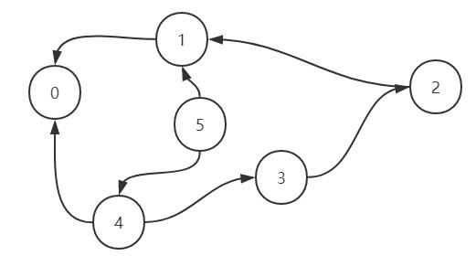


看到这个图，你可能会有点懵，我稍微解释一下你就明白了。

在这个无权图中，每一个点指向的都是它可能经过的上一个节点。举例来说，对 5 而言，可能是 4 加上了`1的平方`转换而来，也可能是1 加上了`2的平方`转换而来，因此跟`1`和`2`都有联系，依次类推。

那么我们现在要做了就是寻找到`从 n 转换到 0 最短的连线数`。

举个例子， n = 8 时，我们需要找到它的邻居节点`4`和`7`，此时到达 4 和到达 7 的步数都为 1, 然后分别从 4 和 7 出发，4 找到邻居节点`3`和`0`，达到 3 和 0 的步数都为 2，考虑到此时已经到达 0，遍历终止，返回到达 0 的步数 2 即可。

Talk is cheap, show me your code. 我们接下来来一步步实现这个寻找的过程。

#### 实现

接下来我们来实现第一版的代码。

```
/**
 * @param {number} n
 * @return {number}
 */
var numSquares = function(n) {
    let queue = [];
    queue.push([n, 0]);
    while(queue.length) {
        let [num, step] = queue.shift();
        for(let i = 1; ; i ++) {
            let nextNum = num - i * i;
            if(nextNum < 0) break;
            // 还差最后一步就到了，直接返回 step + 1
            if(nextNum == 0) return step + 1;
            queue.push([nextNum, step + 1]);
        }
    }
    // 最后是不需要返回另外的值的，因为 1 也是完全平方数，所有的数都能用 1 来组合
};
复制代码
```

这个解法从功能上来讲是没有问题的，但是其中隐藏了巨大的性能问题，你可以去[LeetCode](https://leetcode-cn.com/problems/perfect-squares/submissions/)去测试一下，基本是超时。

那为什么会出现这样的问题？

出就出在这样一行代码:

```
queue.push([nextNum, step + 1]);
复制代码
```

只要是大于 0 的数，统统塞进队列。要知道 2 - 1 = 1， 5 - 4 = 1， 9 - 8 = 1 ......这样会重复非常多的 `1`, 依次类推，也会重复非常多的`2`,`3`等等等等。

这样大量的重复数字不仅仅消耗了更多的循环次数，同时也造成更加巨大的内存空间压力。

因此，我们需要对已经推入队列的数字进行标记，避免重复推入。改善代码如下:

```
var numSquares = function(n) {
    let map = new Map();
    let queue = [];
    queue.push([n, 0]);
    map.set(n, true);
    while(queue.length) {
        let [num, step] = queue.shift();
        for(let i = 1; ; i++) {
            let nextNum = num - i * i;
            if(nextNum < 0) break;
            if(nextNum == 0) return step + 1;
            // nextNum 未被访问过
            if(!map.get(nextNum)){
                queue.push([nextNum, step + 1]);
                // 标记已经访问过
                map.set(nextNum, true);
            }
        }
    }
};
复制代码
```

### 单词接龙

给定两个单词（beginWord 和 endWord）和一个字典，找到从 beginWord 到 endWord 的最短转换序列的长度。转换需遵循如下规则：

- 每次转换只能改变一个字母。
- 转换过程中的中间单词必须是字典中的单词。

说明:

1. 如果不存在这样的转换序列，返回 0。
2. 所有单词具有相同的长度。
3. 所有单词只由小写字母组成。
4. 字典中不存在重复的单词。
5. 你可以假设 beginWord 和 endWord 是非空的，且二者不相同。

**示例**:

```
输入:
beginWord = "hit",
endWord = "cog",
wordList = ["hot","dot","dog","lot","log","cog"]

输出: 5

解释: 一个最短转换序列是 "hit" -> "hot" -> "dot" -> "dog" -> "cog",
     返回它的长度 5。
复制代码
```

来源: [LeetCode第127题](https://leetcode-cn.com/problems/word-ladder/)

#### 思路

这一题是一个更加典型的用图建模的问题。如果每一个单词都是一个节点，那么只要和这个单词仅有一个字母不同，那么就是它的相邻节点。

这里我们可以通过 BFS 的方式来进行遍历。实现如下:

#### 代码实现

```
/**
 * @param {string} beginWord
 * @param {string} endWord
 * @param {string[]} wordList
 * @return {number}
 */
var ladderLength = function(beginWord, endWord, wordList) {
    // 两个单词在图中是否相邻
    const isSimilar = (a, b) => {
        let diff = 0
        for(let i = 0; i < a.length; i++) {
            if(a.charAt(i) !== b.charAt(i)) diff++;
            if(diff > 1) return false; 
        }
        return true;
    }
    let queue = [beginWord];
    let index = wordList.indexOf(beginWord);
    if(index !== -1) wordList.splice(index, 1);
    let res = 2;
    while(queue.length) {
        let size = queue.length;
        while(size --) {
            let front = queue.shift();
            for(let i = 0; i < wordList.length; i++) {
                if(!isSimilar(front, wordList[i]))continue;
                // 找到了
                if(wordList[i] === endWord) {
                    return res;
                }
                else {
                    queue.push(wordList[i]);
                }
                // wordList[i]已经成功推入，现在不需要了，删除即可
                // 这一步性能优化，相当关键，不然100%超时
                wordList.splice(i, 1);
                i --;
            }
        }
        // 步数 +1
        res += 1;
    }
    return 0;
};
复制代码
```

## 实现优先队列

所谓优先队列，就是一种特殊的**队列**, 其底层使用**堆**的结构，使得每次添加或者删除，让队首元素始终是优先级最高的。关于优先级通过什么字段、按照什么样的比较方式来设定，可以由我们自己来决定。

要实现优先队列，首先来实现一个堆的结构。

### 关于堆的说明

可能你以前没有接触过**堆**这种数据结构，但是其实是很简单的一种结构，其本质就是一棵二叉树。但是这棵二叉树比较特殊，除了用数组来依次存储各个节点(节点对应的数组下标和**层序遍历的序号**一致)之外，它需要保证**任何一个父节点的优先级大于子节点**，这也是它最关键的性质，因为保证了根元素一定是优先级最高的。

举一个例子:


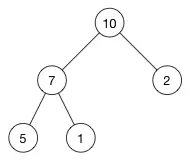


现在这个堆的数组就是: **[10, 7, 2, 5, 1]**

因此也会产生两个非常关键的操作——**siftUp** 和 **siftDown**。

对于**siftUp**操作，我们试想一下现在有一个正常的堆，满足任何父元素优先级大于子元素，这时候向这个堆的数组末尾又添加了一个元素，那现在可能就不符合`堆`的结构特点了。那么现在我将新增的节点和其父节点进行比较，如果父节点优先级小于它，则两者交换，不断向上比较直到根节点为止，这样就保证了**堆**的正确结构。而这样的操作就是**siftUp**。

**siftDown**是与其相反方向的操作，从上到下比较，原理相同，也是为了保证堆的正确结构。

### 实现一个最大堆

最大堆，即堆顶元素为优先级最高的元素。

```
// 以最大堆为例来实现一波
/**
* @param {number[]} nums
* @param {number} k
* @return {number[]}
*/
class MaxHeap {
  constructor(arr = [], compare = null) {
    this.data = arr;
    this.size = arr.length;
    this.compare = compare;
  }
  getSize() {
    return this.size;
  }
  isEmpty() {
    return this.size === 0;
  }
  // 增加元素
  add(value) {
    this.data.push(value);
    this.size++;
    // 增加的时候把添加的元素进行 siftUp
    this._siftUp(this.getSize() - 1);
  }
  // 找到优先级最高的元素
  findMax() {
    if (this.getSize() === 0)
      return;
    return this.data[0];
  }
  // 让优先级最高的元素(即队首元素)出队
  extractMax() {
    // 1.保存队首元素
    let ret = this.findMax();
    // 2.让队首和队尾元素交换位置
    this._swap(0, this.getSize() - 1);
    // 3. 把队尾踢出去，size--
    this.data.pop();
    this.size--;
    // 4. 新的队首 siftDown
    this._siftDown(0);
    return ret;
  }

  toString() {
    console.log(this.data);
  }
  _swap(i, j) {
    [this.data[i], this.data[j]] = [this.data[j], this.data[i]];
  }
  _parent(index) {
    return Math.floor((index - 1) / 2);
  }
  _leftChild(index) {
    return 2 * index + 1;
  }
  _rightChild(index) {
    return 2 * index + 2;
  }
  _siftUp(k) {
    // 上浮操作，只要子元素优先级比父节点大，父子交换位置，一直向上直到根节点
    while (k > 0 && this.compare(this.data[k], this.data[this._parent(k)])) {
      this._swap(k, this._parent(k));
      k = this._parent(k);
    }
  }
  _siftDown(k) {
    // 存在左孩子的时候
    while (this._leftChild(k) < this.size) {
      let j = this._leftChild(k);
      // 存在右孩子而且右孩子比左孩子大
      if (this._rightChild(k) < this.size &&
        this.compare(this.data[this._rightChild(k)], this.data[j])) {
        j++;
      }
      if (this.compare(this.data[k], this.data[j]))
        return;
      // 父节点比子节点小，交换位置
      this._swap(k, j);
      // 继续下沉
      k = j;
    }
  }
}
复制代码
```

### 实现优先队列

有了最大堆作铺垫，实现优先队列就易如反掌，废话不多说，直接放上代码。

```
class PriorityQueue {
  // max 为优先队列的容量
  constructor(max, compare) {
    this.max = max;
    this.compare = compare;
    this.maxHeap = new MaxHeap([], compare);
  }

  getSize() {
    return this.maxHeap.getSize();
  }

  isEmpty() {
    return this.maxHeap.isEmpty();
  }

  getFront() {
    return this.maxHeap.findMax();
  }

  enqueue(e) {
    // 比当前最高的优先级的还要高，直接不处理
    if (this.getSize() === this.max) {
      if (this.compare(e, this.getFront())) return;
      this.dequeue();
    }
    return this.maxHeap.add(e);
  }

  dequeue() {
    if (this.getSize() === 0) return null;
    return this.maxHeap.extractMax();
  }
}
复制代码
```

怎么样，是不是非常简单？传说中的**优先队列**也不过如此。

且慢，可能会有人问: 你怎么保证这个优先队列是正确的呢?

我们不妨来做一下测试:

```
let pq = new PriorityQueue(3);
pq.enqueue(1);
pq.enqueue(333);
console.log(pq.dequeue());
console.log(pq.dequeue());
pq.enqueue(3);
pq.enqueue(6);
pq.enqueue(62);
console.log(pq.dequeue());
console.log(pq.dequeue());
console.log(pq.dequeue());
复制代码
```

结果如下:

```
333
1
62
6
3
复制代码
```

可见，这个优先队列的功能初步满足了我们的预期。后面，我们将通过实际的例子来运用这种数据结构来解决问题。

## 优先队列应用

### 前 K 个高频元素

给定一个非空的整数数组，返回其中出现频率前 k 高的元素。

**示例:**

```
输入: nums = [1,1,1,2,2,3], k = 2
输出: [1,2]
复制代码
```

说明:

- 你可以假设给定的 k 总是合理的，且 1 ≤ k ≤ 数组中不相同的元素的个数。
- 你的算法的时间复杂度必须优于 O(n log n) , n 是数组的大小。

来源: [LeetCode第347题](https://leetcode-cn.com/problems/top-k-frequent-elements/)

#### 思路

首先要做的肯定是统计频率，那之后如何来选取频率前 K 个元素同时又保证时间复杂度小于 O(n log n)呢？

当然，这是一道典型的考察优先队列的题，利用容量为 K 的优先队列每次踢出不符合条件的值，那么最后剩下的即为所求。整个时间复杂度成为 O（n log K），明显是小于 O(n log n) 的。

既然是优先队列，就涉及到如何来定义优先级的问题。

倘若我们以高频率为高优先级，那么队首始终是高频率的元素，因此每次出队是踢出出现频率最高的元素，假设优先队列容量为 K，那照这么做，剩下的是频率最低的 K 个元素，显然不符合题意。

因此，我们需要的是每次出队时踢出**频率最低的元素**，这样最后剩下来的就是频率最高 K 个元素。

是不是我们为了踢出**频率最低的元素**，还要重新写一个小顶堆的实现呢？

完全不需要！就像我刚才所说的，合理地定义这个优先级的比较逻辑即可。接下来我们来具体实现一下。

#### 代码实现

```
var topKFrequent = function(nums, k) {
   let map = {};
   let pq = new PriorityQueue(k, (a, b) => map[a] - map[b] < 0);
   for(let i = 0; i < nums.length; i++) {
       if(!map[nums[i]]) map[nums[i]] = 1;
       else map[nums[i]] = map[[nums[i]]] + 1;
   }
   let arr = Array.from(new Set(nums));
   for(let i = 0; i < arr.length; i++) {
       pq.enqueue(arr[i]);
   }
   return pq.maxHeap.data;
};
复制代码
```

### 合并 K 个排序链表

合并 k 个排序链表，返回合并后的排序链表。请分析和描述算法的复杂度。

**示例:**

```
输入:
[
  1->4->5,
  1->3->4,
  2->6
]
输出: 1->1->2->3->4->4->5->6
复制代码
```

这一题我们之前在**链表篇**实现过，殊不知，它也可以利用优先队列完美解决。

来源: [LeetCode第23题](https://leetcode-cn.com/problems/merge-k-sorted-lists/)

```
/**
 * @param {ListNode[]} lists
 * @return {ListNode}
 */
var mergeKLists = function(lists) {
    let dummyHead = p = new ListNode();
    // 定义优先级的函数，重要！
    let pq = new PriorityQueue(lists.length, (a, b) => a.val <= b.val);
    // 将头结点推入优先队列
    for(let i = 0; i < lists.length; i++) 
        if(lists[i]) pq.enqueue(lists[i]);
    // 取出值最小的节点，如果 next 不为空，继续推入队列
    while(pq.getSize()) {
        let min = pq.dequeue();
        p.next = min;
        p = p.next;
        if(min.next) pq.enqueue(min.next);
    }
    return dummyHead.next;
};
复制代码
```

怎么样，是不是被惊艳到！原来优先队列可以这样来使用！

## 双端队列及应用

### 什么是双端队列？

双端队列是一种特殊的队列，首尾都可以添加或者删除元素，是一种加强版的队列。

JS 中的数组就是一种典型的双端队列。push、pop 方法分别从**尾部**添加和删除元素，unshift、shift 方法分别从**首部**添加和删除元素。

### 滑动窗口最大值

给定一个数组 nums，有一个大小为 k 的滑动窗口从数组的最左侧移动到数组的最右侧。你只可以看到在滑动窗口内的 k 个数字。滑动窗口每次只向右移动一位。

返回滑动窗口中的最大值。

**示例:**

```
输入: nums = [1,3,-1,-3,5,3,6,7], 和 k = 3
输出: [3,3,5,5,6,7] 
解释: 

  滑动窗口的位置                最大值
---------------               -----
[1  3  -1] -3  5  3  6  7       3
 1 [3  -1  -3] 5  3  6  7       3
 1  3 [-1  -3  5] 3  6  7       5
 1  3  -1 [-3  5  3] 6  7       5
 1  3  -1  -3 [5  3  6] 7       6
 1  3  -1  -3  5 [3  6  7]      7
复制代码
```

要求: 时间复杂度应为线性。

来源: [LeetCode第239题](https://leetcode-cn.com/problems/sliding-window-maximum/)

#### 思路

这是典型地使用双端队列求解的问题。

建立一个双端队列 window，每次 push 进来一个新的值，就将 window 中目前`前面所有比它小的值`都删除。利用双端队列的特性，可以从后往前遍历，遇到小的就删除之，否则停止。

这样可以保证队首始终是最大值，因此寻找最大值的时间复杂度可以降到 O(1)。由于 window 中会有越来越多的值被淘汰，因此整体的时间复杂度是线性的。

#### 代码实现

代码非常的简洁，但是如果要写出 bug free 的代码还是有相当的难度的，希望你能自己独立实现一遍。

```
var maxSlidingWindow = function(nums, k) {
    // 异常处理
    if(nums.length === 0 || !k) return [];
    let window = [], res = [];
    for(let i = 0; i < nums.length; i++) {
        // 先把滑动窗口之外的踢出
        if(window[0] !== undefined && window[0] <= i - k) window.shift();
        // 保证队首是最大的
        while(nums[window[window.length - 1]] <= nums[i])  window.pop();
        window.push(i);
        if(i >= k - 1) res.push(nums[window[0]]) 
    }
    return res;
};
复制代码
```

## 栈和队列的相互实现

### 栈实现队列

使用栈实现队列的下列操作：

push(x) -- 将一个元素放入队列的尾部。 pop() -- 从队列首部移除元素。 peek() -- 返回队列首部的元素。 empty() -- 返回队列是否为空。

**示例**:

```
let queue = new MyQueue();

queue.push(1);
queue.push(2);  
queue.peek();  // 返回 1
queue.pop();   // 返回 1
queue.empty(); // 返回 false
复制代码
```

来源: [LeetCode第232题](https://leetcode-cn.com/problems/implement-queue-using-stacks/)

#### 思路

既然栈是**先进后出**, 要想得到**先进先出**的效果，我们不妨用两个栈。

当进行`push`操作时，push 到 `stack1`，而进行`pop`和`peek`的操作时，我们通过`stack2`。

当然这其中有一个特殊情况，就是`stack2`是空，如何来进行`pop`和`peek`? 很简单，把`stack1`中的元素依次 pop 并推入`stack2`中，然后正常地操作 `stack2`即可，如下图所示:


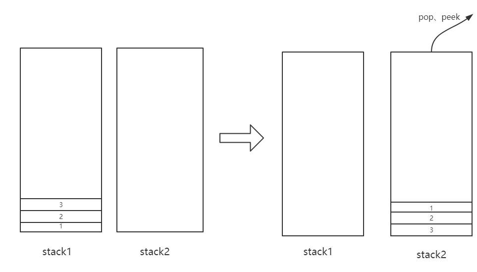


这就就能保证先入先出的效果了。

#### 代码实现

```
var MyQueue = function() {
    this.stack1 = [];
    this.stack2 = [];
};

MyQueue.prototype.push = function(x) {
    this.stack1.push(x);
};
// 将 stack1 的元素转移到 stack2
MyQueue.prototype.transform = function() {
  while(this.stack1.length) {
    this.stack2.push(this.stack1.pop());
  }
}

MyQueue.prototype.pop = function() {
  if(!this.stack2.length) this.transform();
  return this.stack2.pop();
};

MyQueue.prototype.peek = function() {
    if(!this.stack2.length) this.transform();
    return this.stack2[this.stack2.length - 1];
};

MyQueue.prototype.empty = function() {
    return !this.stack1.length && !this.stack2.length;
};
复制代码
```

### 队列实现栈

和上一题的效果刚好相反，用队列`先进先出`的方式来实现`先进后出`的效果。

#### 思路


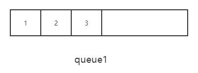


以上面的队列为例，push 操作好说，直接从在队列末尾推入。但 pop 和 peek 呢？

回到我们的目标，我们的目标是拿到队尾的值，也就是`3`。这就好办了，我们让前面的元素统统出队，只留队尾元素即可，剩下的元素让另外一个队列保存。


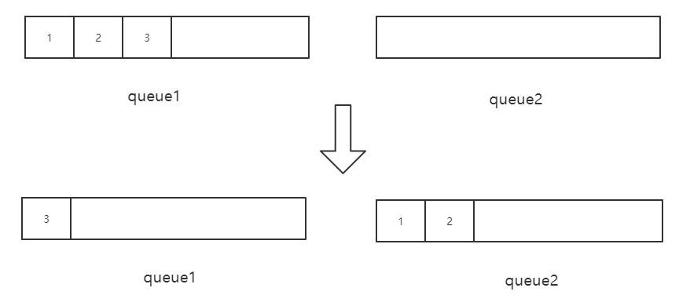


来源: [LeetCode第225题](https://leetcode-cn.com/problems/implement-stack-using-queues/)

#### 代码实现

实现过程中，值得注意的一点是，`queue1 始终保存前面的元素，queue2 始终保存队尾元素（即栈顶元素 ）`。

但是当 push 的时候有一个陷阱，就是当`queue2`已经有元素的时候，不能将新值 push 到 `queue1`，因为此时的**栈顶元素**应该更新。此时对于新的值来说，应先 push 到 queue2， 然后将`旧的栈顶`从queue2出队，推入 `queue1`，这样就实现了**更新栈顶**的操作。

```
var MyStack = function() {
    this.queue1 = [];
    this.queue2 = [];
};
MyStack.prototype.push = function(x) {
    if(!this.queue2.length) this.queue1.push(x);
    else {
        // queue2 已经有值
        this.queue2.push(x);
        // 旧的栈顶移到 queue1 中
        this.queue1.push(this.queue2.shift());
    }

};
MyStack.prototype.transform = function() {
    while(this.queue1.length !== 1) {
        this.queue2.push(this.queue1.shift())
    }
    // queue2 保存了前面的元素
    // 让 queue1 和 queue2 交换
    // 现在queue1 包含前面的元素，queue2 里面就只包含队尾的元素
    let tmp = this.queue1;
    this.queue1 = this.queue2;
    this.queue2 = tmp;
}
MyStack.prototype.pop = function() {
    if(!this.queue2.length) this.transform();
    return this.queue2.shift();
};
MyStack.prototype.top = function() {
    if(!this.queue2.length) this.transform();
    return this.queue2[0];
};
MyStack.prototype.empty = function() {
    return !this.queue1.length && !this.queue2.length;
};
复制代码
```

# 二叉树篇

## 二叉树的遍历

### 前序遍历

**示例:**

```
示例:

输入: [1,null,2,3]  
   1
    \
     2
    /
   3 

输出: [1,2,3]
复制代码
```

来源: [LeetCode第144题](https://leetcode-cn.com/problems/binary-tree-preorder-traversal/)

#### 递归方式

```
/**
 * @param {TreeNode} root
 * @return {number[]}
 */
var preorderTraversal = function(root) {
    let arr = [];
    let traverse = (root) => {
      if(root == null) return;
      arr.push(root.val);
      traverse(root.left);
      traverse(root.right); 
    }
    traverse(root);
    return arr;
};
复制代码
```

#### 非递归方式

```
var preorderTraversal = function(root) {
    if(root == null) return [];
    let stack = [], res = [];
    stack.push(root);
    while(stack.length) {
        let node = stack.pop();
        res.push(node.val);
        // 左孩子后进先出，进行先左后右的深度优先遍历
        if(node.right) stack.push(node.right);
        if(node.left) stack.push(node.left);
    }
    return res;
};
复制代码
```

### 中序遍历

给定一个二叉树，返回它的中序 遍历。

示例:

```
输入: [1,null,2,3]
   1
    \
     2
    /
   3
输出: [1,3,2]
复制代码
```

来源: [LeetCode第94题](https://leetcode-cn.com/problems/binary-tree-inorder-traversal/)

#### 递归方式:

```
/**
 * @param {TreeNode} root
 * @return {number[]}
 */
var inorderTraversal = function(root) {
    let arr = [];
    let traverse = (root) => {
      if(root == null) return;
      traverse(root.left);
      arr.push(root.val);
      traverse(root.right); 
    }
    traverse(root);
    return arr;
};
复制代码
```

#### 非递归方式

```
var inorderTraversal = function(root) {
    if(root == null) return [];
    let stack = [], res = [];
    let p = root;
    while(stack.length || p) {
        while(p) {
            stack.push(p);
            p = p.left;
        }
        let node = stack.pop();
        res.push(node.val);
        p = node.right;
    }   
    return res;
};
复制代码
```

### 后序遍历

给定一个二叉树，返回它的 后序 遍历。

示例:

```
输入: [1,null,2,3]  

   1
    \
     2
    /
   3 

输出: [3,2,1]
复制代码
```

来源: [LeetCode第145题](https://leetcode-cn.com/problems/binary-tree-postorder-traversal/)

#### 递归方式

```
/**
 * @param {TreeNode} root
 * @return {number[]}
 */
var postorderTraversal = function(root) {
    let arr = [];
    let traverse = (root) => {
      if(root == null) return;
      traverse(root.left);
      traverse(root.right);
      arr.push(root.val);
    }
    traverse(root);
    return arr
};
复制代码
```

#### 非递归方式

```
var postorderTraversal = function(root) {
    if(root == null) return [];
    let stack = [], res = [];
    let visited = new Set();
    let p = root;
    while(stack.length || p) {
        while(p) {
            stack.push(p);
            p = p.left;
        }
        let node = stack[stack.length - 1];
        // 如果右孩子存在，而且右孩子未被访问
        if(node.right && !visited.has(node.right)) {
            p = node.right;
            visited.add(node.right);
        } else {
            res.push(node.val);
            stack.pop();
        }
    }
    return res;
};
复制代码
```

## 最大/最小深度

### 最大深度

给定一个二叉树，找出其最大深度。

二叉树的深度为根节点到最远叶子节点的最长路径上的节点数。

**说明:** 叶子节点是指没有子节点的节点。

**示例：** 给定二叉树 [3,9,20,null,null,15,7]：

```
    3
   / \
  9  20
    /  \
   15   7
复制代码
```

返回它的最大深度 3 。 来源: [LeetCode第104题](https://leetcode-cn.com/problems/maximum-depth-of-binary-tree/)

#### 递归实现

实现非常简单，直接贴出代码:

```
/**
 * @param {TreeNode} root
 * @return {number}
 */
var maxDepth = function(root) {
    // 递归终止条件 
    if(root == null) return 0;
    return Math.max(maxDepth(root.left) + 1, maxDepth(root.right) + 1);
};
复制代码
```

#### 非递归实现

采用层序遍历的方式，非常好理解。

```
var maxDepth = function(root) {
    if(root == null) return 0;
    let queue = [root];
    let level = 0;
    while(queue.length) {
        let size = queue.length;
        while(size --) {
            let front = queue.shift();
            if(front.left) queue.push(front.left);
            if(front.right) queue.push(front.right);
        }
        // level ++ 后的值代表着现在已经处理完了几层节点
        level ++;
    }
    return level;
};
复制代码
```

### 最小深度

给定一个二叉树，找出其最小深度。

最小深度是从根节点到最近叶子节点的最短路径上的节点数量。

**说明:** 叶子节点是指没有子节点的节点。

**示例:**

给定二叉树 [3,9,20,null,null,15,7]:

```
    3
   / \
  9  20
    /  \
   15   7
复制代码
```

返回它的最小深度  2.

来源: [LeetCode第111题](https://leetcode-cn.com/problems/minimum-depth-of-binary-tree/)

#### 递归实现

在实现的过程中，如果按照最大深度的方式来做会出现一个陷阱，即:

```
/**
 * @param {TreeNode} root
 * @return {number}
 */
var minDepth = function(root) {
    // 递归终止条件 
    if(root == null) return 0;
    return Math.min(minDepth(root.left) + 1, minDepth(root.right)+1);
};
复制代码
```

当 root 节点有一个孩子为空的时候，此时返回的是 1， 但这是不对的，最小高度指的是**根节点到最近叶子节点**的最小路径，而不是到一个空节点的路径。

因此我们需要做如下的调整:

```
var minDepth = function(root) {
    if(root == null) return 0;
    // 左右孩子都不为空才能像刚才那样调用
    if(root.left && root.right)
        return Math.min(minDepth(root.left), minDepth(root.right)) + 1;
    // 右孩子为空了，直接忽略之
    else if(root.left)
        return minDepth(root.left) + 1;
    // 左孩子为空，忽略
    else if(root.right)
        return minDepth(root.right) + 1;
    // 两个孩子都为空，说明到达了叶子节点，返回 1
    else return 1;
};
复制代码
```

这样程序便能正常工作了。

#### 非递归实现

类似于`最大高度`问题，采用了层序遍历的方式，很容易理解。

```
var minDepth = function(root) {
    if(root == null) return 0;
    let queue = [root];
    let level = 0;
    while(queue.length) {
        let size = queue.length;
        while(size --) {
            let front = queue.shift();
            // 找到叶子节点
            if(!front.left && !front.right) return level + 1;
            if(front.left) queue.push(front.left);
            if(front.right) queue.push(front.right);
        }
        // level ++ 后的值代表着现在已经处理完了几层节点
        level ++;
    }
    return level;
};
复制代码
```

## 对称二叉树

给定一个二叉树，检查它是否是镜像对称的。

例如，二叉树 [1,2,2,3,4,4,3] 是对称的。

```
    1
   / \
  2   2
 / \ / \
3  4 4  3
复制代码
```

但是下面这个 [1,2,2,null,3,null,3] 则不是镜像对称的:

```
    1
   / \
  2   2
   \   \
   3    3
复制代码
```

来源: [LeetCode第101题](https://leetcode-cn.com/problems/symmetric-tree/)

### 递归实现

递归方式的代码是非常干练和优雅的，希望你先自己实现一遍，然后对比改进。

```
/**
 * @param {TreeNode} root
 * @return {boolean}
 */
var isSymmetric = function(root) {
    let help = (node1, node2) => {
        // 都为空
        if(!node1 && !node2) return true;
        // 一个为空一个不为空，或者两个节点值不相等
        if(!node1 || !node2 || node1.val !== node2.val) return false;
        return help(node1.left, node2.right) && help(node1.right, node2.left);
    }
    if(root == null) return true;
    return help(root.left, root.right);
};
复制代码
```

### 非递归实现

用一个队列保存访问过的节点，每次取出两个节点，进行比较。

```
var isSymmetric = function(root) {
    if(root == null) return true;
    let queue = [root.left, root.right];
    let node1, node2;
    while(queue.length) {
        node1 = queue.shift();
        node2 = queue.shift();
        // 两节点均为空
        if(!node1 && !node2)continue;
        // 一个为空一个不为空，或者两个节点值不相等
        if(!node1 || !node2 || node1.val !== node2.val) return false;
        queue.push(node1.left);
        queue.push(node2.right);
        queue.push(node1.right);
        queue.push(node2.left);
    }
    return true;
};
复制代码
```

## LCA 问题

LCA (Lowest Common Ancestor)即最近公共祖先问题。

> 百度百科中最近公共祖先的定义为：“对于有根树 T 的两个结点 p、q，最近公共祖先表示为一个结点 x，满足 x 是 p、q 的祖先且 x 的深度尽可能大（一个节点也可以是它自己的祖先）。”

### 二叉树的最近公共祖先

对于一个普通的二叉树:  root = [3,5,1,6,2,0,8,null,null,7,4]


```
输入: root = [3,5,1,6,2,0,8,null,null,7,4], p = 5, q = 1
输出: 3
解释: 节点 5 和节点 1 的最近公共祖先是节点 3。
复制代码
```

来源: [LeetCode第236题](https://leetcode-cn.com/problems/lowest-common-ancestor-of-a-binary-tree/)

#### 思路分析

思路一: 首先遍历一遍二叉树，记录下每个节点的父节点。然后对于题目给的 p 节点，根据这个记录表不断的找 p 的上层节点，直到根，记录下 p 的**上层节点集合**。然后对于 q 节点，根据记录不断向上找它的上层节点，在寻找的过程中一旦发现**这个上层节点已经包含在刚刚的集合**中，说明发现了最近公共祖先，直接返回。

思路二: 深度优先遍历二叉树，如果当前节点为 p 或者 q，直接返回这个节点，否则查看左右孩子，左孩子中不包含 p 或者 q 则去找右孩子，右孩子不包含 p 或者 q 就去找左孩子，剩下的情况就是**左右孩子中都存在 p 或者 q**, 那么此时直接返回这个节点。

#### 祖先节点集合法

```
/**
 * @param {TreeNode} root
 * @param {TreeNode} p
 * @param {TreeNode} q
 * @return {TreeNode}
 */
var lowestCommonAncestor = function(root, p, q) {
    if(root == null || root == p || root == q) return root;
    let set = new Set();
    let map = new WeakMap();
    let queue = [];
    queue.push(root);
    // 层序遍历
    while(queue.length) {
        let size = queue.length;
        while(size --) {
            let front = queue.shift();
            if(front.left) {
                queue.push(front.left);
                // 记录父亲节点
                map.set(front.left, front);
            }
            if(front.right) {
                queue.push(front.right);
                // 记录父亲节点
                map.set(front.right, front);
            }
        }
    }
    // 构造 p 的上层节点集合
    while(p) {
        set.add(p);
        p = map.get(p);
    }
    while(q) {
        // 一旦发现公共节点重合，直接返回
        if(set.has(q))return q;
        q = map.get(q);
    }
};
复制代码
```

可以看到整棵二叉树遍历了一遍，时间复杂度大致是 O(n)，但是由于哈希表的存在，空间复杂度比较高，接下来我们来用另一种遍历的方式，可以大大减少空间的开销。

#### 深度优先遍历法

代码非常简洁、美观，不过更重要的是体会其中递归调用的过程，代码是自顶向下执行的，我建议大家用**自底向上**的方式来理解它，即从最左下的节点开始分析，相信你会很好的理解整个过程。

```
var lowestCommonAncestor = function(root, p, q) {
    if (root == null || root == p || root == q) return root;
    let left = lowestCommonAncestor(root.left, p, q);
    let right = lowestCommonAncestor(root.right, p, q);
    if(left == null) return right;
    else if(right == null) return left;
    return root;
};
复制代码
```

### 二叉搜索树的最近公共祖先

给定如下二叉搜索树:  root = [6,2,8,0,4,7,9,null,null,3,5]

```
输入: root = [6,2,8,0,4,7,9,null,null,3,5], p = 2, q = 8
输出: 6 
解释: 节点 2 和节点 8 的最近公共祖先是 6。
复制代码
```

来源: [LeetCode第235题](https://leetcode-cn.com/problems/lowest-common-ancestor-of-a-binary-tree/)

#### 实现

二叉搜索树作为一种特殊的二叉树，当然是可以用上述的两种方式来实现的。

不过借助二叉搜索树有序的特性，我们也可以写出另外一个版本的深度优化遍历。

```
/**
 * @param {TreeNode} root
 * @param {TreeNode} p
 * @param {TreeNode} q
 * @return {TreeNode}
 */
var lowestCommonAncestor = function(root, p, q) {
    if(root == null || root == p || root == q) return root;
    // root.val 比 p 和 q 都大，找左孩子
    if(root.val > p.val && root.val > q.val) 
        return lowestCommonAncestor(root.left, p, q);
    // root.val 比 p 和 q 都小，找右孩子
    if(root.val < p.val && root.val < q.val) 
        return lowestCommonAncestor(root.right, p, q);
    else 
        return root;
};
复制代码
```

同时也可以采用非递归的方式:

```
var lowestCommonAncestor = function(root, p, q) {
    let node = root;
    while(node) {
        if(p.val > node.val && q.val > node.val)
            node = node.right;
        else if(p.val < node.val && q.val < node.val) 
            node = node.left;
        else return node;
    }
};
复制代码
```

是不是被二叉树精简而优雅的代码惊艳到了呢？希望你能好好体会其中遍历的过程，然后务必自己独立实现一遍，保证对这种数据结构足够熟悉，增强自己的编程内力。

## 二叉树中的路径问题

### No.1 二叉树的直径

给定一棵二叉树，你需要计算它的直径长度。一棵二叉树的直径长度是任意两个结点路径长度中的最大值。这条路径可能穿过根结点。

示例 : 给定二叉树

```
          1
         / \
        2   3
       / \     
      4   5  
复制代码
```

返回 3, 它的长度是路径 [4,2,1,3] 或者 [5,2,1,3]。

注意：两结点之间的路径长度是以它们之间边的数目表示。

来源: [LeetCode第543题](https://leetcode-cn.com/problems/diameter-of-binary-tree/)

#### 思路

所谓的`求直径`, 本质上是求树中节点左右子树`高度和的最大值`。

注意，这里我说的是`树中节点`, 并非根节点。因为会有这样一种情况:

```
          1
         / 
        2   
       / \     
      4   5
     /     \
    8       6
             \
              7
复制代码
```

那这个时候，直径最大的路径是: 8 -> 4 -> 2-> 5 -> 6 -> 7。交界的元素并不是根节点。这是这个问题特别需要注意的地方，不然无解。

#### 初步求解

目标已经确定了，求树中节点左右子树`高度和的最大值`。开干！

```
/**
 * @param {TreeNode} root
 * @return {number}
 */
var diameterOfBinaryTree = function(root) {
    // 求最大深度
    let maxDepth = (node) => {
      if(node == null) return 0;
      return Math.max(maxDepth(node.left) + 1, maxDepth(node.right) + 1);
    }
    let help = (node) => {
        if(node == null) return 0;
        let rootSum = maxDepth(node.left) + maxDepth(node.right);
        let childSum = Math.max(help(node.left), help(node.right));
        return Math.max(rootSum, childSum);
    }
    if(root == null) return 0;
    return help(root);
};
复制代码
```

这样一段代码放到 LeetCode 是可以通过，但时间上却不让人很满意，为什么呢？

因为在反复调用 maxDepth 的过程，对树中的一些节点增加了很多不必要的访问。比如：

```
          1
         / 
        2   
       / \     
      4   5
     /     \
    8       6
             \
              7
复制代码
```

我们看什么时候访问节点 8，maxDepth(节点 2)的时候访问， maxDepth(节点 4)的时候又会访问，如果节点层级更高，重复访问的次数更加频繁，剩下的节点6、节点 7 都是同理。每一个节点访问的次数大概是 O(logK)(设当前节点在第 K 层)。那能不能把这个频率降到 O(1) 呢？

答案是肯定的，接下来我们来优化这个算法。

#### 优化解法

```
var diameterOfBinaryTree = function(root) {
    let help = (node) => {
        if(node == null) return 0;
        let left = node.left ? help(node.left) + 1: 0;
        let right = node.right ? help(node.right) + 1: 0;
        let cur = left + right;
        if(cur > max) max = cur; 
        // 这个返回的操作相当关键
        return Math.max(left, right);
    }
    let max = 0;
    if(root == null) return 0;
    help(root);
    return max;
};
复制代码
```

在这个过程中设置了一个`max`全局变量，深度优先遍历这棵树，每遍历完一个节点就更新`max`，并通过返回值的方式`自底向上`把当前节点左右子树的最大高度传给父函数使用，使得每个节点只需访问一次即可。

现在提交我们优化后的代码，时间消耗明显降低。

### No.2 二叉树的所有路径

给定一个二叉树，返回所有从根节点到叶子节点的路径。

**说明:** 叶子节点是指没有子节点的节点。

**示例:**

```
输入:

   1
 /   \
2     3
 \
  5

输出: ["1->2->5", "1->3"]
复制代码
```

**解释:** 所有根节点到叶子节点的路径为: 1->2->5, 1->3

来源: [LeetCode第257题](https://leetcode-cn.com/problems/binary-tree-paths/submissions/)

#### 递归解法

利用 DFS(深度优先遍历) 的方式进行遍历。

```
/**
 * @param {TreeNode} root
 * @return {string[]}
 */
var binaryTreePaths = function(root) {
    let path = [];
    let res = [];
    let dfs = (node) => {
        if(node == null) return;
        path.push(node);
        dfs(node.left);
        dfs(node.right);
        if(!node.left && !node.right) 
            res.push(path.map(item => item.val).join('->'));
        // 注意每访问完一个节点记得把它从path中删除，达到回溯效果
        path.pop();
    }
    dfs(root);
    return res;
};
复制代码
```

#### 非递归解法

接下来我们通过`非递归的后序遍历`的方式来实现一下, 顺便复习一下后序遍历的实现。 ::: tip 提示 后序遍历其实也是 DFS 的一种具体实现方式。 :::

```
var binaryTreePaths = function(root) {
    if(root == null) return [];
    let stack = [];
    let p = root;
    let set = new Set();
    res = [];
    while(stack.length || p) {
        while(p) {
            stack.push(p);
            p = p.left;
        }
        let node = stack[stack.length - 1];
        // 叶子节点
        if(!node.right && !node.left) {
            res.push(stack.map(item => item.val).join('->'));
        }
        // 右孩子存在，且右孩子未被访问
        if(node.right && !set.has(node.right)) {
            p = node.right;
            set.add(node.right);
        } else {
            stack.pop();
        }
    }
    return res;
};
复制代码
```

### No.3 二叉树的最大路径和

给定一个非空二叉树，返回其最大路径和。

本题中，路径被定义为一条从树中任意节点出发，达到任意节点的序列。该路径至少包含一个节点，且不一定经过根节点。

**示例**:

```
输入: [-10,9,20,null,null,15,7]

   -10
   / \
  9  20
    /  \
   15   7

输出: 42
复制代码
```

来源: [LeetCode第124题](https://leetcode-cn.com/problems/binary-tree-maximum-path-sum/)

#### 递归解

```
/**
 * @param {TreeNode} root
 * @return {number}
 */
var maxPathSum = function(root) {
    let help = (node) => {
        if(node == null) return 0;
        let left = Math.max(help(node.left), 0);
        let right = Math.max(help(node.right), 0);
        let cur = left + node.val + right;
        // 如果发现某一个节点上的路径值比max还大，则更新max
        if(cur > max) max = cur;
        // left 和 right 永远是"一根筋"，中间不会有转折
        return Math.max(left, right) + node.val;
    }
    let max = Number.MIN_SAFE_INTEGER;
    help(root);
    return max;
};
复制代码
```

## 二叉搜索树

### No.1 验证二叉搜索树

给定一个二叉树，判断其是否是一个有效的二叉搜索树。

假设一个二叉搜索树具有如下特征：

节点的左子树只包含小于当前节点的数。 节点的右子树只包含大于当前节点的数。 所有左子树和右子树自身必须也是二叉搜索树。

**示例 1**:

```
输入:
    2
   / \
  1   3
输出: true
复制代码
```

来源: [LeetCode第98题](https://leetcode-cn.com/problems/validate-binary-search-tree/)

#### 方法一: 中序遍历

通过中序遍历，保存前一个节点的值，扫描到当前节点时，和前一个节点的值比较，如果大于前一个节点，则满足条件，否则不是二叉搜索树。

```
/**
 * @param {TreeNode} root
 * @return {boolean}
 */
var isValidBST = function(root) {
    let prev = null;
    const help = (node) => {
        if(node == null) return true;
        if(!help(node.left)) return false;
        if(prev !== null && prev >= node.val) return false;
        // 保存当前节点，为下一个节点的遍历做准备
        prev = node.val;
        return help(node.right);
    }
    return help(root);
};
复制代码
```

#### 方法二: 限定上下界进行DFS

二叉搜索树每一个节点的值，都有一个**上界和下界**，深度优先遍历的过程中，如果访问左孩子，则通过当前节点的值来**更新左孩子节点的上界**，同时访问右孩子，则**更新右孩子的下界**，只要出现节点值越界的情况，则不满足二叉搜索树的条件。

```
  parent
  /    \
left   right
复制代码
```

假设这是一棵巨大的二叉树的一个部分(parent、left、right都是实实在在的节点)，那么全部的节点排完序一定是这样:

**...left, parent, right...**

可以看到左孩子的`最严格的上界`是该节点, 同时, 右孩子的`最严格的下界`也是该节点。我们按照这样的规则来进行更新上下界。

递归实现:

```
var isValidBST = function(root) {
    const help = (node, max, min) => {
        if(node == null) return true;
        if(node.val >= max || node.val <= min) return false;
        // 左孩子更新上界，右孩子更新下界，相当于边界要求越来越苛刻
        return help(node.left, node.val, min)
                && help(node.right, max, node.val);
    }
    return help(root, Number.MAX_SAFE_INTEGER, Number.MIN_SAFE_INTEGER);
};
复制代码
```

非递归实现:

```
var isValidBST = function(root) {
    if(root == null) return true;
    let stack = [root];
    let min = Number.MIN_SAFE_INTEGER;
    let max = Number.MAX_SAFE_INTEGER;
    root.max = max; root.min = min;
    while(stack.length) {
        let node = stack.pop();
        if(node.val <= node.min || node.val >= node.max)
            return false;
        if(node.left) {
            stack.push(node.left);
            // 更新上下界
            node.left.max = node.val;
            node.left.min = node.min;
        }
        if(node.right) {
            stack.push(node.right);
            // 更新上下界
            node.right.max = node.max;
            node.right.min = node.val;
        }
    }
    return true;
};
复制代码
```

### No.2 将有序数组转换为二叉搜索树

将一个按照升序排列的有序数组，转换为一棵高度平衡二叉搜索树。

本题中，一个高度平衡二叉树是指一个二叉树每个节点 的左右两个子树的高度差的绝对值不超过 1。

**示例:**

```
给定有序数组: [-10,-3,0,5,9],

一个可能的答案是：[0,-3,9,-10,null,5]，它可以表示下面这个高度平衡二叉搜索树：

      0
     / \
   -3   9
   /   /
 -10  5
复制代码
```

来源: [LeetCode第108题](https://leetcode-cn.com/problems/convert-sorted-array-to-binary-search-tree/)

#### 递归实现

```
/**
 * @param {number[]} nums
 * @return {TreeNode}
 */
var sortedArrayToBST = function(nums) {
    let help = (start, end) => {
        if(start > end) return null;
        if(start === end) return new TreeNode(nums[start]);
        let mid = Math.floor((start + end) / 2);
        // 找出中点建立节点
        let node = new TreeNode(nums[mid]);
        node.left = help(start, mid - 1);
        node.right = help(mid + 1, end);
        return node;
    }
    return help(0, nums.length - 1);
};
复制代码
```

递归程序比较好理解，不断地调用 help 完成整棵树树的构建。那如何用非递归来解决呢？我觉得这是一个非常值得大家思考的问题。希望你能动手试一试，如果实在想不出来，可以参考下面我写的非递归版本。

其实思路跟递归的版本是一样的，只不过实现起来是用栈来实现 DFS 的效果。

```
/**
 * @param {number[]} nums
 * @return {TreeNode}
 */
var sortedArrayToBST = function(nums) {
    if(nums.length === 0) return null;
    let mid = Math.floor(nums.length / 2);
    let root = new TreeNode(nums[mid]);
    // 说明: 1. index 指的是当前元素在数组中的索引 
    //      2. 每一个节点的值都是区间中点，那么 start 属性就是这个区间的起点，end 为其终点
    root.index = mid; root.start = 0; root.end = nums.length - 1;
    let stack = [root];
    while(stack.length) {
        let node = stack.pop();
        // node 出来了，它本身包含了一个区间，[start, ..., index, ... end]
        // 下面判断[node.start, node.index - 1]之间是否还有开发的余地
        if(node.index - 1 >= node.start) {
            let leftMid = Math.floor((node.start + node.index)/2);
            let leftNode = new TreeNode(nums[leftMid]);
            node.left = leftNode;
            // 初始化新节点的区间起点、终点和索引
            leftNode.start = node.start;
            leftNode.end = node.index - 1;
            leftNode.index = leftMid;
            stack.push(leftNode);
        }
        // 中间夹着node.index, 已经有元素了，这个位置不能再开发
        // 下面判断[node.index + 1, node.end]之间是否还有开发的余地
        if(node.end >= node.index + 1) {
            let rightMid = Math.floor((node.index + 1 + node.end)/2);
            let rightNode = new TreeNode(nums[rightMid]);
            node.right = rightNode;
            // 初始化新节点的区间起点、终点和索引
            rightNode.start = node.index + 1; 
            rightNode.end = node.end;
            rightNode.index = rightMid;
            stack.push(rightNode);
        }
    }
    return root;
};
复制代码
```

### No.3 二叉树展开为链表

给定一个二叉(搜索)树，原地将它展开为链表。

例如，给定二叉树

```
    1
   / \
  2   5
 / \   \
3   4   6
复制代码
```

将其展开为：

```
1
 \
  2
   \
    3
     \
      4
       \
        5
         \
          6
复制代码
```

来源: [LeetCode第114题](https://leetcode-cn.com/problems/flatten-binary-tree-to-linked-list/submissions/)

#### 递归方式

采用后序遍历，遍历完左右孩子我们要做些什么呢？用下面的图来演示一下(**点击可放大**)：


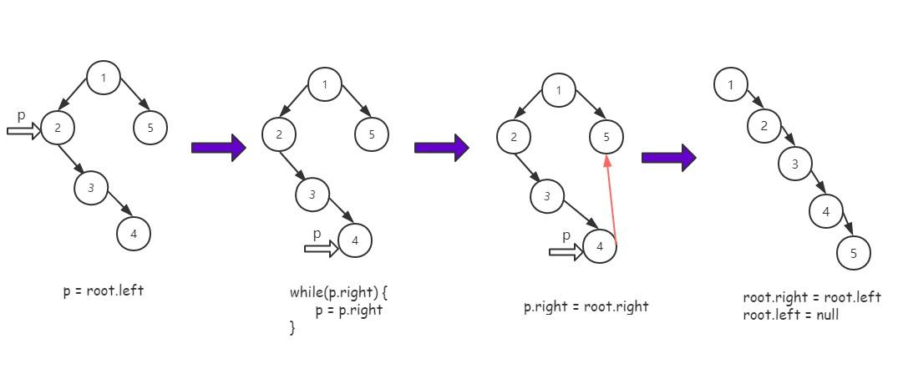


```
/**
 * @param {TreeNode} root
 * @return {void} Do not return anything, modify root in-place instead.
 */
var flatten = function(root) {
    if(root == null) return;
    flatten(root.left);
    flatten(root.right);
    if(root.left) {
        let p = root.left;
        while(p.right) {
            p = p.right;
        }
        p.right = root.right;
        root.right = root.left;
        root.left = null;
    }
};
复制代码
```

#### 非递归方式

采用非递归的后序遍历方式，思路跟之前的完全一样。

```
var flatten = function(root) {
    if(root == null) return;
    let stack = [];
    let visited = new Set();
    let p = root;
    // 开始后序遍历
    while(stack.length || p) {
        while(p) {
            stack.push(p);
            p = p.left;
        }
        let node = stack[stack.length - 1];
        // 如果右孩子存在，而且右孩子未被访问
        if(node.right && !visited.has(node.right)) {
            p = node.right;
            visited.add(node.right);
        } else {
            // 以下为思路图中关键逻辑
            if(node.left) {
                let p = node.left;
                while(p.right) {
                    p = p.right;
                }
                p.right = node.right;
                node.right = node.left;
                node.left = null;
            }
            stack.pop();
        }
    }
};
复制代码
```

### No.4 不同的二叉搜索树II

给定一个整数 n，生成所有由 1 ... n 为节点所组成的二叉搜索树。

**示例:**

```
输入: 3
输出:
[
  [1,null,3,2],
  [3,2,null,1],
  [3,1,null,null,2],
  [2,1,3],
  [1,null,2,null,3]
]
解释:
以上的输出对应以下 5 种不同结构的二叉搜索树：

   1         3     3      2      1
    \       /     /      / \      \
     3     2     1      1   3      2
    /     /       \                 \
   2     1         2                 3
复制代码
```

来源: [LeetCode第95题](https://leetcode-cn.com/problems/unique-binary-search-trees-ii/submissions/)

#### 递归解法

递归创建子树

```
/**
 * @param {number} n
 * @return {TreeNode[]}
 */
var generateTrees = function(n) {
    let help = (start, end) => {
        if(start > end) return [null];
        if(start === end) return [new TreeNode(start)];
        let res = [];
        for(let i = start; i <= end; i++) {
            // 左孩子集
            let leftNodes = help(start, i - 1);
            // 右孩子集
            let rightNodes = help(i + 1, end);
            for(let j = 0; j < leftNodes.length; j++) {
                for(let k = 0; k < rightNodes.length; k++) {
                    let root = new TreeNode(i);
                    root.left = leftNodes[j];
                    root.right = rightNodes[k];
                    res.push(root);
                }
            }
        }
        return res;
    }
    if(n == 0) return [];
    return help(1, n);
};
复制代码
```

#### 非递归解法

```
var generateTrees = function(n) {
    let clone = (node, offset) => {
        if(node == null) return null;
        let newnode = new TreeNode(node.val + offset);
        newnode.left = clone(node.left, offset);
        newnode.right = clone(node.right, offset);
        return newnode;
    }
    if(n == 0) return [];
    let dp = [];
    dp[0] = [null];
    // i 是子问题中的节点个数，子问题: [1], [1,2], [1,2,3]...逐步递增，直到[1,2,3...,n]
    for(let i = 1; i <= n; i++) {
        dp[i] = [];
        for(let j = 1; j <= i; j++) {
            // 左子树集
            for(let leftNode of dp[j - 1]) {
                // 右子树集
                for(let rightNode of dp[i - j]) {
                    let node = new TreeNode(j);
                    // 左子树结构共享
                    node.left = leftNode;
                    // 右子树无法共享，但可以借用节点个数相同的树，每个节点增加一个偏移量
                    node.right = clone(rightNode, j);
                    dp[i].push(node);
                }
            }
        }
    }
    return dp[n];
};
复制代码
```

这一次的分享就到这里了。可以看到数据结构和算法是知识是多么庞大，不过在这个系列的驱动下，相信你一定能拿下`数据结构和算法`这一板块的知识体系，下面是本系列的`github仓库`，供大家参考学习，我们下期再见。

[github仓库](https://github.com/sanyuan0704/leetcode-js)

[本系列在线阅读地址](http://47.98.159.95/leetcode-js/)

另外本人的博客现在已经分类整理完毕，地址在这里，[点击打开](https://github.com/sanyuan0704/my_blog)。


作者：神三元
链接：https://juejin.cn/post/6844904061947346957
来源：掘金
著作权归作者所有。商业转载请联系作者获得授权，非商业转载请注明出处。