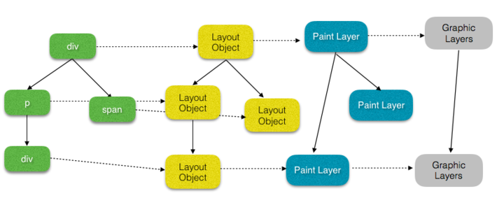

# [无线性能优化：Composite](https://fed.taobao.org/blog/2016/04/26/performance-composite)

一个 Web 页面的展示，简单来说可以认为经历了以下下几个步骤。


- JavaScript：一般来说，我们会使用 JavaScript 来实现一些视觉变化的效果。比如做一个动画或者往页面里添加一些 DOM 元素等。

- Style：计算样式，这个过程是根据 CSS 选择器，对每个 DOM 元素匹配对应的 CSS 样式。这一步结束之后，就确定了每个 DOM 元素上该应用什么 CSS 样式规则。

- Layout：布局，上一步确定了每个 DOM 元素的样式规则，这一步就是具体计算每个 DOM 元素最终在屏幕上显示的大小和位置。web 页面中元素的布局是相对的，因此一个元素的布局发生变化，会联动地引发其他元素的布局发生变化。比如，`<body>` 元素的宽度的变化会影响其子元素的宽度，其子元素宽度的变化也会继续对其孙子元素产生影响。因此对于浏览器来说，布局过程是经常发生的。

- Paint：绘制，本质上就是填充像素的过程。包括绘制文字、颜色、图像、边框和阴影等，也就是一个 DOM 元素所有的可视效果。一般来说，这个绘制过程是在多个层上完成的。

- Composite：渲染层合并，由上一步可知，对页面中 DOM 元素的绘制是在多个层上进行的。在每个层上完成绘制过程之后，浏览器会将所有层按照合理的顺序合并成一个图层，然后显示在屏幕上。对于有位置重叠的元素的页面，这个过程尤其重要，因为一旦图层的合并顺序出错，将会导致元素显示异常。


当然，本文我们只来关注 Composite 部分。


## 浏览器渲染原理


在讨论 Composite 之前，有必要先简单了解下一些浏览器（本文只是针对 Chrome 来说）的渲染原理，方便对之后一些概念的理解。更多详细的内容可以参阅 [GPU Accelerated Compositing in Chrome](http://www.chromium.org/developers/design-documents/gpu-accelerated-compositing-in-chrome)


注：由于 Chrome 对 Blank 引擎某些实现的修改，某些我们之前熟知的类名有了变化，比如 RenderObject 变成了 LayoutObject，RenderLayer 变成了 PaintLayer。感兴趣的看以参阅 [Slimming Paint](https://www.chromium.org/blink/slimming-paint)。


在浏览器中，页面内容是存储为由 Node 对象组成的树状结构，也就是 DOM 树。每一个 HTML element 元素都有一个 Node 对象与之对应，DOM 树的根节点永远都是 Document Node。这一点相信大家都很熟悉了，但其实，从 DOM 树到最后的渲染，需要进行一些转换映射。





### 从 Nodes 到 LayoutObjects


DOM 树中得每个 Node 节点都有一个对应的 LayoutObject 。LayoutObject 知道如何在屏幕上 paint Node 的内容。


### 从 LayoutObjects 到 PaintLayers


一般来说，拥有相同的坐标空间的 LayoutObjects，属于同一个渲染层（PaintLayer）。PaintLayer 最初是用来实现 [stacking contest（层叠上下文）](https://developer.mozilla.org/zh-CN/docs/Web/Guide/CSS/Understanding_z_index/The_stacking_context)，以此来保证页面元素以正确的顺序合成（composite），这样才能正确的展示元素的重叠以及半透明元素等等。因此满足形成层叠上下文条件的 LayoutObject 一定会为其创建新的渲染层，当然还有其他的一些特殊情况，为一些特殊的 LayoutObjects 创建一个新的渲染层，比如 `overflow != visible` 的元素。根据创建 PaintLayer 的原因不同，可以将其分为常见的 3 类：


- NormalPaintLayer

- 根元素（HTML）

- 有明确的定位属性（relative、fixed、sticky、absolute）

- 透明的（opacity 小于 1）

- 有 CSS 滤镜（fliter）

- 有 CSS mask 属性

- 有 CSS mix-blend-mode 属性（不为 normal）

- 有 CSS transform 属性（不为 none）

- backface-visibility 属性为 hidden

- 有 CSS reflection 属性

- 有 CSS column-count 属性（不为 auto）或者 有 CSS column-width 属性（不为 auto）

- 当前有对于 opacity、transform、fliter、backdrop-filter 应用动画

- OverflowClipPaintLayer

- overflow 不为 visible

- NoPaintLayer

- 不需要 paint 的 PaintLayer，比如一个没有视觉属性（背景、颜色、阴影等）的空 div。


满足以上条件的 LayoutObject 会拥有独立的渲染层，而其他的 LayoutObject 则和其第一个拥有渲染层的父元素共用一个。


### 从 PaintLayers 到 GraphicsLayers


某些特殊的渲染层会被认为是合成层（Compositing Layers），合成层拥有单独的 GraphicsLayer，而其他不是合成层的渲染层，则和其第一个拥有 GraphicsLayer 父层公用一个。


每个 GraphicsLayer 都有一个 GraphicsContext，GraphicsContext 会负责输出该层的位图，位图是存储在共享内存中，作为纹理上传到 GPU 中，最后由 GPU 将多个位图进行合成，然后 draw 到屏幕上，此时，我们的页面也就展现到了屏幕上。


渲染层提升为合成层的原因有一下几种：


注：渲染层提升为合成层有一个先决条件，该渲染层必须是 SelfPaintingLayer（基本可认为是上文介绍的 NormalPaintLayer）。以下所讨论的渲染层提升为合成层的情况都是在该渲染层为 SelfPaintingLayer 前提下的。


- 直接原因（direct reason）

- 硬件加速的 iframe 元素（比如 iframe 嵌入的页面中有合成层）[demo](http://taobaofed.github.io/demo/performance-composite-demo/layer-create/direct/iframe.html?spm=taofed.bloginfo.blog.4.343d5ac8Di8l9N)

- video 元素

- 覆盖在 video 元素上的视频控制栏

- 3D 或者 硬件加速的 2D Canvas 元素

- [demo：普通 2D Canvas 不会提升为合成层](http://taobaofed.github.io/demo/performance-composite-demo/layer-create/direct/canvas.html?spm=taofed.bloginfo.blog.5.343d5ac8Di8l9N)

- [demo：3D Canvas 提升为合成层](http://taobaofed.github.io/demo/performance-composite-demo/layer-create/direct/webgl.html)

- 硬件加速的插件，比如 flash 等等

- 在 DPI 较高的屏幕上，fix 定位的元素会自动地被提升到合成层中。但在 DPI 较低的设备上却并非如此，因为这个渲染层的提升会使得字体渲染方式由子像素变为灰阶（详细内容请参考：[Text Rendering](http://www.html5rocks.com/en/tutorials/internals/antialiasing-101/?redirect_from_locale=zh#toc-text-rendering)）

- 有 3D transform

- backface-visibility 为 hidden

- 对 opacity、transform、fliter、backdropfilter 应用了 animation 或者 transition（需要是 active 的 animation 或者 transition，当 animation 或者 transition 效果未开始或结束后，提升合成层也会失效）

- [demo：animation](http://taobaofed.github.io/demo/performance-composite-demo/layer-create/direct/animation.html)

- [demo：transition](http://taobaofed.github.io/demo/performance-composite-demo/layer-create/direct/transition.html)


- will-change 设置为 opacity、transform、top、left、bottom、right（其中 top、left 等需要设置明确的定位属性，如 relative 等）[demo](http://taobaofed.github.io/demo/performance-composite-demo/layer-create/direct/will-change.html)

- 后代元素原因

- 有合成层后代同时本身有 transform、opactiy（小于 1）、mask、fliter、reflection 属性 [demo](http://taobaofed.github.io/demo/performance-composite-demo/layer-create/descendant/combo.html?spm=taofed.bloginfo.blog.11.343d5ac8Di8l9N)

- 有合成层后代同时本身 overflow 不为 visible（如果本身是因为明确的定位因素产生的 SelfPaintingLayer，则需要 z-index 不为 auto） [demo](http://taobaofed.github.io/demo/performance-composite-demo/layer-create/descendant/overflow.html)

- 有合成层后代同时本身 fixed 定位 [demo](http://taobaofed.github.io/demo/performance-composite-demo/layer-create/descendant/fixed.html)

- 有 3D transfrom 的合成层后代同时本身有 preserves-3d 属性 [demo](http://taobaofed.github.io/demo/performance-composite-demo/layer-create/descendant/preserves-3d.html)

- 有 3D transfrom 的合成层后代同时本身有 perspective 属性 [demo](http://taobaofed.github.io/demo/performance-composite-demo/layer-create/descendant/perspective.html)

- overlap 重叠原因
  为什么会因为重叠原因而产生合成层呢？举个简单的栗子。
  
  蓝色的矩形重叠在绿色矩形之上，同时它们的父元素是一个 GraphicsLayer。此时假设绿色矩形为一个 GraphicsLayer，如果 overlap 无法提升合成层的话，那么蓝色矩形不会提升为合成层，也就会和父元素公用一个 GraphicsLayer。
  
  此时，渲染顺序就会发生错误，因此为保证渲染顺序，overlap 也成为了合成层产生的原因，也就是如下的正常情形。
  
  当然 overlap 的原因也会细分为几类，接下来我们会详细看下。

- 重叠或者说部分重叠在一个合成层之上。
  那如何算是重叠呢，最常见和容易理解的就是元素的 border box（content + padding + border） 和合成层的有重叠，比如：[demo](http://taobaofed.github.io/demo/performance-composite-demo/layer-create/overlap/normal.html)，当然 margin area 的重叠是无效的（[demo](http://taobaofed.github.io/demo/performance-composite-demo/layer-create/overlap/margin.html)）。其他的还有一些不常见的情况，也算是同合成层重叠的条件，如下：

- filter 效果同合成层重叠 [demo](http://taobaofed.github.io/demo/performance-composite-demo/layer-create/overlap/filter.html)

- transform 变换后同合成层重叠 [demo](http://taobaofed.github.io/demo/performance-composite-demo/layer-create/overlap/transform.html)

- overflow scroll 情况下同合成层重叠。即如果一个 overflow scroll（不管 `overflow:auto` 还是 `overflow:scrill`，只要是能 scroll 即可） 的元素同一个合成层重叠，则其可视子元素也同该合成层重叠 [demo](http://taobaofed.github.io/demo/performance-composite-demo/layer-create/overlap/overflow.html)

- 假设重叠在一个合成层之上（assumedOverlap）。
  这个原因听上去有点虚，什么叫假设重叠？其实也比较好理解，比如一个元素的 CSS 动画效果，动画运行期间，元素是有可能和其他元素有重叠的。针对于这种情况，于是就有了 assumedOverlap 的合成层产生原因，示例可见：[demo](http://taobaofed.github.io/demo/performance-composite-demo/layer-create/overlap/animation.html)。在本 demo 中，动画元素视觉上并没有和其兄弟元素重叠，但因为 assumedOverlap 的原因，其兄弟元素依然提升为了合成层。
  需要注意的是该原因下，有一个很特殊的情况：
  如果合成层有内联的 transform 属性，会导致其兄弟渲染层 assume overlap，从而提升为合成层。比如：[demo](http://taobaofed.github.io/demo/performance-composite-demo/layer-create/overlap/inline.html)。


#### 层压缩


基本上常见的一些合成层的提升原因如上所说，你会发现，由于重叠的原因，可能随随便便就会产生出大量合成层来，而每个合成层都要消耗 CPU 和内存资源，岂不是严重影响页面性能。这一点浏览器也考虑到了，因此就有了层压缩（Layer Squashing）的处理。如果多个渲染层同一个合成层重叠时，这些渲染层会被压缩到一个 GraphicsLayer 中，以防止由于重叠原因导致可能出现的“层爆炸”。具体可以看如下 [demo](http://taobaofed.github.io/demo/performance-composite-demo/squash/squash-hover.html)。一开始，蓝色方块由于
`translateZ` 提升为了合成层，其他的方块元素因为重叠的原因，被压缩了一起，大小就是包含这 3 个方块的矩形大小。


当我们 hover 绿色方块时，会给其设置 `translateZ` 属性，导致绿色方块也被提升为合成层，则剩下的两个被压缩到了一起，大小就缩小为包含这 2 个方块的矩形大小。


当然，浏览器的自动的层压缩也不是万能的，有很多特定情况下，浏览器是无法进行层压缩的，如下所示，而这些情况也是我们应该尽量避免的。（注：以下情况都是基于重叠原因而言）


- 无法进行会打破渲染顺序的压缩（squashingWouldBreakPaintOrder）

  示例如下：

  demo

  ```
  <style>
    #ancestor {
      -webkit-mask-image: -webkit-linear-gradient(rgba(0,0,0,1), rgba(0,0,0,0));
    }
    
    #composited {
      width: 100%;
      height: 100%;
      transform: translateZ(0);
    }
  
    #container {
      position: relative;
      width: 400px;
      height: 60px;
      border: 1px solid black;
    }
  
    #overlap-child {
      position: absolute;
      left: 0;
      top: 0 ;
      bottom: 0px;
      width: 100%;
      height: 60px;
      background-color: orange;
    }
  </style>
  
  <div id="container">
    <div id="composited">Text behind the orange box.</div>
    <div id="ancestor">
      <div id="overlap-child"></div>
    </div>
  </div>
  ```

  在本例中，`#overlap-child`同合成层重叠，如果进行压缩，会导致渲染顺序的改变，其父元素`#ancestor`的 mask 属性将失效，因此类似这种情况下，是无法进行层压缩的。目前常见的产生这种原因的情况有两种，一种是上述的祖先元素使用 mask 属性的情况，另一种是祖先元素使用 filter 属性的情况（

  demo

  ）。

- video 元素的渲染层无法被压缩同时也无法将别的渲染层压缩到 video 所在的合成层上（squashingVideoIsDisallowed）[demo](http://taobaofed.github.io/demo/performance-composite-demo/squash/video.html)

- iframe、plugin 的渲染层无法被压缩同时也无法将别的渲染层压缩到其所在的合成层上（squashingLayoutPartIsDisallowed）[demo](http://taobaofed.github.io/demo/performance-composite-demo/squash/layoutpart.html)

- 无法压缩有 reflection 属性的渲染层（squashingReflectionDisallowed）[demo](http://taobaofed.github.io/demo/performance-composite-demo/squash/reflection.html)

- 无法压缩有 blend mode 属性的渲染层（squashingBlendingDisallowed）[demo](http://taobaofed.github.io/demo/performance-composite-demo/squash/blend-mode.html)

- 当渲染层同合成层有不同的裁剪容器（clipping container）时，该渲染层无法压缩（squashingClippingContainerMismatch）。

  示例如下：

  demo

  ```
  <style>
    .clipping-container {
  
      overflow: hidden;
      height: 10px; 
      background-color: blue;
    }
  
    .composited {
  
      transform: translateZ(0); 
      height: 10px; 
      background-color: red;
    }
  
    .target {
  
      position:absolute; 
      top: 0px; 
      height:100px; 
      width:100px; 
      background-color: green;
      color: #fff;
    }
  </style>
  
  <div class="clipping-container">
    <div class="composited"></div>
  </div>
  <div class="target">不会被压缩到 composited div 上</div>
  ```

  本例中

   

  ```
  .target
  ```

   

  同 合成层

   

  ```
  .composited
  ```

   

  重叠，但是由于

   

  ```
  .composited
  ```

   

  在一个

   

  ```
  overflow: hidden
  ```

   

  的容器中，导致

   

  ```
  .target
  ```

   

  和合成层有不同的裁剪容器，从而

   

  ```
  .target
  ```

   

  无法被压缩。

- 相对于合成层滚动的渲染层无法被压缩（scrollsWithRespectToSquashingLayer）

  示例如下：

  demo

  ```
  <style>
    body {
      height: 1500px;
      overflow-x: hidden;
    }
  
    .composited {
  
      width: 50px;
      height: 50px;
      background-color: red;
      position: absolute;
      left: 50px;
      top: 400px;
      transform: translateZ(0);
    }
  
    .overlap {
      width: 200px;
      height: 200px;
      background-color: green;
      position: fixed;
      left: 0px;
      top: 0px;
    }
  </style>
  
  <div class="composited"></div>
  <div class="overlap"></div>
  ```

  本例中，红色的

   

  ```
  .composited
  ```

   

  提升为了合成层，绿色的

   

  ```
  .overlap
  ```

   

  fix 在页面顶部，一开始只有

   

  ```
  .composited
  ```

   

  合成层。

  

  当滑动页面，

  ```
  .overlap
  ```

   

  重叠到

   

  ```
  .composited
  ```

   

  上时，

  ```
  .overlap
  ```

   

  会因重叠原因提升为合成层，同时，因为相对于合成层滚动，因此无法被压缩。

  

- 当渲染层同合成层有不同的具有 opacity 的祖先层（一个设置了 opacity 且小于 1，一个没有设置 opacity，也算是不同）时，该渲染层无法压缩（squashingOpacityAncestorMismatch，同 squashingClippingContainerMismatch）[demo](http://taobaofed.github.io/demo/performance-composite-demo/squash/squashingOpacityAncestorMismatch.html)

- 当渲染层同合成层有不同的具有 transform 的祖先层时，该渲染层无法压缩（squashingTransformAncestorMismatch，同上） [demo](http://taobaofed.github.io/demo/performance-composite-demo/squash/squashingTransformAncestorMismatch.html)

- 当渲染层同合成层有不同的具有 filter 的祖先层时，该渲染层无法压缩（squashingFilterAncestorMismatch，同上）[demo](http://taobaofed.github.io/demo/performance-composite-demo/squash/squashingFilterAncestorMismatch.html)

- 当覆盖的合成层正在运行动画时，该渲染层无法压缩（squashingLayerIsAnimating），当动画未开始或者运行完毕以后，该渲染层才可以被压缩 [demo](http://taobaofed.github.io/demo/performance-composite-demo/squash/animating.html)
  


## 如何查看合成层


使用 Chrome DevTools 工具来查看页面中合成层的情况。


比较简单的方法是打开 DevTools，勾选上 `Show layer borders`


其中，页面上的合成层会用黄色边框框出来。


当然，更加详细的信息可以通过 Timeline 来查看。


每一个单独的帧，看到每个帧的渲染细节：


点击之后，你就会在视图中看到一个新的选项卡：Layers。


点击这个 Layers 选项卡，你会看到一个新的视图。在这个视图中，你可以对这一帧中的所有合成层进行扫描、缩放等操作，同时还能看到每个渲染层被创建的原因。


有了这个视图，你就能知道页面中到底有多少个合成层。如果你在对页面滚动或渐变效果的性能分析中发现 Composite 过程耗费了太多时间，那么你可以从这个视图里看到页面中有多少个渲染层，它们为何被创建，从而对合成层的数量进行优化。


## 性能优化


提升为合成层简单说来有以下几点好处：


- 合成层的位图，会交由 GPU 合成，比 CPU 处理要快

- 当需要 repaint 时，只需要 repaint 本身，不会影响到其他的层

- 对于 transform 和 opacity 效果，不会触发 layout 和 paint


利用合成层对于提升页面性能方面有很大的作用，因此我们也总结了一下几点优化建议。


### 提升动画效果的元素


合成层的好处是不会影响到其他元素的绘制，因此，为了减少动画元素对其他元素的影响，从而减少 paint，我们需要把动画效果中的元素提升为合成层。


提升合成层的最好方式是使用 CSS 的 will-change 属性。从上一节合成层产生原因中，可以知道 will-change 设置为 opacity、transform、top、left、bottom、right 可以将元素提升为合成层。


```
#target {
  will-change: transform;
}
```


其兼容如下所示：


对于那些目前还不支持 will-change 属性的浏览器，目前常用的是使用一个 3D transform 属性来强制提升为合成层：


```
#target {
  transform: translateZ(0);
}
```


但需要注意的是，不要创建太多的渲染层。因为每创建一个新的渲染层，就意味着新的内存分配和更复杂的层的管理。之后我们会详细讨论。


如果你已经把一个元素放到一个新的合成层里，那么可以使用 Timeline 来确认这么做是否真的改进了渲染性能。别盲目提升合成层，一定要分析其实际性能表现。


### 使用 transform 或者 opacity 来实现动画效果


文章最开始，我们讲到了页面呈现出来所经历的渲染流水线，其实从性能方面考虑，最理想的渲染流水线是没有布局和绘制环节的，只需要做合成层的合并即可：


为了实现上述效果，就需要只使用那些仅触发 Composite 的属性。目前，只有两个属性是满足这个条件的：transforms 和 opacity。更详细的信息可以查看 [CSS Triggers](http://csstriggers.com/)。


注意：元素提升为合成层后，transform 和 opacity 才不会触发 paint，如果不是合成层，则其依然会触发 paint。具体见如下两个 demo。


- [demo 1：transform](http://taobaofed.github.io/demo/performance-composite-demo/paint/promote-element/no-promote-transform.html)
  

- [demo 2：opacity](http://taobaofed.github.io/demo/performance-composite-demo/paint/promote-element/no-promote-opacity.html)
  


可以看到未提升 target element 为合成层，transform 和 opacity 依然会触发 paint。


### 减少绘制区域


对于不需要重新绘制的区域应尽量避免绘制，以减少绘制区域，比如一个 fix 在页面顶部的固定不变的导航 header，在页面内容某个区域 repaint 时，整个屏幕包括 fix 的 header 也会被重绘，见 [demo](http://taobaofed.github.io/demo/performance-composite-demo/paint/reduce/no-reduce.html)，结果如下：


而对于固定不变的区域，我们期望其并不会被重绘，因此可以通过之前的方法，将其提升为独立的合成层。


减少绘制区域，需要仔细分析页面，区分绘制区域，减少重绘区域甚至避免重绘。


### 合理管理合成层


看完上面的文章，你会发现提升合成层会达到更好的性能。这看上去非常诱人，但是问题是，创建一个新的合成层并不是免费的，它得消耗额外的内存和管理资源。实际上，在内存资源有限的设备上，合成层带来的性能改善，可能远远赶不上过多合成层开销给页面性能带来的负面影响。同时，由于每个渲染层的纹理都需要上传到 GPU 处理，因此我们还需要考虑 CPU 和 GPU 之间的带宽问题、以及有多大内存供 GPU 处理这些纹理的问题。


对于合成层占用内存的问题，我们简单做了几个 demo 进行了验证。


[demo 1](http://taobaofed.github.io/demo/performance-composite-demo/memory/multi-layers-expect.html) 和 [demo 2](http://taobaofed.github.io/demo/performance-composite-demo/memory/multi-layers.html) 中，会创建 2000 个同样的 div 元素，不同的是 [demo 2](http://taobaofed.github.io/demo/performance-composite-demo/memory/multi-layers.html) 中的元素通过 will-change 都提升为了合成层，而两个 demo 页面的内存消耗却有很明显的差别。


#### 防止层爆炸


通过之前的介绍，我们知道同合成层重叠也会使元素提升为合成层，虽然有浏览器的层压缩机制，但是也有很多无法进行压缩的情况。也就是说除了我们显式的声明的合成层，还可能由于重叠原因不经意间产生一些不在预期的合成层，极端一点可能会产生大量的额外合成层，出现层爆炸的现象。我们简单写了一个极端点但其实在我们的页面中比较常见的 [demo](http://taobaofed.github.io/demo/performance-composite-demo/memory/layer-explode.html)。


```
<style>
  @-webkit-keyframes slide {
    from { transform: none; }
    to { transform: translateX(100px); }
    }
    .animating {
    
    width: 300px;
    height: 30px;
    background-color: orange;
    color: #fff;
      -webkit-animation: slide 5s alternate linear infinite;
    }

  ul {

    padding: 5px;
    border: 1px solid #000;
  }

    .box {

    width: 600px;
    height: 30px;
    margin-bottom: 5px;
    background-color: blue;
    color: #fff;
    position: relative;
    /* 会导致无法压缩：squashingClippingContainerMismatch */
    overflow: hidden;
    }

    .inner {
      position: absolute;
      top: 2px;
      left: 2px;
      font-size: 16px;
      line-height: 16px;
      padding: 2px;
      margin: 0;
      background-color: green;
    }
</style>

<!-- 动画合成层 -->
<div class="animating">composited animating</div>
<ul>
  <!-- assume overlap -->
  <li class="box">
    <!-- assume overlap -->
    <p class="inner">asume overlap, 因为 squashingClippingContainerMismatch 无法压缩</p>
  </li>
  
  ...
</ul>
```


[demo](http://taobaofed.github.io/demo/performance-composite-demo/memory/layer-explode.html) 中，`.animating` 的合成层在运行动画，会导致 `.inner` 元素因为上文介绍过的 assumedOverlap 的原因，而被提升为合成层，同时，`.inner` 的父元素 `.box` 设置了 `overflow: hidden`，导致 `.inner` 的合成层因为 squashingClippingContainerMismatch 的原因，无法压缩，就出现了层爆炸的问题。


这种情况平时在我们的业务中还是很常见的，比如 slider + list 的结构，一旦满足了无法进行层压缩的情况，就很容易出现层爆炸的问题。


解决层爆炸的问题，最佳方案是打破 overlap 的条件，也就是说让其他元素不要和合成层元素重叠。对于上述的示例，我们可以将 `.animation` 的 z-index 提高。修改后 [demo](http://taobaofed.github.io/demo/performance-composite-demo/memory/layer-explode-zIndex.html)


```
.animating {
  
  ...
  /* 让其他元素不和合成层重叠 */
  position: relative;
  z-index: 1;
}
```


此时，就只有 `.animating` 提升为合成层，如下：


同时，内存占用比起之前也降低了很多。


如果受限于视觉需要等因素，其他元素必须要覆盖在合成层之上，那应该尽量避免无法层压缩情况的出现。针对上述示例中，无法层压缩的情况（squashingClippingContainerMismatch），我们可以将 `.box` 的 `overflow: hidden` 去掉，这样就可以利用浏览器的层压缩了。修改后 [demo](http://taobaofed.github.io/demo/performance-composite-demo/memory/layer-explode-squash.html)


此时，由于第一个 `.box` 因为 squashingLayerIsAnimating 的原因无法压缩，其他的都被压缩到了一起。


同时，内存占用比起之前也降低了很多。


## 最后


之前无线开发时，大多数人都很喜欢使用 `translateZ(0)` 来进行所谓的硬件加速，以提升性能，但是性能优化并没有所谓的“银弹”，`translateZ(0)` 不是，本文列出的优化建议也不是。抛开了对页面的具体分析，任何的性能优化都是站不住脚的，盲目的使用一些优化措施，结果可能会适得其反。因此切实的去分析页面的实际性能表现，不断的改进测试，才是正确的优化途径。


## 参考


- [PaintLayer.h](https://code.google.com/p/chromium/codesearch#chromium/src/third_party/WebKit/Source/core/paint/PaintLayer.h)

- [PaintLayer.cpp](https://code.google.com/p/chromium/codesearch#chromium/src/third_party/WebKit/Source/core/paint/PaintLayer.cpp)

- [CompositingReasons.cpp](https://code.google.com/p/chromium/codesearch#chromium/src/third_party/WebKit/Source/platform/graphics/CompositingReasons.cpp)

- [CompositingReasons.h](https://code.google.com/p/chromium/codesearch#chromium/src/third_party/WebKit/Source/platform/graphics/CompositingReasons.h)

- [CompositingRequirementsUpdater.cpp](https://code.google.com/p/chromium/codesearch#chromium/src/third_party/WebKit/Source/core/layout/compositing/CompositingRequirementsUpdater.cpp&q=CompositingRequirementsUpdater&sq=package:chromium&type=cs&l=212)

- [chrome layout test](https://www.chromium.org/developers/testing/webkit-layout-tests)

- [Slimming Paint](https://www.chromium.org/blink/slimming-paint)

- [The stacking contest](https://developer.mozilla.org/zh-CN/docs/Web/Guide/CSS/Understanding_z_index/The_stacking_context)

- [Blink Compositing Update: Recap and Squashing](https://docs.google.com/presentation/d/1WOhbWLkhMyo4vZUaHq-FO-mt0B2sejXw-lMwohD5iUo/edit?pref=2&pli=1#slide=id.g2a949df15_00)

- [GPU Accelerated Compositing in Chrome](http://www.chromium.org/developers/design-documents/gpu-accelerated-compositing-in-chrome)

- [CSS Triggers](http://csstriggers.com/)

- [google render performance](https://developers.google.com/web/fundamentals/performance/rendering/?hl=zh-cn)