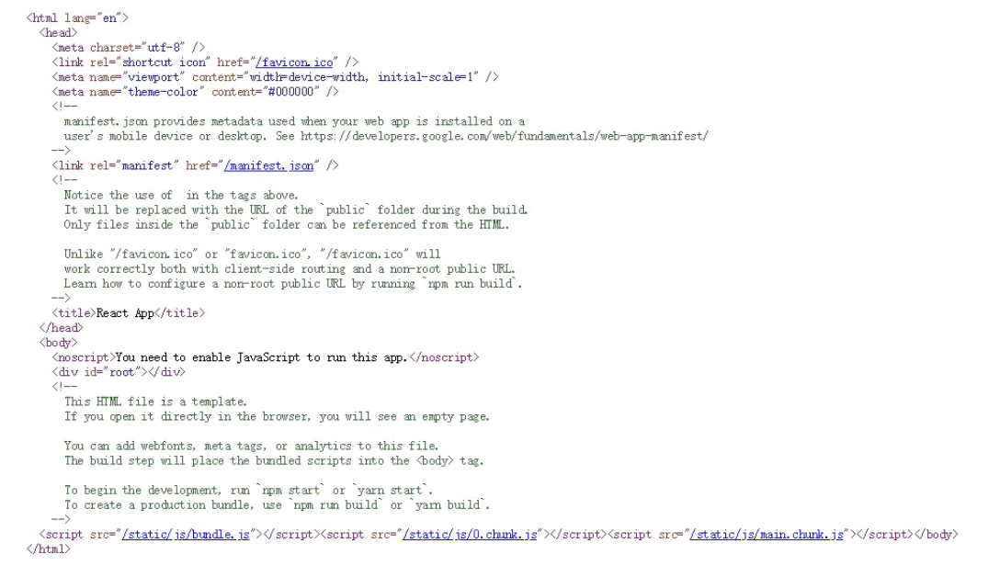
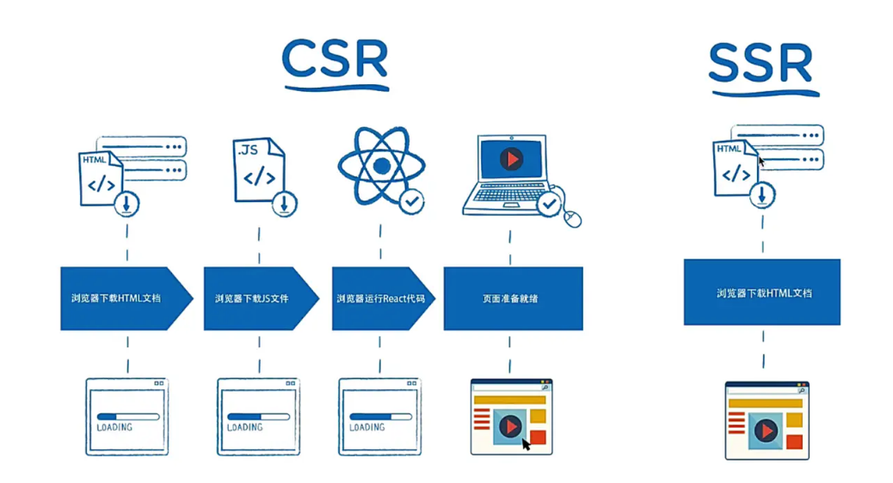
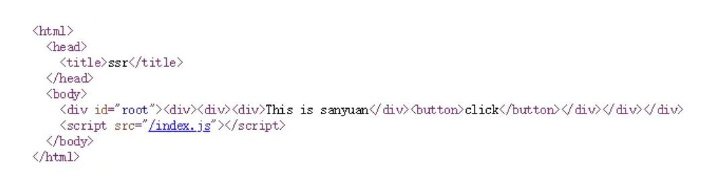
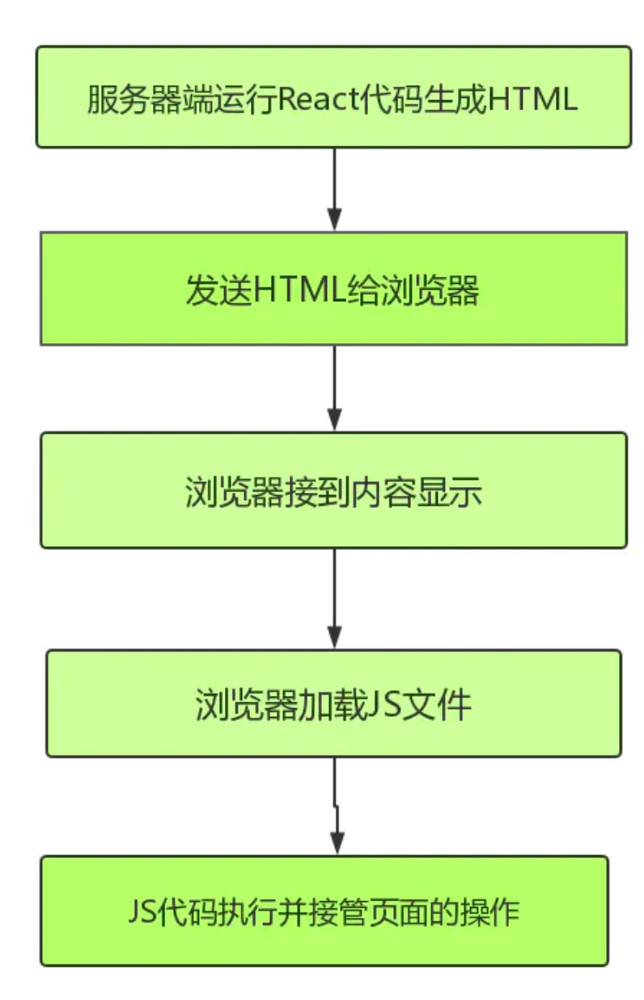
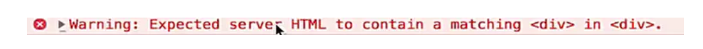
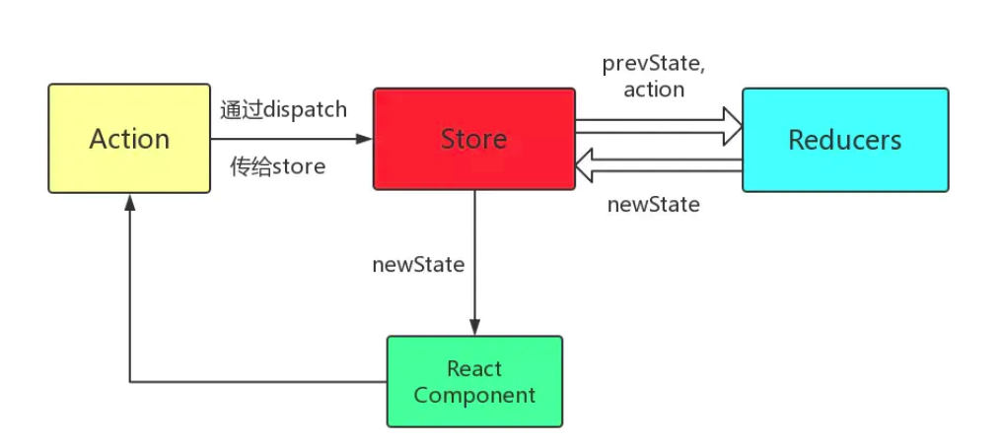
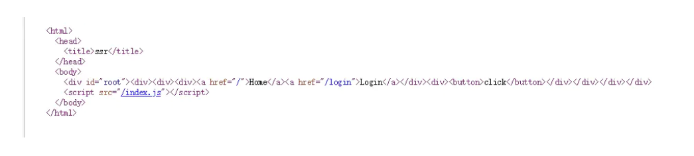
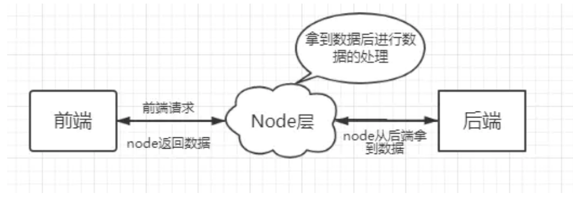
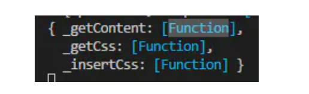
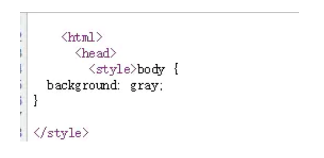

大家好，我是神三元，这一次，让我们来以React为例，把服务端渲染(Server Side Render，简称“SSR”)学个明明白白。

这里附上这个项目的github地址: [github.com/sanyuan0704…](https://github.com/sanyuan0704/react-ssr)

欢迎大家点star,提issue，一起进步！

## part1：实现一个基础的React组件SSR

这一部分来简要实现一个React组件的SSR。

### 一. SSR vs CSR

什么是服务端渲染？

废话不多说，直接起一个express服务器。

```
var express = require('express')
var app = express()

app.get('/', (req, res) => {
 res.send(
 `
   <html>
     <head>
       <title>hello</title>
     </head>
     <body>
       <h1>hello</h1>
       <p>world</p>
     </body>
   </html>
 `
 )
})

app.listen(3001, () => {
 console.log('listen:3001')
})
复制代码
```

启动之后打开localhost:3001可以看到页面显示了hello world。而且打开网页源代码：


也能够完成显示。


这就是服务端渲染。其实非常好理解，就是服务器返回一堆html字符串，然后让浏览器显示。

与服务端渲染相对的是客户端渲染(Client Side Render)。那什么是客户端渲染？ 现在创建一个新的React项目，用脚手架生成项目，然后run起来。 这里你可以看到React脚手架自动生成的首页。


然而打开网页源代码。




body中除了兼容处理的noscript标签之外，只有一个id为root的标签。那首页的内容是从哪来的呢？很明显，是下面的script中拉取的JS代码控制的。


因此，CSR和SSR最大的区别在于前者的页面渲染是JS负责进行的，而后者是服务器端直接返回HTML让浏览器直接渲染。

为什么要使用服务端渲染呢？




传统CSR的弊端：


1. 由于页面显示过程要进行JS文件拉取和React代码执行，首屏加载时间会比较慢。
2. 对于SEO(Search Engine Optimazition,即搜索引擎优化)，完全无能为力，因为搜索引擎爬虫只认识html结构的内容，而不能识别JS代码内容。

SSR的出现，就是为了解决这些传统CSR的弊端。

### 二、实现React组件的服务端渲染

刚刚起的express服务返回的只是一个普通的html字符串，但我们讨论的是如何进行React的服务端渲染，那么怎么做呢？ 首先写一个简单的React组件:

```
// containers/Home.js
import React from 'react';
const Home = () => {
  return (
    <div>
      <div>This is sanyuan</div>
    </div>
  )
}
export default Home
复制代码
```

现在的任务就是将它转换为html代码返回给浏览器。 总所周知，JSX中的标签其实是基于虚拟DOM的，最终要通过一定的方法将其转换为真实DOM。虚拟DOM也就是JS对象，可以看出整个服务端的渲染流程就是通过虚拟DOM的编译来完成的，因此虚拟DOM巨大的表达力也可见一斑了。

而react-dom这个库中刚好实现了编译虚拟DOM的方法。做法如下:

```
// server/index.js
import express from 'express';
import { renderToString } from 'react-dom/server';
import Home from './containers/Home';

const app = express();
const content = renderToString(<Home />);
app.get('/', function (req, res) {
   res.send(
   `
    <html>
      <head>
        <title>ssr</title>
      </head>
      <body>
        <div id="root">${content}</div>
      </body>
    </html>
   `
   );
})
app.listen(3001, () => {
  console.log('listen:3001')
})

复制代码
```

启动express服务，再浏览器上打开对应端口，页面显示出"this is sanyuan"。 到此，就初步实现了一个React组件是服务端渲染。 当然，这只是一个非常简陋的SSR，事实上对于复杂的项目而言是无能为力的，在之后会一步步完善，打造出一个功能完整的React的SSR框架。

## part2: 初识同构

### 一.引入同构

其实前面的SSR是不完整的，平时在开发的过程中难免会有一些事件绑定，比如加一个button:

```
// containers/Home.js
import React from 'react';
const Home = () => {
  return (
    <div>
      <div>This is sanyuan</div>
      <button onClick={() => {alert('666')}}>click</button>
    </div>
  )
}
export default Home
复制代码
```

再试一下，你会惊奇的发现，事件绑定无效!那这是为什么呢？原因很简单，react-dom/server下的renderToString并没有做事件相关的处理，因此返回给浏览器的内容不会有事件绑定。

那怎么解决这个问题呢？

这就需要进行同构了。所谓同构，通俗的讲，就是一套React代码在服务器上运行一遍，到达浏览器又运行一遍。服务端渲染完成页面结构，浏览器端渲染完成事件绑定。

那如何进行浏览器端的事件绑定呢？

唯一的方式就是让浏览器去拉取JS文件执行，让JS代码来控制。于是服务端返回的代码变成了这样:




有没有发现和之前的区别？区别就是多了一个script标签。而它拉取的JS代码就是来完成同构的。


那么这个index.js我们如何生产出来呢？

在这里，要用到react-dom。具体做法其实就很简单了：

```
//client/index. js
import React from 'react';
import ReactDom from 'react-dom';
import Home from '../containers/Home';

ReactDom.hydrate(<Home />, document.getElementById('root'))
复制代码
```

然后用webpack将其编译打包成index.js:

```
//webpack.client.js
const path = require('path');
const merge = require('webpack-merge');
const config = require('./webpack.base');

const clientConfig = {
  mode: 'development',
  entry: './src/client/index.js',
  output: {
    filename: 'index.js',
    path: path.resolve(__dirname, 'public')
  },
}

module.exports = merge(config, clientConfig);

//webpack.base.js
module.exports = {
  module: {
    rules: [{
      test: /\.js$/,
      loader: 'babel-loader',
      exclude: /node_modules/,
      options: {
        presets: ['@babel/preset-react',  ['@babel/preset-env', {
          targets: {
            browsers: ['last 2 versions']
          }
        }]]
      }
    }]
  }
}

//package.json的script部分
  "scripts": {
    "dev": "npm-run-all --parallel dev:**",
    "dev:start": "nodemon --watch build --exec node \"./build/bundle.js\"",
    "dev:build:server": "webpack --config webpack.server.js --watch",
    "dev:build:client": "webpack --config webpack.client.js --watch"
  },
复制代码
```

在这里需要开启express的静态文件服务：

```
const app = express();
app.use(express.static('public'));
复制代码
```

现在前端的script就能拿到控制浏览器的JS代码啦。

绑定事件完成！

现在来初步总结一下同构代码执行的流程：



### 二.同构中的路由问题

现在写一个路由的配置文件：

```
// Routes.js
import React from 'react';
import {Route} from 'react-router-dom'
import Home from './containers/Home';
import Login from './containers/Login'

export default (
  <div>
    <Route path='/' exact component={Home}></Route>
    <Route path='/login' exact component={Login}></Route>
  </div>
)
复制代码
```

在客户端的控制代码，也就是上面写过的client/index.js中，要做相应的更改:

```
import React from 'react';
import ReactDom from 'react-dom';
import { BrowserRouter } from 'react-router-dom'
import Routes from '../Routes'

const App = () => {
  return (
    <BrowserRouter>
      {Routes}
    </BrowserRouter>
  )
}
ReactDom.hydrate(<App />, document.getElementById('root'))
复制代码
```

这时候控制台会报错，




因为在Routes.js中，每个Route组件外面包裹着一层div，但服务端返回的代码中并没有这个div,所以报错。如何去解决这个问题？需要将服务端的路由逻辑执行一遍。


```
// server/index.js
import express from 'express';
import {render} from './utils';

const app = express();
app.use(express.static('public'));
//注意这里要换成*来匹配
app.get('*', function (req, res) {
   res.send(render(req));
});
 
app.listen(3001, () => {
  console.log('listen:3001')
});
复制代码
// server/utils.js
import Routes from '../Routes'
import { renderToString } from 'react-dom/server';
//重要是要用到StaticRouter
import { StaticRouter } from 'react-router-dom'; 
import React from 'react'

export const render = (req) => {
  //构建服务端的路由
  const content = renderToString(
    <StaticRouter location={req.path} >
      {Routes}
    </StaticRouter>
  );
  return `
    <html>
      <head>
        <title>ssr</title>
      </head>
      <body>
        <div id="root">${content}</div>
        <script src="/index.js"></script>
      </body>
    </html>
  `
}
复制代码
```

现在路由的跳转就没有任何问题啦。 注意，这里仅仅是一级路由的跳转，多级路由的渲染在之后的系列中会用react-router-config中renderRoutes来处理。

## part3: 同构项目中引入Redux

这一节主要是讲述Redux如何被引入到同构项目中以及其中需要注意的问题。

重新回顾一下redux的运作流程：



再回顾一下同构的概念，即在React代码客户端和服务器端各自运行一遍。


### 一、创建全局store

现在开始创建store。 在项目根目录的store文件夹(总的store)下:

```
import {createStore, applyMiddleware, combineReducers} from 'redux';
import thunk from 'redux-thunk';
import { reducer as homeReducer } from '../containers/Home/store';
//合并项目组件中store的reducer
const reducer = combineReducers({
  home: homeReducer
})
//创建store，并引入中间件thunk进行异步操作的管理
const store = createStore(reducer, applyMiddleware(thunk));

//导出创建的store
export default store
复制代码
```

### 二、组件内action和reducer的构建

Home文件夹下的工程文件结构如下：


在Home的store目录下的各个文件代码示例：


```
//constants.js
export const CHANGE_LIST = 'HOME/CHANGE_LIST';
复制代码
//actions.js
import axios from 'axios';
import { CHANGE_LIST } from "./constants";

//普通action
const changeList = list => ({
  type: CHANGE_LIST,
  list
});
//异步操作的action(采用thunk中间件)
export const getHomeList = () => {
  return (dispatch) => {
    return axios.get('xxx')
      .then((res) => {
        const list = res.data.data;
        console.log(list)
        dispatch(changeList(list))
      });
  };
}
复制代码
//reducer.js
import { CHANGE_LIST } from "./constants";

const defaultState = {
  name: 'sanyuan',
  list: []
}

export default (state = defaultState, action) => {
  switch(action.type) {
    default:
      return state;
  }
}
复制代码
//index.js
import  reducer  from "./reducer";
//这么做是为了导出reducer让全局的store来进行合并
//那么在全局的store下的index.js中只需引入Home/store而不需要Home/store/reducer.js
//因为脚手架会自动识别文件夹下的index文件
export {reducer}
复制代码
```

### 三、组件连接全局store

下面是Home组件的编写示例。

```
import React, { Component } from 'react';
import { connect } from 'react-redux';
import { getHomeList } from './store/actions'

class Home extends Component {
  render() {
    const { list } = this.props
    return list.map(item => <div key={item.id}>{item.title}</div>)
  }
}

const mapStateToProps = state => ({
  list: state.home.newsList,
})

const mapDispatchToProps = dispatch => ({
  getHomeList() {
    dispatch(getHomeList());
  }
})
//连接store
export default connect(mapStateToProps, mapDispatchToProps)(Home);
复制代码
```

对于store的连接操作，在同构项目中分两个部分，一个是与客户端store的连接，另一部分是与服务端store的连接。都是通过react-redux中的Provider来传递store的。

客户端:

```
//src/client/index.js
import React from 'react';
import ReactDom from 'react-dom';
import {BrowserRouter, Route} from 'react-router-dom';
import { Provider } from 'react-redux';
import store from '../store'
import routes from '../routes.js'

const App = () => {
  return (
    <Provider store={store}>
      <BrowserRouter>
        {routes}
      </BrowserRouter>
    </Provider>
  )
}

ReactDom.hydrate(<App />, document.getElementById('root'))
复制代码
```

服务端:

```
//src/server/index.js的内容保持不变
//下面是src/server/utils.js
import Routes from '../Routes'
import { renderToString } from 'react-dom/server';
import { StaticRouter } from 'react-router-dom'; 
import { Provider } from 'react-redux';
import React from 'react'

export const render = (req) => {
  const content = renderToString(
    <Provider store={store}>
      <StaticRouter location={req.path} >
        {Routes}
      </StaticRouter>
    </Provider>
  );
  return `
    <html>
      <head>
        <title>ssr</title>
      </head>
      <body>
        <div id="root">${content}</div>
        <script src="/index.js"></script>
      </body>
    </html>
  `
}
复制代码
```

### 四、潜在的坑

其实上面这样的store创建方式是存在问题的，什么原因呢？

上面的store是一个单例，当这个单例导出去后，所有的用户用的是同一份store，这是不应该的。那么这么解这个问题呢？

在全局的store/index.js下修改如下：

```
//导出部分修改
export default  () => {
  return createStore(reducer, applyMiddleware(thunk))
}
复制代码
```

这样在客户端和服务端的js文件引入时其实引入了一个函数，把这个函数执行就会拿到一个新的store,这样就能保证每个用户访问时都是用的一份新的store。

## part4: 异步数据的服务端渲染方案(数据注水与脱水)

### 一、问题引入

在平常客户端的React开发中，我们一般在组件的componentDidMount生命周期函数进行异步数据的获取。但是，在服务端渲染中却出现了问题。

现在我在componentDidMount钩子函数中进行Ajax请求:

```
import { getHomeList } from './store/actions'
  //......
  componentDidMount() {
    this.props.getList();
  }
  //......
  const mapDispatchToProps = dispatch => ({
    getList() {
      dispatch(getHomeList());
    }
})
复制代码
//actions.js
import { CHANGE_LIST } from "./constants";
import axios from 'axios'

const changeList = list => ({
  type: CHANGE_LIST,
  list
})

export const getHomeList = () => {
  return dispatch => {
    //另外起的本地的后端服务
    return axiosInstance.get('localhost:4000/api/news.json')
      .then((res) => {
        const list = res.data.data;
        dispatch(changeList(list))
      })
  }
}
//reducer.js
import { CHANGE_LIST } from "./constants";

const defaultState = {
  name: 'sanyuan',
  list: []
}

export default (state = defaultState, action) => {
  switch(action.type) {
    case CHANGE_LIST:
      const newState = {
        ...state,
        list: action.list
      }
      return newState
    default:
      return state;
  }
}
复制代码
```

好，现在启动服务。


现在页面能够正常渲染，但是打开网页源代码。



源代码里面并没有这些列表数据啊！那这是为什么呢？


让我们来分析一下客户端和服务端的运行流程，当浏览器发送请求时，服务器接受到请求，这时候服务器和客户端的store都是空的，紧接着客户端执行componentDidMount生命周期中的函数，获取到数据并渲染到页面，然而服务器端始终不会执行componentDidMount，因此不会拿到数据，这也导致服务器端的store始终是空的。换而言之，关于异步数据的操作始终只是客户端渲染。

现在的工作就是让服务端将获得数据的操作执行一遍，以达到真正的服务端渲染的效果。

### 二、改造路由

在完成这个方案之前需要改造一下原有的路由，也就是routes.js

```
import Home from './containers/Home';
import Login from './containers/Login';

export default [
{
  path: "/",
  component: Home,
  exact: true,
  loadData: Home.loadData,//服务端获取异步数据的函数
  key: 'home'
},
{
  path: '/login',
  component: Login,
  exact: true,
  key: 'login'
}
}];
复制代码
```

此时客户端和服务端中编写的JSX代码也发生了相应变化

```
//客户端
//以下的routes变量均指routes.js导出的数组
<Provider store={store}>
  <BrowserRouter>
      <div>
        {
            routers.map(route => {
                <Route {...route} />
            })
        }
      </div>
  </BrowserRouter>
</Provider>
复制代码
//服务端
<Provider store={store}>
  <StaticRouter>
      <div>
        {
            routers.map(route => {
                <Route {...route} />
            })
        }
      </div>
  </StaticRouter>
</Provider>
复制代码
```

其中配置了一个loadData参数，这个参数代表了服务端获取数据的函数。每次渲染一个组件获取异步数据时，都会调用相应组件的这个函数。因此，在编写这个函数具体的代码之前，我们有必要想清楚如何来针对不同的路由来匹配不同的loadData函数。

在server/utils.js中加入以下逻辑

```
  import { matchRoutes } from 'react-router-config';
  //调用matchRoutes用来匹配当前路由(支持多级路由)
  const matchedRoutes = matchRoutes(routes, req.path)
  //promise对象数组
  const promises = [];
  matchedRoutes.forEach(item => {
    //如果这个路由对应的组件有loadData方法
    if (item.route.loadData) {
      //那么就执行一次,并将store传进去
      //注意loadData函数调用后需要返回Promise对象
      promises.push(item.route.loadData(store))
    }
  })
  Promise.all(promises).then(() => {
      //此时该有的数据都已经到store里面去了
      //执行渲染的过程(res.send操作)
  }
  )
复制代码
```

现在就可以安心的写我们的loadData函数，其实前面的铺垫工作做好后，这个函数是相当容易的。

```
import { getHomeList } from './store/actions'

Home.loadData = (store) => {
    return store.dispatch(getHomeList())
}
复制代码
//actions.js
export const getHomeList = () => {
  return dispatch => {
    return axios.get('xxxx')
      .then((res) => {
        const list = res.data.data;
        dispatch(changeList(list))
      })
  }
}
复制代码
```

根据这个思路，服务端渲染中异步数据的获取功能就完成啦。

### 三、数据的注水和脱水

其实目前做了这里还是存在一些细节问题的。比如当我将生命周期钩子里面的异步请求函数注释，现在页面中不会有任何的数据，但是打开网页源代码，却发现:


数据已经挂载到了服务端返回的HTML代码中。那这就说明服务端和客户端的store不同步的问题。


其实也很好理解。当服务端拿到store并获取数据后，客户端的js代码又执行一遍，在客户端代码执行的时候又创建了一个空的store，两个store的数据不能同步。

那如何才能让这两个store的数据同步变化呢?

首先，在服务端获取获取之后，在返回的html代码中加入这样一个script标签：

```
<script>
  window.context = {
    state: ${JSON.stringify(store.getState())}
  }
</script>
复制代码
```

这叫做数据的“注水”操作，即把服务端的store数据注入到window全局环境中。 接下来是“脱水”处理，换句话说也就是把window上绑定的数据给到客户端的store，可以在客户端store产生的源头进行，即在全局的store/index.js中进行。

```
//store/index.js
import {createStore, applyMiddleware, combineReducers} from 'redux';
import thunk from 'redux-thunk';
import { reducer as homeReducer } from '../containers/Home/store';

const reducer = combineReducers({
  home: homeReducer
})
//服务端的store创建函数
export const getStore = () => {
  return createStore(reducer, applyMiddleware(thunk));
}
//客户端的store创建函数
export const getClientStore = () => {
  const defaultState = window.context ? window.context.state : {};
  return createStore(reducer, defaultState, applyMiddleware(thunk));
}
复制代码
```

至此，数据的脱水和注水操作完成。但是还是有一些瑕疵，其实当服务端获取数据之后，客户端并不需要再发送Ajax请求了，而客户端的React代码仍然存在这样的浪费性能的代码。怎么办呢？

还是在Home组件中，做如下的修改:

```
componentDidMount() {
  //判断当前的数据是否已经从服务端获取
  //要知道，如果是首次渲染的时候就渲染了这个组件，则不会重复发请求
  //若首次渲染页面的时候未将这个组件渲染出来，则一定要执行异步请求的代码
  //这两种情况对于同一组件是都是有可能发生的
  if (!this.props.list.length) {
    this.props.getHomeList()
  }
}
复制代码
```

一路做下来，异步数据的服务端渲染还是比较复杂的，但是难度并不是很大，需要耐心地理清思路。

至此一个比较完整的SSR框架就搭建的差不多了，但是还有一些内容需要补充，之后会继续更新的。加油吧！

## part5: node作中间层及请求代码优化

### 一、为什么要引入node中间层?

其实任何技术都是与它的应用场景息息相关的。这里我们反复谈的SSR，其实不到万不得已我们是用不着它的，SSR所解决的最大的痛点在于SEO，但它同时带来了更昂贵的成本。不仅因为服务端渲染需要更加复杂的处理逻辑，还因为同构的过程需要服务端和客户端都执行一遍代码，这虽然对于客户端并没有什么大碍，但对于服务端却是巨大的压力，因为数量庞大的访问量，对于每一次访问都要另外在服务器端执行一遍代码进行计算和编译，大大地消耗了服务器端的性能，成本随之增加。如果访问量足够大的时候，以前不用SSR的时候一台服务器能够承受的压力现在或许要增加到10台才能抗住。痛点在于SEO，但如果实际上对SEO要求并不高的时候，那使用SSR就大可不必了。

那同样地，为什么要引入node作为中间层呢？它是处在哪两者的中间？又是解决了什么场景下的问题？

在不用中间层的前后端分离开发模式下，前端一般直接请求后端的接口。但真实场景下，后端所给的数据格式并不是前端想要的，但处于性能原因或者其他的因素接口格式不能更改，这时候需要在前端做一些额外的数据处理操作。前端来操作数据本身无可厚非，但是当数据量变得庞大起来，那么在客户端就是产生巨大的性能损耗，甚至影响到用户体验。在这个时候，node中间层的概念便应运而生。

它最终解决的前后端协作的问题。

一般的中间层工作流是这样的:前端每次发送请求都是去请求node层的接口，然后node对于相应的前端请求做转发，用node去请求真正的后端接口获取数据，获取后再由node层做对应的数据计算等处理操作，然后返回给前端。这就相当于让node层替前端接管了对数据的操作。





### 二、SSR框架中引入中间层

在之前搭建的SSR框架中，服务端和客户端请求利用的是同一套请求后端接口的代码，但这是不科学的。

对客户端而言，最好通过node中间层。而对于这个SSR项目而言，node开启的服务器本来就是一个中间层的角色，因而对于服务器端执行数据请求而言，就可以直接请求真正的后端接口啦。

```
//actions.js
//参数server表示当前请求是否发生在node服务端
const getUrl = (server) => {
    return server ? 'xxxx(后端接口地址)' : '/api/sanyuan.json(node接口)';
}
//这个server参数是Home组件里面传过来的，
//在componentDidMount中调用这个action时传入false，
//在loadData函数中调用时传入true, 这里就不贴组件代码了
export const getHomeList = (server) => {
  return dispatch => {
    return axios.get(getUrl(server))
      .then((res) => {
        const list = res.data.data;
        dispatch(changeList(list))
      })
  }
}
复制代码
```

在server/index.js应拿到前端的请求做转发，这里是直接用proxy形式来做，也可以用node单独向后端发送一次HTTP请求。

```
//增加如下代码
import proxy from 'express-http-proxy';
//相当于拦截到了前端请求地址中的/api部分，然后换成另一个地址
app.use('/api', proxy('http://xxxxxx(服务端地址)', {
  proxyReqPathResolver: function(req) {
    return '/api'+req.url;
  }
}));
复制代码
```

### 三、请求代码优化

其实请求的代码还是有优化的余地的，仔细想想，上面的server参数其实是不用传递的。

现在我们利用axios的instance和thunk里面的withExtraArgument来做一些封装。

```
//新建server/request.js
import axios from 'axios'

const instance = axios.create({
  baseURL: 'http://xxxxxx(服务端地址)'
})

export default instance


//新建client/request.js
import axios from 'axios'

const instance = axios.create({
  //即当前路径的node服务
  baseURL: '/'
})

export default instance
复制代码
```

然后对全局下store的代码做一个微调:

```
import {createStore, applyMiddleware, combineReducers} from 'redux';
import thunk from 'redux-thunk';
import { reducer as homeReducer } from '../containers/Home/store';
import clientAxios from '../client/request';
import serverAxios from '../server/request';

const reducer = combineReducers({
  home: homeReducer
})

export const getStore = () => {
  //让thunk中间件带上serverAxios
  return createStore(reducer, applyMiddleware(thunk.withExtraArgument(serverAxios)));
}
export const getClientStore = () => {
  const defaultState = window.context ? window.context.state : {};
   //让thunk中间件带上clientAxios
  return createStore(reducer, defaultState, applyMiddleware(thunk.withExtraArgument(clientAxios)));
}

复制代码
```

现在Home组件中请求数据的action无需传参，actions.js中的请求代码如下：

```
export const getHomeList = () => {
  //返回函数中的默认第三个参数是withExtraArgument传进来的axios实例
  return (dispatch, getState, axiosInstance) => {
    return axiosInstance.get('/api/sanyuan.json')
      .then((res) => {
        const list = res.data.data;
        console.log(res)
        dispatch(changeList(list))
      })
  }
}
复制代码
```

至此，代码优化就做的差不多了，这种代码封装的技巧其实可以用在其他的项目当中，其实还是比较优雅的。

## part6: 多级路由渲染(renderRoutes)

现在将routes.js的内容改变如下:

```
import Home from './containers/Home';
import Login from './containers/Login';
import App from './App'

//这里出现了多级路由
export default [{
  path: '/',
  component: App,
  routes: [
    {
      path: "/",
      component: Home,
      exact: true,
      loadData: Home.loadData,
      key: 'home',
    },
    {
      path: '/login',
      component: Login,
      exact: true,
      key: 'login',
    }
  ]
}]

复制代码
```

现在的需求是让页面公用一个Header组件，App组件编写如下:

```
import React from 'react';
import Header from './components/Header';

const  App = (props) => {
  console.log(props.route)
  return (
    <div>
      <Header></Header>
    </div>
  )
}

export default App;
复制代码
```

对于多级路由的渲染，需要服务端和客户端各执行一次。 因此编写的JSX代码都应有所实现：

```
//routes是指routes.js中返回的数组
//服务端:
<Provider store={store}>
  <StaticRouter location={req.path} >
    <div>
      {renderRoutes(routes)}
    </div>
  </StaticRouter>
</Provider>

//客户端：
<Provider store={getClientStore()}>
  <BrowserRouter>
  <div>
    {renderRoutes(routes)}
  </div>
  </BrowserRouter>
</Provider>
复制代码
```

这里都用到了renderRoutes方法，其实它的工作非常简单，就是根据url渲染一层路由的组件(这里渲染的是App组件)，然后将下一层的路由通过props传给目前的App组件，依次循环。

那么，在App组件就能通过props.route.routes拿到下一层路由进行渲染:

```
import React from 'react';
import Header from './components/Header';
//增加renderRoutes方法
import { renderRoutes } from 'react-router-config';

const  App = (props) => {
  console.log(props.route)
  return (
    <div>
      <Header></Header>
      <!--拿到Login和Home组件的路由-->
      {renderRoutes(props.route.routes)}
    </div>
  )
}

export default App;
复制代码
```

至此，多级路由的渲染就完成啦。

## part7: CSS的服务端渲染思路(context钩子变量)

### 一、客户端项目中引入CSS

还是以Home组件为例

```
//Home/style.css
body {
  background: gray;
}

复制代码
```

现在，在Home组件代码中引入：

```
import styles from './style.css';
复制代码
```

要知道这样的引入CSS代码的方式在一般环境下是运行不起来的，需要在webpack中做相应的配置。 首先安装相应的插件。

```
npm install style-loader css-loader --D
复制代码
//webpack.client.js
const path = require('path');
const merge = require('webpack-merge');
const config = require('./webpack.base');

const clientConfig = {
  mode: 'development',
  entry: './src/client/index.js',
  module: {
    rules: [{
      test: /\.css?$/,
      use: ['style-loader', {
        loader: 'css-loader',
        options: {
          modules: true
        }
      }]
    }]
  },
  output: {
    filename: 'index.js',
    path: path.resolve(__dirname, 'public')
  },
}

module.exports = merge(config, clientConfig);
复制代码
//webpack.base.js代码，回顾一下，配置了ES语法相关的内容
module.exports = {
  module: {
    rules: [{
      test: /\.js$/,
      loader: 'babel-loader',
      exclude: /node_modules/,
      options: {
        presets: ['@babel/preset-react',  ['@babel/preset-env', {
          targets: {
            browsers: ['last 2 versions']
          }
        }]]
      }
    }]
  }
}
复制代码
```

好，现在在客户端CSS已经产生了效果。


可是打开网页源代码：


咦？里面并没有出现任何有关CSS样式的代码啊！那这是什么原因呢？很简单，其实我们的服务端的CSS加载还没有做。接下来我们来完成CSS代码的服务端的处理。


### 二、服务端CSS的引入

首先，来安装一个webpack的插件，

```
npm install -D isomorphic-style-loader
复制代码
```

然后再webpack.server.js中做好相应的css配置：

```
//webpack.server.js
const path = require('path');
const nodeExternals = require('webpack-node-externals');
const merge = require('webpack-merge');
const config = require('./webpack.base');

const serverConfig = {
  target: 'node',
  mode: 'development',
  entry: './src/server/index.js',
  externals: [nodeExternals()],
  module: {
    rules: [{
      test: /\.css?$/,
      use: ['isomorphic-style-loader', {
        loader: 'css-loader',
        options: {
          modules: true
        }
      }]
    }]
  },
  output: {
    filename: 'bundle.js',
    path: path.resolve(__dirname, 'build')
  }
}

module.exports = merge(config, serverConfig);
复制代码
```

它做了些什么事情？

再看看这行代码:

```
import styles from './style.css';
复制代码
```

引入css文件时，这个isomorphic-style-loader帮我们在styles中挂了三个函数。输出styles看看：




现在我们的目标是拿到CSS代码，直接通过styles._getCss即可获得。


那我们拿到CSS代码后放到哪里呢？其实react-router-dom中的StaticRouter中已经帮我们准备了一个钩子变量context。如下

```
//context从外界传入
<StaticRouter location={req.path} context={context}>
    <div>
        {renderRoutes(routes)}
    </div>
</StaticRouter>
复制代码
```

这就意味着在路由配置对象routes中的组件都能在服务端渲染的过程中拿到这个context，而且这个context对于组件来说，就相当于组件中的props.staticContext。并且，这个props.staticContext只会在服务端渲染的过程中存在，而客户端渲染的时候不会被定义。这就让我们能够通过这个变量来区分两种渲染环境啦。

现在，我们需要在服务端的render函数执行之前，初始化context变量的值:

```
let context = { css: [] }
复制代码
```

我们只需要在组件的componentWillMount生命周期中编写相应的逻辑即可:

```
componentWillMount() {
  //判断是否为服务端渲染环境
  if (this.props.staticContext) {
    this.props.staticContext.css.push(styles._getCss())
  }
}
复制代码
```

服务端的renderToString执行完成后，context的CSS现在已经是一个有内容的数组，让我们来获取其中的CSS代码：

```
//拼接代码
const cssStr = context.css.length ? context.css.join('\n') : '';
复制代码
```

现在挂载到页面：

```
//放到返回的html字符串里的header里面
<style>${cssStr}</style>
复制代码
```



网页源代码中看到了CSS代码，效果也没有问题。CSS渲染完成！


### 三、利用高阶组件优化代码

也许你已经发现，对于每一个含有样式的组件，都需要在componentWillMount生命周期中执行完全相同的逻辑，对于这些逻辑我们是否能够把它封装起来，不用反复出现呢？

其实是可以实现的。利用高阶组件就可以完成:

```
//根目录下创建withStyle.js文件
import React, { Component } from 'react';
//函数返回组件
//需要传入的第一个参数是需要装饰的组件
//第二个参数是styles对象
export default (DecoratedComponent, styles) => {
  return class NewComponent extends Component {
    componentWillMount() {
      //判断是否为服务端渲染过程
      if (this.props.staticContext) {
        this.props.staticContext.css.push(styles._getCss())
      }
    }
    render() {
      return <DecoratedComponent {...this.props} />
    }
  }
}
复制代码
```

然后让这个导出的函数包裹我们的Home组件。

```
import WithStyle from '../../withStyle';
//......
const exportHome = connect(mapStateToProps, mapDispatchToProps)(withStyle(Home, styles));
export default exportHome;
复制代码
```

这样是不是简洁很多了呢？将来对于越来越多的组件，采用这种方式也是完全可以的。

## part8: 做好SEO的一些技巧，引入react-helmet

这一节我们来简单的聊一点SEO相关的内容。

### 一、SEO技巧分享

所谓SEO(Search Engine Optimization)，指的是利用搜索引擎的规则提高网站在有关搜索引擎内的自然排名。现在的搜索引擎爬虫一般是全文分析的模式，分析内容涵盖了一个网站主要3个部分的内容:文本、多媒体(主要是图片)和外部链接，通过这些来判断网站的类型和主题。因此，在做SEO优化的时候，可以围绕这三个角度来展开。

对于文本来说，尽量不要抄袭已经存在的文章，以写技术博客为例，东拼西凑抄来的文章排名一般不会高，如果需要引用别人的文章要记得声明出处，不过最好是原创，这样排名效果会比较好。多媒体包含了视频、图片等文件形式，现在比较权威的搜索引擎爬虫比如Google做到对图片的分析是基本没有问题的，因此高质量的图片也是加分项。另外是外部链接，也就是网站中a标签的指向，最好也是和当前网站相关的一些链接，更容易让爬虫分析。

当然，做好网站的门面，也就是标题和描述也是至关重要的。如：


网站标题中不仅仅包含了关键词，而且有比较详细和靠谱的描述，这让用户一看到就觉得非常亲切和可靠，有一种想要点击的冲动，这就表明网站的`转化率`比较高。


### 二、引入react-helmet

而React项目中，开发的是单页面的应用，页面始终只有一份title和description，如何根据不同的组件显示来对应不同的网站标题和描述呢？

其实是可以做到的。

```
npm install react-helmet --save
复制代码
```

组件代码:(还是以Home组件为例)

```
import { Helmet } from 'react-helmet';

//...
render() { 
    return (
      <Fragment>
        <!--Helmet标签中的内容会被放到客户端的head部分-->
        <Helmet>
          <title>这是三元的技术博客，分享前端知识</title>
          <meta name="description" content="这是三元的技术博客，分享前端知识"/>
        </Helmet>
        <div className="test">
          {
            this.getList()
          }
        </div>
      </Fragment>
     
    );
//...
复制代码
```

这只是做了客户端的部分，在服务端仍需要做相应的处理。

其实也非常简单：

```
//server/utils.js
import { renderToString } from 'react-dom/server';
import {  StaticRouter } from 'react-router-dom'; 
import React from 'react';
import { Provider } from "react-redux";
import { renderRoutes } from 'react-router-config';
import { Helmet } from 'react-helmet';

export const render = (store, routes, req, context) => {
  const content = renderToString(
    <Provider store={store}>
      <StaticRouter location={req.path} context={context}>
        <div>
          {renderRoutes(routes)}
        </div>
      </StaticRouter>
    </Provider>
  );
  //拿到helmet对象，然后在html字符串中引入
  const helmet = Helmet.renderStatic();

  const cssStr = context.css.length ? context.css.join('\n') : '';

  return  `
    <html>
      <head>
        <style>${cssStr}</style>
        ${helmet.title.toString()}
        ${helmet.meta.toString()}
      </head>
      <body>
        <div id="root">${content}</div>
        <script>
          window.context = {
            state: ${JSON.stringify(store.getState())}
          }
        </script>
        <script src="/index.js"></script>
      </body>
    </html>
  `
};
复制代码
```

现在来看看效果：


网页源代码中显示出对应的title和description, 客户端的显示也没有任何问题，大功告成！


关于React的服务端渲染原理，就先分享到这里，内容还是比较复杂的，对于前端的综合能力要求也比较高，但是坚持跟着学下来，一定会大有裨益的。相信你看了这一系列之后也有能力造出自己的SSR轮子，更加深刻地理解这一方面的技术。

参考资料:

慕课网[《React服务器渲染原理解析与实践》](https://coding.imooc.com/class/276.html)课程


作者：神三元
链接：https://juejin.cn/post/6844903881390964744
来源：掘金
著作权归作者所有。商业转载请联系作者获得授权，非商业转载请注明出处。