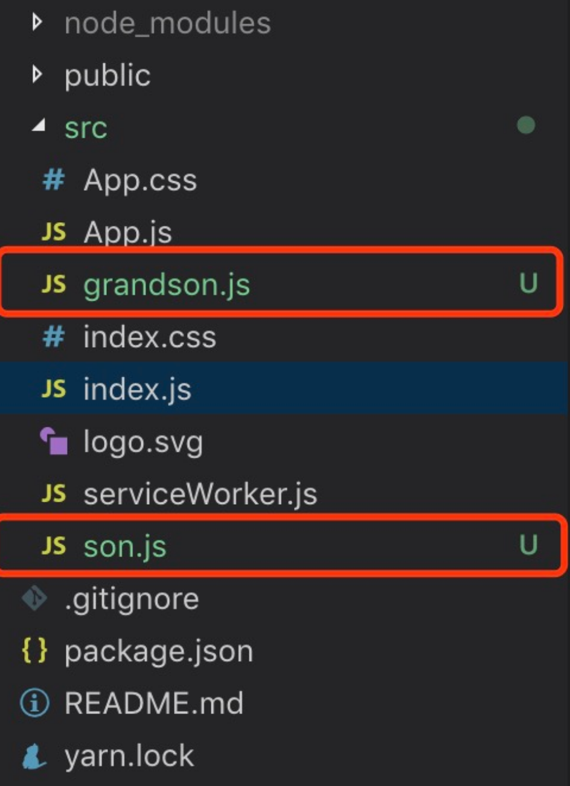
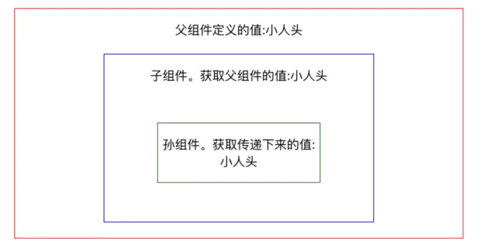

# React Context(上下文) 作用和使用 看完不懂 你打我[https://www.jianshu.com/p/65b348bf86ad]

##### 1.Context

Context 通过组件树提供了一个传递数据的方法，从而避免了在每一个层级手动的传递 props 属性。
 有部分小伙伴应该使用props属性进行组件向下传值的操作。当多个组件嵌套时候。你就需要慢慢向上寻找最初的值是什么~(手动微笑,恶心吧 )

##### 2.API (个人大白话理解)

**React.createContext：**创建一个上下文的容器(组件), defaultValue可以设置共享的默认数据


```cpp
const {Provider, Consumer} = React.createContext(defaultValue);
```

**Provider(生产者)**: 和他的名字一样。用于生产共享数据的地方。生产什么呢？ 那就看value定义的是什么了。value:放置共享的数据。


```csharp
<Provider value={/*共享的数据*/}>
    /*里面可以渲染对应的内容*/
</Provider>
```

**Consumer(消费者)**:这个可以理解为消费者。 他是专门消费供应商(**Provider** 上面提到的)产生数据。Consumer需要嵌套在生产者下面。才能通过回调的方式拿到共享的数据源。当然也可以单独使用，那就只能消费到上文提到的defaultValue


```csharp
<Consumer>
  {value => /*根据上下文  进行渲染相应内容*/}
</Consumer>
```

##### 3.react脚手架快速搭建

命令行按顺序执行以下代码：

```
npm install -g create-react-app`
 `create-react-app demo`
 `yarn start
```

##### 4.demo


在上面 脚手架添加 son.js 、grandson.js 并修改App.js内容。项目结构自行调整：



项目结构.jpg


代码效果图：



1. App.js 父组件


```jsx
//App.js
import React from 'react';
import Son from './son';//引入子组件
// 创建一个 theme Context,
export const {Provider,Consumer} = React.createContext("默认名称");
export default class App extends React.Component {
    render() {
        let name ="小人头"
        return (
            //Provider共享容器 接收一个name属性
            <Provider value={name}>
                <div style={{border:'1px solid red',width:'30%',margin:'50px auto',textAlign:'center'}}>
                    <p>父组件定义的值:{name}</p>
                    <Son />
                </div>
            </Provider>
        );
    }
}
```

son.js 子组件


```jsx
//son.js 子类
import React from 'react';
import { Consumer } from "./App.js";//引入父组件的Consumer容器
import Grandson from "./grandson.js";//引入子组件
function Son(props) {
    return (
        //Consumer容器,可以拿到上文传递下来的name属性,并可以展示对应的值
        <Consumer>
            {( name ) =>
                <div style={{ border: '1px solid blue', width: '60%', margin: '20px auto', textAlign: 'center' }}>
                    <p>子组件。获取父组件的值:{name}</p>
                    {/* 孙组件内容 */}
                    <Grandson />
               </div>
            }
        </Consumer>
    );
}
export default Son;
```

grandson.js 孙组件


```jsx
//grandson.js 孙类
import React from 'react';
import { Consumer } from "./App.js";//引入父组件的Consumer容器
function Grandson(props) {
    return (
         //Consumer容器,可以拿到上文传递下来的name属性,并可以展示对应的值
        <Consumer>
            {(name ) =>
                   <div style={{border:'1px solid green',width:'60%',margin:'50px auto',textAlign:'center'}}>
                   <p>孙组件。获取传递下来的值:{name}</p>
               </div>
            }
        </Consumer>
    );
}
export default Grandson;
```

运行上述代码。相信小伙伴对 React context 的作用 以及使用有了一定的了解。当然还有其他场景的使用，可直接看[官方context文档](https://links.jianshu.com/go?to=https%3A%2F%2Freactjs.org%2Fdocs%2Fcontext.html)  这个文章作为自己学习记录。也希望帮助到需要的小伙伴们。
 有不对的地方 希望小伙伴 及时指正。谢谢


58人点赞


[日记本]()


作者：小小小小的人头
链接：https://www.jianshu.com/p/65b348bf86ad
来源：简书
著作权归作者所有。商业转载请联系作者获得授权，非商业转载请注明出处。