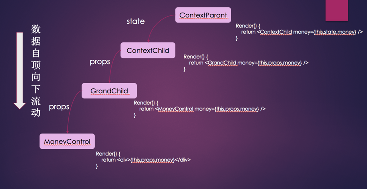
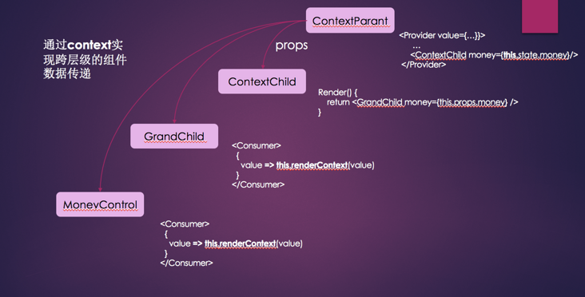
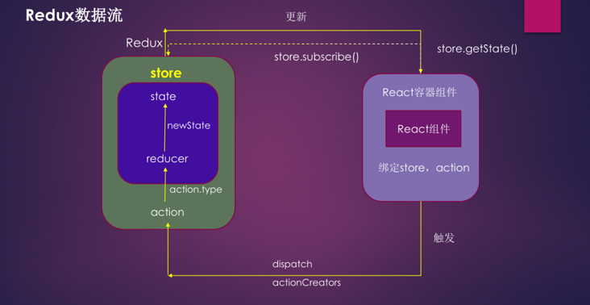
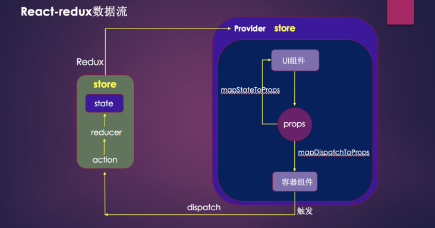
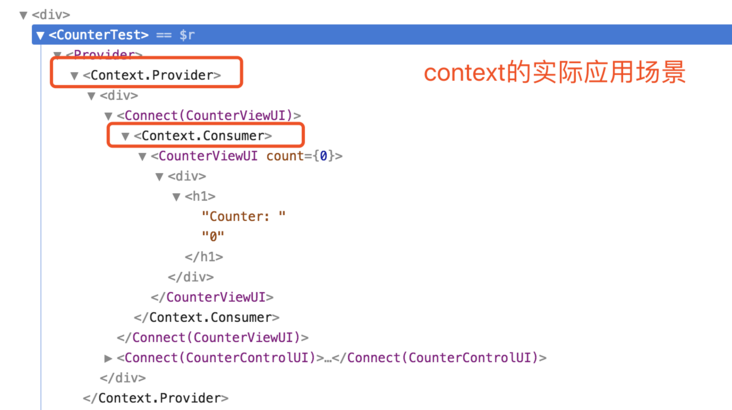
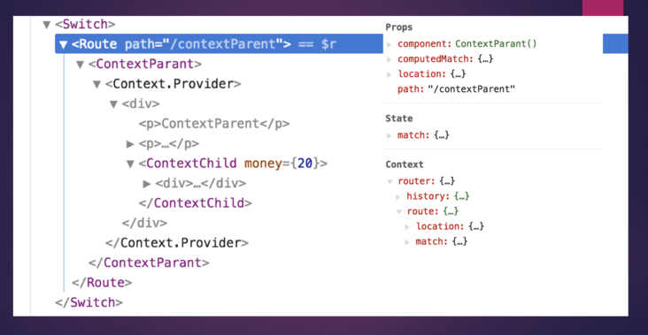
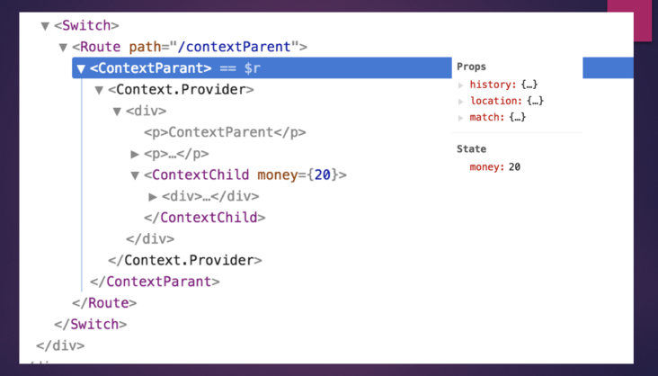

# [React系列——React Context](https://segmentfault.com/a/1190000017758300)

## 前言

我们先看一下React中，父子组件通信的机制，父子组件的通信是通过props进行数据的传递：

> 1、父组件向子组件传递数据(状态)时，是在调用子组件的时候通过参数传递给子组件，子组件通过this.props进行接收；
> 2、子组件如果更改父组件的一些属性，则是通过父组件定义的方法来传递给子组件，子组件调用更改；
> 3、如果父组件想要更改子组件的一些状态时，通过ref进行标记，可以获取子组件的所有信息，从而调用子组件的方法和值；

但是，如果层级很多呢，是否需要多个props进行逐层的传递？答案是否定的，React的advanced(高级)中指出了context，优雅的解决这个问题。

## 初识Context

我们知道，在JS中context指的是函数的执行上下文，函数被调用时，this指向谁，谁就是当前的执行上下文；

#### react中的context是什么呢？官方文档给出：

> Context 通过组件树提供了一个传递数据的方法，从而避免了在每一个层级手动的传递 props 属性。

文档也没具体给出context到底是什么，而是告诉我们context能干什么，也就是说，如果我们不想通过props实现组件树的逐层传递数据，则可以使用context实现跨层级进行数据传递！

## 如何使用Context

context api给出三个概念：React.createContext()、Provider、Consumer；

### React.createContext()

```
这个方法用来创建context对象，并包含Provider、Consumer两个组件 <Provider />、<Consumer />

const {Provider, Consumer} = React.createContext();
```

### Provider

```
数据的生产者，通过value属性接收存储的公共状态，来传递给子组件或后代组件

eg:

<Provider value={/* some value */}>
```

### Consumer

```
数据的消费者，通过订阅Provider传入的context的值，来实时更新当前组件的状态

eg: 

<Consumer>
  {value => /* render something based on the context value */}
</Consumer>
```

##### 值得一提的是每当Provider的值发生改变时, 作为Provider后代的所有Consumers都会重新渲染

props单向数据流动：



如果觉得Props传递数据很繁琐，可以采用context,进行跨组件传递数据



再最外层的组件上，通过生产者Provider组件进行包裹，并存储共享数据到value中，当然可以是任何数据类型。后带需要用到共享数据的组件均可通过Consumer进行数据获取。

## 与旧版本比较

新版的context是即react16.3以后进行升级的，但是16.3以前的context却不是那么好用了，同时它还被赋予“实验性”帽子的称号。

旧版本被赋予生产者和消费者的概念：

对于父组件来说，也就是生产者，需要声明childContextTypes对象，来提供给子组件需要用到的公共数据；

其次，还需要实例化getChildContext方法，返回一个纯对象，一定要注意的是父组件在getChildContext方法中定义数据的时候，一定要先在childContextTypes中进行声明，否则会报错；

用代码描述是：

```
父组件：

// 父组件声明context数据
childContextTypes = {
  orderVal: PropTypes.string,
  changeVal: PropTypes.func
};

  // 实例化getChildContext方法，返回一个纯对象
getChildContext() {
  return {
    orderVal: this.state.orderVal
  } 
};   

子组件： 

// 子组件则声明需要使用的Context属性
static contextTypes = {
  orderVal: PropTypes.string
};

// 通过this.context获取父组件的属性
render(){
    const { orderVal } = this.context;
  return (
    <div>{orderVal}</div>
  )
}
```

如果某个组件更改了父组件的某个属性值，那么父组件将会重新render组件树，如果期间有一个子组件没有用到context中的这个属性，并定义了shouldComponentUpdate，那和这个子组件的子孙组件就不会重新render，这样就会很危险，而新版本的context api却弥补了这个问题，即使其中的某个组件没有数据更新，也会影响到子孙组件，就是通过一个Provider来支持多个Consumer子组件的数据传递；

## 解析React-redux中的context

1) 众所周知，react-redux是链接react、redux的桥梁，我们来解剖一下到底react-redux是怎么搭这座桥梁的；

用redux来实现数据的传递：



那么，使用Redux不是不可以，只不过用起来着实麻烦，需要一直订阅store里的数据，每次都需要写一遍，为了方便，Redux的作者封装了React专用的库react-redux;



可见，react-redux实际上是通过Provider组件和connect方法进行连接react和redux,那么他们到底本质上就是通过Context来传递数据



## React-router中的context

同样，我们来看一下React-router中是怎么用context的

看一下Router组件的部分代码片段,react-router-dom用的还是react-router3版本的Router组件，其中的context采用也是旧版的写法，以后可能会升级!

```
var Router = function (_React$Component) {
  ...
  // Router组件扩展一个getChildContext方法，为子组件提供一个带有router属性的context
  // 监听history，history发生变化，并重新对route进行赋值
  Router.prototype.getChildContext = function getChildContext() {
    return {
      router: _extends({}, this.context.router, {
        history: this.props.history,
        route: {
          location: this.props.history.location,
          match: this.state.match
        }
      })
    };
  };

...

  Router.prototype.componentWillReceiveProps = function componentWillReceiveProps(nextProps) {
    warning(this.props.history === nextProps.history, "You cannot change <Router history>");
  };

 ...

  Router.prototype.render = function render() {
    var children = this.props.children;

    return children ? React.Children.only(children) : null;
  };

  return Router;
}(React.Component);

Router.propTypes = {
  history: PropTypes.object.isRequired,
  children: PropTypes.node
};

Router.contextTypes = {
  router: PropTypes.object
};
Router.childContextTypes = {
  router: PropTypes.object.isRequired
};


export default Router;
```

同样，Route组件、Link组件等，都是通过Context来构建的，通过context来共享router，并匹配当前路由的路径，来动态加载子组件；





但是，路由只会给子组件共享context,那如果是子孙组件，怎么办呢？也给他包一层router,这样不也就能共享context了吗？那么我们怎么在包一层呢？

答案： withRouter

withRouter用来修饰的这个UI组件，会在外层添加一层Route,这样就会共享context的状态了，所以无论我们在什么地方来进行路由切换，都需要包一层withRouter的原因了！

## context需谨慎使用

虽说新版的context已经很好用了，但是官方还是没有大面积的去推广，可能有一些其他的问题,比如多个context的管理，但是我们还是很看好，他的未来，毕竟react-redux、react-router还在用