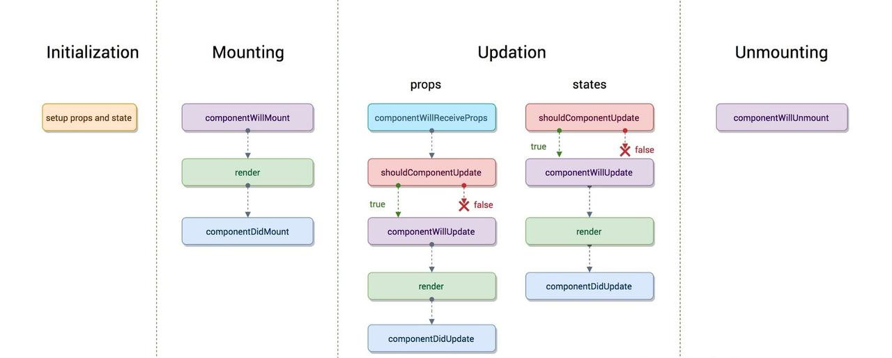
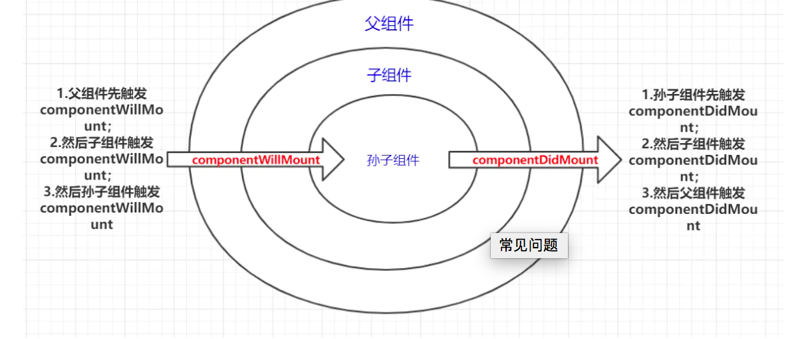
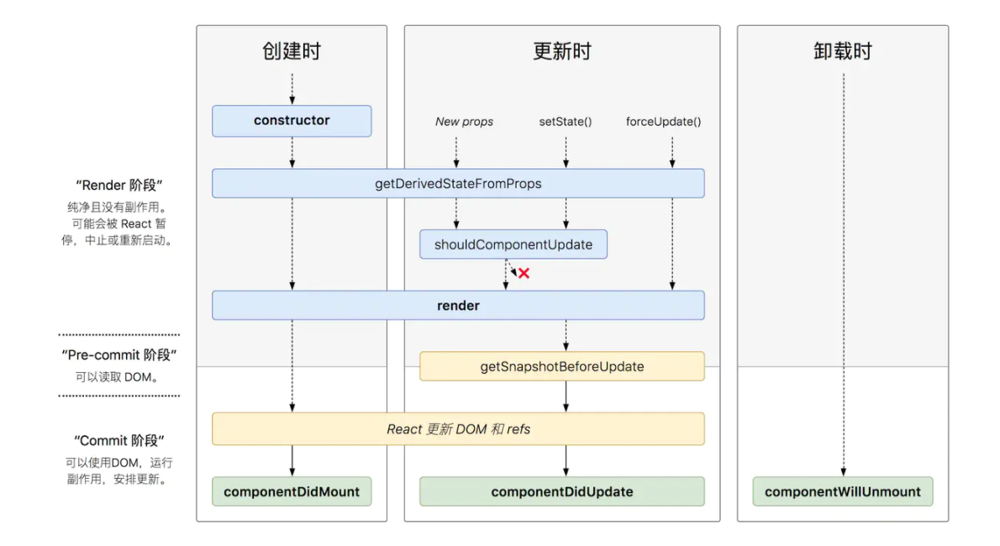

#    你真的了解 React 生命周期吗

https://juejin.cn/post/6844904021233238024#heading-8

## 前言

- 原本我以为对 React 生命周期已经熟的不能再熟了，直到前几天实现一个功能时，就因为没有吃透 React 生命周期，把我坑的不要不要的，所以痛定思痛，重新学习一遍 React 生命周期


## 旧版生命周期





- **初始化的时候不会把赋值算作更新，所以不会执行更新阶段**

```jsx
import React, { Component } from 'react'

export default class LifeCycle extends Component {
    //// props = {age:10,name:'计数器'}
  static defaultProps = {
      name:'计数器'
  }
  constructor(props){
      //Must call super constructor in derived class before accessing 'this' or returning from derived constructor
    super();//this.props = props;
    this.state = {number:0,users:[]};//初始化默认的状态对象
    console.log('1. constructor 初始化 props and state');
  
  }  
  //componentWillMount在渲染过程中可能会执行多次
  componentWillMount(){
    console.log('2. componentWillMount 组件将要挂载');
    //localStorage.get('userss');
  }
  //componentDidMount在渲染过程中永远只有执行一次
  //一般是在componentDidMount执行副作用，进行异步操作
  componentDidMount(){
    console.log('4. componentDidMount 组件挂载完成');
    fetch('https://api.github.com/users').then(res=>res.json()).then(users=>{
        console.log(users);
        this.setState({users});
    });
  }
  shouldComponentUpdate(nextProps,nextState){
    console.log('Counter',nextProps,nextState);
    console.log('5. shouldComponentUpdate 询问组件是否需要更新');
    return true;
  }
  componentWillUpdate(nextProps, nextState){
    console.log('6. componentWillUpdate 组件将要更新');
  }
  componentDidUpdate(prevProps, prevState)){
    console.log('7. componentDidUpdate 组件更新完毕');
  }
  add = ()=>{
      this.setState({number:this.state.number});
  };
  render() {
    console.log('3.render渲染，也就是挂载')
    return (
      <div style={{border:'5px solid red',padding:'5px'}}>
        <p>{this.props.name}:{this.state.number}</p>
        <button onClick={this.add}>+</button>
        <ul>
            {
                this.state.users.map(user=>(<li>{user.login}</li>))
            }
        </ul>
        {this.state.number%2==0&&<SubCounter number={this.state.number}/>}
      </div>
    )
  }
}
class SubCounter extends Component{
    constructor(props){
        super(props);
        this.state = {number:0};
    }
    componentWillUnmount(){
        console.log('SubCounter componentWillUnmount');
    }
    //调用此方法的时候会把新的属性对象和新的状态对象传过来
    shouldComponentUpdate(nextProps,nextState){
        console.log('SubCounter',nextProps,nextState);
        if(nextProps.number%3==0){
            return true;
        }else{
            return false;
        }
    }
    //componentWillReceiveProp 组件收到新的属性对象
    componentWillReceiveProps(){
      console.log('SubCounter 1.componentWillReceiveProps')
    }
    render(){
        console.log('SubCounter  2.render')
        return(
            <div style={{border:'5px solid green'}}>
                <p>{this.props.number}</p>
            </div>
        )
    }
}
复制代码
```

### 洋葱模型




## 新版生命周期





### `static getDerivedStateFromProps`

- `static getDerivedStateFromProps(nextProps,prevState)`：接收父组件传递过来的 `props` 和组件之前的状态，返回一个对象来更新 `state` 或者返回 `null` 来表示接收到的 `props` 没有变化，不需要更新 `state`

- **该生命周期钩子的作用：** 将父组件传递过来的 `props` **映射** 到子组件的 `state` 上面，这样组件内部就不用再通过 `this.props.xxx` 获取属性值了，统一通过 `this.state.xxx` 获取。映射就相当于拷贝了一份父组件传过来的 `props` ，作为子组件自己的状态。注意：子组件通过 `setState` 更新自身状态时，不会改变父组件的 `props`

- 配合 `componentDidUpdate`，可以覆盖 `componentWillReceiveProps` 的所有用法

- 该生命周期钩子触发的时机：

  - 在 React 16.3.0 版本中：在组件实例化、接收到新的 `props` 时会被调用
  - 在 React 16.4.0 版本中：在组件实例化、接收到新的 `props` 、组件状态更新时会被调用
  - **[在线 demo](https://codesandbox.io/s/react-unsafe-lifecycles-3eses)** —— 测试 16.3.0 和 16.4.0 版本中，该生命周期钩子什么情况下会被触发

- 使用：

   

  [在线 demo](https://codesandbox.io/s/react-unsafe-lifecycles-getderivedstatefromprops-3o59t)

  - 注意：派生状态时，不需要把组件自身的状态也设置进去

```
import React from "react";
import ReactDOM from "react-dom";
import "./styles.css";

function App() {
  return (
    <div className="App">
      <AAA />
    </div>
  );
}

class AAA extends React.Component {
  state = {
    age: 666
  };

  add = () => {
    this.setState({ age: this.state.age + 1 });
  };

  render() {
    return (
      <div>
        <ChildA onChangeParent={this.add} age={this.state.age} />
      </div>
    );
  }
}

class ChildA extends React.Component {
  state = {
    num: 888
  };
 	// 根据新的属性对象派生状态对象    
  // nextProps——新的属性对象 prevState——旧的状态对象
  static getDerivedStateFromProps(nextprops, state) {
    console.log('props',nextprops);
    // 返回一个对象来更新 state 或者返回 null 来表示接收到的 props 不需要更新 state 
    if (nextprops.age !== state.age) {
      console.log("更新吧");
      return {
        onChangeParent:nextprops.onChangeParent,
        age: nextprops.age,
        // 注意：这里不需要把组件自身的状态也放进来
        // num:state.num
      };
    }
    return null;
  }

  add = () => {
    this.setState({ num: this.state.num + 1 });
  };
  render() {
    const { onChangeParent } = this.state;
    console.log('state',this.state);
    return (
      <>
        <div onClick={onChangeParent}>change</div>
        <div onClick={this.add}>add</div>
      </>
    );
  }
}

const rootElement = document.getElementById("root");
ReactDOM.render(<App />, rootElement);
复制代码
```


### `getSnapshotBeforeUpdate`

- `getSnapshotBeforeUpdate(prevProps, prevState)`：**接收父组件传递过来的 `props` 和组件之前的状态，此生命周期钩子必须有返回值，返回值将作为第三个参数传递给** `componentDidUpdate`。必须和 `componentDidUpdate` 一起使用，否则会报错
- **该生命周期钩子触发的时机** ：被调用于 `render` 之后、更新 `DOM` 和 `refs` 之前
- **该生命周期钩子的作用：** 它能让你在组件更新 `DOM` 和 `refs` 之前，从 `DOM` 中捕获一些信息（例如滚动位置）
- 配合 `componentDidUpdate`, 可以覆盖 `componentWillUpdate` 的所有用法
- **[在线 demo](https://codesandbox.io/s/react-unsafe-lifecycles-getsnapshotbeforeupdate-biq9l)**：每次组件更新时，都去获取之前的滚动位置，让组件保持在之前的滚动位置

```
import React, { Component } from "react";
import ReactDOM from "react-dom";

import "./styles.css";

function App() {
  return (
    <div className="App">
      <GetSnapshotBeforeUpdate />
    </div>
  );
}

class GetSnapshotBeforeUpdate extends Component {
  constructor(props) {
    super(props);
    this.wrapper = React.createRef();
    this.state = { messages: [] };
  }
  componentDidMount() {
    setInterval(() => {
      this.setState({
        messages: ["msg:" + this.state.messages.length, ...this.state.messages]
      });
      //this.setState({messages:[...this.state.messages,this.state.messages.length]});
    }, 1000);
  }
  getSnapshotBeforeUpdate() {
    // 返回更新内容的高度 300px
    return this.wrapper.current.scrollHeight;
  }
  componentDidUpdate(prevProps, prevState, prevScrollHeight) {
    this.wrapper.current.scrollTop =
      this.wrapper.current.scrollTop +
      (this.wrapper.current.scrollHeight - prevScrollHeight);
  }
  render() {
    let style = {
      height: "100px",
      width: "200px",
      border: "1px solid red",
      overflow: "auto"
    };
    return (
      <ul style={style} ref={this.wrapper}>
        {this.state.messages.map((message, index) => (
          <li key={index}>{message}</li>
        ))}
      </ul>
    );
  }
}

const rootElement = document.getElementById("root");
ReactDOM.render(<App />, rootElement);
复制代码
```


## 版本迁移

- `componentWillMount`，`componentWillReceiveProps`，`componentWillUpdate` 这三个生命周期因为经常会被误解和滥用，所以被称为 **不安全（不是指安全性，而是表示使用这些生命周期的代码，有可能在未来的 React 版本中存在缺陷，可能会影响未来的异步渲染）** 的生命周期。
- **React 16.3 版本**：为不安全的生命周期引入别名 `UNSAFE_componentWillMount`，`UNSAFE_componentWillReceiveProps` 和 `UNSAFE_componentWillUpdate`。（**旧的生命周期名称和新的别名都可以在此版本中使用**）
- **React 16.3 之后的版本**：为 `componentWillMount`，`componentWillReceiveProps` 和 `componentWillUpdate` 启用弃用警告。（**旧的生命周期名称和新的别名都可以在此版本中使用，但旧名称会记录DEV模式警告**）
- **React 17.0 版本：** 推出新的渲染方式——**异步渲染**（ Async Rendering），提出一种可被打断的生命周期，而可以被打断的阶段正是实际 `dom` 挂载之前的虚拟 `dom` 构建阶段，也就是要被去掉的三个生命周期 `componentWillMount`，`componentWillReceiveProps` 和 `componentWillUpdate`。（**从这个版本开始，只有新的“UNSAFE_”生命周期名称将起作用**）


## 常见问题


### 当外部的 `props` 改变时，如何再次执行请求数据、更改状态等操作


#### 使用 `componentWillReceiveProps`

```
class ExampleComponent extends React.Component {
  state = {
    externalData: null,
  };

  componentDidMount() {
    this._loadAsyncData(this.props.id);
  }

  componentWillReceiveProps(nextProps) {
    // 当父组件的 props 改变时，重新请求数据
    if (nextProps.id !== this.props.id) {
      this.setState({externalData: null});
      this._loadAsyncData(nextProps.id);
    }
  }

  componentWillUnmount() {
    if (this._asyncRequest) {
      this._asyncRequest.cancel();
    }
  }

  render() {
    if (this.state.externalData === null) {
      // Render loading state ...
    } else {
      // Render real UI ...
    }
  }

  _loadAsyncData(id) {
    this._asyncRequest = asyncLoadData(id).then(
      externalData => {
        this._asyncRequest = null;
        this.setState({externalData});
      }
    );
  }
}
复制代码
```


#### 使用 `getDerivedStateFromProps` + `componentDidUpdate` 加载数据

```
class ExampleComponent extends React.Component {
  state = {
    externalData: null,
  };

  static getDerivedStateFromProps(nextProps, prevState) {
    if (nextProps.id !== prevState.prevId) {
      return {
        externalData: null,
        prevId: nextProps.id,
      };
    }
    return null;
  }

  componentDidMount() {
    this._loadAsyncData(this.props.id);
  }
  
  // 借助 componentDidUpdate
  componentDidUpdate(prevProps, prevState) {
    if (this.state.externalData === null) {
      this._loadAsyncData(this.props.id);
    }
  }

  componentWillUnmount() {
    if (this._asyncRequest) {
      this._asyncRequest.cancel();
    }
  }

  render() {
    if (this.state.externalData === null) {
      // Render loading state ...
    } else {
      // Render real UI ...
    }
  }

  _loadAsyncData(id) {
    this._asyncRequest = asyncLoadData(id).then(
      externalData => {
        this._asyncRequest = null;
        this.setState({externalData});
      }
    );
  }
}
复制代码
```


#### 使用 `getDerivedStateFromProps` 更改状态

- [**在线 demo**](https://codesandbox.io/s/react-unsafe-lifecycles-only-use-componentdidupdate-2-mzpko)

```
import React from "react";
import ReactDOM from "react-dom";

import "./styles.css";

function App() {
  return (
    <div className="App">
      <AAA />
    </div>
  );
}

class AAA extends React.Component {
  state = {
    age: 66
  };

  add = () => {
    this.setState({ age: this.state.age + 1 });
  };
  render() {
    return (
      <div>
        <ChildA onChangeParent={this.add} age={this.state.age} />
      </div>
    );
  }
}

class ChildA extends React.Component {
  state = {
    num: 88
  };

  static getDerivedStateFromProps(nextProps, prevState) {
    if (nextProps.age !== prevState.age) {
      return {
        age: nextProps.age
      };
    }
    return null;
  }

  add = () => {
    this.setState({ num: this.state.num + 1 });
  };

  render() {
    const { onChangeParent } = this.props;
    console.log("render", this.state);
    return (
      <>
        <div onClick={onChangeParent}>change</div>
        <div onClick={this.add}>add</div>
      </>
    );
  }
}

const rootElement = document.getElementById("root");
ReactDOM.render(<App />, rootElement);
复制代码
```


#### 只用 `componentDidUpdate` 的写法

- 不一定要使用 `getDerivedStateFromProps` 或者 `componentWillReceiveProps`
- [**在线 demo**](https://codesandbox.io/s/react-unsafe-lifecycles-only-use-componentdidupdate-vbx6b)

```
import React from "react";
import ReactDOM from "react-dom";

import "./styles.css";

function App() {
  return (
    <div className="App">
      <AAA />
    </div>
  );
}

class AAA extends React.Component {
  state = {
    age: 66
  };

  add = () => {
    this.setState({ age: this.state.age + 1 });
  };
  render() {
    return (
      <div>
        <ChildA onChangeParent={this.add} age={this.state.age} />
      </div>
    );
  }
}

class ChildA extends React.Component {
  state = {
    num: 88,
    age: this.props.age
  };

  add = () => {
    this.setState({ num: this.state.num + 1 });
  };

  componentDidUpdate() {
    if (this.props.age !== this.state.age) {
      console.log("componentDidUpdate", this.props.age);
      this.setState({ age: this.props.age });
    }
  }

  render() {
    const { onChangeParent } = this.props;
    console.log("render", this.state);
    return (
      <>
        <div onClick={onChangeParent}>change</div>
        <div onClick={this.add}>add</div>
      </>
    );
  }
}

const rootElement = document.getElementById("root");
ReactDOM.render(<App />, rootElement);
复制代码
```


#### 使用 key 的写法

- 通过改变 `key` ，来重新初始化组件 [**在线 demo**](https://codesandbox.io/s/react-unsafe-lifecycles-use-key-hwy6w)
- 这听起来很慢，但是这点的性能是可以忽略的。如果在组件树的更新上有很重的逻辑，这样反而会更快，因为省略了子组件的 `diff`
- [**React 官方建议的模式**](https://zh-hans.reactjs.org/blog/2018/06/07/you-probably-dont-need-derived-state.html#preferred-solutions)
- 我觉得这种写法，非常适合：当你调用同事写的业务 UI 组件时，如果他没有考虑到组件内部状态需要跟随外部 `props` 的更改的情况（恨不得上去就给他个膝盖重锤 😂😂😂），可以使用 `key` 来快速实现

```
class ExampleComponent extends React.Component {
  state = {
    id: '123456',
  };
  render(){
    const {id} = this.state;
    // 当 id 变化时，key 也随之改变，那么组件就会重新初始化
    return <ExampleComponent key={id} id={id}/>;
  }
}


class ExampleComponent extends React.Component {
  state = {
    externalData: null,
  };
  // 不需要使用 getDerivedStateFromProps 或者 componentWillReceiveProps
  // static getDerivedStateFromProps(nextProps, prevState) {
  //   if (nextProps.id !== prevState.prevId) {
  //     return {
  //       externalData: null,
  //       prevId: nextProps.id,
  //     };
  //   }
  //   return null;
  // }

  componentDidMount() {
    this._loadAsyncData(this.props.id);
  }

  componentWillUnmount() {
    if (this._asyncRequest) {
      this._asyncRequest.cancel();
    }
  }

  render() {
    if (this.state.externalData === null) {
      // Render loading state ...
    } else {
      // Render real UI ...
    }
  }

  _loadAsyncData(id) {
    this._asyncRequest = asyncLoadData(id).then(
      externalData => {
        this._asyncRequest = null;
        this.setState({externalData});
      }
    );
  }
}
复制代码
```


### `getDerivedStateFromProps` 是一个静态方法，而组件实例无法继承静态方法，所以该生命周期钩子内部无法通过使用 `this` 获取组件实例的属性/方法。

- 有些情况下，我们需要对父组件传递过来的数据进行过滤/筛选等操作，而这些操作一般都会放在一个单独的函数中（单一原则），然后将该生命周期钩子获取到的

   

  ```
  props
  ```

   

  传递进这些方法中进行处理。

  - 如果选择把这些方法放在 `class` 组件上，那么这些方法得申明成静态方法，然后在该生命周期钩子中通过 `className.xxx` 调用这些方法。

```
class AAA extends React.Component {

  static getDerivedStateFromProps(nextProps, prevState) {
    if (nextProps.id !== prevState.prevId) {
      const data = AAA.filterFn(nextProps.data);
      return {
        data,
        prevId: nextProps.id,
      };
    }
    return null;
  }
  
  static filterFn(data){
  	// 过滤数据
    
    ...
    
    return newData;
  }
  
  ...
}

复制代码
```

- 或者把这些方法放在 `class` 组件外面，就不用申明成静态方法，在该生命周期钩子中直接调用这些方法。

```
function filterFn(data){
  	// 过滤数据
    ...
    return newData;
}


class AAA extends React.Component {

  static getDerivedStateFromProps(nextProps, prevState) {
    if (nextProps.id !== prevState.prevId) {
      const data = filterFn(nextProps.data);
      return {
        data,
        prevId: nextProps.id,
      };
    }
    return null;
  }
 
  ...
}

复制代码
```

- 在使用以上两种方法时，我个人认为的一个缺点：如果这些方法比较复杂，内部还调用了别的函数，此时，要么所有的处理函数都申明成静态方法，要么所有的方法都提到组件外部去，并且需要一层层的往下传递 `props` 值。无法像组件实例的方法一样，可以在每个组件实例方法内，通过 `this.props.xxx / this.state.xxx` 访问属性，会比较麻烦。
- **还有一种方法：** 结合 `componentDidUpdate` 使用 [**在线 demo**](https://codesandbox.io/s/react-unsafe-lifecycles-getderivedstatefromprops-2-hlpbc)

```
import React from "react";
import ReactDOM from "react-dom";

import "./styles.css";

function App() {
  return (
    <div className="App">
      <AAA />
    </div>
  );
}

class AAA extends React.Component {
  state = {
    age: 66
  };

  add = () => {
    this.setState({ age: this.state.age + 1 });
  };
  render() {
    return (
      <div>
        <ChildA onChangeParent={this.add} age={this.state.age} />
      </div>
    );
  }
}

class ChildA extends React.Component {
  state = {
    num: 88
  };
  static getDerivedStateFromProps(nextprops, state) {
    console.log("getDerivedStateFromProps", nextprops);
    if (nextprops.age !== state.age) {
      return {
        // 给一个标识
        status: false,
        // age: nextprops.age,
        onChangeParent: nextprops.onChangeParent
      };
    }
    return null;
  }

  add = () => {
    this.setState({ num: this.state.num + 1 });
  };


  processData(){
    console.log("process",this.props);
    return this.props.age;
  }

  componentDidUpdate() {
    // 根据标识来更新状态
    if (!this.state.status) {
      this.setState({
        age: this.processData(),
        status: true
      });
      console.log("componentDidUpdate");
    }
  }
  componentDidMount() {
    this.setState({
      age: this.props.age,
      status: true
    });
  }

  render() {
    const { onChangeParent } = this.state;
    console.log("render", this.state);
    return (
      <>
        <div onClick={onChangeParent}>change</div>
        <div onClick={this.add}>add</div>
      </>
    );
  }
}

const rootElement = document.getElementById("root");
ReactDOM.render(<App />, rootElement);

复制代码
```


### 使用 `getDerivedStateFromProps` 派生状态时，不需要把组件自身的状态也设置进去

```
class AAA extends React.Component {
  // 必须给 state 设置一个值，哪怕是一个空对象
  state = {
  	num:666
  };
  static getDerivedStateFromProps(nextProps, prevState) {
    if (nextProps.id !== prevState.prevId) {
      return {
        data:nextProps.data,
        prevId: nextProps.id,
        // 只需要映射属性，不需要把组件自身的状态也加进去
        // num:prevState.num
      };
    }
    return null;
  }
 
  ...
}

复制代码
```


### 如果 `setState` 更新的值不变，那么还会触发这些生命周期钩子吗？

- 哪怕每次都设置同样的值，还是会触发更新

```
import React, {Component} from 'react'

export default class LifeCycle extends Component {
    static defaultProps = {
        name: '计数器'
    };

    constructor(props) {
        super(props);
        this.state = {number: 0};//初始化默认的状态对象
        console.log('1. constructor 初始化 props and state');
    }
    
    componentWillMount() {
        console.log('2. componentWillMount 组件将要挂载');
    }
    
    componentDidMount() {
        console.log('4. componentDidMount 组件挂载完成');
    }

    shouldComponentUpdate(nextProps, nextState) {
        console.log('Counter', nextProps, nextState);
        console.log('5. shouldComponentUpdate 询问组件是否需要更新');
        return true;
    }

    componentWillUpdate() {
        console.log('6. componentWillUpdate 组件将要更新');
    }

    componentDidUpdate() {
        console.log('7. componentDidUpdate 组件更新完毕');
    }

    add = () => {
        this.setState({number: this.state.number });
    };

    render() {
        console.log('3.render渲染')
        return (
            <div style={{border: '5px solid red', padding: '5px'}}>
                <p>{this.state.number}</p>
                <button onClick={this.add}>+</button>
            </div>
        )
    }
}

复制代码
```


### 不要在 `componentWillMount` 中添加事件监听

- 在 `componentDidMount` 中添加事件监听
- `componentWillMount` 可以被打断或调用多次，因此无法保证事件监听能在 unmount 的时候被成功卸载，可能会引起内存泄露


### 由于 React 未来的版本中推出了异步渲染，在 `dom` 被挂载之前的阶段都可以被打断重来，导致 `componentWillMount`、`componentWillUpdate`、`componentWillReceiveProps` 在一次更新中可能会被触发多次，因此那些只希望触发一次的副作用应该放在 `componentDidMount` 中

- 这也就是为什么要把异步请求放在 `componentDidMount` 中，而不是放在 `componentWillMount` 中的原因，为了向后兼容


### 最常见的误解就是 `getDerivedStateFromProps` 和 `componentWillReceiveProps` 只会在 `props` “改变”时才会调用。实际上只要父组件重新渲染时，这两个生命周期函数就会重新调用，不管 `props` 有没有“变化”


## 参考

[**Update on Async Rendering**](https://reactjs.org/blog/2018/03/27/update-on-async-rendering.html)

[**React v16.9.0 and the Roadmap Update**](https://reactjs.org/blog/2019/08/08/react-v16.9.0.html)

[**你可能不需要使用派生 state**](https://zh-hans.reactjs.org/blog/2018/06/07/you-probably-dont-need-derived-state.html)

## 推荐阅读

**[傻傻分不清之 Cookie、Session、Token、JWT](https://juejin.im/post/6844904034181070861)**

**[React Hooks 详解 【近 1W 字】+ 项目实战](https://juejin.im/post/6844903985338400782)**

**[React SSR 详解【近 1W 字】+ 2个项目实战](https://juejin.im/post/6844904017487724557)**

**[从 0 到 1 实现一款简易版 Webpack](https://juejin.im/post/6844903966849892359)**

**[Webpack 转译 Typescript 现有方案](https://juejin.im/post/6844904052094926855)**

