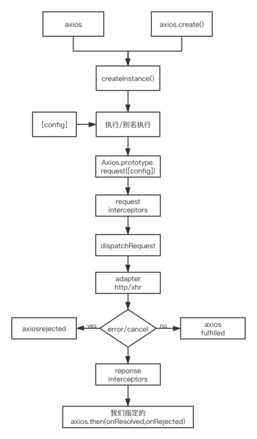

# [axios从无从下手到手到擒来(6)-源码分析之axios运行的整体流程](https://segmentfault.com/a/1190000021950095)

经过前几篇文章,相信各位看客已经对axios有更好的理解了.现在再看一下axios的运行流程,那简直就是so easy


**我们需要关注的重点部分**
request([config]) ==> dispatchRequest([config]) ==> adapter([config])
**1. request([config])**
request函数主要关注于将请求拦截器/dispatchRequest()/响应拦截器,通过promise链串联起来,最后返回promise
这一部分的代码已经在前面分析过了,不再赘述

**2. dispatchRequest([config])**
转换请求数据, 调用adapter函数发送请求,转换响应数据,返回promise
代码片段如下

```
//合并baseURL和url
combineURLs(config.baseURL, config.url)
//转换请求数据,
config.data = transformData(
    config.data,
    config.headers,
    config.transformRequest //重点是这个
)

* * *

//请求转换器
transformRequest: [function transformRequest(data, headers) {
    // 指定headers中更规范的请求头属性名,如将accpect转换为Accpect
    normalizeHeaderName(headers, 'Accept');
    normalizeHeaderName(headers, 'Content-Type');

    if (utils.isFormData(data) || utils.isArrayBuffer(data) ||
      utils.isBuffer(data) || utils.isStream(data) ||
      utils.isFile(data) || utils.isBlob(data)
    ) {
      return data;
    }
    if (utils.isArrayBufferView(data)) {
      return data.buffer;
    }
    if (utils.isURLSearchParams(data)) {
      setContentTypeIfUnset(headers, 'application/x-www-form-urlencoded;charset=utf-8');
      return data.toString();
    }
    /*一般我们传递的data都是js对象,所以看一下这里就可以了
      设置Content-Type为json格式,并且把data对象转换为json字符串.
    */一点也不神奇...
    if (utils.isObject(data)) {
      setContentTypeIfUnset(headers, 'application/json;charset=utf-8');
      return JSON.stringify(data);
    }
    return data;
  }],

* * *

//转换完请求data,再merge一下config里的header
config.headers = utils.merge(
    config.headers.common || {},
    config.headers[config.method] || {},
    config.headers || {}
);
//选择一个适配器,defaults.adapter是通过判断全局有没有progress属性来决定用http还是xhr
var adapter = config.adapter || defaults.adapter
//对于我们来说,adapter就是一个返回promise的xhr封装
return adapter(config).then(function onAdapterResolution(response) {
throwIfCancellationRequested(config);

/* 转换响应数据*/
response.data = transformData(
  response.data,
  response.headers,
  config.transformResponse //在这里转换的,其实很简单,就是JSON.parse()
);
return response;
},function onAdapterRejection(reason)(){
  //中断请求的话,要做一番处理
  if (!isCancel(reason)) { 
      throwIfCancellationRequested(config);

      // Transform response data
      if (reason && reason.response) {
        reason.response.data = transformData(
          reason.response.data,
          reason.response.headers,
          config.transformResponse
        );
      }
    }
    //返回失败的promise
    return Promise.reject(reason);
}


* * *
//看,是不是感觉撕开华丽的包装袋,里面就五毛钱的感觉?
transformResponse: [function transformResponse(data) {
if (typeof data === 'string') {
  try {
    data = JSON.parse(data);
    /*为啥catch里啥也不做呢?
    它就只将string转换为obj,其他的数据原样往后传递不做处理
    也不能抛异常,一旦抛了异常,即使请求成功,promise也成了失败
    */
  } catch (e) { /* Ignore */ }
}
return data;
}],
* * *
```

**3. adapter([config])**
通过判断全局中是否有process来决定用http/xhr,创建请求对象,根据config进行相应的设置,发送请求,接收响应数据,返回promise.
xhrAdapter的代码片段

```
// 返回一个promise
return new Promise(function dispatchXhrRequest(resolve, reject) {
    // 创建XHR对象
    var request = new XMLHttpRequest();
    // 初始化请求,主要是拼接url的queryParams
    request.open(config.method.toUpperCase(), buildURL(config.url, config.params, config.paramsSerializer), true);
})
    // 绑定请求状态改变的监听
    request.onreadystatechange = function handleLoad() {
      // request不存在或请求状态不是4, 直接结束
      if (!request || request.readyState !== 4) {
        return;
      }
      //准备response对象
      var response = {
        data: responseData,
        status: request.status,
        statusText: request.statusText,
        headers: responseHeaders,
        config: config,
        request: request
      };
      //根据响应状态码来确定请求的promise的结果状态(成功/失败)
      settle(resolve, reject, response);
      }

* * *
function settle(resolve, reject, response) {
  var validateStatus = response.config.validateStatus;
  
  if (!validateStatus || validateStatus(response.status)) {
    //简单暴力判断status
    resolve(response);
  } else {
    reject(createError(
      'Request failed with status code ' + response.status,
      response.config,
      null,
      response.request,
      response
    ));
  }
  
  // 判断响应状态码的合法性: [200, 300)
  validateStatus: function validateStatus(status) {
    return status >= 200 && status < 300;
  }

* * *
// 绑定请求中断监听 onabort
// 绑定请求错误监听 onerror
// 绑定请求超时监听 ontimeout
...
// 绑定下载/上传进度的监听
//处理config中的cancelToken
//发送请求
request.send(requestData);
      
```

###### axios系列传送门

[axios从无从下手到手到擒来(1)-使用XMLHttpRequest封装简单的ajax请求函数](https://segmentfault.com/a/1190000021944305)
[axios从无从下手到手到擒来(2)-axios的理解与使用](https://segmentfault.com/a/1190000021944651)
[axios从无从下手到手到擒来(3)-源码分析之整体结构](https://segmentfault.com/a/1190000021948563)
[axios从无从下手到手到擒来(4)-源码分析之axios与Axios的关系](https://segmentfault.com/a/1190000021949448)
[axios从无从下手到手到擒来(5)-源码分析之默认axios与axios.create()的区别](https://segmentfault.com/a/1190000021949834)
[axios从无从下手到手到擒来(6)-源码分析之axios运行的整体流程](https://segmentfault.com/a/1190000021950095)