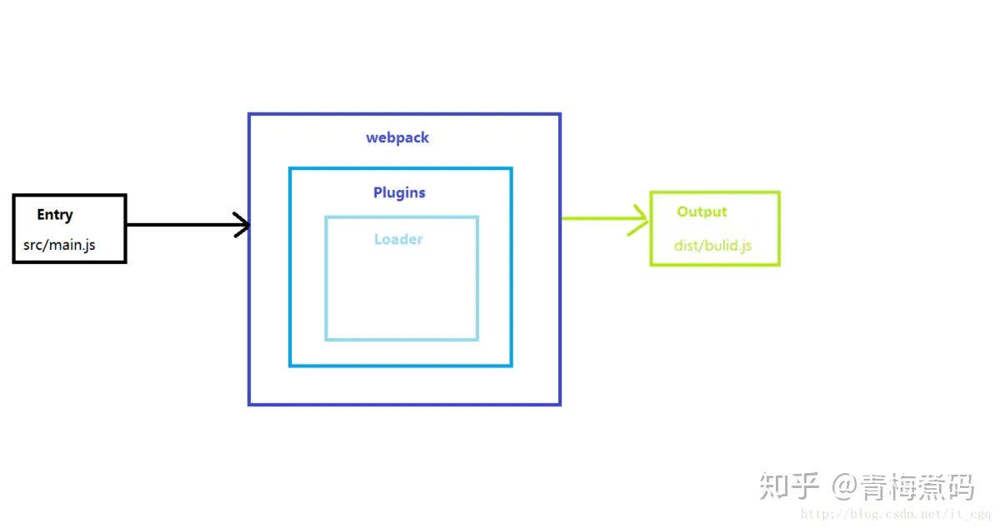

# webpack介绍、配置、使用

[青梅煮码](https://www.zhihu.com/people/qmzm.io)[](https://www.zhihu.com/question/48510028)

中山市本地贝网络科技有限公司 前端工程师

12 人赞同了该文章

## [Webpack](https://link.zhihu.com/?target=https%3A//www.dxel.cn/tag/webpack/)介绍和使用

### 一、[web](https://link.zhihu.com/?target=https%3A//www.dxel.cn/tag/web/)p[a](https://link.zhihu.com/?target=https%3A//www.dxel.cn/tag/a/)ck介绍

### 1、由来

由于[前端](https://link.zhihu.com/?target=https%3A//www.dxel.cn/tag/%e5%89%8d%e7%ab%af/)之前[js](https://link.zhihu.com/?target=https%3A//www.dxel.cn/tag/js-2/)、[css](https://link.zhihu.com/?target=https%3A//www.dxel.cn/tag/css/)、图片文件需要单独进行压缩和打包，这样团队人员处理很繁琐，然后 Instagram 团队就想让这些工作自动化，然后webpack应运而生。

### 2、介绍

webpack是一个模块打包器（module bundler），webpack视[html](https://link.zhihu.com/?target=https%3A//www.dxel.cn/tag/html/)，JS，C[ss](https://link.zhihu.com/?target=https%3A//www.dxel.cn/tag/ss/)，图片等文件都是一种 **资源** ，每个资源文件都是一个模块（module）文件，webpack就是根据每个模块文件之间的依赖关系将所有的模块打包（bundle）起来。

### 3、作用

- 对 CommonJS 、 AMD 、[ES6](https://link.zhihu.com/?target=https%3A//www.dxel.cn/tag/es6/)的语法做了[兼容](https://link.zhihu.com/?target=https%3A//www.dxel.cn/tag/%e5%85%bc%e5%ae%b9/)
- 对js、css、图片等资源文件都支持打包（适合团队化开发）
- 比方你写一个js文件，另外一个人也写一个js文件，需要合并很麻烦，现在交给webpack合并很简单
- 有独立的配置文件webpack.config.js
- 可以将代码切割成不同的chunk，实现按需加载，降低了初始化时间
- 具有强大的Plugin（插件）接口，大多是内部插件，使用起来比较灵活
- ……

### 4、拓展说明

- CommonJS、AMD、CMD是用于[javascript](https://link.zhihu.com/?target=https%3A//www.dxel.cn/tag/js/)模块管理的三大规范，CommonJS定义的是模块的同步加载，是一个更偏向于服务器端的规范（也可以在[浏览器](https://link.zhihu.com/?target=https%3A//www.dxel.cn/tag/%e6%b5%8f%e8%a7%88%e5%99%a8/)中使用），主要用于[node](https://link.zhihu.com/?target=https%3A//www.dxel.cn/tag/node/)js，根据CommonJS规范，一个单独的文件就是一个模块，加载模块使用`reqUIre()`方法，该方法读取一个文件并执行，最后返回文件内部的exports对象。

- AMD和CMD则是定义模块异步加载适用于浏览器端，都是为了 [ja](https://link.zhihu.com/?target=https%3A//www.dxel.cn/tag/ja/)vaScript 的[模块化](https://link.zhihu.com/?target=https%3A//www.dxel.cn/tag/%e6%a8%a1%e5%9d%97%e5%8c%96/)开发，（这里说一下为什要有异步加载，因为浏览器如果使用common.js同步加载模块的话，就会导致性能等问题，所以针对这个问题，又出了一个规范，这个规范可以实现异步加载依赖模块）

- - AMD规范会提前加载依赖模块，AMD规范是通过requireJs 在推广过程中对模块定义的规范化产出.

  - CMD规范会延迟加载依赖模块， CMD 规范是 SeaJs 在推广过程中对模块定义的规范化产出。

  - AMD规范和CMD规范的区别

  - - 对于依赖的模块，AMD 是**提前执行**，CMD 是**延迟执行**。不过 RequireJS 从 2.0 开始，也改成可以延迟执行（根据写法不同，处理方式不同）
    - CMD 推崇**依赖就近**，AMD 推崇**依赖前置**
    - AMD 的 API 默认是**一个当多个用**，CMD 的 API 严格区分，推崇**职责单一**。比如 AMD 里，require 分全局 require 和局部 require，都叫 require。CMD 里，没有全局 require，而是根据模块系统的完备性，提供 seajs.use 来实现模块系统的加载启动。CMD 里，每个 API 都**简单纯粹**


- - webpack和[Gulp](https://link.zhihu.com/?target=https%3A//www.dxel.cn/tag/gulp/)的区别

  - - gulp是前端自动化构建工具，强调的是前端开发的工作流程，我们可以通过配置一系列的task，定义task处理的事情（代码压缩、合并、编译、浏览器实时更新等），然后定义执行顺序，来让gulp执行这些task，从而构建项目的整个前端开发流程，自动化构建工具并不能把所有模块打包到一起，也不能构建不同模块之间的依赖关系。
    - webpack是 JavaScript 应用程序的模块打包器，强调的是一个前端模块化方案，更侧重模块打包，我们可以把开发中的所有资源（图片、js文件、css文件等）都看成模块，通过loader（加载器）和plugins（插件）对资源进行处理，打包成符合生产环境部署的前端资源。


### 5、webpack整体认知

 (1)、webpack的核心概念分为 入口(Entry)、加载器(Loader)、插件(Plugins)、出口(Output);



webpack整体认知

- *入口(Entry)：入口起点*告诉 webpack *从哪里开始*，并根据依赖关系图确定**需要打包的文件内容**
- 加载器(Loader)：webpack 将所有的资源（css, js, image 等）都看做模块，但是 webpack 能处理的只是 JavaScript，因此，需要存在一个能将其他资源转换为模块，让 webpack 能将其加入依赖树中的东西，它就是 loader。loader用于对模块的源代码进行转换。loader 可以使你在 [import](https://link.zhihu.com/?target=https%3A//www.dxel.cn/tag/import/) 或”加载”模块时**预处理文件**。因此，loader 类似于其他构建工具中“任务(task)”，并提供了处理前端构建步骤的强大方法

```js
rules: [
 {
 test: /\.(js|jsx)$/,
 use: 'babel-loader'
 }
]
 
```

- 插件(Plugins)：loader 只能针对某种特定类型的文件进行处理，而 plugin 的功能则更为强大。在 plugin 中能够介入到整个 webpack 编译的生命周期，Plugins用于解决 loader 无法实现的其他事情，也就是说loader是预处理文件，那plugin 就是后处理文件。

- - 对loader打包后的模块文件（bundle.js）进行二次优化处理，例如：代码压缩从而减小文件体积
  - 提供辅助开发的作用：例如：热更新（浏览器实时显示）


```text
plugins: [
 new webpack.optimize.UglifyJsPlugin(),
 new HtmlWebpackPlugin({template: './src/index.html'})
]
 
```

### 二、webpack安装

### 1、安装node

使用 `node -v` 命令检查版本

### 2、安装c[npm](https://link.zhihu.com/?target=https%3A//www.dxel.cn/tag/npm/)

[https://cnpmjs.org/](https://link.zhihu.com/?target=https%3A//cnpmjs.org/)

```text
npm install -g cnpm --registry=https://registry.npm.taobao.org
```

使用 `cnpm -v` 命令检查版本

### 3、安装nrm的两种方法

[https://www.npmjs.com/package/nrm](https://link.zhihu.com/?target=https%3A//www.npmjs.com/package/nrm)

```
nrm`可以帮助我们切换不同的NPM源的快捷开关，可以切换的NPM源包括：`npm`，`cnpm`，`taobao`， `rednpm`， `npmMirror` ， `edunpm
第一种方法（由于是外网访问进行安装，可能会被墙）
npm install -g nrm 

第二种方法（国内的淘宝镜像，访问稳定，推荐）
cnpm install -g nrm 
```

使用 `nrm - V` 命令检查版本(注意这里的 V 是大写的)

- 使用`nrm ls` 命令可以查看当前可以可以切换的 NPM源
- 使用 `npm use cnpm` 命令 指定要使用的哪种NPM源

### 4、安装webpack

```text
npm install --global webpack
```

- 在项目中安装最新版本或特定版本，分别执行以下命令：

```text
npm install --save-dev webpack
npm install --save-dev webpack@<version>
```

### 三、webpack配置

### 0、搭建项目结构

webpack（项目总目录）

- dist

- src

- - js

  - - moudle1.js


```text
function sum(x,y){
 return x + y;
}
// 导出 sum 函数
module.exports = sum;
```

- main.js

```text
 //2、获取 module1.js中的 sum函数
 var sum = require('./module1.js');
 res.value = sum(firstValue,twoValue);
 }
 
```

- index.[ht](https://link.zhihu.com/?target=https%3A//www.dxel.cn/tag/ht/)ml

```text
<!DOCTYPE html>
<html lang="en">
<head>
 <meta charset="UTF-8">
 <meta name="viewport" content="width=device-width, initial-scale=1.0">
 <title>Document</title>
</head>
 
<body>
 <input type="text" id="first">
 <input type="button" id="btn" value="+">
 <input type="text" id="two">
 <input type="button" id="btn" value="=">
 <input type="text" id="res">
 <script src="./dist/js/bulid.js"></script>
</body>
</html>
 
```

- webpack.config.js(手动创建)

```text
const path = require('path'); // 首先要引入node.js中path 模块，用于处理文件与目录的路径
 
// const 命令声明一个只读的常量，一旦声明，值不可以改变，改变会报错；只声明不赋值也会报错
// 常量存储的是一个不可以变化的变量。
// 
module.exports = {
 entry:'./src/./js/main.js', // 指定入口文件
 output:{
 path: path.resolve(__dirname, './dist/js'), // 指定出口文件的路径目录
 filename: 'bulid.js' // 制定出口文件的名称
 },
 
```

### 1、初始化一个项目（会创建一个package.json文件）

```text
npm init
```

### 2、在当前的项目中安装Webpack作为依赖

```text
npm install --save-dev webpack
```

> 说明：`--save` ：将配置信息保存到package.json中，
> 同时 `--save` ：也是项目生产环境，项目发布之后还依赖的东西，保存在de[PE](https://link.zhihu.com/?target=https%3A//www.dxel.cn/tag/pe/)ndencies
> 例如：如果你用了 [jquery](https://link.zhihu.com/?target=https%3A//www.dxel.cn/tag/jquery/)，由于发布之后还是依赖`jQuery`，所以是`dependencies`
> `--save-dev` ：是项目开发环境依赖的东西，保存在devDependencies中
> 例如：写 ES6 代码，如果你想编译成 `ES5` 发布那么 `babel` 就是`devDependencies`

### 3、当前项目结构


当前项目结构

### 4、实现CSS打包

```text
npm install css-loader style-loader --save-dev
或者
 
cnpm install css-loader style-loader --save-dev
```

- 在src—>css目录中新建main.css

```text
#first{
 border: 1px solid red;
}
```

- 在webpack.config.js中配置相关的loader

```text
const path = require('path'); // 首先要引入node.js中path 模块，用于处理文件与目录的路径
 
// const 命令声明一个只读的常量，一旦声明，值不可以改变，改变会报错；只声明不赋值也会报错
// 常量存储的是一个不可以变化的变量。
// 
module.exports = {
 entry:'./src/./js/main.js', // 指定入口文件
 output:{
 path: path.resolve(__dirname, './dist/js'), // 指定出口文件的路径目录
 filename: 'bulid.js' // 制定出口文件的名称
 },
 module:{
 rules:[
 // 在webpack2中，loaders 被替换成了 rules 其实就是loader的规则
 {
 test: /\.css$/,
 use: [ 'style-loader', 'css-loader' ]
 // test 说明了当前 loader 能处理那些类型的文件
 // use 则指定了 loader 的类型。
 // 注意：数组中的loader不能省略扩展名
 }
 ]
 }
}
 
 
```

- 在main.js中获取css目录中的main.css文件

```text
 //2、获取 module1.js中的 sum函数
 //http://www.ruanyifeng.com/blog/2015/05/require.html
 var sum = require('./module1.js');
 res.value = sum(firstValue,twoValue);
 }
 
 // 3、获取css目录中的main.css文件
 require('../css/main.css');
 
```

- 在终端中输入 `webpack`命令进行css文件打包

### 5、实现[scss](https://link.zhihu.com/?target=https%3A//www.dxel.cn/tag/scss/)打包

- 在src目录中新建 sass目录–> scss1.scss

```text
// scss1.scss文件
$color:purple;
#two{
 border:1px solid $color; 
}
```

- 安装对应的load

```js
npm install sass-loader node-sass webpack --save-dev

或者

cnpm install sass-loader css-loader style-loader node-sass webpack --save-dev
```


- 在webpack.config.js中配置相关的loader

```js
 const path = require('path'); // 首先要引入node.js中path 模块，用于处理文件与目录的路径
 
 // const 命令声明一个只读的常量，一旦声明，值不可以改变，改变会报错；只声明不赋值也会报错
 // 常量存储的是一个不可以变化的变量。
 // 
 module.exports = {
 entry:'./src/./js/main.js', // 指定入口文件
 output:{
 path: path.resolve(__dirname, './dist/js'), // 指定出口文件的路径目录
 filename: 'bulid.js' // 制定出口文件的名称
 },
 module:{
 rules:[
 // 在webpack2中，loaders 被替换成了 rules 其实就是loader的规则
 //  实现 css 打包
 {
 test: /\.css$/,
 use: [ 'style-loader', 'css-loader' ]
 // test 说明了当前 loader 能处理那些类型的文件
 // use 则指定了 loader 的类型。
 // 注意：数组中的loader不能省略扩展名
 },
 {
 test: /\.scss$/,
 // 注意 是sass-loader ，不是 scss-loader
 use: [ 'style-loader', 'css-loader', 'sass-loader' ]
 }
 
 ]
 }
 }
 
```

- 在js目录中 main.js里面引入 scss1.scss

```js
// 1、获取index.html中的dom对象
 
var first = document.getElementById('first');
var btn = document.getElementById('btn');
var two = document.getElementById('two');
var res = document.getElementById('res');
 
btn.onclick = function(){
 var firstValue = parseFloat(first.value);
 var twoValue = parseFloat(two.value);
 //2、获取 module1.js中的 sum函数
 //http://www.ruanyifeng.com/blog/2015/05/require.html
 var sum = require('./module1.js');
 res.value = sum(firstValue,twoValue);
}
 
// 3、获取css目录中的main.css文件
require('../css/main.css');
 
// 4、获取sass目录中的scss1.scss文件
require('../sass/scss1.scss');
```

- 在终端中输入 `webpack`命令进行scss文件打包

### 6、实现Less打包

- 安装

```text
cnpm install --save-dev
 
```


```js
cnpm install less less-loder css-loader style-loader  webpack --save-dev
或者
cnpm install less-loader less --save-在webpack.config.js中配置相关的loader
 
```

- 在在src目录中新建less目录–> less1.less

```js
@color:blue;
#res{
 border:1px dashed blue;
}
```

- 在webpack.config.js中配置相关的loader

```js
const path = require('path'); // 首先要引入node.js中path 模块，用于处理文件与目录的路径
 
// const 命令声明一个只读的常量，一旦声明，值不可以改变，改变会报错；只声明不赋值也会报错
// 常量存储的是一个不可以变化的变量。
// 
module.exports = {
 entry:'./src/./js/main.js', // 指定入口文件
 output:{
 path: path.resolve(__dirname, './dist/js'), // 指定出口文件的路径目录
 filename: 'bulid.js' // 制定出口文件的名称
 },
 module:{
 rules:[
 // 在webpack2中，loaders 被替换成了 rules 其实就是loader的规则
 //  实现 css 打包
 {
 test: /\.css$/,
 use: [ 'style-loader', 'css-loader' ]
 // test 说明了当前 loader 能处理那些类型的文件
 // use 则指定了 loader 的类型。
 // 注意：数组中的loader不能省略扩展名
 },
 // 实现 scss 打包
 {
 test: /\.scss$/,
 // 注意 是sass-loader ，不是 scss-loader
 use: [ 'style-loader', 'css-loader', 'sass-loader' ]
 },
 // 实现 less 打包
 {
 test: /\.less$/,
 use: [ 'style-loader', 'css-loader', 'less-loader' ]
 }
 
 ]
 }
}
```

- 在js目录中 main.js里面引入 less1.less文件

```js
// 5、获取less目录中的less1.less文件
require('../less/less1.less');
 
```

### 7、实现打包url资源（图片、gif、图标等）功能

- 在src 目录中 新建imgs目录，放入两张不同大小的图片
- 在index.html中新增 `<div id="bg1"></div>``<div id="bg2"></div>`
- 在mian.css中新增

```js
// mian.css文件
#bg1{
 width: 200px;
 height: 200px;
 background: url('../imgs/bxg.jpg');
}
 
#bg2{
 width: 200px;
 height: 200px;
 background: url('../imgs/web.jpg') no-repeat;
}
```

- 前言如果我们希望在页面引入图片（包括img的src和background的url）。当我们基于webpack进行开发时，引入图片会遇到一些问题。 其中一个就是引用路径的问题。拿background样式用url引入背景图来说，我们都知道，webpack最终会将各个模块打包成一个文件，因此我们样式中的url路径是相对入口html页面的，而不是相对于原始css文件所在的路径的。这就会导致图片引入失败。这个问题是用file-loader解决的，file-loader可以解析项目中的url引入（不仅限于css），根据我们的配置，将图片拷贝到相应的路径，再根据我们的配置，修改打包后文件引用路径，使之指向正确的文件。 另外，如果图片较多，会发很多[HTTP](https://link.zhihu.com/?target=https%3A//www.dxel.cn/tag/http/)请求，会降低页面性能。这个问题可以通过url-loader解决。url-loader会将引入的图片编码，生成dataURl。相当于把图片数据翻译成一串字符。再把这串字符打包到文件中，最终只需要引入这个文件就能访问图片了。当然，如果图片较大，编码会消耗性能。因此url-loader提供了一个[li](https://link.zhihu.com/?target=https%3A//www.dxel.cn/tag/li/)mit参数，小于limit字节的文件会被转为DataURl，大于limit的还会使用file-loader进行copy。 url-loader和file-loader是什么关系呢？简答地说，url-loader封装了file-loader。url-loader不依赖于file-loader，即使用url-loader时，只需要安装url-loader即可，不需要安装file-loader，因为url-loader内置了file-loader。通过上面的介绍，我们可以看到，url-loader工作分两种情况：1.文件大小小于limit参数，url-loader将会把文件转为DataURL；2.文件大小大于limit，url-loader会调用file-loader进行处理，参数也会直接传给file-loader。因此我们只需要安装url-loader即可。
- 安装

```js
cnpm install
 
```


```text
cnpm install url-loader file-loader --save-dev
 
```

- 在webpack.config.js中配置相关的loader

```js
const path = require('path'); // 首先要引入node.js中path 模块，用于处理文件与目录的路径
 
// const 命令声明一个只读的常量，一旦声明，值不可以改变，改变会报错；只声明不赋值也会报错
// 常量存储的是一个不可以变化的变量。
// 
module.exports = {
 entry:'./src/./js/main.js', // 指定入口文件
 output:{
 path: path.resolve(__dirname, './dist/js'), // 指定出口文件的路径目录
 filename: 'bulid.js' // 制定出口文件的名称
 publicPath:'dist/'
 // path:所有输出文件的目标路径;
 // publicPath:输出解析文件的目录，url 相对于 HTML 页面
 },
 module:{
 rules:[
 // 在webpack2中，loaders 被替换成了 rules 其实就是loader的规则
 //  实现 css 打包
 {
 test: /\.css$/,
 use: [ 'style-loader', 'css-loader' ]
 // test 说明了当前 loader 能处理那些类型的文件
 // use 则指定了 loader 的类型。
 // 注意：数组中的loader不能省略扩展名
 },
 // 实现 scss 打包
 {
 test: /\.scss$/,
 // 注意 是sass-loader ，不是 scss-loader
 use: [ 'style-loader', 'css-loader', 'sass-loader' ]
 },
 // 实现 less 打包
 {
 test: /\.less$/,
 use: [ 'style-loader', 'css-loader', 'less-loader' ]
 },
 // 实现 url 资源打包
 {
 // 图片和字体文件使用 url-loader 来处理
 test: /\.(png|jpg|gif|ttf|eot|woff|woff2|svg)$/,
 use: [
 {
 loader: 'url-loader',
 // options 为可以配置的选项
 options: {
 limit: 8192
 // limit=8192表示将所有小于8kb的图片都转为base64形式（为什么                               呢？因为一个很小的图片，不值当的去发送一个请求，减少请求次                               数。）
 // （其实应该说超过8kb的才使用 url-loader 来映射到文件，否                              则转为dataurl形式）
 }
 }
 ]
 //保证输出的图片名称与之前命名的图片名称保持一致(目前只是支持这样的写法，                   webpack3 没有响应的options进行配置)
 // use:'url-loader?limit=8192&name=imgs/[name].[ext]' 
 }
 
 ]
 }
 }
```

- 在main.js中引入mui目录中icons-extra.css的文件

```js
// 5、获取less目录中的less1.less文件
require('../less/less1.less');
 
// 6、获取src目录中的mui目录中icons-extra.css的文件
require('../mui/css/icons-extra.css');
```

### 8、Webpack-dev-server结合后端服务器的热替换配置

> `webpack-dev-server`提供了一个简单的 web 服务器，并且能够实时重新加载(live reloading)，同时把生成好的js和html构建到我们的电脑内存中，这样的话，即使我们的目录中没有了相关js等文件，还能够加载出来，这样能够提高我们页面运行速度。

- 安装 `webpack-dev-server` 插件

```js
// 先把之前依赖的包安装
cnpm install
 
```


```text
cnpm install webpack-dev-server --save-dev 
 
```


```js
 // webpack.config.js
 const path = require('path'); // 首先要引入node.js中path 模块，用于处理文件与目录的路径
 // const 命令声明一个只读的常量，一旦声明，值不可以改变，改变会报错；只声明不赋值也会报错
 // 常量存储的是一个不可以变化的变量。
 module.exports = {
 entry:'./src/./js/main.js', // 指定入口文件
 output:{
 path: path.resolve(__dirname, 'dist/js'), // 指定出口文件的路径目录
 filename: 'bulid.js' // 制定出口文件的名称
 },
 module:{
 rules:[
 // 在webpack2中，loaders 被替换成了 rules 其实就是loader的规则
 //  实现 css 打包
 {
 test: /\.css$/,
 use: [ 'style-loader', 'css-loader' ]
 // test 说明了当前 loader 能处理那些类型的文件
 // use 则指定了 loader 的类型。
 // 注意：数组中的loader不能省略扩展名
 },
 // 实现 scss 打包
 {
 test: /\.scss$/,
 // 注意 是sass-loader ，不是 scss-loader
 use: [ 'style-loader', 'css-loader', 'sass-loader' ]
 },
 // 实现 less 打包
 {
 test: /\.less$/,
 use: [ 'style-loader', 'css-loader', 'less-loader' ]
 },
 // 实现 url 资源打包
 {
 // 图片文件使用 url-loader 来处理
 test: /\.(png|jpg|gif|ttf)$/,
 use: [
 {
 loader: 'url-loader',
 // options 为可以配置的选项
 options: {
 limit: 8192
 // limit=8192表示将所有小于8kb的图片都转为base64形式
 // （其实应该说超过8kb的才使用 url-loader 来映射到文件，否则转为data url形式）
 }
 }
 ]
 }
 
 ]
 },
 devServer: {
 // contentBase: './dist', // 在 localhost:8080(默认) 下建立服务，将 dist 目录下的文件，作为可访问文件  contentBase：告诉服务器从哪里提供内容
 // 或者通过以下方式配置
 contentBase: path.join(__dirname, "dist"),
 compress: true,
 // 当它被设置为true的时候对所有的服务器资源采用gzip压缩
 // 对JS，CSS资源的压缩率很高，可以极大得提高文件传输的速率，从而提升web性能
 port: 9000, // 如果想要改端口，可以通过 port更改
 hot: true, // 启用 webpack 的模块热替换特性()
 inline: true, // 实现实时重载（实现自动刷新功能）默认情况下是 true。
 host: "localhost" // 如果你希望服务器外部可访问，指定使用一个 host。默认是 localhost(也就是你可以不写这个host这个配置属性)。
 }
 }
 
```


~~~json
// package.json
 {
 "name": "mywebpack",
 "version": "1.0.0",
 "description": "",
 "main": "webpack.config.js",
 "scripts": {
 "test": "echo \"Error: no test specified\" && exit 1",
 "start": "webpack-dev-server --open"
 // "start": "webpack-dev-server --open --port 8080 --hot --inline"  // 如果在这里配置了，就不用在webpack.config.js中配置devServer属性了。
 },
 "author": "",
 "license": "ISC",
 "devDependencies": {
 "css-loader": "^0.28.7",
 "file-loader": "^1.1.5",
 "html-webpack-plugin": "^2.30.1",
 "less": "^3.0.0-alpha.3",
 "less-loader": "^4.0.5",
 "node-sass": "^4.5.3",
 "sass-loader": "^6.0.6",
 "style-loader": "^0.19.0",
 "url-loader": "^0.6.2",
 "webpack": "^3.8.1",
 "webpack-dev-server": "^2.9.3"
 }
 }
 
 ```
 
- 在命令行中运行 `npm start`，就会看到浏览器自动加载页面。如果现在修改和保存任意源文件，web 服务器就会自动重新加载编译后的代码，但是打开后发现，打开的是 dist目录，我们想要的是 index.html显示我们的页面，所以这是我们还要借助里另一个 `html-webpack-plugin` 插件。
~~~

`html-webpack-plugin` 简单创建 HTML 文件，用于服务器访问，其中包括使用`script`标签的body中的所有webpack包。

- 安装 `html-webpack-plugin` 插件

```text
cnpm install --save-dev html-webpack-plugin
```

- webpack.config.js配置

```js
const path = require('path'); // 首先要引入node.js中path 模块，用于处理文件与目录的路径
// const 命令声明一个只读的常量，一旦声明，值不可以改变，改变会报错；只声明不赋值也会报错
// 常量存储的是一个不可以变化的变量。
 
// 引入html-webpack-plugin 插件
const HtmlWebpackPlugin = require('html-webpack-plugin');
 
const webpack = require('webpack');
module.exports = {
 entry: './src/./js/main.js', // 指定入口文件
 output: {
 path: path.resolve(__dirname, 'dist/js'), // 指定出口文件的路径目录
 filename: 'bulid.js' // 制定出口文件的名称
 },
 module: {
 rules: [
 // 在webpack2中，loaders 被替换成了 rules 其实就是loader的规则
 //  实现 css 打包
 {
 test: /\.css$/,
 use: ['style-loader', 'css-loader']
 // test 说明了当前 loader 能处理那些类型的文件
 // use 则指定了 loader 的类型。
 // 注意：数组中的loader不能省略扩展名
 },
 // 实现 scss 打包
 {
 test: /\.scss$/,
 // 注意 是sass-loader ，不是 scss-loader
 use: ['style-loader', 'css-loader', 'sass-loader']
 },
 // 实现 less 打包
 {
 test: /\.less$/,
 use: ['style-loader', 'css-loader', 'less-loader']
 },
 // 实现 url 资源打包
 {
 // 图片文件使用 url-loader 来处理
 test: /\.(png|jpg|gif|ttf)$/,
 use: [{
 loader: 'url-loader',
 // options 为可以配置的选项
 options: {
 limit: 8192
 // limit=8192表示将所有小于8kb的图片都转为base64形式
 // （其实应该说超过8kb的才使用 url-loader 来映射到文件，否则转为data url形式）
 }
 }]
 }
 
 ]
 },
 devServer: {
 // contentBase: './dist', // 在 localhost:8080(默认) 下建立服务，将 dist 目录下的文件，作为可访问文件  contentBase：告诉服务器从哪里提供内容
 // 或者通过以下方式配置
 contentBase: path.join(__dirname, "dist"),
 port: 9000, // 如果想要改端口，可以通过 port更改
 hot: true, // 启用 webpack 的模块热替换特性()
 inline: true, // 实现实时重载（实现自动刷新功能）默认情况下是 true。
 host: "localhost" // 如果你希望服务器外部可访问，指定使用一个 host。默认是 localhost(也就是你可以不写这个host这个配置属性)。
 },
 plugins: [
 new HtmlWebpackPlugin({
 title: '首页', // 用于生成的HTML文档的标题
 filename: 'index.html', //写入HTML的文件。默认为index.html。也可以指定一个子目录（例如：）assets/admin.html
 template: 'index.html' // Webpack需要模板的路径
 }),
 new webpack.HotModuleReplacementPlugin() // 需要结合 启用热替换模块(Hot Module Replacement)，也被称为 HMR
 ]
}
```

- 再次使用`npm start`命令就可以实现浏览器自动更新。
- 问题来了，HtmlWebpackPlugin中的 title并没有显示出来，原因是需要在定义的template模板中使用ejs语法，

```html
<!DOCTYPE html>
<html lang="en">
<head>
 <meta charset="UTF-8">
 <meta name="viewport" content="width=device-width, initial-scale=1.0">
 <!-- EJS 语法 
 /* EJS是一个简单高效的模板语言，通过数据和模板，可以生成HTML标记文本。可以说EJS是一个JavaScript库，EJS可以同时运行在客户端和服务器端，客户端安装直接引入文件即可 */
 -->
 <title><%= htmlWebpackPlugin.options.title%></title>
</head>
 
<body>
 <input type="text" id="first">
 <input type="button" id="btn" value="+">
 <input type="text" id="two">
 <input type="button" id="btn" value="=">
 <input type="text" id="res">
 <div id="bg1"></div>
 <div id="bg2"></div>
</body>
</html>
 
```

- 再次使用`npm start`命令就可以啦。

### 9、ES6转换为ES5语法

- 安装

```text
cnpm install --save-dev babel-loader babel-core babel-preset-env
 
```

- `babel-core`如果某些代码需要调用Babel的API进行转码，就要使用`babel-core`模块
- - - `babel-prESET-env`通过根据您的目标浏览器或运行时环境自动确定您需要的Babel插件


- - babel 对一些公共方法使用了非常小的辅助代码，比如 `_extend`。 默认情况下会被添加到每一个需要它的文件中,你可以引入 babel runtime 作为一个独立模块，来避免重复引入。

  - - 你必须执行 `npm install babel-plugin-transform-runtime --save-dev` 来把它包含到你的项目中，也要使用 `npm install babel-runtime --save` 把 `babel-runtime` 安装为一个依赖


- 配置


```js
// 实现 url 资源打包
 {
 // 图片文件使用 url-loader 来处理
 test: /\.(png|jpg|gif|ttf)$/,
 use: [{
 loader: 'url-loader',
 // options 为可以配置的选项
 options: {
 limit: 8192
 // limit=8192表示将所有小于8kb的图片都转为base64形式
 // （其实应该说超过8kb的才使用 url-loader 来映射到文件，否则转为data url形式）
 }
 }]
 },
 // 实现 ES6转 ES5
 {
 test: /\.js$/,
 exclude: /(node_modules)/, // exclude 排除的意思，把 node_modules文件夹排除编译之外
 use: {
 loader: 'babel-loader',
 options: {
 // presets 预设列表（一组插件）加载和使用
 presets: ['env'],
 plugins: ['transform-runtime'] // 加载和使用的插件列表
 }
 }
 }
 
 
```

- 把一些代码改成ES6 语法的写法

```js
// moudule1.js
 
function sum(x,y){
 return x + y;
}
// 导出 sum 函数
// module.exports = sum;
 // 改成ES6 的写法语法
export default{
 sum
}
```


~~~js
 // main.js
 
 // 1、获取index.html中的dom对象
 var first = document.getElementById('first');
 var btn1 = document.getElementById('btn1');
 var two = document.getElementById('two');
 var res = document.getElementById('res');
 console.log(1);
 btn1.onclick = function() {
 var firstValue = parseFloat(first.value);
 var twoValue = parseFloat(two.value);
 //2、获取 module1.js中的 sum函数
 //http://www.ruanyifeng.com/blog/2015/05/require.html
 console.log(2);
 
 /* var sum = require('./module1.js');
         res.value = sum(firstValue,twoValue);*/
 res.value = sumObj.sum(firstValue, twoValue);
 }
 
 // 3、获取css目录中的main.css文件
 // require('../css/main.css');
 
 //  把步骤3 改为 ES6写法,引入css目录中的main.css文件
 import '../css/main.css';
 
 // 4、获取sass目录中的scss1.scss文件
 require('../sass/scss1.scss');
 
 // 5、获取less目录中的less1.less文件
 require('../less/less1.less');
 
 // 6、获取src目录中的mui目录中icons-extra.css的文件
 require('../mui/css/icons-extra.css');
 
 // 把 var sum = require('./module1.js'); 写成 ES6语法
 import sumObj from './module1.js'
 ```
~~~

### 10、防止文件缓存（生成带有20位的[hash](https://link.zhihu.com/?target=https%3A//www.dxel.cn/tag/hash/)值的唯一文件）

```js
// webpack.config.js
 
output: {
 path: path.resolve(__dirname, 'dist/js'), // 指定出口文件的路径目录
 // filename: 'bulid.js' // 制定出口文件的名称
 filename: '[name].[hash].js' // 将入口文件重命名为带有20位的hash值的唯一文件
 }
```

### 11、抽取CSS为单独文件

- 安装插件从 build.js文件中提取文本（CSS）到单独的文件

```text
npm install --save-dev extract-text-webpack-plugin
 
```

- 在webpack.config.js中配置

```js
const path = require('path'); // 首先要引入node.js中path 模块，用于处理文件与目录的路径
// const 命令声明一个只读的常量，一旦声明，值不可以改变，改变会报错；只声明不赋值也会报错
// 常量存储的是一个不可以变化的变量。
 
// 引入html-webpack-plugin 插件
const HtmlWebpackPlugin = require('html-webpack-plugin');
 
const webpack = require('webpack');
 
const ExtractTextPlugin = require("extract-text-webpack-plugin");
 
module.exports = {
 entry: './src/./js/main.js', // 指定入口文件
 output: {
 path: path.resolve(__dirname, 'dist'), // 指定出口文件的路径目录
 // filename: 'bulid.js' // 制定出口文件的名称
 // path指定了本地构建地址，publicPath指定在浏览器中所引用的,指定的是构建后在html里的路径
 // publicPath: './',
 // 将入口文件重命名为带有20位的hash值的唯一文件
 filename: '[name].[hash].js' 
 },
 module: {
 rules: [
 // 在webpack2中，loaders 被替换成了 rules 其实就是loader的规则
 //  实现 css 打包
 /*{
                test: /\.css$/,
                use: ['style-loader', 'css-loader']
                    // test 说明了当前 loader 能处理那些类型的文件
                    // use 则指定了 loader 的类型。
                    // 注意：数组中的loader不能省略扩展名
            },*/
 // 实现 scss 打包
 {
 test: /\.scss$/,
 // 注意 是sass-loader ，不是 scss-loader
 use: ['style-loader', 'css-loader', 'sass-loader']
 },
 // 实现 less 打包
 {
 test: /\.less$/,
 use: ['style-loader', 'css-loader', 'less-loader']
 },
 // 实现 url 资源打包
 {
 // 图片文件使用 url-loader 来处理
 test: /\.(png|jpg|gif|ttf)$/,
 use: [{
 loader: 'url-loader',
 // options 为可以配置的选项
 options: {
 limit: 8192
 // limit=8192表示将所有小于8kb的图片都转为base64形式
 // （其实应该说超过8kb的才使用 url-loader 来映射到文件，否则转为data url形式）
 }
 }]
 //保证输出的图片名称与之前命名的图片名称保持一致(目前只是支持这样的写法，                   webpack3 没有响应的options进行配置)
 // use:'url-loader?limit=8192&name=imgs/[name].[ext]' 
 },
 // 实现 ES6转 ES5
 {
 test: /\.js$/,
 exclude: /(node_modules)/, // exclude 排除的意思，把 node_modules文件夹排除编译之外
 use: {
 loader: 'babel-loader',
 options: {
 // presets 预设列表（一组插件）加载和使用
 presets: ['env'],
 plugins: ['transform-runtime'] // 加载和使用的插件列表
 }
 }
 },
 // 提取 css模块（如果使用这个模块的话，需要把之前的CSS打包模块注释掉，不然会重复）
 {
 test: /\.css$/,
 use: ExtractTextPlugin.extract({
 fallback: "style-loader",
 use: "css-loader"
 })
 }
 
 ]
 },
 devServer: {
 // contentBase: './dist', // 在 localhost:8080(默认) 下建立服务，将 dist 目录下的文件，作为可访问文件  contentBase：告诉服务器从哪里提供内容
 // 或者通过以下方式配置
 contentBase: path.join(__dirname, "dist"),
 port: 9000, // 如果想要改端口，可以通过 port更改
 hot: true, // 启用 webpack 的模块热替换特性()
 inline: true, // 实现实时重载（实现自动刷新功能）默认情况下是 true。
 host: "localhost" // 如果你希望服务器外部可访问，指定使用一个 host。默认是 localhost(也就是你可以不写这个host这个配置属性)。
 },
 plugins: [
 // 从 bundle 中提取文本（CSS）到单独的文件      
 new ExtractTextPlugin({
 //  提取css，并重名为带有 20位的hash值的唯一文件
 filename: '[name].[hash].css',
 // 将所有的独立文件模块（这里指的是css文件）合并成一个文件
 allChunks: true
 }),
 new HtmlWebpackPlugin({
 title: '首页', // 用于生成的HTML文档的标题
 filename: 'index.html', //写入HTML的文件。默认为index.html。也可以指定一个子目录（例如：）assets/admin.html
 template: 'index.html' // Webpack需要模板的路径
 // template: 'index.ejs' // Webpack需要模板的路径
 }),
 // 需要结合webpack-dev-server 启用热替换模块(Hot Module Replacement)，也被称为 HMR
 new webpack.HotModuleReplacementPlugin()
 ]
}
 
```

### 12、开发环境和生产环境的分离

（1）开发环境与生产环境分离的原因如下：

- 在开发环境中，我们使用热更新插件帮助我们实现浏览器的自动更新功能，我们的代码没有进行压缩，如果压缩了不方便我们调试代码等等，所以以上这些代码不应出现在生产环境中。
- 生产环境中，我们把项目部署到服务器时，我们会对代码进行各种各样的优化，比如压缩代码等等，这时候我们不应该把这些代码放到开发环境中，不利于代码开发和调试。

总结：针对以上这些说明，我们很有必要把区分开发环境与生产环境分离。

（2）开发环境的配置和生产换环境配置的区别。

- 开发环境有的配置，生产环境不一定有，比如说热更新时使用到的`HotModuleReplacementPlugin`。

- 生产环境有的配置，开发环境不一定有，比如说用来压缩js用的`UglifyJsPlugin`。

- 如何去做？

- - 1> 因为webpack 默认找的是 webpack.config.js配置文件，所以要把开发环境的webpack.config.js配置文件改为webpack.dev.config.js代表开发环境的配置文件。
  - 2> 新建一个webpack.prod.config.js，再把开发环境中的webpack.config.js复制进去（**没用的配置文件该删除的删除**）
  - 3> 修改package.json文件（在`scripts` 标签中添加`"dev"`和`"prod"` 属性配置）

```json
 "scripts": { "scripts": {
 "test": "echo \"Error: no test specified\" && exit 1",
 "dev": "webpack --config webpack.dev.config.js",
 "prod": "webpack --config webpack.prod.config.js"
 },
```

- 怎样执行命令

- - 执行开发环境的中配置

```text
npm run dev
```


- - 执行生产环境的中配置

```text
npm run prod
```


### 13、在生产环境中配置代码压缩功能

- 配置webpack.prod.config.js 文件

```js
// webpack.prod.config.js
 
var UglifyJsPlugin = webpack.optimize.UglifyJsPlugin;
 
 // ……
 
 plugins: [
 
 // ……
 
 // js代码 压缩
 new UglifyJsPlugin({
 compress: {
 warnings: false
 }
 })
 ]
 
```

- 执行 `npm run prod` 命令

### 四、webpack1和webpack2的区别

（webpack1.0已经废弃使用，建议使用webpack2.0+）

 webpack1和webpack2的区别：[https://webpack.js.org/guides/migrating/](https://link.zhihu.com/?target=https%3A//link.jianshu.com/%3Ft%3Dhttps%3A//webpack.js.org/guides/migrating/)

 1、`resolve.modulesDirectories` 被重命名为 `resolve.modules`

 2、module.loaders 将继续支持，但在未来它将被module.rules 替换。