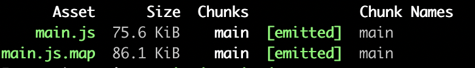
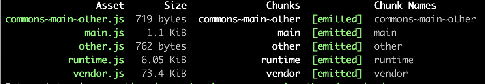

# Webpack 理解 Chunk

https://juejin.cn/post/6844903889393680392

# 期望

希望读过本篇文章，你在看Webpack配置的时候，能在脑中形成Chunk的生成过程。

# Chunk

Chunk不同于entry、 output、module这样的概念，它们对应着Webpack配置对象中的一个字段，Chunk没有单独的配置字段，但是这个词出现在CommonsChunkPlugin（Webpack3以前）、optimization.splitChunks（Webpack4以后）这样的名称之中。

Chunk是我们理解Webpack，必须理解的一个概念。

Chunk在Webpack里指一个代码块，那具体是指什么样的代码块呢？

## Chunk VS Module

### Module

首先来说module，Webpack可以看做是模块打包机，我们编写的任何文件，对于Webpack来说，都是一个个模块。所以Webpack的配置文件，有一个module字段，module下有一个rules字段，rules下有就是处理模块的规则，配置哪类的模块，交由哪类loader来处理。

```
module: {
    rules: [
      {
        test: /\.css$/,
        use: [
          {
            loader: "style-loader"
          }, {
            loader: "css-loader"
          }
        ]
      },
      ...
    ]
  },
复制代码
```

### Chunk

Chunk是Webpack打包过程中，一堆module的集合。我们知道Webpack的打包是从一个入口文件开始，也可以说是入口模块，入口模块引用这其他模块，模块再引用模块。Webpack通过引用关系逐个打包模块，这些module就形成了一个Chunk。

如果我们有多个入口文件，可能会产出多条打包路径，一条路径就会形成一个Chunk。出了入口entry会产生Chunk，还有两种途径，下面会有介绍。

## Chunk VS Bundle

通常我们会弄混这两个概念，以为Chunk就是Bundle，Bundle就是我们最终输出的一个或多个打包文件。确实，大多数情况下，一个Chunk会生产一个Bundle。但有时候也不完全是一对一的关系，比如我们把 devtool配置成'source-map'。然后只有一个入口文件，也不配置代码分割：

```
 // webpack配置
 entry: {
    main: __dirname + "/app/main.js",
 },
 output: {
    path: __dirname + "/public",//打包后的文件存放的地方
    filename: "[name].js", //打包后输出文件的文件名
  },
 devtool: 'source-map',
复制代码
```

这样的配置，会产生一个Chunk，但是会产生两个bundle，如下图



注意到Chunk Names那列，只有main这么一个Chunk，再看Asset这一列，产生了两个bundle，还有一个.map文件。


这就是Chunk和Bundle的区别，Chunk是过程中的代码块，Bundle是结果的代码块。

查看Webpack源码，发现有一个Chunk.js，点进去看：

```
/**
 * A Chunk is a unit of encapsulation for Modules.
 * Chunks are "rendered" into bundles that get emitted when the build completes.
 */
class Chunk {
}
复制代码
```

里面有一个Chunk类，这说明类Webpack在运行中，会生成Chunk对象，也能证明Chunk是过程中的代码块。

Chunk类上面的两句注释：一个Chunk是一些模块的封装单元。Chunk在构建完成就呈现为bundle。

# 产生Chunk的三种途径

1. entry入口
2. 异步加载模块
3. 代码分割（code spliting）

## entry产生Chunk

entry的配置有三种方式：

### 传递一个字符串

```
entry: './src/js/main.js',
复制代码
```

这种情况只会产生一个Chunk。（这里只说entry对Chunk的影响，不涉及代码分割）

### 传递数组

```
entry: ['./src/js/main.js','./src/js/other.js'],

复制代码
```

这种情况也只会产生一个Chunk。Webpack会将数组里的源代码，最终都打包到一个Bundle里，原因就是只生成了一个Chunk.

### 传递对象

```
entry: {
    main: './src/js/main.js',
    other: './src/js/other.js'
},
output: {
    // path: __dirname + "/public",
    // filename:'bundle.js'
    // 以上2行会报错 

    path: __dirname + "/public",//打包后的文件存放的地方
    filename: "[name].js", //打包后输出文件的文件名

}

复制代码
```

对象中一个字段就会产生一个Chunk，所以在output中filename直接写死名称，会报错。因为上面的配置，产生了两个Chunk，最终会生成两个Bundle，一个名称肯定不够用了。需要用[name]变量来利用entry下的字段名称，作为生成Bundle们的名称。

这里面entry的key，也被用来当作它对应的Chunk的名称，上面传递一个字符串和传递数组两种方式，没有key，也会默认给生成的Chunk一个main的名称。

## 异步产生Chunk

除了入口文件会影响Chunk，异步加载的模块，也需要生成Chunk。

```
{
    entry: {
        "index": "pages/index.jsx"
    },
    output: {
         filename: "[name].min.js",
        chunkFilename: "[name].min.js"
    }
}
const myModel = r => require.ensure([], () => r(require('./myVue.vue')), 'myModel')
复制代码
```

这个时候chunkFilename字段就派上用场了，为异步加载的Chunk命名。

## 代码分割产生Chunk

我们来分析一下，下面代码会产生几个Chunk，其中main.js文件和two.js文件，都引用了同一个greeter.js文件。main.js中使用了react。

```
module.exports = {
  entry: {
    main: __dirname + "/app/main.js",
    other: __dirname + "/app/two.js",
  },
  output: {
    path: __dirname + "/public",//打包后的文件存放的地方
    filename: "[name].js", //打包后输出文件的文件名
    chunkFilename: '[name].js',
  },

  optimization: {
    runtimeChunk: "single",
    splitChunks: {
      cacheGroups: {
        commons: {
          chunks: "initial",
          minChunks: 2,
          maxInitialRequests: 5, // The default limit is too small to showcase the effect
          minSize: 0 // This is example is too small to create commons chunks
        },
        vendor: {
          test: /node_modules/,
          chunks: "initial",
          name: "vendor",
          priority: 10,
          enforce: true
        }

      },
    }
  }
}

复制代码
```

答案是5个，两个入口分别产生一个， runtimeChunk: "single"会将Webpack在浏览器端运行时需要的代码单独抽离到一个文件，commons下的配置会产生一个Chunk，vendor下的配置会产生一个Chunk。如下图。





# 结束语

今天的研究就到这里。

能够在看Webpack的配置的时候，分辨出这样的配置能生成几个Chunk，Webpack就算是入门了，后面理解它的其他概念，会容易很多。