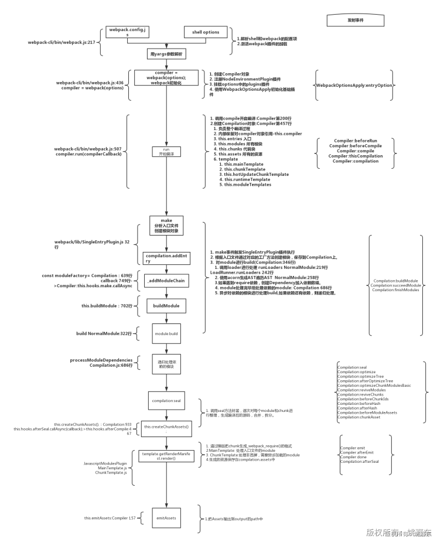

# 从 0 到 1 实现一款简易版 Webpack

https://juejin.cn/post/6844903966849892359

## 一、前言

这款简易版 webpack 主要实现的功能如下：

- 异步加载代码块
- 提取公共代码块（commons）/第三方库（vendors）
- loader 编译

## 二、Webpack 工作流程

Webpack 的运行流程是一个串行的过程，从启动到结束会依次执行以下流程：

- **初始化参数****：**从配置文件和 Shell 语句中读取与合并参数，得出最终的参数；
- **开始编译：**用上一步得到的参数初始化 Compiler 对象，加载所有配置的插件，执行对象的 run 方法开始执行编译； 
- **确定入口：**根据配置中的 entry 找出所有的入口文件；
- **编译模块：**从入口文件出发，调用所有配置的 Loader 对模块进行编译，再找出该模块依赖的模块，再递归本步骤直到所有入口依赖的文件都经过了本步骤的处理；
- **完成模块编译：**在经过使用 Loader 编译完所有模块后，得到了每个模块被编译后的最终内容以及它们之间的依赖关系；
- **输出资源：**根据入口和模块之间的依赖关系，组装成一个个包含多个模块的 Chunk，再把每个 Chunk 转换成一个单独的文件加入到输出列表，这步是可以修改输出内容的最后机会；
- **输出完成：**在确定好输出内容后，根据配置确定输出的路径和文件名，把文件内容写入到文件系统。
- 在以上过程中，Webpack 会在特定的时间点广播出特定的事件，插件在监听到感兴趣的事件后会执行特定的逻辑，并且插件可以调用 Webpack 提供的 API 改变 Webpack 的运行结果。




## 三、Webpack 之 Tapable

- Webpack 本质上是一种事件流的机制，它的工作流程就是将各个插件串联起来，而实现这一切的核心就是 Tapable ，Webpack 中最核心的负责编译的 Compiler 和负责创建 Bundle 的 Compilation 都是 Tapable 的实例
- Webpack 内部有各种各样的钩子，插件将自己的方法注册到对应的钩子上，这样 Webpack 编译的时候，会触发这些钩子，因此也就触发了插件的方法

### 1. Tapable 分类

- Tapable 提供了很多类型的 Hook，分为同步（Sync）和异步（Async）两大类(异步中又区分异步并行和异步串行)，而根据事件执行的终止条件的不同，又衍生出 Basic/Bail/Waterfall/Loop 类型


| 类型      | 如何辨别                          | 使用要点                                                     |
| --------- | --------------------------------- | ------------------------------------------------------------ |
| Basic     | hook 中不包含以下三个类型关键字的 | 不关心监听函数是否有返回值                                   |
| Bail      | hook 中包含 Bail                  | 保险式: 只要监听函数中有返回值(不为 undefined )，则跳过之后的监听函数 |
| Waterfall | hook 中包含 Waterfall             | 瀑布式: 上一步的返回值交给下一步使用                         |
| Loop      | hook 中包含 Loop                  | 循环类型: 如果该监听函数返回 true，则这个监听函数会反复执行，如果返回undefined 则退出循环 |

### 2. 所有 Hook 的注意事项

- 所有的 Hook 实例化时，都接收一个可选参数，参数是一个参数名的字符串数组
- 参数的名字可以任意填写，但是参数数组的长数必须要跟实际接受的参数个数一致
- 如果回调函数不接受参数，可以传入空数组
- 在实例化的时候传入的数组长度长度有用，值没有用途
- **每个 Hook 的实例就是一个类似于发布订阅的事件管理器，用 tap 注册事件，第一个参数可以任意填写，哪怕用中文写注释都可以，因为调用 call 时，不用传递事件名，会执行所有注册的事件**
- 执行 call 时，参数个数和实例化时的数组长度有关

## 四、Compiler 和 Compilation

- Compiler 和 Compilation 都继承自 Tapable，这样就可以订阅和发射事件。
- **Compiler：**Webpack 执行构建的时候，都会先读取 Webpack 配置文件实例化一个 Compiler 对象，然后调用它的 run 方法来开启一次完整的编译，Compiler 对象代表了完整的 Webpack 环境配置。这个对象在启动 Webpack 时被**一次性**建立，并配置好所有可操作的设置，包括 options，loader 和 plugin。当在 Webpack 环境中应用一个插件时，插件将收到此 Compiler 对象的引用。可以使用它来访问 Webpack 的主环境。
- **Compilation：**对象代表一次资源版本的构建。当运行 Webpack 开发环境中间件时，每当检测到一个文件变化，就会创建一个新的 Compilation ，从而生成一组新的编译资源。一个 Compilation 对象表现了当前的模块资源、编译生成资源、变化的文件、以及被跟踪依赖的状态信息。Compilation 对象也提供了很多关键时机的回调，以供插件做自定义处理时选择使用。

## 五、Webpack 源码阅读技巧

### 1. 找到关键文件

#### 1.1 bin/webpack.js

```
node_modules\webpack\bin\webpack.js
```

- 打开项目中的 packge.json 文件，找到 webpack，Ctrl + 鼠标点击 ==> 就可以快速找到 webpack 的位置

```
// 找到这里的代码
// webpack 有两种命令行工具: webpack-cli 和 webpack-command 
// 因为 webpack-cli 功能更强大，一般都是用 webpack-cli，所以会执行下面的语句
else if (installedClis.length === 1) {
    const path = require("path");
    const pkgPath = require.resolve(`${installedClis[0].package}/package.json`);
    const pkg = require(pkgPath);
    require(path.resolve(
        path.dirname(pkgPath),
        pkg.bin[installedClis[0].binName]
    ));
} 复制代码
```

#### 1.2 lib/webpack.js

```
node_modules\webpack\lib\webpack.js
```

- webpack 的入口文件，可以从这里开始阅读源码

#### 1.3 webpack\declarations

```
node_modules\webpack\declarations
```

- 这个目录下，放置了用 typescript 写的 webpack 配置项/插件的申明文件

#### 1.4 Compiler.js / Compilation.js

```
node_modules\webpack\lib
```

- 在 webpack 的 Compiler.js / Compilation.js 文件中输入以下代码：可以获取到 webpack 的所有钩子


### 2. debug 代码

#### 2.1 阅读思路

- 先折叠无关的分支的逻辑，只看主体流程代码
- 寻找关键路径，根据变量名和方法名猜测意图，然后通过阅读源码来验证想法
- **debugger 关键路径，理解整个执行过程**

#### 2.2 第一种调试方法

- 将上面在 bin/webpack.js 里找到的代码，复制到一个单独的文件 debugger.js

```
// debugger.js 和项目中的 packge.json 同级
// 右键运行 debugger.js ，相当于使用 npx webpack 运行 webpack
// npx webpack 其实就是用 node 执行 bin 下面的 cli.js 
// npx webpack = node ./node_modules/webpack-cli/bin/cli.js
// 找到 webpack-cli/bin/cli.js ，设置断点，就可以开始调试了（这是第一种方法）
const path = require("path");
const pkgPath = require.resolve(`webpack-cli/package.json`);
const pkg = require(pkgPath);
require(path.resolve(
        path.dirname(pkgPath),
        './bin/cli.js'
        //pkg.bin['webpack-cli']
));复制代码
```

#### 2.3 第二种调试方法

- 新建一个 cli.js 文件，在 webstorm 里面设置断点，然后右键运行 cli.js ，开始调试代码

```
let webpack = require("webpack");
let webpackOptions = require("./webpack.config");
const compiler = webpack(webpackOptions);

compiler.run((err, stat) => {
  console.log(err);
  console.log(stat)
});复制代码
```

## 六、Webpack 构建后的代码分析

### 1. webpack 4

#### 1.1 webpack.config.js

```
const path = require('path');
module.exports = {
    // 用开发模式打包代码 !!!!!!
    mode:'development',
    devtool:'none',
    entry:'./src/index.js',
    output:{
        path:path.resolve(__dirname,'dist'),
        filename:'bundle.js'
    },
};复制代码
```

#### 1.2 源码

```
// src/index.js
import {logMsg}  from './sync-module';
console.log(logMsg);
let button = document.createElement('button');
button.innerHTML = '请点我';
button.addEventListener('click',()=>{
    import(/*webpackChunkName: 'async-module'*/'./async-module.js').then(result=>{
        console.log(result.default);
    });
});
document.body.appendChild(button);


// src/async-module.js
module.exports = "我是异步模块";


// src/sync-module.js
export function logMsg() {
    console.log('我是同步模块');
}复制代码
```

#### 1.3 bundle.js

```
/*
  src/
  index.js
  sync-module.js
  async-module.js
*/
// webpack 打包后，会把引用模块的相对路径变成相对于 webpack.config.js 的相对路径
// 在 index.js 中 引入 "./sync-module.js"  => 最终会变成 "./src/sync-module.js"

// webpack 启动代码的自执行函数
(function(modules) { // webpackBootstrap

  // install a JSONP callback for chunk loading
  function webpackJsonpCallback(data) {
    // data => [
      // [chunkName],
      // { chunkID : chunk 内容}
    // ]
    var chunkIds = data[0];
    var moreModules = data[1];

    // add "moreModules" to the modules object,
    // then flag all "chunkIds" as loaded and fire callback
    var moduleId, chunkId, i = 0, resolves = [];
    for(;i < chunkIds.length; i++) {
      chunkId = chunkIds[i];
      if(Object.prototype.hasOwnProperty.call(installedChunks, chunkId) && installedChunks[chunkId]) {
        // installedChunks[chunkId] => [resolve, reject, Promise]
        // 将 resolve 存到 resolves 数组中，先不着急执行 resolve()
        resolves.push(installedChunks[chunkId][0]);
      }
      // 设置为 0 ，表示已经加载成功
      installedChunks[chunkId] = 0;
    }
    for(moduleId in moreModules) {
      if(Object.prototype.hasOwnProperty.call(moreModules, moduleId)) {
        // 异步 chunk 加载完成后，将异步 chunk 的代码合并到 modules 中
        // 这样之后加载该 chunk 时，可以直接从 modules 中获取到
        // key 是模块 ID ，value 是模块内容
        modules[moduleId] = moreModules[moduleId];
      }
    }
    if(parentJsonpFunction){
      parentJsonpFunction(data);
    }

    while(resolves.length) {
      // 执行 resolve
      resolves.shift()();
    }
  }


  // The module cache
  // 普通模块的缓存：只要加载初始化过一次的模块都放到这，之后再使用这个模块时
  // 直接从这里获取，不需要再初始化一遍
  var installedModules = {};


  // object to store loaded and loading chunks
  // ！！！！！！！！！！！！！！！！！！！！！！
  // 存储已加载的或者加载中的 chunk （这里的 chunk 包含： 入口 chunk 和异步加载的 chunk）
  // ！！！！！！！！！！！！！！！！！！！！！！
  // installedChunks 对象中，每个 key 对应的 value 值的意思
  // undefined = chunk not loaded, null = chunk preloaded/prefetched
  // undefined 表示 chunk 还未加载，null 表示 chunk 会预加载
  // Promise = chunk loading, 0 = chunk loaded
  // Promise 表示 chunk 正在加载中，0 表示 chunk 加载完成
  var installedChunks = {
    // 如果是单入口，key 的默认值是 main
    "main": 0
  };


  // script path function
  // 设置异步 chunk 的请求 url
  function jsonpScriptSrc(chunkId) {
    return __webpack_require__.p + "" + chunkId + ".bundle.js"
  }

  // The require function
  // webpack 自己实现的一个 require 方法，可以直接在浏览器中运行
  function __webpack_require__(moduleId) {

    // Check if module is in cache
    // 加载模块前，先从缓存列表中查找，是否已经加载过
    if(installedModules[moduleId]) {
      // 如果有，说明模块已经缓存过，直接返回该模块的导出对象 exports
      return installedModules[moduleId].exports;
    }
    // Create a new module (and put it into the cache)
    // 创建一个新的模块对象，并且放到缓存列表中
    var module = installedModules[moduleId] = {
      // 模块 ID
      i: moduleId,
      // 是否已经加载 loaded:false
      l: false,
      // 模块导出对象，默认是一个空对象
      exports: {}
    };

    // Execute the module function
    // 加载模块
    // modules 是自执行函数接收的参数——一个包含模块信息的对象
    // key 是模块路径， value 是一个函数，里面包含了模块的内容
    // {
    //  "./src/a.js":
    //  (function(module, __webpack_exports__, __webpack_require__) {
    //    模块内容：xxx
    //    模块内容：xxx
    //    模块内容：xxx
    //   },
    // }
    // 从 modules 对象中找到对应的 key，执行函数（value）并将内部的 this 指向上面新建 module 的 exports 对象
    // 目的是将函数内部的内容都放置到 module.exports 中
    modules[moduleId].call(module.exports, module, module.exports, __webpack_require__);

    // Flag the module as loaded
    // 设置为已加载
    module.l = true;

    // Return the exports of the module
    // 最终返回当前模块的内容
    return module.exports;
  }

  // This file contains only the entry chunk.
  // The chunk loading function for additional chunks
  // 加载异步 chunk
  __webpack_require__.e = function requireEnsure(chunkId) {
    var promises = [];

    // JSONP chunk loading for javascript
    // 用 jsonp 来请求加载异步 chunk
    var installedChunkData = installedChunks[chunkId];

    // 0 means "already installed".
    // 如果要加载的 chunk 没有初始化过
    if(installedChunkData !== 0) {

      // a Promise means "currently loading".
      // 排除了 0，缓存 chunk 列表里的值就剩下 undefined/null/Promise
      // 当模块正在加载中时
      if(installedChunkData) {
        promises.push(installedChunkData[2]);
      }
      // 当模块还未加载过
      else {
        // setup Promise in chunk cache
        var promise = new Promise(function(resolve, reject) {
          // 新建一个 promise 时，会立即执行它的函数体
          // 将当前 chunk 的状态设置为 Promise，表示正在加载中
          installedChunkData = installedChunks[chunkId] = [resolve, reject];
        });
        // 给当前的 installedChunkData 添加一个值
        // 然后将 installedChunkData 添加到 promises 数组中
        promises.push(installedChunkData[2] = promise);

        // start chunk loading
        // 用 jsonp 来请求加载异步 chunk
        var script = document.createElement('script');
        var onScriptComplete;

        script.charset = 'utf-8';
        script.timeout = 120;
        if (__webpack_require__.nc) {
          script.setAttribute("nonce", __webpack_require__.nc);
        }
        // 设置请求 url
        script.src = jsonpScriptSrc(chunkId);

        // create error before stack unwound to get useful stacktrace later
        var error = new Error();
        onScriptComplete = function (event) {
          // avoid mem leaks in IE.
          script.onerror = script.onload = null;
          clearTimeout(timeout);
          var chunk = installedChunks[chunkId];
          if(chunk !== 0) {
            if(chunk) {
              var errorType = event && (event.type === 'load' ? 'missing' : event.type);
              var realSrc = event && event.target && event.target.src;
              error.message = 'Loading chunk ' + chunkId + ' failed.\n(' + errorType + ': ' + realSrc + ')';
              error.name = 'ChunkLoadError';
              error.type = errorType;
              error.request = realSrc;
              chunk[1](error);
            }
            installedChunks[chunkId] = undefined;
          }
        };
        var timeout = setTimeout(function(){
          onScriptComplete({ type: 'timeout', target: script });
        }, 120000);
        script.onerror = script.onload = onScriptComplete;
        document.head.appendChild(script);
      }
    }
    // 执行完所有的 promise后再返回结果
    return Promise.all(promises);
  };

  // expose the modules object (__webpack_modules__)
  // 将模块列表放到 __webpack_require__ 的 m 属性上
  __webpack_require__.m = modules;

  // expose the module cache
  // 将缓存列表放到 __webpack_require__ 的 c 属性上
  __webpack_require__.c = installedModules;

  // define getter function for harmony exports
  // 在 exports 对象上定义 name 属性的 getter 方法
  __webpack_require__.d = function(exports, name, getter) {
    // 判断 exports 对象上是否有 name 属性
    if(!__webpack_require__.o(exports, name)) {
      // 在 exports 对象上添加 name 属性，可枚举为 true
      // get 的值为 getter,当访问该属性时，该方法会被执行
      Object.defineProperty(exports, name, { enumerable: true, get: getter });
    }
  };

  // define __esModule on exports
  // 在 exports 对象上定义一个 __esModule 属性，用来判断当前模块是否为 es6 模块
  __webpack_require__.r = function(exports) {
    // 如果当前浏览器支持 Symbol
    if(typeof Symbol !== 'undefined' && Symbol.toStringTag) {
      // 设置前
      // console.log(exports.toString());// [object Object]
      // 给 exports 对象类型设置为 Module
      Object.defineProperty(exports, Symbol.toStringTag, { value: 'Module' });
      // 设置后
      // console.log(exports.toString());// [object Module]
    }
    // 否则给 exports 对象添加一个表示 esm 的属性
    Object.defineProperty(exports, '__esModule', { value: true });
  };

  // create a fake namespace object  创建一个命名空间对象
  / 为什么要创建一个命名空间对象？
  // 因为 import('xxx.js') 加载的 js，可能是 esm ，也可能是 cjs
  // 所以需要兼容处理
  // mode & 1: value is a module id, require it 如果值是模块ID，加载它
  // mode & 2: merge all properties of value into the ns 把所有的属性合并到命名空间上 ns —— nameSpace
  // mode & 4: return value when already ns object  当已经是命名空间对象的话直接返回值
  // mode & 8|1: behave like require 就像 require 一样
  // mode 为什么要用二进制来判断?  高效。节约内存
  // linux 里面的权限判断也是用的二进制， 7 => 111 可读可写可执行
  __webpack_require__.t = function(value, mode) {
    // value 最开始是模块 ID
    // 直接加载模块
    if(mode & 1) value = __webpack_require__(value);
    // 不用加载模块，直接返回模块内容
    if(mode & 8) return value;
    // 如果 value 已经是一个对象并且 __esModule 属性为 true 的话就直接返回 value
    if((mode & 4) && typeof value === 'object' && value && value.__esModule) return value;
    // 否则就创建一个空对象,加载这个对象,
    var ns = Object.create(null);
    // 在对象上设置 __esModule 属性为true
    __webpack_require__.r(ns);
    // 给 ns 对象定义一个 default 属性
    Object.defineProperty(ns, 'default', { enumerable: true, value: value });
    // 如果 mode 为2，并且 value 不是字符串，把值的所有属性都定义到 ns 对象上
    if(mode & 2 && typeof value != 'string') for(var key in value) __webpack_require__.d(ns, key, function(key) { return value[key]; }.bind(null, key));
    return ns;//{__esModule:true,default:'模块内容'}
  };

  // getDefaultExport function for compatibility with non-harmony modules
  // 一个能获取模块内容的函数
  __webpack_require__.n = function(module) {
    // 如果是 __esModule,说明是 es6 模块，需要返回模块的 default 属性
    // 如果不是，说明是 cjs 模块，直接返回模块本身
    var getter = module && module.__esModule ?
      function getDefault() { return module['default']; } :
      function getModuleExports() { return module; };
    //给 getter 添加一个 a 的属性，就是 getter 方法本身
    __webpack_require__.d(getter, 'a', getter);
    return getter;
  };

  // Object.prototype.hasOwnProperty.call
  __webpack_require__.o = function(object, property) { return Object.prototype.hasOwnProperty.call(object, property); };

  // __webpack_public_path__
  // 公开访问路径
  __webpack_require__.p = "";

  // on error function for async loading
  // 加载异步 chunk 时的错误输出
  __webpack_require__.oe = function(err) { console.error(err); throw err; };


  // 第一次执行的时候，window["webpackJsonp"] 会是一个空数组
  // jsonpArray 和 window["webpackJsonp"] 共同指向同一块内存地址
  var jsonpArray = window["webpackJsonp"] = window["webpackJsonp"] || [];

  // 绑定 this，将老的数组的 push 方法始终指向 jsonpArray
  var oldJsonpFunction = jsonpArray.push.bind(jsonpArray);
  // 如果不绑定 this 的话，那么在 webpackJsonpCallback 中执行 parentJsonpFunction(data) 的时候
  // 就相当于执行了一个 “裸的”数组原生 的 push，data 不知道该添加给谁
  // var oldJsonpFunction = jsonpArray.push;

  //重写 jsonArray 的 push 方法，赋值为 webpackJsonpCallback
  jsonpArray.push = webpackJsonpCallback;
  jsonpArray = jsonpArray.slice();
  for(var i = 0; i < jsonpArray.length; i++) webpackJsonpCallback(jsonpArray[i]);
  // 为什么要保留老的数组的 push 方法？
  // 避免 "重复发请求" 加载 chunk ，如果已经加载好了的，就拿来直接用
  var parentJsonpFunction = oldJsonpFunction;

  // 总结：
  // 1、window["webpackJsonp"] 的 push 方法被重写，不再是数组原生的方法，而是用来执行 jsonp 回调函数的
  // 2、这时候如果想要给 window["webpackJsonp"] 这个数组添加数据时，就无法用 push 来添加了
  // 3、所以这里多定义一个 jsonpArray 数组，它和 window["webpackJsonp"] 共同指向同一块内存地址
  // 4、通过给 jsonpArray 添加（push）数据，那么相应的 window["webpackJsonp"] 就能获取到这些数据

  // Load entry module and return exports
  // 加载入口模块并且返回导出对象
  return __webpack_require__(__webpack_require__.s = "./src/index.js");
})
/************************************************************************/
/*
  src/
  index.js
  sync-module.js
  async-module.js
*/
// webpack 打包后，会把引用模块的相对路径变成相对于 webpack.config.js 的相对路径
// 在 index.js 中 引入 "./sync-module.js"  => 最终会变成 "./src/sync-module.js"

({
  // key 是模块 ID ，value 是模块内容
  "./src/index.js":
  /*!**********************!*\
    // 入口 chunk
      !*** ./src/index.js ***!
      \**********************/
  /*! no exports provided */
    (function(module, __webpack_exports__, __webpack_require__) {

      "use strict";
      __webpack_require__.r(__webpack_exports__);
      /* harmony import */ var _sync_module__WEBPACK_IMPORTED_MODULE_0__ = __webpack_require__(/*! ./sync-module */ "./src/sync-module.js");

      console.log(_sync_module__WEBPACK_IMPORTED_MODULE_0__["logMsg"]);

      let button = document.createElement('button');
      button.innerHTML = '请点我';
      button.addEventListener('click',()=>{
        __webpack_require__.e(/*! import() | async-module */ "async-module")
          .then(__webpack_require__.t.bind(null, /*! ./async-module.js */ "./src/async-module.js", 7))
          .then(result=>{// result = {__esModule:true,default:'模块内容'}
          console.log(result.default);
        });
      });
      document.body.appendChild(button);
    }),

  "./src/sync-module.js":
  /*!****************************!*\
      !*** ./src/sync-module.js ***!
       // 入口 chunk 依赖的同步模块
      \****************************/
  /*! exports provided: logMsg */
    (function(module, __webpack_exports__, __webpack_require__) {

      "use strict";
      __webpack_require__.r(__webpack_exports__);
      /* harmony export (binding) */ __webpack_require__.d(__webpack_exports__, "logMsg", function() { return logMsg; });

      function logMsg() {
        console.log('我是同步模块');
      }
    })
});复制代码
```

### 2. webpack 5

- 相比 webpack 4 ，代码稍微易读些

```
(function(modules) { // webpack 的启动代码自执行函数
  // The module cache 模块的缓存
  var installedModules = {};

  // The require function webpack自己实现了一个require方法
  function __webpack_require__(moduleId) {

    // Check if module is in cache 判断一下这个模块ID是否在缓存中
    if(installedModules[moduleId]) {
      return installedModules[moduleId].exports;//如果有，说明此模块加载过，直接返回导出对象exports
    }
    // Create a new module (and put it into the cache)
    // 创建一个新的模块对象并且把它放到缓存中
    var module = installedModules[moduleId] = {
      i: moduleId,// 模块ID
      l: false,//是否已经加载loaded false
      exports: {} //导出对象，默认是一个空对象
    };

    // Execute the module function 执行此模块对应的方法,目的是给module.exports赋值
    modules[moduleId].call(module.exports, module, module.exports, __webpack_require__);

    // Flag the module as loaded 把模块设置为已加载
    module.l = true;

    // Return the exports of the module 返回模块的导出对象
    return module.exports;
  }

  // the startup function
  function startup() {
    // Load entry module and return exports
    // 加载入口模块并且返回导出对象
    return __webpack_require__("./src/index.js");
  }

  // run startup 执行启动方法
  return startup();
})
({

 "./src/hello.js":
 (function(module) {
   module.exports = "hello";
 }),
 "./src/index.js":
 (function(__unusedmodule, __unusedexports, __webpack_require__) {
    let hello = __webpack_require__( "./src/hello.js");
    console.log(hello);
 })
});复制代码
```

## 七、抽象语法树（Abstract Syntax Tree）

### 1. AST 是什么

- JavaScript Parser 会把代码转化为一颗抽象语法树（AST），这颗树定义了代码的结构，通过操纵这颗树，我们可以精准的定位到声明语句、赋值语句、运算语句等等，实现对代码的分析、优化、变更等操作。


### 2. AST 用途

- 代码语法的检查、代码风格的检查、代码的格式化、代码的高亮、代码错误提示、代码自动补全等等

- 如 JSLint、JSHint 对代码错误或风格的检查，发现一些潜在的错误
- IDE 的错误提示、格式化、高亮、自动补全等等

- 代码混淆压缩

- UglifyJS2 等

- 优化变更代码，改变代码结构使达到想要的结构

- 代码打包工具 Webpack、Rollup 等等
- CommonJS、AMD、CMD、UMD 等代码规范之间的转化
- CoffeeScript、TypeScript、JSX 等转化为原生 Javascript

### 3. AST 执行流程

- **解析源代码**

- **词法解析(Lexical Analysis)****：**词法解析器(Tokenizer)在这个阶段将**代码字符串**转换为语法单元数组 —— **Tokens**(令牌)。例如 for (const item of items) {} 词法解析后的结果如下:


Javascript 代码中的语法单元主要包括以下这么几种

- 关键字：`const`、`let`、`var`等
- 标识符：可能是一个变量，也可能是 if、else 这些关键字，又或者是 true、false 这些常量
- 运算符
- 数字
- 空格
- 注释

- **语法解析(Syntactic Analysis)：**这个阶段语法解析器 (Parser) 会把 Tokens 转换为抽象语法树

- **深度优先遍历语法树，修改语法树**
- **将语法树转换回源代码**


### 4. JavaScript Parser

- JavaScript Parser，把 js 源码转化为抽象语法树的解析器。
- 浏览器会把 js 源码通过解析器转为抽象语法树，再进一步转化为字节码或直接生成机器码。
- 一般来说每个 js 引擎都会有自己的抽象语法树格式，Chrome 的 v8 引擎，firefox 的SpiderMonkey 引擎等等，MDN 提供了详细 SpiderMonkey AST format 的详细说明，算是业界的标准。

### 5. 项目中需要用到的工具

- [astexplorer](https://astexplorer.net/)
- [@babel/core](https://www.npmjs.com/package/@babel/core) 里面内置了 babylon/parser，也可以用它来转换 AST
- [@babel/parser](https://www.npmjs.com/package/@babel/parser) is a JavaScript parser used in Babel.
- [@babel/traverse](https://www.npmjs.com/package/@babel/traverse) maintains the overall tree state, and is responsible for replacing, removing, and adding nodes.
- [@babel/types ](https://www.npmjs.com/package/@babel/types)contains methods for building ASTs manually and for checking the types of AST nodes.
- [@babel/generator](https://www.npmjs.com/package/@babel/generator) Turns an AST into code.

### 6. AST 使用例子

#### 6.1 转换箭头函数

```
const babylon = require('@babel/parser');
// @babel/core 里面内置了 babylon/parser，也可以用它来转换 AST
const babel = require('@babel/core');
let types = require('@babel/types');
let generate = require('@babel/generator').default;
let traverse = require('@babel/traverse').default;

const originalSource = "const a = (a, b) => a + b;";

// 将 当前模块 的内容转换成 AST
const ast = babylon.parse(originalSource);
// @babel/core 里面内置了 babylon/parser，也可以用它来转换 AST
// const ast = babel.parse(originalSource);

// 遍历语法树，寻找要修改的目标节点
traverse(ast, {
    // 如果当前节点是一个 箭头函数 时
    ArrowFunctionExpression: (nodePath) => {
        let node = nodePath.node;
        let body = node.body;
        if(!types.isBlockStatement(node.body)){
            body = types.blockStatement([types.returnStatement(node.body)])
        }
        let newNode = types.functionExpression(null,node.params,body);
        nodePath.replaceWith(newNode);
    }
});

// 把转换后的抽象语法树重新生成代码
let {code} = generate(ast);
console.log('新的 code =>', code);复制代码
```

#### 6.2 转换 class

```
const babylon = require('@babel/parser');
let types = require('@babel/types');
let generate = require('@babel/generator').default;
let traverse = require('@babel/traverse').default;
const originalSource = `class Person{
    constructor(name){
        this.name = name;
    }
    getName(){
        return this.name
    }
}`;
// 将 当前模块 的内容转换成 AST
const ast = babylon.parse(originalSource);
// 遍历语法树，寻找要修改的目标节点
traverse(ast, {
    // 如果当前节点是一个 class 时
    ClassDeclaration: (nodePath) => {
        let node = nodePath.node;
        let bodys = node.body.body;
        let id = node.id;
        bodys = bodys.map(body => {
            if (body.kind === 'constructor') {
                return types.functionExpression(id, body.params, body.body)
            } else {
                let left = types.memberExpression(id, types.identifier('prototype'));
                left = types.memberExpression(left, body.key);
                let right = types.functionExpression(null, body.params, body.body);
                return types.assignmentExpression('=', left, right);
            }
        });
        nodePath.replaceWithMultiple(bodys);
    }
});
// 把转换后的抽象语法树重新生成代码
let {code} = generate(ast);
console.log('新的 code =>', code);复制代码
```

## 八、后语

- 本文涉及的一些知识点，讲的比较浅，有兴趣的可以自行查阅相关资料深入了解。
- 因为文章之前是在语雀上写的，所以一些图片的水印就变成了我的，如有冒犯请原谅，请告诉我原文地址，我在后面加上去，谢谢。

## 九、参考文章

[github.com/jamiebuilds…](https://github.com/jamiebuilds/babel-handbook/blob/master/translations/zh-Hans/plugin-handbook.md#toc-introduction)

[developer.mozilla.org/zh-CN/docs/…](https://developer.mozilla.org/zh-CN/docs/Mozilla/Projects/SpiderMonkey/Parser_API)

[juejin.im/post/684490…](https://juejin.im/post/6844903956905197576！！！！！！)

[github.com/webpack/tap…](https://github.com/webpack/tapable)

[www.jianshu.com/p/273e1c990…](https://www.jianshu.com/p/273e1c9904d2)

## 十、源码

[github.com/yjdjiayou/e…](https://github.com/yjdjiayou/easy-webpack-demo)