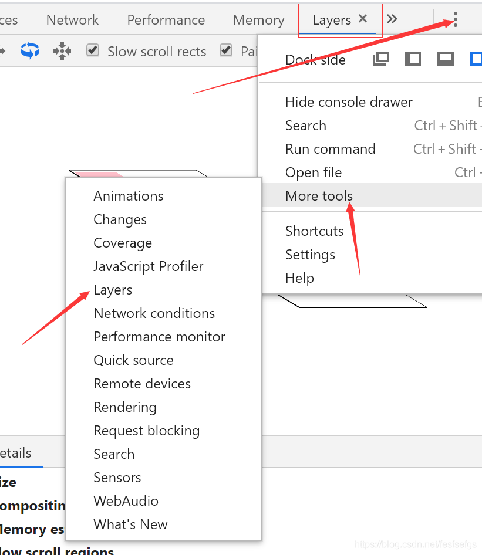
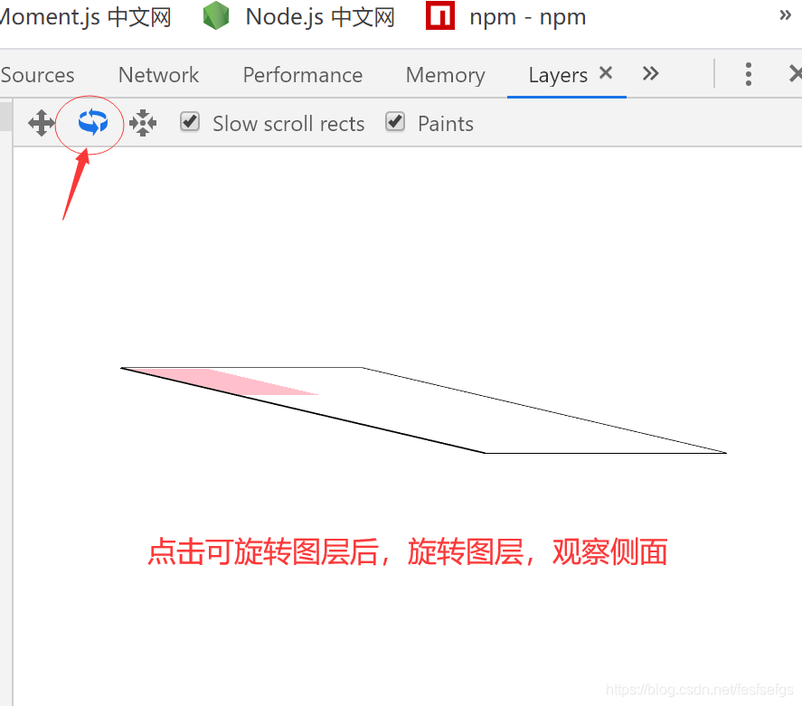
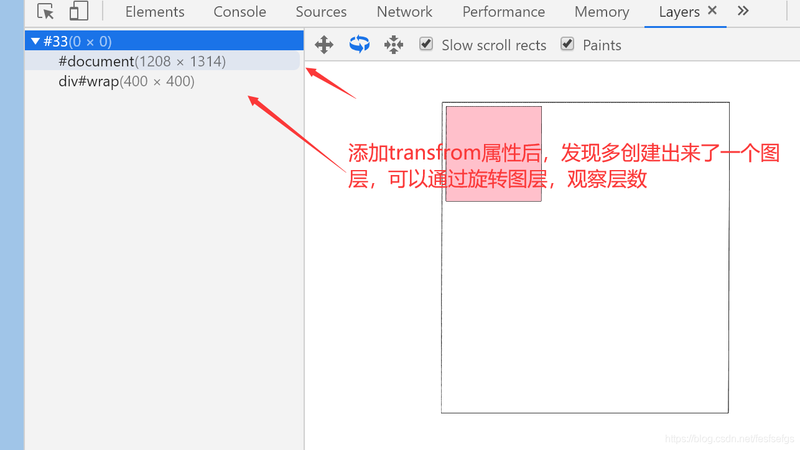
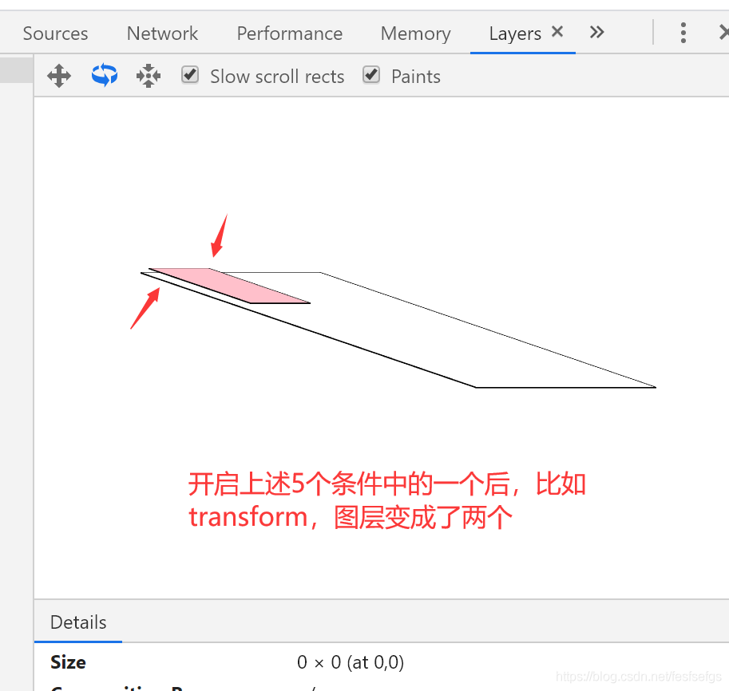
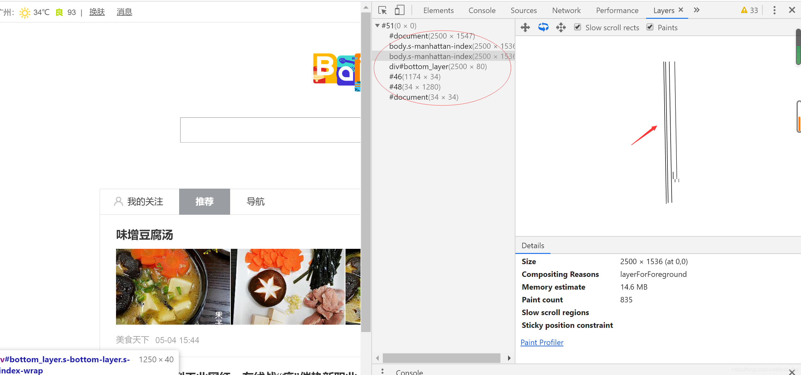

# 浅谈浏览器的图层与重绘重排（详细），以及如何用于性能优化


[codingWeb](https://blog.csdn.net/fesfsefgs) 2020-05-04 17:02:15  345  收藏 2

分类专栏： [浏览器](https://blog.csdn.net/fesfsefgs/category_9971469.html) [前端](https://blog.csdn.net/fesfsefgs/category_9331390.html) [性能优化](https://blog.csdn.net/fesfsefgs/category_9972707.html) 文章标签： [javascript](https://www.csdn.net/tags/OtDaQg2sNzExLWJsb2cO0O0O.html) [css](https://www.csdn.net/tags/MtTaEg0sMzgzMjItYmxvZwO0O0OO0O0O.html) [html](https://www.csdn.net/tags/MtTaEg0sMzA4NjQtYmxvZwO0O0OO0O0O.html) [html5](https://www.csdn.net/tags/OtDaMgzsMzI0LWJsb2cO0O0O.html) [css3](https://www.csdn.net/tags/MtTaEg0sMzgzMjEtYmxvZwO0O0OO0O0O.html)

版权

### css图层

 浏览器在渲染一个页面时，会将页面分为很多个图层，图层有大有小，每个图层上有一个或多个节点。
​ 在渲染DOM的时候，浏览器所做的工作实际上是：

```
     	1. 获取DOM后分割为多个图层
    	2. 对每个图层的节点计算样式结果		（Recalculate style--样式重计算）
    	3. 为每个节点生成图形和位置			（Layout--重排,回流）
    	4. 将每个节点绘制填充到图层位图中		（Paint--重绘）
    	5. 图层作为纹理上传至GPU
    	6. 组合多个图层到页面上生成最终屏幕图像	（Composite Layers--图层重组）
123456
```

### 图层创建的条件

 `大致来说`，Chrome浏览器满足以下任意情况就会创建图层：

```
  1. 拥有具有3D变换的CSS属性

  2. 使用加速视频解码的<video>节点

  3. <canvas>节点

  4. CSS3动画的节点

  5. 拥有CSS加速属性的元素(will-change)
123456789
```

**验证如下：**
1.`开启图层观察的工具`

2.`开启旋转，旋转图层，简单的观察下一个简单的图层`

3.`添加图层创建的条件。比如transform`

4.`旋转图层，仔细观察，发现有两层图层叠加在一起`

**代码如下：**

```html
<!DOCTYPE html>
<html>
	<head>
		<meta charset="UTF-8">
		<title></title>
		<style type="text/css">
			#wrap{
				width: 200px;
				height: 200px;
				background: pink;
				transform: translateZ(0);
			}
		</style>
	</head>
	<body>
		<div id="wrap"></div>
	</body>
</html>

12345678910111213141516171819
```

#### 附上百度搜索的图层截图：



### 重绘(Repaint)

 重绘是一个元素外观的改变所触发的浏览器行为，例如改变outline、背景色等属性。浏览器会根据元素的新属性重新绘制，
​ 使元素呈现新的外观。**重绘不会带来重新布局，所以并不一定伴随重排**。
​

**需要注意的是：** `重绘是以图层为单位`，**如果图层中某个元素需要重绘，那么整个图层都需要重绘。**

- 比如一个图层包含很多节点，其中有个gif图，gif图的每一帧，都会重绘整个图层的其他节点，然后生成最终的图层位图。
- 所以这需要通过特殊的方式来强制gif图属于自己一个图层（translateZ(0)或者translate3d(0,0,0)
- CSS3的动画也是一样 **（好在绝大部分情况浏览器自己会为CSS3动画的节点创建图层）**

### 重排(Reflow 回流)

 渲染对象在创建完成并添加到渲染树时，并不包含位置和大小信息。计算这些值的过程称为布局或重排
​

```
"重绘"不一定需要"重排"，比如改变某个网页元素的颜色，就只会触发"重绘"，不会触发"重排"，因为布局没有改变。
 但是，"重排"必然导致"重绘"，比如改变一个网页元素的位置，就会同时触发"重排"和"重绘"，因为布局改变了。
12
```

**总结:**`重绘不一定会导致重排，但重排一定会导致重绘`


## 那么问题来了，知道`图层，重绘，重排`有什么用呢？

有时候浏览器**为了提高重绘，重排的效率**，**浏览器会自动的为我们新开一个图层**来单独管理某个动画，或者某个比较耗费性能的操作，但**有时候又不会自动给我们开一个图层**，如果这时候，我们可以手动的给她添加`transform: translateZ(0);`这意味这给某个元素单独的开了一个图层，重绘重排的代价就小了，效率就会大大提高，`比如给git图单独开一个图层`


### 触发重绘的属性

`例如：`凡是对外观又影响的，，边框，颜色，阴影，等等。。

```javascript
   * color				* background			* outline-color
   * border-style		* background-image		* outline
   * border-radius	    * background-position	* outline-style
   * visibility			* background-repeat		* outline-width
   * text-decoration	* background-size		* box-shadow
12345
```

### 触发重排(回流)的属性

`例如：`改变宽高，定位，等等。。
​ 盒子模型相关属性会触发重布局 定位属性及浮动也会触发重布局： 改变节点内部文字结构也会触发重布局：

```javascript
  * width			* top				* text-align
  * height			* bottom			* overflow-y
  * padding			* left				* font-weight
  * margin			* right				* overflow
  * display			* position			* font-family                                             * border-width		* float				* line-height
  * border			* clear				* vertival-align
  * min-height		* white-space
1234567
```

### 常见的触发重排的操作

 Reflow 的成本比 Repaint 的成本高得多的多。DOM Tree 里的每个结点都会有 reflow 方法，
​ 一个结点的 reflow 很有可能导致子结点，甚至父点以及同级结点的 reflow。在一些高性能的电脑上也许还没什么，
​ 但是如果 reflow 发生在手机上，那么这个过程是非常痛苦和耗电的。
​

```
所以，下面这些动作有很大可能会是成本比较高的。
	当你增加、删除、修改 DOM 结点时，会导致 Reflow , Repaint。
	当你移动 DOM 的位置
	当你修改 CSS 样式的时候。
	当你 Resize 窗口的时候（移动端没有这个问题，因为移动端的缩放没有影响布局视口）
	当你修改网页的默认字体时。
	获取某些属性时(width,height...)
	注：display:none 会触发 reflow，而 visibility:hidden 只会触发 repaint，因为没有发生位置变化。
12345678
```

### 优化方案

 如果我们需要使得动画或其他节点渲染的性能提高，需要做的就是减少浏览器在运行时所需要做的工作（尽量减少1234步）

```
	    1. 计算需要被加载到节点上的样式结果（Recalculate style--样式重计算）
    	2. 为每个节点生成图形和位置（Layout--回流和重布局）
    	3. 将每个节点填充到图层中（Paint Setup和Paint--重绘）
    	4. 组合图层到页面上（Composite Layers--图层重组）
1234
```

#### 具体优化操作如下：

- 1.元素位置移动变换时`尽量使用CSS3的transform来代替对top left等的操作` 变换（transform）和透明度（opacity）的改变仅仅影响图层的组合
- 2.使用opacity来代替visibility
  (1).使用visibility不触发重排，但是依然重绘。
  (2).直接使用opacity即触发重绘，又触发重排（GPU底层设计如此！）。
  (3).opacity配合图层使用，即不触发重绘也不触发重排。
  原因： 透明度的改变时，GPU在绘画时只是简单的降低之前已经画好的纹理的alpha值来达到效果，并不需要整体的重绘。
  不过这个前提是这个被修改opacity本身必须是一个图层。
- 3.不要使用table布局 table-cell
- 4.`将多次改变样式属性的操作合并成一次操作` 不要一条一条地修改DOM的样式，预先定义好class，然后修改DOM的className
- 5.**将DOM离线(display:none)后再修改** 由于display属性为none的元素不在渲染树中，对隐藏的元素操作不会引发其他元素的重排。 `如果要对一个元素进行复杂的操作时，可以先隐藏它，操作完成后再显示。这样只在隐藏和显示时触发2次重排`。
- 6.`利用文档碎片(documentFragment)------vue使用了该种方式提升性能`。
- 7.不要把获取某些DOM节点的属性值放在一个循环里当成循环的变量 当你请求向浏览器请求一些 style信息的时候，就会让浏览器flush队列，比如：
  \1. offsetTop, offsetLeft, offsetWidth, offsetHeight
  \2. scrollTop/Left/Width/Height
  \3. clientTop/Left/Width/Height
  \4. width,height
  当你请求上面的一些属性的时候，浏览器为了给你最精确的值，需要刷新内部队列，
  因为队列中可能会有影响到这些值的操作。即使你获取元素的布局和样式信息跟最近发生或改变的布局信息无关，
  浏览器都会强行刷新渲染队列。
- 8.动画实现过程中，启用GPU硬件加速:transform: tranlateZ(0)，**开启一个图层**
- 9.**为动画元素新建图层,提高动画元素的z-index**