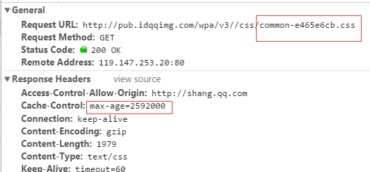
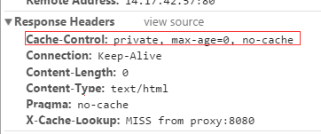
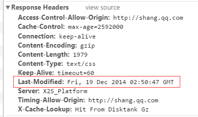
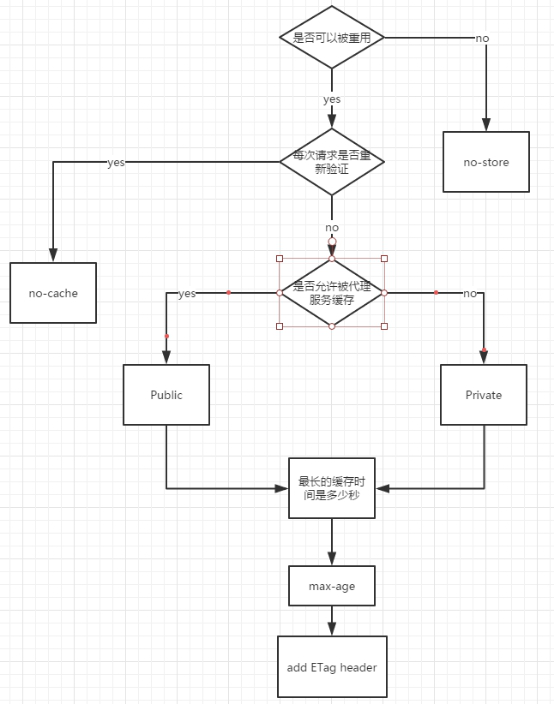

# [浏览器缓存](https://segmentfault.com/a/1190000008377508)

[**specialCoder**](https://segmentfault.com/u/learnme)发布于 2017-02-16


以前总是傻傻的分不清缓存和cookie，误认为cookie就是指浏览器缓存。还有 `cookie` `localStorage` `sessionStorage` 缓存 四者的关系也没有搞明白。经过一番折腾，终于从网上找到了一些关于缓存的知识。今天这篇文章就先介绍一下缓存吧。
注：以下内容整理自网络，另加笔者参考《http权威指南》整理得到。

在前端开发中，性能一直都是被大家所重视的一点，然而判断一个网站的性能最直观的就是看网页打开的速度。其中提高网页反应速度的一个方式就是使用缓存。一个优秀的缓存策略可以缩短网页请求资源的距离，减少延迟，并且由于缓存文件可以重复利用，还可以减少带宽，降低网络负荷。那么下面我们就来看看服务器端缓存的原理。

## 缓存分类

web缓存分为很多种，比如**数据库缓存、代理服务器缓存、还有我们熟悉的CDN缓存**，以及浏览器缓存。对于太多文字的阅读其实我是拒绝的，于是就画了个图来解释下。
浏览器通过代理服务器向源服务器发起请求的原理如下图


浏览器先向代理服务器发起Web请求，再将请求转发到源服务器。它属于共享缓存，所以很多地方都可以使用其缓存资源，因此对于节省流量有很大作用。

**浏览器缓存是将文件保存在客户端**，在同一个会话过程中会检查缓存的副本是否足够新，在后退网页时，访问过的资源可以从浏览器缓存中拿出使用。通过减少服务器处理请求的数量，用户将获得更快的体验
下面我就来着重讲下传说中的浏览器缓存。

## 浏览器缓存

**页面的缓存状态是由header决定的**。

### 缓存介绍

- 常见的 HTTP 缓存只能存储 GET 响应，对于其他类型的响应则无能为力。缓存的关键主要包括request method和目标URI（一般只有GET请求才会被缓存）。
- 浏览器在每次GET URL时都会先检查URL对应的缓存，除非你指定不使用缓存（强制刷新或者Disable Cache等）

### 强缓存

强缓存两个相关字段：`Expires` `Cache-Control`。
强缓存分为两种情况，一种是发送HTTP请求，一种不需要发送。
首先检查强缓存，这个阶段不需要发送HTTP请求。通过查找不同的字段来进行，不同的HTTP版本所以不同:
`HTTP1.0`版本，使用的是Expires，`HTTP1.1`使用的是Cache-Control

#### Cache-Control

Cache-Control包括：

- max-age
- s-maxage
- public
- private
- no-cache
- no-store
- must-revalidate

等等
**`max-age`（单位为s）指定设置缓存最大的有效时间，定义的是时间长短**。当浏览器向服务器发送请求后，在max-age这段时间里浏览器就不会再向服务器发送请求了。
我们来找个资源看下。比如shang.qq.com上的css资源，max-age=2592000，也就是说缓存有效期为2592000秒（也就是30天）。于是在30天内都会使用这个版本的资源，即使服务器上的资源发生了变化，浏览器也不会得到通知。max-age会覆盖掉Expires，后面会有讨论。



**`s-maxage`（单位为s）同max-age，只用于共享缓存（比如CDN缓存）。**
比如，当s-maxage=60时，在这60秒中，即使更新了CDN的内容，浏览器也不会进行请求。也就是说max-age用于普通缓存，而s-maxage用于代理缓存。如果存在s-maxage，则会覆盖掉max-age和Expires header。
**`public` 指定响应会被缓存，并且在多用户间共享**。也就是下图的意思。如果没有指定public还是private，则默认为public。


**`private` 响应只作为私有的缓存（见下图），不能在用户间共享**。如果要求HTTP认证，响应会自动设置为private。


**`no-cache` 指定不缓存响应，表明资源不进行缓存**。



但是设置了no-cache之后并不代表浏览器不缓存，而是在缓存前要向服务器确认资源是否被更改。因此有的时候只设置no-cache防止缓存还是不够保险，还可以加上private指令，将过期时间设为过去的时间。
**`no-store` 绝对禁止缓存**。一看就知道如果用了这个命令当然就是不会进行缓存啦～每次请求资源都要从服务器重新获取。
**`must-revalidate`指定如果页面是过期的，则去服务器进行获取**。这个指令并不常用，就不做过多的讨论了。

#### Expires

缓存过期时间，用来指定资源到期的时间，是服务器端的具体的时间点。也就是说，`Expires=max-age + 请求时间`。在上面我们提到过，cache-control的优先级更高。 Expires是Web服务器响应消息头字段，在响应http请求时告诉浏览器在过期时间前浏览器可以直接从浏览器缓存取数据，而无需再次请求。这个方式有一个问题：「服务器的时间和浏览器的时间可能并不一致」，所以HTTP1.1提出新的字段代替它。


### 协商缓存

强缓存失效后，浏览器在请求头中携带响应的缓存`Tag`来向服务器发送请求，服务器根据对应的tag，来决定是否使用缓存。
缓存分为两种，`Last-Modified` 和 `ETag`，两者各有优势。

#### Last-modified

服务器端文件的最后修改时间，需要和`cache-control`共同使用，是检查服务器端资源是否更新的一种方式。当浏览器再次进行请求时，会向服务器传送`If-Modified-Since`报头，询问`Last-Modified`时间点之后资源是否被修改过。如果没有修改，则返回码为304，使用缓存；如果修改过，则再次去服务器请求资源，返回码和首次请求相同为200，资源为服务器最新资源。
如下图，最后修改时间为2014年12月19日星期五2点50分47秒



#### ETag

根据实体内容生成一段hash字符串，标识资源的状态，由服务端产生。浏览器会将这串字符串传回服务器，验证资源是否已经修改，如果没有修改，过程如下：


使用`ETag`可以解决`Last-modified`存在的一些问题：

```
a、某些服务器不能精确得到资源的最后修改时间，这样就无法通过最后修改时间判断资源是否更新 
b、如果资源修改非常频繁，在秒以下的时间内进行修改，而Last-modified只能精确到秒 
c、一些资源的最后修改时间改变了，但是内容没改变，使用ETag就认为资源还是没有修改的。
```

## 使用缓存流程

还是用图说话，下面是我所总结的从浏览器请求到展示资源的过程：


**既生Last-Modified何生Etag？**
你可能会觉得使用Last-Modified已经足以让浏览器知道本地的缓存副本是否足够新，为什么还需要Etag（实体标识）呢？HTTP1.1中Etag的出现主要是为了解决几个Last-Modified比较难解决的问题：

1. Last-Modified标注的最后修改只能精确到秒级，如果某些文件在1秒钟以内，被修改多次的话，它将不能准确标注文件的修改时间
2. 如果某些文件会被定期生成，当有时内容并没有任何变化，但Last-Modified却改变了，导致文件没法使用缓存
3. 有可能存在服务器没有准确获取文件修改时间，或者与代理服务器时间不一致等情形

也就是说：

1. Last-Modified是**根据文件的修改时间**作唯一标示，并且修改时间只能精确到秒级（同1s修改多次，无法生成新的Last-Modified）。
2. Etag是**根据资源内容**在服务器端的唯一标识符，能够更加准确的控制缓存。

Last-Modified与ETag是可以一起使用的，服务器会优先验证ETag，一致的情况下，才会继续比对Last-Modified，最后才决定是否返回304。
**Etag/If-None-Match**
Etag/If-None-Match 配合`Cache-Control`使用。
Etag：web服务器响应请求时，告诉浏览器当前资源在服务器的唯一标识（生成规则由服务器觉得）。Apache中，ETag的值，默认是对文件的索引节（INode），大小（Size）和最后修改时间（MTime）进行Hash后得到的。
If-None-Match：当资源过期时（使用Cache-Control标识的max-age），发现资源具有Etage声明，则再次向web服务器请求时带上头：
`If-None-Match：Etag的值`
web服务器收到请求后发现有头If-None-Match则与被请求资源的相应校验串进行比对，决定返回200或304。

**Last-Modified/If-Modified-Since**
Last-Modified/If-Modified-Since要配合`Cache-Control`使用。
Last-Modified：标示这个响应资源的最后修改时间。web服务器在响应请求时，告诉浏览器资源的最后修改时间。
If-Modified-Since：当资源过期时（使用Cache-Control标识的max-age），发现资源具有Last-Modified声明，则再次向web服务器请求时带上头:
`If-Modified-Since:Last-Modified的值`
web服务器收到请求后发现有头If-Modified-Since则与被请求资源的最后修改时间进行比对。若最后修改时间较新，说明资源又被改动过，则响应整片资源内容（写在响应消息包体内），HTTP 200；若最后修改时间较旧，说明资源无新修改，则响应HTTP 304 (无需包体，节省浏览)，告知浏览器继续使用所保存的cache。

### cache-control指令使用

说了那么多cache-control的指令，那么如何选择使用哪些指令呢？



## LocalStorage和sessionStorage

除了开头提到的那么多缓存方式以外，还有一种我们都熟悉的缓存方式，`LocalStorage`和`sessionStorage`。
LocalStorage是一种本地存储的公共资源，域名下很多应用共享这份资源会有风险；LocalStorage是以页面域名划分的，如果有多个等价域名之间的LocalStorage不互通，则会造成缓存多份浪费。
LocalStorage在PC上的兼容性不太好，而且当网络速度快、协商缓存响应快时使用localStorage的速度比不上304。并且不能缓存css文件。而移动端由于网速慢，使用localStorage要快于304。
而相对LocalStorage来说，SessionStorage的数据只存储到特定的会话中，不属于持久化的存储，所以关闭浏览器会清除数据。和localstorage具有相同的方法。
在前端开发中缓存是必不可少的，那么使用怎样的缓存方式更高效、让我们项目的性能更优，还是需要我们仔细斟酌。

## 缓存的流程

### 缓存实现方式

**方式一：客户端指定**

1. request header 携带cache-control
2. 服务端接收到 header cache-control字段，并且使用该字段设置response 的 cache-control
3. 浏览器接收到response header,根据cache-control 设置缓存

**方法二：服务端指定**

1. 服务端接收到请求，设置response 的 cache-control并返回response
2. 浏览器接收到response header,根据cache-control 设置缓存

**其他情况**
浏览器可以根据用户操作直接跳过缓存，比如勾选了控制台的Disable cache

### 调试注意点

启用Web缓存之后，浏览器的缓存行为与用户的操作方式有关系，验证缓存特性开启的时候不要被假象蒙蔽。指定max-age为2周，此时使用Chrome访问应用的页面：

1. 在浏览器地址栏里输入URL，多次按回车，使用调试器可以观察到除了第一次访问页面，浏览器需要从Web服务器请求静态资源，一旦静态资源下载完毕，Chrome后续直接从本地缓存中加载资源，不再向Web服务器发起请求；
2. 按F5刷新页面或者右键菜单重新加载页面，浏览器向Web服务器发起加载静态资源的请求，Web服务器返回状态码304，表示资源未变化。