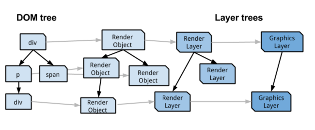
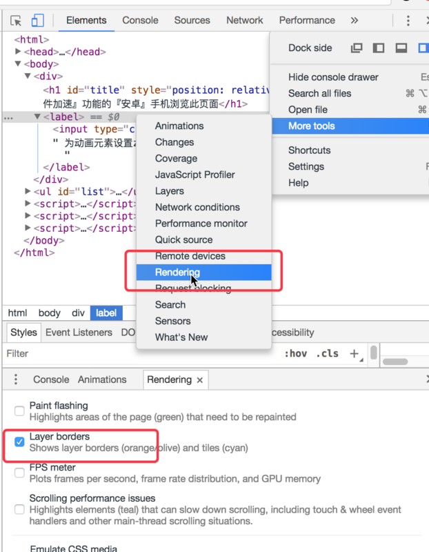
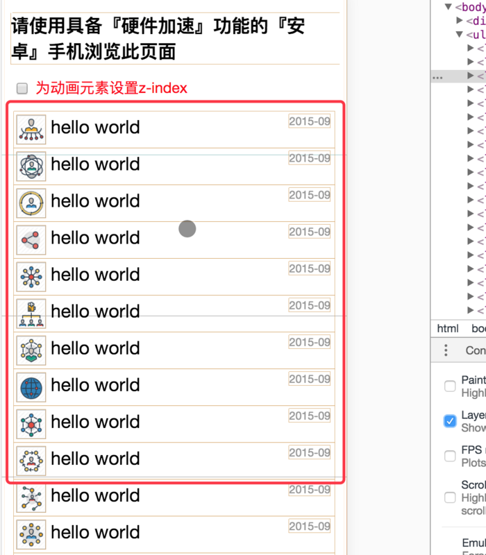

# [浏览器渲染流程&Composite（渲染层合并）简单总结](https://segmentfault.com/a/1190000014520786)

[**海丽安娜**](https://segmentfault.com/u/hailianna)发布于 2018-04-21

## 梳理浏览器渲染流程

首先简单了解一下浏览器请求、加载、渲染一个页面的大致过程：

> - DNS 查询
> - TCP 连接
> - HTTP 请求即响应
> - 服务器响应
> - 客户端渲染

这里主要将客户端渲染展开梳理一下，从浏览器器内核拿到内容（渲染线程接收请求，加载网页并渲染网页），渲染大概可以划分成以下几个步骤：

> - 解析html建立dom树
> - 解析css构建render树（将CSS代码解析成树形的数据结构，然后结合DOM合并成render树）
> - 布局render树（Layout/reflow），负责各元素尺寸、位置的计算
> - 绘制render树（paint），绘制页面像素信息
> - 浏览器会将各层的信息发送给GPU（GPU进程：最多一个，用于3D绘制等），GPU会将各层合成（composite），显示在屏幕上。

参考一张图（webkit渲染主要流程）：

这里先解释一下几个概念，方便大家理解：

　　DOM Tree：浏览器将HTML解析成树形的数据结构。

　　CSS Rule Tree：浏览器将CSS解析成树形的数据结构。

　　Render Tree: DOM和CSSOM合并后生成Render Tree。

　　layout: 有了Render Tree，浏览器已经能知道网页中有哪些节点、各个节点的CSS定义以及他们的从属关系，从而去计算出每个节点在屏幕中的位置。

　　painting: 按照算出来的规则，通过显卡，把内容画到屏幕上。

　　reflow（回流）：当浏览器发现某个部分发生了点变化影响了布局，需要倒回去重新渲染，内行称这个回退的过程叫 reflow。reflow 会从 <html> 这个 root frame 开始递归往下，依次计算所有的结点几何尺寸和位置。reflow 几乎是无法避免的。现在界面上流行的一些效果，比如树状目录的折叠、展开（实质上是元素的显 示与隐藏）等，都将引起浏览器的 reflow。鼠标滑过、点击……只要这些行为引起了页面上某些元素的占位面积、定位方式、边距等属性的变化，都会引起它内部、周围甚至整个页面的重新渲 染。通常我们都无法预估浏览器到底会 reflow 哪一部分的代码，它们都彼此相互影响着。

　　repaint（重绘）：改变某个元素的背景色、文字颜色、边框颜色等等不影响它周围或内部布局的属性时，屏幕的一部分要重画，但是元素的几何尺寸没有变。

注意：

1. display:none 的节点不会被加入Render Tree，而visibility: hidden
   则会，所以，如果某个节点最开始是不显示的，设为display:none是更优的。
2. display:none 会触发 reflow，而 visibility:hidden 只会触发 repaint，因为没有发现位置变化。
3. 有些情况下，比如修改了元素的样式，浏览器并不会立刻reflow 或 repaint 一次，而是会把这样的操作积攒一批，然后做一次reflow，这又叫异步 reflow 或增量异步 reflow。但是在有些情况下，比如resize窗口，改变了页面默认的字体等。对于这些操作，浏览器会马上进行 reflow。

再参考一张图理解一下：

细致分离两个环节，其他环节参考上述概念注解：

`JavaScript`：JavaScript实现动画效果，DOM元素操作等。
`Composite（渲染层合并）`：对页面中 DOM 元素的绘制是在多个层上进行的。在每个层上完成绘制过程之后，浏览器会将所有层按照合理的顺序合并成一个图层，然后显示在屏幕上。对于有位置重叠的元素的页面，这个过程尤其重要，因为一旦图层的合并顺序出错，将会导致元素显示异常。

在实际场景下，大致会出现三种常见的渲染流程（Layout和Paint步骤是可避免的，可参考上一张图的注意部分理解）：

------

## Composite

#### 了解层

> **注意：首先说明，这里讨论的是 WebKit，描述的是 Chrome 的实现细节，而并非是 web 平台的功能，因此这里介绍的内容不一定适用于其他浏览器。**
>
> - Chrome 拥有两套不同的渲染路径(rendering path)：硬件加速路径和旧软件路径(older software path)
> - Chrome 中有不同类型的层： RenderLayer(负责 DOM 子树)和GraphicsLayer(负责 RenderLayer的子树)，只有 GraphicsLayer 是作为纹理(texture)上传给GPU的。
> - 什么是纹理？可以把它想象成一个从主存储器(例如 RAM)移动到图像存储器(例如 GPU 中的 VRAM)的位图图像(bitmapimage)
> - Chrome 使用纹理来从 GPU上获得大块的页面内容。通过将纹理应用到一个非常简单的矩形网格就能很容易匹配不同的位置(position)和变形(transformation)。这也就是3DCSS 的工作原理，它对于快速滚动也十分有效。

整个图：

在 Chrome 中其实有几种不同的层类型：

- RenderLayers 渲染层，这是负责对应 DOM 子树
- GraphicsLayers 图形层，这是负责对应 RenderLayers子树。

在浏览器渲染流程中提到了composite概念，在 DOM 树中每个节点都会对应一个 LayoutObject，当他们的 LayoutObject 处于相同的坐标空间时，就会形成一个 RenderLayers ，也就是渲染层。RenderLayers 来保证页面元素以正确的顺序合成，这时候就会出现层合成（composite），从而正确处理透明元素和重叠元素的显示。

某些特殊的渲染层会被认为是合成层（Compositing Layers），合成层拥有单独的 GraphicsLayer，而其他不是合成层的渲染层，则和其第一个拥有 GraphicsLayer 父层公用一个。

而每个GraphicsLayer（合成层单独拥有的图层） 都有一个 GraphicsContext，GraphicsContext 会负责输出该层的位图，位图是存储在共享内存中，作为纹理上传到 GPU 中，最后由 GPU 将多个位图进行合成，然后显示到屏幕上。

## 如何变成合成层

> #### 合成层创建标准
>
> 什么情况下能使元素获得自己的层？虽然 Chrome的启发式方法(heuristic)随着时间在不断发展进步，但是从目前来说，满足以下任意情况便会创建层：
>
> - 3D 或透视变换(perspective transform) CSS 属性
> - 使用加速视频解码的 <video> 元素 拥有 3D
> - (WebGL) 上下文或加速的 2D 上下文的 <canvas> 元素
> - 混合插件(如 Flash)
> - 对自己的 opacity 做 CSS动画或使用一个动画变换的元素
> - 拥有加速 CSS 过滤器的元素
> - 元素有一个包含复合层的后代节点(换句话说，就是一个元素拥有一个子元素，该子元素在自己的层里)
> - 元素有一个z-index较低且包含一个复合层的兄弟元素(换句话说就是该元素在复合层上面渲染)

## 合成层的优点

[淘宝的栗子](http://taobaofed.org/blog/2016/04/25/performance-composite/)举的很详细，值得一看，里面提到了一旦renderLayer提升为了合成层就会有自己的绘图上下文，并且会开启硬件加速，有利于性能提升,里面列举了一些特点

- 合成层的位图，会交由 GPU 合成，比 CPU 处理要快
- 当需要 repaint 时，只需要 repaint 本身，不会影响到其他的层
- 对于 transform 和 opacity 效果，不会触发 layout 和 paint

**注意：**

1. 提升到合成层后合成层的位图会交GPU处理，但请注意，仅仅只是合成的处理（把绘图上下文的位图输出进行组合）需要用到GPU，生成合成层的位图处理（绘图上下文的工作）是需要CPU。
2. 当需要repaint的时候可以只repaint本身，不影响其他层，但是paint之前还有style， layout,那就意味着即使合成层只是repaint了自己，但style和layout本身就很占用时间。
3. 仅仅是transform和opacity不会引发layout 和paint，那么其他的属性不确定。

总结合成层的优势：一般一个元素开启硬件加速后会变成合成层，可以独立于普通文档流中，改动后可以避免整个页面重绘，提升性能。

**性能优化点：**

1. 提升动画效果的元素 合成层的好处是不会影响到其他元素的绘制，因此，为了减少动画元素对其他元素的影响，从而减少paint，我们需要把动画效果中的元素提升为合成层。 `提升合成层的最好方式是使用 CSS 的 will-change属性。从上一节合成层产生原因中，可以知道 will-change 设置为opacity、transform、top、left、bottom、right 可以将元素提升为合成层。`
2. 使用 transform 或者 opacity 来实现动画效果, 这样只需要做合成层的合并就好了。
3. 减少绘制区域 对于不需要重新绘制的区域应尽量避免绘制，以减少绘制区域，比如一个 fix 在页面顶部的固定不变的导航header，在页面内容某个区域 repaint 时，整个屏幕包括 fix 的 header 也会被重绘。`而对于固定不变的区域，我们期望其并不会被重绘，因此可以通过之前的方法，将其提升为独立的合成层。减少绘制区域，需要仔细分析页面，区分绘制区域，减少重绘区域甚至避免重绘。`

## 利用合成层可能踩到的坑

1. 合成层占用内存的问题
2. 层爆炸，由于某些原因可能导致产生大量不在预期内的合成层，虽然有浏览器的层压缩机制，但是也有很多无法进行压缩的情况，这就可能出现层爆炸的现象（简单理解就是，很多不需要提升为合成层的元素因为某些不当操作成为了合成层）。解决层爆炸的问题，最佳方案是打破 overlap 的条件，也就是说让其他元素不要和合成层元素重叠。简单直接的方式：`使用3D硬件加速提升动画性能时，最好给元素增加一个z-index属性，人为干扰合成的排序，可以有效减少chrome创建不必要的合成层，提升渲染性能，移动端优化效果尤为明显。` 在这篇[文章](http://div.io/topic/1348)中的[demo](http://fouber.github.io/test/layer/)可以看出其中厉害。

用chremo打开demo页面后，开启浏览器的开发者模式，再按照**如图操作**打开查看工具：

开启 Rendering 的Layer borders后 观察点击`为动画元素设置z-index复选框`的页面提示变化：

上图中可以明显看出：页面中设置了一个h1标题，应用了translate3d动画，使得它被放到composited layer中渲染，然后在这个元素后面创建了2000个list。在不为h1元素设置z-index的情况下，使得本不需要提升到合成层的ul元素下的每个li元素都提升为一个单独合成层（每个li元素的黄色提示边框），最终会导致GPU资源过度消耗页面滑动时很卡，尤其在移动端（安卓）上更加明显。

如上图操作选中`为动画元素设置z-index`，可以看出ul下的每个li都回归到普通渲染层，不再是合成层也就不会消耗GPU资源去渲染，从而达到了优化页面性能优化的目的。

大家可以用支持『硬件加速』的『安卓』手机浏览器测试上述页面，给动画元素加z-index前后的性能差距非常明显。

## 最后

在实际的前端开发中尤其是移动端开发，很多小伙伴都很喜欢使用类似 translateZ(0)等属性来进行所谓的硬件加速，以提升性能，达到优化页面动态效果的目的，但还是要注意凡事过犹不及，应用硬件加速的同时也要注意到千万别踩坑。
关于合成层的更细致具体的讲解，可以仔细学习下下面的参考文章（尤其是前三篇哦）。
最后祝愿热爱技术的你我始终坚持在探索技术的路上奋力前行！

**参考文章：**
[无线性能优化：Composite](http://taobaofed.org/blog/2016/04/25/performance-composite/)
[DOM to Screen](https://www.html5rocks.com/zh/tutorials/speed/layers/)
[CSS GPU Animation: Doing It Right](https://www.smashingmagazine.com/2016/12/gpu-animation-doing-it-right/)
[web优化之composite](https://github.com/hello2dj/blog/blob/master/web优化之composite.md)
[详谈层合成（composite）](https://juejin.im/entry/59dc9aedf265da43200232f9)
[CSS3硬件加速也有坑](http://div.io/topic/1348)