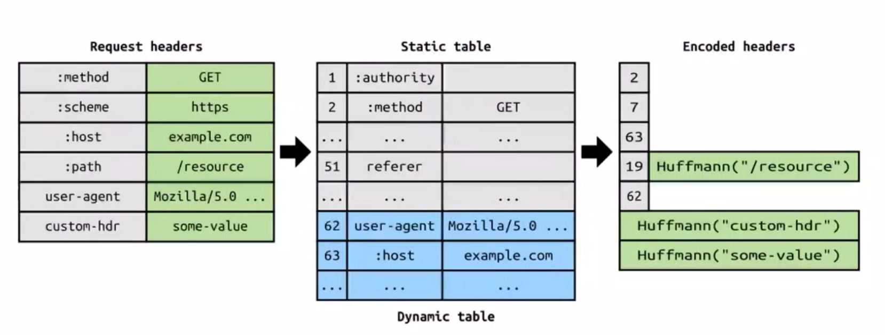

http2在http1.1基础上增加了一层，在http与TLS之间加了一层，用于将请求报文转换成一个个二进制帧。

Http2优先级设置，树形结构保存依赖关系，优先传输父节点，然后传输子节点，兄弟节点根据权重比例传输帧(http2将数据包变成了一个个帧)，例如A与B权重分别为12与4，因此在发送数据帧时，发送4个帧有3个为A的，1个为B的。

请求头压缩，压缩算法读作`H pack`

> 客户端与服务端都会保存一份静态表和动态表，用来进行请求头压缩。
>
> Encoded headers表示将http1.1生成的请求头按照表进行压缩，如果在表中出现过，则使用表的索引号表示，这样使用一个编号代表一长串字符，实现了请求头的压缩。 

服务器推送，http基于应答模式，一个请求对应一个响应，换句话说我要什么你给什么，别自作主张的再额外给我其他东西，例如请求html页面时，页面依赖的css、js、img等下次我发请求时再根据请求内容给我相应的数据。

http2中，服务器可以给浏览器推送一些数据，必须在发送请求了，例如还是请求html页面，页面依赖的css、js、img图片，服务器不用等你发送请求了，直接发送给你。

http2+tcp的队头阻塞问题

> 由于tcp是串行发送，前面的包没有接收到时，接收方会通过滑动窗口限制，直到丢失的包接收了再进行后面的传输。虽然http2可以实现多个请求直接交给tcp，但是由于tcp需要保证数据传输不会丢失，造成了队头阻塞问题。
>
> QUIC连接：说白了就是http2+UDP，各个请求直接不回再相互影响了，即前一个请求数据包接收出现问题，不会影响后一个请求的数据包的接收和发送给应用层。

http2 握手延迟

> QUIC实现0RTT。
>
> RTT：消息在网络中传输时一来一回所用时间。

Http3

QUIC层实现TCP传输的可靠性。

为何不开发一个新的传输层协议而是在UDP基础上再加一层实现，原因很简单传输层协议都是绑定在计算机操作系统的，如果要推行新的传输层协议，必须更新所有操作系统，实现起来非常不方便，并且IEIF组织标准化的TCP协议中的一些新特性，还有需要系统不支持，换句话说已经存在的传输层协议的一些新特性支持的都那么差，在创建一个新协议就是吃力不讨好。

http3连接迁移特点，换句话说切换网络时，从4G切换到wifi，或者从一个wifi切换到另一个wifi。 

http3的操作系统负载问题

> 由于底层使用UDP，现实中大部分情况都是使用TCP，因此操作系统对TCP进行了许多的优化，但是UDP没有，QUIC协议还是比较新的东西，需要进行长时间的优化。

