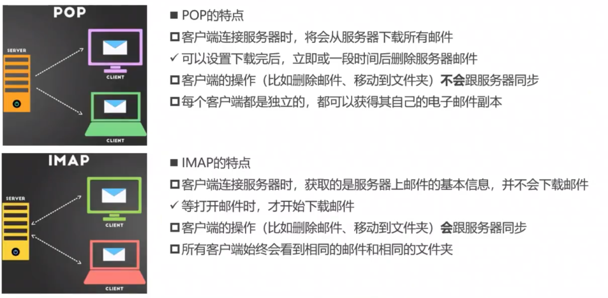

> websocket在使用是需要首先建立连接。

> http与websoket比较：
>
> 1. http与websoket都是应用层协议。
> 2. http在发送数据时不需要首先在应用层建立连接，连接由TCP维护；websoket发送数据时需要先建立应用层连接，也就是说使用websoket后客户端与服务器维护着两个连接，tcp连接和websoket自己建立的连接。
> 3. http是基于`请求-应答模式`，也就是说服务器不能主动给客户端发送数据，服务器只能响应。websoket可以实现双向数据发送，客户端可以给服务器发送数据，服务器也可以给客户端发送数据。
> 4. http每次发送一个请求时都需要创建一个新的http请求报文，在抓包时发了几次请求就会获得几次包；websocket建立连接后，传输数据时可以查看抓包工具只有一个包。

> sec-websocket-key与sec-websocket-accept为了确认客户端认真的，防止用户瞎传，有些用户可能只是添加上upgrade和connection字段，如果服务器直接给升级成websocket，那么之后服务器将客户端发送的所有请求都当成websocket请求处理，但是实际时用户瞎写的，添加上sec-websocket-key字段，表示客户端是认真的，将通信协议升级成websocket。
>
> 客户端在接收到sec-websocket-accept值后，按照上面的步骤生成一个base64编码，看看是否一致，如果一致表示服务器同意升级。
>
> 服务器响应码为101，这个状态码就是websoket连接。

> 可以看到上图使用websocket发送了多条数据，但是网络工具中只显示了一条连接。

## webservice

> 上面url地址记录着一些开放的API接口

> webservice是一个开放标准，如果一个服务器想要给其他第三方提供服务器，例如新浪微博开放自己的接口，那么开发者可以自己编写一个基于这些接口开发自己的微博客户端，去访问服务器。说白了就是一个买数据的公司为了给让其他人使用这些数据提供的一个标准。想要使用我服务器中的数据就需要按照SOAP协议规定的格式与我通信，说白了就是http+XML。
>
> 这种方式已经淘汰了，现在已经被普通的web API替代了，就是HTTP+JSON。
>
> WSDL信息：可以理解为接口文档，记录着服务器提供哪些接口，这些接口如何使用(参数和返回值)

## Restfull

> Restfull：它是一套Web API设计风格，并不是什么技术，就像我们的代码风格。
>
> 1. path中不能出现动词，path中的每个单词代表着一个资源，动作使用请求方式实现，例如:
>    1. 想要获取所有用户`get /users`
>    2. 想要获取某个用户`get /users/id值`
>    3. 想要获取某个用户的某b编号的车 `get /users/10001/cars/888`
> 2. 不同的版本API在path中体现，例如`ss.com/v1/users`和`ss.com/v2/users`
> 3. 使用json格式数据传输数据
> 4. 充分利用状态码，有很多项目状态码只使用用来指定连接是否有问题，不指定业务逻辑错误，在数据中单独有一个status指出请求的业务是否出现错误，举个例子，登录时如果输入密码错误，服务器响应报文中状态码200，数据status=-1，表示连接成功(服务器给你响应了，连接没问题)，status=-1表示由于密码输入错误，因此登录失败。`restfull`风格就是失败就是失败，直接返回4xx。

> FTP协议，需要建立两个连接，一个用来传输控制信息，控制ftp服务器做一些信息，一个传输文件信息

FTP主动模式

> firewall：防火墙

被动模式

## 邮件协议

