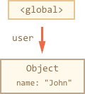
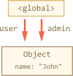
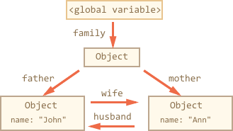
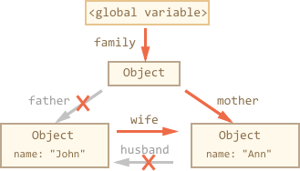
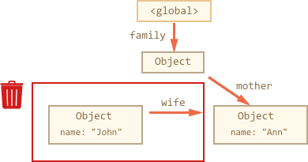
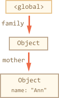
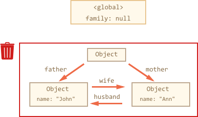
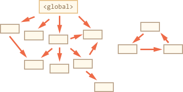
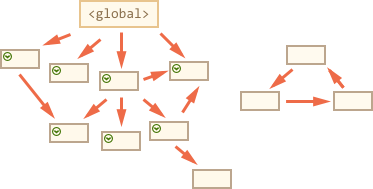
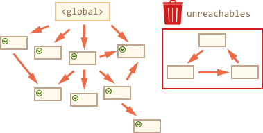

# [前端面试：谈谈 JS 垃圾回收机制](https://segmentfault.com/a/1190000018605776)


[**个人专栏 ES6 深入浅出已上线，深入ES6 ，通过案例学习掌握 ES6 中新特性一些使用技巧及原理，持续更新中，←点击可订阅。**](https://blog.csdn.net/qq449245884/category_9606068.html)

> 点赞再看，养成习惯
>
> **本文 `GitHub` [https://github.com/qq44924588...](https://github.com/qq449245884/xiaozhi) 上已经收录，更多往期高赞文章的分类，也整理了很多我的文档，和教程资料。欢迎Star和完善，大家面试可以参照考点复习，希望我们一起有点东西。**

------

**为了保证的可读性，本文采用意译而非直译。**

最近看到一些面试的回顾，不少有被面试官问到谈谈JS 垃圾回收机制，说实话，面试官会问这个问题，说明他最近看到一些关于 JS 垃圾回收机制的相关的文章，为了 B 格，就会顺带的问问。

**想阅读更多优质文章请[猛戳GitHub博客](https://github.com/qq449245884/xiaozhi),一年百来篇优质文章等着你！**

最近看到一篇讲 JS 垃圾回收的国外文章，觉得讲得明白，所以就翻译过来了，希望对你们有所帮助。

## 垃圾回收

JavaScript 中的内存管理是自动执行的，而且是不可见的。我们创建基本类型、对象、函数……所有这些都需要内存。

当不再需要某样东西时会发生什么? JavaScript 引擎是如何发现并清理它?

## 可达性

JavaScript 中内存管理的主要概念是可达性。

简单地说，“可达性” 值就是那些以某种方式可访问或可用的值，它们被保证存储在内存中。

**1. 有一组基本的固有可达值，由于显而易见的原因无法删除。例如:**

- 本地函数的局部变量和参数
- 当前嵌套调用链上的其他函数的变量和参数
- 全局变量
- 还有一些其他的，内部的

**这些值称为根。**

**2. 如果引用或引用链可以从根访问任何其他值，则认为该值是可访问的。**

例如，如果局部变量中有对象，并且该对象具有引用另一个对象的属性，则该对象被视为**可达性**， 它引用的那些也是可以访问的，详细的例子如下。

JavaScript 引擎中有一个后台进程称为[垃圾回收器](https://en.wikipedia.org/wiki/Garbage_collection_(computer_science))，它监视所有对象，并删除那些不可访问的对象。

## 一个简单的例子

下面是最简单的例子:

```
// user 具有对象的引用
let user = {
  name: "John"
};
```



这里箭头表示一个对象引用。全局变量`“user”`引用对象 `{name:“John”}` (为了简洁起见，我们将其命名为**John**)。John 的 `“name”` 属性存储一个基本类型，因此它被绘制在对象中。

如果 `user` 的值被覆盖，则引用丢失:

```
user = null;
```


现在 **John** 变成不可达的状态，没有办法访问它，没有对它的引用。垃圾回收器将丢弃 **John** 数据并释放内存。

## 两个引用

现在让我们假设我们将引用从 `user` 复制到 `admin`:

```
// user具有对象的引用
let user = {
  name: "John"
};

let admin = user;
```



现在如果我们做同样的事情:

```
user = null;
```

该对象仍然可以通过 `admin` 全局变量访问，所以它在内存中。如果我们也覆盖`admin`，那么它可以被释放。

## 相互关联的对象

现在来看一个更复杂的例子， family 对象：

```
function marry (man, woman) {
  woman.husban = man;
  man.wife = woman;

  return {
    father: man,
    mother: woman
  }
}

let family = marry({
  name: "John"
}, {
  name: "Ann"
})
```

函数 `marry` 通过给两个对象彼此提供引用来“联姻”它们，并返回一个包含两个对象的新对象。

产生的内存结构:



到目前为止，所有对象都是可访问的。

现在让我们删除两个引用:

```
delete family.father;
delete family.mother.husband;
```



仅仅删除这两个引用中的一个是不够的，因为所有对象仍然是可访问的。

但是如果我们把这两个都删除，那么我们可以看到 **John** 不再有传入的引用:



输出引用无关紧要。只有传入的对象才能使对象可访问，因此，**John** 现在是不可访问的，并将从内存中删除所有不可访问的数据。

垃圾回收之后：



## 无法访问的数据块

有可能整个相互连接的对象变得不可访问并从内存中删除。

源对象与上面的相同。然后:

```
family = null;
```

内存中的图片变成:



这个例子说明了可达性的概念是多么重要。

很明显，John和Ann仍然链接在一起，都有传入的引用。但这还不够。

“family”对象已经从根上断开了链接，不再有对它的引用，因此下面的整个块变得不可到达，并将被删除。

## 内部算法

基本的垃圾回收算法称为**“标记-清除”**，定期执行以下“垃圾回收”步骤:

- 垃圾回收器获取根并**“标记”**(记住)它们。
- 然后它访问并“标记”所有来自它们的引用。
- 然后它访问标记的对象并标记它们的引用。所有被访问的对象都被记住，以便以后不再访问同一个对象两次。
- 以此类推，直到有未访问的引用(可以从根访问)为止。
- 除标记的对象外，所有对象都被删除。

例如，对象结构如下:



我们可以清楚地看到右边有一个“不可到达的块”。现在让我们看看**“标记并清除”**垃圾回收器如何处理它。

**第一步标记根**


**然后标记他们的引用**



以及子孙代的引用:


现在进程中不能访问的对象被认为是不可访问的，将被删除:



这就是垃圾收集的工作原理。JavaScript引擎应用了许多优化，使其运行得更快，并且不影响执行。

一些优化:

- **分代回收**——对象分为两组:“新对象”和“旧对象”。许多对象出现，完成它们的工作并迅速结 ，它们很快就会被清理干净。那些活得足够久的对象，会变“老”，并且很少接受检查。
- **增量回收**——如果有很多对象，并且我们试图一次遍历并标记整个对象集，那么可能会花费一些时间，并在执行中会有一定的延迟。因此，引擎试图将垃圾回收分解为多个部分。然后，各个部分分别执行。这需要额外的标记来跟踪变化，这样有很多微小的延迟，而不是很大的延迟。
- **空闲时间收集**——垃圾回收器只在 CPU 空闲时运行，以减少对执行的可能影响。

## 面试怎么回答

**1）问什么是垃圾**

一般来说没有被引用的对象就是垃圾，就是要被清除， 有个例外如果几个对象引用形成一个环，互相引用，但根访问不到它们，这几个对象也是垃圾，也要被清除。

**2）如何检垃圾**

一种算法是标记 **标记-清除** 算法，还想说出不同的算法可以参考[这里](https://www.jianshu.com/p/a8a04fd00c3c)。

更深入一些的讲解 [http://newhtml.net/v8-garbage...](http://newhtml.net/v8-garbage-collection/)

还有一种牛逼的答法就是说看我的博客，当然是要自己总结的博客。

**代码部署后可能存在的BUG没法实时知道，事后为了解决这些BUG，花了大量的时间进行log 调试，这边顺便给大家推荐一个好用的BUG监控工具 [Fundebug](https://www.fundebug.com/?utm_source=xiaozhi)。**

**你的点赞是我持续分享好东西的动力，欢迎点赞！**

## 交流

干货系列文章汇总如下，觉得不错点个Star，欢迎 加群 互相学习。

> [https://github.com/qq44924588...](https://github.com/qq449245884/xiaozhi)

我是小智，公众号「大迁世界」作者，**对前端技术保持学习爱好者。我会经常分享自己所学所看的干货**，在进阶的路上，共勉！

关注公众号，后台回复**福利**，即可看到福利，你懂的。