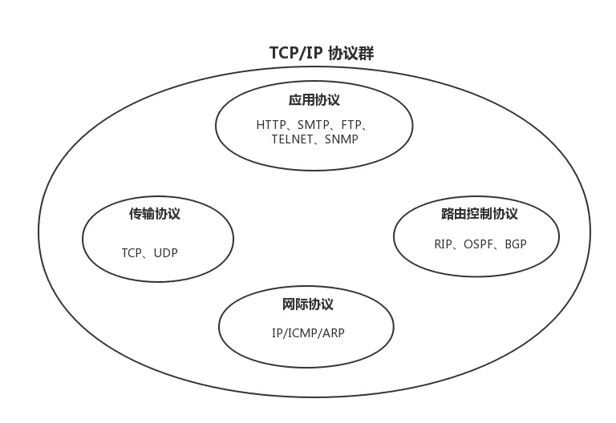
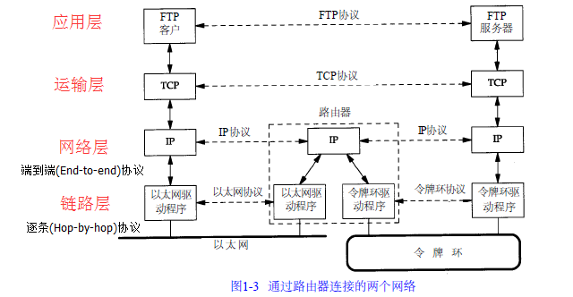
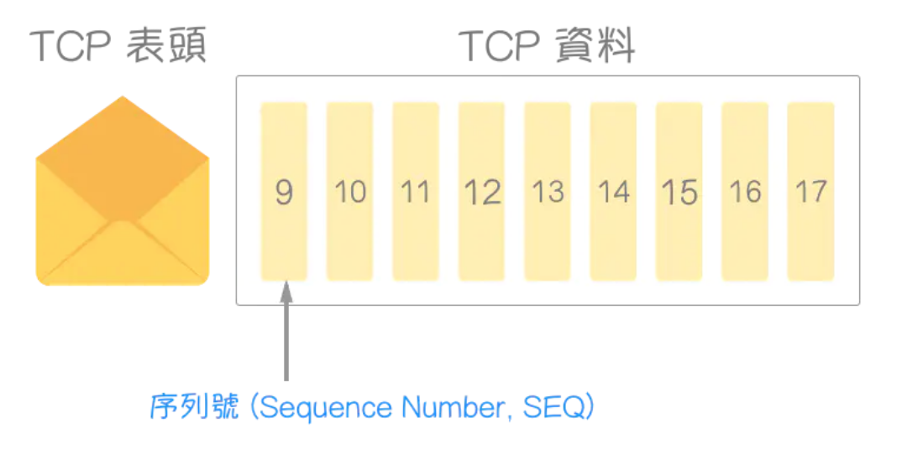
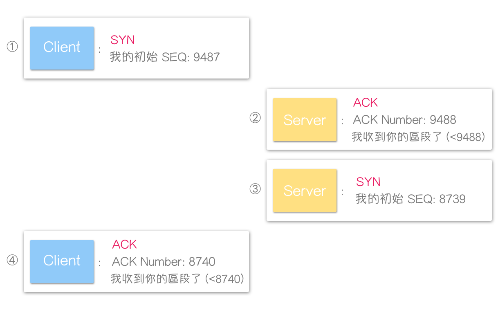
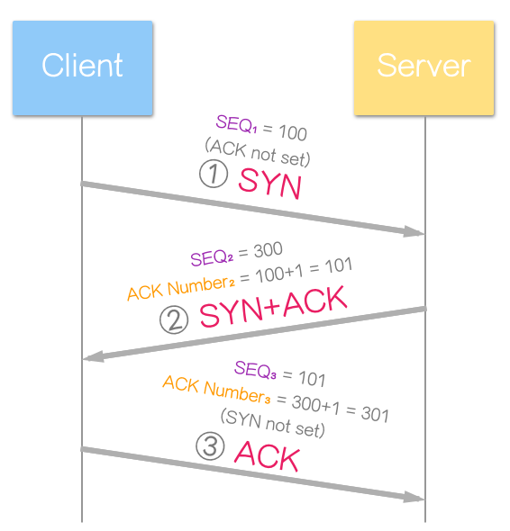
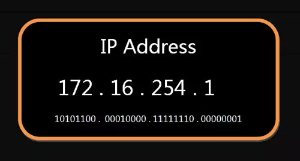
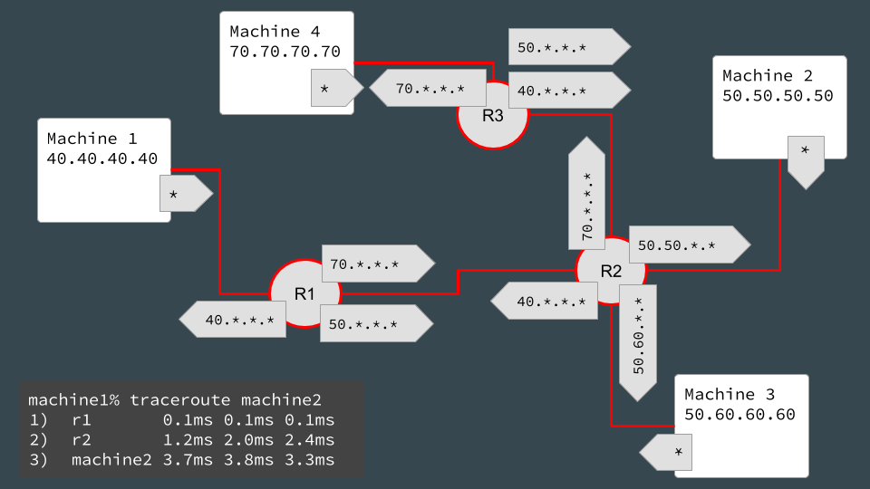
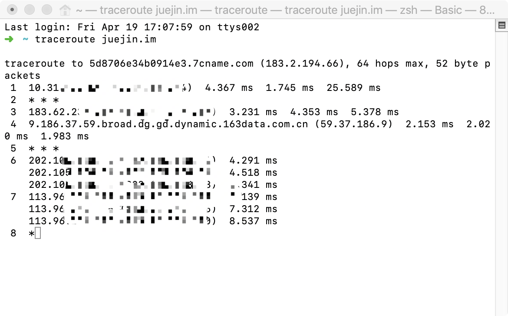
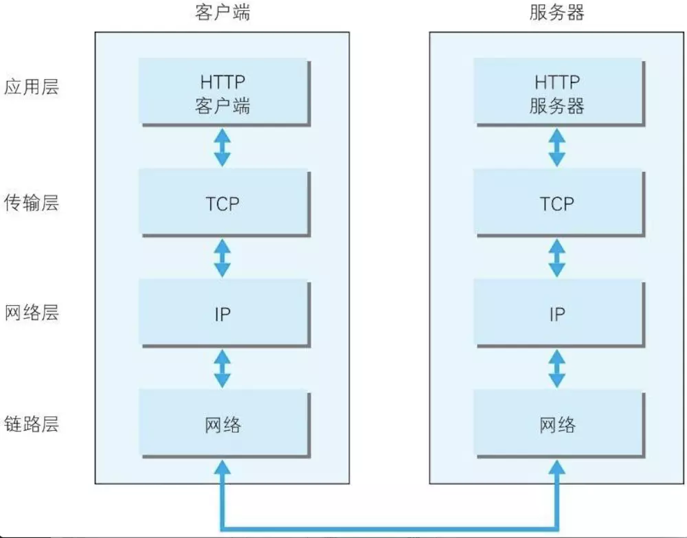

**本文目录**


- [TCP/IP协议族](#heading-1)
- [应用层, Application Layer](#heading-3)
- [三次握手详解：SEQ和ACK，序列号与确认号, SYN同步序列号)](#heading-7)
- [网络层, Network Layer(地址和路由相关知识)](#heading-9)
- [链路层，Link Layer(如何查看MAC地址)](#heading-12)
- [运行在传输层中的 TCP 和 UDP的协议](#heading-15)

## 1. `TCP/IP`协议族





> 互联网协议套件（英语：Internet Protocol Suite，缩写`IPS`）是一个网络通讯模型，以及一整个网络传输协议家族，为网际网络的基础通讯架构。它常被通称为TCP/IP协议族（英语：`TCP/IP Protocol Suite`，或`TCP/IP Protocols`），简称`TCP/IP`。因为该协定家族的两个核心协定：`TCP（传输控制协议）和IP（网际协议）`，为该家族中最早通过的标准。

敲重点：

- `TCP（传输控制协议）和IP（网际协议` 是最先定义的两个核心协议，所以才统称为`TCP/IP协议族`

### 1.1  `TCP/IP`拆家分层

`TCP/IP`协议族中有一个很重要一点就是分层管理，依次为以下四层，应用层，传输层，网络层，数据链路层。




`TCP/IP`分层管理是有好处的，假如互联网只有一个协议统筹，某一个地方改变设计时，就需要把所有部分都替换掉，而分层只需要把变动的层替换掉即可。


而且分层管理，设计也相对简单，处于应用层的应用只需要考虑分派自己的任务而不需要考虑对方的传输线路是怎样的，能否保证传输送达。

## 2. 应用层, `Application Layer`

应用层是大多数普通与网络相关的程序为了通过网络与其他程序通信所使用的层。这个层的处理过程是应用特有的；数据从网络相关的程序以这种应用内部使用的格式进行传送，然后被编码成标准协议的格式。

应用层决定了向用户提供的应用服务时的通信活动:

- `HTTP`（万维网服务）
- `FTP`（文件传输）
- `SMTP`（电子邮件）
- `SSH`（安全远程登陆）
- `DNS`（名称<-> IP地址寻找,域名系统）
- 以及许多[其他协议](https://zh.wikipedia.org/wiki/Category:应用层协议)

一旦从应用程序来的数据被编码成一个标准的应用层协议，它将被传送到IP栈的下一层。


图中用到HTTP和DNS

## 3. 传输层，`Transport Layer`

传输层位于应用层的下层，提供位于网络连接中的两台计算机之间的数据传输，传输层中有两种性质不同的协议

敲重点：**每一个应用层协议一般都会使用到两个传输层协议之一**

- `TCP`：面向连接的`Transmisson Control Protocol`传输控制协议
- `UDP` : 无连接的包传输`User DataProtocol`用户数据报协议

|              | UDP                                        | TCP                                    |
| ------------ | ------------------------------------------ | -------------------------------------- |
| 是否连接     | 无连接                                     | 面向连接                               |
| 是否可靠     | 不可靠传输，不使用流量控制和拥塞控制       | 可靠传输，使用流量控制和拥塞控制       |
| 连接对象个数 | 支持一对一，一对多，多对一和多对多交互通信 | 只能是一对一通信                       |
| 传输方式     | 面向报文                                   | 面向字节流                             |
| 首部开销     | 首部开销小，仅8字节                        | 首部最小20字节，最大60字节             |
| 场景         | 适用于实时应用（IP电话、视频会议、直播等） | 适用于要求可靠传输的应用，例如文件传输 |

摘自：[TCP和UDP比较](https://juejin.im/post/6844903800336023560)

### 3.1 传输层的意义

网络层的功能使我们能够将数据包从一台机器传送到网络上的另一台机器，但这还不足以编写网络应用程序，因为：

- 机器可以运行多个应用程序，我们需要知道哪个应用程序应该接收数据包。
- 网络层可以丢弃或重新排序数据包。另一方面，应用程序通常需要保证（即，无损耗）和按顺序传输字节。

### 3.2 何为“四元组”？

**`TCP`通过定义端口号解决了第一个问题**:

端口号本质上是标识符，有助于`TCP`区分机器上运行的应用。

换句话说，计算机上的每个端口号都由该计算机上的应用拥有。

端口号是2字节整数，端口0不可用。因此，我们可以在一台机器上拥有多达65536个端口。

TCP通过端口号来定义“连接”。

TCP连接由源和目标IP地址（来自网络层）以及源和目标端口号标识。这也称为四元组：

```
// 源IP地址、目的IP地址、源端口、目的端口
（src ip，dst ip，src port，dst port）
复制代码
```

### 3.3 `SEQ`和`ACK`，序列号与确认号

TCP网络中，为了保障每个连接提供有保证和有序的字节传递，使用了`Sequence Number` (,序列号)和 `Acknowledgment Number` (确认号)，即`Seq`和`Ack`。

`TCP` 每次发送与接受的单位为： `TCP`头部 + 数据, TCP数据段 (`TCP Segment`)；




每个数据段的大小不尽相同，有可能数百～数万。

`SEQ`，序列号，表示每次传输中字节的偏移量 `ACK`，确认号，指出下一个期望接收的`SEQ`(接受完毕)

举个例子：

1. 序列号为`＃2000`且长度为`100`的数据包，在此连接上包含第`2000-2099`个字节。
2. 当接收器接收到包括第`2099`字节在内的所有字节时，它发送一个确认`＃2100`。
3. 表示它已在第`2100`字节之前接收到该字节。

### 3.4 `SYN`，同步序列号


- 为了避免与先前连线的数据段混淆，当次连线建立时，序列号 并非从 0 开始。

- 两端会使用 `ISN`产生器，产生各自的 初始序列号 (`Initial Sequence Number, ISN`)， 通常两者并不相等。

- 连线建立时，透过 控制位元 (Control Bits) 中的 

  ```
  SYN
  ```

  ，让两端的 

  ```
  TCP
  ```

   必须进行 

  ```
  ISN
  ```

  的交换 (同步)。

  

好吧，说人话。就是**TCP三次握手**：

这就是 `TCP`连接的建立方式， 且 `2` 和 `3`，可以组合为单一讯息。

于是便有下图：





且第三次握手中 (`Client — — > Server`)， 其 `SEQ`為 第一段的值 + 1 (ISN + 1)。


## 4. 网络层, `Network Layer`

网络层用来处理在网络上流动的数据包（数据包：网络上传输的最小数据单位）。

网络层规定在众多选项中通过怎样的路径（传输线路）到达对方的计算机，把数据包传输给对方。


流动中的数据包

该层中最突出的协议是`Internet协议（IP）`，因此该层也称为`IP`层。`IP`的核心是两个主要功能：**地址和路由**。




`IP`的原始版本是 `IPV4`，后来扩展了`IPV6`：


- `IPv4`中规定`IP`地址长度为32,即有2^32-1个节点(40亿)。
- 我们网络中已经有超过40亿个节点，鉴于此，促成了IPV6发展。
- `IPv6`中`IP`地址的长度为128,即有2^128-1个节点(2125亿)
- 如果`IPV6`被广泛应用以后，全世界的每一粒沙子都会有相对应的一个IP地址。

### 4.1 地址

今天，大多数机器都有`IPv4`和`IPv6`地址。如果运行`ifconfig`，则可以看到计算机的`IPv4`和`IPv6`地址。

```
 ~ ifconfig
lo0: flags=8049<UP,LOOPBACK,RUNNING,MULTICAST> mtu 16384
	options=1203<RXCSUM,TXCSUM,TXSTATUS,SW_TIMESTAMP>
	inet 127.0.0.1 netmask 0xff000000
	inet6 ::1 prefixlen 128
	inet6 fe80::1809：1%lo0 prefixlen 64 scopeid 0x1
	nd6 options=201<PERFORMNUD,DAD>
	media: autoselect
	status: active
复制代码
```

### 4.2 路由

IP路由基于使用地址前缀的规则构构建。 如果在计算机上运行 `netstat -rn`，则可以在计算机上看到路由表。

- 例如，我的路由表说任何匹配`10.31.10/24`的IP数据包应该发送到`link＃8`。
- 如果仔细观察，可以看到“默认”行。该行是一项特殊规则，表示任何与其他规则不匹配的数据包都应使用此规则进行路由寻址。

> 它就像`switch / case`语句中的`default`。

```
% netstat -rn
Routing tables
Internet:
Destination        Gateway            Flags        Refs      Use   Netif 
default            10.31.10.222       UGSc           54        0     en0
default            link#17            UCSI            0        0 bridge1      !
10.31.10/24        link#8             UCS             9        0     en8      !
Internet6:
Destination   Gateway       Flags         Netif Expire
fe80::%lo0/64 fe80::1%lo0   UcI           lo0
复制代码
```

互联网上的所有节点都有这些路由表，这就是IP数据包路由到达目的地的方式。





如果您想了解如何在网络中将数据包路由到掘金`juejin.im`，请运行以下命令：

```
traceroute juejin.im
复制代码
```

就会得到下图：





## 5.链路层，`Link Layer`

(又名数据链路层，网络接口层)

用来处理连接网络中的硬件部分，硬件上的范围均在链路层中，包含

- 操作系统
- 硬件设备驱动
- NIC（Network interface Card 网络适配器：网卡 ）
- 光纤等物理可见部分


主机，线路，路由器

### 5.1 `ifconfig`: 查看`MAC`地址

在任何网络中，每个节点都具有  “邻居”。链路层协议提供通过链路直接连接的“邻居”之间通信所需的功能（例如，像CAT5电缆的物理链路，或WiFi中的无线电链路）。

最着名的链路层协议是以太网。在以太网中，每个接口都有一个唯一的48位（6字节）地址，称为媒体访问控制（MAC）地址。

如果在计算机上运行`ifconfig`，您将看到网络接口的名称及其`MAC`地址。

```
~  ifconfig
...
en0: flags=8863<UP,BROADCAST,SMART,RUNNING,SIMPLEX,MULTICAST> mtu 1500
 ether 88:e9:fe:4c:83:5b
 inet6 fe80::1809:d41a:a9a:d664%en0 prefixlen 64 secured scopeid 0x8
 inet 192.168.1.8 netmask 0xffffff00 broadcast 192.168.1.255
 nd6 options=201<PERFORMNUD,DAD>
 media: autoselect
 status: active
复制代码
```

如你所见，MAC地址中的每个字节都由十六进制值表示，并以冒号分隔。

通过以太网链路发送的网络数据包具有源和目标`MAC`地址。为了发现它的邻居，以太网使用广播查询和通知。使用这些广播机制，另一种称为`ARP`的协议可以找到邻居的`MAC`和`IP`地址之间的映射。如果在计算机上运行`arp`，则可以看到此映射。

```
~ arp -a -n 
? (10.31.xx.xx) at 98:28:xx:2a:cc:xx on en8 ifscope [ethernet]
? (10.31.xx.xx) at f4:8e:xx38:f5:b5:xx on en8 ifscope [ethernet]
? (10.31.xx.xx) at 54:ee:xx:e1:33:xx on en8 ifscope [ethernet]
....
复制代码
```

现在我们已经知道MAC和IP地址之间的映射关系。

## 6. TCP/IP 通信传输流




TCP/IP 通过分层管理进行网络通信，发送端从应用层往下走，接收端则往应用层上层走。


然后便一层层包裹，解析。


- 发送端，每经过一层会打上该层所属的首部信息。
- 接收端，每经过一层会把对应的首部信息解析。

## 7. 扩展：运行在传输层中的 `TCP` 和 `UDP`的协议

**每一个应用层（TCP/IP参考模型的最高层）协议一般都会使用到两个传输层协议之一：**

运行在`TCP协议`上的协议：

- `HTTP（Hypertext Transfer Protocol，超文本传输协议）`，主要用于普通浏览。
- `HTTPS（HTTP over SSL，安全超文本传输协议）`,`HTTP`协议的安全版本。
- `FTP（File Transfer Protocol，文件传输协议）`，用于文件传输。
- `POP3（Post Office Protocol, version 3，邮局协议）`，收邮件用。
- `SMTP（Simple Mail Transfer Protocol，简单邮件传输协议）`，用来发送电子邮件。
- `TELNET（Teletype over the Network，网络电传）`，通过一个`终端（terminal）`登陆到网络。
- `SSH（Secure Shell，用于替代安全性差的TELNET）`，用于加密安全登陆用。

运行在`UDP协议`上的协议：

- `BOOTP（Boot Protocol，启动协议）`，应用于无盘设备。
- `NTP（Network Time Protocol，网络时间协议）`，用于网络同步。
- `DHCP（Dynamic Host Configuration Protocol，动态主机配置协议）`，动态配置IP地址。

运行在`TCP`和`UDP`协议上：

- `DNS（Domain Name Service，域名服务）`，用于完成地址查找，邮件转发等工作。

## 免责声明

逛国外社区看到[这篇](https://medium.com/@paulswail/back-end-primer-for-front-end-web-developers-80339b5b5c3a)，觉得挺简洁明了的。

只是觉得好玩就简单总结一下，有说错的地方多担待。


> 意思就是写得略粗糙，别喷我。。。

## ❤️ 看完三件事

如果你觉得这篇内容对你挺有启发，我想邀请你帮我三个小忙：

1. 点赞，让更多的人也能看到这篇内容（收藏不点赞，都是耍流氓 -_-）
2. 关注公众号「前端劝退师」，不定期分享原创知识。
3. 也看看其它文章

- [那些你不经意间使用的设计模式(一) - 创建型模式](https://juejin.im/post/6844903895089545230)
- [「数据可视化库王者」D3.js 极速上手到Vue应用 ](https://juejin.im/post/6844903881189621774)
- [「真®全栈之路」Web前端开发的后端指南](https://juejin.im/post/6844903830623109134)
- [「Vue实践」5分钟撸一个Vue CLI 插件](https://juejin.im/post/6844903824742678541)
- [「Vue实践」武装你的前端项目](https://juejin.im/post/6844903815116750862)
- [「中高级前端面试」JavaScript手写代码无敌秘籍](https://juejin.im/post/6844903809206976520)
- [「从源码中学习」面试官都不知道的Vue题目答案](https://juejin.im/post/6844903806782668814)
- [「从源码中学习」Vue源码中的JS骚操作](https://juejin.im/post/6844903782719946765)
- [「Vue实践」项目升级vue-cli3的正确姿势](https://juejin.im/post/6844903767431708686)
- [为何你始终理解不了JavaScript作用域链？](https://juejin.im/editor/posts/5c8efeb1e51d45614372addd)


作者：前端劝退师
链接：https://juejin.cn/post/6844903826747555847
来源：掘金
著作权归作者所有。商业转载请联系作者获得授权，非商业转载请注明出处。