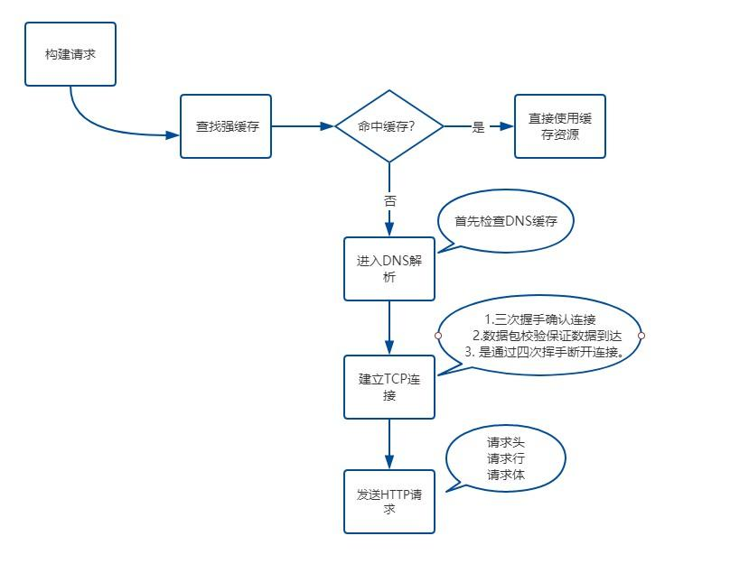
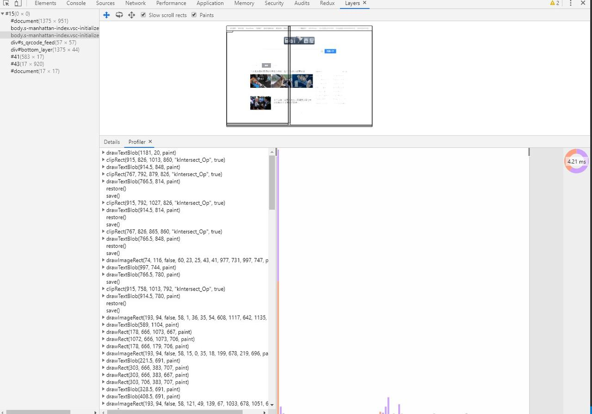
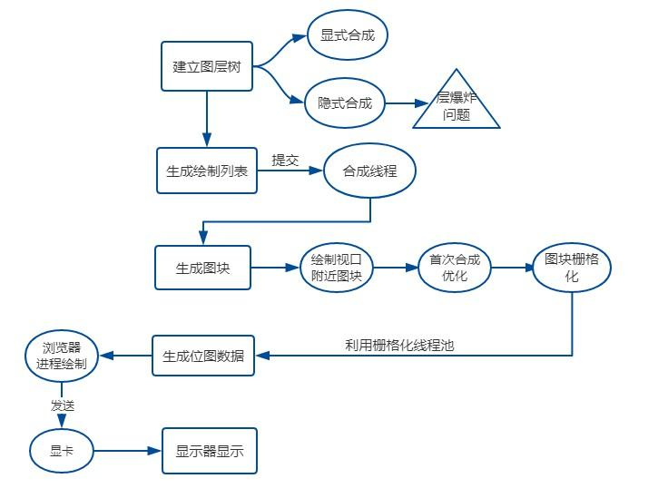
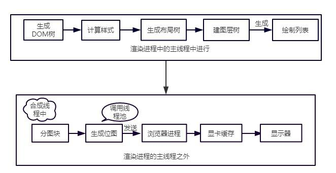
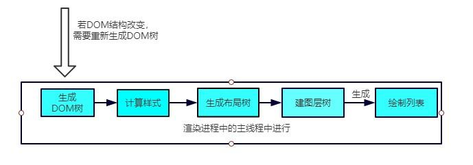
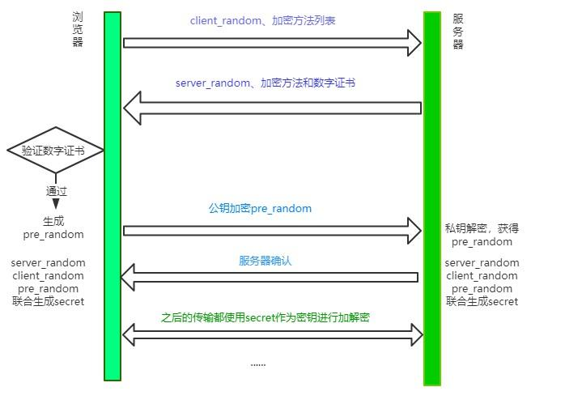

# (1.6w字)浏览器灵魂之问，请问你能接得住几个？

作为一个合格的前端工程师，浏览器相关的工作原理是我们进行性能优化的基石，我之前也强调过知识体系的重要性，这部分原理性的内容就是知识体系中的重要部分，必须牢牢掌握才能面对瞬息万变的实际场景，针对性地给出实际方案，而不是背诵各种开发军规和性能优化的条例，这样很难发现真正的问题所在, 更无法真正地解决问题。

内容会涵盖`浏览器工作原理`、`浏览器安全`和`性能监控和分析`。文章会分上下两次来发，今天这一篇是整个系列的上篇。

## 第1篇: 能不能说一说浏览器缓存?

缓存是性能优化中非常重要的一环，浏览器的缓存机制对开发也是非常重要的知识点。接下来以三个部分来把浏览器的缓存机制说清楚：

- 强缓存
- 协商缓存
- 缓存位置

### 强缓存

浏览器中的缓存作用分为两种情况，一种是需要发送`HTTP`请求，一种是不需要发送。

首先是检查强缓存，这个阶段`不需要`发送HTTP请求。

如何来检查呢？通过相应的字段来进行，但是说起这个字段就有点门道了。

在`HTTP/1.0`和`HTTP/1.1`当中，这个字段是不一样的。在早期，也就是`HTTP/1.0`时期，使用的是**Expires**，而`HTTP/1.1`使用的是**Cache-Control**。让我们首先来看看Expires。

#### Expires

`Expires`即过期时间，存在于服务端返回的响应头中，告诉浏览器在这个过期时间之前可以直接从缓存里面获取数据，无需再次请求。比如下面这样:

```js
Expires: Wed, 22 Nov 2019 08:41:00 GMT
复制代码
```

表示资源在`2019年11月22号8点41分`过期，过期了就得向服务端发请求。

这个方式看上去没什么问题，合情合理，但其实潜藏了一个坑，那就是**服务器的时间和浏览器的时间可能并不一致**，那服务器返回的这个过期时间可能就是不准确的。因此这种方式很快在后来的HTTP1.1版本中被抛弃了。

#### Cache-Control

在HTTP1.1中，采用了一个非常关键的字段：`Cache-Control`。这个字段也是存在于

它和`Expires`本质的不同在于它并没有采用`具体的过期时间点`这个方式，而是采用过期时长来控制缓存，对应的字段是**max-age**。比如这个例子:

```js
Cache-Control:max-age=3600
复制代码
```

代表这个响应返回后在 3600 秒，也就是一个小时之内可以直接使用缓存。

如果你觉得它只有`max-age`一个属性的话，那就大错特错了。

它其实可以组合非常多的指令，完成更多场景的缓存判断, 将一些关键的属性列举如下: **public**: 客户端和代理服务器都可以缓存。因为一个请求可能要经过不同的`代理服务器`最后才到达目标服务器，那么结果就是不仅仅浏览器可以缓存数据，中间的任何代理节点都可以进行缓存。

**private**： 这种情况就是只有浏览器能缓存了，中间的代理服务器不能缓存。

**no-cache**: 跳过当前的强缓存，发送HTTP请求，即直接进入`协商缓存阶段`。

**no-store**：非常粗暴，不进行任何形式的缓存。

**s-maxage**：这和`max-age`长得比较像，但是区别在于s-maxage是针对代理服务器的缓存时间。

值得注意的是，当**Expires**和**Cache-Control**同时存在的时候，**Cache-Control**会优先考虑。

当然，还存在一种情况，当资源缓存时间超时了，也就是`强缓存`失效了，接下来怎么办？没错，这样就进入到第二级屏障——**协商缓存**了。

### 协商缓存

强缓存失效之后，浏览器在请求头中携带相应的`缓存tag`来向服务器发请求，由服务器根据这个tag，来决定是否使用缓存，这就是**协商缓存**。

具体来说，这样的缓存tag分为两种: **Last-Modified** 和 **ETag**。这两者各有优劣，并不存在谁对谁有`绝对的优势`，跟上面强缓存的两个 tag 不一样。

#### Last-Modified

即最后修改时间。在浏览器第一次给服务器发送请求后，服务器会在响应头中加上这个字段。

浏览器接收到后，如果再次请求，会在请求头中携带`If-Modified-Since`字段，这个字段的值也就是服务器传来的最后修改时间。

服务器拿到请求头中的`If-Modified-Since`的字段后，其实会和这个服务器中`该资源的最后修改时间`对比:

- 如果请求头中的这个值小于最后修改时间，说明是时候更新了。返回新的资源，跟常规的HTTP请求响应的流程一样。
- 否则返回304，告诉浏览器直接用缓存。

#### ETag

`ETag` 是服务器根据当前文件的内容，给文件生成的唯一标识，只要里面的内容有改动，这个值就会变。服务器通过`响应头`把这个值给浏览器。

浏览器接收到`ETag`的值，会在下次请求时，将这个值作为**If-None-Match**这个字段的内容，并放到请求头中，然后发给服务器。

服务器接收到**If-None-Match**后，会跟服务器上该资源的**ETag**进行比对:

- 如果两者不一样，说明要更新了。返回新的资源，跟常规的HTTP请求响应的流程一样。
- 否则返回304，告诉浏览器直接用缓存。

#### 两者对比

1. 在`精准度`上，`ETag`优于`Last-Modified`。优于 ETag 是按照内容给资源上标识，因此能准确感知资源的变化。而 Last-Modified 就不一样了，它在一些特殊的情况并不能准确感知资源变化，主要有两种情况:

- 编辑了资源文件，但是文件内容并没有更改，这样也会造成缓存失效。
- Last-Modified 能够感知的单位时间是秒，如果文件在 1 秒内改变了多次，那么这时候的 Last-Modified 并没有体现出修改了。

1. 在性能上，`Last-Modified`优于`ETag`，也很简单理解，`Last-Modified`仅仅只是记录一个时间点，而 `Etag`需要根据文件的具体内容生成哈希值。

另外，如果两种方式都支持的话，服务器会优先考虑`ETag`。

### 缓存位置

前面我们已经提到，当`强缓存`命中或者协商缓存中服务器返回304的时候，我们直接从缓存中获取资源。那这些资源究竟缓存在什么位置呢？

浏览器中的缓存位置一共有四种，按优先级从高到低排列分别是：

- Service Worker
- Memory Cache
- Disk Cache
- Push Cache

### Service Worker

Service Worker 借鉴了 Web Worker的 思路，即让 JS 运行在主线程之外，由于它脱离了浏览器的窗体，因此无法直接访问`DOM`。虽然如此，但它仍然能帮助我们完成很多有用的功能，比如`离线缓存`、`消息推送`和`网络代理`等功能。其中的`离线缓存`就是 **Service Worker Cache**。

Service Worker 同时也是 PWA 的重要实现机制，关于它的细节和特性，我们将会在后面的 PWA 的分享中详细介绍。

### Memory Cache 和 Disk Cache

**Memory Cache**指的是内存缓存，从效率上讲它是最快的。但是从存活时间来讲又是最短的，当渲染进程结束后，内存缓存也就不存在了。

**Disk Cache**就是存储在磁盘中的缓存，从存取效率上讲是比内存缓存慢的，但是他的优势在于存储容量和存储时长。稍微有些计算机基础的应该很好理解，就不展开了。

好，现在问题来了，既然两者各有优劣，那浏览器如何决定将资源放进内存还是硬盘呢？主要策略如下：

- 比较大的JS、CSS文件会直接被丢进磁盘，反之丢进内存
- 内存使用率比较高的时候，文件优先进入磁盘

### Push Cache

即推送缓存，这是浏览器缓存的最后一道防线。它是 `HTTP/2` 中的内容，虽然现在应用的并不广泛，但随着 HTTP/2 的推广，它的应用越来越广泛。关于 Push Cache，有非常多的内容可以挖掘，不过这已经不是本文的重点，大家可以参考这篇[扩展文章](https://jakearchibald.com/2017/h2-push-tougher-than-i-thought/)。

### 总结

对浏览器的缓存机制来做个简要的总结:

首先通过 `Cache-Control` 验证强缓存是否可用

- 如果强缓存可用，直接使用

- 否则进入协商缓存，即发送 HTTP 请求，服务器通过请求头中的

  ```
  If-Modified-Since
  ```

  或者

  ```
  If-None-Match
  ```

  字段检查资源是否更新

  - 若资源更新，返回资源和200状态码
  - 否则，返回304，告诉浏览器直接从缓存获取资源

## 第2篇: 能不能说一说浏览器的本地存储？各自优劣如何？

浏览器的本地存储主要分为`Cookie`、`WebStorage`和`IndexedDB`, 其中`WebStorage`又可以分为`localStorage`和`sessionStorage`。接下来我们就来一一分析这些本地存储方案。

### Cookie

`Cookie` 最开始被设计出来其实并不是来做本地存储的，而是为了弥补`HTTP`在**状态管理上的不足**。

`HTTP` 协议是一个无状态协议，客户端向服务器发请求，服务器返回响应，故事就这样结束了，但是下次发请求如何让服务端知道客户端是谁呢？

这种背景下，就产生了 `Cookie`.

Cookie 本质上就是浏览器里面存储的一个很小的文本文件，内部以键值对的方式来存储(在chrome开发者面板的`Application`这一栏可以看到)。向同一个域名下发送请求，都会携带相同的 Cookie，服务器拿到 Cookie 进行解析，便能拿到客户端的状态。

Cookie 的作用很好理解，就是用来做**状态存储**的，但它也是有诸多致命的缺陷的：

1. 容量缺陷。Cookie 的体积上限只有`4KB`，只能用来存储少量的信息。
2. 性能缺陷。Cookie 紧跟域名，不管域名下面的某一个地址需不需要这个 Cookie ，请求都会携带上完整的 Cookie，这样随着请求数的增多，其实会造成巨大的性能浪费的，因为请求携带了很多不必要的内容。
3. 安全缺陷。由于 Cookie 以纯文本的形式在浏览器和服务器中传递，很容易被非法用户截获，然后进行一系列的篡改，在 Cookie 的有效期内重新发送给服务器，这是相当危险的。另外，在`HttpOnly`为 false 的情况下，Cookie 信息能直接通过 JS 脚本来读取。

### localStorage

#### 和Cookie异同

`localStorage`有一点跟`Cookie`一样，就是针对一个域名，即在同一个域名下，会存储相同的一段**localStorage**。

不过它相对`Cookie`还是有相当多的区别的:

1. 容量。localStorage 的容量上限为**5M**，相比于`Cookie`的 4K 大大增加。当然这个 5M 是针对一个域名的，因此对于一个域名是持久存储的。
2. 只存在客户端，默认不参与与服务端的通信。这样就很好地避免了 Cookie 带来的**性能问题**和**安全问题**。
3. 接口封装。通过`localStorage`暴露在全局，并通过它的 `setItem` 和 `getItem`等方法进行操作，非常方便。

#### 操作方式

接下来我们来具体看看如何来操作`localStorage`。

```js
let obj = { name: "sanyuan", age: 18 };
localStorage.setItem("name", "sanyuan"); 
localStorage.setItem("info", JSON.stringify(obj));
复制代码
```

接着进入相同的域名时就能拿到相应的值:

```js
let name = localStorage.getItem("name");
let info = JSON.parse(localStorage.getItem("info"));
复制代码
```

从这里可以看出，`localStorage`其实存储的都是字符串，如果是存储对象需要调用`JSON`的`stringify`方法，并且用`JSON.parse`来解析成对象。

#### 应用场景

利用`localStorage`的较大容量和持久特性，可以利用`localStorage`存储一些内容稳定的资源，比如官网的`logo`，存储`Base64`格式的图片资源，因此利用`localStorage`

### sessionStorage

#### 特点

`sessionStorage`以下方面和`localStorage`一致:

- 容量。容量上限也为 5M。
- 只存在客户端，默认不参与与服务端的通信。
- 接口封装。除了`sessionStorage`名字有所变化，存储方式、操作方式均和`localStorage`一样。

但`sessionStorage`和`localStorage`有一个本质的区别，那就是前者只是会话级别的存储，并不是持久化存储。会话结束，也就是页面关闭，这部分`sessionStorage`就不复存在了。

#### 应用场景

1. 可以用它对表单信息进行维护，将表单信息存储在里面，可以保证页面即使刷新也不会让之前的表单信息丢失。
2. 可以用它存储本次浏览记录。如果关闭页面后不需要这些记录，用`sessionStorage`就再合适不过了。事实上微博就采取了这样的存储方式。

### IndexedDB

`IndexedDB`是运行在浏览器中的`非关系型数据库`, 本质上是数据库，绝不是和刚才WebStorage的 5M 一个量级，理论上这个容量是没有上限的。

关于它的使用，本文侧重原理，而且 MDN 上的教程文档已经非常详尽，这里就不做赘述了，感兴趣可以看一下[使用文档](https://developer.mozilla.org/zh-CN/docs/Web/API/IndexedDB_API/Using_IndexedDB)。

接着我们来分析一下`IndexedDB`的一些重要特性，除了拥有数据库本身的特性，比如`支持事务`，`存储二进制数据`，还有这样一些特性需要格外注意：

1. 键值对存储。内部采用`对象仓库`存放数据，在这个对象仓库中数据采用**键值对**的方式来存储。
2. 异步操作。数据库的读写属于 I/O 操作, 浏览器中对异步 I/O 提供了支持。
3. 受同源策略限制，即无法访问跨域的数据库。

### 总结

浏览器中各种本地存储和缓存技术的发展，给前端应用带来了大量的机会，PWA 也正是依托了这些优秀的存储方案才得以发展起来。重新梳理一下这些本地存储方案:

1. `cookie`并不适合存储，而且存在非常多的缺陷。
2. `Web Storage`包括`localStorage`和`sessionStorage`, 默认不会参与和服务器的通信。
3. `IndexedDB`为运行在浏览器上的非关系型数据库，为大型数据的存储提供了接口。

## 第3篇: 说一说从输入URL到页面呈现发生了什么？——网络篇

这是一个可以无限难的问题。出这个题目的目的就是为了考察你的 web 基础深入到什么程度。由于水平和篇幅有限，在这里我将把其中一些重要的过程给大家梳理一遍，相信能在绝大部分的情况下给出一个比较惊艳的答案。

这里我提前声明，由于是一个综合性非常强的问题，可能会在某一个点上深挖出非常多的细节，我个人觉得学习是一个循序渐进的过程，在明白了整体过程后再去自己研究这些细节，会对整个知识体系有更深的理解。同时，关于延申出来的细节点我都有参考资料，看完这篇之后不妨再去深入学习一下，扩展知识面。

好，正题开始。

此时此刻，你在浏览器地址栏输入了百度的网址:

```js
https://www.baidu.com/
复制代码
```

### 网络请求

#### 1. 构建请求

浏览器会构建请求行:

```js
// 请求方法是GET，路径为根路径，HTTP协议版本为1.1
GET / HTTP/1.1
复制代码
```

#### 2. 查找强缓存

先检查强缓存，如果命中直接使用，否则进入下一步。关于强缓存，如果不清楚可以参考上一篇文章。

#### 3. DNS解析

由于我们输入的是域名，而数据包是通过`IP地址`传给对方的。因此我们需要得到域名对应的`IP地址`。这个过程需要依赖一个服务系统，这个系统将域名和 IP 一一映射，我们将这个系统就叫做**DNS**（域名系统）。得到具体 IP 的过程就是`DNS`解析。

当然，值得注意的是，浏览器提供了**DNS数据缓存功能**。即如果一个域名已经解析过，那会把解析的结果缓存下来，下次处理直接走缓存，不需要经过 `DNS解析`。

另外，如果不指定端口的话，默认采用对应的 IP 的 80 端口。

#### 4. 建立 TCP 连接

这里要提醒一点，Chrome 在同一个域名下要求同时最多只能有 6 个 TCP 连接，超过 6 个的话剩下的请求就得等待。

假设现在不需要等待，我们进入了 TCP 连接的建立阶段。首先解释一下什么是 TCP:

> TCP（Transmission Control Protocol，传输控制协议）是一种面向连接的、可靠的、基于字节流的传输层通信协议。

建立 `TCP连接`经历了下面三个阶段:

1. 通过**三次握手**(即总共发送3个数据包确认已经建立连接)建立客户端和服务器之间的连接。
2. 进行数据传输。这里有一个重要的机制，就是接收方接收到数据包后必须要向发送方`确认`, 如果发送方没有接到这个`确认`的消息，就判定为数据包丢失，并重新发送该数据包。当然，发送的过程中还有一个优化策略，就是把`大的数据包拆成一个个小包`，依次传输到接收方，接收方按照这个小包的顺序把它们`组装`成完整数据包。
3. 断开连接的阶段。数据传输完成，现在要断开连接了，通过**四次挥手**来断开连接。

读到这里，你应该明白 TCP 连接通过什么手段来保证数据传输的可靠性，一是`三次握手`确认连接，二是`数据包校验`保证数据到达接收方，三是通过`四次挥手`断开连接。

当然，如果再深入地问，比如**为什么要三次握手，两次不行吗？第三次握手失败了怎么办？为什么要四次挥手**等等这一系列的问题，涉及计算机网络的基础知识，比较底层，但是也是非常重要的细节，希望你能好好研究一下，另外这里有一篇不错的文章，[点击进入相应的推荐文章](https://zhuanlan.zhihu.com/p/86426969)，相信这篇文章能给你启发。

#### 5.发送 HTTP 请求

现在`TCP连接`建立完毕，浏览器可以和服务器开始通信，即开始发送 HTTP 请求。浏览器发 HTTP 请求要携带三样东西:**请求行**、**请求头**和**请求体**。

首先，浏览器会向服务器发送**请求行**,关于**请求行**， 我们在这一部分的第一步就构建完了，贴一下内容:

```js
// 请求方法是GET，路径为根路径，HTTP协议版本为1.1
GET / HTTP/1.1
复制代码
```

结构很简单，由**请求方法**、**请求URI**和**HTTP版本协议**组成。

同时也要带上**请求头**，比如我们之前说的**Cache-Control**、**If-Modified-Since**、**If-None-Match**都由可能被放入请求头中作为缓存的标识信息。当然了还有一些其他的属性，列举如下:

```
Accept: text/html,application/xhtml+xml,application/xml;q=0.9,image/webp,image/apng,*/*;q=0.8,application/signed-exchange;v=b3
Accept-Encoding: gzip, deflate, br
Accept-Language: zh-CN,zh;q=0.9
Cache-Control: no-cache
Connection: keep-alive
Cookie: /* 省略cookie信息 */
Host: www.baidu.com
Pragma: no-cache
Upgrade-Insecure-Requests: 1
User-Agent: Mozilla/5.0 (iPhone; CPU iPhone OS 11_0 like Mac OS X) AppleWebKit/604.1.38 (KHTML, like Gecko) Version/11.0 Mobile/15A372 Safari/604.1
复制代码
```

最后是请求体，请求体只有在`POST`方法下存在，常见的场景是**表单提交**。

### 网络响应

HTTP 请求到达服务器，服务器进行对应的处理。最后要把数据传给浏览器，也就是返回网络响应。

跟请求部分类似，网络响应具有三个部分:**响应行**、**响应头**和**响应体**。

响应行类似下面这样:

```js
HTTP/1.1 200 OK
复制代码
```

由`HTTP协议版本`、`状态码`和`状态描述`组成。

响应头包含了服务器及其返回数据的一些信息, 服务器生成数据的时间、返回的数据类型以及对即将写入的Cookie信息。

举例如下:

```
Cache-Control: no-cache
Connection: keep-alive
Content-Encoding: gzip
Content-Type: text/html;charset=utf-8
Date: Wed, 04 Dec 2019 12:29:13 GMT
Server: apache
Set-Cookie: rsv_i=f9a0SIItKqzv7kqgAAgphbGyRts3RwTg%2FLyU3Y5Eh5LwyfOOrAsvdezbay0QqkDqFZ0DfQXby4wXKT8Au8O7ZT9UuMsBq2k; path=/; domain=.baidu.com
复制代码
```

响应完成之后怎么办？TCP 连接就断开了吗？

不一定。这时候要判断`Connection`字段, 如果请求头或响应头中包含**Connection: Keep-Alive**，表示建立了持久连接，这样`TCP`连接会一直保持，之后请求统一站点的资源会复用这个连接。

否则断开`TCP`连接, 请求-响应流程结束。

### 总结

到此，我们来总结一下主要内容，也就是浏览器端的网络请求过程：



## 第4篇: 说一说从输入URL到页面呈现发生了什么？——解析算法篇

完成了网络请求和响应，如果响应头中`Content-Type`的值是`text/html`，那么接下来就是浏览器的`解析`和`渲染`工作了。

首先来介绍解析部分，主要分为以下几个步骤:

- 构建 `DOM`树
- `样式`计算
- 生成`布局树`(`Layout Tree`)

### 构建 DOM 树

由于浏览器无法直接理解`HTML字符串`，因此将这一系列的字节流转换为一种有意义并且方便操作的数据结构，这种数据结构就是`DOM树`。`DOM树`本质上是一个以`document`为根节点的多叉树。

那通过什么样的方式来进行解析呢？

#### HTML文法的本质

首先，我们应该清楚把握一点: HTML 的文法并不是`上下文无关文法`。

这里，有必要讨论一下什么是`上下文无关文法`。

在计算机科学的**编译原理**学科中，有非常明确的定义:

> 若一个形式文法G = (N, Σ, P, S) 的产生式规则都取如下的形式：V->w，则叫上下文无关语法。其中 V∈N ，w∈(N∪Σ)* 。

其中把 G = (N, Σ, P, S) 中各个参量的意义解释一下:

1. N 是**非终结符**(顾名思义，就是说最后一个符号不是它, 下面同理)集合。
2. Σ 是**终结符**集合。
3. P 是开始符，它必须属于 N ，也就是非终结符。
4. S 就是不同的产生式的集合。如 S -> aSb 等等。

通俗一点讲，`上下文无关的文法`就是说这个文法中所有产生式的左边都是一个非终结符。

看到这里，如果还有一点懵圈，我举个例子你就明白了。

比如:

```
A -> B
复制代码
```

这个文法中，每个产生式左边都会有一个非终结符，这就是`上下文无关的文法`。在这种情况下，`xBy`一定是可以规约出`xAy`的。

我们下面看看看一个反例：

```
aA -> B
Aa -> B
复制代码
```

这种情况就是不是`上下文无关的文法`，当遇到`B`的时候，我们不知道到底能不能规约出`A`，取决于左边或者右边是否有`a`存在，也就是说和上下文有关。

关于它为什么是`非上下文无关文法`，首先需要让大家注意的是，规范的 HTML 语法，是符合`上下文无关文法`的，能够体现它`非上下文无关`的是**不标准的语法**。在此我仅举一个反例即可证明。

比如解析器扫描到`form`标签的时候，**上下文无关文法**的处理方式是直接创建对应 form 的 DOM 对象，而真实的 HTML5 场景中却不是这样，解析器会查看 `form` 的上下文，如果这个 `form` 标签的父标签也是 `form`, 那么**直接跳过**当前的 `form` 标签，否则才创建 DOM 对象。

常规的编程语言都是**上下文无关**的，而HTML却相反，也正是它**非上下文无关**的特性，决定了`HTML Parser`并不能使用常规编程语言的解析器来完成，需要另辟蹊径。

#### 解析算法

HTML5 [规范](https://html.spec.whatwg.org/multipage/parsing.html)详细地介绍了解析算法。这个算法分为两个阶段:

1. 标记化。
2. 建树。

对应的两个过程就是**词法分析**和**语法分析**。

##### 标记化算法

这个算法输入为`HTML文本`，输出为`HTML标记`，也成为**标记生成器**。其中运用**有限自动状态机**来完成。即在当当前状态下，接收一个或多个字符，就会更新到下一个状态。

```html
<html>
  <body>
    Hello sanyuan
  </body>
</html>
复制代码
```

通过一个简单的例子来演示一下`标记化`的过程。

遇到`<`, 状态为**标记打开**。

接收`[a-z]`的字符，会进入**标记名称状态**。

这个状态一直保持，直到遇到`>`，表示标记名称记录完成，这时候变为**数据状态**。

接下来遇到`body`标签做同样的处理。

这个时候`html`和`body`的标记都记录好了。

现在来到<body>中的>，进入**数据状态**，之后保持这样状态接收后面的字符**hello sanyuan**。

接着接收 </body> 中的`<`，回到**标记打开**, 接收下一个`/`后，这时候会创建一个`end tag`的token。

随后进入**标记名称状态**, 遇到`>`回到**数据状态**。

接着以同样的样式处理 </body>。

##### 建树算法

之前提到过，DOM 树是一个以`document`为根节点的多叉树。因此解析器首先会创建一个`document`对象。标记生成器会把每个标记的信息发送给**建树器**。**建树器**接收到相应的标记时，会**创建对应的 DOM 对象**。创建这个`DOM对象`后会做两件事情:

1. 将`DOM对象`加入 DOM 树中。
2. 将对应标记压入存放开放(与`闭合标签`意思对应)元素的栈中。

还是拿下面这个例子说:

```html
<html>
  <body>
    Hello sanyuan
  </body>
</html>
复制代码
```

首先，状态为**初始化状态**。

接收到标记生成器传来的`html`标签，这时候状态变为**before html状态**。同时创建一个`HTMLHtmlElement`的 DOM 元素, 将其加到`document`根对象上，并进行压栈操作。

接着状态自动变为**before head**, 此时从标记生成器那边传来`body`，表示并没有`head`, 这时候**建树器**会自动创建一个**HTMLHeadElement**并将其加入到`DOM树`中。

现在进入到**in head**状态, 然后直接跳到**after head**。

现在**标记生成器**传来了`body`标记，创建**HTMLBodyElement**, 插入到`DOM`树中，同时压入开放标记栈。

接着状态变为**in body**，然后来接收后面一系列的字符: **Hello sanyuan**。接收到第一个字符的时候，会创建一个**Text**节点并把字符插入其中，然后把**Text**节点插入到 DOM 树中`body元素`的下面。随着不断接收后面的字符，这些字符会附在**Text**节点上。

现在，**标记生成器**传过来一个`body`的结束标记，进入到**after body**状态。

**标记生成器**最后传过来一个`html`的结束标记, 进入到**after after body**的状态，表示解析过程到此结束。

##### 容错机制

讲到`HTML5`规范，就不得不说它强大的**宽容策略**, 容错能力非常强，虽然大家褒贬不一，不过我想作为一名资深的前端工程师，有必要知道`HTML Parser`在容错方面做了哪些事情。

接下来是 WebKit 中一些经典的容错示例，发现有其他的也欢迎来补充。

1. 使用</br>而不是<br>

```js
if (t->isCloseTag(brTag) && m_document->inCompatMode()) {
  reportError(MalformedBRError);
  t->beginTag = true;
}
复制代码
```

全部换为<br>的形式。

1. 表格离散

```html
<table>
  <table>
    <tr><td>inner table</td></tr>
  </table>
  <tr><td>outer table</td></tr>
</table>
复制代码
```

`WebKit`会自动转换为:

```html
<table>
    <tr><td>outer table</td></tr>
</table>
<table>
    <tr><td>inner table</td></tr>
</table>
复制代码
```

1. 表单元素嵌套

这时候直接忽略里面的`form`。

### 样式计算

关于CSS样式，它的来源一般是三种:

1. **link标签引用**
2. **style标签中的样式**
3. **元素的内嵌style属性**

#### 格式化样式表

首先，浏览器是无法直接识别 CSS 样式文本的，因此渲染引擎接收到 CSS 文本之后第一件事情就是将其转化为一个结构化的对象，即styleSheets。

这个格式化的过程过于复杂，而且对于不同的浏览器会有不同的优化策略，这里就不展开了。

在浏览器控制台能够通过`document.styleSheets`来查看这个最终的结构。当然，这个结构包含了以上三种CSS来源，为后面的样式操作提供了基础。

#### 标准化样式属性

有一些 CSS 样式的数值并不容易被渲染引擎所理解，因此需要在计算样式之前将它们标准化，如`em`->`px`,`red`->`#ff0000`,`bold`->`700`等等。

#### 计算每个节点的具体样式

样式已经被`格式化`和`标准化`,接下来就可以计算每个节点的具体样式信息了。

其实计算的方式也并不复杂，主要就是两个规则: **继承**和**层叠**。

每个子节点都会默认继承父节点的样式属性，如果父节点中没有找到，就会采用浏览器默认样式，也叫`UserAgent样式`。这就是继承规则，非常容易理解。

然后是层叠规则，CSS 最大的特点在于它的层叠性，也就是最终的样式取决于各个属性共同作用的效果，甚至有很多诡异的层叠现象，看过《CSS世界》的同学应该对此深有体会，具体的层叠规则属于深入 CSS 语言的范畴，这里就不过多介绍了。

不过值得注意的是，在计算完样式之后，所有的样式值会被挂在到`window.getComputedStyle`当中，也就是可以通过JS来获取计算后的样式，非常方便。

### 生成布局树

现在已经生成了`DOM树`和`DOM样式`，接下来要做的就是通过浏览器的布局系统`确定元素的位置`，也就是要生成一棵`布局树`(Layout Tree)。

布局树生成的大致工作如下:

1. 遍历生成的 DOM 树节点，并把他们添加到`布局树中`。
2. 计算布局树节点的坐标位置。

值得注意的是，这棵布局树值包含可见元素，对于 `head`标签和设置了`display: none`的元素，将不会被放入其中。

有人说首先会生成`Render Tree`，也就是渲染树，其实这还是 16 年之前的事情，现在 Chrome 团队已经做了大量的重构，已经没有生成`Render Tree`的过程了。而布局树的信息已经非常完善，完全拥有`Render Tree`的功能。

之所以不讲布局的细节，是因为它过于复杂，一一介绍会显得文章过于臃肿，不过大部分情况下我们只需要知道它所做的工作**是什么**即可，如果想深入其中的原理，知道它是**如何来做的**，我强烈推荐你去读一读人人FED团队的文章[从Chrome源码看浏览器如何layout布局](https://www.rrfed.com/2017/02/26/chrome-layout/)。

### 总结

梳理一下这一节的主要脉络:


## 第5篇: 说一说从输入URL到页面呈现发生了什么？——渲染过程篇

上一节介绍了浏览器`解析`的过程,其中包含`构建DOM`、`样式计算`和`构建布局树`。

接下来就来拆解下一个过程——`渲染`。分为以下几个步骤:

- 建立`图层树`(`Layer Tree`)
- 生成`绘制列表`
- 生成`图块`并`栅格化`
- 显示器显示内容

### 一、建图层树

如果你觉得现在`DOM节点`也有了，样式和位置信息也都有了，可以开始绘制页面了，那你就错了。

因为你考虑掉了另外一些复杂的场景，比如3D动画如何呈现出变换效果，当元素含有层叠上下文时如何控制显示和隐藏等等。

为了解决如上所述的问题，浏览器在构建完`布局树`之后，还会对特定的节点进行分层，构建一棵`图层树`(`Layer Tree`)。

那这棵图层树是根据什么来构建的呢？

一般情况下，节点的图层会默认属于父亲节点的图层(这些图层也称为**合成层**)。那什么时候会提升为一个单独的合成层呢？

有两种情况需要分别讨论，一种是**显式合成**，一种是**隐式合成**。

#### 显式合成

下面是`显式合成`的情况:

一、 拥有**层叠上下文**的节点。

层叠上下文也基本上是有一些特定的CSS属性创建的，一般有以下情况:

1. HTML根元素本身就具有层叠上下文。
2. 普通元素设置**position不为static**并且**设置了z-index属性**，会产生层叠上下文。
3. 元素的 **opacity** 值不是 1
4. 元素的 **transform** 值不是 none
5. 元素的 **filter** 值不是 none
6. 元素的 **isolation** 值是isolate
7. **will-change**指定的属性值为上面任意一个。(will-change的作用后面会详细介绍)

二、需要**剪裁**的地方。

比如一个div，你只给他设置 100 * 100 像素的大小，而你在里面放了非常多的文字，那么超出的文字部分就需要被剪裁。当然如果出现了滚动条，那么滚动条会被单独提升为一个图层。

#### 隐式合成

接下来是`隐式合成`，简单来说就是`层叠等级低`的节点被提升为单独的图层之后，那么`所有层叠等级比它高`的节点**都会**成为一个单独的图层。

这个隐式合成其实隐藏着巨大的风险，如果在一个大型应用中，当一个`z-index`比较低的元素被提升为单独图层之后，层叠在它上面的的元素统统都会被提升为单独的图层，可能会增加上千个图层，大大增加内存的压力，甚至直接让页面崩溃。这就是**层爆炸**的原理。这里有一个具体的例子，[点击打开](https://segmentfault.com/a/1190000014520786)。

值得注意的是，当需要`repaint`时，只需要`repaint`本身，而不会影响到其他的层。

### 二、生成绘制列表

接下来渲染引擎会将图层的绘制拆分成一个个绘制指令，比如先画背景、再描绘边框......然后将这些指令按顺序组合成一个待绘制列表，相当于给后面的绘制操作做了一波计划。

这里我以百度首页为例，大家可以在 Chrome 开发者工具中在设置栏中展开 `more tools`, 然后选择`Layers`面板，就能看到下面的绘制列表:



### 三、生成图块和生成位图

现在开始绘制操作，实际上在渲染进程中绘制操作是由专门的线程来完成的，这个线程叫**合成线程**。

绘制列表准备好了之后，渲染进程的主线程会给`合成线程`发送`commit`消息，把绘制列表提交给合成线程。接下来就是合成线程一展宏图的时候啦。

首先，考虑到视口就这么大，当页面非常大的时候，要滑很长时间才能滑到底，如果要一口气全部绘制出来是相当浪费性能的。因此，合成线程要做的第一件事情就是将图层**分块**。这些块的大小一般不会特别大，通常是 256 * 256 或者 512 * 512 这个规格。这样可以大大加速页面的首屏展示。

因为后面图块数据要进入 GPU 内存，考虑到浏览器内存上传到 GPU 内存的操作比较慢，即使是绘制一部分图块，也可能会耗费大量时间。针对这个问题，Chrome 采用了一个策略: 在首次合成图块时只采用一个**低分辨率**的图片，这样首屏展示的时候只是展示出低分辨率的图片，这个时候继续进行合成操作，当正常的图块内容绘制完毕后，会将当前低分辨率的图块内容替换。这也是 Chrome 底层优化首屏加载速度的一个手段。

顺便提醒一点，渲染进程中专门维护了一个**栅格化线程池**，专门负责把**图块**转换为**位图数据**。

然后合成线程会选择视口附近的**图块**，把它交给**栅格化线程池**生成位图。

生成位图的过程实际上都会使用 GPU 进行加速，生成的位图最后发送给`合成线程`。

### 四、显示器显示内容

栅格化操作完成后，**合成线程**会生成一个绘制命令，即"DrawQuad"，并发送给浏览器进程。

浏览器进程中的`viz组件`接收到这个命令，根据这个命令，把页面内容绘制到内存，也就是生成了页面，然后把这部分内存发送给显卡。为什么发给显卡呢？我想有必要先聊一聊显示器显示图像的原理。

无论是 PC 显示器还是手机屏幕，都有一个固定的刷新频率，一般是 60 HZ，即 60 帧，也就是一秒更新 60 张图片，一张图片停留的时间约为 16.7 ms。而每次更新的图片都来自显卡的**前缓冲区**。而显卡接收到浏览器进程传来的页面后，会合成相应的图像，并将图像保存到**后缓冲区**，然后系统自动将`前缓冲区`和`后缓冲区`对换位置，如此循环更新。

看到这里你也就是明白，当某个动画大量占用内存的时候，浏览器生成图像的时候会变慢，图像传送给显卡就会不及时，而显示器还是以不变的频率刷新，因此会出现卡顿，也就是明显的掉帧现象。

### 总结

到这里，我们算是把整个过程给走通了，现在重新来梳理一下页面渲染的流程。



## 第6篇: 谈谈你对重绘和回流的理解。

我们首先来回顾一下`渲染流水线`的流程:



接下来，我们将来以此为依据来介绍重绘和回流，以及让更新视图的另外一种方式——合成。

### 回流

首先介绍`回流`。`回流`也叫`重排`。

#### 触发条件

简单来说，就是当我们对 DOM 结构的修改引发 DOM 几何尺寸变化的时候，会发生`回流`的过程。

具体一点，有以下的操作会触发回流:

1. 一个 DOM 元素的几何属性变化，常见的几何属性有`width`、`height`、`padding`、`margin`、`left`、`top`、`border` 等等, 这个很好理解。
2. 使 DOM 节点发生`增减`或者`移动`。
3. 读写 `offset`族、`scroll`族和`client`族属性的时候，浏览器为了获取这些值，需要进行回流操作。
4. 调用 `window.getComputedStyle` 方法。

#### 回流过程

依照上面的渲染流水线，触发回流的时候，如果 DOM 结构发生改变，则重新渲染 DOM 树，然后将后面的流程(包括主线程之外的任务)全部走一遍。



相当于将解析和合成的过程重新又走了一篇，开销是非常大的。

### 重绘

#### 触发条件

当 DOM 的修改导致了样式的变化，并且没有影响几何属性的时候，会导致`重绘`(`repaint`)。

#### 重绘过程

由于没有导致 DOM 几何属性的变化，因此元素的位置信息不需要更新，从而省去布局的过程。流程如下：


跳过了`生成布局树`和`建图层树`的阶段，直接生成绘制列表，然后继续进行分块、生成位图等后面一系列操作。

可以看到，重绘不一定导致回流，但回流一定发生了重绘。

### 合成

还有一种情况，是直接合成。比如利用 CSS3 的`transform`、`opacity`、`filter`这些属性就可以实现合成的效果，也就是大家常说的**GPU加速**。

#### GPU加速的原因

在合成的情况下，会直接跳过布局和绘制流程，直接进入`非主线程`处理的部分，即直接交给`合成线程`处理。交给它处理有两大好处:

1. 能够充分发挥`GPU`的优势。合成线程生成位图的过程中会调用线程池，并在其中使用`GPU`进行加速生成，而GPU 是擅长处理位图数据的。
2. 没有占用主线程的资源，即使主线程卡住了，效果依然能够流畅地展示。

### 实践意义

知道上面的原理之后，对于开发过程有什么指导意义呢？

1. 避免频繁使用 style，而是采用修改`class`的方式。
2. 使用`createDocumentFragment`进行批量的 DOM 操作。
3. 对于 resize、scroll 等进行防抖/节流处理。
4. 添加 will-change: tranform ，让渲染引擎为其单独实现一个图层，当这些变换发生时，仅仅只是利用合成线程去处理这些变换，而不牵扯到主线程，大大提高渲染效率。当然这个变化不限于`tranform`, 任何可以实现合成效果的 CSS 属性都能用`will-change`来声明。这里有一个实际的例子，一行`will-change: tranform`拯救一个项目，[点击直达](https://juejin.im/post/6844903966573068301)。

## 第7篇: 能不能说一说XSS攻击？

### 什么是 XSS 攻击？

`XSS` 全称是 `Cross Site Scripting`(即`跨站脚本`)，为了和 CSS 区分，故叫它`XSS`。XSS 攻击是指浏览器中执行恶意脚本(无论是跨域还是同域)，从而拿到用户的信息并进行操作。

这些操作一般可以完成下面这些事情:

1. 窃取`Cookie`。
2. 监听用户行为，比如输入账号密码后直接发送到黑客服务器。
3. 修改 DOM 伪造登录表单。
4. 在页面中生成浮窗广告。

通常情况，XSS 攻击的实现有三种方式——**存储型**、**反射型**和**文档型**。原理都比较简单，先来一一介绍一下。

#### 存储型

`存储型`，顾名思义就是将恶意脚本存储了起来，确实，存储型的 XSS 将脚本存储到了服务端的数据库，然后在客户端执行这些脚本，从而达到攻击的效果。

常见的场景是留言评论区提交一段脚本代码，如果前后端没有做好转义的工作，那评论内容存到了数据库，在页面渲染过程中`直接执行`, 相当于执行一段未知逻辑的 JS 代码，是非常恐怖的。这就是存储型的 XSS 攻击。

#### 反射型

`反射型XSS`指的是恶意脚本作为**网络请求的一部分**。

比如我输入:

```
http://sanyuan.com?q=<script>alert("你完蛋了")</script>
复制代码
```

这杨，在服务器端会拿到`q`参数,然后将内容返回给浏览器端，浏览器将这些内容作为HTML的一部分解析，发现是一个脚本，直接执行，这样就被攻击了。

之所以叫它`反射型`, 是因为恶意脚本是通过作为网络请求的参数，经过服务器，然后再反射到HTML文档中，执行解析。和`存储型`不一样的是，服务器并不会存储这些恶意脚本。

#### 文档型

文档型的 XSS 攻击并不会经过服务端，而是作为中间人的角色，在数据传输过程劫持到网络数据包，然后**修改里面的 html 文档**！

这样的劫持方式包括`WIFI路由器劫持`或者`本地恶意软件`等。

### 防范措施

明白了三种`XSS`攻击的原理，我们能发现一个共同点: 都是让恶意脚本直接能在浏览器中执行。

那么要防范它，就是要避免这些脚本代码的执行。

为了完成这一点，必须做到**一个信念，两个利用**。

#### 一个信念

千万不要相信任何用户的输入！

无论是在前端和服务端，都要对用户的输入进行**转码**或者**过滤**。

如:

```
<script>alert('你完蛋了')</script>
复制代码
```

转码后变为:

```js
&lt;script&gt;alert(&#39;你完蛋了&#39;)&lt;/script&gt;
复制代码
```

这样的代码在 html 解析的过程中是无法执行的。

当然也可以利用关键词过滤的方式，将 script 标签给删除。那么现在的内容只剩下:

```
复制代码
```

什么也没有了:）

#### 利用 CSP

CSP，即浏览器中的内容安全策略，它的核心思想就是服务器决定浏览器加载哪些资源，具体来说可以完成以下功能:

1. 限制其他域下的资源加载。
2. 禁止向其它域提交数据。
3. 提供上报机制，能帮助我们及时发现 XSS 攻击。

#### 利用 HttpOnly

很多 XSS 攻击脚本都是用来窃取Cookie, 而设置 Cookie 的 HttpOnly 属性后，JavaScript 便无法读取 Cookie 的值。这样也能很好的防范 XSS 攻击。

### 总结

`XSS` 攻击是指浏览器中执行恶意脚本, 然后拿到用户的信息进行操作。主要分为`存储型`、`反射型`和`文档型`。防范的措施包括:

- 一个信念: 不要相信用户的输入，对输入内容转码或者过滤，让其不可执行。
- 两个利用: 利用 CSP，利用 Cookie 的 HttpOnly 属性。

## 第8篇: 能不能说一说CSRF攻击？

### 什么是CSRF攻击？

CSRF(Cross-site request forgery), 即跨站请求伪造，指的是黑客诱导用户点击链接，打开黑客的网站，然后黑客利用用户**目前的登录状态**发起跨站请求。

举个例子, 你在某个论坛点击了黑客精心挑选的小姐姐图片，你点击后，进入了一个新的页面。

那么恭喜你，被攻击了:）

你可能会比较好奇，怎么突然就被攻击了呢？接下来我们就来拆解一下当你点击了链接之后，黑客在背后做了哪些事情。

可能会做三样事情。列举如下：

#### 1. 自动发 GET 请求

黑客网页里面可能有一段这样的代码:

```js

复制代码
```

进入页面后自动发送 get 请求，值得注意的是，这个请求会自动带上关于 xxx.com 的 cookie 信息(这里是假定你已经在 xxx.com 中登录过)。

假如服务器端没有相应的验证机制，它可能认为发请求的是一个正常的用户，因为携带了相应的 cookie，然后进行相应的各种操作，可以是转账汇款以及其他的恶意操作。

#### 2. 自动发 POST 请求

黑客可能自己填了一个表单，写了一段自动提交的脚本。

```html
<form id='hacker-form' action="https://xxx.com/info" method="POST">
  <input type="hidden" name="user" value="hhh" />
  <input type="hidden" name="count" value="100" />
</form>
<script>document.getElementById('hacker-form').submit();</script>
复制代码
```

同样也会携带相应的用户 cookie 信息，让服务器误以为是一个正常的用户在操作，让各种恶意的操作变为可能。

#### 3. 诱导点击发送 GET 请求

在黑客的网站上，可能会放上一个链接，驱使你来点击:

```html
<a href="https://xxx/info?user=hhh&count=100" taget="_blank">点击进入修仙世界</a>
复制代码
```

点击后，自动发送 get 请求，接下来和`自动发 GET 请求`部分同理。

这就是`CSRF`攻击的原理。和`XSS`攻击对比，CSRF 攻击并不需要将恶意代码注入用户当前页面的`html`文档中，而是跳转到新的页面，利用服务器的**验证漏洞**和**用户之前的登录状态**来模拟用户进行操作。

### 防范措施

#### 1. 利用Cookie的SameSite属性

`CSRF攻击`中重要的一环就是自动发送目标站点下的 `Cookie`,然后就是这一份 Cookie 模拟了用户的身份。因此在`Cookie`上面下文章是防范的不二之选。

恰好，在 Cookie 当中有一个关键的字段，可以对请求中 Cookie 的携带作一些限制，这个字段就是`SameSite`。

`SameSite`可以设置为三个值，`Strict`、`Lax`和`None`。

**a.** 在`Strict`模式下，浏览器完全禁止第三方请求携带Cookie。比如请求`sanyuan.com`网站只能在`sanyuan.com`域名当中请求才能携带 Cookie，在其他网站请求都不能。

**b.** 在`Lax`模式，就宽松一点了，但是只能在 `get 方法提交表单`况或者`a 标签发送 get 请求`的情况下可以携带 Cookie，其他情况均不能。

**c.** 在`None`模式下，也就是默认模式，请求会自动携带上 Cookie。

#### 2. 验证来源站点

这就需要要用到请求头中的两个字段: **Origin**和**Referer**。

其中，**Origin**只包含域名信息，而**Referer**包含了`具体`的 URL 路径。

当然，这两者都是可以伪造的，通过 Ajax 中自定义请求头即可，安全性略差。

#### 3. CSRF Token

`Django`作为 Python 的一门后端框架，如果是用它开发过的同学就知道，在它的模板(template)中, 开发表单时，经常会附上这样一行代码:

```

复制代码
```

这就是`CSRF Token`的典型应用。那它的原理是怎样的呢？

首先，浏览器向服务器发送请求时，服务器生成一个字符串，将其植入到返回的页面中。

然后浏览器如果要发送请求，就必须带上这个字符串，然后服务器来验证是否合法，如果不合法则不予响应。这个字符串也就是`CSRF Token`，通常第三方站点无法拿到这个 token, 因此也就是被服务器给拒绝。

### 总结

CSRF(Cross-site request forgery), 即跨站请求伪造，指的是黑客诱导用户点击链接，打开黑客的网站，然后黑客利用用户目前的登录状态发起跨站请求。

`CSRF`攻击一般会有三种方式:

- 自动 GET 请求
- 自动 POST 请求
- 诱导点击发送 GET 请求。

防范措施: `利用 Cookie 的 SameSite 属性`、`验证来源站点`和`CSRF Token`。

## 第9篇:HTTPS为什么让数据传输更安全？

谈到`HTTPS`, 就不得不谈到与之相对的`HTTP`。`HTTP`的特性是明文传输，因此在传输的每一个环节，数据都有可能被第三方窃取或者篡改，具体来说，HTTP 数据经过 TCP 层，然后经过`WIFI路由器`、`运营商`和`目标服务器`，这些环节中都可能被中间人拿到数据并进行篡改，也就是我们常说的**中间人攻击**。

为了防范这样一类攻击，我们不得已要引入新的加密方案，即 HTTPS。

`HTTPS`并不是一个新的协议, 而是一个加强版的`HTTP`。其原理是在`HTTP`和`TCP`之间建立了一个中间层，当`HTTP`和`TCP`通信时并不是像以前那样直接通信，直接经过了一个中间层进行加密，将加密后的数据包传给`TCP`, 响应的，`TCP`必须将数据包解密，才能传给上面的`HTTP`。这个中间层也叫`安全层`。`安全层`的核心就是对数据`加解密`。

接下来我们就来剖析一下`HTTPS`的加解密是如何实现的。

### 对称加密和非对称加密

#### 概念

首先需要理解`对称加密`和`非对称加密`的概念，然后讨论两者应用后的效果如何。

`对称加密`是最简单的方式，指的是`加密`和`解密`用的是**同样的密钥**。

而对于`非对称加密`，如果有 A、 B 两把密钥，如果用 A 加密过的数据包只能用 B 解密，反之，如果用 B 加密过的数据包只能用 A 解密。

#### 加解密过程

接着我们来谈谈`浏览器`和`服务器`进行协商加解密的过程。

首先，浏览器会给服务器发送一个随机数`client_random`和一个加密的方法列表。

服务器接收后给浏览器返回另一个随机数`server_random`和加密方法。

现在，两者拥有三样相同的凭证: `client_random`、`server_random`和加密方法。

接着用这个加密方法将两个随机数混合起来生成密钥，这个密钥就是浏览器和服务端通信的`暗号`。

#### 各自应用的效果

如果用`对称加密`的方式，那么第三方可以在中间获取到`client_random`、`server_random`和加密方法，由于这个加密方法同时可以解密，所以中间人可以成功对暗号进行解密，拿到数据，很容易就将这种加密方式破解了。

既然`对称加密`这么不堪一击，我们就来试一试`非对称`加密。在这种加密方式中，服务器手里有两把钥匙，一把是`公钥`，也就是说每个人都能拿到，是公开的，另一把是`私钥`，这把私钥只有服务器自己知道。

好，现在开始传输。

浏览器把`client_random`和加密方法列表传过来，服务器接收到，把`server_random`、`加密方法`和`公钥`传给浏览器。

现在两者拥有相同的`client_random`、`server_random`和加密方法。然后浏览器用公钥将`client_random`和`server_random`加密，生成与服务器通信的`暗号`。

这时候由于是**非对称加密**，公钥加密过的数据只能用`私钥`解密，因此中间人就算拿到浏览器传来的数据，由于他没有私钥，照样无法解密，保证了数据的安全性。

这难道一定就安全吗？聪明的小伙伴早就发现了端倪。回到`非对称加密`的定义，公钥加密的数据可以用私钥解密，那私钥加密的数据也可以用公钥解密呀！

服务器的数据只能用私钥进行加密(因为如果它用公钥那么浏览器也没法解密啦)，中间人一旦拿到公钥，那么就可以对服务端传来的数据进行解密了，就这样又被破解了。而且，只是采用非对称加密，对于服务器性能的消耗也是相当巨大的，因此我们暂且不采用这种方案。

### 对称加密和非对称加密的结合

可以发现，对称加密和非对称加密，单独应用任何一个，都会存在安全隐患。那我们能不能把两者结合，进一步保证安全呢？

其实是可以的，演示一下整个流程：

1. 浏览器向服务器发送`client_random`和加密方法列表。
2. 服务器接收到，返回`server_random`、加密方法以及公钥。
3. 浏览器接收，接着生成另一个随机数`pre_random`, 并且用公钥加密，传给服务器。(敲黑板！重点操作！)
4. 服务器用私钥解密这个被加密后的`pre_random`。

现在浏览器和服务器有三样相同的凭证:`client_random`、`server_random`和`pre_random`。然后两者用相同的加密方法混合这三个随机数，生成最终的`密钥`。

然后浏览器和服务器尽管用一样的密钥进行通信，即使用`对称加密`。

这个最终的密钥是很难被中间人拿到的，为什么呢? 因为中间人没有私钥，从而**拿不到pre_random**，也就无法生成最终的密钥了。

回头比较一下和单纯的使用**非对称加密**, 这种方式做了什么改进呢？本质上是**防止了私钥加密的数据外传**。单独使用**非对称加密**，最大的漏洞在于服务器传数据给浏览器只能用`私钥`加密，这是危险产生的根源。利用`对称和非对称`加密结合的方式，就防止了这一点，从而保证了安全。

### 添加数字证书

尽管通过两者加密方式的结合，能够很好地实现加密传输，但实际上还是存在一些问题。黑客如果采用 DNS 劫持，将目标地址替换成黑客服务器的地址，然后黑客自己造一份公钥和私钥，照样能进行数据传输。而对于浏览器用户而言，他是不知道自己正在访问一个危险的服务器的。

事实上`HTTPS`在上述`结合对称和非对称加密`的基础上，又添加了`数字证书认证`的步骤。其目的就是让服务器证明自己的身份。

#### 传输过程

为了获取这个证书，服务器运营者需要向第三方认证机构获取授权，这个第三方机构也叫`CA`(`Certificate Authority`), 认证通过后 CA 会给服务器颁发**数字证书**。

这个数字证书有两个作用:

1. 服务器向浏览器证明自己的身份。
2. 把公钥传给浏览器。

这个验证的过程发生在什么时候呢？

当服务器传送`server_random`、加密方法的时候，顺便会带上`数字证书`(包含了`公钥`), 接着浏览器接收之后就会开始验证数字证书。如果验证通过，那么后面的过程照常进行，否则拒绝执行。

现在我们来梳理一下`HTTPS`最终的加解密过程:



#### 认证过程

浏览器拿到数字证书后，如何来对证书进行认证呢？

首先，会读取证书中的明文内容。CA 进行数字证书的签名时会保存一个 Hash 函数，来这个函数来计算明文内容得到`信息A`，然后用公钥解密明文内容得到`信息B`，两份信息做比对，一致则表示认证合法。

当然有时候对于浏览器而言，它不知道哪些 CA 是值得信任的，因此会继续查找 CA 的上级 CA，以同样的信息比对方式验证上级 CA 的合法性。一般根级的 CA 会内置在操作系统当中，当然如果向上找没有找到根级的 CA，那么将被视为不合法。

### 总结

HTTPS并不是一个新的协议, 它在`HTTP`和`TCP`的传输中建立了一个安全层，利用`对称加密`和`非对称加密`结合数字证书认证的方式，让传输过程的安全性大大提高。

## 第10篇: 能不能实现事件的防抖和节流？

### 节流

节流的核心思想: 如果在定时器的时间范围内再次触发，则不予理睬，等当前定时器`完成`，才能启动**下一个定时器任务**。这就好比公交车，10 分钟一趟，10 分钟内有多少人在公交站等我不管，10 分钟一到我就要发车走人！

代码如下:

```js
function throttle(fn, interval) {
  let flag = true;
  return function(...args) {
    let context = this;
    if (!flag) return;
    flag = false;
    setTimeout(() => {
      fn.apply(context, args);
      flag = true;
    }, interval);
  };
};
复制代码
```

写成下面的方式也是表达一样的意思:

```js
const throttle = function(fn, interval) {
  let last = 0;
  return function (...args) {
    let context = this;
    let now = +new Date();
    // 还没到时间
    if(now - last < interval) return;
    last = now;
    fn.apply(this, args)
  }
}
复制代码
```

### 防抖

核心思想: 每次事件触发则删除原来的定时器，建立新的定时器。跟**王者荣耀**的**回城**功能类似，你反复触发回城功能，那么只认最后一次，从最后一次触发开始计时。

```js
function debounce(fn, delay) {
  let timer = null;
  return function (...args) {
    let context = this;
    if(timer) clearTimeout(timer);
    timer = setTimeout(function() {
      fn.apply(context, args);
    }, delay);
  }
}
复制代码
```

### 双剑合璧——加强版节流

现在我们可以把`防抖`和`节流`放到一起，为什么呢？因为防抖有时候触发的太频繁会导致一次响应都没有，我们希望到了固定的时间必须给用户一个响应，事实上很多前端库就是采取了这样的思路。

```js
function throttle(fn, delay) {
  let last = 0, timer = null;
  return function (...args) {
    let context = this;
    let now = new Date();
    if(now - last < delay){
      clearTimeout(timer);
      setTimeout(function() {
        last = now;
        fn.apply(context, args);
      }, delay);
    } else {
      // 这个时候表示时间到了，必须给响应
      last = now;
      fn.apply(context, args);
    }
  }
}
复制代码
```

## 第11篇: 能不能实现图片懒加载？

### 方案一:clientHeight、scrollTop 和 offsetTop

首先给图片一个占位资源:

```html

复制代码
```

接着，通过监听 scroll 事件来判断图片是否到达视口:

```js
let img = document.getElementsByTagName("img");
let num = img.length;
let count = 0;//计数器，从第一张图片开始计

lazyload();//首次加载别忘了显示图片

window.addEventListener('scroll', lazyload);

function lazyload() {
  let viewHeight = document.documentElement.clientHeight;//视口高度
  let scrollTop = document.documentElement.scrollTop || document.body.scrollTop;//滚动条卷去的高度
  for(let i = count; i <num; i++) {
    // 元素现在已经出现在视口中
    if(img[i].offsetTop < scrollHeight + viewHeight) {
      if(img[i].getAttribute("src") !== "default.jpg") continue;
      img[i].src = img[i].getAttribute("data-src");
      count ++;
    }
  }
}
复制代码
```

当然，最好对 scroll 事件做节流处理，以免频繁触发:

```js
// throttle函数我们上节已经实现
window.addEventListener('scroll', throttle(lazyload, 200));
复制代码
```

### 方案二：getBoundingClientRect

现在我们用另外一种方式来判断图片是否出现在了当前视口, 即 DOM 元素的 `getBoundingClientRect` API。

上述的 lazyload 函数改成下面这样:

```js
function lazyload() {
  for(let i = count; i <num; i++) {
    // 元素现在已经出现在视口中
    if(img[i].getBoundingClientRect().top < document.documentElement.clientHeight) {
      if(img[i].getAttribute("src") !== "default.jpg") continue;
      img[i].src = img[i].getAttribute("data-src");
      count ++;
    }
  }
}
复制代码
```

### 方案三: IntersectionObserver

这是浏览器内置的一个`API`，实现了`监听window的scroll事件`、`判断是否在视口中`以及`节流`三大功能。

我们来具体试一把：

```js
let img = document.getElementsByTagName("img");

const observer = new IntersectionObserver(changes => {
  //changes 是被观察的元素集合
  for(let i = 0, len = changes.length; i < len; i++) {
    let change = changes[i];
    // 通过这个属性判断是否在视口中
    if(change.isIntersecting) {
      const imgElement = change.target;
      imgElement.src = imgElement.getAttribute("data-src");
      observer.unobserve(imgElement);
    }
  }
})
Array.from(img).forEach(item => observer.observe(item));
复制代码
```

这样就很方便地实现了图片懒加载，当然这个`IntersectionObserver`也可以用作其他资源的预加载，功能非常强大。

## 文末碎碎念

以上文章在均在开源项目[神三元的博客](https://github.com/sanyuan0704/my_blog)首发，旨在打造完整前端知识体系，如果对你些许的帮助，请帮项目点一个star，非常感谢！

另外，本人的**掘金小册**《React Hooks与Immutable数据流实战》最近已经上线，虽然是关于React的实战教程，但也包含了诸多浏览器和性能优化相关的实践手段，一共有`36`个小节，后期打算将 hooks 源码解析的系列文章直接放到小册中，不断给小册增值，相信能对正在进阶的各位有所帮助，望多多支持！[小册链接](https://juejin.im/book/6844733816460804104)

参考文献:

[极客时间浏览器专栏](https://time.geekbang.org/column/article/169468)

[浏览器层合成与页面渲染优化](https://juejin.im/post/6844903966573068301)

[浏览器是如何工作的](https://www.html5rocks.com/zh/tutorials/internals/howbrowserswork/#The_browsers_we_will_talk_about)

[山月——实现图片懒加载的几种方案比较](https://juejin.im/post/6844903986504417293)

[掘金小册——前端性能优化原理与实践](https://juejin.im/book/6844733750048210957)