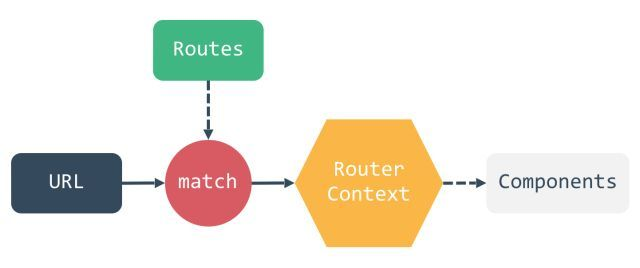

https://juejin.cn/post/6844903759458336776



# [实践系列] 前端路由

### 什么是路由?

> 路由这概念最开始是在后端出现的,在以前前后端不分离的时候,由后端来控制路由,服务器接收客户端的请求,解析对应的url路径,并返回对应的页面/资源。

> 简单的说 路由就是根据不同的url地址来展示不同的内容或页面.

### 前端路由的来源

> 在很久很久以前~ 用户的每次更新操作都需要重新刷新页面,非常的影响交互体验,后来,为了解决这个问题,便有了Ajax(异步加载方案),Ajax给体验带来了极大的提升。

> 虽然Ajax解决了用户交互时体验的痛点,但是多页面之间的跳转一样会有不好的体验,所以便有了spa(single-page application)使用的诞生。而spa应用便是基于前端路由实现的,所以便有了前端路由。

> 如今比较火的vue-router/react-router 也是基于前端路由的原理实现的~

### 前端路由的两种实现原理

#### 1.Hash模式

> window对象提供了onhashchange事件来监听hash值的改变,一旦url中的hash值发生改变,便会触发该事件。

```
window.onhashchange = function(){
    
    // hash 值改变 
    
    // do you want
}
复制代码
```

#### 2.History 模式

> HTML5的History API 为浏览器的全局history对象增加的扩展方法。

> 简单来说,history其实就是浏览器历史栈的一个接口。这里不细说history的每个API啦。具体可查阅 [传送门](https://developer.mozilla.org/en-US/docs/Web/API/History)

> window对象提供了onpopstate事件来监听历史栈的改变,一旦历史栈信息发生改变,便会触发该事件。

**需要特别注意的是,调用history.pushState()或history.replaceState()不会触发popstate事件。只有在做出浏览器动作时，才会触发该事件。**

```
window.onpopstate = function(){
    // 历史栈 信息改变
    // do you want
}

复制代码
```

> history提供了两个操作历史栈的API:history.pushState 和 history.replaceState

```
history.pushState(data[,title][,url]);//向历史记录中追加一条记录
复制代码
history.replaceState(data[,title][,url]);//替换当前页在历史记录中的信息。
复制代码
// data: 一个JavaScript对象，与用pushState()方法创建的新历史记录条目关联。无论何时用户导航到新创建的状态，popstate事件都会被触发，并且事件对象的state属性都包含历史记录条目的状态对象的拷贝。

//title: FireFox浏览器目前会忽略该参数，虽然以后可能会用上。考虑到未来可能会对该方法进行修改，传一个空字符串会比较安全。或者，你也可以传入一个简短的标题，标明将要进入的状态。

//url: 新的历史记录条目的地址。浏览器不会在调用pushState()方法后加载该地址，但之后，可能会试图加载，例如用户重启浏览器。新的URL不一定是绝对路径；如果是相对路径，它将以当前URL为基准；传入的URL与当前URL应该是同源的，否则，pushState()会抛出异常。该参数是可选的；不指定的话则为文档当前URL。
复制代码
```

### 两种模式优劣对比

| 对比     | Hash         | History    |
| -------- | ------------ | ---------- |
| 观赏性   | 丑           | 美         |
| 兼容性   | >ie8         | >ie10      |
| 实用性   | 直接使用     | 需后端配合 |
| 命名空间 | 同一document | 同源       |

### 造(cao) 一个简单的前端路由

> 本demo只是想说帮助我们通过实践更进一步的理解前端路由这个概念,所以只做了简单的实现~

#### history模式404

> 当我们使用history模式时，如果没有进行配置,刷新页面会出现404。

> 原因是因为history模式的url是真实的url,服务器会对url的文件路径进行资源查找,找不到资源就会返回404。

> 这个问题的解决方案这里就不细说了，google一下,你就知道～ 我们在以下demo使用webpack-dev-server的里的historyApiFallback属性来支持HTML5 History Mode。

#### 文件结构

```
|-- package.json
|-- webpack.config.js
|-- index.html
|-- src
    |-- index.js
    |-- routeList.js
    |-- base.js
    |-- hash.js
    |-- history.js
复制代码
```

#### 1.搭建环境

废话不多说，直接上代码～

**package.json**

```
{
  "name": "web_router",
  "version": "1.0.0",
  "description": "",
  "main": "index.js",
  "scripts": {
    "dev": "webpack-dev-server --config ./webpack.config.js"
  },
  "author": "webfansplz",
  "license": "MIT",
  "devDependencies": {
    "html-webpack-plugin": "^3.2.0",
    "webpack": "^4.28.1",
    "webpack-cli": "^3.2.1",
    "webpack-dev-server": "^3.1.14"
  }
}

复制代码
```

**webpack.config.js**

```
'use strict';

const path = require('path');

const webpack = require('webpack');

const HtmlWebpackPlugin = require('html-webpack-plugin');

module.exports = {
  mode: 'development',
  entry: './src/index.js',
  output: {
    filename: '[name].js'
  },
  devServer: {
    clientLogLevel: 'warning',
    hot: true,
    inline: true,
    open: true,
    //在开发单页应用时非常有用，它依赖于HTML5 history API，如果设置为true，所有的跳转将指向index.html (解决histroy mode 404)
    historyApiFallback: true,
    host: 'localhost',
    port: '6789',
    compress: true
  },
  plugins: [
    new webpack.HotModuleReplacementPlugin(),
    new HtmlWebpackPlugin({
      filename: 'index.html',
      template: 'index.html',
      inject: true
    })
  ]
};

复制代码
```

### 2.开撸

首先我们先初始化定义我们需要实现的功能及配置参数。

| 前端路由 | 参数                | 方法          |
| -------- | ------------------- | ------------- |
| -        | 模式(mode)          | push(压入)    |
| -        | 路由列表(routeList) | replace(替换) |
| -        | -                   | go(前进/后退) |

#### src/index.js

```
const MODE='';

const ROUTELIST=[];

class WebRouter {
  constructor() {
    
  }
  push(path) {
  
   ...
  }
  replace(path) {
  
   ...
    
  }
  go(num) {
  
   ...
    
  }
}

new WebRouter({
  mode: MODE,
  routeList: ROUTELIST
});

复制代码
```

前面我们说了前端路由有两种实现方式。

1.定义路由列表

2.我们分别为这两种方式创建对应的类,并根据不同的mode参数进行实例化,完成webRouter类的实现。

#### src/routeList.js

```
export const ROUTELIST = [
  {
    path: '/',
    name: 'index',
    component: 'This is index page'
  },
  {
    path: '/hash',
    name: 'hash',
    component: 'This is hash page'
  },
  {
    path: '/history',
    name: 'history',
    component: 'This is history page'
  },
  {
    path: '*',
    name: 'notFound',
    component: '404 NOT FOUND'
  }
];

复制代码
```

#### src/hash.js

```
export class HashRouter{
    
}
复制代码
```

#### src/history.js

```
export class HistoryRouter{
    
}
复制代码
```

#### src/index.js

```
import { HashRouter } from './hash';
import { HistoryRouter } from './history';
import { ROUTELIST } from './routeList';
//路由模式
const MODE = 'hash';  

class WebRouter {
  constructor({ mode = 'hash', routeList }) {
    this.router = mode === 'hash' ? new HashRouter(routeList) : new HistoryRouter(routeList);
  }
  push(path) {
    this.router.push(path);
  }
  replace(path) {
    this.router.replace(path);
  }
  go(num) {
    this.router.go(num);
  }
}

const webRouter = new WebRouter({
  mode: MODE,
  routeList: ROUTELIST
});

复制代码
```

前面我们已经实现了webRouter的功能,接下来我们来实现两种方式。

因为两种模式都需要调用一个方法来实现不同路由内容的刷新,so~

#### index.html

```
<!DOCTYPE html>
<html lang="en">
  <head>
    <meta charset="UTF-8" />
    <meta name="viewport" content="width=device-width, initial-scale=1.0" />
    <meta http-equiv="X-UA-Compatible" content="ie=edge" />
    <title>前端路由</title>
  </head>
  <body>
    <div id="page"></div>
  </body>
</html>

复制代码
```

#### js/base.js

```
const ELEMENT = document.querySelector('#page');

export class BaseRouter {
 //list = 路由列表
  constructor(list) {
    this.list = list;
  }
  render(state) {
   //匹配当前的路由,匹配不到则使用404配置内容 并渲染~
    let ele = this.list.find(ele => ele.path === state);
    ele = ele ? ele : this.list.find(ele => ele.path === '*');
    ELEMENT.innerText = ele.component;
  }
}

复制代码
```

ok,下面我们来实现两种模式。

**Hash模式**

#### src/hash.js

```
import { BaseRouter } from './base.js'; 

export class HashRouter extends BaseRouter {
  constructor(list) {
    super(list);
    this.handler();
    //监听hash变化事件,hash变化重新渲染  
    window.addEventListener('hashchange', e => {
      this.handler();
    });
  }
  //渲染
  handler() {
    this.render(this.getState());
  }
  //获取当前hash
  getState() {
    const hash = window.location.hash;
    return hash ? hash.slice(1) : '/';
  }
  //获取完整url
  getUrl(path) {
    const href = window.location.href;
    const i = href.indexOf('#');
    const base = i >= 0 ? href.slice(0, i) : href;
    return `${base}#${path}`;
  }
  //改变hash值 实现压入 功能
  push(path) {
    window.location.hash = path;
  }
  //使用location.replace实现替换 功能 
  replace(path) {
    window.location.replace(this.getUrl(path));
  }
  //这里使用history模式的go方法进行模拟 前进/后退 功能
  go(n) {
    window.history.go(n);
  }
}

复制代码
```

**History模式**

#### src/history.js

```
import { BaseRouter } from './base.js';

export class HistoryRouter extends BaseRouter {
  constructor(list) {
    super(list);
    this.handler();
    //监听历史栈信息变化,变化时重新渲染
    window.addEventListener('popstate', e => {
      this.handler();
    });
  }
  //渲染
  handler() {
    this.render(this.getState());
  }
  //获取路由路径
  getState() {
    const path = window.location.pathname;
    return path ? path : '/';
  }
  //使用pushState方法实现压入功能
  //PushState不会触发popstate事件,所以需要手动调用渲染函数
  push(path) {
    history.pushState(null, null, path);
    this.handler();
  }
  //使用replaceState实现替换功能  
  //replaceState不会触发popstate事件,所以需要手动调用渲染函数
  replace(path) {
    history.replaceState(null, null, path);
    this.handler();
  }
  go(n) {
    window.history.go(n);
  }
}

复制代码
```

### 3.小功告成

就这样,一个简单的前端路由就完成拉。

[源码地址](https://github.com/webfansplz/article/tree/master/webRouter)

如果觉得有帮助到你的话,给个star哈~