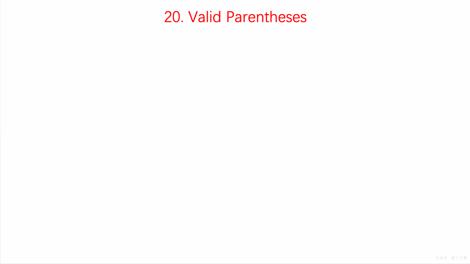

## 几道和「堆栈、队列」有关的面试算法题

原创 程序员吴师兄 [五分钟学算法](javascript:void(0);) *2019-03-05*


### 题目一：有效的括号

#### 问题描述

给定一个只包括 '('，')'，'{'，'}'，'['，']' 的字符串，判断字符串是否有效。

#### 解题思路

这道题让我们验证输入的字符串是否为括号字符串，包括大括号，中括号和小括号。

这里我们使用**栈**。

- 遍历输入字符串
- 如果当前字符为左半边括号时，则将其压入栈中
- 如果遇到右半边括号时，**分类讨论：**
- 1）如栈不为空且为对应的左半边括号，则取出栈顶元素，继续循环  
- 2）若此时栈为空，则直接返回 false
- 3）若不为对应的左半边括号，反之返回 false

#### 动画演示




#### 代码实现

```
class Solution {
    public boolean isValid(String s) {
        Stack<Character> stack = new Stack<>();
        char[] chars = s.toCharArray();
        for (char aChar : chars) {
            if (stack.size() == 0) {
                stack.push(aChar);
            } else if (isSym(stack.peek(), aChar)) {
                stack.pop();
            } else {
                stack.push(aChar);
            }
        }
        return stack.size() == 0;
    }

    private boolean isSym(char c1, char c2) {
        return (c1 == '(' && c2 == ')') || (c1 == '[' && c2 == ']') || (c1 == '{' && c2 == '}');
    }
}
```

### 题目二：用两个栈实现队列

#### 问题描述

用两个栈来实现一个队列，完成队列的 Push 和 Pop 操作。

#### 解题思路

in 栈用来处理入栈（push）操作，out 栈用来处理出栈（pop）操作。一个元素进入 in 栈之后，出栈的顺序被反转。当元素要出栈时，需要先进入 out 栈，此时元素出栈顺序再一次被反转，因此出栈顺序就和最开始入栈顺序是相同的，先进入的元素先退出，这就是队列的顺序。

- push 元素时，始终是进入栈，pop 和 peek 元素时始终是走出栈。
- pop 和 peek 操作，如果出栈为空，则需要从入栈将所有元素移到出栈，也就是调换顺序，比如开始push的顺序是 3-2-1，1 是最先进入的元素，则到出栈的顺序是 1-2-3，那 pop 操作拿到的就是 1，满足了先进先出的特点。
- pop 和 peek 操作，如果出栈不为空，则不需要从入栈中移到数据到出栈。

动画 1

#### 代码实现

```
Stack<Integer> in = new Stack<Integer>();
Stack<Integer> out = new Stack<Integer>();

public void push(int node) {
    in.push(node);
}

public int pop() throws Exception {
    if (out.isEmpty())
        while (!in.isEmpty())
            out.push(in.pop());

    if (out.isEmpty())
        throw new Exception("queue is empty");

    return out.pop();
}
```

### 题目三：栈的压入、弹出序列

#### 问题描述

输入两个整数序列，第一个序列表示栈的压入顺序，请判断第二个序列是否为该栈的弹出顺序。假设压入栈的所有数字均不相等。例如序列 1，2，3，4，5 是某栈的压入顺序，序列 4，5，3，2，1是该压栈序列对应的一个弹出序列，但4，3，5，1，2就不可能是该压栈序列的弹出序列。（注意：这两个序列的长度是相等的）

#### 解题思路

借用一个辅助的栈，遍历压栈顺序，先讲第一个放入栈中，这里是 1，然后判断栈顶元素是不是出栈顺序的第一个元素，这里是 4，很显然 1≠4 ，所以需要继续压栈，直到相等以后开始出栈。

出栈一个元素，则将出栈顺序向后移动一位，直到不相等，这样循环等压栈顺序遍历完成，如果辅助栈还不为空，说明弹出序列不是该栈的弹出顺序。

#### 代码实现

```
public boolean IsPopOrder(int[] pushSequence, int[] popSequence) {
    int n = pushSequence.length;
    Stack<Integer> stack = new Stack<>();
    for (int pushIndex = 0, popIndex = 0; pushIndex < n; pushIndex++) {
        stack.push(pushSequence[pushIndex]);
        while (popIndex < n && !stack.isEmpty() 
                && stack.peek() == popSequence[popIndex]) {
            stack.pop();
            popIndex++;
        }
    }
    return stack.isEmpty();
}
```

### 题目四：包含 min 函数的栈

#### 问题描述

定义栈的数据结构，请在该类型中实现一个能够得到栈最小元素的 min 函数。

#### 解题思路

使用两个 stack，一个作为数据栈，另一个作为辅助栈。其中 **数据栈** 用于存储所有数据，而 **辅助栈** 用于存储最小值。

举个🌰：

1. 入栈的时候：首先往空的数据栈里压入数字 3 ，此时 3 是最小值，所以把最小值压入辅助栈。接下来往数据栈里压入数字 4 。由于 4 大于之前的最小值，因此只要入数据栈，不需要压入辅助栈。
2. 出栈的时候：当数据栈和辅助栈的栈顶元素相同的时候，辅助栈的栈顶元素出栈。否则，数据栈的栈顶元素出栈。
3. 获得栈顶元素的时候：直接返回数据栈的栈顶元素。
4. 栈最小元素：直接返回辅助栈的栈顶元素。

#### 代码实现

```
private Stack<Integer> dataStack = new Stack<>();
private Stack<Integer> minStack = new Stack<>();

public void push(int node) {
    dataStack.push(node);
    minStack.push(minStack.isEmpty() ? node : Math.min(minStack.peek(), node));
}

public void pop() {
    dataStack.pop();
    minStack.pop();
}

public int top() {
    return dataStack.peek();
}

public int min() {
    return minStack.peek();
}
```

### 小程序

上面的几道题有一些是来自于《剑指offer》，本文提供的解题代码都是 **Java** 的，为了让更多的小伙伴能更加轻松的看懂文章，我专门制作了一个小程序 「**图解剑指offer**」，里面目前配备了 **Java**，**C++**，**Python** 三种编程语言的解题代码，更多其他方面的编程语言小吴正在添加中，敬请关注~