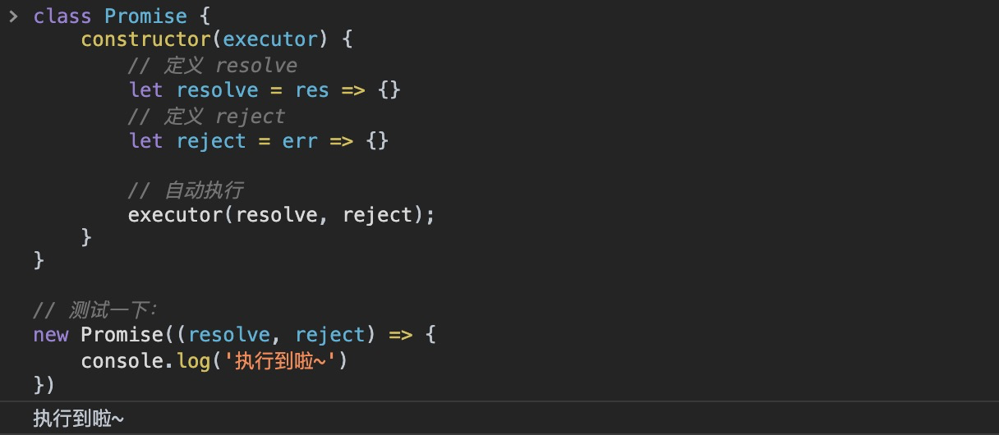
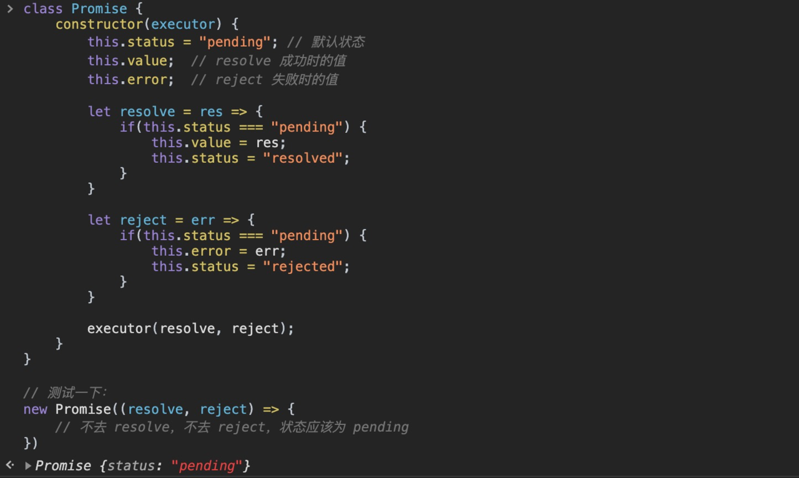
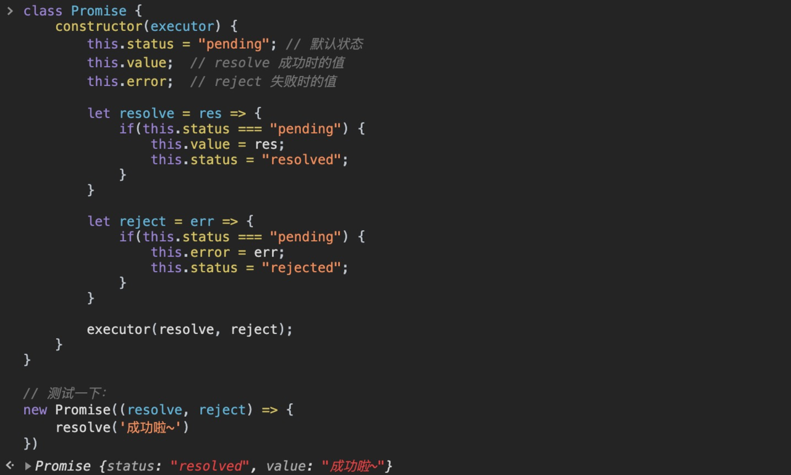
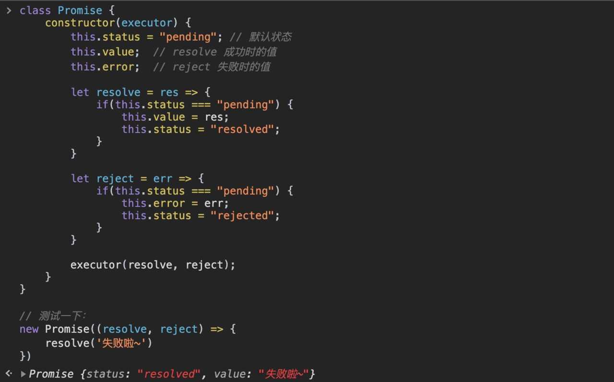
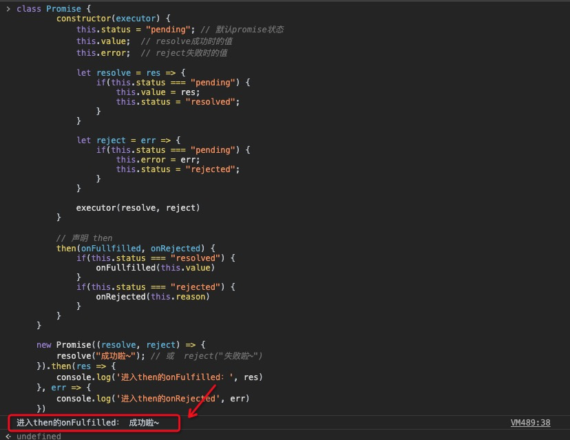
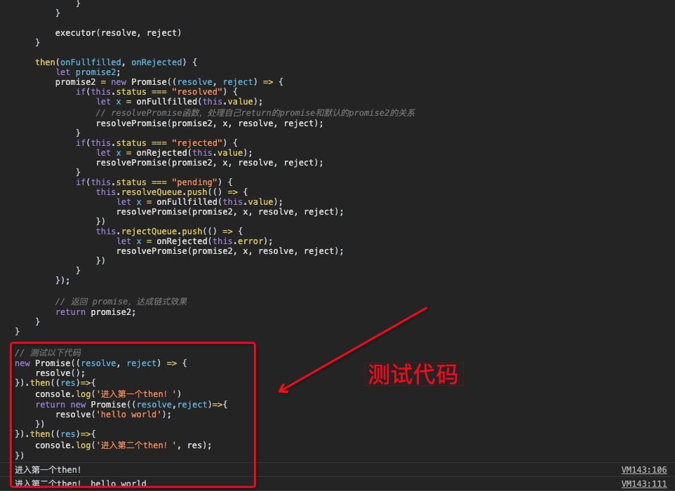

# 手撕 Promise

https://juejin.cn/post/6845166891061739528

## 前言

理解一个东西最好的办法之一就是动手自己写，So，他（Promise）来了。废话不多说，来看如何实现。

> “五岳归来不看山，黄山归来不看岳。”希望看完这篇，你就不用再去看其他 Promise 的实现原理了。

## Promise 解析

先来看`Promise`用法：

```
new Promise((resolve, reject) => {
    resolve('hello'); // or reject('hello')
})
 .then(res => {})
 .catch(err => {})
 
 -----------分割线
// 分解一下，也就是下面这样
let executor = (resolve, reject) => {
    resolve('hello'); // or reject('hello')
}

 new Promise(executor)
 .then(res => {})
 .catch(err => {})
复制代码
```

我们来分析一下他有哪些**功能/特性**：

-  1、构造函数里传一个函数的两个参数（resolve, reject）

-  2、resolve 成功时执行的回调

-  3、reject 失败时执行的回调

-  

  4、三种状态

  - pending [待定] 初始状态
  - fulfilled [实现] 操作成功
  - rejected [被否决] 操作失败

-  5、Promise 对象方法 then

-  6、异步实现

-  7、onFulfilled 和 onRejected 的异步调用

-  8、值穿透

-  9、Promise 对象方法 catch

-  10、Promise 对象方法 all

-  11、Promise 对象方法 race

-  12、Promise 对象方法 resolve

-  13、Promise 对象方法 reject

-  13、Promise 对象方法 allSettled（上个月 **TC39** 出来的新特性）

接下来，我们要一一撕下他的伪装，揭开他的真面目。

## Promise 的基本结构实现

基于上面分析结果，我们先来实现前面三个功能：

-  1、构造函数里传一个函数的两个参数（resolve, reject）
-  2、resolve 成功时执行的回调
-  3、reject 失败时执行的回调

```
class Promise {
    constructor(executor) {
        // 定义 resolve
        let resolve = res => {}
        // 定义 reject
        let reject = err => {}

        // 自动执行
        executor(resolve, reject);
    }
}

// 测试一下：
new Promise((resolve, reject) => {
    console.log('执行到啦~')
})
复制代码
```

可以将上面代码复制到控制台执行，查看效果：





## Promise 三种状态实现

Ok，fine，接下来，我们来实现她的三种状态。

-  

  4、三种状态

  - pending [待定] 初始状态
  - fulfilled [实现] 操作成功
  - rejected [被否决] 操作失败

promise 状态有如下特点:
1.promise 对象初始化状态为 pending

2.当调用resolve(成功)，会由pending => fulfilled

3.当调用reject(失败)，会由pending => rejected

> Promsie 状态 只能由 pending => fulfilled/rejected, 一旦修改就不能再变

```
class Promise {
    constructor(executor) {
        this.status = "pending"; // 默认状态
        this.value;  // resolve 成功时的值
        this.error;  // reject 失败时的值

        let resolve = res => {
            if(this.status === "pending") {
                this.value = res;
                this.status = "resolved";
            }
        }

        let reject = err => {
            if(this.status === "pending") {
                this.error = err;
                this.status = "rejected";
            }
        }

        executor(resolve, reject);
    }
}
复制代码
```

### 1）pending [待定] 初始状态

测试一下，如果不去resolve，也不去reject

```
// 测试一下：
new Promise((resolve, reject) => {
    
})
复制代码
```

那么Promise应该是初始状态。我们将上面代码执行测试一下，得到结果如下：



此时状态是：`{status: "pending"}`。


### 2）fulfilled [实现] 操作成功

当我们执行 `resolve`

```
// 测试一下：
new Promise((resolve, reject) => {
   resolve('成功啦~'); 
})
复制代码
```

将得到结果如下：




### 3）rejected [被否决] 操作失败

当执行 `reject`

```
// 测试一下：
new Promise((resolve, reject) => {
    resolve('失败啦~')
})
复制代码
```





## Promise 对象方法 then 实现

-  5、Promise 对象方法 then

Promise 这个对象有 then 方法，还是先来分析，then 有什么？

### then 接受两个回调

```
promise.then(onFulfilled, onRejected); // 这里假设 promise 继承于 Promise 类
复制代码
```

我们继续在前面 Promise 类中书写 then 方法：

```
class Promise {
        constructor(executor) {
            this.status = "pending"; // 默认promise状态
            this.value;  // resolve成功时的值
            this.error;  // reject失败时的值

            let resolve = res => {
                if(this.status === "pending") {
                    this.value = res;
                    this.status = "resolved";
                }
            }

            let reject = err => {
                if(this.status === "pending") {
                    this.error = err;
                    this.status = "rejected";
                }
            }

            executor(resolve, reject)
        }

        // 声明 then
        then(onFullfilled, onRejected) {
            if(this.status === "resolved") {
                onFullfilled(this.value)
            }
            if(this.status === "rejected") {
                onRejected(this.error)
            }
        }
    }
复制代码
```

测试一下：

```
new Promise((resolve, reject) => {
        resolve("成功啦~"); // 或  reject("失败啦~")
    })
    .then(res => {
        console.log(res);
    }, err => {
        console.log(err);
    })
复制代码
```

得到结果：




## 异步实现

-  6、异步实现

至此，基本实现简单的同步代码，但是当 resolve 在 `setTimeout` 内执行，then 时 state 还是 pending 等待状态。我们就需要在 then 调用的时候，将成功和失败存到各自的数组，一旦 reject 或者 resolve，就调用它们。

类似于**分布订阅**，先将 then 内的两个函数存储，由于 promise 可以有多个 then，所以存在同一个数组内。当成功或失败的时候用 forEach 调用他们。

```
class Promise {
        constructor(executor) {
            this.status = "pending"; // 默认promise状态
            this.value;  // resolve成功时的值
            this.error;  // reject失败时的值
+           this.resolveQueue = []; // 成功存放的数组
+           this.rejectQueue = []; // 失败存放法数组

            let resolve = value => {
                if(this.status === "pending") {
                    this.value = value;
                    this.status = "resolved";
                    // 一旦resolve执行，调用成功数组的函数
+                   this.resolveQueue.forEach(fn => fn());
                }
            }

            let reject = value => {
                if(this.status === "pending") {
                    this.error = value;
                    this.status = "rejected";
                }
                // 一旦reject执行，调用失败数组的函数
+               this.rejectQueue.forEach(fn => fn());
            }

            executor(resolve, reject)
        }
        
        // 执行到then的时候
        then(onFullfilled, onRejected) {
            if(this.status === "resolved") {
                this.resolveQueue.push(() => {
                    onFullfilled(this.value);
                })
            }
            if(this.status === "rejected") {
                this.rejectQueue.push(() => {
                    onRejected(this.error);
                })
            }
            // 当状态state为pending时
+           if(this.status === "pending") {
                // onFulfilled传入到成功数组
+               this.resolveQueue.push(() => {
+                   onFullfilled(this.value);
+              })
                // onRejected传入到失败数组
+               this.rejectQueue.push(() => {
+                   onRejected(this.error);
+               })
+           }
        }
    }
复制代码
```

## then 的链式调用

-  7、then 的链式调用

我们常常用到`new Promise().then().then()`这样的写法，这就是链式调用，原来是用于解决地狱回调的。那么如何去实现呢？ 为了达到这个效果，我们可以再第一个 then 函数内再返回一个 `Promise`，让这个新的 `Promise` 返回的值传递到下一个 then 中。

一句话总结：

> 通过在 then 中 return 一个新的 `Promise`，从而实现 then 的链式调用！

代码如下：

```
class Promise {
    constructor(executor) {
        this.status = "pending"; // 默认promise状态
        this.value;  // resolve 成功时的值
        this.error;  // reject 失败时的值
        this.resolveQueue = []; // 成功时回调队列
        this.rejectQueue = []; // 失败时回调队列

        let resolve = value => {
            if(this.status === "pending") {
                this.value = value;
                this.status = "resolved";
                this.resolveQueue.forEach(fn => fn())
            }
        }

        let reject = value => {
            if(this.status === "pending") {
                this.error = value;
                this.status = "rejected";
                this.rejectQueue.forEach(fn => fn())
            }
        }

        executor(resolve, reject)
    }

    then(onFullfilled, onRejected) {
        let promise2;
        if(this.status === "resolved") {
            promise2 = new Promise((resolve, reject) => {
                let x = onFullfilled(this.value);
                resolvePromise(promise2, x, resolve, reject);
            })
        }
        if(this.status === "rejected") {
            promise2 = new Promise((resolve, reject) => {
                let x = onRejected(this.value);
                resolvePromise(promise2, x, resolve, reject);
            })
        }
        if(this.status === "pending") {
            promise2 = new Promise((resolve, reject) => {
                this.resolveQueue.push(() => {
                    let x = onFullfilled(this.value);
                    resolvePromise(promise2, x, resolve, reject);
                })
                this.rejectQueue.push(() => {
                    let x = onRejected(this.error);
                    resolvePromise(promise2, x, resolve, reject);
                })
            })
        }

        return promise2;
    }
}

-------------------分割线
// 将上面代码整理一下
class Promise {
    constructor(executor) {
        this.status = "pending"; // 默认promise状态
        this.value;  // resolve成功时的值
        this.error;  // reject失败时的值
        this.resolveQueue = []; // 成功时回调队列
        this.rejectQueue = []; // 失败时回调队列

        let resolve = value => {
            if(this.status === "pending") {
                this.value = value;
                this.status = "resolved";
                this.resolveQueue.forEach(fn => fn())
            }
        }

        let reject = value => {
            if(this.status === "pending") {
                this.error = value;
                this.status = "rejected";
                this.rejectQueue.forEach(fn => fn())
            }
        }

        executor(resolve, reject)
    }

    then(onFullfilled, onRejected) {
        let promise2;
        promise2 = new Promise((resolve, reject) => {
            if(this.status === "resolved") {
                let x = onFullfilled(this.value);
                // resolvePromise函数，处理自己return的promise和默认的promise2的关系
                resolvePromise(promise2, x, resolve, reject);
            }
            if(this.status === "rejected") {
                let x = onRejected(this.value);
                resolvePromise(promise2, x, resolve, reject);
            }
            if(this.status === "pending") {
                this.resolveQueue.push(() => {
                    let x = onFullfilled(this.value);
                    resolvePromise(promise2, x, resolve, reject);
                })
                this.rejectQueue.push(() => {
                    let x = onRejected(this.error);
                    resolvePromise(promise2, x, resolve, reject);
                })
            }
        });
        
        // 返回 promise，达成链式效果
        return promise2;
    }
}
复制代码
```

最后，我们来完成上面的 resolvePromise 函数，我们暂且将第一个 then 返回的值成为 x，在这个函数中，我们需要去判断 x 是不是 promise（这里是重点！）：

- 是：则取他的结果，作为新的 promise2 成功的结果
- 不是：直接作为新的 promise2 成功的结果

resolvePromise 代码如下：

```
/**
 * 处理promise递归的函数
 *
 * promise2 {Promise} 默认返回的promise
 * x {*} 我们自己 return 的对象
 * resolve
 * reject
 */
 function resolvePromise(promise2, x, resolve, reject){
  
  // 循环引用报错
  if(x === promise2){
    // reject 报错抛出
    return reject(new TypeError('Chaining cycle detected for promise'));
  }
  
  // 锁，防止多次调用
  let called;
  
  // x 不是 null 且 x 是对象或者函数
  if (x != null && (typeof x === 'object' || typeof x === 'function')) {
    try {
      // A+ 规定，声明then = x的then方法
      let then = x.then;
      
      // 如果then是函数，就默认是promise了
      if (typeof then === 'function') { 
        // then 执行 第一个参数是 this 后面是成功的回调 和 失败的回调
        then.call(x, y => {
          // 成功和失败只能调用一个
          if (called) return;
          called = true;
          
          // 核心点2：resolve 的结果依旧是 promise 那就继续递归执行
          // 核心点2：resolve 的结果依旧是 promise 那就继续递归执行
          // 核心点2：resolve 的结果依旧是 promise 那就继续递归执行
          resolvePromise(promise2, y, resolve, reject);
        }, err => {
          // 成功和失败只能调用一个
          if (called) return;
          called = true;
          reject(err);// 失败了就失败了
        })
      } else {
        resolve(x); // 直接成功即可
      }
    } catch (e) { // 走到 catch 也属于失败
      if (called) return;
      called = true;
      // 取then出错了那就不要在继续执行了
      reject(e); 
    }
  } else {
    resolve(x);
  }
}
复制代码
```

### then 链式调用测试

完整测试代码如下，可以复制进浏览器控制台执行下：

```
function resolvePromise(promise2, x, resolve, reject){
    // 循环引用报错
    if(x === promise2){
      // reject 报错抛出
      return reject(new TypeError('Chaining cycle detected for promise'));
    }
    // 锁，防止多次调用
    let called;
    
    // x不是null 且x是对象或者函数
    if (x != null && (typeof x === 'object' || typeof x === 'function')) {
      try {
        // A+ 规定，声明then = x的then方法
        let then = x.then;
        // 如果then是函数，就默认是promise了
        if (typeof then === 'function') { 
          // 就让then执行 第一个参数是this   后面是成功的回调 和 失败的回调
          then.call(x, y => {
            // 成功和失败只能调用一个
            if (called) return;
            called = true;
            // resolve的结果依旧是promise 那就继续递归执行
            resolvePromise(promise2, y, resolve, reject);
          }, err => {
            // 成功和失败只能调用一个
            if (called) return;
            called = true;
            reject(err);// 失败了就失败了
          })
        } else {
          resolve(x); // 直接成功即可
        }
      } catch (e) {
        // 也属于失败
        if (called) return;
        called = true;
        // 取then出错了那就不要在继续执行了
        reject(e); 
      }
    } else {
      resolve(x);
    }
  }


class Promise {
    constructor(executor) {
        this.status = "pending"; // 默认promise状态
        this.value;  // resolve成功时的值
        this.error;  // reject失败时的值
        this.resolveQueue = []; // 成功时回调队列
        this.rejectQueue = []; // 失败时回调队列

        let resolve = value => {
            if(this.status === "pending") {
                this.value = value;
                this.status = "resolved";
                this.resolveQueue.forEach(fn => fn())
            }
        }

        let reject = value => {
            if(this.status === "pending") {
                this.error = value;
                this.status = "rejected";
                this.rejectQueue.forEach(fn => fn())
            }
        }

        executor(resolve, reject)
    }

    then(onFullfilled, onRejected) {
        let promise2;
        promise2 = new Promise((resolve, reject) => {
            if(this.status === "resolved") {
                let x = onFullfilled(this.value);
                // resolvePromise函数，处理自己return的promise和默认的promise2的关系
                resolvePromise(promise2, x, resolve, reject);
            }
            if(this.status === "rejected") {
                let x = onRejected(this.value);
                resolvePromise(promise2, x, resolve, reject);
            }
            if(this.status === "pending") {
                this.resolveQueue.push(() => {
                    let x = onFullfilled(this.value);
                    resolvePromise(promise2, x, resolve, reject);
                })
                this.rejectQueue.push(() => {
                    let x = onRejected(this.error);
                    resolvePromise(promise2, x, resolve, reject);
                })
            }
        });
        
        // 返回 promise，达成链式效果
        return promise2;
    }
}

// 测试以下代码
new Promise((resolve, reject) => {
    resolve();
}).then((res)=>{
    console.log('进入第一个then！')
    return new Promise((resolve,reject)=>{
        resolve('hello world');
    })
}).then((res)=>{
    console.log('进入第二个then！', res);
})
复制代码
```




ok，我们实现了 then 的链式调用，这也是实现 Promise 中的重难点！


## onFulfilled 和 onRejected 的异步调用

-  8、onFulfilled 和 onRejected 的异步调用

核心思路：

> 用setTimeout解决异步问题

代码如下：

```
class Promise {
    constructor(executor) {
        this.status = "pending"; // 默认promise状态
        this.value;  // resolve成功时的值
        this.error;  // reject失败时的值
        this.resolveQueue = []; // 成功时回调队列
        this.rejectQueue = []; // 失败时回调队列

        let resolve = value => {
            if(this.status === "pending") {
                this.value = value;
                this.status = "resolved";
                this.resolveQueue.forEach(fn => fn())
            }
        }

        let reject = value => {
            if(this.status === "pending") {
                this.error = value;
                this.status = "rejected";
                this.rejectQueue.forEach(fn => fn())
            }
        }

        executor(resolve, reject)
    }

    then(onFullfilled, onRejected) {
        let promise2;
        promise2 = new Promise((resolve, reject) => {
            if(this.status === "resolved") {
                // 异步
+               setTimeout(() => {
                    let x = onFullfilled(this.value);
                    // resolvePromise函数，处理自己return的promise和默认的promise2的关系
                    resolvePromise(promise2, x, resolve, reject);
+               }, 0)
            }
            if(this.status === "rejected") {
                // 异步
+               setTimeout(() => {
                    let x = onRejected(this.value);
                    resolvePromise(promise2, x, resolve, reject);
+               }, 0)
            }
            if(this.status === "pending") {
                this.resolveQueue.push(() => {
                    // 异步
+                   setTimeout(() => {
                        let x = onFullfilled(this.value);
                        resolvePromise(promise2, x, resolve, reject);
+                   }, 0)
                })
                this.rejectQueue.push(() => {
                    // 异步
+                   setTimeout(() => {
                        let x = onRejected(this.error);
                        resolvePromise(promise2, x, resolve, reject);
+                   }, 0)
                })
            }
        });
        
        // 返回 promise，达成链式效果
        return promise2;
    }
}
复制代码
```

## 值穿透调用

-  9、值穿透

```
new Promise((resolve, reject)=>{
    resolve('YoYo');
}).then().then().then().then().then().then().then((res)=>{ 
    console.log(res);
})
复制代码
```

当执行上面多个 then，我们期望最后那个 then 打印出 'YoYo'。

实现很简单：**onFulfilled 如果不是函数，就忽略 onFulfilled，直接返回 value!**

相应的，我们也要处理下没有 onRejected 的情况：**onRejected 如果不是函数，就忽略 onRejected，直接扔出错误!**

代码如下，在之前的 Promise 类的 then 加入：

```
then(onFulfilled, onRejected) {
    onFulfilled = typeof onFulfilled === 'function' ? onFulfilled : value => value;
    onRejected = typeof onRejected === 'function' ? onRejected : err => { throw err;}
    
    <!--... 省略-->
}
复制代码
```

## Promise 对象方法 catch

-  10、Promise 对象方法 catch

核心思路：

> catch 是失败的回调，相当于执行 this.then(null,fn)

```
class Promise {
        constructor(executor) {
           <!--... 省略-->
        }

        then(onFullfilled, onRejected) {
            <!--... 省略-->
        }
        
+       catch(onRejected) {
+           return this.then(null, onRejected)
+       }
    }
复制代码
```

此外，我们还需要对其他几个函数外使用 try/catch 去做异常捕获，这里不展开，理解即可（本文最后源码中会展示）。

## Promise 对象方法 all

-  10、Promise 对象方法 all

**这是一道经典面试题！**

`Promise.all()` 接收一个数组作为参数，该方法返回一个 `Promise` 实例，此实例在 iterable 参数内所有的 promise 都“完成（resolved）”或参数中不包含 promise 时回调完成（resolve）；如果参数中 promise 有一个失败（rejected），此实例回调失败（reject），失败的原因是第一个失败 promise 的结果。

用法如下：

```
var p1 = Promise.resolve(3);
var p2 = 1337;
var p3 = new Promise((resolve, reject) => {
  setTimeout(resolve, 100, 'foo');
}); 

Promise.all([p1, p2, p3]).then(values => { 
  console.log(values); // [3, 1337, "foo"] 
});
复制代码
```

接下来看看如何实现： 下面手写的，没有测试，回头补充！下班先~

```
Promise.all = function(promises) {
    let count = 0;
    let res = [];
    return new Promise((resolve, reject) => {
        for(let i = 0; i<promises.length; i++) {
            promises[i].then(res => {
                res.push(res);
                count++;
                if(count === promises.length) resolve(res);
            })
        }
    })
    .catch(err => {
        reject(err);
    })
}
复制代码
```

## Promise 对象方法 race

-  11、Promise 对象方法 race

Promise.race() 它同样接收一个promise对象组成的数组作为参数，并返回一个新的promise对象。一旦迭代器中的某个promise解决或拒绝，返回的 promise就会解决或拒绝。

```
Promise.race = function(promises) {
    return new Promise((resolve, reject) => {
        for(let i = 0; i<promises.length; i++) {
            promises[i].then(resolve, reject);
        }
    })
}
复制代码
```

## Promise 对象方法 resolve

-  12、Promise 对象方法 resolve

```
Promise.resolve = function(value) {
    return new Promise((resolve, reject) => {
        resolve(value);
    })
}
复制代码
```

## Promise 对象方法 reject

-  13、Promise 对象方法 reject

```
Promise.reject = function(value) {
    return new Promise((resolve, reject) => {
        reject(value);
    })
}
复制代码
```

## Promise 对象方法 allSettled

当课后作业吧，同学们自己写，可以放回复中哈~

Reference： [Promises/A+](https://promisesaplus.com/)