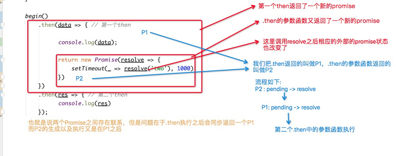

# [纯手写Promise，由浅入深](https://segmentfault.com/a/1190000020505870)

[**Yxaw**](https://segmentfault.com/u/yxaw)发布于 2019-09-26

在我的上一篇文章里着重介绍了async的相关知识,对promise的提及甚少,现在很多面试也都要求我们有手动造轮子的能力，所以本篇文章我会以手动实现一个promise的方式来发掘一下Promise的特点.

## 简单版Promise

首先我们应该知道Promise是通过构造函数的方式来创建的(new Promise( executor )),并且为 executor函数 传递参数:

```
function Promi(executor) {
  executor(resolve, reject);
  function resolve() {}
  function reject() {}
}
```

再来说一下Promise的三种状态: pending-等待, resolve-成功, reject-失败, 其中最开始为pending状态, 并且一旦成功或者失败, Promise的状态便不会再改变,所以根据这点:

```
function Promi(executor) {
  let _this = this;
  _this.$$status = 'pending';
  executor(resolve.bind(this), reject.bind(this));
  function resolve() {
    if (_this.$$status === 'pending') {
      _this.$$status = 'full'
    }
  }
  function reject() {
    if (_this.$$status === 'pending') {
      _this.$$status = 'fail'
    }
  }
}
```

其中status来记录Promise的状态,只有当promise的状态未pending时我们才会改变它的状态为'full'或者'fail', 因为我们在两个status函数中使用了this,显然使用的是Promise的一些属性,所以我们要绑定resolve与reject中的this为当前创建的Promise;
这样我们最最最基础的Promise就完成了(只有头部没有四肢...)

## Promise高级 --> .then

接着,所有的Promise实例都可以用.then方法,其中.then的两个参数,成功的回调和失败的回调也就是我们所说的resolve和reject:

```
function Promi(executor) {
    let _this = this;
  _this.$$status = 'pending';
  _this.failCallBack = undefined;
  _this.successCallback = undefined;
  _this.error = undefined;
  executor(resolve.bind(_this), reject.bind(_this));
  function resolve(params) {
    if (_this.$$status === 'pending') {
      _this.$$status = 'success'
      _this.successCallback(params)
    }
  }
  function reject(params) {
    if (_this.$$status === 'pending') {
      _this.$$status = 'fail'
      _this.failCallBack(params)
    }
  }
}

Promi.prototype.then = function(full, fail) {
  this.successCallback = full
  this.failCallBack = fail
};

// 测试代码
new Promi(function(res, rej) {
  setTimeout(_ => res('成功'), 30)
}).then(res => console.log(res))
```

讲一下这里：
可以看到我们增加了failCallBack和successCallback，用来储存我们在then中回调,刚才也说过,then中可传递一个成功和一个失败的回调,当P的状态变为resolve时执行成功回调,当P的状态变为reject或者出错时则执行失败的回调,但是具体执行结果的控制权没有在这里。但是我们知道一定会调用其中的一个。

executor任务成功了肯定有成功后的结果，失败了我们肯定也拿到失败的原因。所以我们可以通过params来传递这个结果或者error reason（当然这里的params也可以拆开赋给Promise实例）其实写到这里如果是面试题,基本上是通过了,也不会有人让你去完整地去实现

**error**:用来存储，传递reject信息以及错误信息

## Promise进阶

我想我们最迷恋的应该就是Promise的链式调用吧，因为它的出现最最最大的意义就是使我们的callback看起来不那么hell(因为我之前讲到了async比它更直接)，那么为什么then能链式调用呢？ **then一定返回了一个也具有then方法的对象**
我想大家应该都能猜到.then返回的也一定是一个promise,那么这里会有一个有趣的问题,就是.then中返回的到底是一个新promise的还是链式头部的调用者？？？？？

```
从代码上乍一看， Promise.then(...).catch(...) 像是针对最初的 Promise 对象进行了一连串的方法链调用。
```

然而实际上不管是 then 还是 catch 方法调用，都返回了一个新的promise对象。简单有力地证明一下

```
var beginPromise = new Promise(function (resolve) {
    resolve(100);
});
var thenPromise = beginPromise.then(function (value) {
    console.log(value);
});
var catchPromise = thenPromise.catch(function (error) {
    console.error(error);
});
console.log(beginPromise !== thenPromise); // => true
console.log(thenPromise !== catchPromise);// => true
```

**显而易见promise返回的是一个新的而非调用者**
不过这样的话难度就来了，我们看下面代码:

```
function begin() {
    return new Promise(resolve => {
      setTimeout(_ => resolve('first') , 2000)
    })
}

begin().then(data => {
  console.log(data)
  return new Promise(resolve => {

  })
}).then(res => {
  console.log(res)
});    
```

我们知道最后的then中函数参数永远都不会执行,为什么说它难呢，想一下,之所以能链式调用是因为.then()执行之后返回了一个新的promise,**一定注意，我说的新的promise是then()所返回而不是data => return new Promise....****(这只是then的一个参数)**,这样问题就来了,我们从刚才的情况看,知道只有第一个.then中的状态改变时第二个then中的函数参数才会执行,放到程序上说也就是需要第一个.then中返回的promise状态改变！即：

```
begin().then(data => {
  console.log(data)
  return new Promise(resolve => {
      setTimeout(_ => resolve('two'), 1000)
  })
}).then(res => {
  console.log(res)
});       
```

直接从代码的角度上讲,调用了第一个.then中的函数参数中的resolve之后第一个.then()返回的promise状态也改变了,这句话有些绕,我用一张图来讲：


那么问题就来了,我们如何使得P2的状态发生改变通知P1?
其实这里用观察者模式是可以的，但是代价有点大,换个角度想，其实我们直接让P2中的resolve等于P1中的resolve不就可以了?这样P2中调用了resolve之后同步的P1也相当于onresolve了，上代码:

```
function Promi(executor) {
    let _this = this;
    _this.$$status = 'pending';
    _this.failCallBack = undefined;
    _this.successCallback = undefined;
    _this.result = undefined;
    _this.error = undefined;
    setTimeout(_ => {
        executor(_this.resolve.bind(_this), _this.reject.bind(_this));
    })
}

Promi.prototype.then = function(full, fail) {
    let newPromi = new Promi(_ => {});
    this.successCallback = full;
    this.failCallBack = fail;
    this.successDefer = newPromi.resolve.bind(newPromi);
    this.failDefer = newPromi.reject.bind(newPromi);
    return newPromi
};

Promi.prototype.resolve = function(params) {
    let _this = this;
    if (_this.$$status === 'pending') {
        _this.$$status = 'success';
        if (!_this.successCallback) return;
        let result = _this.successCallback(params);
        if (result && result instanceof Promi) {
            result.then(_this.successDefer, _this.failDefer);
            return ''
        }
        _this.successDefer(result)
    }
}

Promi.prototype.reject = function(params) {
    let _this = this;
    if (_this.$$status === 'pending') {
        _this.$$status = 'fail';
        if (!_this.failCallBack) return;
        let result = _this.failCallBack(params);
        if (result && result instanceof Promi) {
            result.then(_this.successDefer, _this.failDefer);
            return ''
        }
        _this.successDefer(result)
    }
}

// 测试代码
new Promi(function(res, rej) {
    setTimeout(_ => res('成功'), 500)
}).then(res => {
    console.log(res);
    return '第一个.then成功'
}).then(res => {
    console.log(res);
    return new Promi(function(resolve) {
        setTimeout(_ => resolve('第二个.then成功'), 500)
    })
}).then(res => {
    console.log(res)
    return new Promi(function(resolve, reject) {
        setTimeout(_ => reject('第三个失败'), 1000)
    })
}).then(res => {res
    console.log(res)
}, rej => console.log(rej));
```

## **Promise完善**

其实做到这里我们还有好多好多没有完成,比如错误处理,reject处理,catch实现,.all实现,.race实现，其实原理也都差不多,(all和race以及resolve和reject其实返回的都是一个新的Promise),错误的传递?还有很多细节我们都没有考虑到,我这里写了一个还算是比较完善的:

```
function Promi(executor) {
    let _this = this;
    _this.$$status = 'pending';
    _this.failCallBack = undefined;
    _this.successCallback = undefined;
    _this.error = undefined;
    setTimeout(_ => {
        try {
            executor(_this.onResolve.bind(_this), _this.onReject.bind(_this))
        } catch (e) {
            _this.error = e;
            if (_this.callBackDefer && _this.callBackDefer.fail) {
                _this.callBackDefer.fail(e)
            } else if (_this._catch) {
                _this._catch(e)
            } else {
                throw new Error('un catch')
            }
        }
    })
}

Promi.prototype = {
    constructor: Promi,
    onResolve: function(params) {
        if (this.$$status === 'pending') {
            this.$$status = 'success';
            this.resolve(params)
        }
    },
    resolve: function(params) {
        let _this = this;
        let successCallback = _this.successCallback;
        if (successCallback) {
            _this.defer(successCallback.bind(_this, params));
        }
    },
    defer: function(callBack) {
        let _this = this;
        let result;
        let defer = _this.callBackDefer.success;
        if (_this.$$status === 'fail' && !_this.catchErrorFunc) {
            defer = _this.callBackDefer.fail;
        }
        try {
            result = callBack();
        } catch (e) {
            result = e;
            defer = _this.callBackDefer.fail;
        }
        if (result && result instanceof Promi) {
            result.then(_this.callBackDefer.success, _this.callBackDefer.fail);
            return '';
        }
        defer(result)
    },
    onReject: function(error) {
        if (this.$$status === 'pending') {
            this.$$status = 'fail';
            this.reject(error)
        }
    },
    reject: function(error) {
        let _this = this;
        _this.error = error;
        let failCallBack = _this.failCallBack;
        let _catch = _this._catch;
        if (failCallBack) {
            _this.defer(failCallBack.bind(_this, error));
        } else if (_catch) {
            _catch(error)
        } else {
            setTimeout(_ => { throw new Error('un catch promise') }, 0)
        }
    },
    then: function(success = () => {}, fail) {
        let _this = this;
        let resetFail = e => e;
        if (fail) {
            resetFail = fail;
            _this.catchErrorFunc = true;
        }
        let newPromise = new Promi(_ => {});
        _this.callBackDefer = {
            success: newPromise.onResolve.bind(newPromise),
            fail: newPromise.onReject.bind(newPromise)
        };
        _this.successCallback = success;
        _this.failCallBack = resetFail;
        return newPromise
    },
    catch: function(catchCallBack = () => {}) {
        this._catch = catchCallBack
    }
};   


// 测试代码

task()
    .then(res => {
        console.log('1:' + res)
        return '第一个then'
    })
    .then(res => {
        return new Promi(res => {
            setTimeout(_ => res('第二个then'), 3000)
        })
    }).then(res => {
        console.log(res)
   })
    .then(res => {
        return new Promi((suc, fail) => {
            setTimeout(_ => {
                fail('then失败')
           }, 400)
        })
    })
    .then(res => {
        console.log(iko)
   })
    .then(_ => {}, () => {
       return new Promi(function(res, rej) {
           setTimeout(_ => rej('promise reject'), 3000)
       })
   })
    .then()
    .then()
    .then(_ => {},
        rej => {
            console.log(rej);
            return rej + '处理完成'
        })
    .then(res => {
        console.log(res);
        // 故意出错
        console.log(ppppppp)
    })
    .then(res => {}, rej => {
        console.log(rej);
        // 再次抛错
        console.log(oooooo)
    }).catch(e => {
        console.log(e)
   })
   
```

还有一段代码是我将所有的.then全部返回调用者来实现的，即全程都用一个promise来记录状态存储任务队列，这里就不发出来了，有兴趣可以一起探讨下.
有时间会再完善一下all, race, resolve....不过到时候代码结构肯定会改变,实在没啥时间，所以讲究看一下吧，欢迎交流