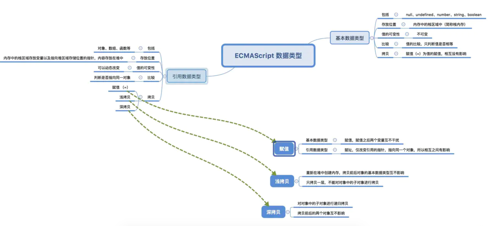
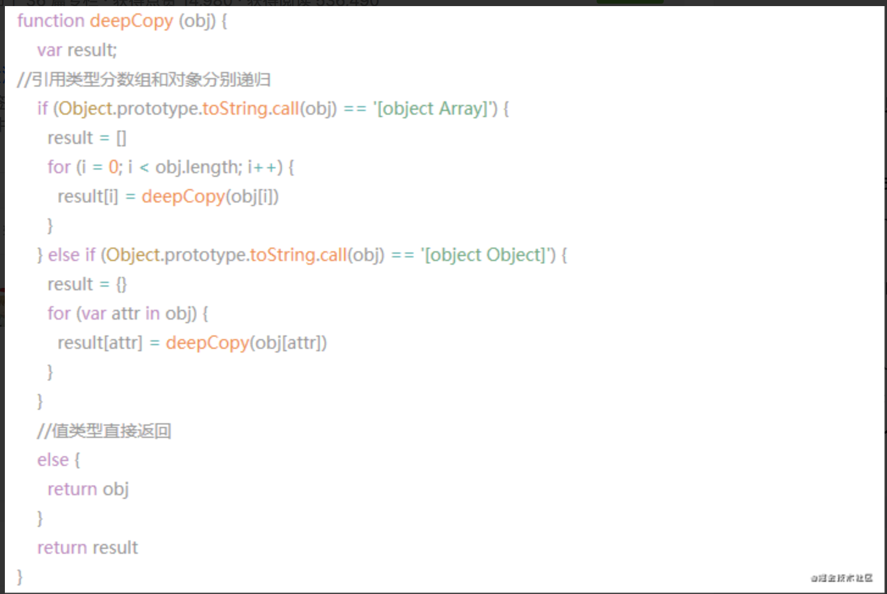

# 面试如何写出一个满意的深拷贝(适合初级前端)

## 前言

已经有很多关于`深拷贝与浅拷贝`的文章，为什么自己还要写一遍呢💯

> ❝
>
> 学习就好比是座大山，人们沿着不同的路登山，分享着自己看到的风景。你不一定能看到别人看到的风景，体会到别人的心情。只有自己去登山，才能看到不一样的风景，体会才更加深刻。
>
> ❞

分享一个不错的思维导图👇



通过文本的总结,希望可以明白：

- 什么是深拷贝/浅拷贝，他们与赋值有什么区别
- 深拷贝/浅拷贝实现方式有哪些

本章节直接从拷贝开始说起,对于基本数据类型，引用数据类型之前的区别,可以看看上面的思维导图👆

或者看看我之前的章节补一补基础,有写的不对的地方欢迎指出！

------

## 引用数据类型拷贝

对于引用数据类型的话，细分可以分为下面三个方面

- 赋值
- 浅拷贝
- 深拷贝

### 赋值

引用类型的赋值是传址。只是改变指针的指向，例如，引用类型的赋值是对象保存在栈中的地址的赋值，这样的话两个变量就指向同一个对象，因此两者之间操作互相有影响。例如：

```
var a = {}; // a保存了一个空对象的实例
var b = a;  // a和b都指向了这个空对象

a.name = 'jozo';
console.log(a.name); // 'jozo'
console.log(b.name); // 'jozo'

b.age = 22;
console.log(b.age);// 22
console.log(a.age);// 22

console.log(a == b);// true
复制代码
```


这样子的情况,会导致a和b指向同一份数据,对其中一个进行修改数据的话,会影响到另外一个，实际开发中,这不是我们预期中的结果,这会照成某种程度上的bug。

那么我们如何不让相互之间产生影响呢？一种简单的办法就是拷贝一份a变量的数据,所以**「根据拷贝的层次不同可以分为浅拷贝和深拷贝」**，浅拷贝的话知识进行一层拷贝，深拷贝的话是无限层次的拷贝！

我们先来实现一个浅拷贝

```
  let shallowClone = source => {
            let target = {}
            for(let i in source) {
                if( source.hasOwnProperty(i) ) 
                    target[i] = source[i];
            }
            return target
        }
        let demo = {
            b:{
                c : {
                }
            }
        }
        let demo2 = shallowClone(demo)
        let demo3 = demo;
        console.log(demo3 === demo )             // true
        console.log(demo2.b.c === demo.b.c )    // true
        console.log(demo2.b === demo.b )       // true
        console.log(demo2 === demo )          // false
复制代码
```

demo3 = demo 赋值的话,是地址的赋值,也就是说指向同一个对象，那么不是我们想要的结果，我们来看看shallowClone函数,这个是浅拷贝的一种实现方式,那么demo2变量应该就是实现了一层的拷贝，正如20行效果，demo2变量是在堆中开了一个新内存，所以两者指向不同对象，demo2.b === demo.b 为 true 说明 这就是浅拷贝效果，简单的拷贝一层，那么我们是不是可以递归的思想去完成深拷贝呢?

------

## 浅拷贝的实现方式

#### Object.assign()

`Object.assign()` 方法用于将所有可枚举属性的值从一个或多个源对象复制到目标对象。它将返回目标对象。

```
  let demo = {
            name : 'dayday',
            book : {
                title : 'Do you really Know JS',
                price : "45"
            }
        }
        let clone_demo = Object.assign({}, demo)
        console.log(clone_demo);
        demo.name = 'new name'
        demo.book.price = '100'
        console.log(clone_demo.name,clone_demo.book.price);  
        // dayday 100
复制代码
```

修改上面代码demo变量之后，对象clone_demo基本属性没有改变，但是修改demo对象中book引用属性时，对象clone_demo相应位置属性值也发生改变，同样的接下来展开运算符也是一样效果👇

#### 展开运算符...

```
  let demo = {
            name : 'dayday',
            book : {
                title : 'Do you really Know JS',
                price : "45"
            }
        }
        let clone_demo = {...demo}
        console.log(clone_demo);
        demo.name = 'new name'
        demo.book.price = '100'
        console.log(clone_demo.name,clone_demo.book.price);  
        // dayday 100
复制代码
```

我们可以看到展开运算… 效果跟Object.assign() 效果是一样的。

#### Array.prototype.slice()

`slice()` 方法返回一个新的数组对象，这一对象是一个由 `begin`和 `end`（不包括`end`）决定的原数组的**「浅拷贝」**。原始数组不会被改变。

```
let a = [0, "1", [2, 3]];
let b = a.slice(1);
console.log(b);
// ["1", [2, 3]]

a[1] = "99";
a[2][0] = 4;
console.log(a);
// [0, "99", [4, 3]]

console.log(b);
//  ["1", [4, 3]]
复制代码
```

可以看出，改变 `a[1]` 之后 `b[0]` 的值并没有发生变化，但改变 `a[2][0]` 之后，相应的 `b[1][0]` 的值也发生变化。说明 `slice()` 方法是浅拷贝，相应的还有`concat`等，在工作中面对复杂数组结构要额外注意。

------

## 深拷贝实现方式

深拷贝会拷贝所有的属性，并拷贝属性指向的动态分配的内存。当对象和它所引用的对象一起拷贝时即发生深拷贝。深拷贝相比于浅拷贝速度较慢并且花销较大。拷贝前后两个对象互不影响。

#### JSON.parse(JSON.stringify(obj))

```
  let demo = {
            name : 'dayday',
            book : {
                title : 'Do you really Know JS',
                price : "45"
            }
        }
        let clone_demo = JSON.parse(JSON.stringify(demo))
        console.log(clone_demo);
        demo.name = 'new name'
        demo.book.price = '100'
        console.log(clone_demo.name,clone_demo.book.price);  
        // dayday 45
复制代码
```

完全改变变量 demo 之后对 clone_demo 没有任何影响，这就是深拷贝的魔力。

同样的对于数组使用该方法也是可以达到深拷贝的。

##### 注意的就是：

- 会忽略undefined Symbol
- 不能序列化函数
- 不能解决循环引用的对象
- 不能正确处理 new Date()
- 不能处理正则

对于`undefined` `symbol` `函数`三种情况会直接忽略

```
  let demo = {
            name : 'dayday',
            h1 : undefined,
            h2 : Symbol('dayday'),
            h3 : function () {},
        }
        let clone_demo = JSON.parse(JSON.stringify(demo))
        console.dir(clone_demo)
        // { name : 'dayday' }
复制代码
```

循环引用情况下，会报错。

```
let obj = {
    a: 1,
    b: {
        c: 2,
     d: 3
    }
}
obj.a = obj.b;
obj.b.c = obj.a;

let b = JSON.parse(JSON.stringify(obj));
// Uncaught TypeError: Converting circular structure to JSON
复制代码
```

`new Date` 情况下，转换结果不正确。

```
new Date();
// Wed Jul 01 2020 16:19:07 GMT+0800 (中国标准时间) {}

JSON.stringify(new Date());
// ""2020-07-01T08:19:19.860Z""

JSON.parse(JSON.stringify(new Date()));
// "2020-07-01T08:19:35.569Z"

复制代码
```

解决方法转成字符串或者时间戳就好了

```
let date = (new Date()).valueOf();
// 1593591638596

JSON.stringify(date);
// "1593591638596"

JSON.parse(JSON.stringify(date));
// 1593591638596
复制代码
```

正则情况下

```
let demo = {
    name: "daydaylee",
    a: /'123'/
}
console.log(demo);
// {name: "daydaylee", a: /'123'/}

let clone_demo = JSON.parse(JSON.stringify(obj));
console.log(clone_demo);
// {name: "daydaylee", a: {}}
复制代码
```

**「PS：为什么会存在这些问题可以学习一下 JSON」**

除了上面介绍的深拷贝方法，常用的还有`jQuery.extend()` 和 `lodash.cloneDeep()`，由于文章篇幅的问题，这里就不多介绍了，有兴趣的可以自己去了解了解

## 面试如何实现一个深拷贝

面试官叫你实现一个深拷贝的话，你只要记得浅拷贝+递归，浅拷贝的时候，去判断是不是一个对象就行的，是对象的话，就进行递归操作。

之前的简单浅拷贝：

```
let shallowClone = source => {
            let target = {}
            for(let key in source) {
                if(Object.prototype.hasOwnProperty.call(source, key)){
                    target[key] = typeof source[key] === 'object' ? shallowClone(source[key]) : source[key];
                }
            }
            return target
        }
        let demo = {
            name : 'dayday',
            book : {
                title : 'Do you really Know JS',
                price : "45"
            }
        }
        let clone_demo = shallowClone(demo);
        console.log(clone_demo);
        demo.name = 'new name'
        demo.book.price = '100'
        console.log(clone_demo.name,clone_demo.book.price) 
        // dayday 45
复制代码
```

写到这里，至少一个简单的深克隆实现了，但是还是有些问题没有解决！

- 没有考虑数组的写法
- 对对象的判断逻辑不严谨，因为`typeof null === object`
- 没有对传入参数校验，比如传入null 应该返回 null 而不是 {}

------

首先的写一个兼容数组并且判断null方法的函数

```
let isObject = obj => typeof obj === 'object' && obj !== null ;
复制代码
```

那么进一步完善了深度拷贝的方法

```
  // 保留数组 并且判断是不是null
        let isObject = obj => typeof obj === 'object' && obj !== null ;
        let shallowClone2 = source => {
            
            if(!isObject(source))  return source      // 非对象返回自身
            let target = Array.isArray(source) ? [] : {}
            for(let key in source) {
                if(Object.prototype.hasOwnProperty.call(source, key)){
                    target[key] = isObject(source[key]) ? shallowClone2(source[key]) : source[key];
                }
            }
            return target
        }
        let demo = {
            name : 'dayday',
            book : {
                title : 'Do you really Know JS',
                price : "45"
            },
            h1 : null,
            h2 : [1,2,3],
            h3 : undefined
        }
        let clone_demo = shallowClone2(demo);
        console.log(clone_demo);
        demo.name = 'new name'
        demo.book.price = '100'
        demo.h2[1] = 'new data'
        console.log(clone_demo.name,clone_demo.book.price) 
        // dayday 45
        console.log(clone_demo);   
        // 修改demo值为能影响clone_demo
复制代码
```

这篇文章写的很好：[深拷贝的终极探索（99%的人都不知道）](https://segmentfault.com/a/1190000016672263)

它还对深度拷贝有了新的优化，比如JSON.parse(JSON.stringify(obj))循环引用抛出异常的问题，做出了优化，那我们试着去优化这个小问题。

- 哈希表

对于循环检测的话，我们可以使用哈希检测的方法，比如设置一个数组或者是已经拷贝的对象，当检测到对象已经存在哈希表时，就取出该值🤭

```
let isObject = obj => typeof obj === 'object' && obj !== null;
        let shallowClone3 = (source, hash = new WeakMap()) => {

            if (!isObject(source)) return source // 非对象返回自身
            if (hash.has(source)) return hash.get(source) // 新增检测, 查哈希表
            let target = Array.isArray(source) ? [] : {}
            hash.set(source, target) // 设置哈希表值
            for (let key in source) {
                if (Object.prototype.hasOwnProperty.call(source, key)) {
                    target[key] = isObject(source[key]) ? shallowClone3(source[key], hash) : source[key]; // 传入哈希表
                }
            }
            return target
        }
        let obj = {
            a: 1,
            b: {
                c: 2,
                d: 3
            }
        }
        obj.a = obj.b;
        obj.b.c = obj.a;
        let clone_obj = shallowClone3(obj)
        console.log(clone_obj)
复制代码
```

写完这段代码的话，至少面试实现一个这样子的深拷贝马马虎虎过的去，当然了还是有很多的问题需要解决的:

- 比如拷贝一个Symbol类型的值该这么解决
- 这么解决递归爆栈问题

当然了有兴趣的读者可以深入的了解呐🚀

## 总结

| --     | 和原数据是否指向同一对象 | 第一层数据为基本数据类型         | 原数据中包含子对象               |
| ------ | ------------------------ | -------------------------------- | -------------------------------- |
| 赋值   | 是                       | 改变会使原数据一同改变           | 改变会使原数据一同改变           |
| 浅拷贝 | 否                       | 改变**「不」**会使原数据一同改变 | 改变会使原数据一同改变           |
| 深拷贝 | 否                       | 改变**「不」**会使原数据一同改变 | 改变**「不」**会使原数据一同改变 |

## 参考

[JavaScript深拷贝的一些坑](https://juejin.im/post/6844903621021138957)

[面试题之如何实现一个深拷贝](https://github.com/yygmind/blog/issues/29)

[深入剖析 JavaScript 的深复制](https://jerryzou.com/posts/dive-into-deep-clone-in-javascript/)

[MDN展开语法](https://developer.mozilla.org/zh-CN/docs/Web/JavaScript/Reference/Operators/Spread_syntax)

[MDN之Object.assign()](https://developer.mozilla.org/zh-CN/docs/Web/JavaScript/Reference/Global_Objects/Object/assign)

[深拷贝的终极探索（99%的人都不知道）](https://segmentfault.com/a/1190000016672263)

本文使用 [mdnice](https://mdnice.com/) 排版


# 简易版

